# Lab1 Array_patitioning_cyclic_block_complete

<script type="text/x-mathjax-config">
  MathJax.Hub.Config({
    tex2jax: {
        inlineMath: [ ['$','$'], ["\\(","\\)"] ],
        displayMath: [ ['$$','$$'], ["\\[","\\]"] ],
        processEscapes: false,
    }
  });
</script> 
    
<script type="text/javascript"
        src="https://cdn.mathjax.org/mathjax/latest/MathJax.js?config=TeX-AMS-MML_HTMLorMML">
</script>

## Introduction

In Vitis HLS, arrays can be partitioned into blocks or individual elements, controlled by auto-partitioning settings. Block partitioning uses RTL RAM blocks for parallel access, while element partitioning treats each element as an RTL register. This trade-off impacts performance versus the number of required RAMs or registers. Auto-partitioning settings offer flexibility to find the optimal balance based on design requirements.

## Optimization

In the optimization process, we'll use a square matrix as an example. Matrix multiplication is a binary operation where two matrices produce another matrix. The key condition is that the number of rows in the first matrix must equal the number of columns in the second matrix for a valid product. This requirement ensures the matrices are conformable for multiplication.

### The unoptimized code

Following code shows a highly unoptimized version of  square matrix  in HLS. in the header file (matrix_cyclic_block.h), this code uses ```typedef``` to define the datatype of different variables. Datatype of all three variables (```stream_in```,```stream_in2```, and ```stream_out```) are int (32 bit) in this example. ```hls::axis<int,0,0,0>``` from ```ap_axi_sdata.h``` packs int into a standarded AXI4-Stream Interfaces datatype, namely, data_t_pack. ([Ref](https://docs.xilinx.com/r/en-US/ug1399-vitis-hls/How-AXI4-Stream-is-Implemented)) Finally, ```hls::stream<data_t_pack>``` from ```hls_stream.h``` creates a HLS stream (also an AXIs datatype) datatype, ```d_stream```. The block level interface of the kernel (how the kernel is triggered, ```port=return```, [Ref](https://docs.xilinx.com/r/en-US/ug1399-vitis-hls/pragma-HLS-interface)) is set as ```ap_ctrl_none```, which means the kernel is always ready to receive new data (free-running kernel).

**matrix_cyclic_block.h**
```c++

/*
Filename: matrix_cyclic_block.h
	Header file
	Array_patitioning_cyclic_block lab
*/

#ifndef _MATRIX_CYCLIC_BLOCK_H
#define _MATRIX_CYCLIC_BLOCK_H

#include "hls_stream.h"
#include "ap_axi_sdata.h"
#include "ap_fixed.h"

#define N 4

typedef hls::axis<int,0,0,0> data_t_pack;
typedef hls::stream<data_t_pack> d_stream;

void matrix_cyclic_block(d_stream &stream_in,d_stream &stream_out, d_stream &stream_in2);

#endif

```

**matrix_cyclic_block.cpp**

```c++
#include"matrix_cyclic_block.h"
void matrix_cyclic_block(d_stream &stream_in,d_stream &stream_out, d_stream &stream_in2)
{
#pragma HLS INTERFACE ap_ctrl_none port=return
#pragma HLS INTERFACE mode=AXIS port=stream_in register_mode=off
#pragma HLS INTERFACE mode=AXIS port=stream_out register_mode=off
#pragma HLS INTERFACE mode=AXIS port=stream_in2 register_mode=off

	data_t_pack valuein;
	data_t_pack valuein2;
	data_t_pack valueout;

	valuein.keep=-1;
	valueout.keep=-1;
	valuein.last=0;
	valueout.last=0;

	int A[N][N];
	int B[N][N];

read_A_and_C:
	for(int i=0;i<N;i++)
	{
		for(int j=0;j<N;j++)
		{
			valuein=stream_in.read();
             // valuein as an AXI4-stream input includes data, keep, and last. 
			valuein2=stream_in2.read();
			A[i][j]=valuein.data;
			B[i][j]=valuein2.data;
		}
	}
Matrix_Loop:
	for(int i=0;i<N;i++){
		for(int j=0;j<N;j++){
			int result=0;
			for(int k=0;k<N;k++){
				result+=A[i][k]*B[k][j];
			}
			valueout.data=result;
			stream_out.write(valueout);
			if(i==N-1&&j>N-3)
			{
				valueout.last=1;
                //when the interface is writing the second to last data, we need to set the last signal to 1, and when the last data is written, the last signal is 1
			}
		}
	}


}

```
**matrix_cyclic_block_tb.cpp**
```c++
/*
	Filename: matrix_cyclic_block.h
		Testbench file
		Calls matrix_cyclic_block() function from matrix_cyclic_block.cpp
*/

#include "matrix_cyclic_block.h"


int main()
{
	d_stream datain;
	d_stream datain2;
	d_stream dataout;

	data_t_pack indata;
	data_t_pack outdata;

	for(int i=0;i<N*N;i++)
	{
		indata.data=i;
		datain.write(indata);
		datain2.write(indata);
	}
matrix_cyclic_block(datain,dataout,datain2);
	for(int k=0;k<N*N;k++)
	{
		outdata=dataout.read();
		printf("dataout[%d] is %d\r\n",k,outdata.data);
	}

}

```
 Then we should add the ```matrix_cyclic_block``` as the top function like below:

<div align=center>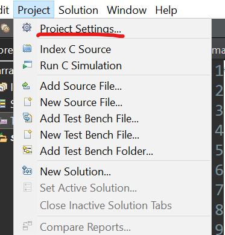</div>

<div align=center>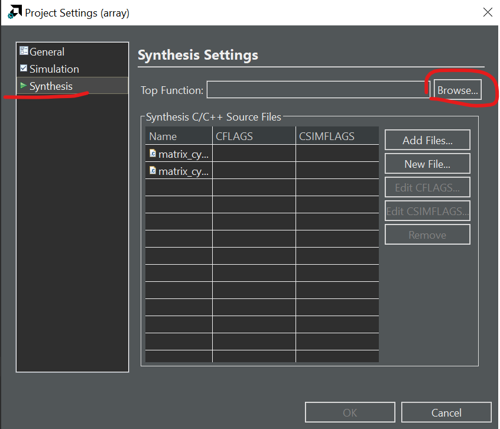</div>

Then we can choose the function we want to run the C synthesis.

<div align=center>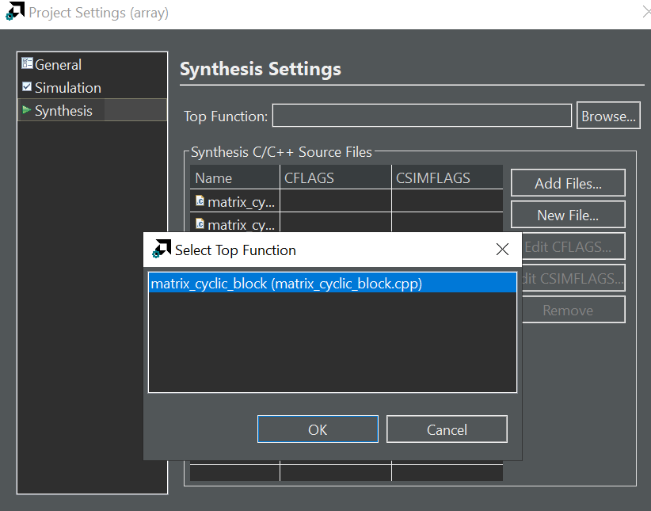</div>

Then we can click the green button ```Run C Synthesis``` like below:

<div align=center>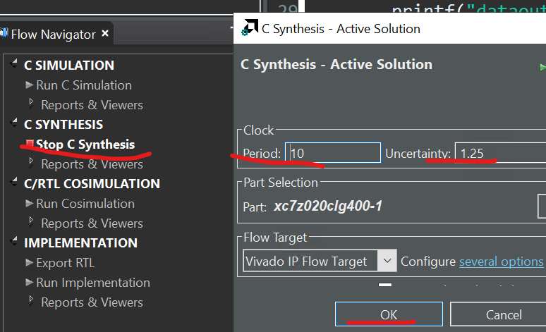</div>

You can see the synthesis report as shown below:

<div align=center>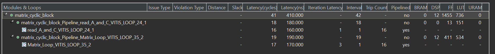</div>

Suppose we have two matrices, $A$ and $B$, with the following dimensions:

Matrix A:  

$$
\begin{equation}
A = \left[\begin{matrix}
a_{11}&a_{12}\\
a_{21}&a_{22}\\
\end{matrix}\right]
\end{equation}
$$

Matrix B:

$$
\begin{equation}
B = \left[\begin{matrix}
b_{11}&b_{12}\\
b_{21}&b_{22}\\
\end{matrix}\right]
\end{equation}
$$


The resulting matrix $C=A*B$ will be a 2×2 matrix, and we can compute each element of $C$ using the formula:

$$c_{ij}=\sum_{k=1}^2a_{ik}\cdot b_{kj}$$

Now, let's plug in the specific values for $A$ and $B$:

$$
\begin{equation}
C = \left[\begin{matrix}
a_{11} . b_{11} + a_{12} . b_{21}&a_{11} . b_{12} + a_{12} . b_{22}\\
a_{21} . b_{11} + a_{22} . b_{21}&a_{21} . b_{11} + a_{22} . b_{21}\\
\end{matrix}\right]
\end{equation}
$$


The resulting matrix $C$ will have dimensions $m×p$, where $m$ is the number of rows in $A$ and $p$ is the number of colums in $B$. Each element $c_{ij}$ in matrix $C$ is obtained by taking the dot product of the i-th row of matrix $A$ and the j-th colunm of matrix $B$.

Matrix multiplication involves accessing elements in a sequential manner. When matrices become large, it can lead to poor cache performance, as data may not fit into the fast cache memory, causing more frequent fetches from slower main memory. This is why the unoptimized core loop (Matrix_Loop) has II = 4.

### Optimization 1

#### block

The original array is split into equally sized blocks of consecutive elements of the original array.

#### cyclic

The original array is split into equally sized blocks interleaving the elements of the original array.

For block and cyclic partitioning the factor option specifies the number of arrays that are created. In the following figure, a factor of 2 is used, that is, the array is divided into two smaller arrays. If the number of elements in the array is not an integer multiple of the factor, the final array has fewer elements [Ref](https://docs.xilinx.com/r/en-US/ug1399-vitis-hls/Array-Accesses-and-Performance).

<!-- <div align=center>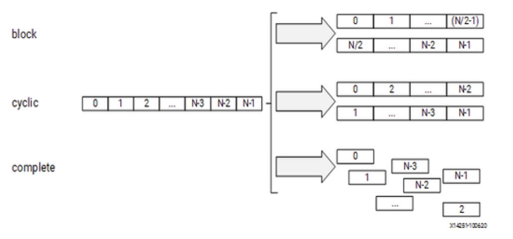</div> -->

<div align=center></div>

The Above optimization is suitable for the multiplication of matrices. Array Partition splits apart the original array into smaller arrays or into individual registers. And the actual matrix A and matrix B will be:

Matrix A:  

$$
\begin{equation}
A = \left[\begin{matrix}
a_{11}&a_{12}\\
a_{21}&a_{22}\\
\end{matrix}\right]
\end{equation}
$$

Matrix B:

$$
\begin{equation}
B = \left[\begin{matrix}
b_{11}&b_{21}\\
b_{12}&b_{22}\\
\end{matrix}\right]
\end{equation}
$$


<div align=center>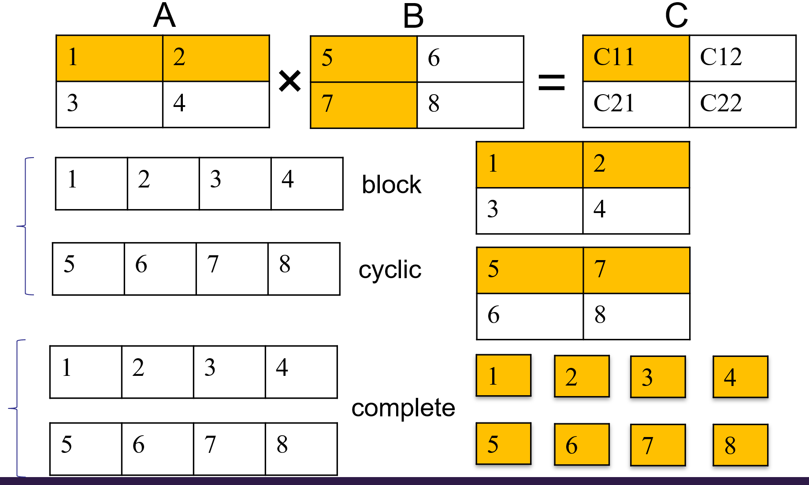</div>


```c++

	int A[N][N];
	int B[N][N];
#pragma HLS ARRAY_PARTITION variable=A type=cyclic dim=1 factor=4
#pragma HLS ARRAY_PARTITION variable=B type=block dim=1 factor=4
//variable: This indicates the array variable that you want to partition. Replace A with the actual name of your array.
//dim = 1: This specifies the dimension along which the array should be partitioned. In this case, it's dimension 1, which corresponds to the first dimension in C/C++ arrays
//(rows for 2D arrays).
//cyclic: This keyword specifies that the array should be partitioned cyclically. This means that the elements of the array will be distributed cyclically among the partitions.
//factor = 4: This specifies the partitioning factor. In this case, each partition will contain 4 elements of the array.

```

After reading a matrix through the AXIS stream interface in the form of a one-dimensional array, the matrix is stored in two separate two-dimensional arrays, $A$ and $C$. And optimizating the code as shown in the above. Subsequently, matrix multiplication is performed. As result, the core loop (Matrix_Loop) has II = 1 and the the II of the IP block is 41.


### Optimization 2

#### complete

The default operation is to split the array into its individual elements. This corresponds to resolving a memory into registers.

```c++

	int A[N][N];
	int B[N][N];
#pragma HLS ARRAY_PARTITION variable=A type=complete dim=0
#pragma HLS ARRAY_PARTITION variable=B type=complete dim=0 


```

## Simulation

In Vitis HLS, there are two types of simulations, C simulation, and C/RTL Cosimulation. In C simulation, Vitis HLS runs the kernel (matrix_cyclic_block) as pure software. The pragmas do not take effect in C simulation. C/RTL cosimulation first compiles the kernel into HDL hardware kernel and then generates the interface between the test bench and hardware kernel. Calling the ```matrix_cyclic_block``` function launches the hardware simulation if the block level interface is not ```ap_ctrl_none```. In this example, the ```matrix_cyclic_block``` kernel doesn't require any start signal. Calling the kernel just passes the data into it. Such a free-running kernel performs differently in C simulation and Cosimulation ([Ref](https://docs.xilinx.com/r/en-US/ug1393-vitis-application-acceleration/Free-Running-Kernel)). 

To run the simulation, simply clock the C simulation or C/RTL cosimulation in the Flow Navigator (bottom right). You should see the *PASS* if everything is good. When running the Cosimulation, you can change the *Dump Trace* option to *all* before launching. Then, once the simulation is finished, you can click the *Wave Viewer* to see the waveform from the simulation. You can check if the actual II matches the report with the waveform.  

## Implementation

### Export matrix_cyclic_block IP

To generate the IP, you should do several steps in the below.

* Launch Vitis HLS: Open Xilinx Vitis HLS directly launch it from your system.

* Create a New Project: Start a new project in Vitis HLS. Specify the project name, location, and target device or platform. Here we can choose the device as below.

<div align=center>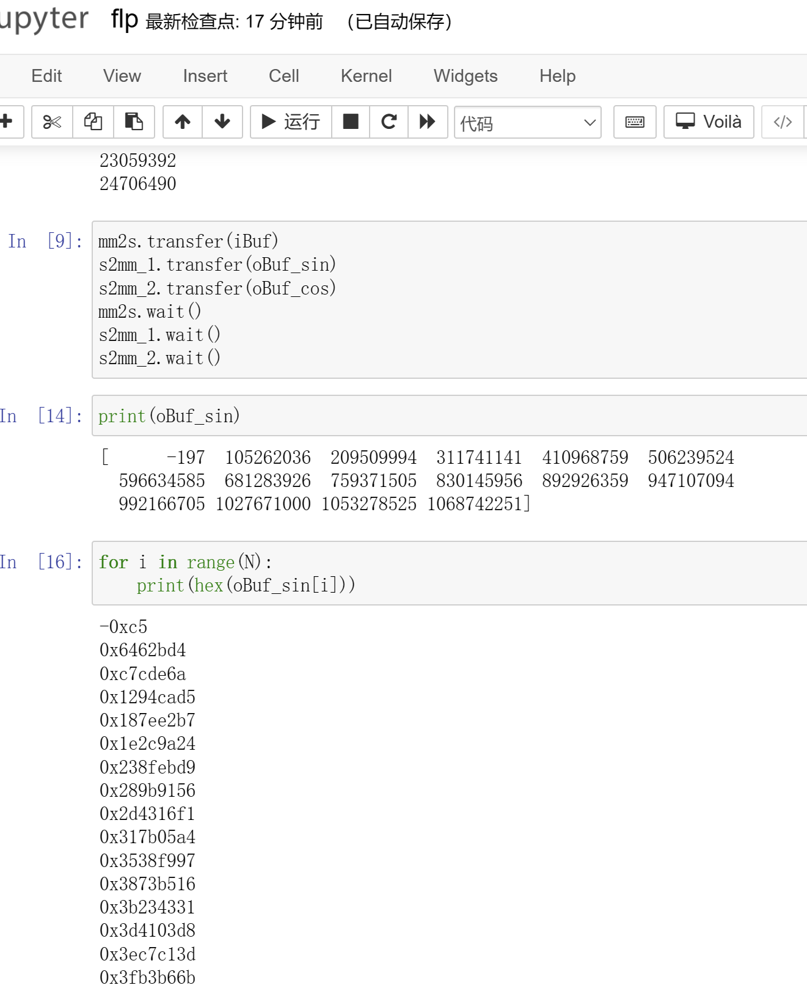</div>

* Write or Import Code: Write your hardware function in C, C++, or SystemC. This code will describe the behavior you want to implement in hardware. Alternatively, you can import 
existing C/C++ code if available and you can click the green button "Run C Simulation" to verify the result of the function.

<div align=center></div>

* Optimize and Synthesize: After writing or importing your code, use Vitis HLS to synthesize and optimize the code and you can click the green button "Run C Synthesis". The tool will generate a hardware description from your high-level code as shown in the below.

* Verify and Test: Verify the synthesized hardware behavior using test benches or co-simulation. Ensure that the hardware function behaves as expected. If the result of the Cosimulation is **PASS**, you can export the IP. At the same time, you can also click "Wave Viewer" to see the result of the input and output data of the IP.

<div align=center>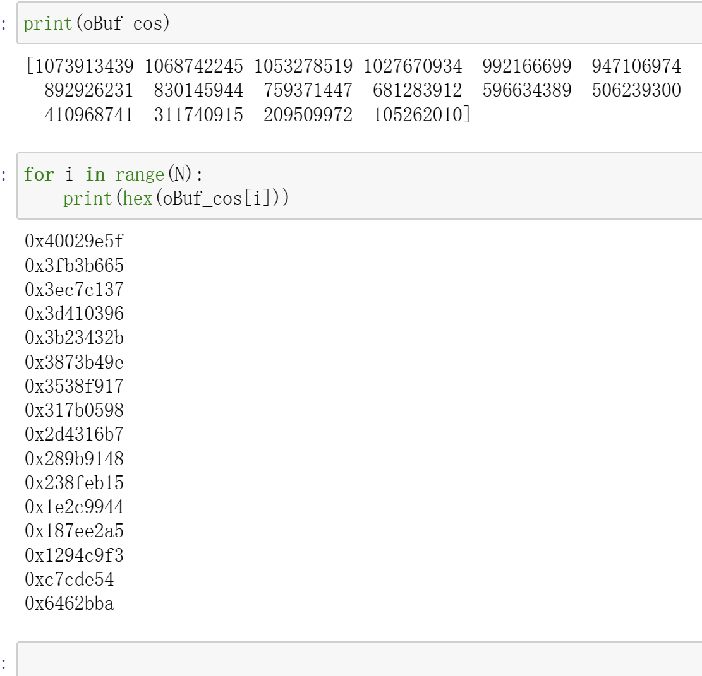</div>

* Generate IP Core: Once you have verified the hardware behavior and are satisfied with the synthesis results, you can generate an IP core from the synthesized hardware function.
In Vitis HLS, go to the "Solution" tab and select "Export RTL..." or a similar option depending on your version of Vitis HLS. Follow the prompts to generate an IP core.
This process will generate the necessary VHDL or Verilog files and associated metadata to create an IP core that you can integrate into your Vivado FPGA or SoC design.

### Create Vivado Project

* Click *Create New Project*, and click *Next*. Then, give your project a name (i.e. project_1) and choose *RTL Project*. Making sure the *Project location* is the correct path that you want to save the project.

* Select the board, search `pynq` and choose `pynq-z2`, then click *Next* and *Finish*. If you do not have it, follow the instruction in the provided link below.

  [Add BSP file to Vivado](https://pynq.readthedocs.io/en/latest/overlay_design_methodology/board_settings.html)

<div align=center></div>

### Create Block design

In the block diagram which should contain the ZYNQ PS block, and when you create the block design, you need to set the ZYNQ Processing System as shown below.

<div align=center>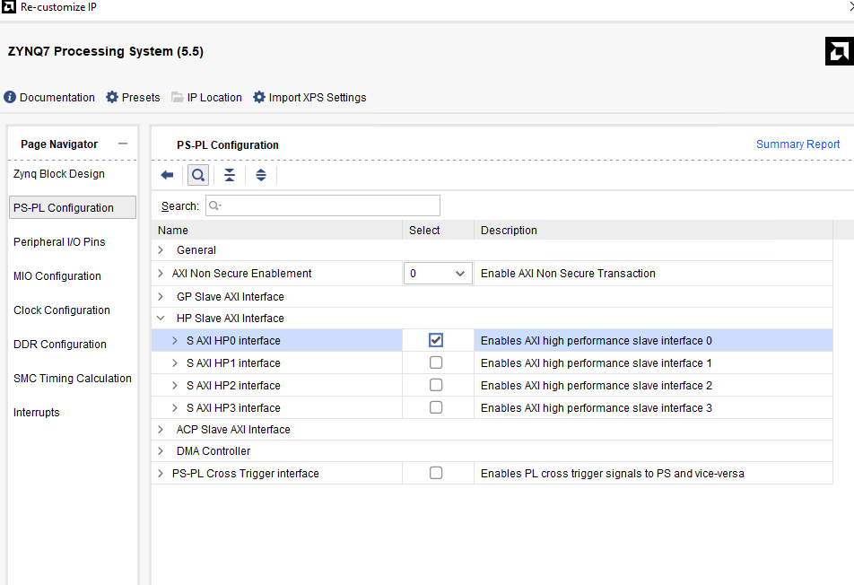</div>

Select the corresponding DDR model.

<div align=center>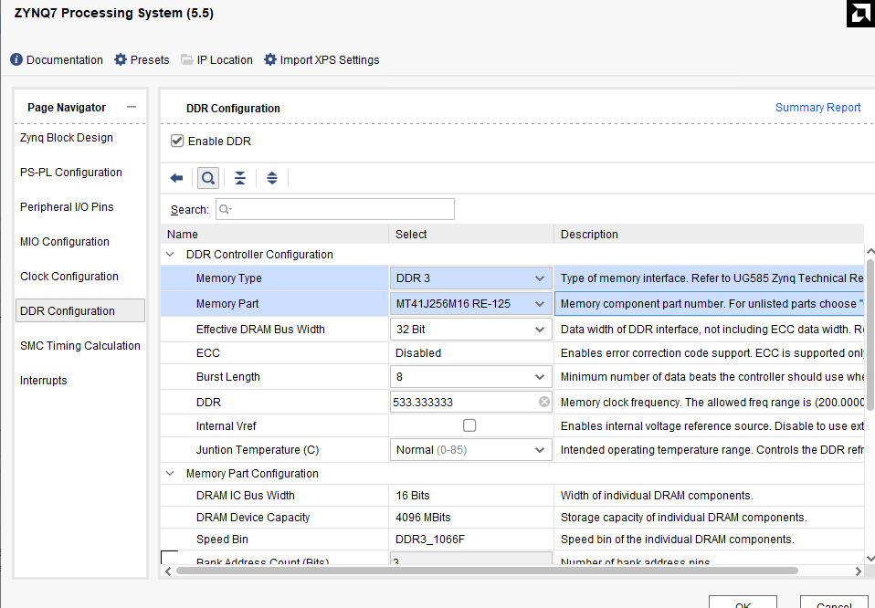</div>

In the Output Clocks option, change the output frequency to 100M Hz.

<div align=center>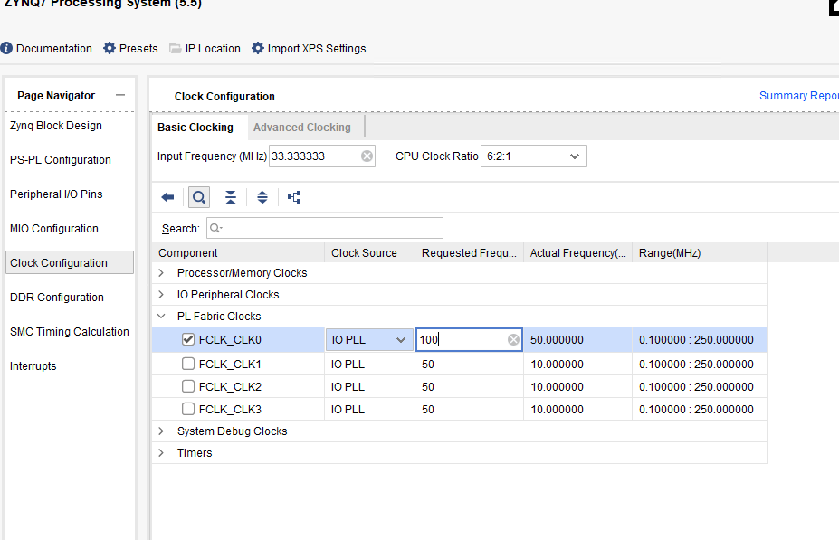</div>

And then click the green word "Run Block Automation" 

<div align=center>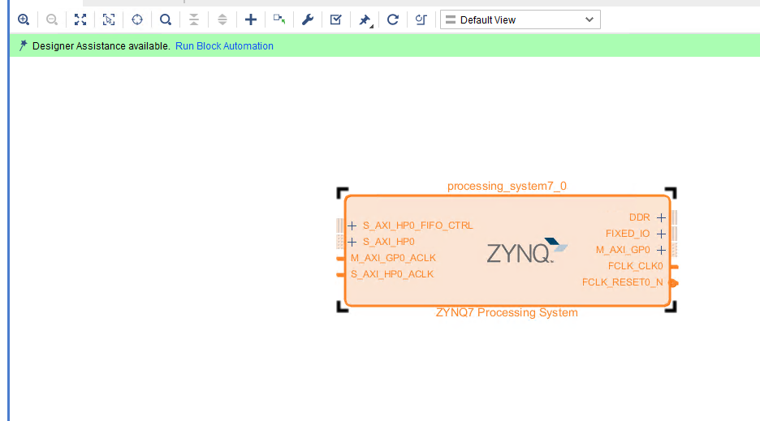</div>

Add the *AXI Direct Memory Access* block to your design. Also, we need to add the IP we export by HLS. The IP core features two input interfaces, each accepting data from distinct sources while providing a single output interface that delivers the processed or combined result. In our FPGA design, the custom IP core leverages AXI_DMA for efficient data transfer. As we all know, the AXI_DMA typically consists of separate channels for read and write operations. And the write channel is used for writing data from the source to the memory and the read channel is used for reading data from memory to the destination. Emphasize that the read and write channels operate independently. The read channel can be configured, initiated, and managed separately from the write channel. The advantages of having a separate read channel: 

<div align=center>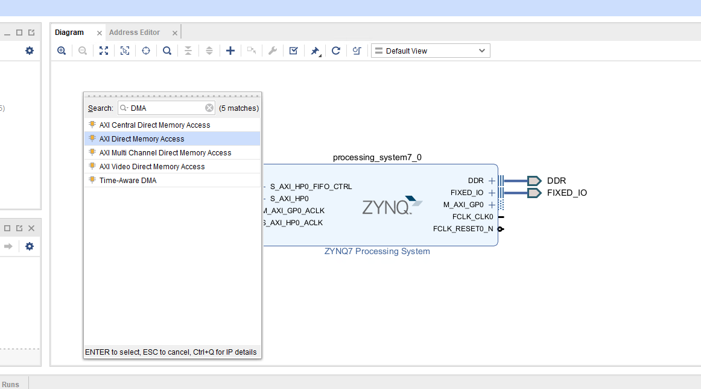</div>

* Concurrent Operations: Enables concurrent read and write operations for improved performance.

* Efficient Data Flow: Facilitates efficient data flow within the FPGA design.

### Configure the DMA

* Double click the DMA to open the configuration settings

<div align=center>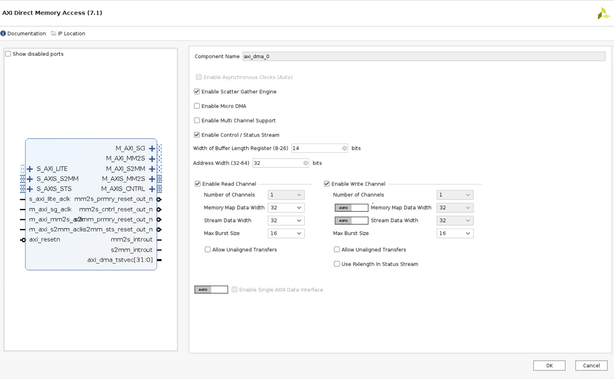</div>

* Uncheck Enable Scatter Gather Engine to disable Scatter Gather

* Set the Width of Buffer Length Register to 26

    This value determines the maximum packet size for a single DMA transfer. width = 26 allows transfers of 67,108,863 bytes - the maximum size the DMA supports. I usually set this value to the maximum value of 26. If you know you will never need more than a smaller size transfer, you can set this to a smaller value and save a small amount of PL resources. I prefer to set the maximum value for flexibility as the hardware resource increase is relatively modest.

    When using the DMA if you try to do a transfer but only see that the first part of your buffer is transferred , check this value in your hardware design and check how much data you are transferring. Leaving the default with set to 14-bits is a common mistake which will limit the DMA to 16,384 byte transfers. If you try to send more than this the transfer will terminate once the maximum number of bytes supported is transferred. Remember to check the size of the transfer in bytes.

* Check the address width is set to 32. In this example, I will connect the DMA to the PS memory which is 32-bit for Zynq. You can set this up to 64-bit if you are connecting this to a larger memory, for example, if you are using a Zynq Ultrascale+ or if your DMA is connected to a PL connected memory.

* For this design, leave only read channel enabled because the IP has two input interfaces and one output interface.

* Set the stream data to match your IP stream width. In this example, I will leave it set to 32.

* Make sure Allow unaligned transfers is NOT enabled

* Click OK to accept the changes

<div align=center>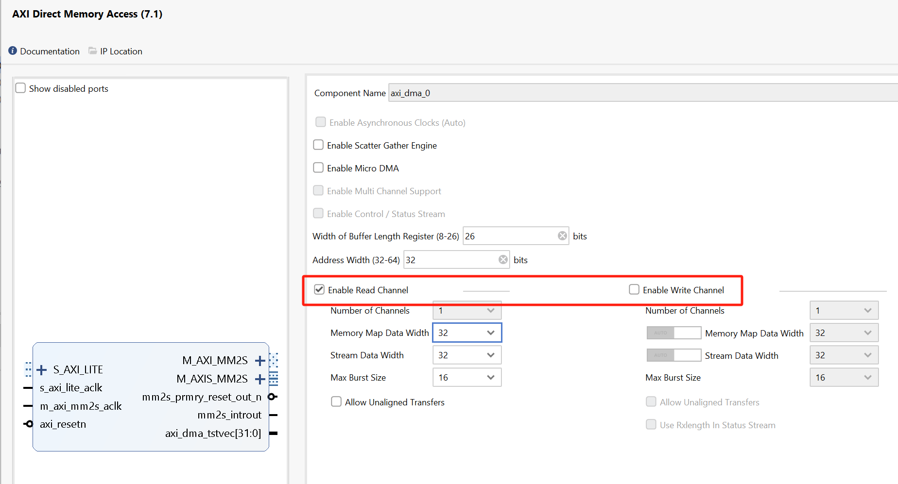</div>

Each interface can be individually configured based on the specific requirements of the associated data stream for the IP. Each AXI_DMA interface can be configured and controlled separately, providing flexibility and scalability for handling diverse data sources within our FPGA system. We have deliberately configured AXI_DMA0 and AXI_DMA1 with only the read channels enabled and configured AXI_DMA2 with only the write channel enabled. This design choice is driven by the predominant data flow requirements of our IP core, which involves receiving data from memory.   

<div align=center>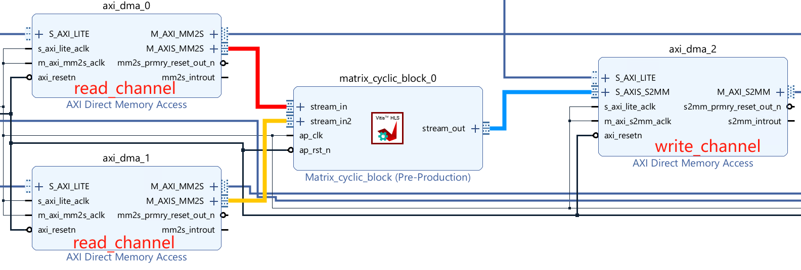</div>

Then connect the DMA which can use reference materials [here](https://uri-nextlab.github.io/ParallelProgammingLabs/Labs/Lab6_DMA.html).

## Run synthesis,  Implementation and generate bitstream

It may shows some errors about I/O Ports, please fix them.

## Download the bitstream file to PYNQ

The first step is to allocate the buffer. pynq allocate will be used to allocate the buffer, and NumPy will be used to specify the type of the buffer.

```python
from pynq import Overlay
from pynq import allocate
import numpy as np
hw = Overlay("design_1_wrapper.bit")
hw ?

We can use the ? to check the IP dictionary.
```

<div align=center></div>

### Create DMA instances

Using the labels for the DMAs listed above, we can create three DMA objects.

```python

s2mm_0=hw.axi_dma_0.sendchannel
s2mm_1=hw.axi_dma_1.sendchannel
mm2s = hw.axi_dma_2.recvchannel
```

### Read DMA

The first step is to allocate the buffer. pynq.allocate will be used to allocate the buffer, and NumPy will be used to specify the type of the buffer.

```python
N=16
oBuf = allocate(shape=(N,), dtype = np.int32)
iBuf_0 = allocate(shape=(N,), dtype = np.int32)
iBuf_1 = allocate(shape=(N,), dtype = np.int32)
output_buffer[:] = 0
for i in range(N):
    iBuf_0[i] = i
    iBuf_1[i] = i
    print(iBuf_0[i])
```

Print the value of input_buffer, you will see:

<div align=center></div>

```python
s2mm_0.transfer(iBuf_0)
s2mm_1.transfer(iBuf_1)
mm2s.transfer(oBuf)


```

We will see:

<div align=center>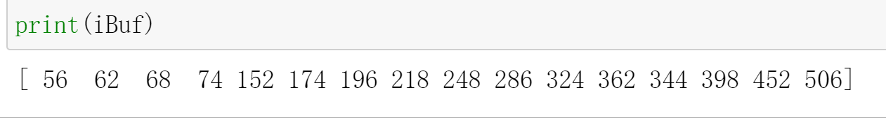</div>
