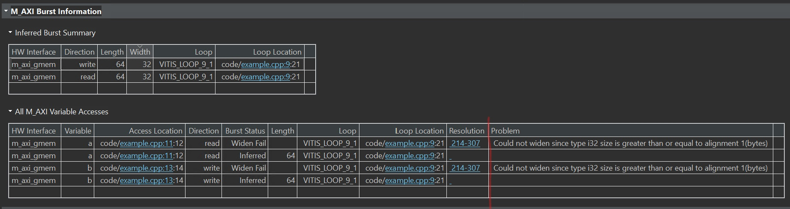
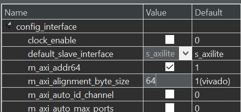
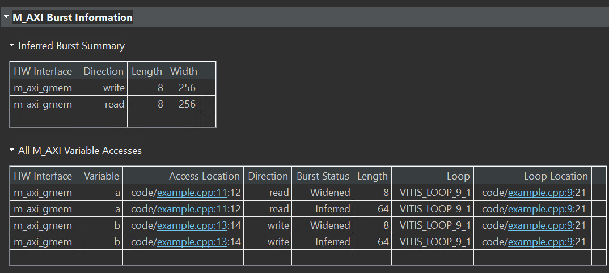
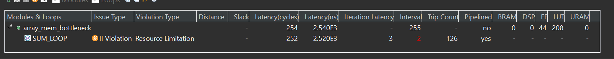
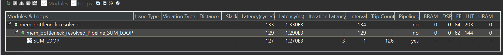
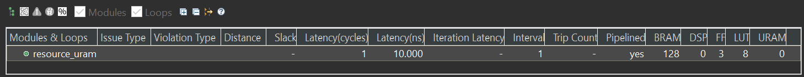
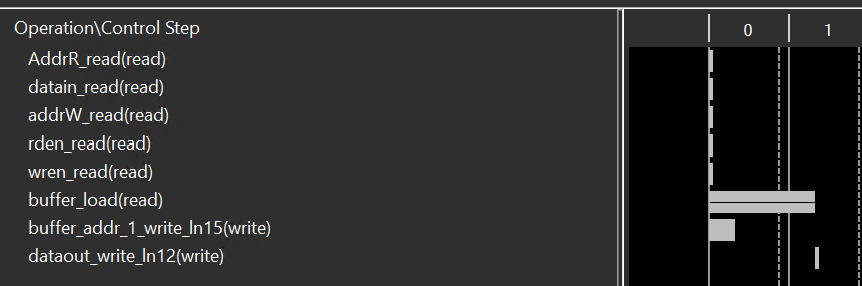

# Lab10 Interface_Memory_3

<script type="text/x-mathjax-config">
  MathJax.Hub.Config({
    tex2jax: {
        inlineMath: [ ['$','$'], ["\\(","\\)"] ],
        displayMath: [ ['$$','$$'], ["\\[","\\]"] ],
        processEscapes: false,
    }
  });
</script> 
    
<script type="text/javascript"
        src="https://cdn.mathjax.org/mathjax/latest/MathJax.js?config=TeX-AMS-MML_HTMLorMML">
</script>

## max_widen_port_width

**Automatic Port Width Resizing**

In the Vitis tool flow, Vitis HLS can automatically re-size the ```m_axi``` interface ports to 512 bits to improve burst access. However, automatic port width resizing only supports standard C data types and power of two sizes ```struct```, where the pointer is aligned to the expected widened byte size. If the tool cannot automatically widen the port, you can manually change the port width by using Vector or Arbitrary Precision (AP) as the data type of the port.
Structs on the interface prevent the automatic widening of the port. You must break the structure into individual elements to enable this feature.
Vitis HLS controls automatic port width resizing using the following two commands:

* ```syn.interface.m_axi_max_widen_bitwidth=<N>```: Directs the tool to widen bursts on M-AXI automatically interfaces up to the specified bitwidth. The value of <N> must be a power-of-two between 0 and 1024.

* ```syn.interface.m_axi_alignment_byte_size=<N>```: Note that burst widening also requires strong alignment properties. Assume pointers mapped to ```m_axi``` interfaces are at least aligned to the provided width in bytes (power of two). This can help automatic burst widening.


This example shows how to enable automatic port widening for m_axi ports in the Vivado IP flow. In the Vitis kernel flow, the following two config_interface settings are on by default. Only in the Vivado IP flow do you have to set them explicitly.

**example.h**
```c++
#ifndef EXAMPLE__H_
#define EXAMPLE__H_

#include <cstdlib>
#include <iostream>

constexpr uint64_t N = 64;
constexpr uint64_t MAXWBW = 256;

void example(int a[N], int b[N]);

#endif
```

**example.cpp**
```c++
#include "example.h"
using namespace std;

//The function adds 100 to each input data and then outputs
//Input: a[N]
//Output: b[N] 
void example(int a[N], int b[N]) {
#pragma HLS INTERFACE m_axi port = a depth = N bundle =                        \
    gmem max_widen_bitwidth = MAXWBW
#pragma HLS INTERFACE m_axi port = b depth = N bundle = gmem
#pragma HLS INTERFACE mode=s_axilite port=return
    int buff[N];
    for (size_t i = 0; i < N; ++i) {
#pragma HLS PIPELINE II = 1
        buff[i] = a[i];
        buff[i] = buff[i] + 100;
        b[i] = buff[i];
    }
}
```
The synthesis report is shown below.

<div align=center></div>

<div align=center></div>

And we define the ```m_axi_alignment_byte_size``` 64 as shown below.

<div align=center></div>

The config_interface options can be found as below:

<div align=center></div>

The result is shown below.

<div align=center></div>

**example_tb.cpp**
```c++
#include "example.h"
using namespace std;

int main() {
    int in[N], res[N];
    for (size_t i = 0; i < N; ++i)
        in[i] = i;

    example(in, res);

    size_t err = 0;
    for (int i = 0; i < N; ++i)
        if (res[i] != i + 100)
            return EXIT_FAILURE;

    cout << "Test passed.\n";
    return EXIT_SUCCESS;
}
```

#### Create the Vivado project

The configure block design can use reference materials [here](https://uri-nextlab.github.io/ParallelProgammingLabs/HLS_Labs/Lab1.html). And we need to choose the number of the DMA according to the number of the interface.

<div align=center></div>

#### Run synthesis,  Implementation, and generate bitstream

It may show some errors about I/O Ports, please fix them.

#### Download the bitstream file to PYNQ

<div align=center></div>


```python
import numpy as np
import pynq
from pynq import MMIO
overlay = pynq.Overlay('design_1.bit')
overlay?
```
<div align=center></div>

#### Allocate DMA memory address size

The first step is to allocate the buffer. pynq allocate will be used to allocate the buffer, and NumPy will be used to specify the buffer type.

```python


top_ip = overlay.example_0
top_ip.signature

a_buffer = pynq.allocate((64), np.int32)
b_buffer = pynq.allocate((64), np.int32)

# initialize input
for i in range (0, 64):
    a_buffer[i] = i+1
```


```python
aptr = a_buffer.physical_address
bptr = b_buffer.physical_address

top_ip.register_map
```

<div align=center></div>

```python
# specify the address
# These addresses are in the generated .v file: vadd_control_s_axi.v
top_ip.write(0x10, aptr)
top_ip.write(0x1C, bptr)
# start the HLS kernel
top_ip.write(0x00, 1)
```

We will see:

<div align=center></div>

## memory_bottleneck

In a previous section, optimization concepts such as loop unrolling and pipelining were introduced to explore parallelism. However, this was done without considering how array access patterns may prevent such optimizations when the arrays are mapped to memories instead of registers. Arrays mapped to memories can become the bottleneck in a design’s performance. Vitis HLS provides several optimizations, such as array reshaping and partitioning, that can remove these memory bottlenecks. These automatic memory optimizations should be used whenever possible, minimizing the number of code modifications. However, there may be situations where explicitly coding the memory architecture is required to meet performance or may allow designers to achieve an even better quality of results. In these cases, array accesses must be coded so as not to limit performance. This means analyzing array access patterns and organizing the memories in a design to achieve the desired throughput and area. The following code example shows a case in which access to an array can limit performance in the final RTL design. In this example, three accesses exist to the array ```mem[N]``` to create a summed result.

**mem_bottleneck.h**
```c++
#ifndef _ARRAY_MEM_BOTTLENECK_H_
#define _ARRAY_MEM_BOTTLENECK_H_

#include <fstream>
#include <iostream>
using namespace std;

#include "ap_int.h"
#define N 128

typedef ap_int<7> din_t;
typedef ap_int<10> dout_t;

dout_t array_mem_bottleneck(din_t mem[N]);

#endif

```
**mem_bottleneck.cpp**
```c++
#include "mem_bottleneck.h"

//The function adds three consecutive adjacent data in the array mem[N]
//Input: mem[N]
//Output: the return of the function
dout_t array_mem_bottleneck(din_t mem[N]) {

    dout_t sum = 0;
    int i;

SUM_LOOP:
    for (i = 2; i < N; ++i)
        sum += mem[i] + mem[i - 1] + mem[i - 2];

    return sum;
}

```
The synthesis report is shown  below.

<div align=center></div>


The issue is that the single-port RAM has only a single data port: only one read (or one write) can be performed in each clock cycle.

* SUM_LOOP Cycle1: read mem[i];

* SUM_LOOP Cycle2: read mem[i-1], sum values;

* SUM_LOOP Cycle3: read mem[i-2], sum values;mem_bottleneck_test.cpp**

A dual-port RAM could be used, but this allows only two accesses per clock cycle. Three reads are required to calculate the value of the sum, and so three accesses per clock cycle are required to pipeline the loop with a new iteration every clock cycle.

The code in the example above can be rewritten as shown in the following code example to allow the code to be pipelined with a throughput of 1. In the following code example, by performing pre-reads and manually pipelining the data accesses, only one array read is specified in each iteration of the loop. This ensures that only a single-port RAM is required to achieve the performance.

**mem_bottleneck_resolved.cpp**
```c++

//The function performs the same effect but uses a more effective way
dout_t mem_bottleneck_resolved(din_t mem[N]) {

    din_t tmp0, tmp1, tmp2;
    dout_t sum = 0;
    int i;

    tmp0 = mem[0];
    tmp1 = mem[1];
SUM_LOOP:
    for (i = 2; i < N; i++) {
        tmp2 = mem[i];
        sum += tmp2 + tmp1 + tmp0;
        tmp0 = tmp1;
        tmp1 = tmp2;
    }

    return sum;
}
```

The synthesis report is shown  below.

<div align=center></div>

Such changes to the source code as shown above are not always required. The typical case is to use optimization directives/pragmas to achieve the same result. Vitis HLS includes optimization directives for changing how arrays are implemented and accessed. There are two main classes of optimization:

* Array Partition splits the original array into smaller arrays or individual registers.

* Array Reshape reorganizes the array into a different memory arrangement to increase parallelism without splitting the original array apart.

```c++

#include "mem_bottleneck.h"

int main() {
    din_t A[N];
    dout_t sum;

    int i, retval = 0;


    // Create input data
    for (i = 0; i < N; ++i) {
        A[i] = i;
    }


    // Call the function
    sum = mem_bottleneck_resolved(A);
    printf("sum is  %d\r\n",sum);

}
```

## ram_uram

This example illustrates how to infer a RAM using BIND_STORAGE[Ref](https://docs.xilinx.com/r/en-US/ug1399-vitis-hls/pragma-HLS-bind_storage). ```#pragma DEPENDENCE``` is necessary for achieving II=1[Ref](https://docs.xilinx.com/r/en-US/ug1399-vitis-hls/pragma-HLS-dependence)

**pragma HLS dependence**

Vitis HLS detects dependencies within loops: dependencies within the same iteration of a loop are loop-independent dependencies, and dependencies between different iterations of a loop are loop-carried dependencies. The DEPENDENCE pragma allows you to provide additional information to define, and negate loop dependencies, and allow loops to be pipelined with lower intervals.

**Loop-independent dependence**

The same element is accessed in a single loop iteration.
```c++
for (i=1;i<N;i++) {
 A[i]=x;
 y=A[i];
}
```

**Loop-carried dependence**

The same element is accessed from a different loop iteration.
```c++
for (i=1;i<N;i++) {
 A[i]=A[i-1]*2;
}
```
These dependencies impact when operations can be scheduled, especially during function and loop pipelining.

Under some circumstances, such as variable dependent array indexing or when an external requirement needs to be enforced (for example, two inputs are never the same index), the dependence analysis might be too conservative and fail to filter out false dependencies. The DEPENDENCE pragma allows you to define the dependencies and eliminate a false dependence explicitly.

**Syntax**
Place the pragma within the boundaries of the function where the dependence is defined.

```c++
#pragma HLS dependence variable=<variable> <class> \
<type> <direction> distance=<int> <dependent>
```

Where:

```variable=<variable>```: Optionally specifies the variable to consider for the dependence.
You cannot specify a ```dependence``` for function arguments bundled with other arguments in an ```m_axi``` interface. This is the default configuration for ```m_axi``` interfaces on the function. You also cannot specify a dependence for an element of a struct, unless the struct has been disaggregated.

```class=[array | pointer]```: Optionally specifies a class of variables in which the dependence needs clarification. Valid values include an array or pointer.
```<class>``` and ```variable=``` should not be specified together as you can specify dependence for a variable, or a class of variables within a function.

```type=[inter | intra]```: Valid values include intra or inter. Specifies whether the dependence is:

```intra```: Dependence within the same loop iteration. When dependence ```<type> ```is specified as ```intra```, and ```<dependent>``` is false, the HLS tool might move operations freely within a loop, increasing their mobility and potentially improving performance or area. When ```<dependent>``` is specified as true, the operations must be performed in the order specified.
```inter```: dependence between different loop iterations. This is the default ```<type>```. If dependence <type> is specified as ```inter```, and ```<dependent>``` is false, it allows the HLS tool to perform operations in parallel if the function or loop is pipelined, or the loop is unrolled, or partially unrolled, and prevents such concurrent operation when ```<dependent>``` is specified as true.

```direction=[RAW | WAR | WAW]```: This is relevant for loop-carry dependencies only, and specifies the direction for a dependence:

```RAW``` (Read-After-Write - true dependence)

The write instruction uses a value used by the read instruction.

```WAR``` (Write-After-Read - anti dependence)

The read instruction gets a value that is overwritten by the write instruction.

```WAW``` (Write-After-Write - output dependence)

Two write instructions write to the same location, in a certain order.

```distance=<int>```: Specifies the inter-iteration distance for array access. Relevant only for loop-carry dependencies where dependence is set to ```true```.

```<dependent>```: The ```<dependent>``` argument should be specified to indicate whether a dependence is ```true``` and needs to be enforced, or is ```false``` and should be removed. However, when not specified, the tool will return a warning that the value was not specified and will assume a value of ```false```. The accepted values are ```true``` or ```false```.

**resource_uram.h**
```c++

#include <fstream>
#include <iomanip>
#include <iostream>
using namespace std;

#define ADDRBITS 14
#define NWORDS 1 << ADDRBITS

// Switch between regular and hw data types
#if 0
typedef int data_t;
typedef int addr_t;
#else
#include "ap_int.h"
#define DATAWIDTH 128
typedef ap_uint<DATAWIDTH> data_t;
typedef ap_uint<ADDRBITS> addr_t;
#endif

void resource_uram(bool wren, bool rden, addr_t addrW, data_t datain,
                   addr_t AddrR, data_t* dataout);
```

**resource_uram.cpp**
```c++
#include "resource_uram.h"

//The function performs read or write on the array buffer according to the input
//Input: wren, rden, addrW, datain, AddrR
//Output: dataout
void resource_uram(bool wren, bool rden, addr_t addrW, data_t datain,
                   addr_t AddrR, data_t* dataout) {
#pragma HLS PIPELINE II = 1

    static data_t buffer[NWORDS];
#pragma HLS DEPENDENCE variable = buffer inter WAR false
//The read instruction gets a value that is overwritten by the write instruction

#pragma HLS BIND_STORAGE variable = buffer type = ram_2p impl = bram
//The device has no uram, so we use bram
//ram_2p:  A dual-port RAM that allows read operations on one port and both read and write operations on the other port.
    if (rden)
        *dataout = buffer[AddrR];

    if (wren)
        buffer[addrW] = datain;
}
```
The synthesis report is shown below.

<div align=center></div>

We can see the schedule viewer as shown below.

<div align=center></div>


**resource_uram_tb.cpp**
```c++
#include "resource_uram.h"

int main() {
    addr_t addrwrite, addrread;
    data_t data, dataout;
    int i, j, retval = 0, errors = 0;

    // Write data (square of the address)
    for (i = 0; i < 10; i++) {
        resource_uram(1, 0, i, i * i, addrread, &dataout);
        cout << "Write address =" << right << setw(3) << i << endl;
        cout << "Write data    =" << right << setw(3) << i * i << endl;
    }

    // Read data & check
    for (j = 0; j < 10; j++) {
        resource_uram(0, 1, addrwrite, data, j, &dataout);
        cout << "Read address =" << right << setw(3) << j << endl;
        cout << "Read data    =" << right << setw(3) << dataout << endl;

        errors += dataout != j * j;
    }
}
```
## Demonstrate
You need to finish the example for the ```max_widen_port_width``` and implement it on the PYNQ-Z2 board.
