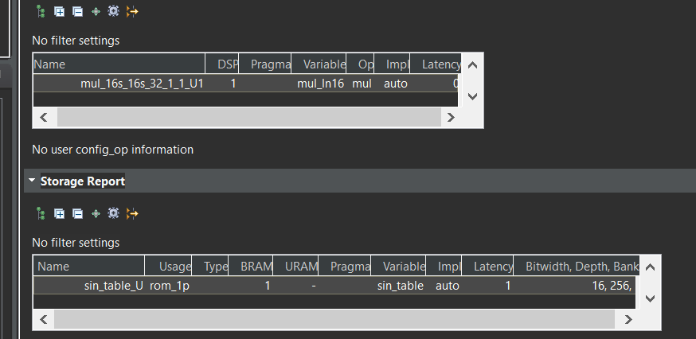
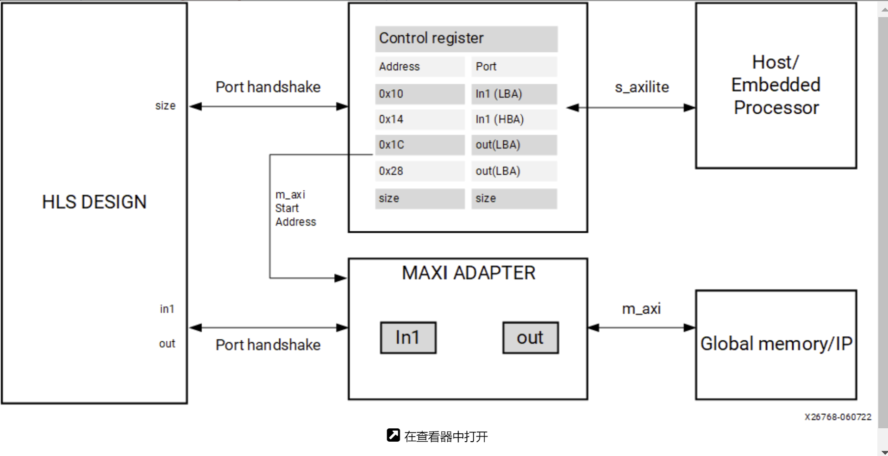
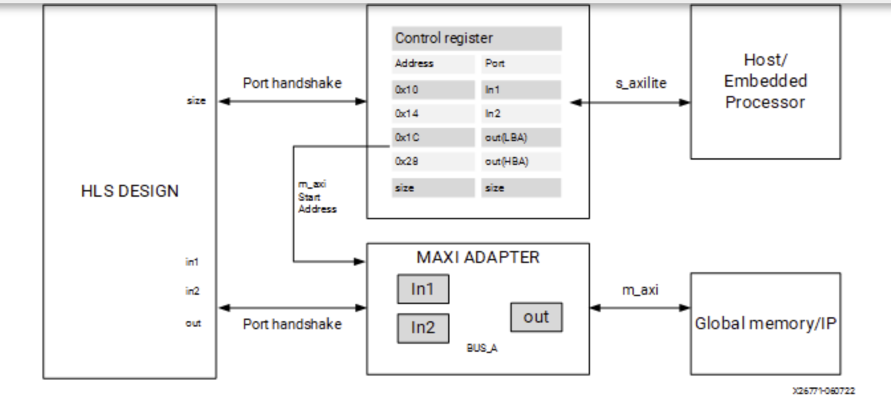
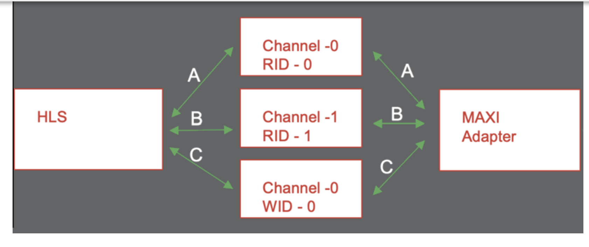
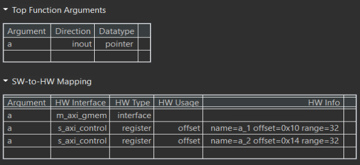
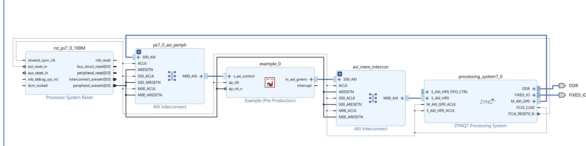
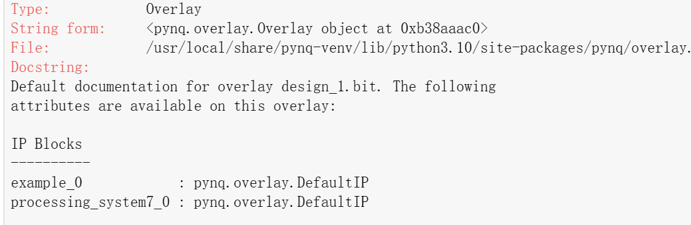
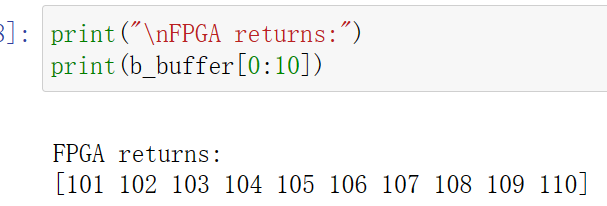

# Lab11 Interface_Memory_4

<script type="text/x-mathjax-config">
  MathJax.Hub.Config({
    tex2jax: {
        inlineMath: [ ['$','$'], ["\\(","\\)"] ],
        displayMath: [ ['$$','$$'], ["\\[","\\]"] ],
        processEscapes: false,
    }
  });
</script> 
    
<script type="text/javascript"
        src="https://cdn.mathjax.org/mathjax/latest/MathJax.js?config=TeX-AMS-MML_HTMLorMML">
</script>

## rom_lookup_table_math

This example illustrates how to infer a lookup table implemted as ROM with pre-calculated content

**lookup_math.h**
```c++
#ifndef _LOOKUP_MATH_H_
#define _LOOKUP_MATH_H_

#include <fstream>
#include <iostream>
using namespace std;

typedef short din1_t;
typedef unsigned char din2_t;
typedef double dint_t;
typedef int dout_t;

#define M_PI 3.14159265358979323846

dout_t lookup_math(din1_t inval, din2_t idx);

#endif
```

**lookup_math.cpp**
```c++
#include "lookup_math.h"
#include <math.h>

//The function computes the sine of the i and stores them on the array sin_table
//Output: sin_table[256]

void init_sin_table(din1_t sin_table[256]) {
    int i;
    for (i = 0; i < 256; i++) {
        dint_t real_val = sin(M_PI * (dint_t)(i - 128) / 256.0);
        sin_table[i] = (din1_t)(32768.0 * real_val);
    }
}

//The function performs multiplication by calling init_sin_table function
//Input: inval and idx
//Output: the return of the function
dout_t lookup_math(din1_t inval, din2_t idx) {
    short sin_table[256];
    init_sin_table(sin_table);
    return (int)inval * (int)sin_table[idx];
}
```

The function ```init_sin_table``` precomputes a sine table for efficient lookup of sine values and stores the scaled value in the ```sin_table```.
The function ```lookup_math``` performs a lookup and multiplication using the sine table and returns the result as a ```dout_t``` type.

The ```sin_table``` array is declared a regular array, but its contents are initialized at compile time with pre-computed values. This static nature makes it suitable for ```ROM``` implementation. The ```lookup_math``` function directly accesses the ```sin_table``` elements using the ```idx``` index, without any dynamic memory allocation or modification.
This read-only behavior aligns with ```ROM``` characteristics.

<div align=center></div>

**lookup_math_test.cpp**
```c++

#include "lookup_math.h"

int main() {
    din1_t data1_i = 1;
    din2_t data2_i = 100;
    dout_t data_o;

    int i, retval = 0;
    ofstream FILE;

    // Save the results to a file
    FILE.open("result.dat");

    // Call the function for multiple transactions
    for (i = 0; i < 64; i++) {
        data_o = lookup_math(data1_i, data2_i);
        FILE << data_o << endl;
        data1_i = data1_i + 1;
        data2_i = data2_i + 1;
    }
    FILE.close();

    // Compare the results file with the golden results
    retval = system("diff --brief -w result.dat result.golden.dat");
    if (retval != 0) {
        cout << "Test failed  !!!" << endl;
        retval = 1;
    } else {
        cout << "Test passed !" << endl;
    }

    // Return 0 if the test passes
    return retval;
}
```


## using_axi_master

AXI4 memory-mapped (```m_axi```) interfaces allow kernels to read and write data in global memory (DDR, HBM, PLRAM). Memory-mapped interfaces are a convenient way of sharing data across different elements of the accelerated application, such as between the host and kernel, or between kernels on the accelerator card. 

The main advantages for ```m_axi``` interfaces are listed below:

* The interface has separate and independent read and write channels

* It supports burst-based accesses with a potential performance of ~17 GBps

* It provides support for outstanding transactions

* It can include a cache to improve performance as indicated by the [CACHE](https://docs.xilinx.com/r/en-US/ug1399-vitis-hls/pragma-HLS-cache) pragma or directive.

You can use an AXI4 master interface on array or pointer/reference arguments, which Vitis HLS implements in one of the following modes:

* Individual data transfers

* Burst mode data transfers

With individual data transfers, Vitis HLS reads or writes a single data element for each address. The following example shows a single read and single write operation. In this example, Vitis HLS generates an address on the AXI interface to read a single data value and an address to write a single data value. The interface transfers one data value per address.

```c++
void bus (int *d) {
 static int acc = 0;

 acc += *d;
 *d  = acc;
}
```
With burst mode transfers, Vitis HLS reads or writes data using a single base address followed by multiple sequential data samples, which makes this mode capable of higher data throughput. A Burst mode of operation is possible when using a pipelined ``` for``` loop.

The use of ```memory ``` is discouraged because it can not be inlined or pipelined. Its use can also be problematic because it changes the type of the argument into ```char```, which can lead to errors if ```array_partition```, ```array_reshape```, or struct ```disaggregate``` is used. Instead, you should write your own version of ```memcpy``` with explicit arrays and loops to provide better control.

When using a ```for``` loop to implement burst reads or writes, follow these requirements:

* Pipeline the loop

* Access addresses in increasing order

* Do not place accesses inside a conditional statement

* For nested loops, do not manually flatten loops (using LOOP_FLATTEN pragma or directive), because this inhibits the burst operation

Only one read and one write is allowed in a for loop unless the ports are bundled in different AXI ports.

**Offset and Modes of Operation**

In the Vitis kernel flow, the default mode of operation is ```offset=slave``` and should not be changed. In the Vivado IP flow, the default is also ```offset=slave```, but it can be changed.

The AXI4 Master interface has a read/write address channel that can be used to read/write specific addresses. By default the ```m_axi``` interface starts all read and write operations from the address ```0x00000000```.[Ref](https://docs.xilinx.com/r/en-US/ug1399-vitis-hls/Offset-and-Modes-of-Operation)

The ```m_axi``` interface can be both a master initiating transactions, and also a slave interface that receives the data and sends an acknowledgment. Depending on the mode specified with the ```offset``` option of the INTERFACE pragma, an HLS IP can use multiple approaches to set the base address.

**Master Mode**: When acting as a master interface with different offset options, the m_axi interface start address can be hard-coded or set at runtime.

```offset=off```: Sets the base address of the ```m_axi``` interface to 0x00000000 and it cannot be changed in the Vivado IP integrator. One disadvantage of this approach is that you cannot change the base address during runtime. See [Customizing AXI4 Master Interfaces in IP Integrator](https://docs.xilinx.com/r/en-US/ug1399-vitis-hls/Customizing-AXI4-Master-Interfaces-in-IP-Integrator)for setting the base address.

```offset=direct```: Vitis HLS generates a port on the IP for setting the address. Note the addition of the ```a``` port as shown in the figure below. This lets you update the address at runtime, so you can have one ```m_axi``` interface reading and writing different locations. For example, an HLS module that reads data from an ADC into RAM, and an HLS module that processes that data. Because you can change the address on the module, while one HLS module is processing the initial dataset the other module can be reading more data into different addresses.

```c++
void example(int *a){
#pragma HLS INTERFACE m_axi depth=50 port=a offset=direct
...
}

```

**Slave Mode**: The slave mode for an interface is set with ```offset=slave```. In this mode, the IP will be controlled by the host application or the microcontroller through the ```s_axilite``` interface. This is the default for both the Vitis kernel flow and the Vivado IP flow. Here is the flow of operation:

* Initially, the Host/CPU will start the IP or kernel using the block-level control protocol mapped to the ```s_axilite``` adapter.

* The host will send address offsets for the ```m_axi``` interfaces through the ```s_axilite``` adapter.

* The ```m_axi``` adapter will read the start address from the ```s_axilite``` adapter and store it in a queue.

* The HLS design starts to read the data from the global memory.

As shown in the following figure, the HLS design will have both the ```s_axilite``` adapter for the base address, and the ```m_axi``` to perform read and write transfer to the global memory.

<div align=center></div>

**Offset Rules**

The following are rules associated with the ```offset``` option:

* Fully Specified Offset: When the user explicitly sets the offset value the tool uses the specified settings. The user can also set different offset values for different ```m_axi``` interfaces in the design, and the tool will use the specified offsets.

```c++
#pragma HLS INTERFACE s_axilite port=return
#pragma HLS INTERFACE mode=m_axi bundle=BUS_A port=out offset=direct
#pragma HLS INTERFACE mode=m_axi bundle=BUS_B port=in1 offset=slave
#pragma HLS INTERFACE mode=m_axi bundle=BUS_C port=in2 offset=off
```

* No Offset Specified: If no offsets are specified in the INTERFACE pragma, the tool will defer to the setting specified by ```syn.interface.m_axi_offset```.

If the global ``` syn.interface.m_axi_offset``` setting is specified, and the design has an ```s_axilite``` interface, the global setting is ignored and ```offset=slave``` is assumed.

```c++
void top(int *a) {
#pragma HLS interface mode=m_axi port=a
#pragma HLS interface mode=s_axilite port=a
}
```

**M_AXI Bundles**

Bundling ports into a single interface helps save FPGA resources by eliminating AXI logic. Still, it can limit the performance of the kernel because all the memory transfers have to go through a single interface. The ```m_axi``` interface has independent READ and WRITE channels so that a single interface can read and write simultaneously, though only at one location. Using multiple bundles the bandwidth and throughput of the kernel can be increased by creating multiple interfaces to connect to multiple memory banks.

In the following example, all the pointer arguments are grouped into a single ```m_axi``` adapter using the interface option ```bundle=BUS_A```, and adds a single ```s_axilite``` adapter for the m_axi offsets, the scalar argument size, and the function return. [Ref](https://docs.xilinx.com/r/en-US/ug1399-vitis-hls/M_AXI-Bundles)

```c++
extern "C" {
void vadd(const unsigned int *in1, // Read-Only Vector 1
          const unsigned int *in2, // Read-Only Vector 2
          unsigned int *out,     // Output Result
          int size                 // Size in integer
          ) {
 
#pragma HLS INTERFACE mode=m_axi bundle=BUS_A port=out
#pragma HLS INTERFACE mode=m_axi bundle=BUS_A port=in1
#pragma HLS INTERFACE mode=m_axi bundle=BUS_A port=in2
#pragma HLS INTERFACE mode=s_axilite port=in1
#pragma HLS INTERFACE mode=s_axilite port=in2
#pragma HLS INTERFACE mode=s_axilite port=out
#pragma HLS INTERFACE mode=s_axilite port=size
#pragma HLS INTERFACE mode=s_axilite port=return

```

<div align=center></div>

**Bundle Rules**
The global configuration command ```syn.interface.m_axi_auto_max_ports=false``` will limit the number of interface bundles to the minimum required. It will allow the tool to group compatible ports into a single ```m_axi``` interface. The default setting for this command is disabled (false), but you can enable it to maximize bandwidth by creating a separate ```m_axi``` adapter for each port. If you bundle incompatible interfaces the tool issues a message and ignores the bundle assignment.

**M_AXI Channels**
M_AXI channels implement a separate channel for each pointer argument mapped to a single AXI interface, rather than requiring a separate adapter.

<div align=center></div>

This enables the following benefits:

* The kernel uses fewer M_AXI adapters and consumes fewer hardware resources.

* Multiple pointer arguments mapped to a single AXI interface can be used inside a dataflow region.

* Using a unique AXI ID for each pointer argument enables burst interleaving which can result in higher utilization of the AXI bus bandwidth.

There are two methods to enable this feature in your design:

* Enable globally on ```m_axi``` interfaces using the ```syn.interface.m_axi_auto_id_channel=true``` configuration command as described in [Interface Configuration](https://docs.xilinx.com/r/en-US/ug1399-vitis-hls/Interface-Configuration). When enabled, the HLS tool automatically adds channels to the ``m_axi`` adapter.

* Enable on a specific ```m_axi``` interface using the ```channel``` option of the INTERFACE pragma 

**M_AXI Resource**

The AXI Master Adapter converts the customized AXI commands from the HLS scheduler to standard AXI AMBA® protocol and sends them to the external memory. The MAXI adapter uses resources such as FIFO to store the requests/Data and ack. Here is the summary of the modules and the resources they consume:

* Write Module: The bus write modules perform the write operations.

* ```FIFO_wreq```: This FIFO module stores the future write requests. When the AW channel is available, a new write request to global memory will pop out of this FIFO.

* ```buff_wdata```: This FIFO stores the future write data that needs to be sent to the global memory. When the W channel is available and AXI protocol conditions are met, the write data of size= burst_length will be popped out of this FIFO and sent to the global memory.

* ```FIFO_resp```: This module controls the number of pipelined write responses sent to the module.

The device resource consumption of the M_AXI adapter is a sum of all the write modules (size of the ```FIFO_wreq module```, ```buff_wdata```, and size of FIFO_ resp) and the sum of all read modules. In general, the size of the FIFO is calculated as = Width * Depth. When you refer to a 1KB FIFO storage it can be one of the configurations such as 32*32, 8*64 etc, which are selected according to the design specification. [Ref](https://docs.xilinx.com/r/en-US/ug1399-vitis-hls/M_AXI-Resources)

**Controlling AXI4 Burst Behavior**

An optimal AXI4 interface is one in which the design never stalls while waiting to access the bus, and after bus access is granted, the bus never stalls while waiting for the design to read/write. To create the optimal AXI4 interface, the following options are provided in the INTERFACE pragma or directive to specify the behavior of burst access and optimize the efficiency of the AXI4 interface. Refer to [AXI Burst Transfers](https://docs.xilinx.com/r/en-US/ug1399-vitis-hls/AXI-Burst-Transfers) for more information on burst transfers.
A ```volatile``` qualifier on the variable prevents burst access to reado or write it.

Some of these options use internal storage to buffer data and can have an impact on area and resources:

* ```latency```: Specifies the expected latency of the AXI4 interface, allowing the design to initiate a bus request a number of cycles (latency) before the read or write is expected. If this figure is too low, the design will be ready too soon and can stall waiting for the bus. If this figure is too high, bus access might be granted but the bus can stall waiting on the design to start the access.

* ```max_read_burst_length```: Specifies the maximum number of data values read during a burst transfer.

* ```num_read_outstanding```: Specifies how many read requests can be made to the AXI4 bus, without a response, before the design stalls. This implies internal storage in the design, a FIFO of size: ```num_read_outstanding```*```max_read_burst_length```*```word_size```.

* ```max_write_burst_length```: Specifies the maximum number of data values written during a burst transfer.

* ``num_write_outstanding``: Specifies how many write requests can be made to the AXI4 bus, without a response, before the design stalls. This implies internal storage in the design, a FIFO of size: ```num_write_outstanding```*```max_write_burst_length```*```word_size```

This example illustrates how an input argument of a level function can be mapped to AXI4-MEM.

**example.cpp**
```c++
#include <stdio.h>
#include <string.h>

//The function adds 100 to the every input data and outputs
//Inout: a
void example(volatile int* a) {

#pragma HLS INTERFACE m_axi port = a depth = 50
#pragma HLS INTERFACE mode=s_axilite port=return
    int i;
    int buff[50];

    // memcpy creates a burst access to memory
    // multiple calls of memcpy cannot be pipelined and will be scheduled
    // sequentially memcpy requires a local buffer to store the results of the
    // memory transaction
    memcpy(buff, (const int*)a, 50 * sizeof(int));

    for (i = 0; i < 50; i++) {
        buff[i] = buff[i] + 100;
    }

    memcpy((int*)a, buff, 50 * sizeof(int));
}

```
The synthesis report is shown below.

<div align=center></div>


**example_tb.cpp**
```c++
#include <stdio.h>

void example(volatile int* a);

int main() {
    int i;
    int A[50];
    int B[50];

    printf("HLS AXI-Stream no side-channel data example\n");
    // Put data into A
    for (i = 0; i < 50; i++) {
        A[i] = i;
    }

    // Call the hardware function
    example(A);

    // Run a software version of the hardware function to validate results
    for (i = 0; i < 50; i++) {
        B[i] = i + 100;
    }

    // Compare results
    for (i = 0; i < 50; i++) {
        if (B[i] != A[i]) {
            printf("i = %d A = %d B= %d\n", i, A[i], B[i]);
            printf("ERROR HW and SW results mismatch\n");
            return 1;
        }
    }
    printf("Success HW and SW results match\n");
    return 0;
}
```
#### Create the Vivado project

The configure block design can use reference materials [here](https://uri-nextlab.github.io/ParallelProgammingLabs/HLS_Labs/Lab1.html). And we need to choose the number of the DMA according to the number of the interface.

<div align=center></div>

#### Run synthesis,  Implementation, and generate bitstream

It may show some errors about I/O Ports, please fix them.

#### Download the bitstream file to PYNQ

<div align=center></div>


```python
import numpy as np
import pynq
from pynq import MMIO
overlay = pynq.Overlay('design_1.bit')
overlay?
```
<div align=center></div>

#### Allocate DMA memory address size

The first step is to allocate the buffer. pynq allocate will be used to allocate the buffer, and NumPy will be used to specify the type of the buffer.

```python
top_ip = overlay.example_0
top_ip.signature
a_buffer = pynq.allocate((50), np.int32)

# initialize input
for i in range (0, 50):
    a_buffer[i] = i+1
```


```python
aptr = a_buffer.physical_address
top_ip.register_map
```


```python
# specify the address
# These addresses are in the generated .v file: vadd_control_s_axi.v
top_ip.write(0x10, aptr)
# start the HLS kernel
top_ip.write(0x00, 1)
```

We will see:

<div align=center></div>

## Demonstrate
You need to finish the example for the ```using_axi_master``` and implement it on the PYNQ-Z2 board.
