# Lab12 Interface_register_streaming

<script type="text/x-mathjax-config">
  MathJax.Hub.Config({
    tex2jax: {
        inlineMath: [ ['$','$'], ["\\(","\\)"] ],
        displayMath: [ ['$$','$$'], ["\\[","\\]"] ],
        processEscapes: false,
    }
  });
</script> 
    
<script type="text/javascript"
        src="https://cdn.mathjax.org/mathjax/latest/MathJax.js?config=TeX-AMS-MML_HTMLorMML">
</script>

## Register

An HLS IP or kernel can be controlled by a host application or embedded processor using the Slave AXI4-Lite interface (```s_axilite```), which acts as a system bus for communication between the processor and the kernel. Using the ```s_axilite``` interface, the host or an embedded processor can start and stop the kernel and read or write data to it. When Vitis HLS synthesizes the design, the ```s_axilite``` interface is implemented as an adapter that captures the data communicated from the host in registers on the adapter.

The AXI4-Lite interface performs several functions within a Vivado IP or Vitis kernel:

* It maps a block-level control mechanism that can be used to start and stop the kernel.

* It provides a channel for passing scalar arguments, pointers to scalar values, function return values, and address offsets for ```m_axi``` interfaces from the host to the IP or kernel

* For the Vivado IP flow:

* This flow will not use the ```s_axilite``` interface by default.

* To use the ```s_axilite``` as a communication channel for scalar arguments, pointers to scalar values, offset to ```m_axi``` pointer address, and function return type, you must manually specify the INTERFACE pragma or directive.

* Bundle: This flow supports multiple ```s_axilite``` interfaces, specified by bundle. Refer to [S_AXILITE Bundle Rules](https://docs.xilinx.com/r/en-US/ug1399-vitis-hls/S_AXILITE-Bundle-Rules) for more information.

* Offset: By default, the tool will place the arguments in a sequential order starting from 0x10 in the control register map. Refer to [S_AXILITE Offset Option](https://docs.xilinx.com/r/en-US/ug1399-vitis-hls/S_AXILITE-Offset-Option) for additional details.


<div align=center>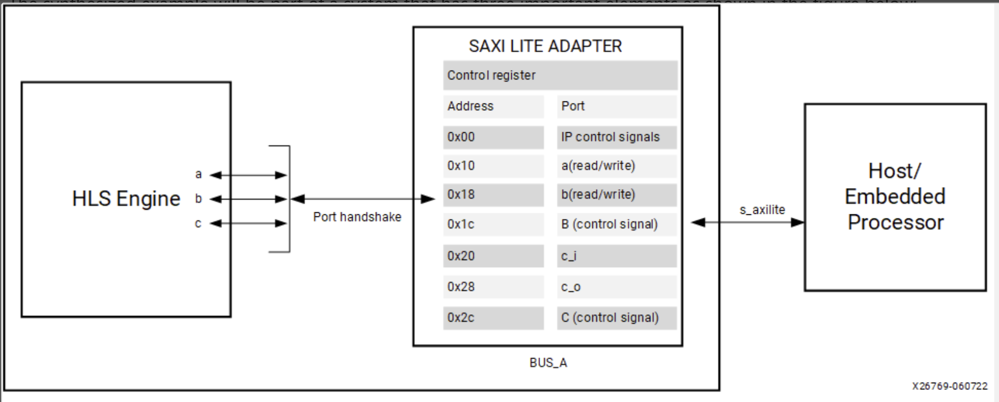</div>

By default, Vitis HLS automatically assigns the address for each port grouped into an ```s_axilite``` interface. As described below, the size or range of addresses assigned to a port depends on the argument data type and the port protocol used. You can also explicitly define the address using the ```offset``` option as discussed in [S_AXILITE Offset Option](https://docs.xilinx.com/r/en-US/ug1399-vitis-hls/S_AXILITE-Offset-Option).

**S_AXILITE Control Register Map**

In the Control Register Map of the ```s_axilite``` interface, Vitis HLS reserves address 0x00 through 0x18 for the block-level protocol, interrupt, mailbox and auto-restart controls. The latter are present only when counted auto-restart and the mailbox are enabled, as shown below:

<div align=center>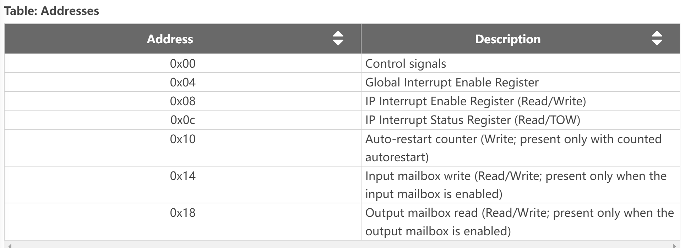</div>

The Control signals (0X00) contains ```ap_start```, ```ap_done```, ```ap_ready```, and ```ap_idle```; and in the case of ```ap_ctrl_chain``` the block protocol also contains ```ap_continue```. These are the block-level interface signals that are accessed through the ```s_axilite `` adapter.[Ref](https://docs.xilinx.com/r/en-US/ug1399-vitis-hls/S_AXILITE-Control-Register-Map)

**S_AXILITE and Port-level Protocols**

In the Vivado IP flow, you can assign port-level I/O protocols to the individual ports and signals bundled into an ```s_axilite``` interface. In the Vitis kernel flow, changing the default port-level I/O protocols is not recommended unless necessary. The tool assigns a default port protocol to a port depending on the type and direction of the associated argument. The port can contain one or more of the following:
* Data signal for the argument

* Valid signal (```ap_vld```/```ap_ovld```) to indicate when the data can be read

* Acknowledge signal (```ap_ack```) to indicate when the data has been read

The default port protocol assignments for various argument types are as follows:

<div align=center>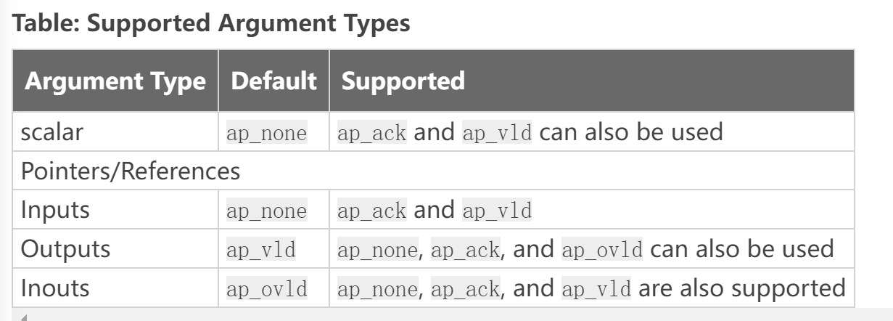</div>

Arrays default to ```ap_memory```. The ```bram``` port protocol is unsupported for arrays in an ```s_axilite``` interface.

**S_AXILITE Bundle Rules**

In the [S_AXILITE Example](https://docs.xilinx.com/r/en-US/ug1399-vitis-hls/S_AXILITE-Example), all the function arguments are grouped into a single ```s_axilite``` interface adapter specified by the ```bundle=BUS_A ``` option in the INTERFACE pragma. The ```bundle``` option lets you group ports together into one interface.

In the Vitis kernel flow, there should only be a single interface bundle, commonly named ```s_axi_control``` by the tool. So, you should not specify the ```bundle``` option in that flow, or you will probably encounter an error during synthesis. However, in the Vivado IP flow, you can specify multiple bundles using the ```s_axilite``` interface, creating a separate interface adapter for each bundle you have defined.

After synthesis, the Synthesis Summary report provides feedback regarding the number of ```s_axilite``` adapters generated. The SW-to-HW Mapping section of the report contains the HW info showing the control register offset and the address range for each port.[Ref](https://docs.xilinx.com/r/en-US/ug1399-vitis-hls/S_AXILITE-Bundle-Rules)

However, there are some rules related to using bundles with the ```s_axilite``` interface.

* Default Bundle Names: This rule explicitly groups all interface ports with no bundle name into the same AXI4-Lite interface port, uses the tool default bundle name, and names the RTL port ```s_axi_<default>```, typically ```s_axi_control```.

* User-Specified Bundle Names: This rule explicitly groups all interface ports with the same ```bundle``` name into the same AXI4-Lite interface port, and names the RTL port the value specified by ```s_axi_<string>```.

* Partially Specified Bundle Names: If you specify ```bundle``` names for some arguments but leave other arguments unassigned, then the tool will bundle the arguments as follows:

* Group all ports into the specified bundles as the INTERFACE pragmas indicate.

* Group any ports without bundle assignments into a default named bundle. The default name can be either the standard tool default or an alternative one if the user has already specified the tool default.

### using_axi_lite

This example illustrates how an input argument of top level function can be mapped to AXI4-lite.

**example.cpp**
```c++
#include <stdio.h>

void example(char* a, char* b, char* c) {
#pragma HLS INTERFACE s_axilite port = a bundle = BUS_A
#pragma HLS INTERFACE s_axilite port = b bundle = BUS_A
#pragma HLS INTERFACE s_axilite port = c bundle = BUS_A
#pragma HLS INTERFACE s_axilite port = return bundle = BUS_A

    *c += *a + *b;
}
```
The synthesis report is shown below.

<div align=center>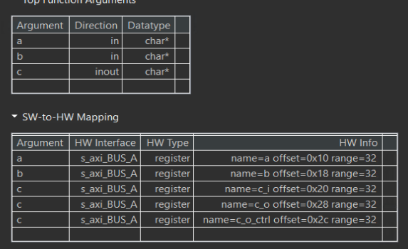</div>


**example_tb.cpp**
```c++
#include <stdio.h>

void example(char* a, char* b, char* c);

int main() {

    char a;
    char b;
    char c;
    char d;
    char sw_result;

    printf("HLS AXI-Lite Example\n");
    printf("Function c += a + b\n");
    printf("Initial values a = 5, b = 10, c = 0\n");

    a = 5;
    b = 10;
    c = 0;
    d = 0;

    example(&a, &b, &c);
    d += a + b;

    printf("HW result = %d\n", c);
    printf("SW result = %d\n", d);

    if (d == c) {
        printf("Success SW and HW results match\n");
        return 0;
    } else {
        printf("ERROR SW and HW results mismatch\n");
        return 1;
    }
}
```
#### Create the Vivado project

The configure block design can use reference materials [here](https://uri-nextlab.github.io/ParallelProgammingLabs/HLS_Labs/Lab1.html). And we need to choose the number of the DMA according to the number of the interface.

<div align=center>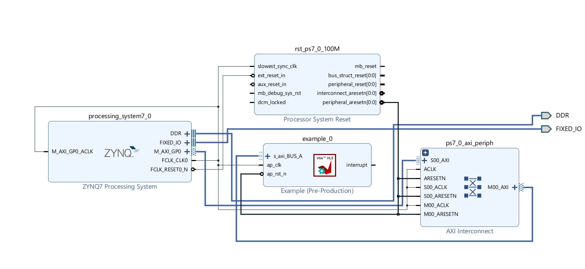</div>

#### Run synthesis,  Implementation, and generate bitstream

It may show some errors about I/O Ports, please fix them.

#### Download the bitstream file to PYNQ

<div align=center></div>


```python
import numpy as np
import pynq
from pynq import MMIO
overlay = pynq.Overlay('design_1.bit')
overlay?
```
<div align=center></div>


```python
top_ip = overlay.example_0
top_ip.signature
```

```python
top_ip.register_map
```
<div align=center>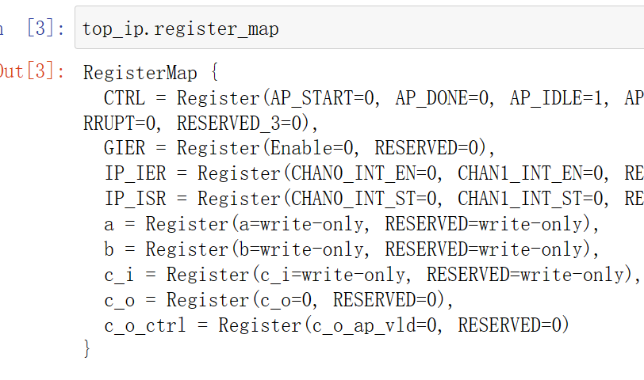</div>

We will see:

<div align=center>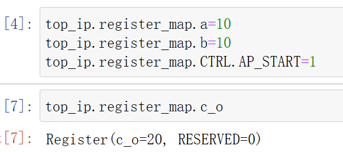</div>


### using_axi_lite_user_define_offset

In this example the user uses to define the offset and the range is dependent on the datatype and port protocol it usese. See the saxi lite  documentation which explains the example in more detail.


**example.cpp**
```c++
#include <stdio.h>
// In this example the user uses to define the offset and the range is dependent
// on the datatype and port protocol it usese. See the saxi lite  documentation
// which explains the example in more detail

void example(char* a, char* b, char* c) {
#pragma HLS INTERFACE s_axilite port = a bundle = BUS_A offset = 0x20
#pragma HLS INTERFACE s_axilite port = b bundle = BUS_A offset = 0x28
#pragma HLS INTERFACE s_axilite port = c bundle = BUS_A offset = 0x30
#pragma HLS INTERFACE s_axilite port = return bundle = BUS_A

    *c += *a + *b;
}
```
The synthesis report is shown below.

<div align=center>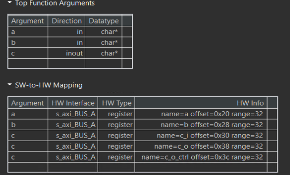</div>


**example_tb.cpp**
```c++
#include <stdio.h>

void example(char* a, char* b, char* c);

int main() {

    char a;
    char b;
    char c;
    char d;
    char sw_result;

    printf("HLS AXI-Lite Example\n");
    printf("Function c += a + b\n");
    printf("Initial values a = 5, b = 10, c = 0\n");

    a = 5;
    b = 10;
    c = 0;
    d = 0;

    example(&a, &b, &c);
    d += a + b;

    printf("HW result = %d\n", c);
    printf("SW result = %d\n", d);

    if (d == c) {
        printf("Success SW and HW results match\n");
        return 0;
    } else {
        printf("ERROR SW and HW results mismatch\n");
        return 1;
    }
}
```
#### Create the Vivado project

The configure block design can use reference materials [here](https://uri-nextlab.github.io/ParallelProgammingLabs/HLS_Labs/Lab1.html). And we need to choose the number of the DMA according to the number of the interface.

<div align=center>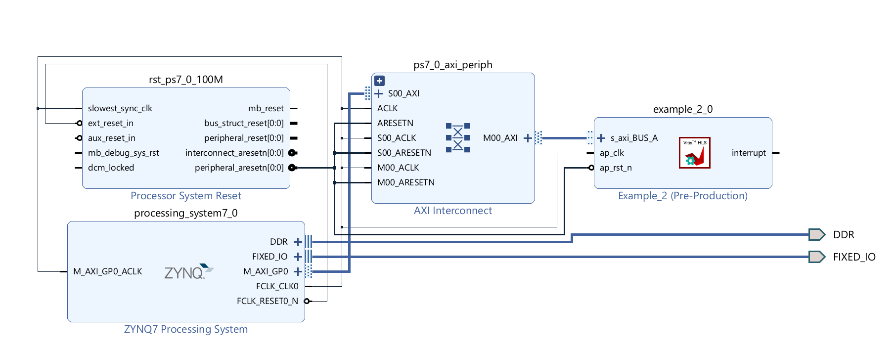</div>

#### Run synthesis,  Implementation, and generate bitstream

It may show some errors about I/O Ports, please fix them.

#### Download the bitstream file to PYNQ

<div align=center></div>


```python
import numpy as np
import pynq
from pynq import MMIO
overlay = pynq.Overlay('design_1.bit')
overlay?
```
<div align=center>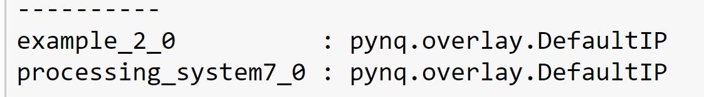</div>


```python
top_ip = overlay.example_0
top_ip.signature
```

```python
top_ip.register_map
```
<div align=center>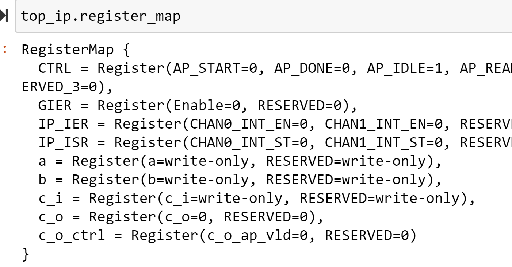</div>

We will see:

<div align=center>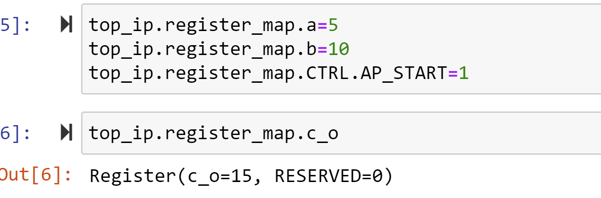</div>


## Streaming

About the streaming data paradigm, you can see the [Ref](https://docs.xilinx.com/r/en-US/ug1399-vitis-hls/Streaming-Data-Paradigm).

An AXI4-Stream interface can be applied to any input argument and any array or pointer output argument. Because an AXI4-Stream interface transfers data in a sequential streaming manner, it cannot be used with arguments that are both read and written. In terms of data layout, the data type of the AXI4-Stream is aligned to the next byte. For example, if the size of the data type is 12 bits, it will be extended to 16 bits. Depending on whether a signed/unsigned interface is selected, the extended bits are either sign-extended or zero-extended.

If the stream data type is an user-defined struct, the default procedure is to keep the struct aggregated and align the struct to the size of the largest data element to the nearest byte. The only exception to this rule is if the struct contains a ```hls::stream``` object. In this special case, the struct will be disaggregated and an axi stream will be created for each member element of the struct.
 The maximum supported port width is 4096 bits, even for aggregated structs or reshaped arrays.

**How AXI4-Stream Works**

AXI4-Stream is a protocol designed for transporting arbitrary unidirectional data. In an AXI4-Stream, the ```TDATA``` width of bits is transferred per clock cycle. The transfer is started once the producer sends the ```TVALID``` signal and the consumer responds by sending the ```TREADY``` signal (once it has consumed the initial ```TDATA```). At this point, the producer will start sending ```TDATA``` and ```TLAST``` (```TUSER``` if needed to carry additional user-defined sideband data). ```TLAST``` signals the last byte of the stream. So the consumer keeps consuming the incoming ```TDATA``` until ```TLAST``` is asserted.

<div align=center>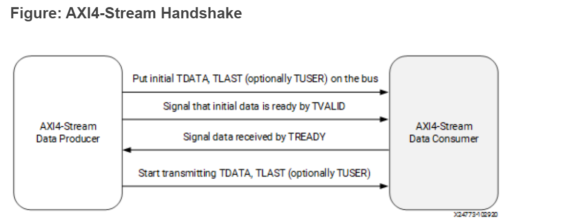</div>

AXI4-Stream has additional optional features like sending positional data with ```TKEEP``` and ```TSTRB``` ports which makes it possible to multiplex both the data position and data itself on the ```TDATA``` signal. Using the ```TID``` and ``TDIST``` signals, you can route streams as these fields roughly correspond to the stream and destination identifiers. 

**How AXI4-Stream is Implemented**

If your design requires a streaming interface begin by defining and using a streaming data structure like ```hls::stream``` in Vitis HLS. This simple object encapsulates the requirements of streaming and its streaming interface is by default implemented in the RTL as a FIFO interface (ap_fifo) but can be optionally, implemented as a handshake interface (ap_hs) or an AXI4-Stream interface (axis)

If an AXI4-Stream interface (axis) is specified via the interface pragma mode option, the interface implementation will mimic the style of an AXIS interface by defining the TDATA, TVALID and TREADY signals.

If a more formal AXIS implementation is desired, then Vitis HLS requires the usage of a special data type (```hls::axis``` defined in ```ap_axi_sdata.h```) to encapsulate the requirements of the AXI4-Stream protocol and implement the special RTL signals needed for this interface.

The AXI4-Stream interface is implemented as a struct type in Vitis HLS and has the following signature (defined in ap_axi_sdata.h):
```c++
template <typename T, size_t WUser, size_t WId, size_t WDest> struct axis { .. };
```

Where:

```T```: The data type to be streamed. (This can support any data type, including ```ap_fixed```.)

```WUser```: Width of the TUSER signal

```WId```: Width of the TID signal

```WDest```: Width of the TDest signal

When the stream data type (T) a simple integer type, there are two predefined types of AXI4-Stream implementations available:

* A signed implementation of the AXI4-Stream class (or more simply``` ap_axis<Wdata, WUser, WId, WDest>```)
```c++
hls::axis<ap_int<WData>, WUser, WId, WDest>
```

* An unsigned implementation of the AXI4-Stream class (or more simply ```ap_axiu<WData, WUser, WId, WDest>```)
```c++
hls::axis<ap_uint<WData>, WUser, WId, WDest>
```

The value specified for the WUser, WId, and WDest template parameters controls the usage of side-channel signals in the AXI4-Stream interface.

When the ```hls::axis``` class is used, the generated RTL will typically contain the actual data signal ```TDATA```, and the following additional signals: ```TVALID```, ```TREADY```, ```TKEEP```, ```TSTRB```, ```TLAST```, ```TUSER```, ```TID```, and ```TDEST```.

```TVALID```, ```TREADY```, and ```TLAST``` are necessary control signals for the AXI4-Stream protocol. ```TKEEP```, ```TSTRB```, ```TUSER```, ```TID```, and ```TDEST``` signals are optional special signals that can pass around additional bookkeeping data.

If ```WUser```, ```WId```, and ```WDest``` are set to 0, the generated RTL will not include the optional ```TUSER```, ```TID```, and ```TDEST``` signals in the interface.

**Registered AXI4-Stream Interfaces**

As a default, AXI4-Stream interfaces are always implemented as registered interfaces to ensure no combinational feedback paths are created when multiple HLS IP blocks with AXI4-Stream interfaces are integrated into a larger design. For AXI4-Stream interfaces, four types of register modes are provided to control how the interface registers are implemented:

* Forward: Only the ```TDATA``` and ```TVALID``` signals are registered.

* Reverse: Only the ```TREADY``` signal is registered.

* Both: All signals (```TDATA```, ```TREADY```, and ```TVALID```) are registered. This is the default.

* Off: None of the port signals are registered.

The AXI4-Stream side-channel signals are considered to be data signals and are registered whenever ```TDATA``` is registered.
When connecting HLS-generated IP blocks with AXI4-Stream interfaces at least one interface should be implemented as a registered interface or the blocks should be connected via an AXI4-Stream Register Slice.
There are two basic methods to use an AXI4-Stream in your design:

* Use an AXI4-Stream without side-channels.

* Use an AXI4-Stream with side-channels.

This second-use model provides additional functionality, allowing the optional side channels which are part of the AXI4-Stream standard, to be used directly in your C/C++ code.

### axi_stream_to_master

This example illustrates using a stream and writing (with bursts) to a memory-mapped interface. 

**example.h**
```c++
#include "ap_axi_sdata.h"
#include "ap_int.h"
#include "hls_stream.h"

typedef ap_axiu<64, 0, 0, 0> trans_pkt;

void example(hls::stream<trans_pkt>& inStreamTop, ap_uint<64> outTop[1024]);

// Expects max bandwidth at 64 beats burst (for 64-bit data)
static constexpr int MAX_BURST_LENGTH = 64;
static constexpr int BUFFER_FACTOR = 64;

// Buffer sizes
static constexpr int DATA_DEPTH = MAX_BURST_LENGTH * BUFFER_FACTOR;
static constexpr int COUNT_DEPTH = BUFFER_FACTOR;

struct data {
    ap_int<64> data_filed;
    ap_int<1> last;
};
```

**example.cpp**
```c++
#include "example.h"

/// Reads from in_stream and in_counts, Write to out_memory
//Input: in_stream and in_counts
//Output: out_memory
void streamtoparallelwithburst(hls::stream<data>& in_stream,
                               hls::stream<int>& in_counts,
                               ap_uint<64>* out_memory) {
    data in_val;
    do {
        int count = in_counts.read();
        for (int i = 0; i < count; ++i) {
#pragma HLS PIPELINE
            in_val = in_stream.read();
            out_memory[i] = in_val.data_filed;
        }
        out_memory += count;
    } while (!in_val.last);
}

//The function computes the number of the input data
//Input: in_stream
//Output: out_stream and out_counts
void getinstream(hls::stream<trans_pkt>& in_stream,
                 hls::stream<data>& out_stream, hls::stream<int>& out_counts) {
 int count = 0;
    trans_pkt in_val;
    do {
#pragma HLS PIPELINE
        in_val = in_stream.read();
        data out_val = {in_val.data, in_val.last};

        out_stream.write(out_val);
        if (count == MAX_BURST_LENGTH-1  || in_val.last) {
            out_counts.write(count+1);
            count = 0;
        }
        else
        {
        	count++;
        }

    } while (!in_val.last);
}


void example(hls::stream<trans_pkt>& inStreamTop, ap_uint<64> outTop[1024]) {
#pragma HLS INTERFACE axis register_mode = both register port = inStreamTop
#pragma HLS INTERFACE m_axi max_write_burst_length = 256 latency = 10 depth =  \
    1024 bundle = gmem0 port = outTop
#pragma HLS INTERFACE s_axilite port = outTop bundle = control
#pragma HLS INTERFACE s_axilite port = return bundle = control

#pragma HLS DATAFLOW

    hls::stream<data, DATA_DEPTH> buf;
    hls::stream<int, COUNT_DEPTH> count;

    getinstream(inStreamTop, buf, count);
    streamtoparallelwithburst(buf, count, outTop);
}
```
The synthesis report is shown below:

<div align=center>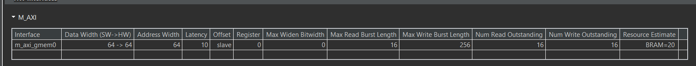</div>

The axis port have all signals.

<div align=center>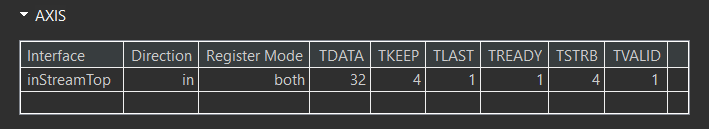</div>


**example_tb.h**
```c++
#include "example.h"

int main() {
    int err = 0;
    ap_uint<64> out_t[1024];
    hls::stream<trans_pkt> inStream_t;
    trans_pkt dataStream_t;

    for (int i = 0; i < 1024; i++) {
        dataStream_t.data = i;
        dataStream_t.keep = -1;
        if (i < 1023) {
            dataStream_t.last = 0;
        } else {
            dataStream_t.last = 1;
        }
        inStream_t.write(dataStream_t);
    }
   example(inStream_t, out_t);
    return err;
}
```
And the export IP is shown below and the ```inStreamTop``` port is ```axis``` port and the ```m_axi_gmem_0``` port is ```m_axi``` port.

<div align=center>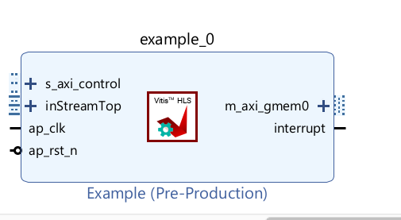</div>


#### Create the Vivado project

The configure block design can use reference materials [here](https://uri-nextlab.github.io/ParallelProgammingLabs/HLS_Labs/Lab1.html). And we need to choose the number of the DMA according to the number of the interface.

<div align=center>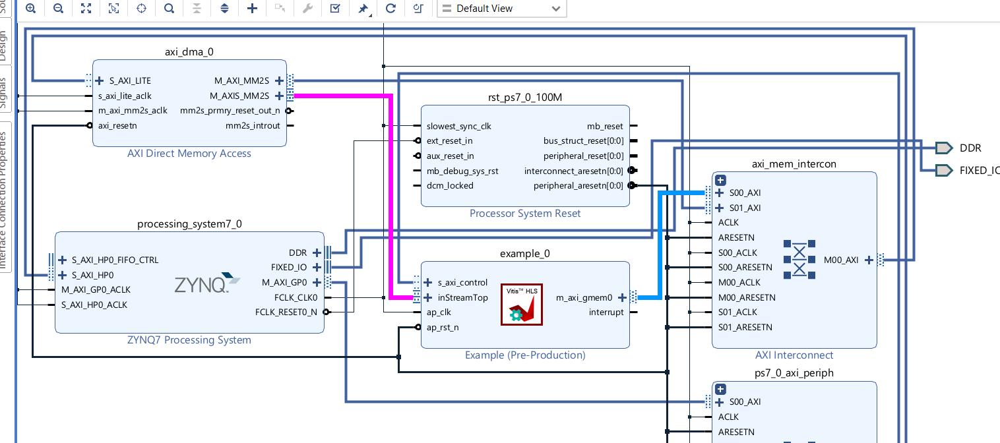</div>

#### Run synthesis,  Implementation, and generate bitstream

It may show some errors about I/O Ports, please fix them.

#### Download the bitstream file to PYNQ

<div align=center></div>


```python
import numpy as np
import pynq
from pynq import MMIO
hw = pynq.Overlay('design_1.bit')
hw?
```
<div align=center>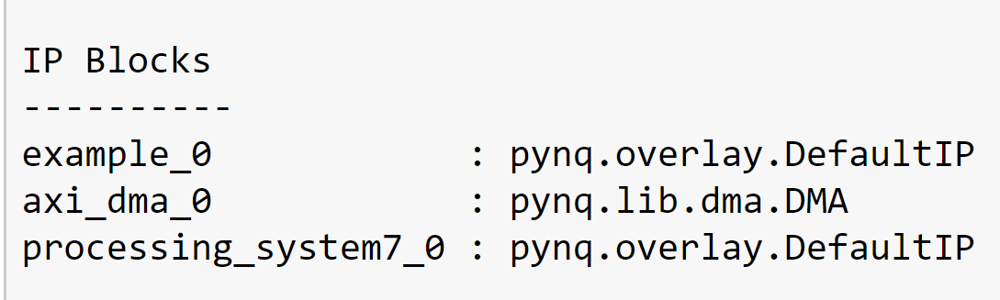</div>

#### Allocate DMA memory address size

The first step is to allocate the buffer. pynq allocate will be used to allocate the buffer, and NumPy will be used to specify the type of the buffer.

```python
top_ip = overlay.example_0    
mm2s =overlay.axi_dma_0.sendchannel
top_ip.signature
N=1024
a_buffer = pynq.allocate((N), np.int32)
b_buffer = pynq.allocate((N),np.int64)

# initialize input
for i in range(0,1024):
    a_buffer[i]=i
```

```python
# specify the address
# These addresses can be found in the generated .v file
top_ip.write(0x10, bptr)
top_ip.write(0x00, 1)
top_ip.register_map
## start AXI-DMA transfer

mm2s.transfer(a_buffer)
mm2s.wait()
```

We will see:

<div align=center>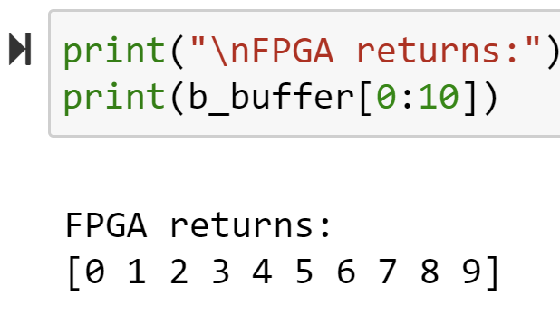</div>


### using_array_of_streams

While arrays can be converted to streams, it can often lead to coding and synthesis issues as arrays can be accessed in random order while a stream requires a sequential access pattern where every element is read in order. To avoid such issues, any time a streaming interface is required, it is highly recommended to use the ```hls::stream``` object as described in [Using HLS Streams](https://docs.xilinx.com/r/en-US/ug1399-vitis-hls/Using-HLS-Streams). The usage of this construct will enforce streaming semantics in the source code. However, to convert an array to a stream you should perform all the operations on temp variables.

This example illustrates how to define and use an array of streams in the interface. Instead of defining an array and then using a pragma to map this array to a stream, it is highly recommended to use the hls::stream objects instead.

**example.h**
```c++
#ifndef __ARRAY_OF_STREAMS_EXAMPLE__
#define __ARRAY_OF_STREAMS_EXAMPLE__

#include "hls_stream.h"
#include <iostream>

#define M 3

extern void dut(hls::stream<int> s_in[M], hls::stream<int> s_out[M],int *sum);

#endif
```

**example.cpp**
```c++
#include "example.h"

//The function adds 2 to every input data and outputs and the sum of the output data.
//Input: s_in[M]
//Output: s_out[M] and sum
void dut(hls::stream<int> s_in[M], hls::stream<int> s_out[M],int *sum) {
#pragma HLS INTERFACE axis port = s_in
#pragma HLS INTERFACE axis port = s_out
#pragma HLS INTERFACE ap_ctrl_none port=return
#pragma HLS INTERFACE mode=s_axilite port=return
#pragma HLS INTERFACE mode=s_axilite port=sum


    for (int j = 0; j < M; j++) {
#pragma HLS UNROLL
        for (int i = 0; i < 10; i++) {
#pragma HLS PIPELINE
            int val = s_in[j].read();
            s_out[j].write(val + 2);
            *sum += val;
        }
    }

}
```

**example_tb.h**
```c++
#include "example.h"

int main() {
    hls::stream<int> s_in[M], s_out[M];
    for (unsigned j = 0; j < M; j++) {
        for (unsigned i = 0; i < 10; i++) {
            s_in[j].write(i);
        }
    }
    int ret=0;
    dut(s_in, s_out,&ret);

   printf("ret is %d\r\n",ret);

    for (unsigned j = 0; j < M; j++) {
        for (unsigned i = 0; i < 10; i++) {
            if (s_out[j].read() != i + 2)
                return 1;
        }
    }

    return 0;
}
```

And the export IP is shown below and the ports are ```axis``` port and they have't ```last``` signal.

<div align=center>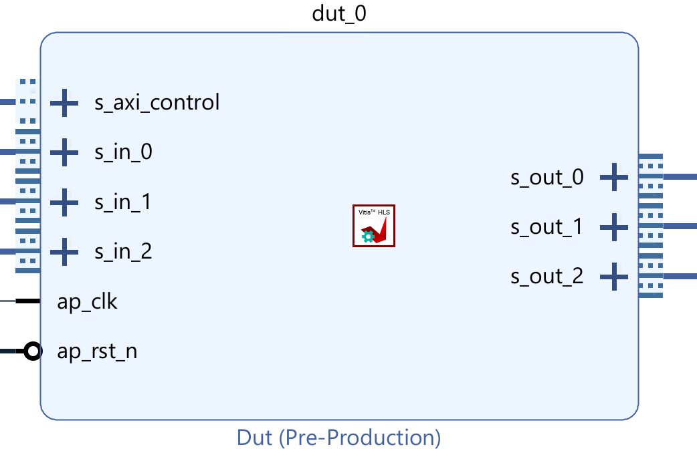</div>

So we add the ```middle_data``` IP to provide. The ```num``` need to change by different projects.

<div align=center>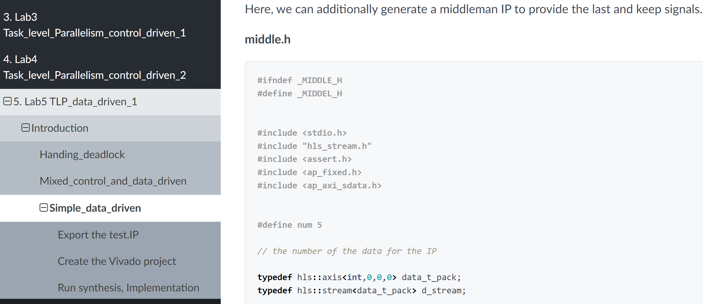</div>


#### Create the Vivado project

The configure block design can use reference materials [here](https://uri-nextlab.github.io/ParallelProgammingLabs/HLS_Labs/Lab1.html). And we need to choose the number of the DMA according to the number of the interface.

<div align=center></div>

#### Run synthesis,  Implementation, and generate bitstream

It may show some errors about I/O Ports, please fix them.

#### Download the bitstream file to PYNQ

<div align=center></div>


```python
import numpy as np
import pynq
from pynq import MMIO
hw = pynq.Overlay('design_1.bit')
hw?
```
<div align=center>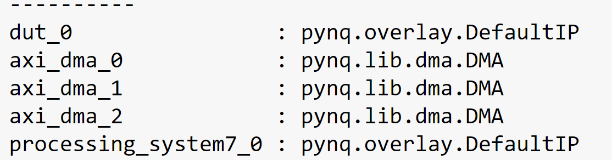</div>

#### Allocate DMA memory address size

The first step is to allocate the buffer. pynq allocate will be used to allocate the buffer, and NumPy will be used to specify the type of the buffer.

```python
dma0 = hw.axi_dma_0
dma1 = hw.axi_dma_1
dma2 = hw.axi_dma_2
N = 10
oBuf_0 = allocate(shape=(N,), dtype = np.int32)
iBuf_0 = allocate(shape=(N,), dtype = np.int32)
oBuf_1 = allocate(shape=(N,), dtype = np.int32)
iBuf_1 = allocate(shape=(N,), dtype = np.int32)
oBuf_2 = allocate(shape=(N,), dtype = np.int32)
iBuf_2 = allocate(shape=(N,), dtype = np.int32)

# initialize input
for i in range(N):
    oBuf_0[i]= i
    oBuf_1[i]= i
    oBuf_2[i]= i
```

```python
## start AXI-DMA transfer
dma0.sendchannel.transfer(oBuf_0)
dma1.sendchannel.transfer(oBuf_1)
dma2.sendchannel.transfer(oBuf_2)
dma0.recvchannel.transfer(iBuf_0)
dma1.recvchannel.transfer(iBuf_1)
dma2.recvchannel.transfer(iBuf_2)
dma0.sendchannel.wait()
dma1.sendchannel.wait()
dma2.sendchannel.wait()
dma0.recvchannel.wait()
dma1.recvchannel.wait()
dma2.recvchannel.wait()
```

We will see:

<div align=center>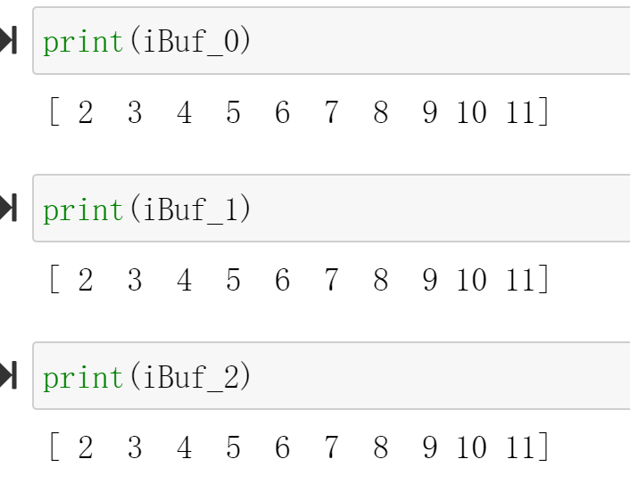</div>

## Demonstrate
Please create an HLS component that uses the ```axi_lite``` interface and ```axi_stream_to_master``` interface and ```using_array_of_streams``` interface separately and implement them on the PYNQ-Z2 board, and you can refer to the examples of the tutorial.


