# Lab13 Interface_streaming_2

<script type="text/x-mathjax-config">
  MathJax.Hub.Config({
    tex2jax: {
        inlineMath: [ ['$','$'], ["\\(","\\)"] ],
        displayMath: [ ['$$','$$'], ["\\[","\\]"] ],
        processEscapes: false,
    }
  });
</script> 
    
<script type="text/javascript"
        src="https://cdn.mathjax.org/mathjax/latest/MathJax.js?config=TeX-AMS-MML_HTMLorMML">
</script>

### using_axi_stream_no_side_channel_data

An AXI4-Stream is used without side-channels when the function argument, ```ap_axis``` or ```ap_axiu``` data type, does not contain any AXI4 side-channel elements (that is, when the ```WUser```, ```WId```, and ```WDest``` parameters are set to 0). In the following example, both interfaces are implemented using an AXI4-Stream:


**example.h**
```c++
#include "ap_axi_sdata.h"
#include "hls_stream.h"

#define DWIDTH 32
#define type ap_int<DWIDTH>

typedef ap_axiu<32, 0, 0, 0> pkt;
```

**example.cpp**
```c++
#include "example.h"

//Read data from the stream A and add 5 to the data, then write to the stream B
//Input: stream A and num
//Output: stream B
void example(hls::stream<pkt>& A, hls::stream<pkt>& B,int num) {
#pragma HLS INTERFACE axis port = A
#pragma HLS INTERFACE axis port = B
#pragma HLS INTERFACE ap_ctrl_none port=return
#pragma HLS INTERFACE mode=s_axilite port=num
#pragma HLS PIPELINE style=flp II=1

	  static int counter=0;
    pkt tmp;
    pkt t1;
    tmp.keep=-1;
    tmp.last=0;
    t1.keep=-1;
    A.read(tmp);
    t1.data = tmp.data + 5;

    if(counter==num-1)
    {
    	t1.last=1;
        counter=0;
    }
    else
    {
    	t1.last=0;
    	counter++;
    }
    B.write(t1);
}


```
After synthesis, both arguments are implemented with a data port (TDATA) and the standard AXI4-Stream protocol ports, TVALID, TREADY, TKEEP, TLAST, and TSTRB, as shown in the following figure.

<div align=center>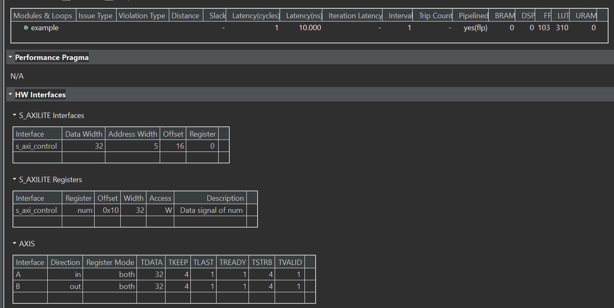</div>

And run ```cosimulation``` and click ```Wave Viewer``` to see the wave to enable the ```last``` signal is right as shown below.

<div align=center>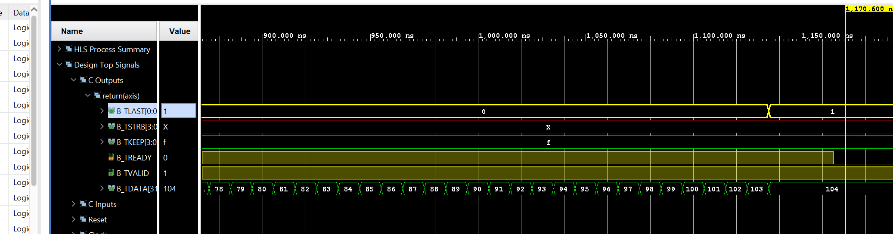</div>

**example_tb.h**
```c++
#include "example.h"
#include <iostream>
using namespace std;

void example(hls::stream<pkt>& A, hls::stream<pkt>& B,int num);


int main() {
    int num = 100;
    hls::stream<pkt> A, B;
    pkt tmp1, tmp2;
    for(int i=0;i<100;i++)
    {
    	tmp1.data = i;
    	   A.write(tmp1);
    	example(A, B,num);
    }
    for(int j=0;j<100;j++)
    {
    	 B.read(tmp2);
    	 printf("tmp2[%d] is %d\r\n",j,tmp2.data);
    }


}

```
#### Create the Vivado project

The configure block design can use reference materials [here](https://uri-nextlab.github.io/ParallelProgammingLabs/HLS_Labs/Lab1.html). And we need to choose the number of the DMA according to the number of the interface.

<div align=center>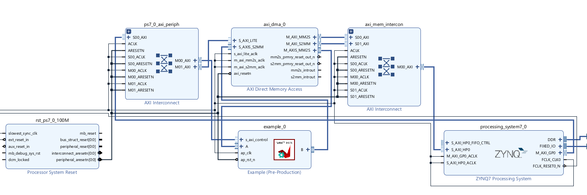</div>

#### Run synthesis,  Implementation, and generate bitstream

It may show some errors about I/O Ports, please fix them.

#### Download the bitstream file to PYNQ

<div align=center></div>


```python
import numpy as np
import pynq
from pynq import MMIO
hw = pynq.Overlay('design_1.bit')
hw?
```
<div align=center>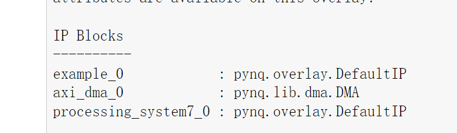</div>


```python

s2mm = hw.axi_dma_0.sendchannel
mm2s = hw.axi_dma_0.recvchannel

```

#### Allocate DMA memory address size
```python
top=hw.example_0
N = 100
oBuf_0 = allocate(shape=(N,), dtype = np.int32)
iBuf_0 = allocate(shape=(N,), dtype = np.int32)
for i in range(N):
    oBuf_0[i]= i
```


```python
top_ip.register_map
#by the s_axilite to define the number of the transfer data
top.register_map.num=100
```

```python 
#begin the DMA transfer
s2mm.transfer(oBuf_0)
mm2s.transfer(iBuf_0)
s2mm.wait()
mm2s.wait()

```

We will see:

<div align=center>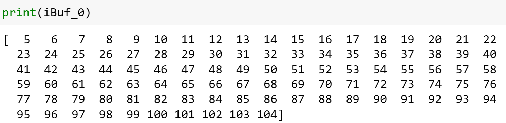</div>


### using_axi_stream_with_custom_side_channel_data_1
An instance of an AXI4-Stream without side channels (for example ```hls::stream<ap_axiu<32, 0, 0, 0>>```) can result in the following RTL signals on the interface:

* ```TVALID```
* ```TREADY```
* ```TDATA[ ]```
* ```TLAST[ ]```
* ```TKEEP[ ]```
* ```TSTRB[ ]```

Some of these signals (```TLAST```, ```TKEEP```, and ```TSTRB```) can be unnecessary or unwanted in your design. In addition, there are use cases where ```TDATA``` is not required as the modeler uses ```TUSER``` to move data.[Ref](https://docs.xilinx.com/r/en-US/ug1399-vitis-hls/Customizing-AXI4-Stream-Interfaces)

In addition to letting you enable or disable specific side-channel signals, the set of macros was expanded to allow the specification of ```all``` or ```none``` of the signals. This allowed for the definition of the special ```hls::axis_data<>``` and ```hls::axis_user<>``` helper classes, making it easier to pick and choose the exact signal specification.

Example C++ code for implementing an AXI stream interface in Vitis HLS using only one side channel.(```TDATA```, ```TLAST``` only)

**example.h**
```c++
#pragma once

#include "ap_axi_sdata.h"
#include "hls_stream.h"
#include <iostream>

// Only TDATA and TLAST
typedef hls::axis_data<int, AXIS_ENABLE_LAST> packet;

#define SIZE 5

void example(hls::stream<packet>& A, hls::stream<packet>& B);

```
<div align=center>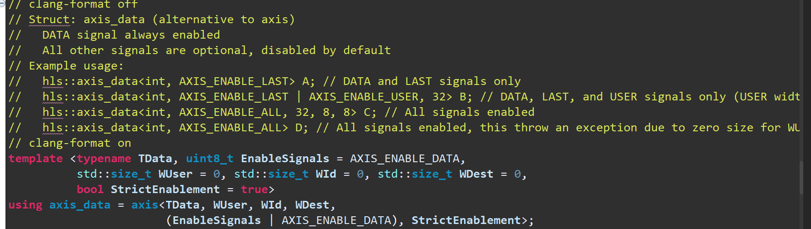</div>

**example.cpp**
```c++
#include "example.h"

void example(hls::stream<packet>& A, hls::stream<packet>& B) {
#pragma HLS INTERFACE axis port = A
#pragma HLS INTERFACE axis port = B
#pragma HLS INTERFACE ap_ctrl_none port=return
#pragma HLS PIPELINE style=flp II=1

	static int counter=0;
    packet tmp = A.read();
    tmp.data = tmp.data + 5;
    if(counter==SIZE-1)
    {
    	tmp.last=1;
    	counter=0;
    }
    else
    {
    	tmp.last=0;
    	counter++;
    }
    B.write(tmp);
}
```
The synthesis report is shown below:

<div align=center>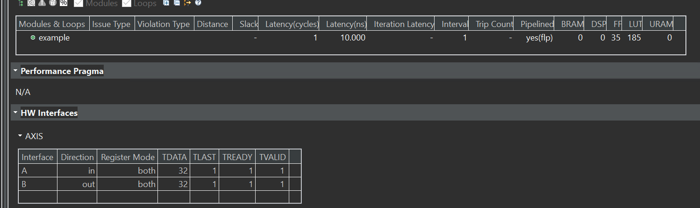</div>

**example_tb.h**
```c++
#include "example.h"

using namespace std;

int main() {

    hls::stream<packet> A, B;
    packet tmp1, tmp2;

    for (int j = 0; j < SIZE; j++) {

        tmp1.data = j;
        if (j == 99) {
            tmp1.last = 1;
        } else {
            tmp1.last = 0;
        }

        A.write(tmp1);
        example(A, B);
        B.read(tmp2);

        if (tmp1.get_data() + 5 != tmp2.get_data()) {
            cout << "ERROR: results mismatch" << endl;
            cout << "tmp1.data=" << tmp1.data;
            cout << " != ";
            cout << "tmp2.data=" << tmp2.data << endl;
            return 1;
        }
    }

    cout << "Success: results match" << endl;
    return 0;
}

```
### using_axi_stream_with_custom_side_channel_data_2

Example C++ code for implementing an AXI stream interface in Vitis HLS using only ```TUSER``` and ```TLAST``` channels with no ```TDATA```. 

**example.h**
```c++
#pragma once

#include "ap_axi_sdata.h"
#include "hls_stream.h"
#include <iostream>

typedef hls::axis_user<13, (AXIS_ENABLE_USER | AXIS_ENABLE_LAST)> packet;

#define SIZE 5

void example(hls::stream<packet>& A, hls::stream<packet>& B);

```
<div align=center>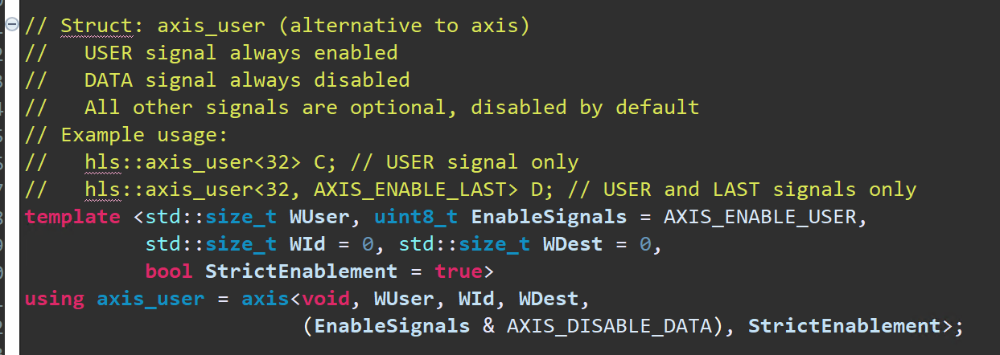</div>

**example.cpp**
```c++
#include "example.h"

void example(hls::stream<packet>& A, hls::stream<packet>& B) {
#pragma HLS INTERFACE axis port = A
#pragma HLS INTERFACE axis port = B

    packet tmp = A.read();
    tmp.set_user(tmp.get_user() + 5);

    B.write(tmp);
}

```
The synthesis report is shown below:

<div align=center>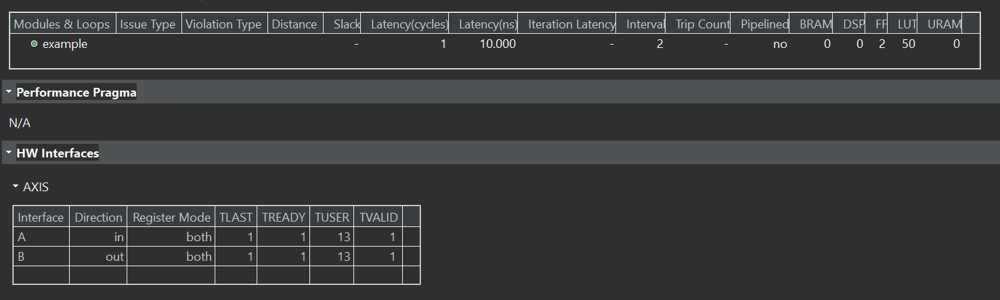</div>

**example_tb.h**
```c++
#include "example.h"

using namespace std;

int main() {

    hls::stream<packet> A, B;
    packet tmp1, tmp2;

    for (int j = 0; j < SIZE; j++) {

        tmp1.user = j;
        if (j == 99) {
            tmp1.last = 1;
        } else {
            tmp1.last = 0;
        }

        A.write(tmp1);
        example(A, B);
        B.read(tmp2);

        if (tmp1.get_user() + 5 != tmp2.get_user()) {
            cout << "ERROR: results mismatch" << endl;
            cout << "tmp1.user=" << tmp1.get_user();
            cout << " != ";
            cout << "tmp2.user=" << tmp2.get_user() << endl;
            return 1;
        }
    }

    cout << "Success: results match" << endl;
    return 0;
}
```
### using_axi_stream_with_side_channel_data

The following example shows how the side channels can be used directly in the C/C++ code and implemented on the interface. The code uses #include "ap_axi_sdata.h" to provide an API to handle the side channels of the AXI4-Stream interface. In the following example a signed 32-bit data type is used:

**example.h**
```c++
#pragma once

#include "ap_axi_sdata.h"
#include "hls_stream.h"
#include <iostream>

typedef ap_axis<32, 2, 5, 6> packet;

#define SIZE 5

void example(hls::stream<packet>& A, hls::stream<packet>& B);

```

**example.cpp**
```c++
#include "example.h"

void example(hls::stream<packet>& A, hls::stream<packet>& B) {
#pragma HLS INTERFACE axis port = A
#pragma HLS INTERFACE axis port = B
#pragma HLS INTERFACE ap_ctrl_none port=return
#pragma HLS PIPELINE style=flp II=1

	static int counter=0;
    packet tmp = A.read();
    tmp.keep=-1;
    tmp.data = tmp.data + 5;
    if(counter==SIZE-1)
    {
    	tmp.last=1;
    	counter=0;
    }
    else
    {
    	tmp.last=0;
    	counter++;
    }
    B.write(tmp);
}

```

The synthesis report is shown below:

<div align=center>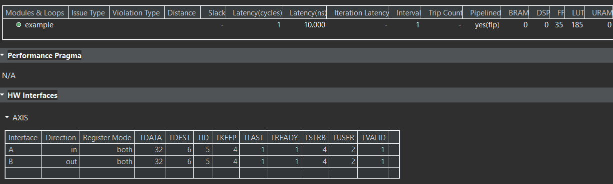</div>

**example_tb.h**
```c++
#include "example.h"

using namespace std;

int main() {

    hls::stream<packet> A, B;
    packet tmp1, tmp2;

    for (int j = 0; j < SIZE; j++) {

        tmp1.data = j;
        tmp1.keep = -1;
        tmp1.strb = 1;
        tmp1.user = 1;
        if (j == 99) {
            tmp1.last = 1;
        } else {
            tmp1.last = 0;
        }

        A.write(tmp1);
        example(A, B);
        B.read(tmp2);

        if (tmp1.data.to_int() + 5 != tmp2.data.to_int()) {
            cout << "ERROR: results mismatch" << endl;
            cout << "tmp1.data=" << tmp1.data;
            cout << " != ";
            cout << "tmp2.data=" << tmp2.data << endl;
            return 1;
        }
    }

    cout << "Success: results match" << endl;
    return 0;
}

```
After Run the cosimulation, we can see the wave viewer to confirm the ```last``` signal as shown below:

<div align=center>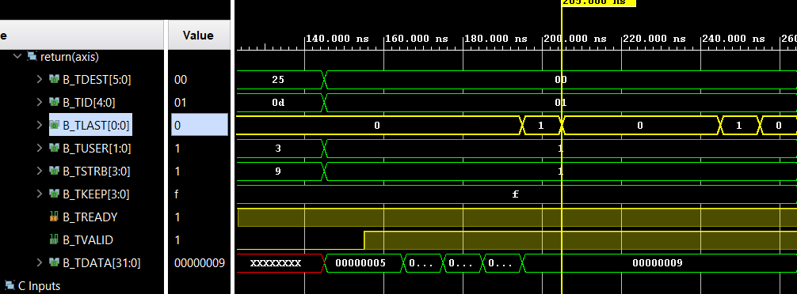</div>

The export IP is shown below.

<div align=center>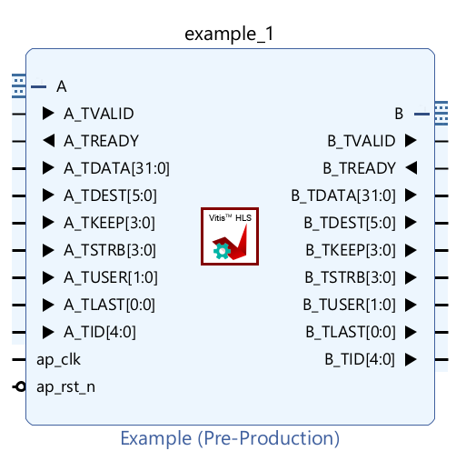</div>


#### Create the Vivado project

The configure block design can use reference materials [here](https://uri-nextlab.github.io/ParallelProgammingLabs/HLS_Labs/Lab1.html). And we need to choose the number of the DMA according to the number of the interface.

<div align=center>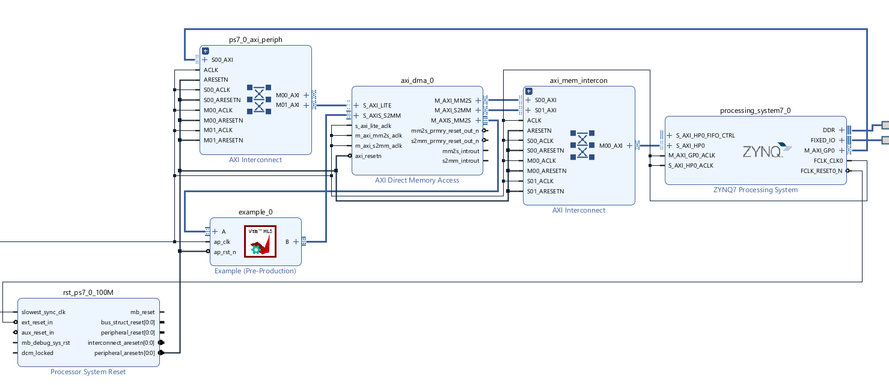</div>

#### Run synthesis,  Implementation, and generate bitstream

It may show some errors about I/O Ports, please fix them.

#### Download the bitstream file to PYNQ

<div align=center></div>


```python
import numpy as np
import pynq
from pynq import MMIO
hw = pynq.Overlay('design_1.bit')

```


```python

s2mm = hw.axi_dma_0.sendchannel
mm2s = hw.axi_dma_0.recvchannel

```

#### Allocate DMA memory address size
```python
N = 5
oBuf_0 = allocate(shape=(N,), dtype = np.int32)
iBuf_0 = allocate(shape=(N,), dtype = np.int32)
for i in range(N):
    oBuf_0[i]= i
```


```python 
#begin the DMA transfer
s2mm.transfer(oBuf_0)
mm2s.transfer(iBuf_0)
s2mm.wait()
mm2s.wait()

```

We will see:

<div align=center>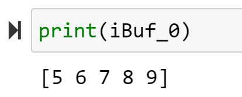</div>

### using_axi_stream_with_struct
**example.h**
```c++
#include "ap_axi_sdata.h"
#include "hls_stream.h"
#include <complex>

#define SIZE 5

typedef hls::axis<std::complex<short int>, 0, 0, 0> data_t;
typedef hls::stream<data_t> mystream;

extern void example(mystream& A, mystream& B);
```

**example.cpp**
```c++
#include "example.h"

void example(mystream& A, mystream& B) {
#pragma HLS INTERFACE axis port = A
#pragma HLS INTERFACE axis port = B
#pragma HLS INTERFACE ap_ctrl_none port=return
    data_t tmp_a;
    static int counter=0;
    tmp_a.keep=-1;
    do {
        tmp_a = A.read();
        data_t tmp_b;
         tmp_b.keep=-1;
        tmp_b.data.real(tmp_a.data.real() + 5);
        tmp_b.data.imag(tmp_a.data.imag() + 1);
        if(counter==SIZE-1)
        {
        	tmp_b.last=1;
        	counter=0;
        }
        else
        {
        	tmp_b.last=0;
        	counter++;
        }
        B.write(tmp_b);

    } while (!tmp_a.last);
}

```
The synthesis report is shown below:

<div align=center>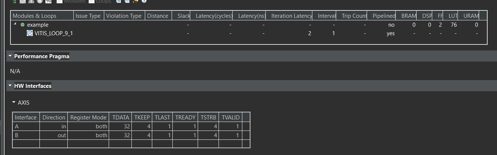</div>

**example_tb.h**
```c++
#include "example.h"
#include <stdio.h>

int main() {
    short int i;
    mystream A, B, C;

    printf("HLS AXI-Stream no side-channel data example\n");

    // Put data into A Stream
    for (i = 0; i < SIZE; i++) {
        data_t tmp;
        tmp.data = {i, i};
        tmp.last = (i == (SIZE - 1)) ? 1 : 0;
        A.write(tmp);
    }

    // Call the hardware function
    example(A, B);

    // Run a software version of the hardware function to validate results
    for (i = 0; i < SIZE; i++) {
        data_t tmp_c;
        tmp_c.data.real(i + 5);
        tmp_c.data.imag(i + 1);
        C.write(tmp_c);
    }

    // Compare the results
    for (i = 0; i < SIZE; i++) {
        data_t tmp_b = B.read();
        data_t tmp_c = C.read();
        if (tmp_b.data != tmp_c.data) {
            printf("ERROR HW and SW results mismatch\n");
            return 1;
        }
    }
    printf("Success HW and SW results match\n");
    return 0;
}

```
After Running the cosimulation, we can see the wave viewer to confirm the ```last``` signal as shown below:

<div align=center>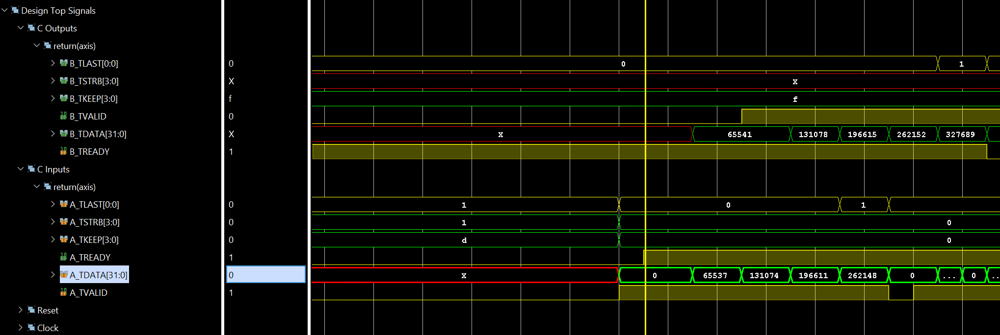</div>

The export IP is shown below.

<div align=center>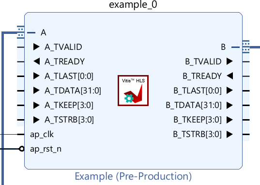</div>


#### Create the Vivado project

The configure block design can use reference materials [here](https://uri-nextlab.github.io/ParallelProgammingLabs/HLS_Labs/Lab1.html). And we need to choose the number of the DMA according to the number of the interface.

<div align=center>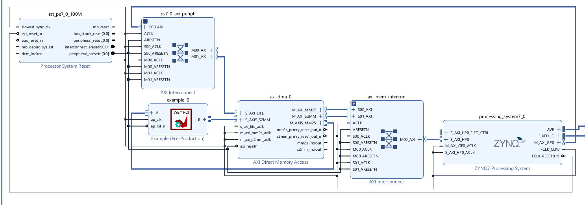</div>

#### Run synthesis,  Implementation, and generate bitstream

It may show some errors about I/O Ports, please fix them.

#### Download the bitstream file to PYNQ

<div align=center></div>


```python
import numpy as np
import pynq
from pynq import MMIO
hw = pynq.Overlay('design_1.bit')
```


```python
s2mm = hw.axi_dma_0.sendchannel
mm2s = hw.axi_dma_0.recvchannel
```

#### Allocate DMA memory address size
```python
N = 5
oBuf_0 = allocate(shape=(N,), dtype = np.int32)
iBuf_0 = allocate(shape=(N,), dtype = np.int32)
for i in range(1):
    oBuf_0[0]= 0
    oBuf_0[1]= 65537
    oBuf_0[2]= 131074
    oBuf_0[3]= 196611
    oBuf_0[4]= 262148
```


```python 
#begin the DMA transfer
s2mm.transfer(oBuf_0)
mm2s.transfer(iBuf_0)
s2mm.wait()
mm2s.wait()
```

We will see:

<div align=center></div>


### using_axis_array_stream_no_side_channel_data

Example C++ code for implementing an AXI array to stream with no side channels.

**example.cpp**
```c++
void example(int A[50], int B[50]) {
#pragma HLS INTERFACE axis port = A
#pragma HLS INTERFACE axis port = B
#pragma HLS INTERFACE ap_ctrl_none port=return

    int i;

    for (i = 0; i < 50; i++) {
        B[i] = A[i] + 5;
    }
}

```

The synthesis report is shown below:

<div align=center>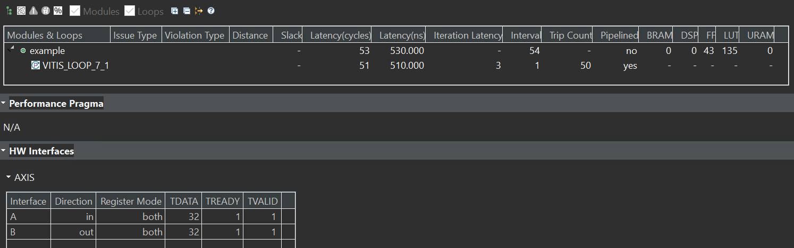</div>


**example_tb.h**
```c++
#include <stdio.h>

void example(int A[50], int B[50]);

int main() {
    int i;
    int A[50];
    int B[50];
    int C[50];

    printf("HLS AXI-Stream no side-channel data example\n");
    // Put data into A
    for (i = 0; i < 50; i++) {
        A[i] = i;
    }

    // Call the hardware function
    example(A, B);

    // Run a software version of the hardware function to validate results
    for (i = 0; i < 50; i++) {
        C[i] = A[i] + 5;
    }

    // Compare results
    for (i = 0; i < 50; i++) {
        if (B[i] != C[i]) {
            printf("ERROR HW and SW results mismatch\n");
            return 1;
        }
    }
    printf("Success HW and SW results match\n");
    return 0;
}

```
#### Create the Vivado project

The configure block design can use reference materials [here](https://uri-nextlab.github.io/ParallelProgammingLabs/HLS_Labs/Lab1.html). We also need to choose the number of the DMA according to the number of the interface. We also need middle_data IP to provide the last and keep the signal. [Ref](https://uri-nextlab.github.io/ParallelProgammingLabs/HLS_Labs/Lab5.html)

<div align=center>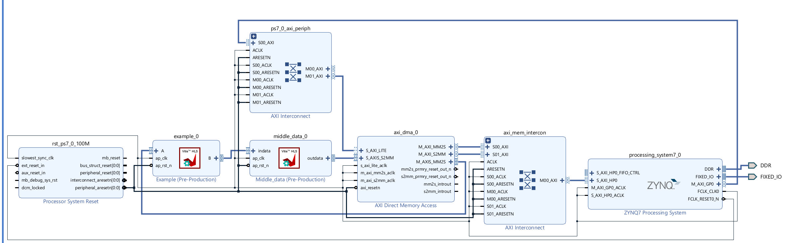</div>

#### Run synthesis,  Implementation, and generate bitstream

It may show some errors about I/O Ports, please fix them.

#### Download the bitstream file to PYNQ

<div align=center></div>


```python
import numpy as np
import pynq
from pynq import MMIO
hw = pynq.Overlay('design_1.bit')
hw?
```
<div align=center></div>


```python

s2mm = hw.axi_dma_0.sendchannel
mm2s = hw.axi_dma_0.recvchannel

```

#### Allocate DMA memory address size
```python
top=hw.example_0
N = 50
oBuf_0 = allocate(shape=(N,), dtype = np.int32)
iBuf_0 = allocate(shape=(N,), dtype = np.int32)
for i in range(N):
    oBuf_0[i]= i
```


```python 
#begin the DMA transfer
s2mm.transfer(oBuf_0)
mm2s.transfer(iBuf_0)
s2mm.wait()
mm2s.wait()

```

We will see:

<div align=center></div>

## Demonstrate

Please create an HLS component that uses ```axi_stream_no_side_channel_data``` interface and ```axi_stream_with_side_channel_data``` interface and ```axi_stream_with_struct``` interface and ```axi_array_strema_no_side_channel_data``` separately and implement them on the PYNQ-Z2 board, and you can refer to the examples of the tutorial.

