# Lab14 Misc

<script type="text/x-mathjax-config">
  MathJax.Hub.Config({
    tex2jax: {
        inlineMath: [ ['$','$'], ["\\(","\\)"] ],
        displayMath: [ ['$$','$$'], ["\\[","\\]"] ],
        processEscapes: false,
    }
  });
</script> 
    
<script type="text/javascript"
        src="https://cdn.mathjax.org/mathjax/latest/MathJax.js?config=TeX-AMS-MML_HTMLorMML">
</script>

## fft
The AMD FFT IP block can be called within a C++ design using the library ```hls_fft.h```. This section explains how the FFT can be configured in your C++ code. [Ref](https://docs.xilinx.com/r/en-US/ug1399-vitis-hls/FFT-IP-Library)

### interface_array

The FFT function with array arguments is defined in the HLS namespace and can be called as follows:

```c++
hls::fft<STATIC_PARAM> (
INPUT_DATA_ARRAY,
OUTPUT_DATA_ARRAY, 
OUTPUT_STATUS, 
INPUT_RUN_TIME_CONFIGURATION);
```
The ```STATIC_PARAM``` is the static parameterization struct that defines the static parameters for the FFT.

The input and output data are supplied to the function as arrays (```INPUT_DATA_ARRAY``` and ```OUTPUT_DATA_ARRAY```). 
The data types for the arrays can be ```float``` or ```ap_fixed```.

```c++
typedef float data_t;
complex<data_t> in_fft[FFT_LENGTH];
complex<data_t> out_fft[FFT_LENGTH];
```
**fft_top.cpp**
```c++
#include "fft_top.h"

void inputdatamover(bool direction, config_t* config, cmpxDataIn in[FFT_LENGTH],
                    cmpxDataIn out[FFT_LENGTH]) {
    config->setDir(direction);
    config->setSch(0x2AB);
L0:
    for (int i = 0; i < FFT_LENGTH; i++) {
        out[i] = in[i];
    }
}

void outputdatamover(status_t* status_in, bool* ovflo,
                     cmpxDataOut in[FFT_LENGTH], cmpxDataOut out[FFT_LENGTH]) {
L0:
    for (int i = 0; i < FFT_LENGTH; i++) {
        out[i] = in[i];
    }
    *ovflo = status_in->getOvflo() & 0x1;
}

void myfftwrapper(cmpxDataIn xn[FFT_LENGTH], cmpxDataIn xk[FFT_LENGTH],
                  status_t& fft_status, config_t& fft_config) {
#pragma HLS dataflow
#pragma HLS INLINE recursive
    hls::fft<config1>(xn, xk, &fft_status, &fft_config);
}

void fft_top(bool direction, complex<data_in_t> in[FFT_LENGTH],
             complex<data_out_t> out[FFT_LENGTH], bool* ovflo) {
#pragma HLS interface ap_hs port = direction
#pragma HLS interface ap_fifo depth = 1 port = ovflo
#pragma HLS interface ap_fifo depth = FFT_LENGTH port = in, out
#pragma HLS dataflow

    complex<data_in_t> xn[FFT_LENGTH];
    complex<data_out_t> xk[FFT_LENGTH];
    config_t fft_config;
    status_t fft_status;

    inputdatamover(direction, &fft_config, in, xn);

    // FFT IP
    myfftwrapper(xn, xk, fft_status, fft_config);

    outputdatamover(&fft_status, ovflo, xk, out);
}
```
**fft_top.h**
```c++
#include "ap_fixed.h"
#include "hls_fft.h"

// configurable params
const char FFT_INPUT_WIDTH = 16;
const char FFT_OUTPUT_WIDTH = FFT_INPUT_WIDTH;
const char FFT_CONFIG_WIDTH = 16;
const char FFT_NFFT_MAX = 10;
const int FFT_LENGTH = 1 << FFT_NFFT_MAX;

#include <complex>
using namespace std;

struct config1 : hls::ip_fft::params_t {
    static const unsigned ordering_opt = hls::ip_fft::natural_order;
    static const unsigned config_width = FFT_CONFIG_WIDTH;
};

typedef hls::ip_fft::config_t<config1> config_t;
typedef hls::ip_fft::status_t<config1> status_t;

typedef ap_fixed<FFT_INPUT_WIDTH, 1> data_in_t;
typedef ap_fixed<FFT_OUTPUT_WIDTH, FFT_OUTPUT_WIDTH - FFT_INPUT_WIDTH + 1>
    data_out_t;
typedef std::complex<data_in_t> cmpxDataIn;
typedef std::complex<data_out_t> cmpxDataOut;

void dummy_proc_fe(bool direction, config_t* config, cmpxDataIn in[FFT_LENGTH],
                   cmpxDataIn out[FFT_LENGTH]);

void dummy_proc_be(status_t* status_in, bool* ovflo, cmpxDataOut in[FFT_LENGTH],
                   cmpxDataOut out[FFT_LENGTH]);

void fft_top(bool direction, cmpxDataIn in[FFT_LENGTH],
             cmpxDataOut out[FFT_LENGTH], bool* ovflo);
```
The synthesis report is shown below:

<div align=center>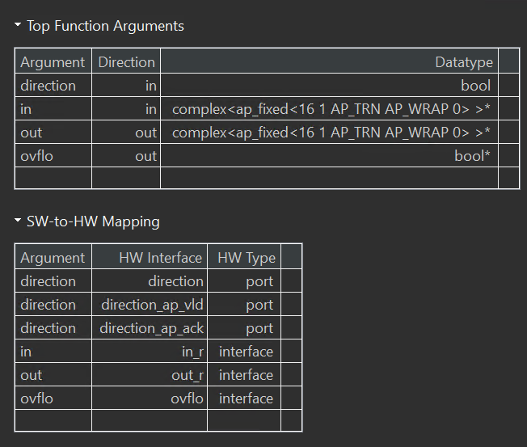</div>

<div align=center>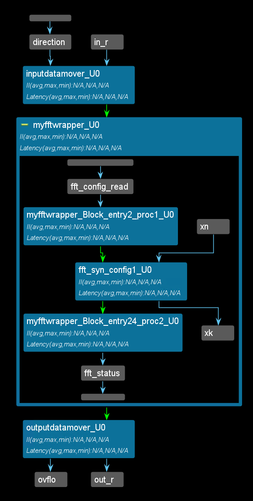</div>

### interface_stream

The FFT function with streaming interfaces is defined in the HLS namespace similarly to this:
```c++
 template <typename PARAM_T>
  void fft(hls::stream<complex<float or ap_fixed>> &xn_s,
           hls::stream<complex<float or ap_fixed >> &xk_s,
           hls::stream<ip_fft::status_t<CONFIG_T>> &status_s,
           hls::stream<ip_fft::config_t<CONFIG_T>> &config_s);
```
and can be called as follows:

```c++
hls::fft<STATIC_PARAM> (
INPUT_DATA_STREAM,
OUTPUT_DATA_STREAM,
OUTPUT_STATUS_STREAM,
INPUT_RUN_TIME_CONFIGURATION_STREAM);
```
The STATIC_PARAM is the static parameterization struct that defines the static parameters for the FFT.

All input and outputs are supplied to the function as a ```hls::stream<>```. In the final implementation, the ports on the FFT RTL block will be implemented as AXI4-Stream ports. The data types for input data and output data streams can be ```float``` or ```ap_fixed```.

**fft_top.h**
```c++
#include "ap_fixed.h"
#include "hls_fft.h"

// configurable params
const char FFT_INPUT_WIDTH = 16;
const char FFT_OUTPUT_WIDTH = FFT_INPUT_WIDTH;
const char FFT_CONFIG_WIDTH = 16;
const char FFT_NFFT_MAX = 10;
const int FFT_LENGTH = 1 << FFT_NFFT_MAX;

#include <complex>
using namespace std;

struct config1 : hls::ip_fft::params_t {
    static const unsigned ordering_opt = hls::ip_fft::natural_order;
    static const unsigned config_width = FFT_CONFIG_WIDTH;
};

typedef hls::ip_fft::config_t<config1> config_t;
typedef hls::ip_fft::status_t<config1> status_t;

typedef ap_fixed<FFT_INPUT_WIDTH, 1> data_in_t;
typedef ap_fixed<FFT_OUTPUT_WIDTH, FFT_OUTPUT_WIDTH - FFT_INPUT_WIDTH + 1>
    data_out_t;
typedef std::complex<data_in_t> cmpxDataIn;
typedef std::complex<data_out_t> cmpxDataOut;

void dummy_proc_fe(bool direction, config_t* config, cmpxDataIn in[FFT_LENGTH],
                   cmpxDataIn out[FFT_LENGTH]);

void dummy_proc_be(status_t* status_in, bool* ovflo, cmpxDataOut in[FFT_LENGTH],
                   cmpxDataOut out[FFT_LENGTH]);

void fft_top(bool direction, hls::stream<cmpxDataIn>& in,
             hls::stream<cmpxDataOut>& out, bool* ovflo);
```

**fft_top.cpp**
```c++
#include "fft_top.h"

void inputdatamover(bool direction, hls::stream<config_t>& config_strm,
                    hls::stream<cmpxDataIn>& in,
                    hls::stream<cmpxDataIn>& out_strm) {
    config_t config;
    config.setDir(direction);
    config.setSch(0x2AB);
    config_strm.write(config);
L0:
    for (int i = 0; i < FFT_LENGTH; i++) {
#pragma HLS pipeline II = 1 rewind
        out_strm.write(in.read());
    }
}

void outputdatamover(hls::stream<status_t>& status_in_strm, bool* ovflo,
                     hls::stream<cmpxDataOut>& in_strm,
                     hls::stream<cmpxDataOut>& out) {
L0:
    for (int i = 0; i < FFT_LENGTH; i++) {
#pragma HLS pipeline II = 1 rewind
        out.write(in_strm.read());
    }
    status_t status = status_in_strm.read();
    *ovflo = status.getOvflo() & 0x1;
}

void fft_top(bool direction, hls::stream<cmpxDataIn>& in,
             hls::stream<cmpxDataOut>& out, bool* ovflo) {
#pragma HLS interface ap_hs port = direction
#pragma HLS interface ap_fifo depth = 1 port = ovflo
#pragma HLS interface ap_fifo depth = FFT_LENGTH port = in, out
#pragma HLS dataflow

    hls::stream<complex<data_in_t>> xn;
    hls::stream<complex<data_out_t>> xk;
    hls::stream<config_t> fft_config;
    hls::stream<status_t> fft_status;

    inputdatamover(direction, fft_config, in, xn);

    // FFT IP
    hls::fft<config1>(xn, xk, fft_status, fft_config);

    outputdatamover(fft_status, ovflo, xk, out);
}
```
The synthesis report is shown below:

<div align=center>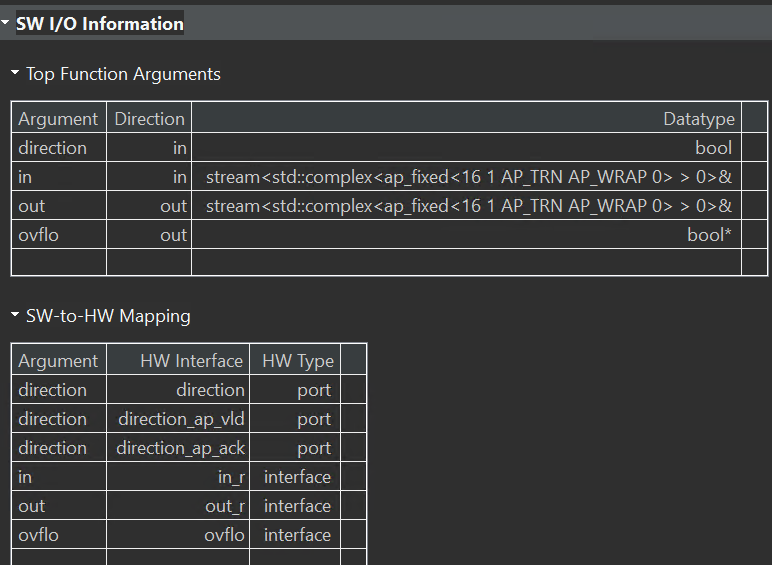</div>

<div align=center>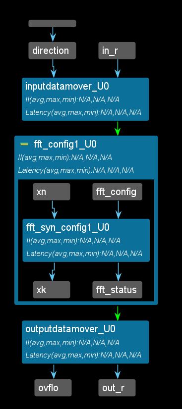</div>

## initialization_and_reset

Although not a requirement, AMD recommends specifying arrays to be implemented as memories with the ```static``` qualifier. This ensures that Vitis HLS implements the array with memory in the RTL and allows the default initialization behavior of the static types to be used. [Ref](https://docs.xilinx.com/r/en-US/ug1399-vitis-hls/Initializing-and-Resetting-Arrays)

In addition, if the variable has the ```static``` qualifier, Vitis HLS initializes the variable in the RTL design and in the FPGA bitstream. This removes the need for multiple clock cycles to initialize the memory and ensures that initializing large memories is not an operational overhead. The RTL configuration command ```syn.rtl.reset``` can specify if static variables return to their initial state after a reset is applied. This is not the default. When ```syn.rtl.reset=state``` or ```all``` are used, it forces all arrays implemented as block RAM to be returned to their initialized state after reset. This can result in two very undesirable conditions in the RTL design:

* Unlike a power-up initialization (or power-on reset), an explicit reset requires the RTL design to iterate through each address in the block RAM to set the value: this can take many clock cycles if N is large, and requires more area resources to implement the reset.

* A reset is added to every array in the design.

To prevent adding reset logic onto every such block RAM, and incurring the cycle overhead to reset all elements in the RAM, specify the default ```syn.rtl.reset=control``` reset mode and use the RESET pragma or directive to identify individual static or global variables to be reset.

Alternatively, you can use the ```syn.rtl.reset=state``` reset mode and the RESET directive ```off``` option to select which individual static or global variables not to reset.

Finally, depending on the hardware device or platform of your choice (UltraScale+ or Versal, etc), there can be differences in how block RAMs and URAMs are initialized and/or reset. In general, Vitis HLS supports two types of reset: when the device is powered on (and also termed as power-up initialization or power-on reset), and when a hardware RESET signal is asserted during device execution. The following shows the differences in behavior for the different memory resources:

* Initialization Behavior: Applies to all block RAMs on all platforms and only to Versal URAMs. This is the behavior during power-on initialization (or power-on reset).

* Maintaining an “initial value array” and “runtime array” if the array is read/written. This applies to block RAMs and URAMs and corresponds to the hardware “RESET” signal during device execution.

 URAMs do not support a read-first output write_mode (unlike block RAMs) when a read and a write to the same address is mapped to the same memory port. Block RAM supports the following write-modes: ```write thru```, ```read first```, ```no change```. URAM only supports ```no change```. Vitis HLS will issue the following warning message when it cannot schedule memory operations in the same cycle on a URAM port:

 ```
Usage of URAM can potentially cause worse II as Vitis HLS does not exploit 
read-first mode for URAMs. Consider using block RAMs instead.
 ```

**pragma HLS reset**

The RESET pragma or directive adds or disables reset ports for specific state variables (global or static). [Ref](https://docs.xilinx.com/r/en-US/ug1399-vitis-hls/pragma-HLS-reset)

The reset port is used to restore the registers and block RAM, connected to the port, to an initial value any time the reset signal is applied. Globally, the presence and behavior of the RTL reset port are controlled using the ```syn.rtl.reset``` configuration settings (or ```config_rtl -reset```). The reset configuration settings include the ability to define the polarity of the reset and specify whether the reset is synchronous or asynchronous, but more importantly, it controls, through the reset option, which registers are reset when the reset signal is applied. For more information, see [Controlling Initialization and Reset Behavior](https://docs.xilinx.com/r/en-US/ug1399-vitis-hls/Controlling-Initialization-and-Reset-Behavior).

More specific control over reset is provided through the RESET pragma. For global or static variables the RESET pragma is used to enable a reset when none is present explicitly, or the variable can be removed from the reset by turning off the pragma. This can be particularly useful when static or global arrays are present in the design.

For public variables of a class, the RESET pragma must be used as the reset configuration settings only apply to variables declared at the function or file level. In addition, the RESET pragma must be applied to an object of the class in the top-function or sub-function, and cannot be applied to private variables of the class.

**Syntax**

Place the pragma in the C source within the boundaries of the variable life cycle.

```c++
#pragma HLS reset variable=<a> off
```

Where:

```variable=<a>```: Specifies the variable to which the RESET pragma is applied.

```off```: Indicates that reset is not generated for the specified variable.

### global_array_RAM
This example shows how global arrays are mapped to RAMs with different implementations, how they are initialized, and how they are reset.

**test.h**
```c++
#include <ap_int.h>

int test(int i);
```


**test.cpp**
```c++
#include "test.h"

ap_int<10> A[10] = {0, 1, 2, 3, 4, 5, 6, 7, 8, 9};
ap_int<10> B[10] = {9, 8, 7, 6, 5, 4, 3, 2, 1, 0};
ap_int<10> C[10] = {9, 8, 7, 6, 5, 4, 3, 2, 1, 0};
int test(int i) {
#pragma HLS BIND_STORAGE variable = A type = RAM_2P impl = BRAM
#pragma HLS BIND_STORAGE variable = B type = RAM_2P impl = LUTRAM
    // URAM is not a supported implementation type for global arrays
    // #pragma HLS BIND_STORAGE variable=C type=RAM_2P impl=URAM
    A[i] += B[i] + C[i];
    B[i] += 5;
    C[i] += 10;

    int result = (A[i] + B[i] + C[i]).to_int();
    return result;
}
```

The synthesis report is shown below:

<div align=center>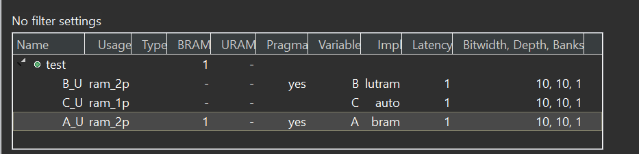</div>

**test_tb.cpp**
```c++
#include "test.h"

int main() {
    int j = 5;
    int ret = test(j);
    int golden = 36;
    int result = 0;
    if (ret == golden) {
        printf("Test passed!\n");
    } else {
        printf("Test failed!\n");
        result = 1;
    }
    return result;
}
```
### static_array_RAM

This example shows how static arrays are mapped to RAMs with different implementations and how they are initialized as well as how they are reset.

**test.h**
```c++
#include <ap_int.h>

int test(int i);
```

**test.cpp**
```c++
#include "test.h"

int test(int i) {
    static ap_int<10> A[10] = {0, 1, 2, 3, 4, 5, 6, 7, 8, 9};
#pragma HLS BIND_STORAGE variable = A type = RAM_2P impl = BRAM
    static ap_int<10> B[10] = {9, 8, 7, 6, 5, 4, 3, 2, 1, 0};
#pragma HLS BIND_STORAGE variable = B type = RAM_2P impl = LUTRAM
    static ap_int<10> C[10] = {9, 8, 7, 6, 5, 4, 3, 2, 1, 0};
#pragma HLS BIND_STORAGE variable = C type = RAM_1P impl = BRAM
    A[i] += B[i] + C[i];
    B[i] += 5;
    C[i] += 10;

    int result = (A[i] + B[i] + C[i]).to_int();
    return result;
}
```
The synthesis report is shown below:

<div align=center>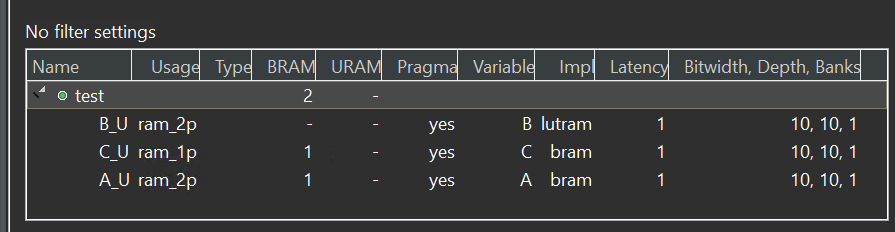</div>

And you can see that for BRAM/LUTRAM/URAM, the following structure is generated in the RTL to initialize the static RAM arrays:

proj/solution_A/syn/verilog/test_A_V_RAM_2P_BRAM_1R1W.v:

<div align=center>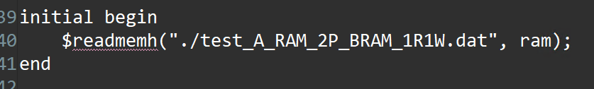</div>

The ```*.dat``` files contain the initial values for the respective arrays.

And we can have a new solution for the reset as show below:

<div align=center>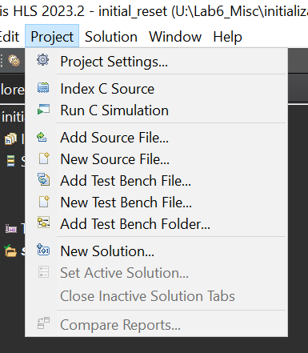</div>

**test_2.cpp**
```c++
#include "test.h"

int test(int i) {
    static ap_int<10> A[10] = {0, 1, 2, 3, 4, 5, 6, 7, 8, 9};
#pragma HLS BIND_STORAGE variable = A type = RAM_2P impl = BRAM
#pragma HLS RESET variable= A
    static ap_int<10> B[10] = {9, 8, 7, 6, 5, 4, 3, 2, 1, 0};
#pragma HLS BIND_STORAGE variable = B type = RAM_2P impl = LUTRAM
#pragma HLS RESET variable= B
    static ap_int<10> C[10] = {9, 8, 7, 6, 5, 4, 3, 2, 1, 0};
#pragma HLS BIND_STORAGE variable = C type = RAM_1P impl = BRAM
#pragma HLS RESET variable= C
    A[i] += B[i] + C[i];
    B[i] += 5;
    C[i] += 10;

    int result = (A[i] + B[i] + C[i]).to_int();
    return result;
}
```

 When the reset directive/pragma is applied to the static arrays (A/B/C), you will see that in the generated RTL, both a ROM and a RAM are used to implement each memory. The initial value is loaded to the ROM only (as in solution_A). But each time after the reset signal is asserted, if an address is not written, the value read from the address is from the ROM, otherwise it is read from the RAM. That means the memory is reset back to the initialized value after each reset. The same structure below can be seen for all three arrays A/B/C.

<div align=center>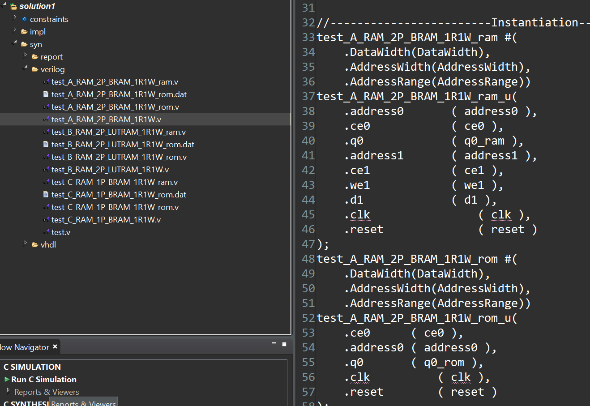</div>

And we can also use the third way to set as shown below:

<div align=center>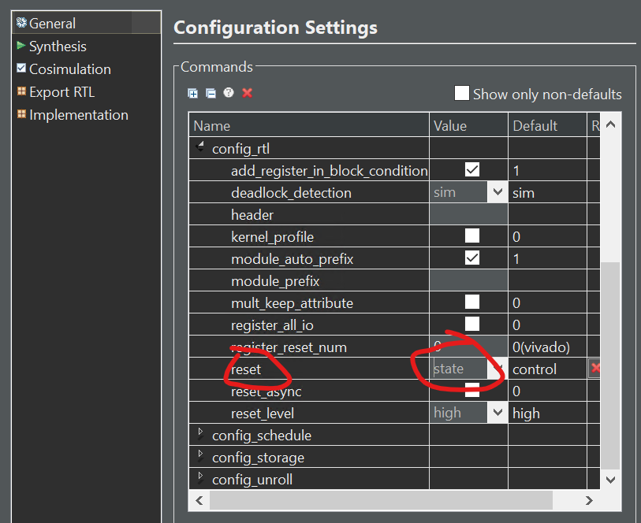</div>

**test_tb.cpp**
```c++
#include "test.h"

int main() {
    int j = 5;
    int ret = test(j);
    int golden = 36;
    int result = 0;
    if (ret == golden) {
        printf("Test passed!\n");
    } else {
        printf("Test failed!\n");
        result = 1;
    }
    return result;
}
```
### static_array_ROM
This example shows how static arrays are mapped to ROMs with different implementations and how they are initialized.

**test.h**
```c++
#include <ap_int.h>

int test(int i);
```

**test.cpp**
```c++
#include "test.h"

int test(int i) {
    static const ap_int<10> A[10] = {0, 1, 2, 3, 4, 5, 6, 7, 8, 9};
#pragma HLS BIND_STORAGE variable = A type = ROM_1P impl = BRAM
    static const ap_int<10> B[10] = {9, 8, 7, 6, 5, 4, 3, 2, 1, 0};
#pragma HLS BIND_STORAGE variable = B type = ROM_1P impl = LUTRAM
    return A[i] + B[i];
}
```
The synthesis report is shown below:

<div align=center>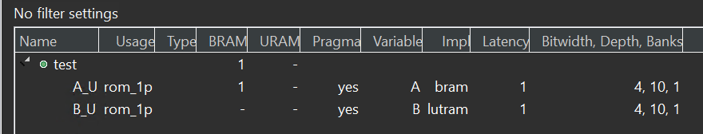</div>

<div align=center></div>

The ```*.dat``` files contain the initial values for the respective arrays. Also note that ```URAM``` is not a supported implementation type for ```ROMs```.


**test_tb.cpp**
```c++
#include "test.h"

int main() {
    int j = 5;
    int ret = test(j);
    int golden = 9;
    int result = 0;
    if (ret == golden) {
        printf("Test passed!\n");
    } else {
        printf("Test failed!\n");
        result = 1;
    }
    return result;
}
```


### static_array_of_struct_with_array_RAM
This example shows how static array of struct with arrays are mapped to RAMs with different implementations and how they are initialized as well as how they are reset.

**test.h**
```c++
#include <ap_int.h>

template <int N> struct TestStruct {
    int A[N];
    int B[N];
    int C[N];
};

int test(int i);
```

**test.cpp**
```c++
#include "test.h"

int test(int i) {

    int ts0[10]={0, 1, 2, 3, 4, 5, 6, 7, 8, 9};
    int ts1[10]={9, 8, 7, 6, 5, 4, 3, 2, 1, 0};
    int ts2[10]={8, 8, 7, 7, 5, 4, 3, 2, 1, 0};

    int ts3[10]={0, 1, 2, 3, 4, 5, 6, 7, 8, 9};
    int ts4[10]={9, 8, 7, 6, 5, 4, 3, 2, 1, 0};
    int ts5[10]={9, 9, 8, 6, 5, 4, 3, 2, 1, 0};

    static TestStruct<10> ts[2];
	   for(int j=0;j<10;j++)
	   {
		  ts[0].A[j] = ts0[j];
		  ts[0].B[j] = ts1[j];
		  ts[0].C[j] = ts2[j];

		  ts[1].A[j] = ts3[j];
		  ts[1].B[j] = ts4[j];
		  ts[1].C[j] = ts5[j];

	   }
#pragma HLS BIND_STORAGE variable = ts type = RAM_2P impl = BRAM
    // #pragma HLS BIND_STORAGE variable=ts type=RAM_2P impl=LUTRAM
    // URAMs are not supported for global/static arrays
    // #pragma HLS BIND_STORAGE variable=ts type=RAM_2P impl=URAM

    int ind = i % 2;
    ts[ind].A[i] += ts[ind].B[i] + ts[ind].C[i];
    ts[ind].B[i] += 5;
    ts[ind].C[i] += 10;

    int result = (ts[ind].A[i] + ts[ind].B[i] + ts[ind].C[i]);
    return result;
}
```
The synthesis report is shown below:

<div align=center>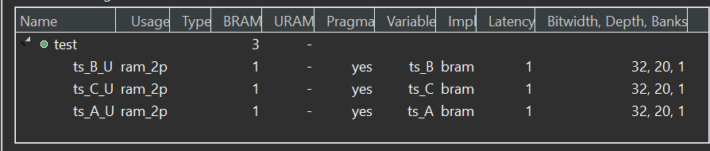</div>

And the reset optimization is the like as the ```static_array_RAM```.

**test_tb.cpp**
```c++
#include "test.h"

int main() {
    int j = 5;
    int ret = test(j);
    int golden = 36;
    int result = 0;
    if (ret == golden) {
        printf("Test passed!\n");
    } else {
        printf("Test failed!\n");
        result = 1;
    }
    return result;
}
```


### static_struct_with_array_RAM

This example shows how static arrays are mapped to RAMs with different implementations and how they are initialized as well as how they are reset.

**test.h**
```c++
#include <ap_int.h>

template <int N> struct TestStruct {
    int A[N];
    int B[N];
    int C[N];
};

int test(int i);
```

**test.cpp**
```c++
#include "test.h"

int test(int i) {

  	  static TestStruct<10> ts;
	  int ts0[10] ={0, 1, 2, 3, 4, 5, 6, 7, 8, 9};
	  int ts1[10]={9, 8, 7, 6, 5, 4, 3, 2, 1, 0};
	  int ts2[10]={9, 8, 7, 6, 5, 4, 3, 2, 1, 0};

	   for(int j=0;j<10;j++)
		   {
			  ts.A[j] = ts0[j];
			  ts.B[j] = ts1[j];
			  ts.C[j] = ts2[j];
		   }


#pragma HLS BIND_STORAGE variable = ts.A type = RAM_2P impl = BRAM
#pragma HLS BIND_STORAGE variable = ts.B type = RAM_2P impl = LUTRAM

    // URAM on non-Versal devices cannot be initialized
    // #pragma HLS BIND_STORAGE variable=ts.C type=RAM_2P impl=URAM

    ts.A[i] += ts.B[i] + ts.C[i];
    ts.B[i] += 5;
    ts.C[i] += 10;

    return (ts.A[i] + ts.B[i] + ts.C[i]);
}
```
The synthesis report is shown below:

<div align=center>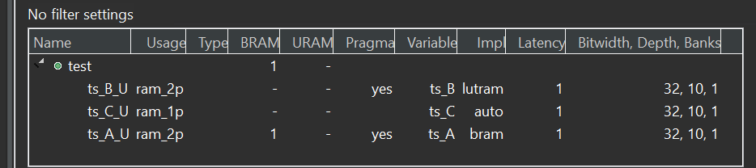</div>

And the reset optimization is the like as the ```static_array_RAM```.

**test_tb.cpp**
```c++
#include "test.h"

int main() {
    int j = 5;
    int ret = test(j);
    int golden = 36;
    int result = 0;
    if (ret == golden) {
        printf("Test passed!\n");
    } else {
        printf("Test failed!\n");
        result = 1;
    }
    return result;
}
```
### static_struct_with_array_RAM_Versal
This example shows how static arrays are mapped to RAMs with different implementations and how they are initialized as well as how they are reset. Static RAM initialization on Versal devices is supported while it is not supported on non-Versal devices. 

**test.h**
```c++
#include <ap_int.h>

template <int N> struct TestStruct {
    int A[N];
    int B[N];
    int C[N];
};

int test(int i);
```

**test.cpp**
```c++
#include "test.h"

int test(int i) {
    	  static TestStruct<10> ts;
	  int ts0[10] ={0, 1, 2, 3, 4, 5, 6, 7, 8, 9};
	  int ts1[10]={9, 8, 7, 6, 5, 4, 3, 2, 1, 0};
	  int ts2[10]={9, 8, 7, 6, 5, 4, 3, 2, 1, 0};

	   for(int j=0;j<10;j++)
		   {
			  ts.A[j] = ts0[j];
			  ts.B[j] = ts1[j];
			  ts.C[j] = ts2[j];
		   }
#pragma HLS BIND_STORAGE variable = ts.A type = RAM_2P impl = BRAM
#pragma HLS BIND_STORAGE variable = ts.B type = RAM_2P impl = LUTRAM

// URAM on Versal devices can be initialized
#pragma HLS BIND_STORAGE variable = ts.C type = RAM_2P impl = URAM

    ts.A[i] += ts.B[i] + ts.C[i];
    ts.B[i] += 5;
    ts.C[i] += 10;

    return (ts.A[i] + ts.B[i] + ts.C[i]);
}
```
The synthesis report is shown below:

<div align=center></div>

And the reset optimization is the like as the ```static_array_RAM```.

**test_tb.cpp**
```c++
#include "test.h"

int main() {
    int j = 5;
    int ret = test(j);
    int golden = 36;
    int result = 0;
    if (ret == golden) {
        printf("Test passed!\n");
    } else {
        printf("Test failed!\n");
        result = 1;
    }
    return result;
}
```

## malloc_removed

**Dynamic Memory Usage**

Any system calls that manage memory allocation within the system, for example, ```malloc()```, ```alloc()```, and ```free()```, are using resources that exist in the memory of the operating system and are created and released during runtime. To be able to synthesize a hardware implementation the design must be fully self-contained, specifying all required resources.

Memory allocation system calls must be removed from the design code before synthesis. Because dynamic memory operations are used to define the functionality of the design, they must be transformed into equivalent bounded representations. [Ref](https://docs.xilinx.com/r/en-US/ug1399-vitis-hls/Dynamic-Memory-Usage)

This example shows how to rewrite without using explicit mallocs in the C/C++ code.

**malloc_removed.h**
```c++
#ifndef _MALLOC_REMOVED_H_
#define _MALLOC_REMOVED_H_

#include <stdio.h>
#define N 32

typedef int din_t;
typedef long long dout_t;
typedef int dsel_t;

dout_t malloc_removed(din_t din[N], dsel_t width);

#endif
```

**malloc_removed.cpp**
```c++
#include "malloc_removed.h"
#include <stdlib.h>
//#define NO_SYNTH

dout_t malloc_removed(din_t din[N], dsel_t width) {

#ifdef NO_SYNTH
  long long *out_accum = malloc(sizeof(long long));
  int *array_local = malloc(64 * sizeof(int));
#else
  long long _out_accum;
  long long *out_accum = &_out_accum;
  int _array_local[64];
  int *array_local = &_array_local[0];
#endif
  int i, j;

LOOP_SHIFT:
  for (i = 0; i < N - 1; i++) {
    if (i < width)
      *(array_local + i) = din[i];
    else
      *(array_local + i) = din[i] >> 2;
  }

  *out_accum = 0;
LOOP_ACCUM:
  for (j = 0; j < N - 1; j++) {
    *out_accum += *(array_local + j);
  }

  return *out_accum;
}

```
The synthesis report is shown below:

<div align=center>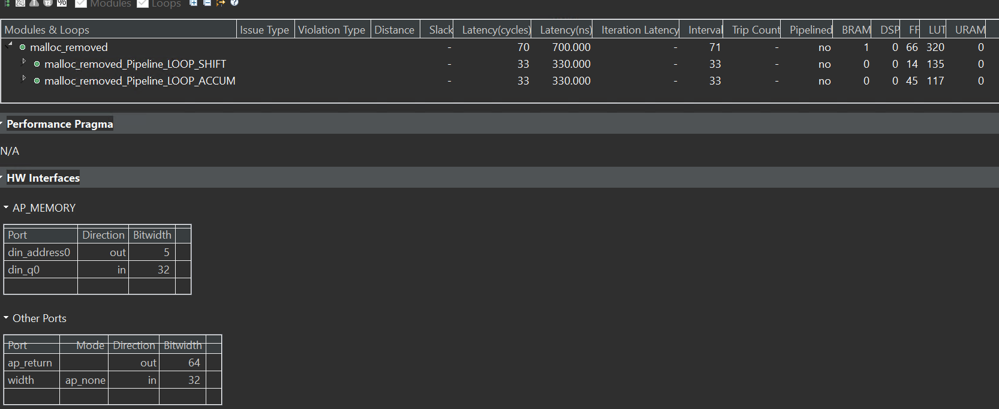</div>

**malloc_removed_tb.cpp**
```c++
#include "malloc_removed.h"
#include <stdio.h>
int main() {
  din_t A[N];
  dout_t accum;

  int i, retval = 0;
//  FILE *fp;

  for (i = 0; i < N; ++i) {
    A[i] = i + 200;
  }
  // Call the function
  for (i = 0; i < N; ++i) {
    accum = malloc_removed(A, i);
    printf("accum is %lld\n",(long long)accum);
  }
}
```
## rtl_as_blackbox
This examaple uses the RTL blackbox feature. The RTL blackbox enables the use of existing RTL IP in an HLS project. This lets you add RTL code to your C/C++ code for synthesis of the project by Vitis HLS.

**example.h**
```c++
#ifndef _EXAMPLE_H_
#define _EXAMPLE_H_

#include <fstream>
#include <iostream>
using namespace std;

#include "ap_int.h"

typedef ap_int<10> data_t;

void example(data_t a1, data_t a2, data_t a3, data_t a4, data_t b1, data_t b2,
             data_t b3, data_t b4, data_t& sigma);

#endif
```

**example.cpp**
```c++
#include "example.h"
//--------------------------------------------------------


void rtl_model(data_t a1, data_t a2, data_t a3, data_t a4, data_t b1, data_t b2,
               data_t b3, data_t b4, data_t& z1, data_t& z2, data_t& z3,
               data_t& z4) {
#pragma HLS inline off
    z1 = a1 + b1;
    z2 = a2 + b2;
    z3 = a3 + b3;
    z4 = a4 + b4;
}
//--------------------------------------------------------
void example(data_t a1, data_t a2, data_t a3, data_t a4, data_t b1, data_t b2,
             data_t b3, data_t b4, data_t& sigma) {

    data_t tmp1, tmp2, tmp3, tmp4;

    rtl_model(a1, a2, a3, a4, b1, b2, b3, b4, tmp1, tmp2, tmp3, tmp4);
    sigma = tmp1 + tmp2 + tmp3 + tmp4;
}
```

**example_tb.cpp**
```c++
#include "example.h"
#include <iostream>

int main() {

    data_t sum;
    int i, j, retval = 0;


    // Create input data
    for (i = 0; i < 10; ++i) {
        example(i, i - 10, i + 10, i - 20, i, 2 * i, 3 * i, 4 * i, sum);
        cout << " sum " << (int)sum << endl;

    }


}
#include "example.h"
#include <iostream>

int main() {

    data_t sum;
    int i, j, retval = 0;


    // Create input data
    for (i = 0; i < 10; ++i) {
        example(i, i - 10, i + 10, i - 20, i, 2 * i, 3 * i, 4 * i, sum);
        cout << " sum " << (int)sum << endl;

    }


}
```

**rtl_model.v**
```c++
`timescale 100ps/100ps

(* use_dsp = "simd" *)
(* dont_touch = "1" *)  
module rtl_model (input            ap_clk, ap_rst, ap_ce, ap_start, ap_continue,
                  input [9:0]      a1, a2, a3, a4, b1, b2, b3, b4,
                  output           ap_idle, ap_done, ap_ready,
                  output           z1_ap_vld, z2_ap_vld, z3_ap_vld, z4_ap_vld,
                  output reg [9:0] z1, z2, z3, z4);

   wire ce = ap_ce;
   
   reg [9:0] areg1, areg2, areg3, areg4;
   reg [9:0] breg1, breg2, breg3, breg4;
   reg       dly1, dly2;
   
   always @ (posedge ap_clk)
     if (ap_rst)
       begin
          z1    <= 0;
          z2    <= 0;
          z3    <= 0;
          z4    <= 0;
          areg1 <= 0;
          areg2 <= 0;
          areg3 <= 0;
          areg4 <= 0;
          breg1 <= 0;
          breg2 <= 0;
          breg3 <= 0;
          breg4 <= 0;
          dly1  <= 0;
          dly2  <= 0;     
       end
     else if (ce)
       begin
          z1    <= areg1 + breg1;
          z2    <= areg2 + breg2;
          z3    <= areg3 + breg3;
          z4    <= areg4 + breg4;
          areg1 <= a1;
          areg2 <= a2;
          areg3 <= a3;
          areg4 <= a4;
          breg1 <= b1;
          breg2 <= b2;
          breg3 <= b3;
          breg4 <= b4;
          dly1  <= ap_start;
          dly2  <= dly1;          
       end

   assign z1_ap_vld = dly2;
   assign z2_ap_vld = dly2;
   assign z3_ap_vld = dly2;
   assign z4_ap_vld = dly2;
   assign ap_ready  = dly2;
   assign ap_done   = dly2;
   assign ap_idle   = ~ap_start;
      
endmodule // rtl_model
```

## Demonstrate

Please create an HLS component for all four parts separately and try to understand the optimized way. 
