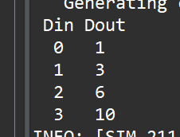
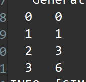
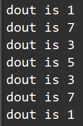
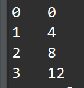
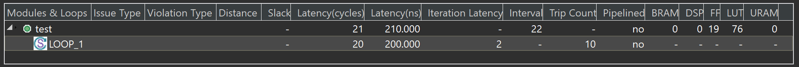
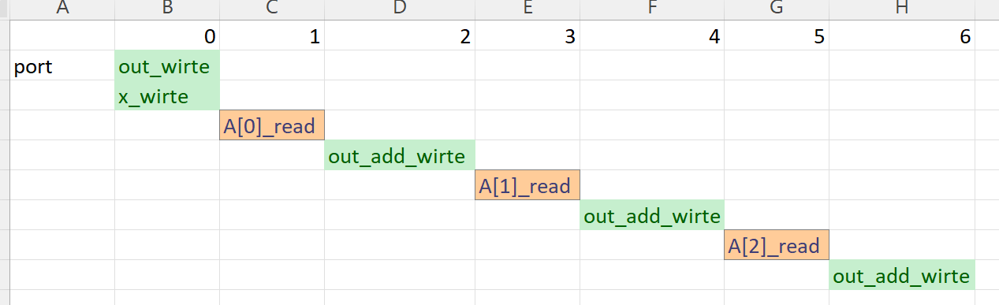
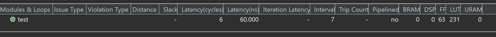
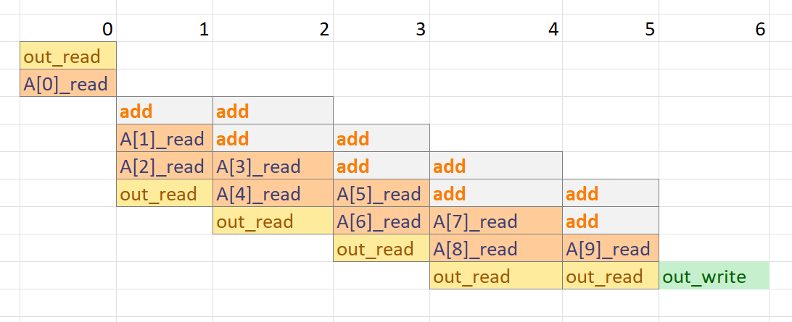
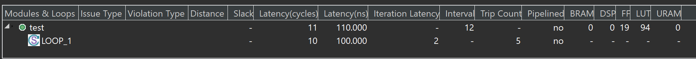

# Lab15 Model_pointers

<script type="text/x-mathjax-config">
  MathJax.Hub.Config({
    tex2jax: {
        inlineMath: [ ['$','$'], ["\\(","\\)"] ],
        displayMath: [ ['$$','$$'], ["\\[","\\]"] ],
        processEscapes: false,
    }
  });
</script> 
    
<script type="text/javascript"
        src="https://cdn.mathjax.org/mathjax/latest/MathJax.js?config=TeX-AMS-MML_HTMLorMML">
</script>

## Pointers

Pointers are used extensively in C/C++ code and are supported for synthesis, but it is generally recommended to avoid using pointers in your code. This is especially true when using pointers in the following cases:

* When pointers are accessed (read or written) multiple times in the same function.

* When using arrays of pointers, each pointer must point to a scalar or a scalar array (not another pointer).

* Pointer casting is supported only when casting between standard C/C++ types, as shown.

Pointer to pointer is not supported.[Ref](https://docs.xilinx.com/r/en-US/ug1399-vitis-hls/Pointers)

### basic_arithmetic

Introducing pointer arithmetic limits the possible interfaces that can be synthesized in RTL. The following code example shows the same code, but in this instance simple pointer arithmetic accumulates the data values (starting from the second value).

**pointer_arith.h**
```c++
#ifndef _POINTER_ARITH_H_
#define _POINTER_ARITH_H_

#include <stdio.h>

typedef int dio_t;

void pointer_arith(dio_t* d);

#endif
```
**pointer_arith.cpp**
```c++
#include "pointer_arith.h"

void pointer_arith (dio_t *d) {
 static int acc = 0;
 int i;

 for (i=0;i<4;i++) {
   acc += *(d+i+1);
   *(d+i) = acc;
 }
}
```

The following code example shows the test bench that supports this example. Because the loop to perform the accumulations is now inside function ```pointer_arith```, the test bench populates the address space specified by array ```d[5]``` with the appropriate values.

**pointer_arith_test.cpp**
```c++
#include "pointer_arith.h"

int main() {
  dio_t d[5], ref[5];
  int i, retval = 0;


  // Create input data
  for (i = 0; i < 5; i++) {
    d[i] = i;
    ref[i] = i;
  }

  // Call the function to operate on the data
  pointer_arith(d);


  printf(" Din Dout\n");
  for (i = 0; i < 4; i++) {
    printf("  %d   %d\n", ref[i], d[i]);
  }

}
```
When simulated, this results in the following output:

<div align=center></div>

The pointer arithmetic can access the pointer data out of sequence. On the other hand, wire, handshake, or FIFO interfaces can only access data in order:

* A wire interface reads data when the design is ready to consume the data or writes the data when the data is ready.

* Handshake and FIFO interfaces read and write when the control signals permit the operation to proceed.

### basic_pointers

This example shows a simple pointer-based design. 

**pointer_basic.cpp**
```c++
#include "pointer_basic.h"

void pointer_basic(dio_t *d) {
  static dio_t acc = 0;

  acc += *d;
  *d = acc;
}
```
**pointer_basic.h**
```c++
#ifndef _POINTER_BASIC_H_
#define _POINTER_BASIC_H_

#include <stdio.h>

typedef int dio_t;

void pointer_basic(dio_t* d);

#endif
```
**poingter_basic_tb.cpp**
```c++
#include "pointer_basic.h"

int main() {
  dio_t d;
  int i, retval = 0;


  for (i = 0; i < 4; i++) {
    d = i;
    pointer_basic(&d);
    printf("  %d   %d\n", i, d);
  }

}
```
C and RTL simulation verify the correct operation (although not all possible cases) with this simple data set:

<div align=center></div>

### multiple_pointers

This simple example shows how a pointer can point to different arrays in a synthesizable design. 

**pointer_multi.h**
```c++
#ifndef _POINTER_MULTI_H_
#define _POINTER_MULTI_H_

#include <stdbool.h>
#include <stdio.h>

typedef unsigned char din_t;
typedef int dout_t;
typedef bool sel_t;

dout_t pointer_multi(bool sel, din_t pos);

#endif
```
**pointer_multi.cpp**
```c++
#include "pointer_multi.h"

dout_t pointer_multi(sel_t sel, din_t pos) {
  static dout_t a[8] = {1, 2, 3, 4, 5, 6, 7, 8};
  static dout_t b[8] = {8, 7, 6, 5, 4, 3, 2, 1};

  dout_t *ptr;
  if (sel)
    ptr = a;
  else
    ptr = b;

  return ptr[pos];
}
```
**pointer_multi_tb.cpp**
```c++
#include "pointer_multi.h"

int main() {
  din_t idx = 0;
  sel_t mem_sel = true;
  dout_t dout;
  int i, retval = 0;
  for (i = 0; i < 8; ++i) {
    dout = pointer_multi(mem_sel, idx);
    printf("dout is %d\r\n",dout);
    idx = idx + 1;
    mem_sel = !mem_sel;
  }
}
```

The C simulation report is shown below:

<div align=center></div>

### native_casts
This example shows how to use native C-type casts in a synthesizable design. Pointer casting is supported for synthesis if native C/C++ types are used. In the following code example, type ```int``` is cast to type ```char```.

**pointer_cast_native.h**
```c++
#ifndef _POINTER_CAST_NATIVE_H_
#define _POINTER_CAST_NATIVE_H_

#include <stdio.h>

#define N 1024

typedef int data_t;
typedef char dint_t;

data_t pointer_cast_native(data_t index, data_t A[N]);

#endif
```

**pointer_cast_native.cpp**
```c++
#include "pointer_cast_native.h"

data_t pointer_cast_native(data_t index, data_t A[N]) {
  dint_t *ptr;
  data_t i = 0, result = 0;
  ptr = (dint_t *)(&A[index]);

  // Sum from the indexed value as a different type
  for (i = 0; i < 4 * (N / 10); ++i) {
    result += *ptr;
    ptr += 1;
  }
  return result;
}
```

**pointer_cast_native_tb.cpp**
```c++
#include "pointer_cast_native.h"

int main() {
  data_t din[N], idx, dout;

  int i, retval = 0;

  // Create Input Data
  for (i = 0; i < N; ++i) {
    din[i] = i;
  }

  // Call the function
  idx = 136;
  dout = pointer_cast_native(idx, din);
  printf( "%d \n", dout);

}
```

### stream_better

Although multi-access pointers are supported on the interface, it is strongly recommended that you implement the required behavior using the ```hls::stream``` class instead of multi-access pointers to avoid some of the difficulties discussed below. 

Designs that use pointers in the argument list of the top-level function (on the interface) need special consideration when multiple accesses are performed using pointers. Multiple accesses occur when a pointer is read from or written to multiple times in the same function.

Using pointers which are accessed multiple times can introduce unexpected behavior after synthesis. In the following "bad" example pointer ```d_i``` is read four times and pointer ```d_o``` is written to twice: the pointers perform multiple accesses.

**pointer_ bad.cpp**
```c++
#include "pointer_stream_bad.h"

void pointer_stream_bad ( dout_t *d_o,  din_t *d_i) {
 din_t acc = 0;

 acc += *d_i;
 acc += *d_i;
 *d_o = acc;
 acc += *d_i;
 acc += *d_i;
 *d_o = acc;
}
```
After synthesis, this code will result in an RTL design that reads the input port once and writes to the output port once. As with any standard C/C++ compiler, Vitis HLS will optimize away the redundant pointer accesses.

The test bench to verify this design is shown in the following code example:

**pointer_stream_better_tb.cpp**
```c++
#include "pointer_stream_better.h"

int main() {
  din_t d_i;
  dout_t d_o;
  int retval = 0;

  // Call the function to operate on the data
  for (d_i = 0; d_i < 4; d_i++) {
	  pointer_stream_bad(&d_o, &d_i);
    printf( "%d   %d\n", d_i, d_o);
  }

}
```

To implement the code as written, with the “anticipated” 4 reads on ```d_i``` and 2 writes to the ```d_o```, the pointers must be specified as ```volatile``` as shown in the "pointer_stream_better" example.
**pointer_stream_better.h**
```c++
#ifndef _POINTER_STREAM_BETTER_H_
#define _POINTER_STREAM_BETTER_H_

#include <stdio.h>

typedef int din_t;
typedef int dout_t;

void pointer_stream_better(volatile dout_t* d_o, volatile din_t* d_i);
void pointer_stream_bad ( dout_t *d_o,  din_t *d_i);

#endif
```
**pointer_stream_better.cpp**
```c++
void pointer_stream_better(volatile dout_t *d_o, volatile din_t *d_i) {
  din_t acc = 0;

  acc += *d_i;
  acc += *d_i;
  *d_o = acc;
  acc += *d_i;
  acc += *d_i;
  *d_o = acc;
}
```
To support multi-access pointers on the interface you should take the following steps:

* Validate the C/C++ before synthesis to confirm the intent and that the C/C++ model is correct.

* The pointer argument must specify the number of accesses on the port interface when verifying the RTL using co-simulation within Vitis HLS.

To make this design read and write to the RTL ports multiple times, use a ```volatile``` qualifier[Ref](https://docs.xilinx.com/r/en-US/ug1399-vitis-hls/Understanding-Volatile-Data). The ```volatile``` qualifier tells the C/C++ compiler and Vitis HLS to make no assumptions about the pointer accesses, and to not optimize them away. That is, the data is volatile and might change.

The ```volatile``` qualifier:

* Prevents pointer access optimizations.
* Results in an RTL design that performs the expected four reads on input port ```d_i``` and two writes to output port ```d_o```.

Even if the ```volatile``` keyword is used, the coding style of accessing a pointer multiple times still has an issue because the function and test bench do not adequately model multiple distinct reads and writes. In this case, four reads are performed, but the same data is read four times. There are two separate writes, each with the correct data, but the test bench captures data only for the final write.

The C simulation report is shown below:

<div align=center></div>

The Multi-Access volatile pointer interface can be implemented with wire interfaces. If a FIFO interface is specified, Vitis HLS creates an RTL test bench to stream new data on each read. The RTL fails to verify because no new data is available from the test bench. The test bench does not correctly model the reads and writes.

### stream _good

Unlike software, the concurrent nature of hardware systems allows them to take advantage of streaming data. Data is continuously supplied to the design and the design continuously outputs data. An RTL design can accept new data before the design has finished processing the existing data.

As [Understanding Volatile Data](https://docs.xilinx.com/r/en-US/ug1399-vitis-hls/Understanding-Volatile-Data) shows, modeling streaming data in software is non-trivial, especially when writing software to model an existing hardware implementation (where the concurrent/streaming nature already exists and needs to be modeled).

There are several possible approaches:

* Add the volatile qualifier shown in the Multi-Access Volatile Pointer Interface example. The test bench does not model unique reads and writes, and RTL simulation using the original C/C++ test bench might fail, but viewing the trace file waveforms shows that the correct reads and writes are being performed.

* Modify the code to model explicit unique reads and writes. See the following example.

* Modify the code to use a streaming data type. A streaming data type allows hardware using streaming data to be accurately modeled.

The following code example has been updated to ensure that it reads four unique values from the test bench and writes two unique values. Because the pointer accesses are sequential and start at location zero, a streaming interface type can be used during synthesis.

**pointer_stream_good.h**
```c++
#ifndef _POINTER_STREAM_GOOD_H_
#define _POINTER_STREAM_GOOD_H_

#include <stdio.h>

typedef int din_t;
typedef int dout_t;

void pointer_stream_good(volatile dout_t* d_o, volatile din_t* d_i);

#endif
```
**pointer_stream_good.cpp**
```c++
#include "pointer_stream_good.h"

void pointer_stream_good(volatile dout_t *d_o, volatile din_t *d_i) {
  din_t acc = 0;

  acc += *d_i;
  acc += *(d_i + 1);
  *d_o = acc;
  acc += *(d_i + 2);
  acc += *(d_i + 3);
  *(d_o + 1) = acc;
}
```
**pointer_stream_good_tb.cpp**
```c++
#include "pointer_stream_good.h"

int main() {
  din_t d_i[4];
  dout_t d_o[4];
  int i, retval = 0;
  // Create input data
  for (i = 0; i < 4; i++) {
    d_i[i] = i;
  }

  // Call the function to operate on the data
  pointer_stream_good(d_o, d_i);
  for(int j=0;j<4;j++)
  {
	  printf("d_i is %d, d_o is %d\r\n",d_i[j],d_o[j]);
  }
}
```
The test bench validates the algorithm with the following results, showing that:

* There are two outputs from a single transaction.

* The outputs are an accumulation of the first two input reads, plus an accumulation of the next two input reads and the previous accumulation.

* The final issue to be aware of when pointers are accessed multiple times at the function interface is RTL simulation modeling.

<div align=center></div>


### using_double
Vitis HLS supports pointers to pointers for synthesis but does not support them on the top-level interface, that is, as the argument to the top-level function. If you use a pointer to pointer in multiple functions, Vitis HLS inlines all functions that use the pointer to pointer. Inlining multiple functions can increase runtime.

This simple design illustrates the usage of the C native double data type. 

**pointer_double.h**
```c++
#ifndef _POINTER_DOUBLE_H_
#define _POINTER_DOUBLE_H_

#include <stdio.h>

typedef int data_t;

data_t pointer_double(data_t pos, data_t x, data_t* flag);

#endif
```

**pointer_double.cpp**
```c++
#include "pointer_double.h"

data_t sub(data_t ptr[10], data_t size, data_t **flagPtr) {
  data_t x, i;

  x = 0;
  // Sum x if AND of local index and double-pointer index is true
  for (i = 0; i < size; ++i)
    if (**flagPtr & i)
      x += *(ptr + i);
  return x;
}

data_t pointer_double(data_t pos, data_t x, data_t *flag) {
  data_t array[10] = {1, 2, 3, 4, 5, 6, 7, 8, 9, 10};
  data_t *ptrFlag;
  data_t i;

  ptrFlag = flag;

  // Write x into index position pos
  if (pos >= 0 & pos < 10)
    *(array + pos) = x;

  // Pass same index (as pos) as pointer to another function
  return sub(array, 10, &ptrFlag);
}
```

**pointer_double_tb.h**
```c++
#include "pointer_double.h"

int main() {
  data_t data_o;

  int i, retval = 0;


  // Call the function for multiple transactions
  for (i = 0; i < 10; ++i) {
    int flag = i;
    data_o = pointer_double(i, -1, &flag);
    printf( "%d \n", data_o);
  }

}
```

## basic_loops_primer

This example shows how to write a loop and apply variable optimizations to this loop.

**test.h**
```c++
#ifndef _TEST_LOOPS_H_
#define _TEST_LOOPS_H_

#include <fstream>
#include <iostream>
using namespace std;

#include "ap_int.h"
#define N 10

typedef ap_int<8> din_t;
typedef ap_int<13> dout_t;
typedef ap_uint<5> dsel_t;

dout_t test(din_t A[N]);

#endif
```

**test_1.cpp**
```c++
#include "test.h"

dout_t test(din_t A[N]) {

    dout_t out_accum = 0;
    dsel_t x;

LOOP_1:
    for (x = 0; x < N; x++) {
#pragma HLS PIPELINE off
        out_accum += A[x];
    }

    return out_accum;
}
```
The synthesis report is shown below:

<div align=center></div>

The scheduling view is shown below:

<div align=center></div>

You can unroll loops to create multiple independent operations rather than a single collection of operations. The UNROLL pragma transforms loops by creating multiple copies of the loop body in the RTL design, which allows some or all loop iterations to occur in parallel. [Ref](https://docs.xilinx.com/r/en-US/ug1399-vitis-hls/pragma-HLS-unroll)

The UNROLL pragma allows the loop to be fully or partially unrolled. Fully unrolling the loop creates a copy of the loop body in the RTL for each loop iteration so that the entire loop can be run concurrently. Partially unrolling a loop lets you specify a factor N, to create N copies of the loop body and reduce the loop iterations accordingly.

The following example fully unrolls ```loop_1``` in function ```test```. Place the pragma in the body of ```loop_1``` as shown.
**test_2.cpp**
```c++
#include "test.h"

dout_t test(din_t A[N]) {

    dout_t out_accum = 0;
    dsel_t x;

LOOP_1:
    for (x = 0; x < N; x++) {
#pragma HLS PIPELINE off
#pragma HLS UNROLL
        out_accum += A[x];
    }

    return out_accum;
}
```
The synthesis report is shown below:

<div align=center></div>

The scheduling view is shown below:

<div align=center></div>

This example specifies an unroll factor of 2 to partially unroll ```loop_1``` of function ```test```,

**test_3.cpp**
```c++
#include "test.h"

dout_t test(din_t A[N]) {

    dout_t out_accum = 0;
    dsel_t x;

LOOP_1:
    for (x = 0; x < N; x++) {
#pragma HLS PIPELINE off
#pragma HLS UNROLL factor=2
        out_accum += A[x];
    }

    return out_accum;
}
```

The synthesis report is shown below:

<div align=center></div>

And this can be compared with the ```test_1.cpp```

**test_tb.cpp**
```c++
#include "test.h"

int main() {
    din_t A[N];
    dsel_t x = 0;
    dout_t accum;

    int i, retval = 0;


    for (i = 0; i < N; ++i) {
        A[i] = i;
    }


    // Call the function
    for (i = 0; i < 2; ++i) {
        x = i;
        accum = test(A);
        printf("accum is %d\r\n",accum);
    }


}
```
## fixed_point_sqrt

Example code for template function that implements a fixed point square-root algorithm for HLS.

**fxp_sqrt_top.h**
```c++
#ifndef FXP_SQRT_TOP_H_
#define FXP_SQRT_TOP_H_

#include "fxp_sqrt.h"
#include <ap_int.h>

#define IN_BW 24
#define IN_IW 8
#define OUT_BW 28
#define OUT_IW 4 // ((IN_IW + 1) / 2)

// typedefs for top-level input and output fixed-point formats
typedef ap_ufixed<IN_BW, IN_IW> in_data_t;
typedef ap_ufixed<OUT_BW, OUT_IW> out_data_t;

// Top level wrapper function - calls the core template function w/ above types
out_data_t fxp_sqrt_top(in_data_t& in_val);

#endif // FXP_SQRT_TOP_H_ not defined
```

**fxp_sqrt.h**
```c++
#ifndef __FXP_SQRT_H__
#define __FXP_SQRT_H__

#include <ap_fixed.h>
#include <cassert>
using namespace std;

template <int W2, int IW2, int W1, int IW1>
void fxp_sqrt(ap_ufixed<W2, IW2>& result, ap_ufixed<W1, IW1>& in_val) {
    enum { QW = (IW1 + 1) / 2 + (W2 - IW2) + 1 }; // derive max root width
    enum {
        SCALE = (W2 - W1) - (IW2 - (IW1 + 1) / 2)
    }; // scale (shift) to adj initial remainder value
    enum { ROOT_PREC = QW - (IW1 % 2) };
    assert((IW1 + 1) / 2 <=
           IW2); // Check that the output format can accommodate the full result

    ap_uint<QW> q = 0;      // partial sqrt
    ap_uint<QW> q_star = 0; // diminished partial sqrt
    ap_int<QW + 2> s; // scaled remainder initialized to extracted input bits
    if (SCALE >= 0)
        s = in_val.range(W1 - 1, 0) << (SCALE);
    else
        s = ((in_val.range(W1 - 1, 0) >> (0 - (SCALE + 1))) + 1) >> 1;

    // Non-restoring square-root algorithm
    for (int i = 0; i <= ROOT_PREC; i++) {
        if (s >= 0) {
            s = 2 * s - (((ap_int<QW + 2>(q) << 2) | 1) << (ROOT_PREC - i));
            q_star = q << 1;
            q = (q << 1) | 1;
        } else {
            s = 2 * s +
                (((ap_int<QW + 2>(q_star) << 2) | 3) << (ROOT_PREC - i));
            q = (q_star << 1) | 1;
            q_star <<= 1;
        }
    }
    // Round result by "extra iteration" method
    if (s > 0)
        q = q + 1;
    // Truncate excess bit and assign to the output format
    result.range(W2 - 1, 0) = ap_uint<W2>(q >> 1);
}

#endif //__FXP_SQRT_H__ not defined
```

**fxp_sqrt_top.cpp**
```c++
#include "fxp_sqrt_top.h"

out_data_t fxp_sqrt_top(in_data_t& in_val) {
    out_data_t result;
    fxp_sqrt(result, in_val);
    return result;
}
```

**fxp_sqrt_test.h**
```c++
#include <cmath>
#include <cstdio>
#include <cstdlib>
#include <iostream>
using namespace std;

#include "fxp_sqrt_top.h"

#define NUM_TEST_ITERS 100 // 0000
#define MIN_ITER_IDX 0
#define MAX_ITER_IDX (MIN_ITER_IDX + NUM_TEST_ITERS)

#define MY_DRAND() (rand() * rand() / (double)(RAND_MAX * RAND_MAX + 1))

#define ABS_ERR_THRESH (0.0 / (double)(1ll << (OUT_BW - OUT_IW)))

// Test program for validating C-model functionality and RTL co-simulation
int main(int argc, char* argv[]) {
    in_data_t test_val;
    in_data_t min_test_val, max_test_val;
    unsigned err_cnt = 0;

    min_test_val.range(IN_BW - 1, 0) = ap_uint<IN_BW>(-1LL);
    max_test_val = 0.0;

    for (uint32_t i = MIN_ITER_IDX; i < MAX_ITER_IDX; i++) {
        if (0) // NUM_TEST_ITERS <= 100)
            test_val = i;
        else
            test_val = double(1LL << IN_IW) * MY_DRAND();
        if (min_test_val > test_val)
            min_test_val = test_val;
        if (max_test_val < test_val)
            max_test_val = test_val;

        // Run theVivado HLStop-level function
        out_data_t hw_outval = fxp_sqrt_top(test_val);

        // Check value against floating point reference value rounded to input
        // format
        ap_ufixed<OUT_BW, OUT_IW, AP_RND> sw_outval =
            sqrt(test_val.to_double());

        if (NUM_TEST_ITERS <= 100) {
            cout << "sqrt(" << test_val << ") = " << sw_outval << ";\t";
            cout << "sqrt_fxp(" << test_val << ") = " << hw_outval << endl;
        } else {
            if (i == 0)
                cout << "Running test.";
            else if (!(i % (NUM_TEST_ITERS / 100))) {
                cout << ".";
                fflush(stdout);
            }
        }
        if (fabs(hw_outval.to_double() - sw_outval.to_double()) >
            ABS_ERR_THRESH) {
            cout << "MISMATCH (" << i << "): \t";
            cout << "fxp_sqrt(" << test_val << ") = " << hw_outval;
            cout << "\tDelta = "
                 << (hw_outval.to_double() - sw_outval.to_double());
            cout << "\thw_outval/sw_outval = "
                 << (hw_outval.to_double() / sw_outval.to_double());
            cout << endl << endl;
            err_cnt++;
        }
    }

    cout << endl;
    cout << "Min tested val: " << min_test_val;
    cout << "\tMax tested val: " << max_test_val << endl;
    if (err_cnt) {
        cout << "!!! ERROR: " << err_cnt << " mismatches detected !!!";
        cout << endl << endl;
    } else {
        cout << "*** Test passes ***" << endl << endl;
    }
    if (err_cnt)
        return 1;
    else
        return 0;
}
```
## Demonstrate

Please create an HLS component for three parts separately and try to understand the optimized way.
