# Lab16 Model_2

<script type="text/x-mathjax-config">
  MathJax.Hub.Config({
    tex2jax: {
        inlineMath: [ ['$','$'], ["\\(","\\)"] ],
        displayMath: [ ['$$','$$'], ["\\[","\\]"] ],
        processEscapes: false,
    }
  });
</script> 
    
<script type="text/javascript"
        src="https://cdn.mathjax.org/mathjax/latest/MathJax.js?config=TeX-AMS-MML_HTMLorMML">
</script>

## free_running_kernel_remerge_ii4to1
This example illustrates the coding example of achieving II=1 based on two sources using the De-Mux/Mux mechanism. It also uses an ap_ctrl_none, which shows the free-running kernel behavior.

**example.cpp**
```c++
#include "example.h"

//Write out the read data
//Input: in
//Output: out
template <int ID> void proc(stream<int, 16>& in, stream<int, 16>& out) {
    for (int i = 0; i < 25; i++) {
#pragma HLS PIPELINE II = 4
#pragma HLS LATENCY min = 2 max = 2
        int var;
        in.read(var);
        out.write(var);
    }
}

//--------------------------------------------
//
void mux(stream<int, 16> (&inter)[2], stream<int>& mux_output) {
    int mux_sel = 0;
    for (int i = 0; i < 50; i++) {
#pragma HLS PIPELINE II = 1
        int var;
        inter[mux_sel].read(var);
        mux_output.write(var);
        mux_sel = (mux_sel == 0) ? (1) : (0);
    }
}

//--------------------------------------------
void demux(stream<int>& in, stream<int, 16> (&inter)[2]) {
    int demux_sel = 0;
    for (int i = 0; i < 50; i++) {
#pragma HLS PIPELINE II = 1

        int var;
        in.read(var);
        inter[demux_sel].write(var);
        demux_sel = (demux_sel == 0) ? 1 : 0;
    }
}

void example(stream<int>& in, stream<int>& out) {
#pragma HLS INTERFACE mode=axis port=in
#pragma HLS INTERFACE mode=axis port=out
#pragma HLS INTERFACE mode = ap_ctrl_none port = return
#pragma HLS DATAFLOW

    stream<int, 16> inter[2];
    stream<int, 16> mux_in[2];

    demux(in, inter);
    proc<0>(inter[0], mux_in[0]);
    proc<1>(inter[1], mux_in[1]);
    mux(mux_in, out);
}
```
**example.h**
```c++
#include "ap_int.h"
#include <hls_stream.h>
using namespace hls;

#include <iostream>
using namespace std;
```
The synthesis report is shown below:

<div align=center>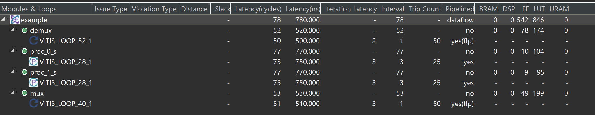</div>

The dataflow view is shown below:

<div align=center>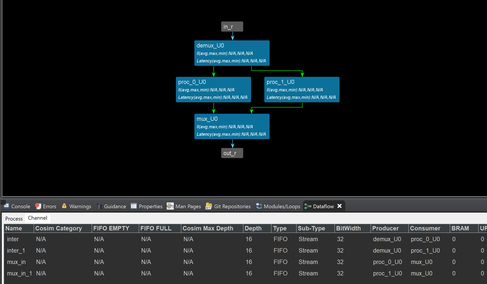</div>

**example_test.cpp**
```c++
#include "example.h"

void example(stream<int>& in, stream<int>& out);

int main() {

    stream<int> in("in_stream");
    stream<int> out("out_stream");

    int N = 50;
    for (int i = 0; i < N; i++)
        in << i;

    example(in, out);

    for (int p = 0; p < N; p++) {
        int var;
        out.read(var);
        printf("var is %d\r\n ",var);

    }
    return 0;
}
```

And this IP can transfer data with the AXI_DMA, because the port is ```axis```, but we should add the ```middle_data``` IP to provide the ```last``` signal. You can find the ```middle_data``` coding in the [Lab5/Simple_data_driven/Export the test_IP](https://uri-nextlab.github.io/ParallelProgammingLabs/HLS_Labs/Lab5.html#export-the-testip).

#### Create the Vivado project

The configure block design can use reference materials [here](https://uri-nextlab.github.io/ParallelProgammingLabs/HLS_Labs/Lab1.html). And we need to choose the number of the DMA according to the number of the interface.

<div align=center>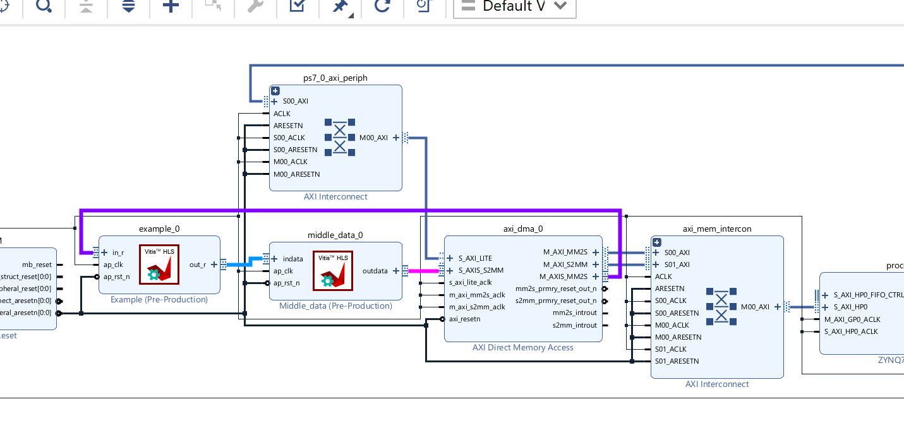</div>

#### Run synthesis,  Implementation, and generate bitstream

It may show some errors about I/O Ports, please fix them.

#### Download the bitstream file to PYNQ

<div align=center></div>


```python
import numpy as np
import pynq
from pynq import MMIO
hw = pynq.Overlay('design_1.bit')
```


```python
s2mm = hw.axi_dma_0.sendchannel
mm2s = hw.axi_dma_0.recvchannel
```

#### Allocate DMA memory address size
```python
top=hw.example_0
N = 50
oBuf_0 = allocate(shape=(N,), dtype = np.int32)
iBuf_0 = allocate(shape=(N,), dtype = np.int32)
for i in range(N):
    iBuf_0[i]= i
```


```python 
#begin the DMA transfer
s2mm.transfer(iBuf_0)
mm2s.transfer(oBuf_0)
s2mm.wait()
mm2s.wait()
```

We will see:

<div align=center></div>

## using_C++_templates

Vitis HLS supports the use of templates in C++ for synthesis. Vitis HLS does not support templates for the top-level function.

Templates can also be used to implement a recursion form unsupported in standard C synthesis (Recursive Functions).

The following code example shows a case in which a templatized ```struct``` is used to implement a tail-recursion Fibonacci algorithm. The key to performing synthesis is that a termination class is used to implement the final call in the recursion, where a template size of one is used.

**cpp_template.h**
```c++
#ifndef _CPP_TEMPLATE_H_
#define _CPP_TEMPLATE_H_

#include <cstdlib>
#include <fstream>
#include <iomanip>
#include <iostream>
using namespace std;

#define FIB_N 5

typedef int data_t;

void cpp_template(data_t a, data_t b, data_t& dout);

#endif
```

**cpp_template.cpp**
```c++
#include "cpp_template.h"

// Tail recursive call
template <data_t N> struct fibon_s {
    template <typename T> static T fibon_f(T a, T b) {
        return fibon_s<N - 1>::fibon_f(b, (a + b));
    }
};

// Termination condition
template <> struct fibon_s<1> {
    template <typename T> static T fibon_f(T a, T b) { return b; }
};

void cpp_template(data_t a, data_t b, data_t& dout) {
    dout = fibon_s<FIB_N>::fibon_f(a, b);
}
```

**cpp_template_test.cpp**
```c++
#include "cpp_template.h"

int main() {
    ofstream result;
    data_t input, output;
    int retval = 0;


    for (data_t i = 0; i <= 250; i++) {
        input = i;
        cpp_template(input, input + 1, output);
        printf("output is %d\r\n",output);

    }


}
```
## using_C++_templates_for_multiple_instances

A static variable in a template function is duplicated for each different value of the template arguments.

Different C++ template values passed to a function create unique instances of the function for each template value. Vitis HLS synthesizes these copies independently within their context. This can be beneficial because the tool can provide specific optimizations for each unique instance, producing a straightforward implementation of the function.

This simple example shows how to use C++ template functions to create multiple instances of the same function. This is one way to prevent
Vitis HLS from creating one module master and then sharing the instance of the master across multiple cycles. The template function method can be used to create multiple instances of the same function and Vitis HLS would treat them as separate unique functions that are not shared. 

**cpp_template.cpp**
```c++
#include "cpp_template.h"

void cpp_template(int inp, int* out) {
    int out0, out1, out2, out3, out4;

    // Use templated functions to get multiple instances
    // of the same function.
    func_with_static<1>(inp, &out0);
    func_with_static<2>(inp, &out1);
    func_with_static<3>(inp, &out2);
    func_with_static<4>(inp, &out3);
    func_with_static<5>(inp, &out4);

    *out += out0 + out1 + out2 + out3 + out4;
}
```

**cpp_template.h**
```c++
#ifndef _CPP_TEMPLATE_H_
#define _CPP_TEMPLATE_H_

#include <cstdio>

void cpp_template(int inp, int* out);

template <int K> void func_with_static(int inp, int* dout) {
    // Use inline off pragma to avoid automatic inlining
#pragma HLS INLINE off
    static int acc = 0;
    acc += inp;
    *dout = acc;
}

#endif
```
**cpp_template_test.cpp**
```c++

#include "cpp_template.h"

int main() {
    int total_dut = 0;
    int retval = 0;

    // Call the DUT
    for (int i = 0; i < 10; i++) {
        cpp_template(i, &total_dut);
    }

    // Compare the results
    retval = (825 != total_dut);
    if (retval != 0) {
        printf("Test failed  !!!\n");
        retval = 1;
    } else {
        printf("Test passed !\n");
    }

    // Return 0 if the test passed
    return retval;
}
```


## using_arbitrary_precision_arith

Vitis HLS does not support C arbitrary precision types. AMD recommends using C++ types with arbitrary precision.
Vitis HLS provides arbitrary precision integer data types that manage the value of the integer numbers within the boundaries of the specified width, as shown in the following table. [Ref](https://docs.xilinx.com/r/en-US/ug1399-vitis-hls/Arbitrary-Precision-Data-Types-Library)

<div align=center>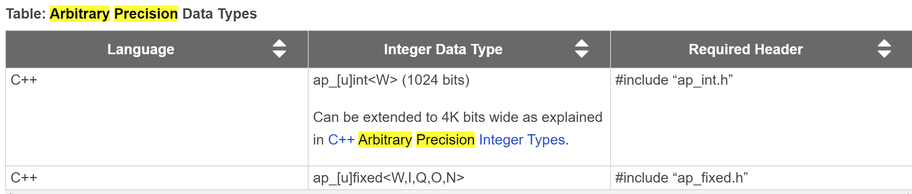</div>

The header file ap_int.h defines the arbitrary precision integer data type for the C++ ```ap_[u]int``` data types. To use arbitrary precision integer data types in a C++ function:

* Add header file ap_int.h to the source code.

* Change the bit types to ```ap_int<N>``` for signed types or ```ap_uint<N>``` for unsigned types, where ```N``` is a bit-size from 1 to 1024.

This example illustrates defining arbitrary precision variables through the ap_int.h library

**cpp_ap_int_arith.h**
```c++
#ifndef _CPP_AP_INT_ARITH_H_
#define _CPP_AP_INT_ARITH_H_

#include "ap_int.h"
#include <stdio.h>

#define N 9

// Old data types
// typedef char dinA_t;
// typedef short dinB_t;
// typedef int dinC_t;
// typedef long long dinD_t;
// typedef int dout1_t;
// typedef unsigned int dout2_t;
// typedef int32_t dout3_t;
// typedef int64_t dout4_t;

typedef ap_int<6> dinA_t;
typedef ap_int<12> dinB_t;
typedef ap_int<22> dinC_t;
typedef ap_int<33> dinD_t;

typedef ap_int<18> dout1_t;
typedef ap_uint<13> dout2_t;
typedef ap_int<22> dout3_t;
typedef ap_int<6> dout4_t;

void cpp_ap_int_arith(dinA_t inA, dinB_t inB, dinC_t inC, dinD_t inD,
                      dout1_t* out1, dout2_t* out2, dout3_t* out3,
                      dout4_t* out4);

#endif
```

**cpp_ap_int_arith.cpp**
```c++
#include "cpp_ap_int_arith.h"

void cpp_ap_int_arith(dinA_t inA, dinB_t inB, dinC_t inC, dinD_t inD,
                      dout1_t* out1, dout2_t* out2, dout3_t* out3,
                      dout4_t* out4) {

    // Basic arithmetic operations
    *out1 = inA * inB;
    *out2 = inB + inA;
    *out3 = inC / inA;
    *out4 = inD % inA;
}
```

**cpp_ap_int_arith_test.cpp**
```c++
#include "cpp_ap_int_arith.h"

int main() {
    dinA_t inA;
    dinB_t inB;
    dinC_t inC;
    dinD_t inD;
    dout1_t out1;
    dout2_t out2;
    dout3_t out3;
    dout4_t out4;

    int i, retval = 0;


    for (i = 0; i < N; i++) {
        // Create input data
        inA = i + 2;
        inB = i + 23;
        inC = i + 234;
        inD = i + 2345;

        // Call the function to operate on the data
        cpp_ap_int_arith(inA, inB, inC, inD, &out1, &out2, &out3, &out4);

    }

}
```
## using_arbitrary_precision_casting

This simple test illustrates casting to/from arbitrary precision data types defined through ap_int.h

**arbitrary_precision_casting.cpp**
```c++
#include "arbitrary_precision_casting.h"

dout_t arbitrary_precision_casting(din_t a, din_t b) {

    return (dout_t)a * (dout_t)b;
}
```

**arbitrary_precision_casting.h**
```c++
#ifndef _ARBITRARY_PRECISION_CASTING_H_
#define _ARBITRARY_PRECISION_CASTING_H_

#include <fstream>
#include <iostream>
using namespace std;

#include "ap_int.h"

typedef ap_int<18> din_t;
typedef ap_int<36> dout_t;

dout_t arbitrary_precision_casting(din_t a, din_t b);

#endif
```

**arbitrary_precision_casting_test.cpp**
```c++
#include "arbitrary_precision_casting.h"

int main() {
    din_t A, B;
    dout_t RES;
    int i, retval = 0;


    // Call the function
    A = 65536;
    B = 65536;
    for (i = 0; i < 20; ++i) {
        RES = arbitrary_precision_casting(A, B);
        A = A + 1024;
        B = B - 2047;
        printf("RES is %u\r\n",RES);
    }
}
```


## using_fixed_point

In Vitis HLS, it is important to use fixed-point data types, because the behavior of the C++ simulations performed using fixed-point data types match that of the resulting hardware created by synthesis. This allows you to analyze the effects of bit-accuracy, quantization, and overflow with fast C-level simulation.

These data types manage the value of real (non-integer) numbers within the boundaries of a specified total width (W) and integer width (I) with the expression (W = I + B), as shown in the following figure. [Ref](https://docs.xilinx.com/r/en-US/ug1399-vitis-hls/Arbitrary-Precision-Fixed-Point-Data-Types)

<div align=center>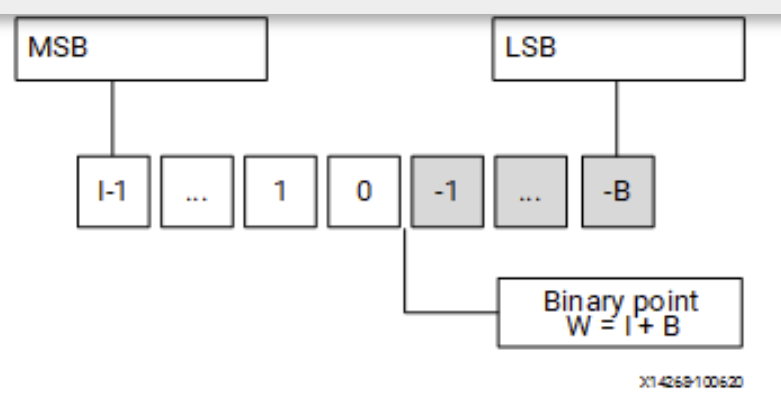</div>

This simple test illustrates how to use ap_fixed/ap_ufixed fixed point data types.

**cpp_ap_fixed.h**
```c++
#ifndef _CPP_AP_FIXED_H_
#define _CPP_AP_FIXED_H_

#include <cmath>
#include <cstdlib>
#include <fstream>
#include <iomanip>
#include <iostream>
using namespace std;
#include "ap_fixed.h"

typedef ap_ufixed<10, 8, AP_RND, AP_SAT> din1_t;
typedef ap_fixed<6, 3, AP_RND, AP_WRAP> din2_t;
typedef ap_fixed<22, 17, AP_TRN, AP_SAT> dint_t;
typedef ap_fixed<36, 30> dout_t;

dout_t cpp_ap_fixed(din1_t d_in1, din2_t d_in2);

#endif
```

**cpp_ap_fixed.cpp**
```c++
#include "cpp_ap_fixed.h"

dout_t cpp_ap_fixed(din1_t d_in1, din2_t d_in2) {

    static dint_t sum;
    sum = +d_in1;
    return sum * d_in2;
}
```

**cpp_ap_fixed_test.cpp**
```c++
#include "cpp_ap_fixed.h"

int main() {
    ofstream result;
    din1_t in1 = 0.25;
    din2_t in2 = 2.125;
    dout_t output;
    int retval = 0;


    for (int i = 0; i <= 250; i++) {
        output = cpp_ap_fixed(in1, in2);
        printf("output is %u\r\n",output);
        in1 = in1 + din1_t(0.25);
        in2 = in2 - din2_t(0.125);
    }
}
```
<div align=center>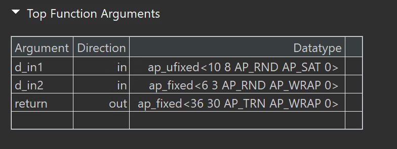</div>

## using_float_and_double

Advanced floating-point power of 2 with bounds checking and defining helper typedefs to allow easy parsing of the IEEE-754 floating-point fields.

**fp_mul_pow2.c**
```c++
#include "fp_mul_pow2.h"

#ifdef ABS
#undef ABS
#endif
#define ABS(n) ((n < 0) ? -n : n)

float float_mul_pow2(float x, int8_t n) {
  float_num_t x_num, prod;

  x_num.fp_num = x;
#ifndef AESL_FP_MATH_NO_BOUNDS_TESTS
  if (x_num.bexp == 0xFF || x_num.bexp == 0) // pass through NaN, INF & denorm
    prod.fp_num = x_num.fp_num;
  else if (n >= 0 && x_num.bexp >= 255 - n) { // detect and handle overflow
    prod.sign = x_num.sign;                   //
    prod.bexp = 0xFF;                         // +/-INF
    prod.mant = 0;                            //
  } else if (n < 0 &&
             x_num.bexp <= ABS(n)) { // handle underflow (doesn't gen denorms)
    prod.sign = x_num.sign;          //
    prod.bexp = 0;                   // +/-ZERO
    prod.mant = 0;                   //
  } else
#endif // AESL_FP_MATH_NO_BOUNDS_TESTS not defined
  {
    prod.sign = x_num.sign;
    prod.bexp = x_num.bexp + n;
    prod.mant = x_num.mant;
  }
  return prod.fp_num;
}

double double_mul_pow2(double x, int16_t n) {
  double_num_t x_num, prod;

  x_num.fp_num = x;
#ifndef AESL_FP_MATH_NO_BOUNDS_TESTS
  if (x_num.bexp == 0xFF || x_num.bexp == 0) // pass through NaN, INF & denorm
    prod.fp_num = x_num.fp_num;
  else if (n >= 0 && x_num.bexp >= 2047 - n) { // detect and handle overflow
    prod.sign = x_num.sign;                    //
    prod.bexp = 0x7FF;                         // +/-INF
    prod.mant = 0;                             //
  } else if (n < 0 &&
             x_num.bexp <= ABS(n)) { // handle underflow (doesn't gen denorms)
    prod.sign = x_num.sign;          //
    prod.bexp = 0;                   // +/-ZERO
    prod.mant = 0;                   //
  } else
#endif // AESL_FP_MATH_NO_BOUNDS_TESTS not defined
  {
    prod.sign = x_num.sign;
    prod.bexp = x_num.bexp + n;
    prod.mant = x_num.mant;
  }
  return prod.fp_num;
}
```

**fp_mul_pow2.h**
```c++
#ifndef FLOAT_MUL_POW2_H_
#define FLOAT_MUL_POW2_H_

#include <stdint.h>

// Uncomment the following line to eliminate bounds checking, ignoring
//overflow, underflow, NaN inputs, etc.
//#define AESL_FP_MATH_NO_BOUNDS_TESTS

// Helper typedefs that allow easy parsing of the IEEE-754 floating point
// format fields (sign, biased exponent and mantissa), via C bit-fields, as
// well as directly manipulating the whole word bitfield ('raw_bits').
typedef union {
    float fp_num;
    uint32_t raw_bits;
    struct {
        uint32_t mant : 23;
        uint32_t bexp : 8;
        uint32_t sign : 1;
    };
} float_num_t;

typedef union {
    double fp_num;
    uint64_t raw_bits;
    struct {
        uint64_t mant : 52;
        uint64_t bexp : 11;
        uint64_t sign : 1;
    };
} double_num_t;

// These functions implement floating point (single- and double-precision)
// multiplication by a power-of-two for HLS. Multiplication by a power-of-two
// can be much more effecient than arbitrary multiplication, because it can
// be reduced to a simple 8- or 11-bit (single- & double-precision
// respectively) addition to the biased exponent w/ some basic checks for
// overflow and underflow (which can be eliminated if desired by defining the
// preprocessor macro AESL_FP_MATH_NO_BOUNDS_TESTS.
float float_mul_pow2(float x, int8_t n);
double double_mul_pow2(double x, int16_t n);

#endif // FLOAT_MUL_POW2_H_
```

**fp_mul_pow2_test.c**
```c++
#include <math.h>
#include <stdio.h>
#include <stdlib.h>

#include "fp_mul_pow2.h"

#define NUM_TEST_ITERS 16

// Simple test program to validate SW models and for re-use in RTL co-simulation
int main(void) {
  double test_val = 1.5;
  int16_t test_exp = -15;
  double_num_t hw_result, sw_result;
  unsigned i, err_cnt = 0;

  for (i = 0; i < NUM_TEST_ITERS; i++) {
    // Get results from HW version
    hw_result.fp_num = double_mul_pow2(test_val, test_exp);
    // Generate expected result
    sw_result.fp_num = test_val * pow(2.0, test_exp);
    // Print out the result
    print("hw_result = %13g : bits = 0x%016llX : ", hw_result.fp_num,
           (unsigned long long)hw_result.raw_bits);
    printf("sign = %c, exp = %5d, mant = 0x%014llX", hw_result.sign ? '-' : '+',
           (int)hw_result.bexp - 1023, (unsigned long long)hw_result.mant);
    // Check for mismatch
    if (hw_result.fp_num != sw_result.fp_num) {
      err_cnt++;
      printf(" !!! MISMATCH !!!\n");
      printf("sw_result = %13g : bits = 0x%016llX : ", sw_result.fp_num,
             (unsigned long long)sw_result.raw_bits);
      printf("sign = %c, exp = %5d, mant = 0x%014llX\n",
             sw_result.sign ? '-' : '+', (int)sw_result.bexp - 1023,
             (unsigned long long)sw_result.mant);
    } else {
      printf("\n");
    }
    // Generate new inputs
    test_val = ((RAND_MAX / 2) - rand()) / (float)rand();
    test_exp = 1023 - (rand() & 0x7FF);
  }

  // Print final test status
  if (err_cnt)
    printf("!!! TEST FAILED !!!\n");
  else
    printf("*** Test passed ***\n");
  // Return 0 only on success
  if (err_cnt)
    return 1;
  else
    return 0;
}
```

## using_vectors

The vector data type is provided to model and synthesize single instruction multiple data (SIMD) type operations easily. Many operators are overloaded to provide SIMD behavior for vector types. The AMD Vitis™ HLS library provides the reference implementation for the ```hls::vector<T, N>``` type which represents a single-instruction multiple-data (SIMD) vector, as defined below.

* ```T```: The type of elements that the vector holds, can be a user-defined type that must provide common arithmetic operations.

* ```N```: The number of elements that the vector holds, must be a positive integer.

* The best performance is achieved when both the bit-width of ```T``` and ```N``` are integer powers of 2.

Vitis HLS provides a template type ```hls::vector``` that can be used to define SIMD operands. All the operations performed using this type are mapped to hardware during synthesis that will execute these operations in parallel. These operations can be carried out in a loop pipelined with II=1.

**Vector Data Type Usage**

The vector data type is provided to model and synthesize SIMD-type vector operations easily. AMD Vitis™ HLS vector data type can be defined as follows, where ```T``` is a primitive or user-defined type with most of the arithmetic operations defined on it. ```N``` is an integer greater than zero. Once a vector type variable is declared it can be used like any other primitive type variable to perform arithmetic and logic operations.

**Memory Layout**

For any vector type defined as ```hls::vector<T, N>```, the storage is guaranteed to be contiguous of size ```sizeof(T)*N``` and aligned to the greatest power of 2 such that the allocated size is at least ```sizeof(T)*N```. In particular, when N is a power of 2 and ```sizeof(T)``` is a power of 2, ```vector<T, N>``` is aligned to its total size. This matches vector implementation on most architectures.

**Requirements and Dependencies**

Vitis HLS vector types require support for C++ 14 or later. It has the following dependencies on the standard headers:

* ```<array>```: ```std::array<T,N>```

* ```<cassert>```: ```assert```

* ```<initializer list>```: ```std::initializer list<T>```

**Supported Operations**

* Initialization:

```c++
hls::vector<int, 4> x; // uninitialized
hls::vector<int, 4> y = 10; // scalar initialized: all elements set to 10
hls::vector<int, 4> z = {0, 1, 2, 3}; // initializer list (must have 4 elements)
hls::vector<ap_int, 4> a; // uninitialized arbitrary precision data type
```
* Access:

The operator[] enables access to individual elements of the vector, similar to a standard array:

```c++
x[i] = ...; // set the element at index i
... = x[i]; // value of the element at index i
```

This example illustrates using Load-Compute-Store using a vector datatype.

**example.h**
```c++
#ifndef __EXAMPLE_H__
#define __EXAMPLE_H__

#include "hls_vector.h"
#include <ap_int.h>

#define NUM 32

// Each vector will be 64 bytes (16 x 4 bytes)
typedef hls::vector<float, 16> float16;

extern "C" void example(float16* res, const float16* lhs, const float16* rhs,
                        int n);
#endif
```
**example.cpp**
```c++
#include "example.h"
#include <iostream>

template <int N, typename T> void load(T (&out)[N], const T* in) {
#pragma HLS INLINE off
    for (int i = 0; i < N; ++i) {
#pragma HLS pipeline
        out[i] = in[i];
    }
}

template <int N, typename T> void store(T* out, const T (&in)[N]) {
#pragma HLS INLINE off
    for (int i = 0; i < N; ++i) {
#pragma HLS pipeline
        out[i] = in[i];
    }
}

template <int N, typename T, typename S>
void compute(T (&res)[N], const S (&lhs)[N], const S (&rhs)[N]) {
#pragma HLS INLINE off
    for (int i = 0; i < N; ++i) {
#pragma HLS pipeline
        res[i] = lhs[i] + rhs[i];
    }
}

extern "C" void example(float16* res, const float16* lhs, const float16* rhs,
                        int n) {
#pragma HLS INTERFACE m_axi port = lhs offset = slave bundle = gmem0 depth = 32
#pragma HLS INTERFACE m_axi port = rhs offset = slave bundle = gmem1 depth = 32
#pragma HLS INTERFACE m_axi port = res offset = slave bundle = gmem0 depth = 32
#pragma HLS INTERFACE mode=s_axilite port=return
#pragma HLS INTERFACE mode=s_axilite port=n
    for (int i = 0; i < n; ++i) {
        float16 lhs_buf[NUM];
        float16 rhs_buf[NUM];
        float16 res_buf[NUM];

#pragma HLS DATAFLOW
        load(lhs_buf, lhs);
        load(rhs_buf, rhs);
        compute(res_buf, lhs_buf, rhs_buf);
        store(res, res_buf);
    }
}
```
The synthesis report is shown below:

<div align=center>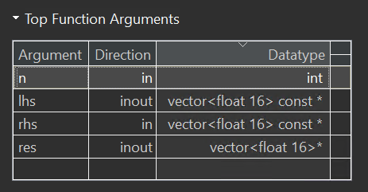</div>

The dataflow view is shown below:

<div align=center>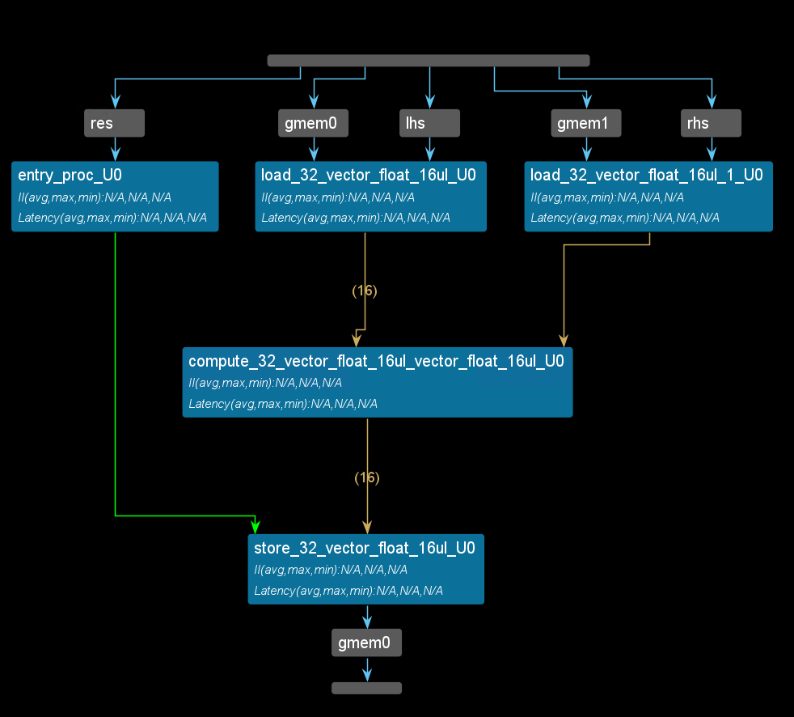</div>

**example_tb.cpp**
```c++
#include "example.h"
#include <iostream>
#include <vector>

int main(int, char**) {

    // The size of these vectors needs to match the depth of the adapter fifo
    // (specified via the depth option to interface pragma)
    std::vector<float16> lhs(32);
    std::vector<float16> rhs(32);
    std::vector<float16> res(32);
//this is the same as res[32][16]
//typedef hls::vector<float, 16> float16;

    float16 tmp1 = {3.2, 1.1, 1.1, 1.1, 1.1, 1.1, 1.1, 1.1,
                    3.2, 1.1, 1.1, 1.1, 1.1, 1.1, 1.1, 1.1};
    float16 tmp2 = {9.2, 8.1, 9.1, 6.1, 5.3, 3.2, 5.9, 3.8,
                    3.9, 9.1, 3.3, 4.5, 9.9, 2.1, 2.7, 6.1};
    for (int i = 0; i < NUM; i++) {
        lhs[i] = i % 2 ? tmp1 : tmp2;
        rhs[i] = i % 2 ? tmp2 : tmp1;
    }

    std::cout << "Size of res.data() = " << res.size() << std::endl;

    example(res.data(), lhs.data(), rhs.data(), 2);
  //   example(res.data(), &tmp1, &tmp2, 1);

    std::cout << "The output value for res[0][1] should be 9.2 and is "
              << res[0][1] << std::endl;

    return 0;
}
```
This function ```example``` is to add the array ```lhs``` and ```rhs```.
You can see the result is right by running ```C simulation``` like below:

<div align=center>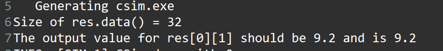</div>

#### Create the Vivado project

The configure block design can use reference materials [here](https://uri-nextlab.github.io/ParallelProgammingLabs/HLS_Labs/Lab1.html). And we need to choose the number of the DMA according to the number of the interface.

<div align=center>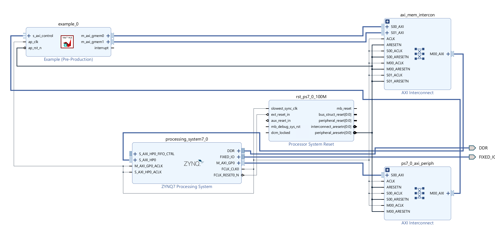</div>

#### Run synthesis,  Implementation, and generate bitstream

It may show some errors about I/O Ports, please fix them.

#### Download the bitstream file to PYNQ

<div align=center></div>

```python
import numpy as np
import pynq
from pynq import MMIO
overlay = pynq.Overlay('design_1.bit')

```

#### Allocate DMA memory address size
```python
top_ip = overlay.example_0
top_ip.signature
a_buffer = pynq.allocate((16), np.float32)
b_buffer = pynq.allocate((16), np.float32)
sum_buffer = pynq.allocate((16), np.float32)

tmp1 = [3.2, 1.1, 1.1, 1.1, 1.1, 1.1, 1.1, 1.1, 3.2, 1.1, 1.1, 1.1, 1.1, 1.1, 1.1, 1.1]
tmp2 = [9.2, 8.1, 9.1, 6.1, 5.3, 3.2, 5.9, 3.8,3.9, 9.1, 3.3, 4.5, 9.9, 2.1, 2.7, 6.1]

for i in range(0,16):
    a_buffer[i]=tmp1[i]
    b_buffer[i]=tmp2[i]
```


```python 
aptr = a_buffer.physical_address
bptr = b_buffer.physical_address
sumptr = sum_buffer.physical_address
```

```python
top_ip.register_map.n=1
top_ip.write(0x10, sumptr)
top_ip.write(0x1c, aptr)
top_ip.write(0x28, bptr)

# start the HLS kernel
top_ip.write(0x00, 1)
isready = top_ip.read(0x00)

print("\nFPGA returns:")
print(sum_buffer[0:10])
```

We will see:

<div align=center>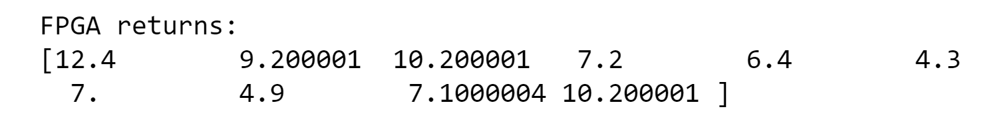</div>

## variable_bound_loops

Some of the optimizations that Vitis HLS can apply are prevented when the loop has [variable bounds](https://docs.xilinx.com/r/en-US/ug1399-vitis-hls/Working-with-Variable-Loop-Bounds).

This example shows how to write a loop that has a variable bound and apply pragmas/directives to such a loop. 

**loop_var.h**
```c++
#ifndef _LOOP_VAR_H_
#define _LOOP_VAR_H_

#include <fstream>
#include <iostream>
using namespace std;

#include "ap_int.h"
#define N 32

typedef ap_int<8> din_t;
typedef ap_int<13> dout_t;
typedef ap_uint<6> dsel_t;

dout_t loop_var(din_t A[N], dsel_t width);
dout_t loop_max_bounds(din_t A[N], dsel_t width);

#endif
```

**loop_var.cpp**
```c++
#include "loop_var.h"

dout_t loop_var(din_t A[N], dsel_t width) {

    dout_t out_accum = 0;
    dsel_t x;

LOOP_X:
    for (x = 0; x < width; x++) {
//#pragma HLS UNROLL
        out_accum += A[x];
    }

    return out_accum;
}


dout_t loop_max_bounds(din_t A[N], dsel_t width) {

 dout_t out_accum=0;
 int x;

 LOOP_X:for (x=0; x<N; x++) {
//#pragma HLS UNROLL
 if (x<width) {
  out_accum += A[x];
 }
 }
 return out_accum;
}
```

Attempting to optimize the design (```loop_var```) in the example above reveals the issues created by variable loop bounds. The first issue with variable loop bounds is that they prevent Vitis HLS from determining the latency of the loop. Vitis HLS can determine the latency to complete one iteration of the loop. Still, because it cannot statically determine the exact variable ```width```, it does not know how many iterations are performed and thus cannot report the loop latency (the number of cycles to execute all iterations of the loop completely).

<div align=center>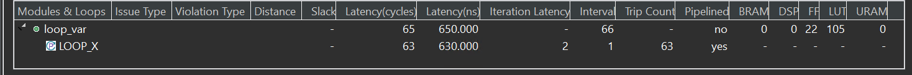</div>

The report shows that the ```Trip Counter``` is 63 becauce the type of the ```x``` is ```ap_uint<6>```.

The solution to loops with variable bounds is to make the number of loop iteration a fixed value with conditional executions inside the loop. The code from the variable loop bounds example can be rewritten as shown in the following code example. Here, the loop bounds are explicitly set to the maximum value of variable width and the loop body is conditionally executed (```loop_max_bounds```).

<div align=center>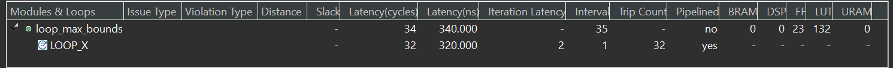</div>

**loop_var_tb.c++**
```c++
#include "loop_var.h"

dout_t loop_max_bounds(din_t A[N], dsel_t width) ;

int main() {
    din_t A[N];
    dsel_t x = 16;
    dout_t accum;
    int i= 0;
    for (i = 0; i < N; ++i) {
        A[i] = i;
    }
    // Call the function
    for (i = 0; i < N; ++i) {
//        x = i;
        accum = loop_max_bounds(A, x);
        printf("accum is %d\r\n",accum);
    }
}
```

## Demonstrate
Please create an HLS component to achieve II=1 from II=4, create an HLS component for using the vector datatype, and implement them on the PYNQ-Z2 board. And you can refer to the example of the first and ```using_vectors ``` part above.
