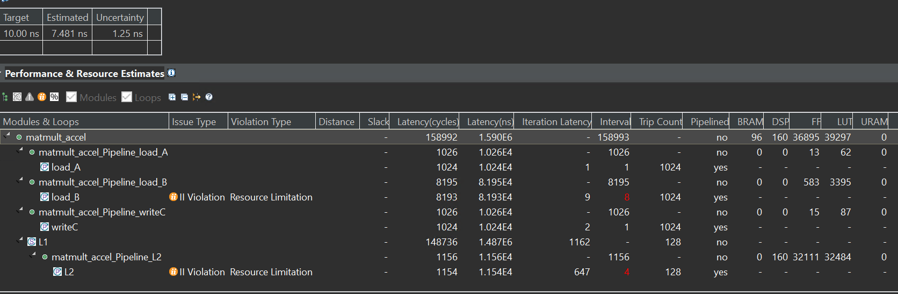
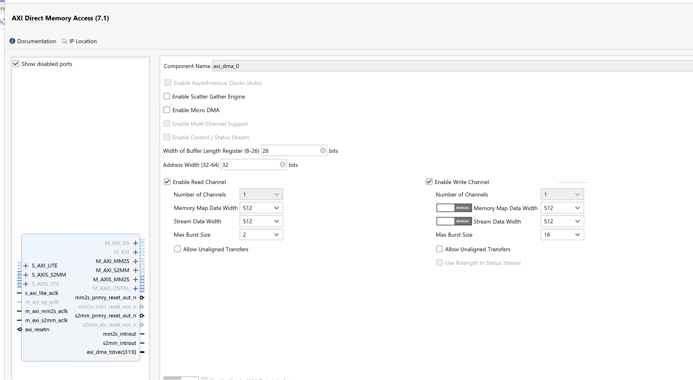

# Lab17 Matmult

<script type="text/x-mathjax-config">
  MathJax.Hub.Config({
    tex2jax: {
        inlineMath: [ ['$','$'], ["\\(","\\)"] ],
        displayMath: [ ['$$','$$'], ["\\[","\\]"] ],
        processEscapes: false,
    }
  });
</script> 
    
<script type="text/javascript"
        src="https://cdn.mathjax.org/mathjax/latest/MathJax.js?config=TeX-AMS-MML_HTMLorMML">
</script>

## Introduction

This lab will have a concrete example for matrix optimization. 

**matmult.cpp**
```c++
#include "matmult.h"
#include "hls_stream.h"

template <typename T> void kernel_mmult(T a[N2], T b[N2], T out[N2]) {
#pragma HLS INLINE
#pragma HLS ARRAY_PARTITION variable = a factor = 16 dim = 1 cyclic
#pragma HLS ARRAY_PARTITION variable = b factor = 16 dim = 1 block
#pragma HLS ARRAY_PARTITION variable = out factor = 16 dim = 1 cyclic
L1:
  for (int m = 0; m < N; ++m) {
  L2:
    for (int n = 0; n < N; ++n) {
#pragma HLS PIPELINE II = 1
      T sum = 0;
    L3:
      for (int k = 0; k < N; ++k)
        sum += a[m * N + k] * b[k * N + n];
      out[m * N + n] = sum;
    }
  }
  return;
}

extern "C" {
void matmult_accel(hls::stream<axis_t> &in, hls::stream<axis_t> &out) {
#pragma HLS INTERFACE s_axilite port = return bundle = control
#pragma HLS INTERFACE axis port = in
#pragma HLS INTERFACE axis port = out
#pragma HLS INTERFACE ap_ctrl_none port=return

  DataType l_A[N2];
  DataType l_B[N2];
  DataType l_C[N2];

#pragma HLS ARRAY_PARTITION variable = l_A factor = 16 dim = 1 cyclic
#pragma HLS ARRAY_PARTITION variable = l_B factor = 16 dim = 1 block
#pragma HLS ARRAY_PARTITION variable = l_C factor = 16 dim = 1 cyclic

  int j_limit = 512 / DataTypeSize;
  int i_limit = N2 / j_limit;
  converter_t converter;

load_A:
  for (int i = 0; i < i_limit; i++) {
    axis_t temp = in.read();
    for (int j = 0; j < j_limit; j++) {
      int high = j * DataTypeSize + DataTypeSize - 1;
      int low = j * DataTypeSize;
      int index = i * 16 + j;
      converter.i = temp.data.range(high, low);
      l_A[index] = converter.d;
    }
  }


load_B:
  for (int i = 0; i < i_limit; i++) {
    axis_t temp = in.read();
    for (int j = 0; j < j_limit; j++) {
      int high = j * DataTypeSize + DataTypeSize - 1;
      int low = j * DataTypeSize;
      int index = i * 16 + j;
      converter.i = temp.data.range(high, low);
      l_B[index] = converter.d;
    }
  }
  kernel_mmult<DataType>(l_A, l_B, l_C);
writeC:
  for (int i = 0; i < i_limit; i++) {
    axis_t temp;
    for (int j = 0; j < j_limit; j++) {
      int high = j * DataTypeSize + DataTypeSize - 1;
      int low = j * DataTypeSize;
      converter.d = l_C[i * 16 + j];
      temp.data.range(high, low) = converter.i;
    }

    if (i == i_limit - 1) {
    	 temp.last = 1;
    }
    else
    {
       temp.last = 0;
    }
    temp.keep = -1; // enabling all bytes
    out.write(temp);
  }
}
}
```

We set the function ```matmult_accel``` as the top function and run C synthesis. The report is shown below:

<div align=center></div>

And we can have an analysis for the report. At first, the interface of the function matmult_accel is ```512-bit```, the kernel_mmult is a ```32-bit``` float, and the top function(```matmult_accel```) is the hls::stream interface. Then we can see the coding and ```j_limit``` is 16 by computing the ```512/DataTypeSize``` and ```i_limit``` is 1024 by computing the ```N2/j_limit```(N2 is defined in ```matmult.h```). The way for the optimization of mult is widening the bit for the input and output interface so that the function can read 16 data at one time, compared to the way for reading one data at one time.

And for the pragma of the array ```l_A```, ```l_B```, ```l_C```, we can see that ```l_A``` is ```cyclic``` and ```l_B``` is ```block``` and more information on the ```pragma ARRAY_PARTITION``` can be found in lab1. And because the factor is set to 16, so after the optimization array, the array ```l_A[N2]``` will be the ```l_A2[N2/16]```. And then every block will contain the ```N2/16 (16384/16=1024)```, but the array ```l_A``` is different from the array ```l_B``` as shown below:

<div align=center></div>

Assuming that ```l_A``` and ```l_B``` are 4 × 4 matrix, and we set the factor to 4, then we can see the array ```l_A``` and array ```l_B``` as shown below:

<div align=center></div>

As for the function, we can also see from the report that the array ```l_A``` and array ```l_B``` are divided into 16 blocks differently. The array ```l_A``` loads data by column, while the array ```l_B``` loads data by row.

<div align=center></div>

So as for the array ```l_A```, when Vitis HLS pipelined the inner loop of the ```load_A```, its II will be 1 while for the array ```l_B```, its II will not be 1 because Bram has two ports reading data at one clock.

And for the function ```kernel_mmult```, because N is 128 while array_patition factor is 16, every block has 1024 data, and for the array ```l_B``` is divided by the block, the II will not be 1 as shown in the report. And the DSP used 160, while the PYNQ-Z1 had 220 DSPs. We can see that ```2 × 16=32``` (2 is every port can read 2 data at one clock and 16 is the 16 blocks) and every matrix compute consumes 5 DSPs, so the total is 32 × 5=160 DSPs.


**matmult.h**
```c++
#ifndef _MMULT_
#define _MMULT_

#include "ap_axi_sdata.h"
#include "hls_vector.h"
#include "ap_int.h"
#include <inttypes.h>

#define N 128
#define N2 16384 // N*N
#define N3 16384
#define N4 128

#define DWIDTH 512
typedef ap_axiu<512, 0, 0, 0> axis_t;

typedef ap_uint<512> uint512_t;
typedef float DataType;

typedef hls::vector<DataType,16> float16;
const int DataTypeSize = sizeof(DataType) * 8;

typedef ap_uint<DataTypeSize> DataTypeInt;

typedef union converter {
  DataType d;
  uint32_t i;
} converter_t;

template <typename T> void kernel_mmult(T a[N2], T b[N2], T c[N2]);

extern "C" {
void matmult_accel(hls::stream<axis_t> &in,  hls::stream<axis_t> &out) ;}

#endif
```
**matmult_tb.cpp**
```c++
#include "matmult.h"

void mmult_sw(DataType a[N2], DataType b[N2], DataType out[N2])
{
  for (int ia = 0; ia < N; ++ia)
    for (int ib = 0; ib < N; ++ib)
    {
      float sum = 0;
      for (int id = 0; id < N; ++id)
        sum += a[ia * N + id] * b[id * N + ib];

      out[ia * N + ib] = sum;
    }
}

int main(void)
{

  int ret_val = 0;

  int i, j, err;

  DataType matOp1[N2];
  DataType matOp2[N2];
  DataType matMult_sw[N2];
  DataType matMult_hw[N2];

  /** Matrix Initiation */
  for (i = 0; i < N; i++)
    for (j = 0; j < N; j++)
      matOp1[i * N + j] = (DataType)(i + j);

  for (i = 0; i < N; i++)
    for (j = 0; j < N; j++)
      matOp2[i * N + j] = (DataType)(i * j);
  /** End of Initiation */

  kernel_mmult<DataType>(matOp1, matOp2, matMult_hw);

  /* reference Matrix Multiplication */
  mmult_sw(matOp1, matOp2, matMult_sw);

  /** Matrix comparison */
  err = 0;
  for (i = 0; (i < N && !err); i++)
    for (j = 0; (j < N && !err); j++)
      if (matMult_sw[i * N + j] != matMult_hw[i * N + j])
        err++;

  if (err == 0)
    printf("Matrixes identical ... Test successful!\r\n");
  else
    printf("Test failed!\r\n");

  return err;
}
```

**matmult_tb2.cpp**
```c++
#include "matmult.h"
#include <iostream>
#include <vector>

void mmult_sw(DataType a[N2], DataType b[N2], DataType out[N2])
{
  for (int ia = 0; ia < N; ++ia)
    for (int ib = 0; ib < N; ++ib)
    {
      float sum = 0;
      for (int id = 0; id < N; ++id)
        sum += a[ia * N + id] * b[id * N + ib];

      out[ia * N + ib] = sum;
    }
}

int main(void)
{

  int ret_val = 0;

  int i, j, err;

  DataType matOp1[N2*2];
  DataType matOp2[N2*2];

  hls::stream<axis_t> datain;
  hls::stream<axis_t> dataout;
  axis_t valuein;
  axis_t valueout;

  /** Matrix Initiation */
  for (i = 0; i < 2*N; i++)
  {
	  for (j = 0; j < N; j++)
    {
    	matOp1[i * N + j] = (DataType)(i + j);
    	matOp2[i * N + j] = (DataType)(i * j);
    }

  }
  std::vector<uint32_t> merged_data(16);

  for( i=0;i<2048;i++)
  {
	   for (j = 0; j < 16; j++)
	   {
        memcpy(&valuein.data, reinterpret_cast<uint32_t*>(&matOp1[i*16+j]), sizeof(DataType));
	   }

	  datain.write(valuein);
  }
  
  matmult_accel(datain,dataout);

  for(j=0;j<1024;j++)
  {
	  valueout=dataout.read();
  }
}
```

## Create the Vivado project

The configure block design can use reference materials [here](https://uri-nextlab.github.io/ParallelProgammingLabs/HLS_Labs/Lab1.html). And we need to choose the number of the DMA according to the number of the interface.

<div align=center></div>

Here, we need to change the data width of the AXI DMA ip, because the data width of the ```matmult_accel``` IP's interface is 512 bits, so they need to keep the same.

<div align=center></div>

## Run synthesis,  Implementation, and generate bitstream

It may show some errors about I/O Ports. Please fix them.

## Download the bitstream file to PYNQ

<div align=center></div>

```python
from pynq import (allocate, Overlay)
import numpy as np
ol = Overlay('design_1.bit')
dma = ol.axi_dma_0
mmult_ip = ol.matmult_accel_0
```


#### Allocate DMA memory address size

The hardware module implements the matrix product ```C = AB```, where ```A```, ```B```, and ```C``` are 128 x 128 floating-point matrices.

```python
DIM = 128
in_buffer = allocate(shape=(2, DIM, DIM), dtype=np.float32, cacheable=False)
out_buffer = allocate(shape=(DIM, DIM), dtype=np.float32, cacheable=False)

A = np.random.rand(DIM, DIM).astype(dtype=np.float32)
B = np.random.rand(DIM, DIM).astype(dtype=np.float32)
in_buffer[:] = np.stack((A, B))
```

```python 
#begin the DMA transfer
def run_kernel():
    dma.sendchannel.transfer(in_buffer)
    dma.recvchannel.transfer(out_buffer)
    dma.sendchannel.wait()
    dma.recvchannel.wait()
#Times an entire code cell.
%%timeit
run_kernel()
```
```python
print(out_buffer)
```
```python
%timeit A @ B
np.array_equal(A @ B, out_buffer)
```

We will see:

<div align=center></div>

This hardware accelerator provides a 1.8x speedup compared to NumPy.

## Demonstrate

Please finish the lab and implement it on the PYNQ-Z2 board.
