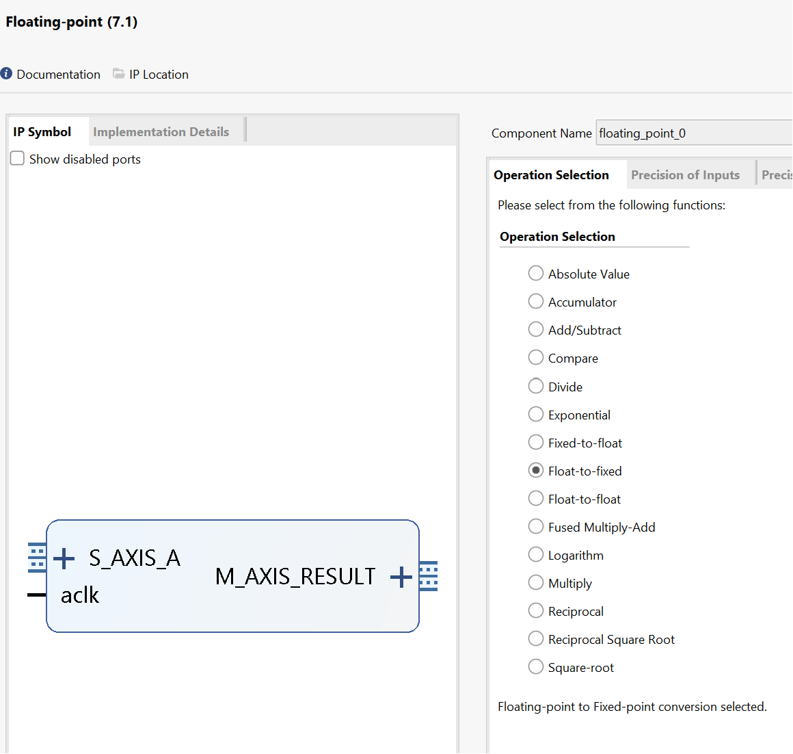
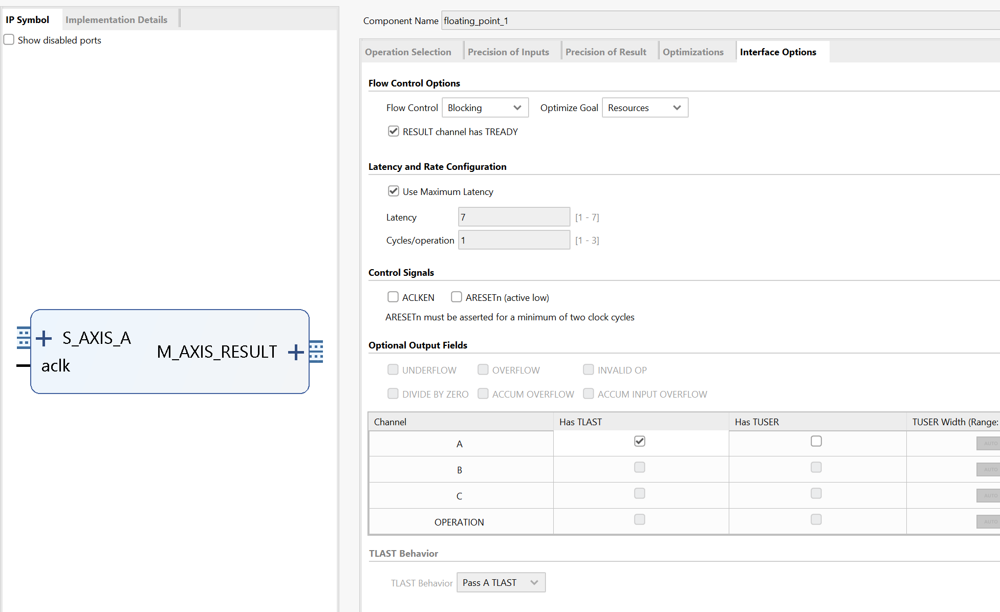
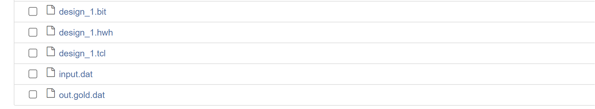

# Lab18 FIR

<script type="text/x-mathjax-config">
  MathJax.Hub.Config({
    tex2jax: {
        inlineMath: [ ['$','$'], ["\\(","\\)"] ],
        displayMath: [ ['$$','$$'], ["\\[","\\]"] ],
        processEscapes: false,
    }
  });
</script> 
    
<script type="text/javascript"
        src="https://cdn.mathjax.org/mathjax/latest/MathJax.js?config=TeX-AMS-MML_HTMLorMML">
</script>

## Introduction
Finite Impulse Response (FIR) filters are commonly used in digital signal processing (DSP) applications because they can be implemented efficiently in hardware, such as FPGAs. FIR filters operate on contiguous elements of a signal, making them suitable for streaming applications. Two main uses for FIR filters are signal separation and restoration. Signal separation involves isolating different parts of the input signal, often based on frequency ranges. Signal restoration focuses on removing noise and other distortions from the signal. FIR filters are often used with discrete signals generated by sampling continuous signals. Sampling can occur in time or space, depending on the application. For example, in digital communications, samples are often represented as complex numbers, while in image processing, each pixel may represent a sample with multiple color channels.

The Finite Impulse Response (FIR) filter is a well-known and widely used digital filter. The algorithm is shown below:

$$y[i] = \sum_{j = 0}^{N-1}h[j]x[i-j]$$

where $$h[j]$$ is the impulse response.

**Reference Material**: Ryan Kastner et al., [Parallel Programming for FPGAs](https://github.com/KastnerRG/pp4fpgas/raw/gh-pages/main.pdf), Chapter 2.

## Optimization

### The unoptimized code

The following code shows a highly unoptimized version of the FIR filter in HLS. in the header file (fir.h). This code uses ```typedef``` to define the datatype of different variables. In this example, the datatype of all three variables (```coef_t```, ```data_t```, and ```acc_t```) are int (32 bit). ```hls::axis<data_t,0,0,0>``` from ```ap_axi_sdata.h``` packs data_t into a standarded AXI4-Stream Interfaces datatype, namely, data_t_pack. ([Ref](https://docs.xilinx.com/r/en-US/ug1399-vitis-hls/How-AXI4-Stream-is-Implemented)) Finally, ```hls::stream<data_t_pack>``` from ```hls_stream.h``` creates an HLS stream (also an AXIs datatype) datatype, ```d_stream```. The block level interface of the kernel (how the kernel is triggered, ```port=return```, [Ref](https://docs.xilinx.com/r/en-US/ug1399-vitis-hls/pragma-HLS-interface)) is set as ```ap_ctrl_none```, which means the kernel is always ready to receive new data (free-running kernel).  

**fir.h**
```c++
/*
Filename: fir.h
	Header file
	FIR lab
*/
#ifndef FIR_H_
#define FIR_H_

#include "hls_stream.h"
#include "ap_axi_sdata.h"
#include "ap_fixed.h"

const int N=11;

typedef int	coef_t;
typedef int	data_t;
typedef int	acc_t;

typedef hls::axis<data_t,0,0,0> data_t_pack;
typedef hls::stream<data_t_pack> d_stream;

void fir (
  d_stream& y,
  d_stream& x
);

#endif
```


**fir.cpp**

```c++
#include "fir.h"

// Unoptimzied code in Figure 2.1

void fir(d_stream& y, d_stream& x){
#pragma HLS INTERFACE mode=ap_ctrl_none port=return
#pragma HLS INTERFACE mode=axis register_mode=both port=y
#pragma HLS INTERFACE mode=axis register_mode=both port=x
    coef_t c[N] = {
        53, 0, -91, 0, 313, 500, 313, 0, -91, 0, 53
    };
    static data_t shift_reg[N];
    data_t_pack x_temp;
    acc_t acc = 0;
    int i;
    x >> x_temp;
    // x_temp = x.read();  
    // x.read(x_temp);
    // x as an AXI4-stream input includes data, keep, and last. 

// Algorithm
Shift_Accum_Loop:
    for (i = N - 1; i >= 0; i--){
        if (i == 0){
            shift_reg[0] = x_temp.data;
            acc += x_temp.data * c[0];
        }
        else{
            shift_reg[i] = shift_reg[i-1];
            acc += shift_reg[i] * c[i];
        }
    }

// Output Stream
    data_t_pack y_temp;
    y_temp.data = acc;
    y_temp.keep = -1;
    y_temp.last = x_temp.last;
    y << y_temp;
    // y.write(y_temp);
    // It it required to pack data, keep, and last into the output y
    
    
  // Clear all shift_reg at the last data, otherwise shift_regs are non-zero next time it is called
    if (x_temp.last){
Clear_Loop:
    	for (i = N - 1; i >= 0; i--){
            shift_reg[i] = 0;
        }
    }
}
```
The synthesis report is shown below:

<div align=center></div>

The Vitis HLS will default pipeline the loop. And we can see the II of the ```Shift_Accum_Loop``` is 1 and the ```Clear_Loop``` is the same.

### Optimization 1：Loop hoisting


The if/else operation is inefficient in the for loop. Loop hoisted can be carried out.  "HLS tool creates logical hardware that checks if the condition is met, executed in every iteration of the loop. Furthermore, this conditional structure limits the execution of the statements in either the if or else branches; these statements can only be executed after the if condition statement is resolved."([Ref](https://kastner.ucsd.edu/hlsbook/)) Now the "Shift_Accum_Loop" becomes:

```c++
Shift_Accum_Loop:
    for (i = N - 1; i > 0; i--){
        shift_reg[i] = shift_reg[i-1];
        acc += shift_reg[i] * c[i];
    }

    acc += x_temp.data * c[0];
    shift_reg[0] = x_temp.data;
```
The synthesis report is shown below:

<div align=center></div>

With the new implementation, the II of the "Shift_Accum_Loop" becomes 1, and the II of the  module becomes 14. However, this performance increase is not directly from the loop hoisting optimization. Moving branch i == 0 out of the for loop reduces one write operation to the shift_reg, removing the conflict (2 writes in the same clock cycle). This design consumes 320 FFs and 383 LUTs. 

### Optimization 2: Loop fission

There are two operations in the Shift_Accum_Loop; one is moving the shift_reg, and the other is performing the multiplication and accumulation (MAC). Loop fission refers to separating the operations into independent loops. In this case, the code becomes:

```c++
TDL:
    for (i = N - 1; i > 0;i--){
        shift_reg[i] = shift_reg[i-1];
    }
    shift_reg[0] = x_temp.data;

MAC:
    for (i = N - 1; i >= 0;i--){
        acc += shift_reg[i] * c[i];
    }
```

The synthesis report is shown below:

<div align=center></div>

In the above code, the label "TDL" stands for tapped delay line, which is implemented as shift registers in a digital circuit, and "MAC" refers to multiply-accumulate. Notice that in TDL, the loop hoisting is used as it is required to check if i equals 0, while the MAC loop doesn't need loop hoisting (i > 0 or i >= 0). The II of both loops (TDL and MAC) is 1, and the II for the entire module is 48. The TDL and MAC loops consume 300 FFs and 402 LUTs. This is worse than the result with optimization 1. The II of the module becomes 48 as one loop becomes two loops, each requiring 11 trips. More LUTs are required as each loop requires its control circuit.

### Optimization 3: Loop Unrolling

Optimization 2 doesn't make the design faster but makes further optimizations possible. The HLS sequentially executes the loops, which means only one circuit instance of the loop body. Essentially, loop unrolling creates multiple running instances for the loop body. A manual unrolling TDL loop is shown below:

```c++
TDL:
    for (i = N - 1; i > 1;i= i - 2){
        shift_reg[i] = shift_reg[i-1];
        shift_reg[i-1] = shift_reg[i-2];
    }
    if (i == 1){
        shift_reg[1] = shift_reg[0];
    }
    shift_reg[0] = x_temp.data;
```
The synthesis report is shown below:

<div align=center></div>

``` if (i == 1)``` is added to support even N. The unrolling reduces the trip count and increases the hardware required. The same reason in the original code causes this. "In the unrolled code, each iteration requires that we read two values from the shift reg array and write two values to the same array. Thus, if we wish to execute both statements in parallel, we must be able to perform two read operations and two write operations from the shift reg array in the same cycle."([Ref](https://kastner.ucsd.edu/hlsbook/)) In most cases, RAM only provides one read port and one write port simultaneously. To solve this problem, the shift_array is required to be partitioned, which means saving the value in a different memory (or even registers) instead of saving all the values in one single memory. This is called array_partition. HLS provides pragma to do this in the background, this syntax is in [Ref](https://docs.xilinx.com/r/en-US/ug1399-vitis-hls/pragma-HLS-array_partition):

```
#pragma HLS array_partition variable=<variable name> type=<cyclic, block, complete> factor=<int> dim=<int>
```

Since we know that the shift_reg should be implemented as shift registers on hardware, we can simply use:

```
#pragma HLS array_partition variable=shift_reg type=complete dim=1
```

With this pragma, the HLS should be able to implement TDL with II=1, which reduces the total II of the module by 1/2.

Unrolling the TDL loop by a larger factor (or even completely) can further increase the performance. However, it is unwise and only sometimes possible to do that manually. Another pragma called ```unroll``` is provided by HLS so that the designer can realize the loop unrolling more easily; the syntax is shown below: ([Ref](https://docs.xilinx.com/r/en-US/ug1399-vitis-hls/pragma-HLS-unroll))

```
#pragma HLS unroll factor=<N> skip_exit_check
```

Manual unrolling can then be simply realized by adding pragma under the for loop header:

```c++
TDL:
    for (i = N - 1; i > 0;i--){
#pragma HLS unroll factor=2
        shift_reg[i] = shift_reg[i-1];
    }
    shift_reg[0] = x_temp.data;
```

Since N is small in the example, we can remove the ```factor=2``` so that the HLS completely unrolls the loop.

As for the MAC loop, though the accumulator acc seems to have a loop carry dependency (the next loop requires the result of the current loop), it is still possible to unroll the MAC loop (sum up the results of all independent multiplications). The unroll pragma can be used as well (the Clear_Loop can also be unrolled). Now the code becomes:

```c++
#include "fir.h"
// Unrolling and array partition

void fir(d_stream& y, d_stream& x){
#pragma HLS INTERFACE mode=ap_ctrl_none port=return
#pragma HLS INTERFACE mode=axis register_mode=both port=y
#pragma HLS INTERFACE mode=axis register_mode=both port=x
    coef_t c[N] = {
        53, 0, -91, 0, 313, 500, 313, 0, -91, 0, 53
    };
    static data_t shift_reg[N];
#pragma HLS array_partition type=complete variable=shift_reg dim=1
    data_t_pack x_temp;
    acc_t acc = 0;
    int i;
    x >> x_temp;

// Algorithm
TDL:
    for (i = N - 1; i > 0;i--){
#pragma HLS unroll
        shift_reg[i] = shift_reg[i-1];
    }
    shift_reg[0] = x_temp.data;

MAC:
    for (i = N - 1; i >= 0;i--){
#pragma HLS unroll
        acc += shift_reg[i] * c[i];
    }
    
// Output Stream
    data_t_pack y_temp;
    y_temp.data = acc;
    y_temp.keep = -1;
    y_temp.last = x_temp.last;
    y << y_temp;
    if (x_temp.last){
Clear_Loop:
    	for (i = N - 1; i >= 0;i--){
#pragma HLS unroll
            shift_reg[i] = 0;
        }
    }
}
```
The synthesis report is shown below:

<div align=center></div>

According to the synthesis result, II of the entire block becomes 4, which is a huge improvement. The trade-off is that the required FF becomes 581 and the required LUT becomes 665 and the required DSP becomes 8. This is due to the fact the unrolling and array partition increases the parallelism and of course, require more hardware resources. In this example, N = 11 so it is possible to unroll all loops and partition all arrays. If N equals 4096 or more, we may need to reduce the unroll factor to balance the resources with speed.

In addition, only 4 multipliers rather than N are used. HLS does some conditional optimization. In this case, if the coefficient is 0, it is not required to perform the multiplication. and since the coefficients are symmetric, some multiplications can be combined. Therefore, the unrolled MAC loop is finally implemented as:

```
acc = c[0] * (shift_reg[0] + shift_reg[10])
    + c[2] * (shift_reg[2] + shift_reg[8])
    + c[4] * (shift_reg[4] + shift_reg[6])
    + c[5] *  shift_reg[5]
```

Clearly, only 4 multipliers are required. The scheduling of math operations is shown below:


In the first period, three add operations are completed, corresponding to the three sums in parentheses. Then, four multiplications are done and each requires more than one clock period, which makes the result only available at the fourth (3rd in the scheduling figure) cycle. Notice that only three add operations are required as HLS automatically uses the "adder tree" structure to implement accumulation-like loops. For four numbers, only 4 adders are required.

### Optimization 4: Pipelining

Pipelining is a widely used hardware throughput improvement method. Pipelining can be applied both to a loop and a function. In this example, pipelining any loop is not a good idea as it will reduce the II of the entire module (This is why we unrolled all the loops). The unrolled loops are not loops anymore from the hardware perspective, as unrolling makes all loop iterations run together in parallel. Hence, now the module has the following stages of operations:

> 1. Read new x and shift the TDL
> 2. MAC
> 3. Write y out (and clear shift_reg when the last signal x comes)

Without pipelining, the operations are executed one by one, and new data can only be received after the last step is finished. Some resources can also be shared, for example, the adders in 2.1 can be reused in 2.3, though some extra logic may be required to control the dataflow. Pipelining, however, creates independent hardware for operation and some flip-flops to tap the inputs and middle results. The book ([Ref](https://kastner.ucsd.edu/hlsbook/)) gives an example for the MAC loop (though we are not pipelining the MAC loop here) shown below, (a) is without pipelining and (b) is with pipelining:


Notice that no resources can be shared if the function is pipelined. Circuits at different stages are processing data simultaneously. For example, the circuit at the first stage is always processing the newest data, while the circuit at the second stage is always processing the data input (via shift register) from the previous cycle and the output from the first stage circuit. Hence, pipelining mostly requires more resources.

To pipeline the loop, we can simply add a pragma to the source file (under the function or loop header). The syntax is: ([Ref](https://docs.xilinx.com/r/en-US/ug1399-vitis-hls/pragma-HLS-pipeline))

```
#pragma HLS pipeline II=<int> off rewind style=<stp, frp, flp>
```

The II determines the throughput of the module. Mostly, we want the II=1, which means the module (loop) can receive new data every clock. In this case, we just tell the tool to pipeline the fir function and the code becomes:

```c++
#include "fir.h"

// pipelining

void fir(d_stream& y, d_stream& x){
#pragma HLS INTERFACE mode=ap_ctrl_none port=return
#pragma HLS INTERFACE mode=axis register_mode=both port=y
#pragma HLS INTERFACE mode=axis register_mode=both port=x
#pragma HLS PIPELINE style=frp
    coef_t c[N] = {
        53, 0, -91, 0, 313, 500, 313, 0, -91, 0, 53
    };
    static data_t shift_reg[N];
#pragma HLS array_partition type=complete variable=shift_reg dim=1
    data_t_pack x_temp;
    acc_t acc = 0;
    int i;
    x >> x_temp;

// Algorithm
TDL:
    for (i = N - 1; i > 0;i--){
#pragma HLS unroll
        shift_reg[i] = shift_reg[i-1];
    }
    shift_reg[0] = x_temp.data;

MAC:
    for (i = N - 1; i >= 0;i--){
#pragma HLS unroll
        acc += shift_reg[i] * c[i];
    }

// Output Stream
    data_t_pack y_temp;
    y_temp.data = acc;
    y_temp.keep = -1;
    y_temp.last = x_temp.last;
    y << y_temp;
    if (x_temp.last){
Clear_Loop:
    	for (i = N - 1; i >= 0;i--){
#pragma HLS unroll
            shift_reg[i] = 0;
        }
    }
}
```
The synthesis report is shown below:

<div align=center></div>

According to the synthesis report, now the II of the entire module becomes 1 and 1306 FFs and 796 LUTs are required.  

### Optimization 5: Bitwidth Optimization

In C language supports variables with the following types:

|  type   | bit length  |  decimal support  |
|  ----  | ----  | ----  |
| char  | 8 | No |
| short  | 16 | No |
| int  | 32 | No |
| long  | 64 | No |
| float  | 32 | Yes |
| double  | 64 | Yes |

The first four types only support integers, and they can be defined as unsigned variables. ```float``` and ```double``` are floating point variables that support decimal numbers. Notice that the bit width is always 2 to the power of an integer ($8=2^3$) and the minimum bit width is 8. FPGA is not good at processing floating-point data. Therefore, once a decimal number is required to be computed in the FPGA, a common solution is to multiply the number with a large integer number $N$ and truncate the decimal parts so that it becomes an integer. Then the FPGA does the computation with the integer and provides a result. The result should be corrected with $N$ as well according to the math operation. For example, if the FPGA is used to multiply two decimal numbers 0.4 and 0.375, the first step could be multiplying each number by 1000 so that the two numbers become 400 and 375. Then the FPGA does the multiplication with the two numbers and gives the result 400 × 375=150000. The last step is to correct the result, and in this case, since both numbers are multiplied by 1000, the result must be divided by 1000 × 1000. Therefore, the final result is 0.15. An optimal way to implement this on FPGA (or any other hardware) is to use a $N$ that is 2 to the power of an integer because dividing a number with such $N$ becomes bit shifting, which is super easy to implement by hardware. In this example, it is more hardware-friendly to use $N=1024$ if you want to let FPGA do the result correction as well. This leads to the concept of fixed-point data, which is a binary number whose decimal is fixed at a constant place. For example, if a fixed-point number has a total of 8 bits and 3 bits for the integer part (we call it <8,3>), '010.11000' then translates to 2.75.

In this example, the frequency response is shown on the left of the figures below. It is definitely not a normal FIR filter since the gain at the pass band is 60dB rather than 0dB (unit gain). To make the pass band gain equal to 1, we have to divide all the coefficients by the sum of all coefficients (1050 in this case). As talked about before, it is better to use 1024 here as it is close to 1050. The frequency responses when dividing the coefficients by 1050 and 1024 are shown in the right figure, and they are almost identical.


In this example, we assume that we want a filter with a passing band gain equal to 60dB (so that we don't have to manipulate the coefficients). The maximum value of the coefficients equals 500, which means we need at least 10 bits (1 for sign) to represent the coefficient. For the input signal, we assume that the input signal ranges from -127 to +127, which means we need 8 bits to represent it. Once we know the range of the input signal, we should use as least bits as possible to optimize the resource utilization. If it is in C language, we could use short for the coefficients and char for the input signal. But this causes some waste of Flip-Flops and LUTs for the coefficients because only 10 bits are required but we can only use 16 bits. Xilinx provides an arbitrary precision numbers package in HLS so that we can define variables with custom bit width. To use the package, include ```"ap_fixed.h"``` and then define the variable type like this ([Ref](https://docs.xilinx.com/r/en-US/ug1399-vitis-hls/Arbitrary-Precision-Fixed-Point-Data-Types)):

```
typedef ap_fixed<TOTAL_WIDTH,INTEGER_WIDTH> new_type_name;
```

For example, we can define the type of coefficients like this:

```
typedef ap_fixed<10,10> coef_t;
```

In this example, the filter has a pass band gain of 60dB, which means the output range should be at least 1000 times larger than the input. Therefore, the output should have at least 8 + 10 = 18 bit width. We can use 19 bits just in case. Therefore, we have the optimized bit width here:
```
typedef ap_fixed<10,10> coef_t;
typedef ap_fixed<8,8> data_t;
typedef ap_fixed<19,19> acc_t;
```
The synthesis report is shown below:

<div align=center></div>

According to the report, the optimized design requires 195 FFs and 323 LUTs, which is much less than the one with pipelined optimization. The final code should look like this:


fir.h
```c++
#ifndef FIR_H_
#define FIR_H_

#include "hls_stream.h"
#include "ap_axi_sdata.h"
#include "ap_fixed.h"

const int N=11;

typedef ap_fixed<10,10> coef_t;
typedef ap_fixed<8,8> data_t;
typedef ap_fixed<19,19> acc_t;

typedef hls::axis<data_t,0,0,0> data_t_pack;
typedef hls::axis<acc_t,0,0,0> acc_t_pack;
typedef hls::stream<data_t_pack> d_in_stream;
typedef hls::stream<acc_t_pack> d_out_stream;

void fir (
  d_out_stream& y,
  d_in_stream& x
);

#endif
```

fir.cpp
```c++
#include "fir.h"

// Optimized code

void fir(d_out_stream& y, d_in_stream& x){
#pragma HLS INTERFACE mode=ap_ctrl_none port=return
#pragma HLS INTERFACE mode=axis register_mode=both port=y
#pragma HLS INTERFACE mode=axis register_mode=both port=x
#pragma HLS PIPELINE style=frp
    coef_t c[N] = {
        53, 0, -91, 0, 313, 500, 313, 0, -91, 0, 53
    };
    static data_t shift_reg[N];
#pragma HLS array_partition type=complete variable=shift_reg dim=1
    data_t_pack x_temp;
    acc_t acc = 0;
    int i;
    x >> x_temp;

// Algorithm
TDL:
    for (i = N - 1; i > 0;i--){
#pragma HLS unroll
        shift_reg[i] = shift_reg[i-1];
    }
    shift_reg[0] = x_temp.data;

MAC:
    for (i = N - 1; i >= 0;i--){
#pragma HLS unroll
        acc += shift_reg[i] * c[i];
    }
    
// Output Stream
    acc_t_pack y_temp;
    y_temp.data = acc;
    y_temp.keep = -1;
    y_temp.last = x_temp.last;
    y << y_temp;
    if (x_temp.last){
Clear_Loop:
    	for (i = N - 1; i >= 0;i--){
#pragma HLS unroll
            shift_reg[i] = 0;
        }
    }
}
```

## Simulation

The testbench file for simulation is shown below:


```c++
#include <stdio.h>
#include <math.h>
#include <stdlib.h>
#include "fir.h"

int main () {
  const int    SAMPLES=600;
  FILE         *fp, *fin;

  data_t signal;
  acc_t output;
  d_in_stream signal_stream;
  d_out_stream result_stream;
  int i;
  signal = 0;

  fin=fopen("input.dat","r");
  fp=fopen("out.dat","w");
  printf("%10s%10s%10s%10s\n", "Index", "Input", "Output", "TLAST");

  for (i=0;i<SAMPLES;i++) {
	int temp;
	fscanf(fin,"%d",&temp);
	data_t_pack signal_pack;
	signal_pack.data = (data_t)temp;
	signal_pack.keep = -1;
	signal_pack.last = (i == (SAMPLES - 1));

	signal_stream << signal_pack;

	//Call the HLS block
    fir(result_stream,signal_stream);

    acc_t_pack result_pack;
    result_stream >> result_pack;
    // Save the results.
    fprintf(fp,"%d\n",(int)result_pack.data);
    printf("%10d%10d%10d%10d\n",i,signal,int(result_pack.data), (int)result_pack.last);
    if (result_pack.last != signal_pack.last){
    	printf("Tlast signal error!\n");
    	return 2;
    }
  }

  fclose(fp);
  fclose(fin);

  //Comparing results with the golden output.
  printf ("Comparing against output data \n");
    if (system("diff -w out.dat out.gold.dat")) {
  	fprintf(stdout, "*******************************************\n");
  	fprintf(stdout, "FAIL: Output DOES NOT match the golden output\n");
  	fprintf(stdout, "*******************************************\n");
       return 1;
    } else {
  	fprintf(stdout, "*******************************************\n");
  	fprintf(stdout, "PASS: The output matches the golden output!\n");
  	fprintf(stdout, "*******************************************\n");
       return 0;
    }

}
```
The input signal (input.dat) and correct output signal (out.gold.dat) can be found [here](https://github.com/KastnerRG/pp4fpgas/blob/master/labs/project1.zip). The test bench first reads the input signal from the file (```input.dat```), and packets the data into AXI stream interface (with ```tlast``` signal). Then, call the ```fir``` function and save the result into the ```out.dat``` file. Finally, use ```diff``` commands in Linux to compare the ```out.dat``` with ```out.gold.dat```. ```diff``` returns 0 if the two files are the same, and non-zero when there is any difference. If the result matches, the hardware kernel passes the test.  

In Vitis HLS, there are two types of simulations, C simulation, and C/RTL Cosimulation. In C simulation, Vitis HLS runs the kernel (fir) as pure software. The pragmas do not take effect in C simulation. C/RTL cosimulation first compiles the kernel into HDL hardware kernel and then generates the interface between the test bench and hardware kernel. Calling the ```fir``` function launches the hardware simulation if the block level interface is not ```ap_ctrl_none```. In this example, the ```fir``` kernel doesn't require any start signal. Calling the kernel just passes the data into it. Such a free-running kernel performs differently in C simulation and Cosimulation ([Ref](https://docs.xilinx.com/r/en-US/ug1393-vitis-application-acceleration/Free-Running-Kernel)). Conceptually, a free-running kernel is always running which means you can imagine that there is a ``` while(1)``` loop outside the kernel code (the ```fir``` function is only required to be called for one time). However, the ``` while(1)``` loop will halt the software. Therefore, in the test bench, the ```fir``` function is actually called by ***SAMPLES*** of times. If it is the kernel that is calling the free-running kernel (interconnected between kernels), the C simulation may fail and actually be meaningless.  

To run the simulation, simply click the C simulation or C/RTL cosimulation in the Flow Navigator (bottom right). You should see the *PASS* if everything is good. When running the Cosimulation, you can change the *Dump Trace* option to *all* before launching. Then, once the simulation is finished, you can click the *Wave Viewer* to see the waveform from the simulation. You can check if the actual II matches the report with the waveform. 

## Implementation

### Create FIR IP

After running the C synthesis, we click the ```export RTL```and choose the fold for IP like below.

<div align=center></div>

### Create the Vivado project

The configure block design can use reference materials [here](https://uri-nextlab.github.io/ParallelProgammingLabs/HLS_Labs/Lab1.html). And we need to choose the number of the DMA according to the number of the interface.

We can see the ```x_TDATA``` is 8 bits and the ```y_TDATA``` is 24 bits. Since fixed-point data is not supported on software, it is required to transfer a software supporting type to the required fixed-point data as well as the inverse transfer. Xilinx provides an official IP to accomplish this. Right-click on the blank area and select 'ADD IP', search for 'floating' and select the 'Floating-point'. Double-click the floating-point IP just added to open the configuration window.

For the ```x``` port:

<div align=center></div>

<div align=center></div>

<div align=center></div>

For the ```y``` port:

<div align=center></div>

<div align=center></div>

<div align=center></div>

The result block design is shown below:

<div align=center></div>

### Run synthesis,  Implementation, and generate bitstream

It may show some errors about I/O Ports, please fix them.

### Download the bitstream file to PYNQ

<div align=center></div>

Then create a python3 notebook by clicking the new in the website and selecting python3. 

In this project, we need the following Python packages and import them.

```python
from pynq import Overlay
from pynq import allocate
import matplotlib.pyplot as plt
import numpy as np
import time
```

First, we download the bitstream and create variables points to the two DMA channels (s2mm is the data flowing towards PS, which should be the output of fir; mm2s is the data flowing away from the PS, which should be the input of fir). The overlay class will automatically load 'fir.hwh' to see how many IPs and their addresses are on the AXI bus.

```python
hw = Overlay('fir.bit')
mm2s = hw.axi_dma_0.sendchannel
s2mm = hw.axi_dma_0.recvchannel
```

To test if the kernel works correctly, we have to load both the 'input.dat' and the 'out.gold.dat'. Run the following commands:

```python
input_data = np.loadtxt('input.dat',dtype=np.float32)
output_gold_data = np.loadtxt('out.gold.dat',dtype=np.float32)
N = len(input_data)
```

N is the length of the input_data, which is used for creating the buffers. Now, create the buffers:

```
oBuf = allocate(shape=(N,), dtype = np.float32)
iBuf = allocate(shape=(N,), dtype = np.float32)
oBuf[:] = input_data[:]
```
 Notice the data type (dtype) is float32 to match the hardware design. Then we can run the fir kernel via launching the DMA channels:

```python
start_time = time.time()
s2mm.transfer(iBuf)
mm2s.transfer(oBuf)
mm2s.wait()
s2mm.wait()
finish_time = time.time()

correct = np.array_equal(iBuf, output_gold_data/1024)
time_cost = finish_time - start_time
if correct:
    print("Success! Took %.2f ms!" % (time_cost * 1e3))
else:
    print("Failed! Took %.2f ms!" % (time_cost * 1e3))
```

We can see the time like below:

<div align=center></div>

Unlike the testbench where we just call the fir function, don't need to call (or start) the fir kernel here as the block-level interface is ap_ctrl_none. The fir IP is always ready to receive and process new data so all we need to do is create the two data streams.

To fully test the IP, we can also do a frequency sweep here. Since we don't have a sampling rate defined here, we can just use the digital frequency, which is basically how many radius phase changes in one sample.

```python
N = 1024
idx = np.array(range(0,N))
oBuf = allocate(shape=(N,), dtype = np.float32)
iBuf = allocate(shape=(N,), dtype = np.float32)
Gain = np.zeros((99,1))
for i in range(0,99,1):
    w = (i+1)/100
    oBuf[:] = 100*np.sin(np.pi*w*idx)
    s2mm.transfer(iBuf)
    mm2s.transfer(oBuf)
    mm2s.wait()
    s2mm.wait()
    E_o = np.var(oBuf)
    E_i = np.var(iBuf)
    Gain[i] = 10 * np.log10(E_i/E_o)
w = np.array(range(0,99))
w = w / 100
plt.figure(dpi=200)
plt.plot(w,Gain[:,],linewidth=2)
plt.xlabel('Normalized frequency (0~fs/2->0~1)')
plt.ylabel('Gain (dB)')
plt.title('Tested Frequency Response')
plt.xlim(0, 1)
plt.grid(True)
```

The plot is shown below on the left, it matches the theoretical frequency response shown on the right.


## Demonstrate

Please create an HLS component for the ```FIP``` lab and implement it on the PYNQ-Z2 board.
