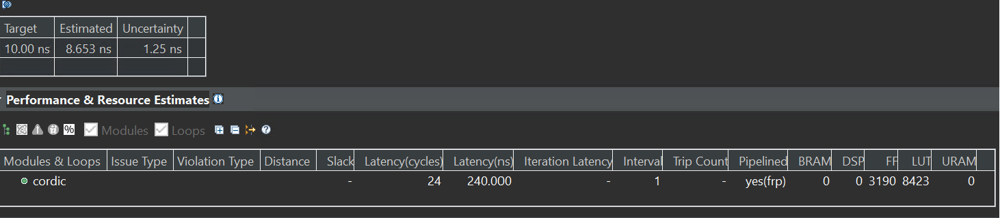
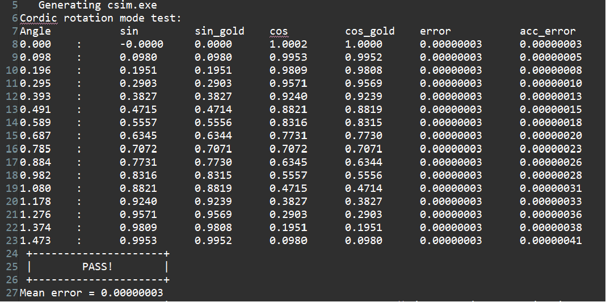
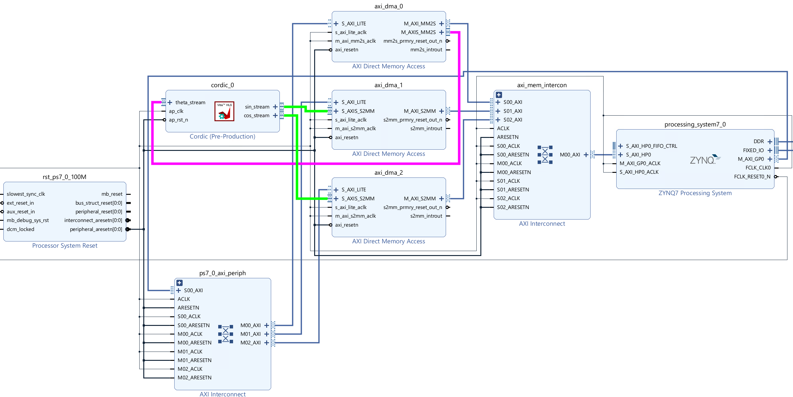
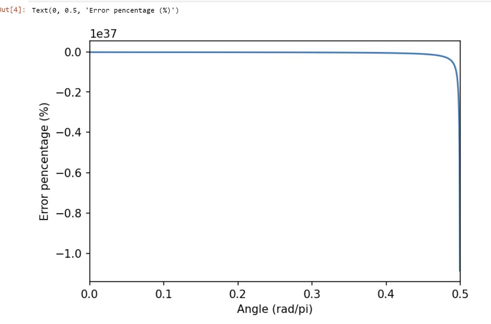

# Lab19 Cordic

<script type="text/x-mathjax-config">
  MathJax.Hub.Config({
    tex2jax: {
        inlineMath: [ ['$','$'], ["\\(","\\)"] ],
        displayMath: [ ['$$','$$'], ["\\[","\\]"] ],
        processEscapes: false,
    }
  });
</script>
   

<script type="text/javascript"
        src="https://cdn.mathjax.org/mathjax/latest/MathJax.js?config=TeX-AMS-MML_HTMLorMML">	
</script>

<script src="https://cdn.jsdelivr.net/npm/mathjax@4/es5/jquery.min.js"></script>
<script src="https://cdn.jsdelivr.net/npm/mathjax@4/es5/tex-svg.min.js"></script>
<script type="text/javascript">
  MathJax.startup.promise.then(function () {
    MathJax.typeset('$$45 / ^\circ, 2$$');
  });
</script>


## Introduction

Cordic, or Coordinate Rotation Digital Computer, is widely used to calculate trigonometric functions, hyperbolic functions, square roots, multiplications, divisions, and exponentials and logarithms with arbitrary base, typically converging with one digit (or bit) per iteration. The only operations it requires are additions, subtractions, bitshift and lookup tables. The only operations it requires are **additions**, **subtractions**, **bitshift** and **lookup tables**.  

The CORDIC algorithm is based on vector rotation. Let $z$ be an imaginary number equals $x+jy=\sqrt{x^2+y^2}e^{j\cdot arctan(\frac{y}{x})}=re^{j\theta}$, where $j$ is the imaginary unit, $r=\sqrt{x^2+y^2}$ and $\theta=arctan(\frac{y}{x})$. If we want to rotate the vector by $\phi$, we can simply times $z$ by $e^{j\phi}$. Hence, if we transfer back to the Cartesian coordinate system, we have:

$$
\begin{equation}
\begin{aligned}
z' &= z\cdot e^{j\phi} \\
   &= (x + jy)\left(\cos(\phi) + j\sin(\phi)\right) \\
   &= (\cos(\phi)x-\sin(\phi)y) + j(\cos(\phi)y+\sin(\phi)x)
\end{aligned}
\end{equation}
$$

Therefore, if we let $z'=x'+jy'$ and use matrix form to represent the rotation, we have:

$$
\begin{equation}
\left[\begin{matrix}
x'\\
y'
\end{matrix}\right]
=\left[\begin{matrix}
\cos(\phi) & -\sin(\phi)\\
\sin(\phi) & \cos(\phi)
\end{matrix}\right]
\left[\begin{matrix}
x\\
y
\end{matrix}\right]
\end{equation}
$$

Note that the rotation doesn't change the length of the vector. To make the algorithm easily implemented with hardware, we have to simplify the multiplication operation here. In hardware, it is always easy to time a number with $2^N$ as it is only required to shift left by $N$ bits ($N$ can be negative). Therefore, they did a little transformation to Eq. (2) first.

$$
\begin{equation}
\left[\begin{matrix}
x'\\
y'
\end{matrix}\right]
=\cos(\phi)\left[\begin{matrix}
1 & -\tan(\phi)\\
\tan(\phi) & 1
\end{matrix}\right]
\left[\begin{matrix}
x\\
y
\end{matrix}\right]
\end{equation}
$$

Then, if we make $\tan(\phi_i)=\frac{1}{2^i}$ or $\phi_i=arctan(2^{-i})$, where $i$ is a non-negative integer, all the multiplications in the matrix-vector multiplication becomes either keep the original value (times by 1) or shift right by $i$ bits (times $2^{-i}$), therefore, the rotation angles are:

$$
\phi_i=\arctan(2^{-i}),i = 0,1,2,...
$$


We can get the corresponding angles as $45&#xb0$, $26.57&#xb0$, $14.04&#xb0$, etc. It can be proved that any angle with $0\to90&#xb0$ can be represented as the sum of these angles, which means with enough $\phi_i$ summed up, we can calculate any $\cos$ and $\sin$ values.  

However, the multiplication with $\cos(\phi_i)$ hasn't been solved yet. Since

$$
\begin{equation}
\begin{aligned}
\cos(\phi_i) &= \sqrt{\cos^2(\phi_i)} \\
             &= \sqrt{\frac{\cos^2(\phi_i)}{\cos^2(\phi_i)+\sin^2(\phi_i)}} \\
             &= \frac{1}{\sqrt{1+\tan^2(\phi_i)}}
\end{aligned}
\end{equation}
$$

and $\phi_i=\arctan(2^{-i})$, we have

$$
\cos(\phi_i) =  \frac{1}{\sqrt{1+\tan^2(\arctan(2^{-i}))}}=\frac{1}{\sqrt{1+2^{-2i}}}
$$

Hence, we can combine all the $\cos(\phi_i)$ together as a final scale coefficient $K$:

$$
K = \lim_{n\to\infty} K(n) = \lim_{n\to\infty}\prod_{i = 0}^{n-1}\frac{1}{\sqrt{1+2^{-2i}}} \approx 0.60725
$$

Therefore, if we do rotations to a unit legth vector just with the following simplified formula (only bit shifting and adding are required), the final length of the vector would be $1/K$, which is further defined as Cordic Gain $A = 1.6768$.

$$
\begin{equation}
\left[\begin{matrix}
x'\\
y'
\end{matrix}\right]
=\left[\begin{matrix}
1 & -2^{-i}\\
2^{-i} & 1
\end{matrix}\right]
\left[\begin{matrix}
x\\
y
\end{matrix}\right]
\end{equation}
$$

**Reference Material**: Ryan Kastner et al., [Parallel Programming for FPGAs](https://github.com/KastnerRG/pp4fpgas/raw/gh-pages/main.pdf), Chapter 3.

Then with circular rotation based Cordic, we have two modes: Rotation Mode and Vector Mode.

## Rotation Mode
Rotation Mode is used to calculate $\sin$, $\cos$ and the related values such as $\tan$ of a given angle $\alpha$. Let's assume $0<\alpha\leq\pi$ here (if not, we can map the required angle to this domain as sinusoid functions are periodic). In Rotation Mode, we first initialize the initial vector $V_0$ with $x_0=K$ and $y_0=0$, which is a scaled vector pointing towards the positive $x$ axis direction, and its length is $K$. Then we rotate the vector towards the target $\alpha$. Let's assume the initial angle is $\beta_0=0$. The first rotation must be positive $\phi_0 = 45&#xb0$ (counterclockwise) as $\alpha > \beta_0$. Now, we have $\beta_1 = 45&#xb0$. The second rotation angle is $26.57&#xb0$, and we rotate counterclockwise if $\alpha > \beta_0$ or clockwise if $\alpha < \beta_0$. Continue this iteration typically 48 times; the final $\beta$ should be approximately equal to $\alpha$. And since the initial length of the vector is $K$, the final length of the vector is $1$, which means the final $y=\cos(\alpha)$ and final $x=\sin(\alpha)$.  


## Vector Mode
Vector mode is similar, while the initial vector is user-defined and the targeted angle is always $0&#xb0$. For example, if we initialize the $V_0$ with $x=x_0$ and $y=y_0$ with an initial angle of $arctan(\frac{y_0}{x_0})$, and rotate the angle towards $0&#xb0$, the final length of the vector is $A\times\lvert V_0\rvert=A\sqrt{x_0^2+y_0^2}$, which is exactly the final $x$ as the angle is rotated to $0&#xb0$. However, since the final value is not $\sqrt{x_0^2+y_0^2}$ directly, the division is required either for the final result or the initial value of $x,y$. Hence, the Vector Mode with trigonometric functions does not seem that useful. However, with hyperbolic functions to replace the $\sin$ and $\cos$ here, the square root of any given value can be calculated directly with Cordic ([Ref](https://www.youtube.com/watch?v=3g6bkSDvYQM)).  

## Cordic Implementation

cordic.h

```c++
/*
Filename: cordic.h
	Header file
	CORDIC lab
*/
#ifndef CORDIC_H_
#define CORDIC_H_

#include "hls_stream.h"
#include "ap_axi_sdata.h"
#include "ap_fixed.h"

#define PI (3.14159265f)

const int NUM_ITERATIONS = 28;
const float INIT_X = 0.60735;

typedef ap_fixed<32,8> THETA_TYPE;
typedef ap_fixed<32,2>	COS_SIN_TYPE;

typedef hls::axis<THETA_TYPE,0,0,0> theta_t_pack;
typedef hls::stream<theta_t_pack> theta_t_stream;
typedef hls::axis<COS_SIN_TYPE,0,0,0> cos_sin_t_pack;
typedef hls::stream<cos_sin_t_pack> cos_sin_t_stream;

void cordic (
  cos_sin_t_stream& sin_stream,
  cos_sin_t_stream& cos_stream,
  theta_t_stream& theta_stream
);

#endif
```

cordic.cpp

```c++
#include "cordic.h"

void cordic (
  cos_sin_t_stream& sin_stream,
  cos_sin_t_stream& cos_stream,
  theta_t_stream& theta_stream
){
#pragma HLS INTERFACE mode=ap_ctrl_none port=return
#pragma HLS INTERFACE mode=axis register_mode=both port=sin_stream
#pragma HLS INTERFACE mode=axis register_mode=both port=cos_stream
#pragma HLS INTERFACE mode=axis register_mode=both port=theta_stream
#pragma HLS PIPELINE style=frp
    static THETA_TYPE cordic_phase[NUM_ITERATIONS] = {
        0.78539816339745,   0.46364760900081,   0.24497866312686,   0.12435499454676,
        0.06241880999596,   0.03123983343027,   0.01562372862048,   0.00781234106010,
        0.00390623013197,   0.00195312251648,   0.00097656218956,   0.00048828121119,
        0.00024414062015,   0.00012207031189,   0.00006103515617,   0.00003051757812,
        0.00001525878906,   0.00000762939453,   0.00000381469727,   0.00000190734863,
        0.00000095367432,   0.00000047683716,   0.00000023841858,   0.00000011920929,
        0.00000005960464,   0.00000002980232,   0.00000001490116,   0.00000000745058
    };

    theta_t_pack theta_t_pack_temp;
    theta_stream >> theta_t_pack_temp;
    THETA_TYPE theta = theta_t_pack_temp.data;

    COS_SIN_TYPE current_cos = INIT_X;
    COS_SIN_TYPE current_sin = 0.0;

ROTATION_LOOP:
    for (int j = 0; j < NUM_ITERATIONS; j++){
        COS_SIN_TYPE cos_shift = current_cos >> j;
        COS_SIN_TYPE sin_shift = current_sin >> j;

        if (theta >= 0){
            current_cos = current_cos - sin_shift;
            current_sin = current_sin + cos_shift;
            theta -= cordic_phase[j];
        }
        else{
            current_cos = current_cos + sin_shift;
            current_sin = current_sin - cos_shift;
            theta += cordic_phase[j];
        }
    }

    cos_sin_t_pack cos_temp, sin_temp;
    cos_temp.data = current_cos;
    sin_temp.data = current_sin;
    cos_temp.keep = -1;
    sin_temp.keep = -1;
    cos_temp.last = theta_t_pack_temp.last;
    sin_temp.last = theta_t_pack_temp.last;

    sin_stream << sin_temp;
    cos_stream << cos_temp;  
}
```

Testbench

```c++
/*
  Filename: cordic_test.h
  CORDIC lab wirtten for WES/CSE237C class at UCSD.
  Testbench file
  Calls cordic() function from cordic.cpp
  Compares the output from cordic() with math library
*/

#include <stdio.h>
#include <math.h>
#include <stdlib.h>
#include "cordic.h"


int main (int argc, char** argv) {
  printf("Cordic rotation mode test:\n");
  cos_sin_t_stream sin_stream;
  cos_sin_t_stream cos_stream;
  theta_t_stream theta_stream;
  THETA_TYPE theta;

  float acc_error = 0;
  printf("Angle\t\t\tsin\t\t\tsin_gold\tcos\t\t\tcos_gold\terror\t\t\tacc_error\n");
  for (int i = 0; i < 16; i++){
    theta = i * PI / 16 / 2; // 16 steps from 0 to pi/2
    theta_t_pack theta_t_pack_temp;
    theta_t_pack_temp.data = theta;
    theta_t_pack_temp.keep = -1;
    theta_t_pack_temp.last = (i == 15);
    theta_stream << theta_t_pack_temp;

    cordic(sin_stream, cos_stream, theta_stream);

    cos_sin_t_pack sin_pack, cos_pack;
    sin_stream >> sin_pack;
    cos_stream >> cos_pack;
    float sin_golden = sin((float)theta);
    float cos_golden = cos((float)theta);

    float new_error = pow((float)cos_pack.data-(float)cos_golden,2) + pow((float)sin_pack.data-(float)sin_golden,2);
    acc_error += new_error;

    printf("%3.3f    :\t\t%1.4f\t\t%1.4f\t\t%1.4f\t\t%1.4f\t\t%1.8f\t\t%1.8f\n",(float)theta,(float)sin_pack.data,(float)sin_golden,(float)cos_pack.data,(float)cos_golden,new_error, acc_error);
  }
  if(acc_error / 16 < 0.0001){
	  printf(" +---------------------+\n");
	  printf(" |        PASS!        |\n");
	  printf(" +---------------------+\n");
	  printf("Mean error = %.8f\n",acc_error / 16);
	  return 0;
  }
  else{
	  printf(" +---------------------+\n");
	  printf(" |        FAIL!        |\n");
	  printf(" +---------------------+\n");
	  printf("Mean error = %.8f\n",acc_error / 16);
	  return -1;
  }
}
```

In this implementation, the angle is rotated 28 times. To be hardware friendly, this code rotates the coordinate system. Therefore, theta is always compared with 0.

To be fast, the module is pipelined. In HLS, the for loop inside the module must be unrolled.

Pipelining the loop is different from unrolling the loop and making it a pipeline. Pipelining the loop only generates a pipeline for the loop body. Therefore, no new data can be received before the for loop is executed. In this case, the II of the module cannot be 1. However, pipelining the whole module (unroll the loop) generates multiple loop body circuits (equal to the trip count) and makes a large pipeline. Hence, new data can be received every clock cycle and the II of the module can be 1.

The synthesis report is shown below:

<div align=center></div>

And the C simulation result is shown below:

<div align=center></div>

Then export the IP to the floder where you want to set.

## Create the Vivado project

The configure block design can use reference materials [here](https://uri-nextlab.github.io/ParallelProgammingLabs/HLS_Labs/Lab1.html). And we need to choose the number of the DMA according to the number of the interface.

<div align=center></div>

## Run synthesis,  Implementation, and generate bitstream

It may show some errors about I/O Ports, please fix them.

## Download the bitstream file to PYNQ

<div align=center></div>

To test the the IP, generate an array ranging from $0\to\pi/2$, and collect the cos value calculated by hardware. Then, compare with the value calculated via numpy ```cos``` function. The error is represented by a percentage.

```python
from pynq import Overlay
from pynq import allocate
import matplotlib.pyplot as plt
import numpy as np
import time

hw = Overlay('design_1.bit')

mm2s = hw.axi_dma_0.sendchannel
s2mm_sin = hw.axi_dma_1.recvchannel
s2mm_cos = hw.axi_dma_2.recvchannel

N = 1024
oBuf = allocate(shape=(N,), dtype = np.float32)
iBuf_cos = allocate(shape=(N,), dtype = np.float32)
iBuf_sin = allocate(shape=(N,), dtype = np.float32)
for i in range(N):
    oBuf[i] = np.pi * i / 1024 / 2

start_time = time.time()
s2mm_sin.transfer(iBuf_sin)
s2mm_cos.transfer(iBuf_cos)
mm2s.transfer(oBuf)
mm2s.wait()
s2mm_sin.wait()
s2mm_cos.wait()
finish_time = time.time()

gold_data = np.cos(oBuf[:])
plt.figure(dpi=150)
plt.plot(oBuf[:]/np.pi,(iBuf_cos[:] - gold_data) / gold_data * 100)
plt.xlim([0, 0.5])
plt.xlabel('Angle (rad/pi)')
plt.ylabel('Error pencentage (%)')
```

The plot is shown below:

<div align=center></div>

In most cases, the error is less than 0.02%, which is good enough, and the II of the module is 1.

## Small modification

In the previous code, the input $\theta$ must range from $-\pi/2\to\pi/2$. If the required angle is outside this ranges, it is still possible to transfer them into the CORDIC allowed range. However, if we already know a phase of a signal, it is hard to regenerate the original signal as the phase can easily go to thousands. For example, in OFDR (Optical frequency domain reflectometry), an auxilary MZI is frequently used to do resampling and canceling phase noise ([Ref](https://ieeexplore.ieee.org/abstract/document/9146592)). In this case, a phase curve is required. If the input angle is higher than $\pi/2$, a modular function is required, which is difficult for hardware.

To solve this problem, we can map $0\to2\pi$ to $0\to1$, so that the integer part can be ignored directly. Then, we just need to transfer all angles from $0.25\to1$ to $0\to0.25$. Two bool variables are required to save if the final cos/sin value has to be inverted. Here is how the input $\theta$ is processed:

Pre-process:  

```c++
......
static THETA_TYPE cordic_phase[NUM_ITERATIONS] = {
    		0.125000000000000000,    		0.073791808825216645,    		0.038989565188684662,    		0.019791712080282773,
    		0.009934262152770421,    		0.004971973911794637,    		0.002486593639475207,    		0.001243372696834870,
    		0.000621695834357050,    		0.000310849102961686,    		0.000155424699705010,    		0.000077712368380566,
    		0.000038856186506292,    		0.000019428093542647,    		0.000009714046807511,    		0.000004857023408279,
    		0.000002428511704705,    		0.000001214255852423,    		0.000000607127926220,    		0.000000303563963111,
    		0.000000151781981556,    		0.000000075890990778,    		0.000000037945495389,    		0.000000018972747694,
    		0.000000009486373847,    		0.000000004743186924,    		0.000000002371593462,    		0.000000001185796731
    };

......
    bool inv_sin = false;
    bool inv_cos = false;
    theta = theta * MAP_K; // MAP_K = 1/2/pi
    // handle negative phase
    if (theta < 0){
    	theta = (THETA_TYPE)-theta;
    	theta(30,16) = 0; // Clear interger part. Equivalently theta = mod(theta, 1)
    	theta = 1 - theta;
    }else{
    	theta(30,16) = 0;
    }

    if (theta < 0.25){
    	theta = theta;
    }else if(theta < 0.5){
    	theta = (THETA_TYPE)0.5 - theta;
    	inv_cos = true;
    }else if (theta < 0.75){
    	theta = theta - (THETA_TYPE)0.5;
    	inv_cos = true;
    	inv_sin = true;
    }else if (theta < 1){
    	theta = (THETA_TYPE)1 - theta;
    	inv_sin = true;
    }
ROTATION_LOOP:
......

    cos_temp.data = inv_cos?((COS_SIN_TYPE)-current_cos):current_cos;
    sin_temp.data = inv_sin?((COS_SIN_TYPE)-current_sin):current_sin;
......
```
## Demonstrate

Please create an HLS component for ```Cordic``` lab and implement it on the PYNQ-Z2 board.
