# Lab2 Pipelining

<script type="text/x-mathjax-config">
  MathJax.Hub.Config({
    tex2jax: {
        inlineMath: [ ['$','$'], ["\\(","\\)"] ],
        displayMath: [ ['$$','$$'], ["\\[","\\]"] ],
        processEscapes: false,
    }
  });
</script> 
    
<script type="text/javascript"
        src="https://cdn.mathjax.org/mathjax/latest/MathJax.js?config=TeX-AMS-MML_HTMLorMML">
</script>

## Introduction

Pipelining is a widely used hardware trhoughput improvement method. Pipelining can be applied both to a loop and a function. In this example, pipelining any loop is not a good idea as it will reduce the II of the entire module (This is why we unrolled all the loops). The unrolled loops are not loops anymore from the hardware perspective, as unrolling makes all loop iterations run together in parallel. Hence, now the module has the following stages of operations:

> 1. Read new x and shift the TDL
> 2. MAC
> 3. Write y out (and clear shift_reg, when the last signal x comes)

Without pipelining, the operations are executed one by one, and new data can only be received after the last step is finished. Some resources can also be shared, for example, the adders in 2.1 can be reused in 2.3, though some extra logic may be required to control the dataflow. Pipelining, however, creates independent hardware for operation and some flip-flops to tap the inputs and middle results. The book ([Ref](https://kastner.ucsd.edu/hlsbook/)) gives an example for the MAC loop (though we are not pipelining the MAC loop here) shown below, (a) is without pipelining and (b) is with pipelining:


Notice that no resources can be shared if the function is pipelined. Circuits at different stages are processing data simultaneously. For example, the circuit at the first stage is always processing the newest data, while the circuit at the second stage is always processing the data input (via shift register) from the previous cycle and the output from the first stage circuit. Hence, pipelining mostly requires more resources.

## Optimization

### Function_optimization

The ```FUNCTION_INSTANTIATE``` pragma is an optimization technique that has the area benefits of maintaining the function hierarchy but provides an additional powerful option: performing targeted local optimizations on specific instances of a function. This can simplify the control logic around the function call and potentially improve latency and throughput.

By default:

* Functions remain as separate hierarchy blocks in the RTL, or is decomposed (or inlined) into a higher level function.

* All instances of a function, at the same level of hierarchy, make use of a single RTL implementation (block).

The ```FUNCTION_INSTANTIATE``` pragma allows you to control how functions are instantiated within the hardware design. By default, Vivado HLS will automatically instantiate functions when they are called. However, in certain scenarios, you might want to provide explicit control over the instantiation behavior. The syntax is: ([Ref](https://docs.xilinx.com/r/en-US/ug1399-vitis-hls/pragma-HLS-function_instantiate)).

In this example, we use the function which takes two parameters (operands) and returns their sum. In the top-level function, we make multiple calls to another function. This means that within the main function or primary function, we repeatedly invoke (or use) another specific function to perform certain tasks or operations.

**example.h**
```c++
#include <fstream>
#include <iostream>
using namespace std;

void top(char inval1, char inval2, char inval3, char* outval1, char* outval2,
         char* outval3);
```

**example.cpp**
```c++
//This function is to implement the addition operation and return the result of adding inval and incr
char foo(char inval, char incr) {
#pragma HLS INLINE OFF
#pragma HLS FUNCTION_INSTANTIATE variable = incr
    return inval + incr;
}

void top(char inval1, char inval2, char inval3, char* outval1, char* outval2,
         char* outval3) {
    *outval1 = foo(inval1, 0);
    *outval2 = foo(inval2, 1);
    *outval3 = foo(inval3, 100);
}
```

**example_tb.h**
```c++
#include "example.h"

int main() {

    int i, retval = 0;
    const char N = 10;
    char a, b, c;

    for (i = 0; i < N; ++i) {
        // Call the function
        top(i, i, i, &a, &b, &c);
        cout << (int)a << " " << (int)b << " " << (int)c << endl;
    }
}
```
And the result of C simulation is as shown in below.

<div align=center>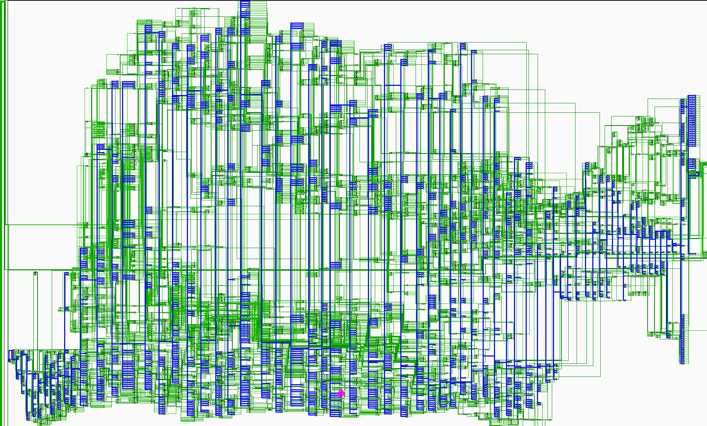</div>

You can click the ```Run C Synthesis``` to see the optimization result. Without the ```FUNCTION_INSTANTIATE``` pragma, the following code results in a single RTL implementation of function foo for all three instances of the function in func. Each instance of function ```foo``` is implemented in an identical manner. This is fine for function reuse and reducing the area required for each instance call of a function, but means that the control logic inside the function must be more complex to account for the variation in each call of ```foo```.

The below is the optimization result with the ```FUNCTION_INSTANTIATE``` pragma.

<div align=center>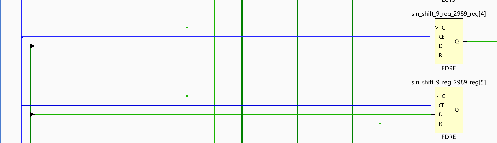</div>

### Loop_optimization

Pipelining loops permits starting the next iteration of a loop before the previous iteration finishes, enabling portions of the loop to overlap in execution. By default, every iteration of a loop only starts when the previous iteration has finished. In the loop example below, a single iteration of the loop adds two variables and stores the result in a third variable. Assume that in hardware this loop takes three cycles to finish one iteration. Also, assume that the loop variable len is 20, that is, the ```vadd``` loop runs for 20 iterations in the kernel. Therefore, it requires a total of 60 clock cycles (20 iterations * 3 cycles) to complete all the operations of this loop.

```c++
vadd: for(int i = 0; i < len; i++) { 
   c[i] = a[i] + b[i];
}
```
Pipelining the loop allows subsequent iterations of the loop to overlap and run concurrently. Pipelining a loop can be enabled by adding the PIPELINE pragma or directive inside the body of the loop as shown below:

```c++
vadd: for(int i = 0; i < len; i++) { 
#pragma HLS PIPELINE 
c[i] = a[i] + b[i];
}
```

The number of cycles it takes to start the next iteration of a loop is called the Initiation Interval (II) of the pipelined loop. So II = 2 means the next iteration of a loop starts two cycles after the current iteration. An II = 1 is the ideal case, where each iteration of the loop starts in the very next cycle. When you use pragma HLS pipeline, you can specify the II for the compiler to achieve. If a target II is not specified, the compiler can try to achieve II=1 by default.

The following figure illustrates the difference in execution between pipelined and non-pipelined loops. In this figure, (A) shows the default sequential operation where there are three clock cycles between each input read (II = 3), and it requires eight clock cycles before the last output write is performed.

<div align=center>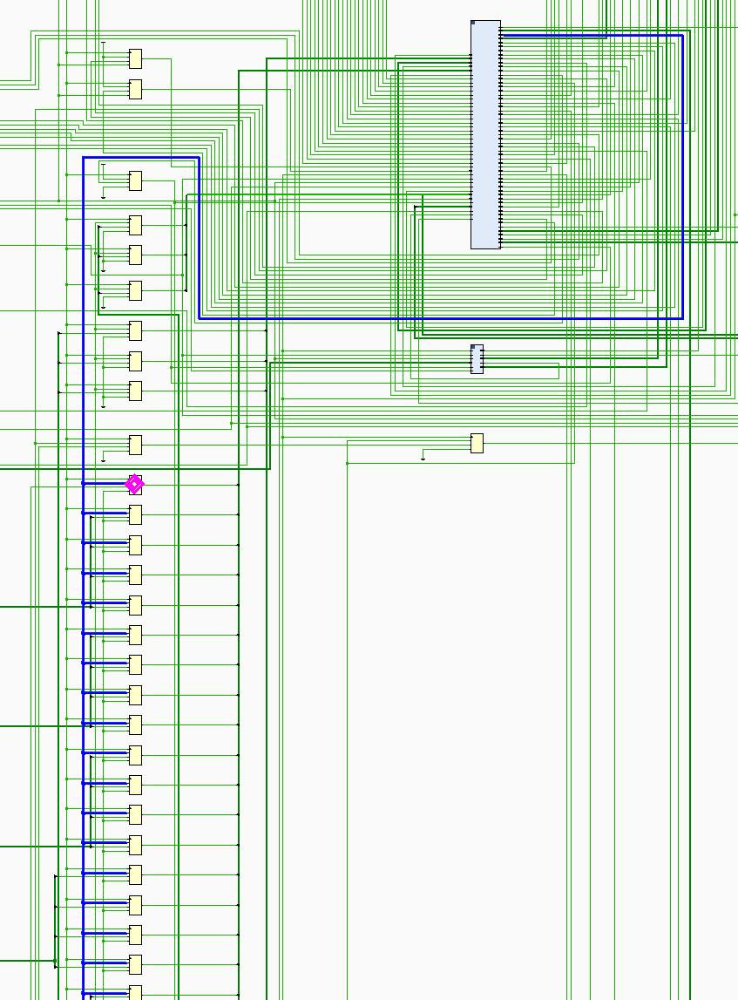</div>

In the pipelined version of the loop shown in (B), a new input sample is read every cycle (II = 1) and the final output is written after only four clock cycles: substantially improving both the II and latency while using the same hardware resources.

#### imperfect/perfect loop

**loop_imperfect.h**
```c++
#ifndef _LOOP_IMPERFECT_H_
#define _LOOP_IMPERFECT_H_

#include <fstream>
#include <iostream>
using namespace std;

#include "ap_int.h"
#define N 20

typedef ap_int<5> din_t;
typedef ap_int<12> dint_t;
typedef ap_int<6> dout_t;

void loop_imperfect(din_t A[N], dout_t B[N]);
void loop_perfect(din_t A[N], dout_t B[N]);

#endif
```


**loop_imperfect.cpp**
```c++
#include "loop_imperfect.h"

//The example shows an imperfect loop which does not follow the loop flatten pre-conditions.
void loop_imperfect(din_t A[N], dout_t B[N]) {

    int i, j;
    dint_t acc;

LOOP_I:
    for (i = 0; i < 20; i++) {
        acc = 0;
    LOOP_J:
        for (j = 0; j < 20; j++) {
            acc += A[j] * j;
        }
        if (i % 2 == 0)
            B[i] = acc / 20;
        else
            B[i] = 0;
    }
  
}
```
The loop_imperfect function contains two nested for loops (LOOP_I and LOOP_J) that iterate from 0 to 19.
Inside the inner loop (LOOP_J), there is an accumulator variable ```acc``` that accumulates the product of ```A[j]``` and j for each iteration of the inner loop.It stores these weighted sums (or 0 for odd i) in elements of array ```B```.

The result of the C Synthesis is as shown in the below.

<div align=center>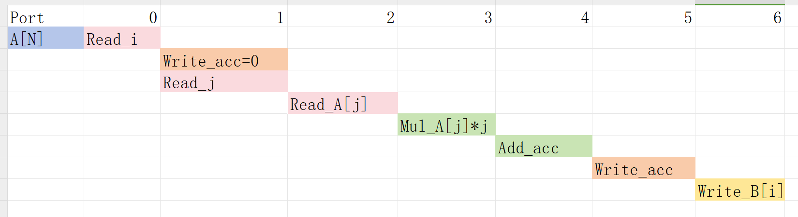</div>

<div align=center>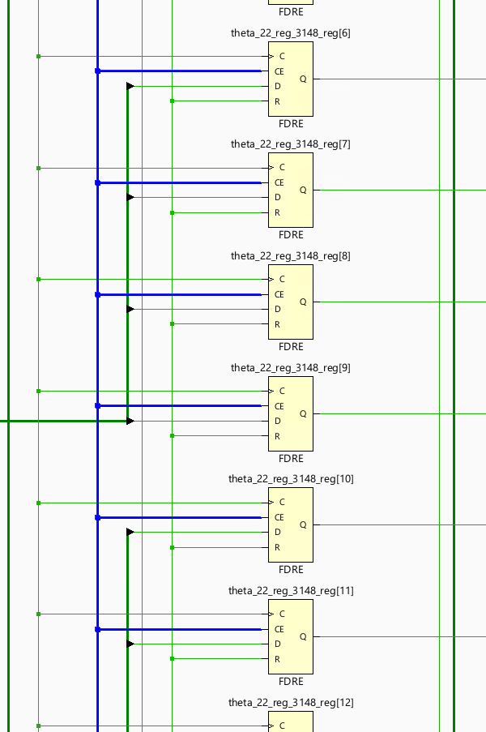</div>

**loop_perfect.cpp**
```c++
//The example shows the correct coding guidlenes for nested loops to be flattened automatically by the tool
void loop_perfect(din_t A[N], dout_t B[N]) {
    int i, j;
    dint_t acc;

LOOP_I:
    for (i = 0; i < 20; i++) {
    LOOP_J:
        for (j = 0; j < 20; j++) {
            if (j == 0)
                acc = 0;
            acc += A[j] * j;
            if (j == 19) {
                if (i % 2 == 0)
                    B[i] = acc / 20;
                else
                    B[i] = 0;
            }
        }
    }
}
```
The loop_perfect function contains two nested for loops (LOOP_I and LOOP_J) that iterate from 0 to 19.
Inside the inner loop (```LOOP_J```), there is an accumulator variable ```acc``` that accumulates the product of ```A[j]``` and j for each iteration of the inner loop.
At the end of the inner loop (j == 19), the function checks if the index i of the outer loop is even (i % 2 == 0). If i is even, it computes the average of the accumulated values in acc and stores it in ```B[i]```. Otherwise, it sets ```B[i]``` to 0.

The result of the C Synthesis is as shown in the below.

<div align=center>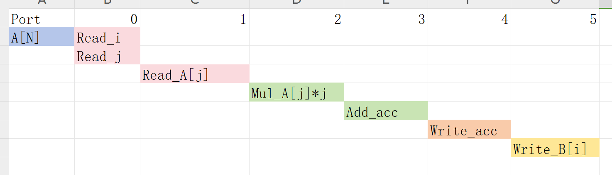</div>

<div align=center>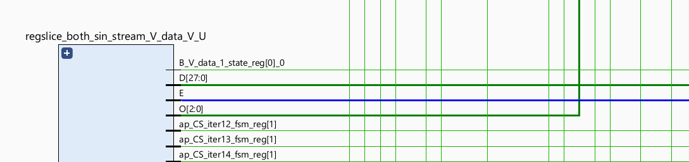</div>


**loop_imperfect_test.cpp**
```c++
#include "loop_imperfect.h"

int main() {
    din_t A[N];
    dout_t B[N];

    int i, retval = 0;


    for (i = 0; i < N; ++i) {
        A[i] = i;
    }
  
    // Call the function
    loop_imperfect(A, B);
    //loop_perfec(A,B)
    for (i = 0; i < N; ++i) {
        cout << B[i] << endl;
    }   
}
```

The result of the C Simulation is the same. This example shows that the different loop structures can significantly affect the final optimization results. For the imperfect loop, inside the outer loop (```LOOP_I```), the accumulator variable ```acc``` is initialized to 0 for each iteration. This initialization should ideally occur once before entering the inner loop to avoid unnecessary reset operations. And the code has a conditional assignment to ```B[i]``` based on whether the index i is even or odd (if (i % 2 == 0)). This conditional assignment introduces branching in the code, which may impact performance and efficiency during hardware synthesis. For the perfect loop, the code contains a simple accumulation operation (```acc += A[j] * j```) and conditional statements to handle specific conditions (if (j == 0) and if (j == 19)). The straightforward logic and absence of complex dependencies make optimizing and flattening the code easier for the synthesis tool.

#### pipelined loop

Pipelining a loop causes any loops nested inside the pipelined loop to get automatically unrolled. This example shows different variations of the Loop pipelining (inner-most loop and outer-most loop).

If the outer loop (```LOOP_I```) is pipelined, inner-loop (```LOOP_J```) is unrolled creating 20 copies of the loop body: 20 multipliers and 1 array accesses must now be scheduled. Then each iteration of ```LOOP_I``` can be scheduled as a single entity.

If the top-level function is pipelined, both loops must be unrolled: 400 multipliers and 20 array accesses must now be scheduled. It is very unlikely that Vitis HLS will produce a design with 400 multiplications because, in most designs, data dependencies often prevent maximal parallelism, for example, even if a dual-port RAM is used for ```A```, the design can only access two values of ```A``` in any clock cycle. Otherwise, the array must be partitioned into 400 registers, which then can all be read in one clock cycle, with a very significant HW cost.


**loop_pipeline.h**
```c++
#ifndef _LOOP_PIPELINE_H_
#define _LOOP_PIPELINE_H_

#include <fstream>
#include <iostream>
using namespace std;

#include "ap_int.h"
#define N 5
#define NUM_TRANS 5

typedef int din_t;
typedef int dout_t;

int loop_pipeline(din_t A[N]);

#endif
```

**loop_pipeline.cpp**
```c++
#include "loop_pipeline.h"

int loop_pipeline(din_t A[N]) {

    int i, j;
    static dout_t acc;

LOOP_I:
    for (i = 0; i < 20; i++) {
    LOOP_J:
        for (j = 0; j < 20; j++) {
            acc += A[j] * i;
        }
    }

    return acc;
}
```


**loop_pipeline_test.cpp**
```c++
#include "loop_pipeline.h"

int main() {
    din_t A[N];
    dout_t accum;

    int i, j, retval = 0;

    // Create input data
    for (i = 0; i < N; ++i) {
        A[i] = i;
    }


    // Call the function
    for (j = 0; j < NUM_TRANS; ++j) {
        accum = loop_pipeline(A);
        cout << accum << endl;
    }
}
```

The concept to appreciate when selecting at which level of the hierarchy to pipeline is to understand that pipelining the innermost loop gives the smallest hardware with generally acceptable throughput for most applications. Pipelining the upper levels of the hierarchy unrolls all sub-loops and can create many more operations to schedule (which could impact compile time and memory capacity), but typically gives the highest performance design in terms of throughput and latency. The data access bandwidth must be matched to the requirements of the operations that are expected to be executed in parallel. This implies that you might need to partition array ```A``` in order to make this work.

**loop_pipeline.cpp**
```c++
dout_t loop_pipeline(din_t A[N]) {

    int i, j;
    static dout_t acc;

LOOP_I:
    for (i = 0; i < 20; i++) {
    LOOP_J:
        for (j = 0; j < 20; j++) {
#pragma HLS PIPELINE
            acc += A[j] * i;
        }
    }

    return acc;
}
```

* Pipeline ```LOOP_J```: Latency is approximately 25 cycles (5x5) and requires less than 250 LUTs and registers (the I/O control and FSM are always present).

<div align=center>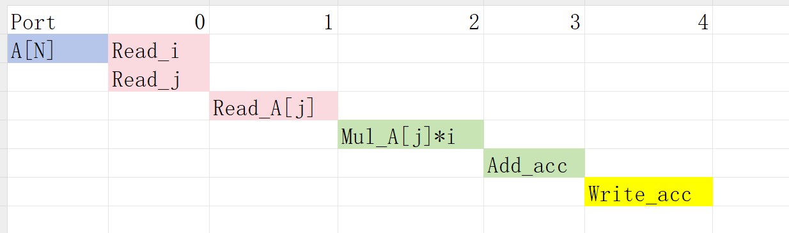</div>

<div align=center>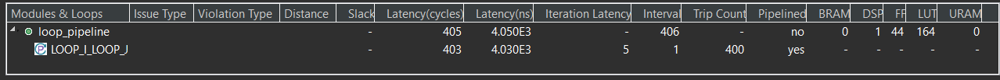</div>


**loop_pipeline.cpp**
```c++
int loop_pipeline(int A[N]) {

    int i, j;
    static int acc;

LOOP_I:
    for (i = 0; i < 5; i++) {
    LOOP_J:
#pragma HLS PIPELINE
        for (j = 0; j < 5; j++) {

            acc += A[j] * i;
        }
    }
    return acc;
}
```
* Pipeline ```LOOP_I```: Latency is 13 cycles but requires a few hundred LUTs and registers. About twice the logic as the first option, minus any logic optimizations that can be made.

The scheduling is 
<div align=center>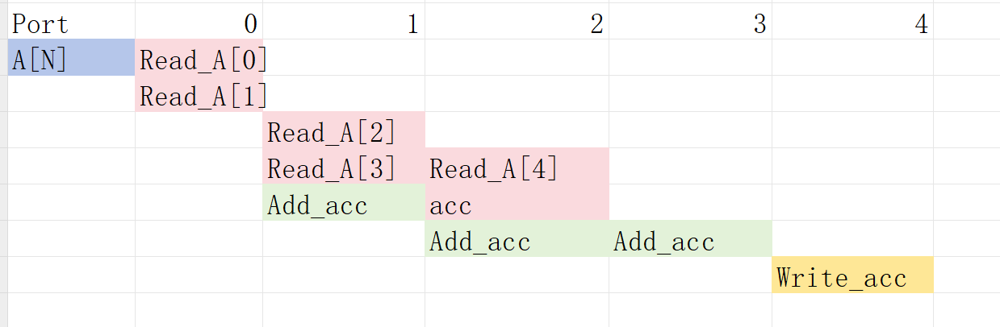</div>

<div align=center>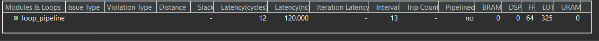</div>

**loop_pipeline.cpp**
```c++
int loop_pipeline(int A[N]) {
#pragma HLS PIPELINE
#pragma HLS ARRAY_PARTITION variable=A type=complete
    int i, j;
    static int acc;

LOOP_I:
    for (i = 0; i < 5; i++) {
    LOOP_J:

        for (j = 0; j < 5; j++) {

            acc += A[j] * i;
        }
    }

    return acc;
}
```
* Pipeline ```function loop_pipeline```: Latency is now only 3 cycles (due to 20 parallel register accesses) but requires almost twice the logic as the second option (and about 4 times the logic of the first option), minus any optimizations that can be made.

<div align=center>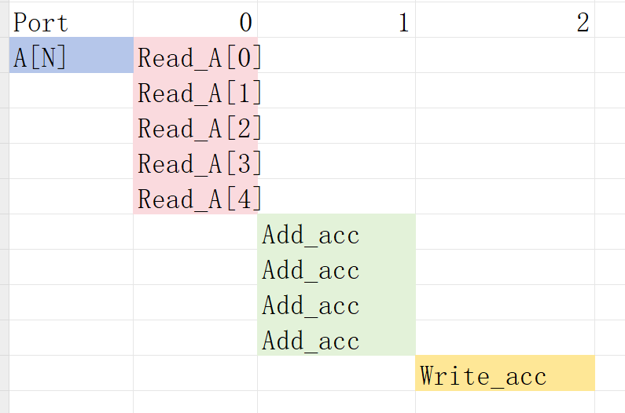</div>

<div align=center></div>


#### using_free_running_pipeline loop

The Pipeline architecture can be implemented in 3 modes:

* FRP (free-ruuning pipeline)

* FLP (flushable pipeline)

* STP (stall pipeline)

The three types of pipelines available in the tool are summarized in the following table. The tool automatically selects the right pipeline style to use for a given pipelined loop or function. If the pipeline is used with ```hls::tasks```, the flushing pipeline (```FLP```) style is automatically selected to avoid deadlocks. If the pipeline control requires high fanout, and meets other free-running requirements, the tool selects the free-running pipeline (```FRP```) style to limit the high fanout. Finally, if neither of the above cases apply, then the standard pipeline (```STP```) style is selected. [Ref](https://docs.xilinx.com/r/en-US/ug1399-vitis-hls/Flushing-Pipelines-and-Pipeline-Types)

This example uses a ```FRP``` (free-ruuning pipeline) mode to configure the pipeline architecture using a global command which is useful in reducing control logic fanout in vivado.

**free_pipe_mult.h**
```c++

#include "ap_axi_sdata.h"
#include "hls_stream.h"
#include "math.h"
using namespace hls;

typedef hls::axis<int,0,0,0> data_t_pack;
typedef hls::stream<data_t_pack> d_stream;

void add_frp( d_stream& strm, d_stream &out);
```

**free_pipe_mult.cpp**
```c++
#include <iostream>
#include "free_pipe_mult.h"

void add_frp( d_stream& strm,d_stream &out) {
#pragma HLS INTERFACE ap_ctrl_none port=return
#pragma HLS INTERFACE axis port = strm
#pragma HLS INTERFACE axis port = out
#pragma HLS PIPELINE style=frp
	data_t_pack temp;
	data_t_pack result;
	static int counter=0;
	temp.keep=-1;
	temp.last=0;
	result.keep=-1;
	temp=strm.read();
	for(int i=0;i<10;i++){
		temp.data=temp.data+1;
	}
	if(counter==9)
	{
		result.last=1;
		counter=0;
	}
	else
	{
		result.last=0;
		counter++;

	}
	result.data=temp.data;
	out.write(result);
}
```

**free_pipe_mult_tb.cpp**
```c++
#include <cstdlib>
#include <fstream>
#include <iostream>
#include "free_pipe_mult.h"

using namespace std;

int main() {
	d_stream strm;
	d_stream out;

	data_t_pack temp;
	data_t_pack result;

	for(int i=0;i<10;i++)
	{
		   temp.data=i;
		   strm.write(temp);
		   add_frp(strm, out);
	}
    // Save the results to a file
    for(int j=0;j<10;j++)
    {
    	 result=out.read();

    // Save output data
    cout << "Result: " << result.data << endl;
    }
}
```

**Flushable Pipeline (FLP)**  
A flushable pipeline is a better choice when processing multiple streams of data.  
Advantages:
> Flushable

Disadvantages:
> More resources 

In a flushable pipeline, once the input data becomes invalid, it shuts down pipeline stages successively, until the final input is processed and moved to the output, rather than closing all stages at once. The structure is shown below.

<div align=center>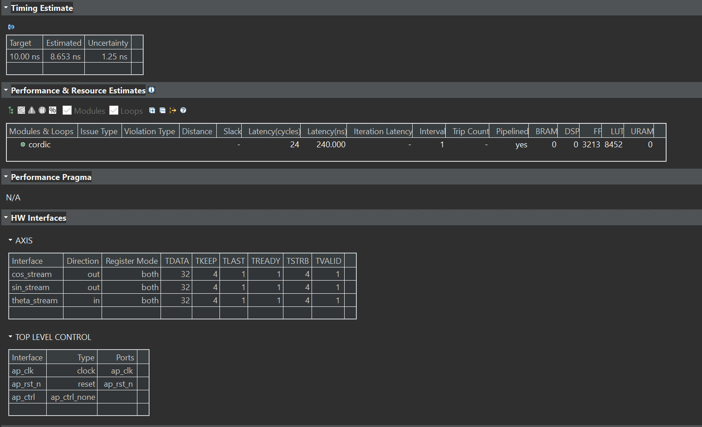</div>

<div align=center>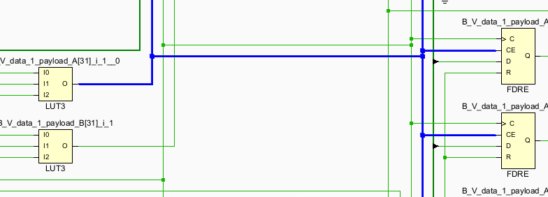</div>

**Free-Running/Flushable Pipeline (FRP)**  
Though the ```FLP``` reduces some fanout of the pipeline controlling signal, it is still not perfect as one pipeline may have hundreds of FFs to control. Free running pipeline further simplifies it.   
Advantages:
> Flushable
> Better Timing:  
>> Less fanout  
>> simpler pipeline control logic  

Disadvantages:
> Moderate resource increase due to FIFOs added on outputs; 
> Energy inefficient  

The structure is shown below:

<div align=center>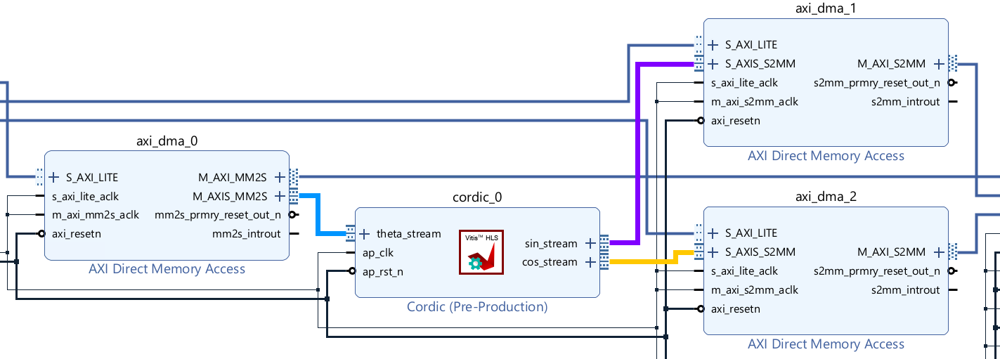</div>


The "enable" signal for the first stage is optional. It is only required when a shift register is placed at the first stage (if the input is not valid, the shift register shouldn't run). ```FRP``` keeps the following stages running. The output valid signal is generated from the valid_in. Therefore, a minimum number of "enable" signals is required. However, making the circuit run continuously is not energy efficient.

> (Important) Free-running kernel and free-running pipeline are different concepts. The free-running kernel means the entire module doesn't require any 'start' signal and is always ready to receive new data. The free-running pipeline is one structure to implement the pipeline.

## Create Vivado Project

The configure block design can use reference materials [here](https://uri-nextlab.github.io/ParallelProgammingLabs/HLS_Labs/Lab1.html)

The different between the lab1 and lab2 is the ```AXI_DMA```. For this IP, we need one read interface and one write interfaces. We have deliberately configured ```AXI_DMA0``` with  the read channels enabled and the write channel enabled. This design choice is driven by the predominant data flow requirements of our IP core, which involves receiving data from memory. 

And the block design is shown below.

<div align=center></div>

## Run synthesis,  Implementation and generate bitstream

It may shows some errors about I/O Ports, please fix them.

## Download the bitstream file to PYNQ

The first step is to allocate the buffer. pynq allocate will be used to allocate the buffer, and NumPy will be used to specify the type of the buffer.

```python
from pynq import Overlay
from pynq import allocate
import numpy as np
import time
```

### Create DMA instances

We can create three DMA objects using the labels for the DMAs listed above.

```python
hw = Overlay('design_flp.bit')
mm2s = hw.axi_dma_0.sendchannel
s2mm = hw.axi_dma_0.recvchannel
```

### Read DMA

The first step is to allocate the buffer. pynq.allocate will be used to allocate the buffer, and NumPy will be used to specify the type of the buffer.

```python
N = 10
iBuf = allocate(shape=(N,), dtype = np.int32)
oBuf = allocate(shape=(N,), dtype = np.int32)
for i in range(N):
    oBuf[i]= i
    print(oBuf[i])
```
<div align=center>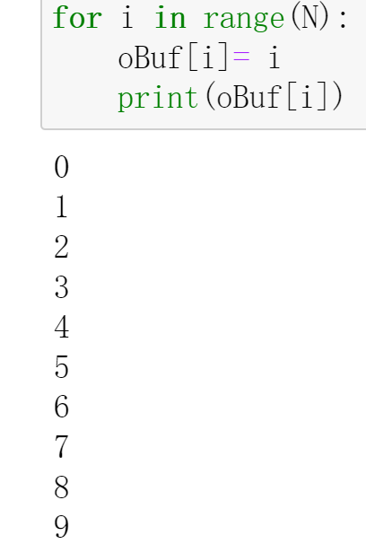</div>


```python
mm2s.transfer(oBuf)
s2mm.transfer(iBuf)
mm2s.wait()
s2mm.wait()
```


We will see:

<div align=center>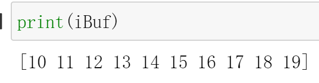</div>

And the result for the C simulation is shown below:

<div align=center></div>

And if we change the value of the iBuf for the frp design(design_frp.bit), we will also see:

<div align=center>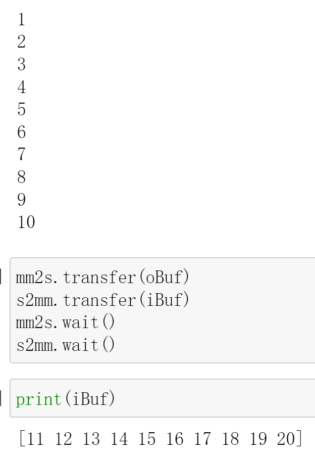</div>

We can see that style=flp/frp can successfully communicate with DMA for data exchange.

## Demonstrate

Please finish the IP that outputs the input data after adding 1 ten times implement it on the PYNQ-Z1 board and compare the difference in the style of the pipeline.


