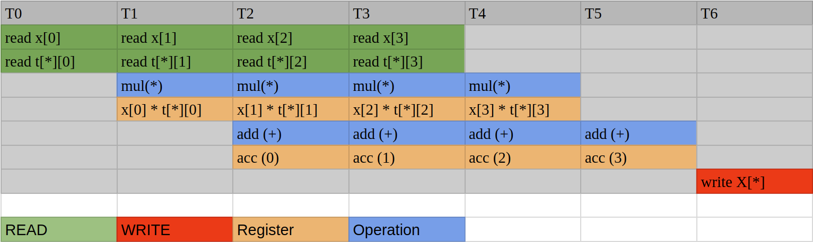
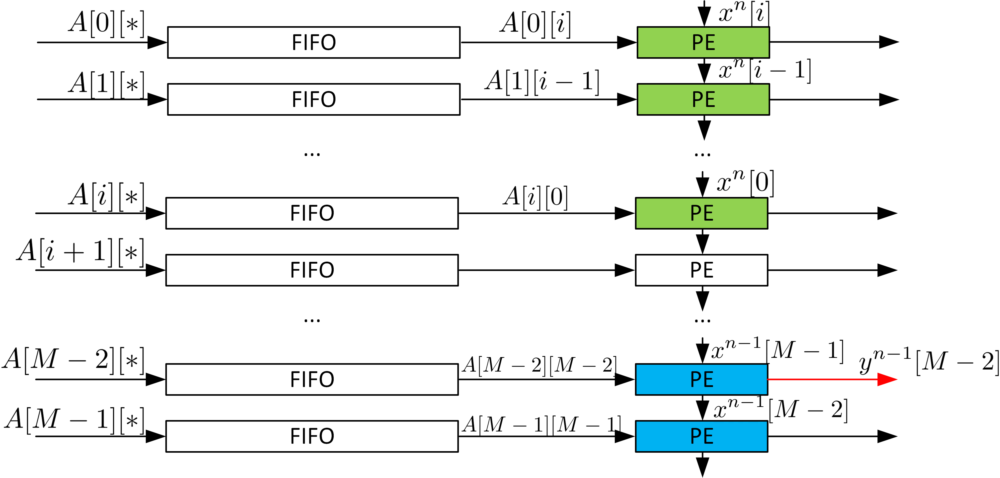
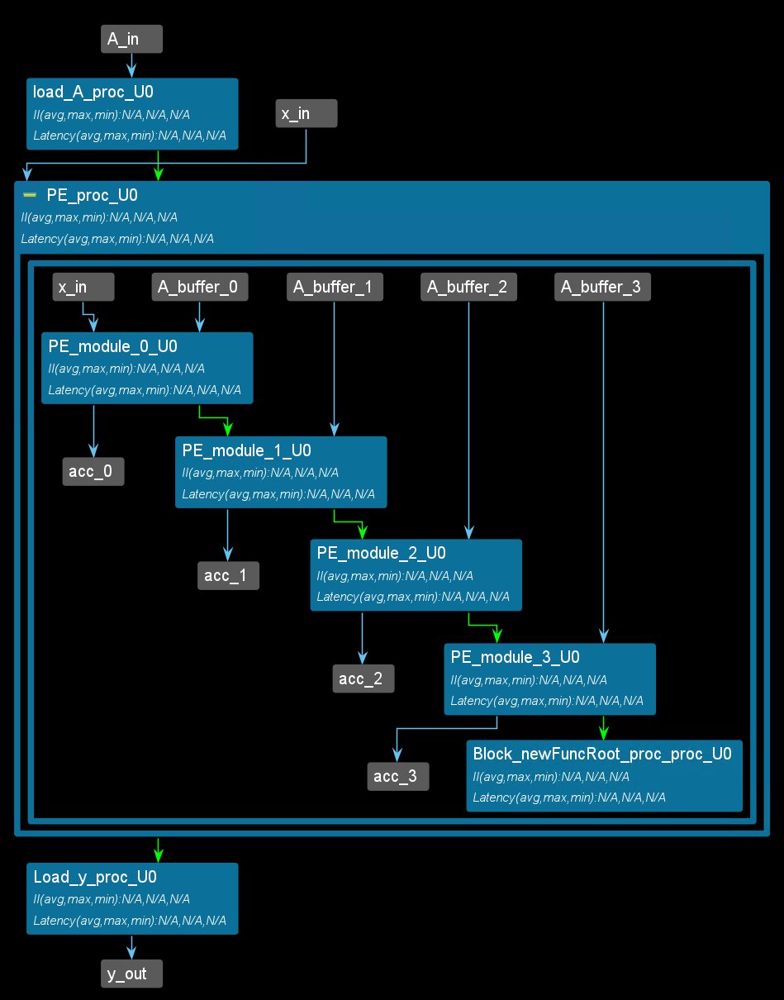
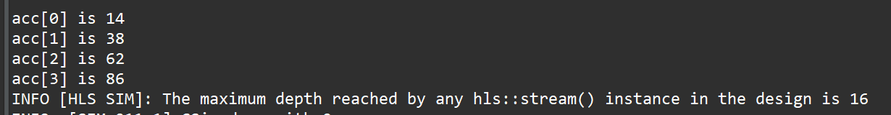
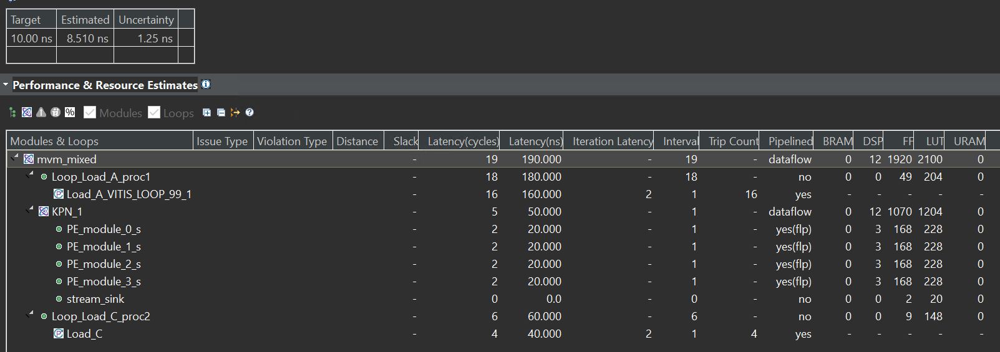
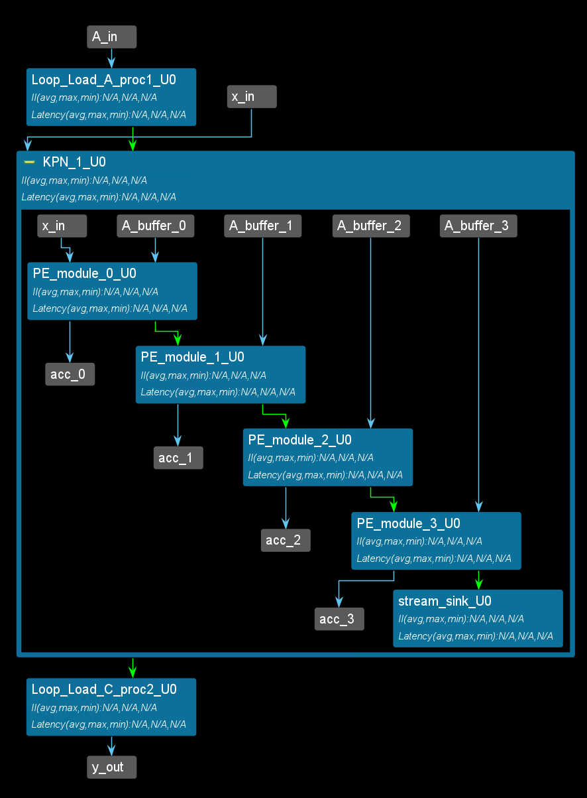
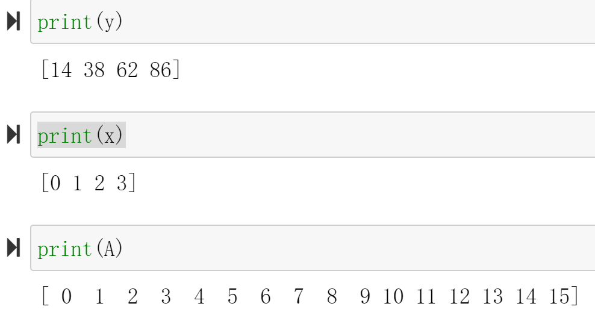

# Lab20 DFT

<script type="text/x-mathjax-config">
  MathJax.Hub.Config({
    tex2jax: {
        inlineMath: [ ['$','$'], ["\\(","\\)"] ],
        displayMath: [ ['$$','$$'], ["\\[","\\]"] ],
        processEscapes: false,
    }
  });
</script>
     
<script type="text/javascript"
        src="https://cdn.mathjax.org/mathjax/latest/MathJax.js?config=TeX-AMS-MML_HTMLorMML">
</script>

## Introduction
The Discrete Fourier Transform (DFT) converts a discrete signal from the time domain to the frequency domain, which is useful for performing functions like filtering and other linear time-invariant operations.
DFT is widely used in digital signal processing (Fast-Fourier Transform, FFT, is an optimized algorithm to calculate DFT). The formula is simple:

$$
X(k) = \sum_{n = 0}^{N - 1}x(n)e^{-j\frac{2\pi}{N}nk}
$$

Where:

* `X[k]` is the `k`-th element of the DFT
* `n` is an index over the time-domain samples
* `k` is an index over the frequency-domain samples
* `N` is the total number of samples, and
* $e^{-j\frac{2\pi}{N}nk}$ are the basis functions, with `j` being the imaginary unit

Given a certain $k$, DFT is an 
inner product between series $$x(n)$$ and a complex rotating vector $e^{-j\frac{2k\pi}{N}n}$. Therefore, let $x(n)$ written as a column vector $\vec{x}$, and $e^{-j\frac{2k\pi}{N}n}$ written as a row vector $\vec T_k$, we have $X(k) = \vec T_k \cdot \vec x$. Hence, the entire transformation becomes a matrix-vector multiplication (MVM).

$$
\begin{equation}
\left[\begin{matrix}
X(0)\\
X(1)\\
...\\
X(N-1)
\end{matrix}\right]
=\left[\begin{matrix}
\vec T_0\\
\vec T_1\\
...\\
\vec T_{N-1}
\end{matrix}\right]
\vec x
\end{equation}
$$

$$
\vec T_k = e^{-j\frac{2k\pi}{N}n}, n = 0,1,2,...,N-1
$$

Since DFT has a better implementation called FFT, in this experiment we focus on Matrix-Vector Multiplication for real numbers for simplicity.

**Reference Material**: Ryan Kastner et al., [Parallel Programming for FPGAs](https://github.com/KastnerRG/pp4fpgas/raw/gh-pages/main.pdf), Chapter 4.
## Inner product implementation

The MVM can be treated as $N$ inner products between the row vectors in the Matrix and the column vector. The inner product can be implemented with the following code:

```c++
int acc = 0;
for (int i = 0; i < N; i++){
    acc += t[i] * x[i];
}
```

The loop can either be pipelined or unrolled, depending on the data accessibility. For example, mostly the input $\vec x$ comes from a stream interface, which infers that only one $x[i]$ is available in each clock cycle. In this case, even when the loop is unrolled, it still requires at least $N$ clocks to finish, which is the same with the pipelined structure. This structure is shown in (a) below. However, if both $x$ and $t$ have higher accessibility, it is possible to carry out more multiplications in each clock cycle and reduce the trip count. For example, in (b), $x$ and $t$ are saved in two blocks. Therefore, in each cycle, two multiplications can be done. In other words, the 'for' loop can be unrolled by a factor of 2.
Furthermore, if the $x$ and $t$ are completely partitioned, all multiplication can be finished, and the 'for' loop can be fully unrolled. In summary, data accessibility determines the parallelism of the implementation. The unroll factor should be picked carefully depending on how much data is available in one cycle. Also, if unroll is required to increase the performance, the memory used to save the data should be changed accordingly. Xilinx provides an 'array_partition' pragma to specify the data accessibility ([Ref](https://docs.xilinx.com/r/en-US/ug1399-vitis-hls/pragma-HLS-array_partition)). Generally, two data are available in each cycle if the memory is implemented with BRAM on FPGA. If the memory is implemented with FFs (completely partitioned), all data are available in one clock cycle.  

<div align=center></div>

## MVM Implementation

The MVM is $N$ dot products. It can be realized with the following code:

```c++
int T[N][N];
int X[N] = {0};
COL_LOOP:
for (int i = 0; i < N; i++){
ROW_LOOP:
    for(int j = 0; j < N; j++){
        X[j] += T[j][i] * x[i];
    }
}
```

The first thing to do is to determine which loop should be first. In this example, we assume that $x$ comes in series, which means $x[i]$ comes in order and only one $x[i]$ is available in each clock cycle. In this case, once a new $x[i]$ is received, we should finish all computations that require $x[i]$, otherwise, extra memory is required to save the $x$ for future use. Hence, the $i$ loop (COL_LOOP) should be the first. If not, then $x$ has to be iterated in each outer loop. The second step is to determine the data accessibility in the ROW_LOOP. In the ROW_LOOP (j), the $i^{th}$ values in all rows of $T$ are required. Then, if we don't partition array $T$, only one $T[j][i]$ is available in each cycle, which means it takes $N^2$ trips to finish the operation. Partitioning the $T$ array in the second dimension doesn't help as only one $x[i]$ is available at a clock cycle. Partitioning the $T$ array in the first dimension makes the data in different rows available simultaneously, which helps reduce the trip count. For example, if we completely partition the $T$ in the first dimension, the ROW_LOOP can also be fully unrolled, generating $N$ independent dot product instances like the figure (a) in the last section (see Figure 4.12 in the textbook).  

Since the multiplication operation requires more than 1 clock cycle, we still need to pipeline the outer loop for better performance. The pipeline is shown below:

<div align=center></div>

If we pipeline the outer loop and unroll the inner loop, $N$ instances of this pipeline are generated. Here is the implementation of the MVM ($y = Ax$, all real number cases):

### The first way

**mvm.h**

```c++
/*
Filename: MVM.h
	Header file
	MVM lab
*/
#ifndef MVM_H_
#define MVM_H_

#include "hls_stream.h"
#include "ap_axi_sdata.h"
#include "ap_fixed.h"

const int N = 4;

typedef int data_t;
typedef int acc_t;


typedef hls::axis<data_t,0,0,0> data_axis_dp;
typedef hls::axis<acc_t,0,0,0> acc_axis_dp;
typedef hls::stream<data_axis_dp> data_stream;
typedef hls::stream<acc_axis_dp> acc_stream;

void mvm (
		data_stream& A_stream,
		data_stream& x_stream,
		data_stream& y_stream
);

#endif
```

**mvm.cpp**
```c++
#include "mvm.h"

void mvm (
		data_stream& A_stream,
		data_stream& x_stream,
		data_stream& y_stream
){
#pragma HLS INTERFACE mode=ap_ctrl_none port=return
#pragma HLS INTERFACE mode=axis register_mode=both port=A_stream
#pragma HLS INTERFACE mode=axis register_mode=both port=x_stream
#pragma HLS INTERFACE mode=axis register_mode=both port=y_stream
#pragma HLS DATAFLOW

	data_t local_A[N][N];
#pragma HLS ARRAY_PARTITION dim=1 type=complete variable=local_A
	acc_t local_y[N] = {0};
#pragma HLS ARRAY_PARTITION dim=1 type=complete variable=local_y

load_A_loop:
	for (int loc = 0, i = 0, j = 0; loc < N * N; loc++, j++) {
#pragma HLS PIPELINE
        if (j == N) {
            i++;
            j = 0;
        }
        data_axis_dp temp;
        A_stream >> temp;
        local_A[i][j] = temp.data;
    }

COL_LOOP:
	for (int j = 0; j < N; j++){
#pragma HLS PIPELINE
		data_axis_dp temp;
		x_stream >> temp;
ROW_LOOP:
		for(int i = 0; i < N; i++){
#pragma HLS UNROLL
			local_y[i] += local_A[i][j] * temp.data;
		}
	}

write_y_loop:
	for (int i = 0; i < N;i++){
#pragma HLS PIPELINE
		acc_axis_dp temp;
		temp.data = local_y[i];
		temp.keep = -1;
		temp.last = (i == (N-1));
		y_stream << temp;
	}

}
```

**mvm_tb.cpp**

```c++
#include <stdio.h>
#include <math.h>
#include <stdlib.h>
#include "mvm.h"

int main () {
	data_stream A_stream;
	data_stream x_stream;
	data_stream y_stream;
	data_t A[N][N];
	data_t x[N];
	acc_t soft_y[N] = {0};
	acc_t hard_y[N];

	for (int i = 0; i < N; i++){
		for (int j = 0; j < N; j++){
			A[i][j] = i * N + j;
		}
		x[i] = i;
	}
// push into stream first
	for (int k = 0; k < 5; k++){

		for (int i = 0; i < N; i++){
			for (int j = 0; j < N; j++){
				data_axis_dp temp;
				temp.data = A[i][j];
				temp.keep = -1;
				temp.last = (i == (N - 1)) && (j == (N - 1));
				A_stream << temp;
			}
			data_axis_dp temp;
			temp.data = x[i];
			temp.keep = -1;
			temp.last = (i == (N - 1));
			x_stream << temp;
		}
	}

// run kernel
	for (int k = 0; k < 5; k++){
		mvm(A_stream, x_stream, y_stream);
	}
	for (int k = 0; k < 5; k++){
		for (int i = 0; i < N; i++){
			acc_axis_dp temp;
			y_stream >> temp;
			hard_y[i] = temp.data;
		}
	}
	for (int i = 0; i < N; i++){
		for (int j = 0; j < N; j++){
			soft_y[j] += A[j][i] * x[i];
		}
	}
	bool correct = true;

	for (int i = 0; i < N; i++){
		if (soft_y[i] != hard_y[i]){
			correct = false;
		}
	}
	if (correct){
		printf("Pass!\n");
		return 0;
	}
	else{
		printf("Fail!\n");
		return 1;
	}
}
```

The waveform is shown below:

<div align=center></div>

The waveform shows that the module has a low efficiency. Firstly, matrix A is reloaded every time. An AXI stream bus requires $N^2$ clock cycles to reload the matrix, while the computation only requires $N$ cycles. This stops vector $x$ from being received continuously. Since in most cases, the matrix remains the same while the input vector varies (for example, DFT has a constant transform matrix). Secondly, this structure makes every new input $x[i]$ accessed by all rows simultaneously, which means one FF in the final implementation is fanned out to $N$ receivers. When $N$ is small, it is not a huge concern, however, as $N$ goes to hundreds or more, it leads to high load capacitance that will slow down the circuit. Xilinx Vivado may use redundant resources to avoid large fanouts, but it consequently increases the difficulty of routing.

The systolic array is a typical way to solve the problem. The systolic array uses interconnected independent data processing elements to achieve the final algorithm. The input of a PE comes from the outside or other PEs; the input from the outside and the output of PE are only fanned out to one transmitter/receiver. Thus, a chain or a network of PEs is formed. In MVM, each PE can perform the inner product (one row vector times one column vector). However, the input $x$ is only sent to the first PE (the first row) rather than all PEs, as shown in the unrolled implementation example. The first PE then registers the input $x$ and sends it to the next PE (the second row). Therefore, PE can be simply described with the following figure and formula, where acc has to be cleared every time the calculation starts:

<div align=center></div>

$$
\begin{aligned}
x_{out} &= x_{in}\\
A_{out} &= A_{in}\\
acc &= acc + A_{in} \times x_{in}
\end{aligned}
$$

Depending on how the PEs are connected, different operations can be realized. For example, if we connect the new PEs vertically ($x_{out}$ connect to new $x_{in}$, $A_{out}$ is neglected) and form an $N$ row $1$ column array, MVM is realized. Matrix-matrix multiplication can be realized if we form an $N$ by $N$ grid.  

Avoiding reloading $A$ every time is tricky. All HLS IPs have a block-level interface (Interface pragma, port = return)([Ref](https://docs.xilinx.com/r/en-US/ug1399-vitis-hls/pragma-HLS-interface)). Except for the ```ap_ctrl_none``` interface, the IP kernel (block, module) must be started manually. Unless the latency from the first input to the last output is much smaller than the length of the total data stream, or the whole module is implemented as an FRP pipeline (Like Fir and Cordic example), the starting signal can significantly slow down the process. For example, even using a systolic array, the first output of MVM comes after the final $x$ is received, which requires $N$ clock cycles, and additional $N$ clock cycles are still required to push out the result. In this case, even under perfect circumstances, the latency between the first input and last output is at least $2\times N$. If the module requires a starting signal, the corresponding 'done' comes after $2\times N$ clock cycles. The software can only wait during this time, and no input can be received between $N\to 2N$ cycles. Hence, even with all pipelines inside the loop achieving II=1, the total average II for the module is at least 2. Reloading $A$ requires at least $N^2$ clock cycles and no operation can be done during this time, which means it is impossible to make the module an FRP pipeline via HLS (reloading itself is a pipeline, then the whole module cannot be a pipeline because if the module is specified as pipelined the reload loop must be unrolled). To solve the problem, we have to create an independent reloading $A$ module and let the module forward the columns of $A$ to the MVM module. Only in this case is the MVM kernel simple enough to be designed as an FRP pipeline. Vitis HLS cannot simulate with multiple kernels connected (Vitis allows). Therefore, here we assume the matrix $A$ is constant, and we just write it inside the bitstream and it does not need to be reloaded. The ultimate purpose is to have a module with II=1 and new data can still be received during the $N\to 2N$ cycles. In addition, we hope the kernel allows random stall, which means $x$ may not come continuously.

### The second way
Here is one possible implementation with systolic array architecture. And the ```PE_module``` function is to compute the multiplication and addition. The function receive the ```x``` and ```A``` data and pass the ```x``` data to the next ```PE_module```. We use the ```template``` to set the ```PE_module```to create more PE instances. At the same time, the ```matrix_buffer``` function is to divide the ```A``` to the four buffers and pass every ```A_buffer``` to the ```PE_module```. 
The PE and the entire structure generated with this code are shown below:

<div align=center></div>

<div align=center></div>

**mvm_ctrl.h**
```c++
#ifndef _MVM_CTROL_H
#define _MVM_CTROL_H

#include <stdio.h>

#include <assert.h>
#include <ap_fixed.h>
#include "hls_task.h"

#define N 4

typedef int mat;

typedef hls::stream <mat,16> Mat_stream;

void mvm_ctrl(Mat_stream &x_in,Mat_stream &A_in,Mat_stream &y_out);
void matrix_buffer(Mat_stream &matrix_data,Mat_stream A_buffter[N]);

template <int K>
void PE_module(Mat_stream &x_in,Mat_stream &A_in,Mat_stream &x_next, Mat_stream &y_out)
{
#pragma HLS INTERFACE ap_ctrl_none port=return
#pragma HLS INTERFACE mode=axis port=x_in register_mode=off
#pragma HLS INTERFACE mode=axis port=A_in register_mode=off
#pragma HLS INTERFACE mode=axis port=x_next register_mode=off
#pragma HLS INTERFACE mode=axis port=y_out register_mode=off
#pragma HLS PIPELINE style=flp II=1
	static mat x_temp;
	static mat a;
	static mat acc=0;
	static mat counter=0;
	x_temp=x_in.read();
	x_next.write(x_temp);
	a=A_in.read();
	acc+=a*x_temp;
	if(counter==N-1)
	{
		y_out.write(acc);
		counter=0;
	}
	else
	{
		counter++;
	}


}
#endif
```

**mvm_ctrl.cpp**
```c++
#include "mvm_control.h"

void matrix_buffer(Mat_stream &matrix_data,Mat_stream A_buffter[N])
{
#pragma HLS INTERFACE ap_ctrl_none port=return
#pragma HLS INTERFACE mode=axis port=matrix_data register_mode=off
#pragma HLS ARRAY_PARTITION variable=A_buffter type=complete dim=1
#pragma HLS INTERFACE mode=axis port=A_buffter[0]
#pragma HLS PIPELINE II=1 style=flp
	static mat counter;
	static mat num=0;
	static bool inited = false;


		mat temp;
		temp=matrix_data.read();
		if(counter==N-1)
		{
			counter=0;
			A_buffter[num].write(temp);
			num++;
		}
		else
		{
			A_buffter[num].write(temp);
			counter++;
		}
}

void mvm_ctrl(Mat_stream &x_in,Mat_stream &A_in,Mat_stream &y_out)
{
#pragma HLS INTERFACE ap_ctrl_none port=return
//cancel the start signal to control the IP
#pragma HLS INTERFACE mode=axis port=x_in register_mode=off
#pragma HLS INTERFACE mode=axis port=A_in register_mode=off
#pragma HLS INTERFACE mode=axis port=y_out register_mode=off
#pragma HLS DATAFLOW

	Mat_stream A_buffer[N],A_data,data_A;
#pragma HLS ARRAY_PARTITION variable=A_buffer type=complete
	Mat_stream x_buffer[N];
#pragma HLS ARRAY_PARTITION variable=x_buffer type=complete
	Mat_stream acc[N];
#pragma HLS ARRAY_PARTITION variable=acc type=complete


load_A:	for(int i=0;i<N;i++)
		{
			for(int j=0;j<N;j++)
			{
				matrix_buffer(A_in,A_buffer);
			}
		}
PE:	for(int i=0;i<N;i++)
	{
#pragma HLS DATAFLOW
		PE_module<0>(x_in,A_buffer[0],x_buffer[0],acc[0]);
		PE_module<1>(x_buffer[0],A_buffer[1],x_buffer[1],acc[1]);
		PE_module<2>(x_buffer[1],A_buffer[2],x_buffer[2],acc[2]);
		PE_module<3>(x_buffer[2],A_buffer[3],x_buffer[3],acc[3]);
		mat temp;
		temp=x_buffer[3].read();
	}
Load_y:for(int i=0;i<N;i++)
		{
			mat temp;
			temp=acc[i].read();
			y_out.write(temp);

		}
}
```

The synthesis report is shown below:

<div align=center></div>

The dataflow view is shown below:

<div align=center></div>


**mvm_ctrl_tb.cpp**
```c++
#include "mvm_ctrl.h"

int main()
{
	static	mat indata[N]={0,1,2,3};
	mat A_data[N][N];
	mat outdata[N];
	mat acc;
	Mat_stream x_buffer[N];
	Mat_stream x_in;
	Mat_stream A_in;
	Mat_stream x_next;
	Mat_stream y_out;
	Mat_stream A_buffer;

	for(int i=0;i<N;i++)
	{
		for(int j=0;j<N;j++)
		{
			A_in.write(i*N+j);
		}
		x_in.write(i);
	}
	mvm_ctrl(x_in,A_in,y_out);
	for(int i=0;i<N;i++)
	{
		acc=y_out.read();
	printf("acc[%d] is %d\r\n",i,acc);

	}
}
```
And you will see the result below:

<div align=center></div>

### The last way
Here is another possible implementation with systolic array architecture. The ```mvm_mixed``` function use the ```mixed_control_and_data_driven```(as shown in the [Lab5](https://uri-nextlab.github.io/ParallelProgammingLabs/HLS_Labs/Lab5.html#mixed_control_and_data_driven)). And the ```data_driven``` part is the ```PE_module``` which uses the ```hls::task```. The matrix_A_buffer is the ```control_driven``` which needs loops to finish the data process. You can compare the two ways (the second and last way) from the synthesis report.

**mvm_mixed.h**
```c++
#ifndef _MVM_MIXED_H
#define _MVM_MIXED_H

#include <stdio.h>

#include <assert.h>
#include <ap_fixed.h>
#include "hls_task.h"

#define N 4

typedef int mat;

typedef hls::stream <mat,16> Mat_stream;

void mvm_mixed(Mat_stream &x_in,Mat_stream &A_in,Mat_stream &y_out);

template <int K>
void PE_module(Mat_stream &x_in,Mat_stream &A_in,Mat_stream &x_next, Mat_stream &y_out)
{
#pragma HLS INTERFACE ap_ctrl_none port=return
#pragma HLS INTERFACE mode=axis port=x_in register_mode=off
#pragma HLS INTERFACE mode=axis port=A_in register_mode=off
#pragma HLS INTERFACE mode=axis port=x_next register_mode=off
#pragma HLS INTERFACE mode=axis port=y_out register_mode=off
#pragma HLS PIPELINE style=flp II=1
	static mat x_temp;
	static mat a;
	static mat acc=0;
	static mat counter=0;
	x_temp=x_in.read();
	x_next.write(x_temp);
	a=A_in.read();
	acc+=a*x_temp;
	if(counter==N-1)
	{
		y_out.write(acc);
		counter=0;
	}
	else
	{
		counter++;
	}


}
#endif
```

**mvm_mixed.cpp**
```c++
#include "mvm_mixed.h"

void stream_sink(Mat_stream& stream_in){
#pragma HLS INTERFACE ap_ctrl_none port=return
    mat temp;
    stream_in >> temp;
}

void mvm_mixed(Mat_stream &x_in,Mat_stream &A_in,Mat_stream &y_out)
{
#pragma HLS INTERFACE ap_ctrl_none port=return
#pragma HLS INTERFACE mode=axis port=x_in register_mode=off
#pragma HLS INTERFACE mode=axis port=A_in register_mode=off
#pragma HLS INTERFACE mode=axis port=y_out register_mode=off
#pragma HLS DATAFLOW

	hls_thread_local Mat_stream A_buffer[N],A_data;
#pragma HLS ARRAY_PARTITION variable=A_buffer type=complete
	hls_thread_local Mat_stream x_buffer[N];
#pragma HLS ARRAY_PARTITION variable=x_buffer type=complete
	hls_thread_local Mat_stream acc[N];
#pragma HLS ARRAY_PARTITION variable=acc type=complete

	Load_A:	for(int i=0;i<N;i++)
			{
				for(int j=0;j<N;j++)
				{
					mat temp;
					temp=A_in.read();
					A_buffer[i].write(temp);
				}
			}

	hls_thread_local hls::task PE_0(PE_module<0>,x_in,A_buffer[0],x_buffer[0],acc[0]);
	hls_thread_local hls::task PE_1(PE_module<1>,x_buffer[0],A_buffer[1],x_buffer[1],acc[1]);
	hls_thread_local hls::task PE_2(PE_module<2>,x_buffer[1],A_buffer[2],x_buffer[2],acc[2]);
	hls_thread_local hls::task PE_3(PE_module<3>,x_buffer[2],A_buffer[3],x_buffer[3],acc[3]);
	hls_thread_local hls::task x_sink(stream_sink,x_buffer[3]);

	Load_C:	for(int i=0;i<N;i++)
				{
					mat temp;
					temp=acc[i].read();
					y_out.write(temp);
				}
}
```
The synthesis report is shown below:

<div align=center></div>

The dataflow view is shown below:

<div align=center></div>

The PE and the entire structure generated with this code are shown below:

<div align=center></div>

<div align=center></div>

**mvm_mixed_tb.cpp**
```c++
#include "mvm_mixed.h"

int main()
{
	static	mat indata[N]={0,1,2,3};
	mat A_data[N][N];
	mat outdata[N];
	mat acc;
	Mat_stream x_buffer[N];
	Mat_stream x_in;
	Mat_stream A_in;
	Mat_stream x_next;
	Mat_stream y_out;
	Mat_stream A_buffer;

	for(int i=0;i<N;i++)
	{
		for(int j=0;j<N;j++)
		{
			A_in.write(i*N+j);
		}
		x_in.write(i);
	}
	mvm_mixed(x_in,A_in,y_out);
	for(int i=0;i<N;i++)
	{
		acc=y_out.read();
	printf("acc[%d] is %d\r\n",i,acc);
	}
}
```
And you will see the result below:

<div align=center></div>

And this IP can transfer data with the AXI_DMA, because the port is ```axis```, but we should add the ```middle_data``` IP to provide the ```last``` signal. You can find the ```middle_data``` coding in the [Lab5/Simple_data_driven/Export the test_IP](https://uri-nextlab.github.io/ParallelProgammingLabs/HLS_Labs/Lab5.html#export-the-testip).

#### Create the Vivado project

The configure block design can use reference materials [here](https://uri-nextlab.github.io/ParallelProgammingLabs/HLS_Labs/Lab1.html). And we need to choose the number of the DMA according to the number of the interface.

<div align=center></div>

#### Run synthesis,  Implementation, and generate bitstream

It may show some errors about I/O Ports, please fix them.

#### Download the bitstream file to PYNQ

<div align=center></div>


```python
from pynq import Overlay
from pynq import allocate
import numpy as np
```


```python
hw = Overlay('design_1.bit')

mm2s_x = hw.axi_dma_0.sendchannel
mm2s_A = hw.axi_dma_1.sendchannel
s2mm_y = hw.axi_dma_2.recvchannel
```

#### Allocate DMA memory address size
```python
x = allocate(shape=(4,), dtype = np.int32)
A = allocate(shape=(16,), dtype = np.int32)
y = allocate(shape=(4,), dtype = np.int32)

for i in range(4):
    x[i]=i
for i in range(16):
    A[i]=i
```


```python 
#begin the DMA transfer
s2mm_y.transfer(y)
mm2s_x.transfer(x)
mm2s_A.transfer(A)
mm2s_x.wait()
mm2s_A.wait()
s2mm_y.wait()
```

We will see:

<div align=center></div>

## Special: Four-point DFT implementation
Since DFT has a better implementation called FFT, creating a large MVM kernel to do DFT specifically doesn't make sense. However, Four-point DFT is important due to the simple $T$ matrix:

$$
\begin{equation}
T = \left[\begin{matrix}
1&1&1&1\\
1&-j&-1&j\\
1&-1&1&-1\\
1&j&-1&-j
\end{matrix}\right]
\end{equation}
$$

Only addition and subtraction are required in four-point DFT. Here is an implementation of the Four-point DFT:


**dft.h**
```c++
/*
Filename: dft.h
	Header file
	DFT lab
*/
#ifndef DFT_H_
#define DFT_H_

#include "hls_stream.h"
#include "ap_axi_sdata.h"
#include "ap_fixed.h"

const int N = 4;

typedef ap_fixed<32,8> data_t;
typedef ap_fixed<32,8> acc_t;

typedef struct {
	data_t x[N];
}dft_tdp;

typedef struct {
	acc_t real[N];
	acc_t imag[N];
}dft_fdp;

typedef hls::axis<dft_tdp,0,0,0> dft_tdp_axis_dp;
typedef hls::axis<dft_fdp,0,0,0> dft_fdp_axis_dp;
typedef hls::stream<dft_tdp_axis_dp> dft_time_stream;
typedef hls::stream<dft_fdp_axis_dp> dft_freq_stream;

void dft (
		dft_freq_stream& y,
		dft_time_stream& x
);

#endif
```

**dft.cpp**
```c++
#include "dft.h"

void dft(
		dft_freq_stream& y,
		dft_time_stream& x)
{
#pragma HLS INTERFACE mode=ap_ctrl_none port=return
#pragma HLS INTERFACE mode=axis register_mode=both port=y
#pragma HLS INTERFACE mode=axis register_mode=both port=x

#pragma HLS pipeline style=frp
	dft_tdp_axis_dp x_temp;
	x >> x_temp;

	dft_fdp_axis_dp y_temp;
	y_temp.data.real[0] = (x_temp.data.x[0] + x_temp.data.x[1]) + (x_temp.data.x[2] + x_temp.data.x[3]);
	y_temp.data.real[1] = (x_temp.data.x[0] - x_temp.data.x[2]);
	y_temp.data.real[2] = (x_temp.data.x[0] - x_temp.data.x[1]) + (x_temp.data.x[2] - x_temp.data.x[3]);
	y_temp.data.real[3] = (x_temp.data.x[0] - x_temp.data.x[2]);


	y_temp.data.imag[0] = 0;
	y_temp.data.imag[1] = (-x_temp.data.x[1] + x_temp.data.x[3]);
	y_temp.data.imag[2] = 0;
	y_temp.data.imag[3] = (x_temp.data.x[1] - x_temp.data.x[3]);

	y_temp.last = x_temp.last;
	y_temp.keep = -1;
	y << y_temp;

}
```

This module can be easily pipelined. According to the Vitis HLS synthesis report, with a 100MHz clock, the II for the module is 1 and the latency is also 1, which means it is a combinational logic module (Under higher frequency, it may become a real pipeline).

## Demonstrate

Please finish the example for the ```mvm_mixed``` function and implement it on the PYNQ-Z2 board.
