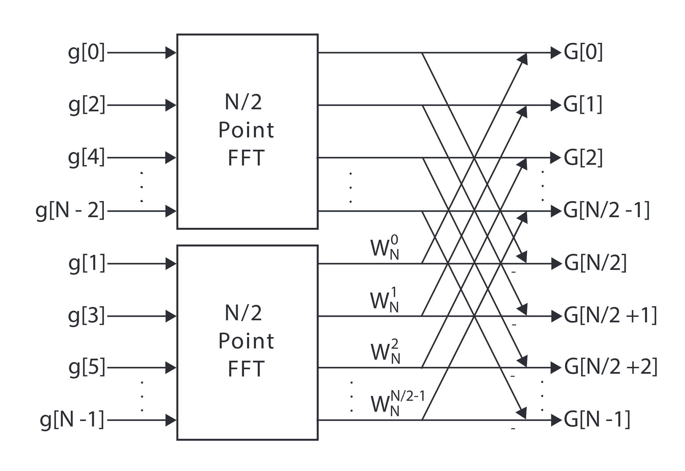
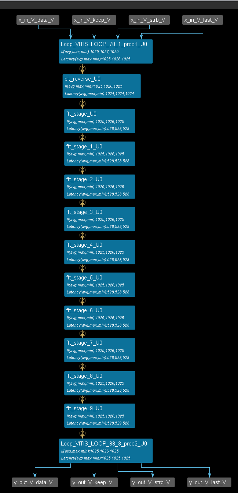
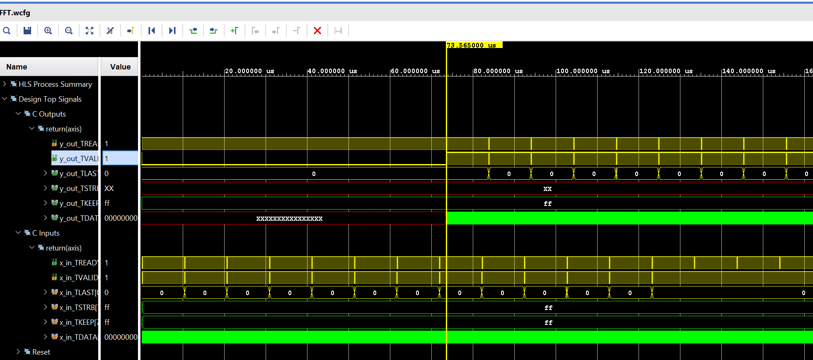

# Lab21 FFT

<script type="text/x-mathjax-config">
  MathJax.Hub.Config({
    tex2jax: {
        inlineMath: [ ['$','$'], ["\\(","\\)"] ],
        displayMath: [ ['$$','$$'], ["\\[","\\]"] ],
        processEscapes: false,
    }
  });
</script>
     
<script type="text/javascript"
        src="https://cdn.mathjax.org/mathjax/latest/MathJax.js?config=TeX-AMS-MML_HTMLorMML">
</script>

Fast Fourier Transform (FFT) is an optimized algorithm to calculate DFT. The formula for DFT is shown below:

$$
X(k) = \sum_{n = 0}^{N - 1}x(n)e^{-j\frac{2\pi}{N}nk}
$$

For an $N$ point series, the output of DFT is also an $N$ point complex series. Each output point $X(k)$ requires $N$ multiplications (ignoring adds). Therefore, to calculate DFT according to the formula, $N^2$ multiplications are required, and it is considered as an $O(N^2)$ algorithm. $O(N^2)$ algorithm is typically not acceptable as the computing time increases too fast as $N$ increases. The divide-and-conquer algorithm is a typical way to slow down the trend. The basic requirements are that the problem can be divided into two parts and can be combined afterwards without too much overhead. If the requirements are satisfied, it is possible to continue dividing the two sub-problems into four sub-sub-problems until the final problem can be solved with ease. In each dividing stage, the computation required is mostly $O(N)$, and there are $log_2^N$ stages. Hence, complexity of the original problem is reduced to the $O(N\times log_2^N)$, which is a significant improvement.

Then the problem is how to divide the DFT operations. A more intuitive way is shown below (from now, we assume $N = 2^M$ and $M$ is an integer). First, we divide the series $x$ into two parts $x_e = x(2n)$ and $x_o = x(2n+1)$, where $x_e$ is the sample on the even index and the $x_o$ is the sample on the odd index. Then, we have:

$$
\begin{aligned}
X(k) &= \sum_{n = 0}^{N - 1}x(n)e^{-j\frac{2\pi}{N}nk}\\
&= \sum_{n = 0}^{N/2 - 1}x_e(n)e^{-j\frac{2\pi}{N}2nk} + \sum_{n = 0}^{N/2 - 1}x_o(n)e^{-j\frac{2\pi}{N}(2n+1)k}\\
&= \sum_{n = 0}^{N/2 - 1}x_e(n)e^{-j\frac{2\pi}{N}2nk} + e^{-j\frac{2\pi}{N}k}\sum_{n = 0}^{N/2 - 1}x_o(n)e^{-j\frac{2\pi}{N}(2n)k}\\
&= \sum_{n = 0}^{N/2 - 1}x_e(n)e^{-j\frac{2\pi}{\frac{N}{2}}nk} + e^{-j\frac{2\pi}{N}k}\sum_{n = 0}^{N/2 - 1}x_o(n)e^{-j\frac{2\pi}{\frac{N}{2}}nk}\\
&= DFT(x_e) + e^{-j\frac{2\pi}{N}k}DFT(x_o)
\end{aligned}
$$

Now, the $N$ point DFT is divided into two $\frac{N}{2}$ DFT. The combination of the two DFTs requires $N$ multiplications. Another useful fact is that $W_N^{k+\frac{N}{2}} = -W_N^k$ ( $k = 0 \to \frac{N}{2}-1$ ). That gives the well-known radix-2 butterfly structure ([Ref](https://en.wikipedia.org/wiki/Butterfly_diagram)). Take 8 point FFT as an example, the stage is shown below:



The two $\frac{N}{2}$ can be divided into two $\frac{N}{4}$ FFTs, and the structure is similar. Finally, for an 8-point FFT, the system can be shown as:


Hence, to perform FFT, we have to take the following steps:

1. Resort the data, bit reverse.
2. Calculate $W_N^0\to W_N^{\frac{N}{2}-1}$.
3. Path the data through $log_2^N$ stages.

**Reference Material**: Ryan Kastner et al., [Parallel Programming for FPGAs](https://github.com/KastnerRG/pp4fpgas/raw/gh-pages/main.pdf), Chapter 5.

## Algorithm Introduction

### Bit reverse

The first step is to sort the input series. It is a little complex on software, but very easy on hardware. The software implementation is shown below:

```c++
unsigned int reverse_bits(unsigned int input) {
  int i, rev = 0;
  for (i = 0; i < M; i++) {
    rev = (rev << 1) | (input & 1);
    input = input >> 1;
  }
  return rev;
}
```

This implementation is slow as there is a data dependency between loops as the input is shifted right one by one. In hardware, bit reversing is simply reordering the wires. In HLS, the fixed point number defined by ap_fixed<> (or ap_ufixed<>) allows bitwise access, which means the fixed point number can also be viewed as an array of binary numbers ([Ref](https://docs.xilinx.com/r/en-US/ug1399-vitis-hls/Other-Class-Methods-Operators-and-Data-Members)). Therefore, we have the following simpler implementation:

```c++
#define N 1024
#define S 10

typedef ap_ufixed<S,S> idx_type;

idx_type idx_reverse(idx_type idx_in){
#pragma HLS INLINE
    idx_type idx_out;
    for (int i = 0; i < S;i++){
#pragma HLS UNROLL
        idx_out[S - 1 - i] = idx_in[i];
    }
    return idx_out;
}
```

This code reverses the bit order and outputs the new index value. This implementation is better as the loop can be entirely unrolled, which imposes minimum latency. It turns out that after synthesis, the index reverse function doesn't exist at all as it is nothing for hardware (rewiring only). Then, we can use the index to reorder the input series.

```c++
void bit_reverse(cplx x_in[N],cplx x_out[N]){
    for (int i = 0; i < N;i++){
        idx_type idx = (idx_type)(i);
        idx_type idx_r = idx_reverse(idx);
#ifndef __SYNTHESIS__
        printf("%d, %d\n",(int)idx, (int)idx_r);
#endif
        x_out[idx_r] = x_in[idx];
    }
}
```
Notice that the code puts the original data into new places, which means the $x_{in}$ is accessed in order. This matches the nature of a stream interface so that the bit reverse operation can start immediately after the first input data comes and finish immediately after the the last input data is received. The ```#ifndef __SYNTHESIS__``` and ```#endif``` is used to wrap the code that it is only synthesizable in the simulation. For example, the printf here is used to show the original index and the bit reversed index for debugging. This is an especially important skill when the function is complex and hard to deduce what is happening. Notice that standard C printf doesn't support fixed-point numbers, so we have to do a format transform when using fixed point numbers with either ```%d``` or ```%f```.

The second script is the butterfly operation. Here is a simple implementation where **w_r** (**w_i**) is the real (imaginary) part of $W_N^k$:

```c++
typedef float dtype;
typedef float wtype;
typedef struct{
    dtype real;
    dtype imag;
}cplx;

// y_l = x_l + x_h * W
// y_h = x_l - x_h * W

void butterfly(cplx& y_l, cplx& y_h,cplx x_l, cplx x_h, dtype wr, dtype wi){
#pragma HLS INLINE
    dtype r_temp = wr * x_h.real - x_h.imag * wi;
#pragma HLS BIND_OP variable=r_temp op=fmul impl=meddsp
    dtype i_temp = wr * x_h.imag + x_h.real * wi;
#pragma HLS BIND_OP variable=i_temp op=fmul impl=meddsp
    y_l.real = x_l.real + r_temp;
    y_l.imag = x_l.imag + i_temp;
    y_h.real = x_l.real - r_temp;
    y_h.imag = x_l.imag - i_temp;
}
```

The INLINE pragma ([Ref](https://docs.xilinx.com/r/en-US/ug1399-vitis-hls/pragma-HLS-inline)) is used to avoid overhead caused by function calling (function calling in hardware requires handshake logic, which requires extra logic and adds latency) and to reduce the hierarchy.

Since we are implementing 1024 point FFT on PYNQ Z2 (xz7z020) which only has 220 DSP slices, we have to carefully consider if the DSPs are enough. According to the final report, if we only use DSP slices to perform the floating point multiplication, 234 DSP slices are required, which is over the capability of the board. Therefore, BIND_OP pragma ([Ref](https://docs.xilinx.com/r/en-US/ug1399-vitis-hls/pragma-HLS-bind_op)) is used to specify which resource to use when implementing the floating point multiplication. This pragma is applied to the result of the mathematical operation. For example, the code forces all floating point multiplication (fmul) to generate ```r_temp``` (medium DSP resource usage). Its uses both DSP and logic fabric for multiplication. This pragma can reduce required DSP resources and make final implementation possible.

### FFT_stage

Then, the next step is to implement each stage in FFT. Since different states have different structures, the stage number should also be one of the inputs of the stage function, and the stage function should be able to generate the butterflies according to the stage and $N$. Here is the implementation:

```c++
void fft_stage(cplx x_in[N], cplx x_out[N], int stage){
    int butters_per_block = 1 << (stage - 1);
    int points_per_block = 1 << (stage);
    int blocks = 1 << (S - stage);
#ifndef __SYNTHESIS__
    printf("Stage %d, blocks = %d, butters per block = %d, points per block = %d\n",stage,blocks,butters_per_block,points_per_block);
#endif
    for (int j = 0; j < butters_per_block;j++){
        idx_type k = j * blocks;
        dtype wr = W_real[k];
        dtype wi = W_imag[k];
        for (int i = 0; i < blocks;i++){
#pragma HLS pipeline
            idx_type idx = points_per_block * i + j;
#ifndef __SYNTHESIS__
            printf("butter %d,%d\n",(int(idx)), int(idx+butters_per_block));
#endif
            butterfly(x_out[idx],x_out[idx + butters_per_block],x_in[idx],x_in[idx + butters_per_block], wr, wi);
        }
    }
}
```

The first thing to determine is how many small FFT blocks are inside the stage. For example, the first stage of the $N=1024=2^{10}$ FFT should have 512 blocks of 2-point FFTs; and the second stage is then 256 blocks of 4-point FFT. Hence, we can decide that the number of blocks equals $2^{TotalStages - stage}$ (stage counts from 1). Then we have to decide how many points inside each block and obviously, it equals $N/(number of blocks) = 2^{stage} = 1 << stage$. Then, it is time to build the structure. Since the $W_N^k$ used in all FFT blocks are identical, the outer loop is the number of butterflies in each block so that we don't have to read from the ROM that saves $W_N^k$ for multiple times. Then, in each block, we apply the butterfly structure accordingly. Notice that we only pipelined the inner loop, which means it always needs $N/2$ trip counts to finish one stage, which is slow compared to an unrolled structure. However, considering that the FFT requires $N$ clock cycles to load that data and $N$ clock cycles to write out the result, it doesn't make sense to make the tasks inside FFT to be faster than $N$ clock cycles. For example, an $8$ point FFT has 3 stages, and we treat the bit reversal and each stage as a task. DATAFLOW pragma was introduced in DFT section to pipelining the tasks. As long as the middle tasks are no slower than the input/output stages, the FFT kernel can always receive new data and start processing. Therefore, unless we need minimum latency from the input to the output, we don't have to make the middle tasks too fast. That is why the loop is not unrolled here even when there is no data dependency exists between the loops, as you can see in the FFT structure (each source data is only read once and each output data is also only written once).

### Entire FFT

The final step is to construct the entire FFT. Here is the final top function and the test bench:

**fft.h**
```c++
#ifndef _FFT_H
#define _FFT_H

#include "hls_stream.h"
#include "ap_axi_sdata.h"
#include "ap_fixed.h"

#define N 1024
#define S 10

typedef ap_ufixed<S,S> idx_type;

typedef float dtype;
typedef float wtype;

typedef struct{
    dtype real;
    dtype imag;
}cplx;

typedef hls::axis<cplx,0,0,0> cplx_dp;
typedef hls::stream<cplx_dp> cplx_stream;

const dtype W_real[]={1.000000, 0.999981,0.999925,0.999831,0.999699,0.999529,0.999322,0.999078,0.998795,0.998476,0.998118,0.997723,0.997290,0.996820,0.996313,0.995767,0.995185,

0.994565,0.993907,0.993212,0.992480,0.991710,0.990903,0.990058,0.989177,0.988258,0.987301,0.986308,0.985278,0.984210,0.983105,0.981964,0.980785,

0.979570,0.978317,0.977028,0.975702,0.974339,0.972940,0.971504,0.970031,0.968522,0.966976,0.965394,0.963776,0.962121,0.960431,0.958703,0.956940,

0.955141,0.953306,0.951435,0.949528,0.947586,0.945607,0.943593,0.941544,0.939459,0.937339,0.935184,0.932993,0.930767,0.928506,0.926210,0.923880,

0.921514,0.919114,0.916679,0.914210,0.911706,0.909168,0.906596,0.903989,0.901349,0.898674,0.895966,0.893224,0.890449,0.887640,0.884797,0.881921,

0.879012,0.876070,0.873095,0.870087,0.867046,0.863973,0.860867,0.857729,0.854558,0.851355,0.848120,0.844854,0.841555,0.838225,0.834863,0.831470,

0.828045,0.824589,0.821102,0.817585,0.814036,0.810457,0.806848,0.803208,0.799537,0.795837,0.792107,0.788346,0.784557,0.780737,0.776888,0.773010,

0.769103,0.765167,0.761202,0.757209,0.753187,0.749136,0.745058,0.740951,0.736817,0.732654,0.728464,0.724247,0.720002,0.715731,0.711432,0.707107,

0.702755,0.698376,0.693971,0.689541,0.685084,0.680601,0.676093,0.671559,0.667000,0.662416,0.657807,0.653173,0.648514,0.643832,0.639124,0.634393,

0.629638,0.624859,0.620057,0.615232,0.610383,0.605511,0.600616,0.595699,0.590760,0.585798,0.580814,0.575808,0.570781,0.565732,0.560662,0.555570,

0.550458,0.545325,0.540171,0.534998,0.529804,0.524590,0.519356,0.514103,0.508830,0.503538,0.498228,0.492898,0.487550,0.482184,0.476799,0.471397,

0.465976,0.460539,0.455084,0.449611,0.444122,0.438616,0.433094,0.427555,0.422000,0.416430,0.410843,0.405241,0.399624,0.393992,0.388345,0.382683,

0.377007,0.371317,0.365613,0.359895,0.354163,0.348419,0.342661,0.336890,0.331106,0.325310,0.319502,0.313682,0.307850,0.302006,0.296151,0.290285,

0.284407,0.278520,0.272621,0.266713,0.260794,0.254866,0.248928,0.242980,0.237024,0.231058,0.225084,0.219101,0.213110,0.207111,0.201105,0.195090,

0.189069,0.183040,0.177004,0.170962,0.164913,0.158858,0.152797,0.146730,0.140658,0.134581,0.128498,0.122411,0.116319,0.110222,0.104122,0.098017,

0.091909,0.085797,0.079682,0.073565,0.067444,0.061321,0.055195,0.049068,0.042938,0.036807,0.030675,0.024541,0.018407,0.012271,0.006136,-0.000000,

-0.006136,-0.012272,-0.018407,-0.024541,-0.030675,-0.036807,-0.042938,-0.049068,-0.055195,-0.061321,-0.067444,-0.073565,-0.079682,-0.085797,-0.091909,-0.098017,

-0.104122,-0.110222,-0.116319,-0.122411,-0.128498,-0.134581,-0.140658,-0.146731,-0.152797,-0.158858,-0.164913,-0.170962,-0.177004,-0.183040,-0.189069,-0.195090,

-0.201105,-0.207111,-0.213110,-0.219101,-0.225084,-0.231058,-0.237024,-0.242980,-0.248928,-0.254866,-0.260794,-0.266713,-0.272621,-0.278520,-0.284408,-0.290285,

-0.296151,-0.302006,-0.307850,-0.313682,-0.319502,-0.325310,-0.331106,-0.336890,-0.342661,-0.348419,-0.354164,-0.359895,-0.365613,-0.371317,-0.377007,-0.382683,

-0.388345,-0.393992,-0.399624,-0.405241,-0.410843,-0.416430,-0.422000,-0.427555,-0.433094,-0.438616,-0.444122,-0.449611,-0.455084,-0.460539,-0.465977,-0.471397,

-0.476799,-0.482184,-0.487550,-0.492898,-0.498228,-0.503538,-0.508830,-0.514103,-0.519356,-0.524590,-0.529804,-0.534998,-0.540172,-0.545325,-0.550458,-0.555570,

-0.560662,-0.565732,-0.570781,-0.575808,-0.580814,-0.585798,-0.590760,-0.595699,-0.600617,-0.605511,-0.610383,-0.615232,-0.620057,-0.624860,-0.629638,-0.634393,

-0.639125,-0.643832,-0.648514,-0.653173,-0.657807,-0.662416,-0.667000,-0.671559,-0.676093,-0.680601,-0.685084,-0.689541,-0.693972,-0.698376,-0.702755,-0.707107,

-0.711432,-0.715731,-0.720003,-0.724247,-0.728464,-0.732654,-0.736817,-0.740951,-0.745058,-0.749136,-0.753187,-0.757209,-0.761202,-0.765167,-0.769103,-0.773010,

-0.776888,-0.780737,-0.784557,-0.788346,-0.792107,-0.795837,-0.799537,-0.803208,-0.806848,-0.810457,-0.814036,-0.817585,-0.821103,-0.824589,-0.828045,-0.831470,

-0.834863,-0.838225,-0.841555,-0.844854,-0.848120,-0.851355,-0.854558,-0.857729,-0.860867,-0.863973,-0.867046,-0.870087,-0.873095,-0.876070,-0.879012,-0.881921,

-0.884797,-0.887640,-0.890449,-0.893224,-0.895966,-0.898674,-0.901349,-0.903989,-0.906596,-0.909168,-0.911706,-0.914210,-0.916679,-0.919114,-0.921514,-0.923880,

-0.926210,-0.928506,-0.930767,-0.932993,-0.935184,-0.937339,-0.939459,-0.941544,-0.943594,-0.945607,-0.947586,-0.949528,-0.951435,-0.953306,-0.955141,-0.956940,

-0.958704,-0.960431,-0.962121,-0.963776,-0.965394,-0.966976,-0.968522,-0.970031,-0.971504,-0.972940,-0.974339,-0.975702,-0.977028,-0.978317,-0.979570,-0.980785,

-0.981964,-0.983105,-0.984210,-0.985278,-0.986308,-0.987301,-0.988258,-0.989177,-0.990058,-0.990903,-0.991710,-0.992480,-0.993212,-0.993907,-0.994565,-0.995185,

-0.995767,-0.996313,-0.996820,-0.997290,-0.997723,-0.998118,-0.998476,-0.998795,-0.999078,-0.999322,-0.999529,-0.999699,-0.999831,-0.999925,-0.999981};
const dtype W_imag[]={-0.000000,-0.006136,-0.012272,-0.018407,-0.024541,-0.030675,-0.036807,-0.042938,-0.049068,-0.055195,-0.061321,-0.067444,-0.073565,-0.079682,-0.085797,-0.091909,-0.098017,-0.104122,-0.110222,-0.116319,-0.122411,-0.128498,-0.134581,-0.140658,-0.146730,-0.152797,-0.158858,-0.164913,-0.170962,-0.177004,-0.183040,-0.189069,-0.195090,-0.201105,-0.207111,-0.213110,-0.219101,-0.225084,-0.231058,-0.237024,-0.242980,-0.248928,-0.254866,-0.260794,-0.266713,-0.272621,-0.278520,-0.284408,-0.290285,-0.296151,-0.302006,-0.307850,-0.313682,-0.319502,-0.325310,-0.331106,-0.336890,-0.342661,-0.348419,-0.354164,-0.359895,-0.365613,-0.371317,-0.377007,-0.382683,-0.388345,-0.393992,-0.399624,-0.405241,-0.410843,-0.416430,-0.422000,-0.427555,-0.433094,-0.438616,-0.444122,-0.449611,-0.455084,-0.460539,-0.465977,-0.471397,-0.476799,-0.482184,-0.487550,-0.492898,-0.498228,-0.503538,-0.508830,-0.514103,-0.519356,-0.524590,-0.529804,-0.534998,-0.540172,-0.545325,-0.550458,-0.555570,-0.560662,-0.565732,-0.570781,-0.575808,-0.580814,-0.585798,-0.590760,-0.595699,-0.600617,-0.605511,-0.610383,-0.615232,-0.620057,-0.624860,-0.629638,-0.634393,-0.639124,-0.643832,-0.648514,-0.653173,-0.657807,-0.662416,-0.667000,-0.671559,-0.676093,-0.680601,-0.685084,-0.689541,-0.693971,-0.698376,-0.702755,-0.707107,-0.711432,-0.715731,-0.720003,-0.724247,-0.728464,-0.732654,-0.736817,-0.740951,-0.745058,-0.749136,-0.753187,-0.757209,-0.761202,-0.765167,-0.769103,-0.773010,-0.776888,-0.780737,-0.784557,-0.788346,-0.792107,-0.795837,-0.799537,-0.803208,-0.806848,-0.810457,-0.814036,-0.817585,-0.821103,-0.824589,-0.828045,-0.831470,-0.834863,-0.838225,-0.841555,-0.844854,-0.848120,-0.851355,-0.854558,-0.857729,-0.860867,-0.863973,-0.867046,-0.870087,-0.873095,-0.876070,-0.879012,-0.881921,-0.884797,-0.887640,-0.890449,-0.893224,-0.895966,-0.898674,-0.901349,-0.903989,-0.906596,-0.909168,-0.911706,-0.914210,-0.916679,-0.919114,-0.921514,-0.923880,-0.926210,-0.928506,-0.930767,-0.932993,-0.935184,-0.937339,-0.939459,-0.941544,-0.943593,-0.945607,-0.947586,-0.949528,-0.951435,-0.953306,-0.955141,-0.956940,-0.958703,-0.960431,-0.962121,-0.963776,-0.965394,-0.966976,-0.968522,-0.970031,-0.971504,-0.972940,-0.974339,-0.975702,-0.977028,-0.978317,-0.979570,-0.980785,-0.981964,-0.983105,-0.984210,-0.985278,-0.986308,-0.987301,-0.988258,-0.989177,-0.990058,-0.990903,-0.991710,-0.992480,-0.993212,-0.993907,-0.994565,-0.995185,-0.995767,-0.996313,-0.996820,-0.997290,-0.997723,-0.998118,-0.998476,-0.998795,-0.999078,-0.999322,-0.999529,-0.999699,-0.999831,-0.999925,-0.999981,-1.000000,-0.999981,-0.999925,-0.999831,-0.999699,-0.999529,-0.999322,-0.999078,-0.998795,-0.998476,-0.998118,-0.997723,-0.997290,-0.996820,-0.996313,-0.995767,-0.995185,-0.994565,-0.993907,-0.993212,-0.992480,-0.991710,-0.990903,-0.990058,-0.989177,-0.988258,-0.987301,-0.986308,-0.985278,-0.984210,-0.983105,-0.981964,-0.980785,-0.979570,-0.978317,-0.977028,-0.975702,-0.974339,-0.972940,-0.971504,-0.970031,-0.968522,-0.966976,-0.965394,-0.963776,-0.962121,-0.960431,-0.958703,-0.956940,-0.955141,-0.953306,-0.951435,-0.949528,-0.947586,-0.945607,-0.943593,-0.941544,-0.939459,-0.937339,-0.935183,-0.932993,-0.930767,-0.928506,-0.926210,-0.923880,-0.921514,-0.919114,-0.916679,-0.914210,-0.911706,-0.909168,-0.906596,-0.903989,-0.901349,-0.898674,-0.895966,-0.893224,-0.890449,-0.887640,-0.884797,-0.881921,-0.879012,-0.876070,-0.873095,-0.870087,-0.867046,-0.863973,-0.860867,-0.857729,-0.854558,-0.851355,-0.848120,-0.844854,-0.841555,-0.838225,-0.834863,-0.831470,-0.828045,-0.824589,-0.821102,-0.817585,-0.814036,-0.810457,-0.806848,-0.803208,-0.799537,-0.795837,-0.792107,-0.788346,-0.784557,-0.780737,-0.776888,-0.773010,-0.769103,-0.765167,-0.761202,-0.757209,-0.753187,-0.749136,-0.745058,-0.740951,-0.736817,-0.732654,-0.728464,-0.724247,-0.720002,-0.715731,-0.711432,-0.707107,-0.702755,-0.698376,-0.693971,-0.689541,-0.685084,-0.680601,-0.676093,-0.671559,-0.667000,-0.662416,-0.657807,-0.653173,-0.648514,-0.643831,-0.639124,-0.634393,-0.629638,-0.624859,-0.620057,-0.615232,-0.610383,-0.605511,-0.600616,-0.595699,-0.590760,-0.585798,-0.580814,-0.575808,-0.570781,-0.565732,-0.560661,-0.555570,-0.550458,-0.545325,-0.540171,-0.534998,-0.529804,-0.524590,-0.519356,-0.514103,-0.508830,-0.503538,-0.498228,-0.492898,-0.487550,-0.482184,-0.476799,-0.471397,-0.465976,-0.460539,-0.455084,-0.449611,-0.444122,-0.438616,-0.433094,-0.427555,-0.422000,-0.416429,-0.410843,-0.405241,-0.399624,-0.393992,-0.388345,-0.382683,-0.377007,-0.371317,-0.365613,-0.359895,-0.354163,-0.348419,-0.342661,-0.336890,-0.331106,-0.325310,-0.319502,-0.313682,-0.307850,-0.302006,-0.296151,-0.290285,-0.284407,-0.278520,-0.272621,-0.266713,-0.260794,-0.254866,-0.248928,-0.242980,-0.237024,-0.231058,-0.225084,-0.219101,-0.213110,-0.207111,-0.201105,-0.195090,-0.189069,-0.183040,-0.177004,-0.170962,-0.164913,-0.158858,-0.152797,-0.146730,-0.140658,-0.134581,-0.128498,-0.122411,-0.116319,-0.110222,-0.104122,-0.098017,-0.091909,-0.085797,-0.079682,-0.073564,-0.067444,-0.061321,-0.055195,-0.049068,-0.042938,-0.036807,-0.030675,-0.024541,-0.018407,-0.012271,-0.006136};

idx_type idx_reverse(idx_type idx_in);
void bit_reverse(cplx x_in[N],cplx x_out[N]);
void butterfly(cplx& y_l, cplx& y_h,cplx x_l, cplx x_h, dtype wr, dtype wi);
void fft_stage(cplx x_in[N], cplx x_out[N], int stage);
void FFT(cplx_stream& x_in, cplx_stream& y_out);

#endif
```

**fft.cpp**
```c++
#include "fft.h"

idx_type idx_reverse(idx_type idx_in){
#pragma HLS INLINE
    idx_type idx_out;
    for (int i = 0; i < S;i++){
#pragma HLS UNROLL
        idx_out[S - 1 - i] = idx_in[i];
    }
    return idx_out;
}

void bit_reverse(cplx x_in[N],cplx x_out[N]){
    for (int i = 0; i < N;i++){
        idx_type idx = (idx_type)(i);
        idx_type idx_r = idx_reverse(idx);
#ifndef __SYNTHESIS__
        printf("%d, %d\n",(int)idx, (int)idx_r);
#endif
        x_out[idx_r] = x_in[idx];
    }
}

void butterfly(cplx& y_l, cplx& y_h,cplx x_l, cplx x_h, dtype wr, dtype wi){
#pragma HLS INLINE
    dtype r_temp = wr * x_h.real - x_h.imag * wi;
#pragma HLS BIND_OP variable=r_temp op=fmul impl=meddsp
    dtype i_temp = wr * x_h.imag + x_h.real * wi;
#pragma HLS BIND_OP variable=i_temp op=fmul impl=meddsp
    y_l.real = x_l.real + r_temp;
    y_l.imag = x_l.imag + i_temp;
    y_h.real = x_l.real - r_temp;
    y_h.imag = x_l.imag - i_temp;
}

void fft_stage(cplx x_in[N], cplx x_out[N], int stage){
    int butters_per_block = 1 << (stage - 1);
    int points_per_block = 1 << (stage);
    int blocks = 1 << (S - stage);
#ifndef __SYNTHESIS__
    printf("Stage %d, blocks = %d, butters per block = %d, points per block = %d\n",stage,blocks,butters_per_block,points_per_block);
#endif
    for (int j = 0; j < butters_per_block;j++){
        idx_type k = j * blocks;
        dtype wr = W_real[k];
        dtype wi = W_imag[k];
        for (int i = 0; i < blocks;i++){
#pragma HLS pipeline
            idx_type idx = points_per_block * i + j;
#ifndef __SYNTHESIS__
            printf("butter %d,%d\n",(int(idx)), int(idx+butters_per_block));
#endif
            butterfly(x_out[idx],x_out[idx + butters_per_block],x_in[idx],x_in[idx + butters_per_block], wr, wi);
        }
    }
}

void FFT(cplx_stream& x_in, cplx_stream& y_out){
#pragma HLS INTERFACE mode=ap_ctrl_none port=return
#pragma HLS INTERFACE mode=axis register_mode=both port=y_out register
#pragma HLS INTERFACE mode=axis register_mode=both port=x_in register
#pragma HLS DATAFLOW
    cplx x_local[N];
    cplx x_local_s[S+1][N];
#pragma HLS ARRAY_PARTITION dim=1 variable=x_local_s type=complete

    for (int i = 0; i < N; i++){
        cplx_dp temp;
        x_in >> temp;
        x_local[i].real = temp.data.real;
        x_local[i].imag = temp.data.imag;
    }

    bit_reverse(x_local, x_local_s[0]);
#ifndef __SYNTHESIS__
    for (int i = 0; i < N;i++){
    	printf("%f, %f\n",x_local[i].real,x_local_s[0][i].real);
    }
#endif
    for (int i = 1; i <= S; i++){
#pragma HLS UNROLL
    	fft_stage(x_local_s[i-1],x_local_s[i],i);
    }

    for (int i = 0; i < N; i++){
        cplx_dp temp;
        temp.data.real = x_local_s[S][i].real;
        temp.data.imag = x_local_s[S][i].imag;
        temp.keep = -1;
        temp.last = (i == (N - 1));
        y_out << temp;
    }
}
```

The synthesis report is shown below:

<div align=center></div>

The interface information is shown below:

<div align=center></div>

The dataflow view is shown below:

<div align=center></div>

**fft_tb.cpp**
```c++
#include "fft.h"
#include <math.h>

#define PI (3.141592653f)

int main(int argc, char* argv[]){
    cplx_stream in_stream, out_stream;

    float x[N];
    float y[N];
    for (int it = 0; it < 12;it++){
		for (int i = 0;i < N;i++){
			x[i] = cos(0.25 * PI * i);
			cplx_dp temp;
			temp.data.real = x[i];
			temp.data.imag = 0;
			temp.keep = -1;
			temp.last = (i == (N - 1));
			in_stream << temp;
		}
    }

    for (int it = 0; it < 12;it++){
    	FFT(in_stream,out_stream);
    }

    for (int it = 0; it < 12;it++){
		for (int i = 0;i < N;i++){
			cplx_dp temp;
			out_stream >> temp;
			y[i] = sqrt(temp.data.real * temp.data.real + temp.data.imag * temp.data.imag);
		}
    }
    float max = y[0];
    int max_idx = 0;
    for (int i = 1;i < N;i++){
    	if(y[i] > max){
    		max = y[i];
    		max_idx = i;
    	}
    }
    if (max_idx / (float)N * 2 != 0.25){
    	printf("Fail!\n");
    	return 1;
    }

	printf("Pass!\n");
    return 0;
}
```
If you see the message ```Pass```, you can know you are right.

After running the Cosimuation, we can also see the waveform shown below:

<div align=center></div>

The kernel can receive data in a batch (1024 data in a batch in this example) continuously and after $73.565\mu s$ (latency needed to process 1 batch), the result comes out continuously. Hence, the final **II** in a batch of data is 1. However, the **II** between Different batches are not 1. To stream into the kernel, a new batch must wait for about $73.565\mu s$ (latency required to process 1 batch).

#### Create the Vivado project

The configure block design can use reference materials [here](https://uri-nextlab.github.io/ParallelProgammingLabs/HLS_Labs/Lab1.html). And we need to choose the number of the DMA according to the number of the interface.

<div align=center></div>

#### Run synthesis,  Implementation, and generate bitstream

It may show some errors about I/O Ports, please fix them.

#### Download the bitstream file to PYNQ

<div align=center></div>


```python
from pynq import allocate
from pynq import Overlay
import numpy as np
import matplotlib.pyplot as plt

hw = Overlay("design_1.bit")
dma = hw.axi_dma_0

N = 1024
ibuf = allocate((N,), dtype='csingle')
obuf = allocate((N,), dtype='csingle')

idx = np.arange(0,1024)
ibuf[:] = np.cos(0.25 * np.pi * idx) + 0.5 * np.cos(0.125 * np.pi * idx) + 0.25 * np.cos(0.3765 * np.pi * idx)

dma.sendchannel.transfer(ibuf)
dma.recvchannel.transfer(obuf)

nm_freq = idx[0:512]/512
plt.figure(dpi=200)
plt.stem(nm_freq,np.abs(obuf[0:512])/N,use_line_collection=True)
plt.xlim([0,1])
plt.xlabel('Normalzied frequency (0~1)')
plt.ylabel('Magnitude')
```

We will see:

<div align=center></div>

In this testing code, a signal with three frequency components is generated. The first two frequencies are at the bins so that they have a single peak at that frequency and the magnitude equals the time domain magnitude. The third frequency is not at the bins and therefore it has some leakages and the peak magnitude cannot fully represent the time domain magitude.


## Demonstrate
Please finish the ```FFT``` example and implement it on the PYNQ-Z2 board.
