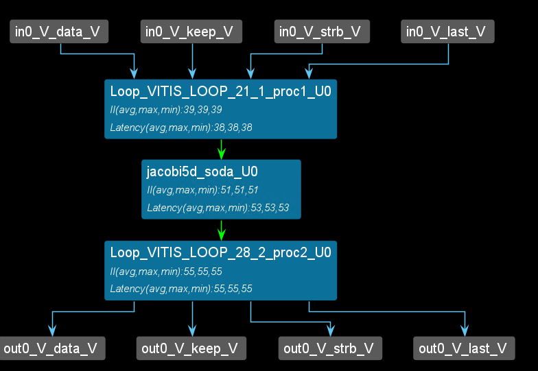
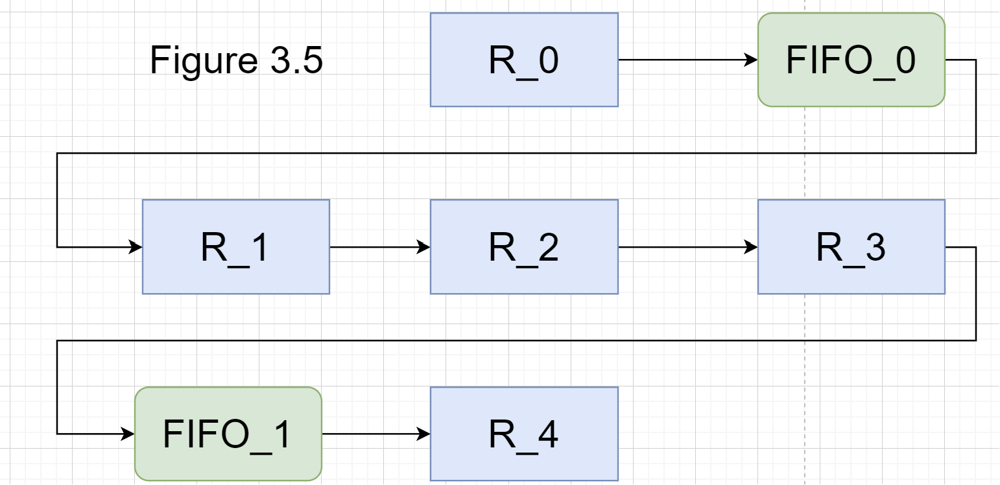
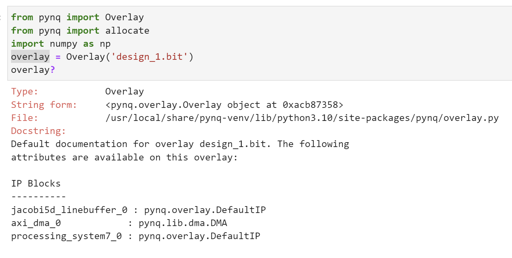
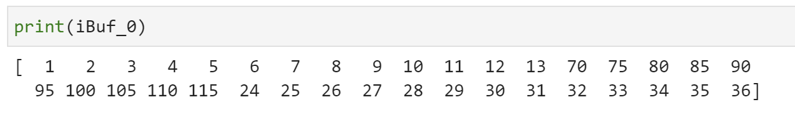

# Lab22 Linebuffer_0

<script type="text/x-mathjax-config">
  MathJax.Hub.Config({
    tex2jax: {
        inlineMath: [ ['$','$'], ["\\(","\\)"] ],
        displayMath: [ ['$$','$$'], ["\\[","\\]"] ],
        processEscapes: false,
    }
  });
</script>
     
<script type="text/javascript"
        src="https://cdn.mathjax.org/mathjax/latest/MathJax.js?config=TeX-AMS-MML_HTMLorMML">
</script>


## Instroduction
Stencil computation is one of the most important kernels in many application domains, such as image processing, solving partial differential equations, and cellular automata. Many stencil kernels are complex, usually consisting of multiple stages or iterations, and are transmutation-bounded. Such kernels are often loaded
to FPGAs to improve the efficiency of dedicated hardware. However, implementing difficult kernels efficiently is not trivial due to complicated data dependencies, difficulties in programming FPGAs with RTL, and large design space. 

The [SODA](https://ieeexplore.ieee.org/document/8587691) is an automated framework for implementing Stencil algorithms with Optimized Datalow Architecture on FPGAs. It focuses on improving the performance of stencil computations, which are a common type of algorithm used in many fields like image processing, solving partial differential equations, and cellular automata.

This architecture aims to:

* Minimize on-chip reuse buffer size: Stencil computations often require storing intermediate results for data reuse. SODA minimizes the size of these buffers by carefully managing data flow and exploiting spatial locality.

* Achieve full data reuse: By carefully pipelining the computation and reusing input data efficiently, SODA ensures that no data is accessed from external memory more than once, significantly reducing memory bandwidth requirements.

* Provide flexible and scalable fine-grained parallelism: SODA's architecture allows for parallel execution of small work units, which can be scaled up or down depending on the available resources.

### Stencil Computation

Stencil computation can be intuitively defined as a kernel that updates data elements on a multidimensional array according to a fixed local pattern. In practice, arrays are often too large to be stored on-chip. Here is an example code for a 5-point Jacobi kernel, as an example of a 5-point two-dimensional Jacobi kernel on an M×N input.

<div align=center></div>


The figure shows a possible iteration pattern and the input data elements it accesses when generating the output at (i,j). The operation intensity of the 5-point Jacobi kernel example code above (defined as the number of operations per input data) is relatively low, which makes this type of application communication-limited. In practice, stencil kernels are often complex. Some stencil computations consist of multiple stages, each a simple stencil kernel. Some stencil computations are repeated over time, where each iteration can be viewed as a stage directly connected to the previous stage. If the number of stages or iterations is large enough, the operation intensity will be very high, and the application will become computation-limited (FPGA resources are limited).

<div align=center></div>

### Datalow-Based Implementation

The SODA microarchitecture can be efficiently implemented as dataflow modules. Due to its localized communication and modularized structure, the dataflow implementation enables high-frequency synthesis results and accurate resource modeling. It also enables the flexibility to connect multiple stages in a single accelerator. The below shows the dataflow modules of 1 iteration of
the Jacobi kernel shown in Listing 1.

<div align=center></div>

The forwarding module (FW) forwards and distributes input data to the appropriate destination modules. Each forwarding module either directly forwards data from the input or implements a ```FIFO``` or ```FF``` as part of the reuse buffer. Each ```FIFO``` or ```FF```below corresponds to the forwarding module shown above. The structure of the forwarding module depends only on the data type, FIFO depth, and fanout. FIFOs can be implemented on FPGAs using shift register look-up tables or block RAM (BRAM).

<div align=center></div>

Large FIFOs with capacities greater than 1024 bits are implemented using BRAM, and small FIFOs are implemented with SRL.
Processing modules (PEs) are processing units that implement the core functionality. Each processing module contains 1 PE and produces one output data element per cycle. All processing modules in the same stage have the same structure for a given stencil kernel. The dataflow architecture implements the flexibility of cascading multiple stages together. Inputs and outputs can be connected to DRAM or the outputs or inputs of another stage.

Figure 3.4 shows an example overview of a complete SODA accelerator. The accelerator has two stages and executes the Jacobi kernel twice. The first stage is the buffering stage, which performs the Jacobi kernel computation on the input data and then outputs the output to the second stage. The second stage performs the Jacobi kernel computation on the input data again and outputs the computed results to DRAM. Finally, DRAM outputs the data back to the first stage to achieve the reuse of the buffer and to reduce the waste of memory space.

<div align=center></div>

### The parameters of the SODA accelerator

To generate an effective SODA accelerator, it is necessary to configure the memory size of each register and FIFO buffer in the SODA architecture. As shown in Figure 3.5, for example, in a five-point SODA structure, register R2 stores the data of the central point (i,j), and the remaining registers R0, R1, R3, and R4 store the data of the points (i-1,j), (i,j-1), (i,j+1), and (i+1,j), respectively. The FIFO buffers FIFO_0 and FIFO_1 are used to cache the data of the points between (i-1,j) and (i,j-1) in the matrix, and the data of the points between (i,j+1) and (i+1,j), respectively. The specific parameter configuration is shown below.

<div align=center></div>

<div align=center></div>

## FPGA implementation

### First way of linebuffer

The control-driven writes the first way.
For the detail of the coding, we can have one example below.
For the 3*12 matrix like below:

<div align=center></div>

We can see the schedule view below if we apply the line buffer structure to the example.

<div align=center></div>

As show above, the ```F0_F1``` are ```FIFO_0 FIFO_1``` and the ```fe0``` ```f1 f2 f3 f4 st``` are ```register```. And the ```RE0``` is corresponds to the ```result[0]``` in the coding and ```st``` is corresponds to the ```start[0]``` in the coding. And if you understand the ```line buffer```, you will know the schedule view corresponds to the ```line buffer```. The view corresponds to Figure 3.5.

<div align=center></div>

**linebuffer_0.h**
```c++
#include <stdio.h>
#include "hls_stream.h"
#include <assert.h>
#include <ap_fixed.h>
#include <ap_axi_sdata.h>

#ifndef _LINEBUFFER_0_H
#define _LINEBUFFER_0_H


#define WIDTH 12
#define HEIGHT 3


typedef int mat;
typedef hls::stream <mat> Mat_stream;
typedef hls::axis<mat,0,0,0> F_mat;
typedef hls::stream<F_mat> F_stream;


void jacobi5d_top(F_stream &in0,F_stream &out0);
void jacobi5d_soda(Mat_stream &in0,Mat_stream &out0);

void temporal(
		hls::stream <mat> &in0,
		hls::stream <mat> &out0
);
#endif
```
**linebuffer_0.cpp**
```c++
#include "linebuffer_0.h"

#define PRAGMA_SUB(x) _Pragma (#x)
#define DO_PRAGMA(x) PRAGMA_SUB(x)

void jacobi5d_top(F_stream &in0,F_stream &out0)
{
#pragma HLS DATAFLOW
#pragma HLS INTERFACE mode=axis port=in0
#pragma HLS INTERFACE mode=axis port=out0
#pragma HLS INTERFACE mode=s_axilite port=return
	F_mat valuein;
	F_mat valueout;
	Mat_stream in;
#pragma	HLS stream depth=256 variable=in
	Mat_stream out;
#pragma	HLS stream depth=256 variable=out
	valueout.keep=-1;
	valueout.last=0;
	for(int i=0;i<36;i++)
	{
		valuein=in0.read();
		in.write(valuein.data);
		//printf("in[%d] is %lf\r\n",i,(double)valuein.data);
	}
	jacobi5d_soda(in,out);
	for(int j=0;j<36;j++)
	{
		valueout.data=out.read();
		//printf("out[%d] is %lf\r\n",j,(double)valueout.data);
		out0.write(valueout);
		if(j>33)
		{
			valueout.last=1;
		}
	}
}


void jacobi5d_soda(Mat_stream &in0,Mat_stream &out0)
{

#pragma HLS INTERFACE mode=axis port=in0
#pragma HLS INTERFACE mode=axis port=out0
#pragma HLS INTERFACE mode=s_axilite port=return
	hls::stream<mat> fifo_edge("fifo_edge");
	hls::stream<mat> fifo_edge1("fifo_edge1");
//	hls::stream<mat> fifo_edge2("fifo_edge2");
	int k1;

	DO_PRAGMA(HLS stream depth=256 variable=fifo_edge)
	DO_PRAGMA(HLS stream depth=256 variable=fifo_edge1)

	mat ff_edge[5],start,result[2],temp;
#pragma HLS ARRAY_PARTITION variable=result type=complete
#pragma HLS ARRAY_PARTITION variable=ff_edge type=complete dim=1

	Row:for(int i=-1;i<HEIGHT;i++)
		Col:for(int j=-1;j<WIDTH-1;j++)

		{
			if(i==-1)
			{
				if(j==-1)
				{
					in0.read(result[0]);
				}
				else
				{
					if((i+1)*WIDTH+j+1>k+1 && (i+1)*WIDTH+j+1<HEIGHT*WIDTH+2*k)
					{
						fifo_edge.write(ff_edge[0]);
			
					}
					ff_edge[0]=start;
					if(i<HEIGHT-1)
					{
						in0.read(start);
					}
				}
			}
			else
			{
				if((i+1)*WIDTH+j+1>2*WIDTH)
				{
					fifo_edge1.read(ff_edge[4]);
				}
				if((i+1)*WIDTH+j+1>WIDTH+k+1 && (i+1)*WIDTH+j+1<HEIGHT*WIDTH+2*k)
				{
					fifo_edge1.write(ff_edge[3]);
				}
				ff_edge[3]=ff_edge[2];
				ff_edge[2]=ff_edge[1];
				if((i+1)*WIDTH+j+1>WIDTH-k)
				{
					fifo_edge.read(ff_edge[1]);

				}
				if((i+1)*WIDTH+j+1>k+1 && (i+1)*WIDTH+j+1<HEIGHT*WIDTH+2*k+1)
				{
					fifo_edge.write(ff_edge[0]);
	
				}
				ff_edge[0]=start;
				if(i<HEIGHT-1)
				{
					in0.read(start);
				}
			}

			result[1]=ff_edge[4]+ff_edge[3]+ff_edge[2]+ff_edge[1]+start;
	
			if(i==0)
			{
				if(j==-1)
				{
					out0.write(result[0]);
		
				}
				else
				{
					out0.write(ff_edge[2]);

				}
			}
			else if(i==HEIGHT-1)
			{
				out0.write(ff_edge[2]);
			}
			else if(i>0)
			{
				if(j==-1||j==WIDTH-2)
				{
					out0.write(ff_edge[2]);				
				}
				else
				{
					out0.write(result[1]);
				}

			}
		}
}
```
The synthesis report is shown below:

<div align=center></div>

From the report, we can see that the first way must wait for the first-row data input and then can have data output, so the trip counter of the ```jacobi5d_soda``` function is 48.

**interation.cpp**
```c++
#include <hls_stream.h>

#include "linebuffer_0.h"

void temporal(
		hls::stream <mat> &in0,
		hls::stream <mat> &out0
)
{
	hls::stream<mat> stage0_0, stage0_1;
#pragma HLS DATAFLOW
#pragma HLS STREAM variable=stage0_0 depth=9

	jacobi5d_soda(in0,stage0_0);
	jacobi5d_soda(stage0_0,out0);
	//which shows that the jacobi5d_soda can multiple iterations like the above

}
```
**test.cpp**
```c++
#include "linebuffer_0.h"

int main()
{
	mat outdata[HEIGHT][WIDTH];
	F_mat valuein;
	F_mat valueout;
	F_stream in;
	F_stream out,out_2;
	for(int i=0;i<HEIGHT;i++)
		for(int j=0;j<WIDTH;j++)
		{
			valuein.data=i*WIDTH+j+1;
			in.write(valuein);
			//printf(" , 0x%x",valuein.data);
		}

	jacobi5d_top(in,out);

	for(int i=0;i<HEIGHT;i++)
		for(int j=0;j<WIDTH;j++)
		{
			out.read(valueout);
			outdata[i][j]=valueout.data;

			printf(", %d\r\n",valueout.data);
		}
}
```


#### Create the Vivado project

The configure block design can use reference materials [here](https://uri-nextlab.github.io/ParallelProgammingLabs/HLS_Labs/Lab1.html). And we need to choose the number of the DMA according to the number of the interface.

<div align=center></div>

#### Run synthesis,  Implementation, and generate bitstream

It may show some errors about I/O Ports; please fix them.

#### Download the bitstream file to PYNQ

<div align=center></div>


```python
from pynq import Overlay
from pynq import allocate
import numpy as np
overlay = Overlay('design_1.bit')
overlay?
```

<div align=center></div>

```python
s2mm = overlay.axi_dma_0.sendchannel
mm2s = overlay.axi_dma_0.recvchannel
top_ip = overlay.jacobi5d_linebuffer_0
N = 36
oBuf_0 = allocate(shape=(N,), dtype = np.int32)
iBuf_0 = allocate(shape=(N,), dtype = np.int32)
for i in range(N):
    oBuf_0[i]= i+1
```

We should start the IP signal by setting the following:

<div align=center></div>

```python
top_ip.register_map.CTRL.AP_START=1
```

```python
s2mm.transfer(oBuf_0)
mm2s.transfer(iBuf_0)
s2mm.wait()
mm2s.wait()
```

We will see:

<div align=center></div>

## Demonstrate

Please finish the example for the linebuffer in the control_driven way and implement it on the PYNQ-Z2 board.


