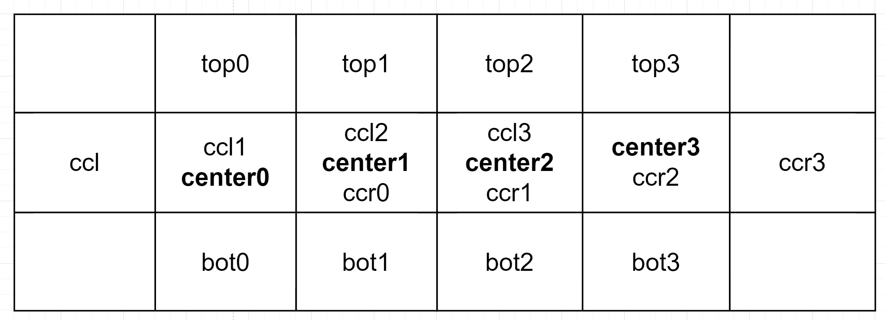
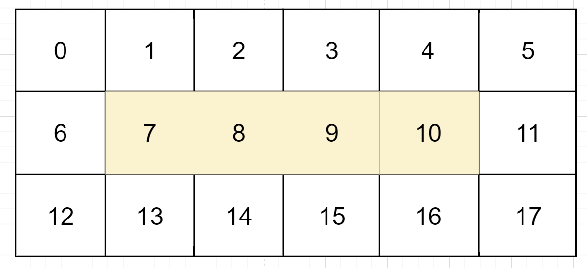
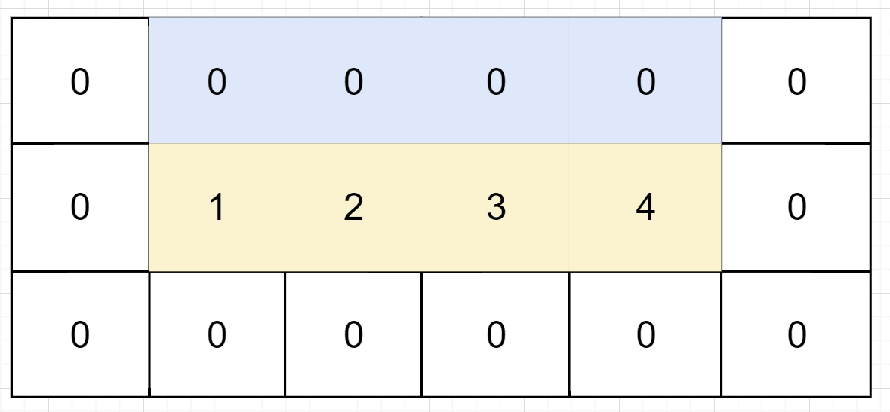
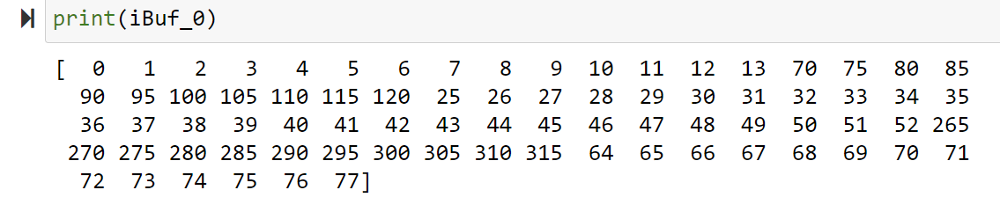

# Lab23 Linebuffer_1

<script type="text/x-mathjax-config">
  MathJax.Hub.Config({
    tex2jax: {
        inlineMath: [ ['$','$'], ["\\(","\\)"] ],
        displayMath: [ ['$$','$$'], ["\\[","\\]"] ],
        processEscapes: false,
    }
  });
</script>
     
<script type="text/javascript"
        src="https://cdn.mathjax.org/mathjax/latest/MathJax.js?config=TeX-AMS-MML_HTMLorMML">
</script>

### Second way of linebuffer

The second way is different from the first way because we can use the data_drive to implement the ```line buffer``` structure. We use the 5-point to compute the Jacobi in this example, as shown below. 
The system view is shown below:

<div align=center></div>

I will explain the functions and parameters so you can understand them better. First, the buffer module aims to select the data corresponding to the location. For example, we need five parts of data from five locations, like the following:

<div align=center></div>

If we want to get the result of the center data, we need to get the top data, center left data, center correct data, and the bot data to compute their addition to get the new center data. We transmit data as a stream to save time reading data from DDR. So we must provide a d,ata buffer channel until we finish the computing. If the matrix size is 3×6, the output data size should be 3×6. Then we will computer the number of the center data, which is four like below. Here, we use ```ccc``` to replace the ```center data``` and ```ccl``` to replace the ```center left data``` and ```ccr``` to replace the ```center right data```.

<div align=center></div>

So the ```top_buffer``` module only contains the first row's data for every three rows of data, and the ```ccl_buffer``` module contains the center-left data for every three rows of data. And the ```ccc_buffer``` ```ccr_buffer``` and ```bot_buffer```modules, respectively, contain the center data, center-right data, and bot data for every three rows of data. The ```data_buffer```contains the data except the center data because the center data will be center-right, and the center data will be replaced 0 temporarily.
The ```corrector``` modules want to move the data from all five locations to the center location so that the ```PE_add``` module can get all the data needed to compute. The ```PE_add``` module contains the new center data; other data will be 0. The ```all_toatl``` module will combine the data, including the center location and the new center data.

For example, if we have the 18 data, which is a 3×6 matrix like below, we want to update the center data (yellow marked) by computing the addition.

<div align=center></div>

From the ```top_buffer``` module, we can get the ```top_data``` like below:

<div align=center></div>

From the ```up_corrector``` module, we can get the ```top_data``` like below:

<div align=center></div>

The other four parts of data can all be obtained by the above way.

Every buffer module contains two functions: copy the data, transfer the input data to the next module, and choose the data from five parts of the location. The buffer module view is shown below:

<div align=center></div>


Every corrector module contains two functions: retaining the data from the ```top``` or ```ccr``` or ```bot``` location and keeping these. data the same as the center data location.

<div align=center></div>

**FIFO_buffer.hpp**
```c++
#ifndef __FIFO_BUFFER__
#define __FIFO_BUFFER__

#include "linebuffer_1.h"

template<int PPC, int width, int ID>
void right_holder(hls::stream<mat> &stream_in,hls::stream<mat> &stream_out)
{
#pragma HLS INTERFACE ap_ctrl_none port=return
#pragma HLS INTERFACE mode=AXIS port=stream_in register_mode=off
#pragma HLS INTERFACE mode=AXIS port=stream_out register_mode=off
#pragma HLS PIPELINE II=1 style=flp
	static bool inite=false;
	static int element_counter=0;
	static int batch_counter=0;
	if(!inite)
	{
		if(!stream_in.empty()){
			inite=true;
		}
		element_counter=0;
		batch_counter=0;
	}
	else
	{
		mat temp;

		if(batch_counter==width-1)
		{
			if(element_counter==PPC-1)
			{
				temp=0;
				stream_out.write(temp);
			}
			else
			{
				temp=stream_in.read();
				stream_out.write(temp);
			}

		}
		else{
			temp=stream_in.read();
			stream_out.write(temp);
		}
		if(element_counter==PPC-1)
		{
			element_counter=0;
			if(batch_counter==width-1)
			{
				batch_counter=0;
			}
			else
			{
				batch_counter++;
			}
		}
		else
		{

			element_counter++;
		}
	}
}

template< int PPC, int width, int ID>
void retain_right(hls::stream<mat> &right_stream,hls::stream<mat> &U_left)
{
#pragma HLS INTERFACE ap_ctrl_none port=return
#pragma HLS INTERFACE mode=AXIS port=right_stream register_mode=off
#pragma HLS INTERFACE mode=AXIS port=U_left register_mode=off
#pragma HLS PIPELINE II=1 style=flp
	static bool inited=false;
    static int element_counter = 0;
    static int batch_counter = 0;
    if(!inited)
    {
    	if(!right_stream.empty())
    	{
    		inited = true;
    	}
    	element_counter=0;
    	batch_counter=0;
    }
    else
    {
    	mat temp;
    	temp=right_stream.read();
    	if(batch_counter==0)
    	{

    	}
    	else
    	{

    		U_left.write(temp);
    	}
    	if(batch_counter==39)
    	{
    		batch_counter=0;
    	}
    	else
    	{
    		batch_counter++;
    	}
    }
}

template<int PPC, int width, int ID>
void ccr_corrector(hls::stream<mat>& stream_in, hls::stream<mat>& stream_out){
#pragma HLS INTERFACE axis register_mode=off port=stream_in
#pragma HLS INTERFACE axis register_mode=off port=stream_out
#pragma HLS INTERFACE ap_ctrl_none port=return


    hls_thread_local hls::stream<mat,total> data_path;

    hls_thread_local hls::task drop(retain_right<PPC, width, ID>, stream_in, data_path);
    hls_thread_local hls::task pad_1(right_holder<PPC, width, ID>, data_path, stream_out);
}


template<int PPC, int width, int ID>
void bot_holder(hls::stream<mat> &stream_in,hls::stream<mat> &stream_out)
{
#pragma HLS INTERFACE ap_ctrl_none port=return
#pragma HLS INTERFACE mode=AXIS port=stream_in register_mode=off
#pragma HLS INTERFACE mode=AXIS port=stream_out register_mode=off
#pragma HLS PIPELINE II=1 style=flp
	static bool inite=false;
	static int element_counter=0;
	static int batch_counter=0;
	if(!inite)
	{
		if(!stream_in.empty()){
			inite=true;
		}
		element_counter=0;
		batch_counter=0;
	}
	else
	{
		mat temp;

		if(batch_counter==width-2)
		{
			temp=stream_in.read();
			stream_out.write(temp);
		}
		else{
			temp=0;
			stream_out.write(temp);
		}
		if(element_counter==PPC-1)
		{
			element_counter=0;
			if(batch_counter==width-1)
			{
				batch_counter=0;
			}
			else
			{
				batch_counter++;
			}
		}
		else
		{
			element_counter++;
		}
	}
}

template< int PPC, int width, int ID>
void retain_bot(hls::stream<mat> &stream_in,hls::stream<mat> &stream_bot)
{
#pragma HLS INTERFACE ap_ctrl_none port=return
#pragma HLS INTERFACE mode=AXIS port=stream_in register_mode=off
#pragma HLS INTERFACE mode=AXIS port=stream_bot register_mode=off
#pragma HLS PIPELINE II=1 style=flp

	static bool inite=false;
	static int counter=0;
	static int row_counter=0;
	if(!inite)
	{
		if(!stream_in.empty())
		{
			inite=true;
		}
	}
	else
	{
		mat temp;
		temp=stream_in.read();
		if(row_counter<width-1)
		{

		}
		else
		{
			stream_bot.write(temp);
		}
		if(counter==PPC-1)
		{
			counter=0;
			if(row_counter==width-1)
			{
				row_counter=0;
			}
			else
			{
				row_counter++;
			}
		}
		else
		{
			counter++;
		}
	}
}
template<int PPC, int width, int ID>
void bot_corrector(hls::stream<mat>& stream_in, hls::stream<mat>& stream_out){
#pragma HLS INTERFACE axis register_mode=off port=stream_in
#pragma HLS INTERFACE axis register_mode=off port=stream_out
#pragma HLS INTERFACE ap_ctrl_none port=return
    hls_thread_local hls::stream<mat,total> data_path;

    hls_thread_local hls::task drop(retain_bot<PPC, width, ID>, stream_in, data_path);
    hls_thread_local hls::task pad_1(bot_holder<PPC, width, ID>, data_path, stream_out);
}

template<int PPC, int width,int ID>
void up_holder(hls::stream<mat> &stream_in,hls::stream<mat> &stream_out)
{
#pragma HLS INTERFACE ap_ctrl_none port=return
#pragma HLS INTERFACE mode=AXIS port=stream_in register_mode=off
#pragma HLS INTERFACE mode=AXIS port=stream_out register_mode=off
#pragma HLS PIPELINE II=1 style=flp
	static bool inite=false;
	static int element_counter=0;
	static int batch_counter=0;
	if(!inite)
	{
		if(!stream_in.empty()){
			inite=true;
		}
		element_counter=0;
		batch_counter=0;
	}
	else
	{
		mat temp;

		if(batch_counter>0&&batch_counter<width-1)
		{
			temp=stream_in.read();
			stream_out.write(temp);
		}
		else{
			temp=0;
			stream_out.write(temp);
		}
		if(element_counter==PPC-1)
		{
			element_counter=0;
			if(batch_counter==width-1)
			{
				batch_counter=0;
			}
			else
			{
				batch_counter++;
			}
		}
		else
		{
			element_counter++;
		}
	}
}

template< int PPC, int width, int ID>
void retain_up(hls::stream<mat> &stream_in,hls::stream<mat> &stream_bot)
{
#pragma HLS INTERFACE ap_ctrl_none port=return
#pragma HLS INTERFACE mode=AXIS port=stream_in register_mode=off
#pragma HLS INTERFACE mode=AXIS port=stream_bot register_mode=off
#pragma HLS PIPELINE II=1 style=flp

	static bool inite=false;
	static int counter=0;
	static int row_counter=0;
	if(!inite)
	{
		if(!stream_in.empty())
		{
			inite=true;
		}
	}
	else
	{
		mat temp;
		temp=stream_in.read();

		if(row_counter==0)
		{
			stream_bot.write(temp);
		}
		else
		{

		}
		if(counter==PPC-1)
		{
			counter=0;
			if(row_counter==width-1)
			{
				row_counter=0;
			}
			else
			{
				row_counter++;
			}
		}
		else
		{
			counter++;
		}
	}
}

template<int PPC, int width, int ID>
void up_corrector(hls::stream<mat>& stream_in, hls::stream<mat>& stream_out){
#pragma HLS INTERFACE axis register_mode=off port=stream_in
#pragma HLS INTERFACE axis register_mode=off port=stream_out
#pragma HLS INTERFACE ap_ctrl_none port=return

    hls_thread_local hls::stream<mat,total> data_path;

    hls_thread_local hls::task drop(retain_up<PPC, width, ID>, stream_in, data_path);
    hls_thread_local hls::task pad_1(up_holder<PPC, width, ID>, data_path, stream_out);

}

template<int ID>
void data_copy(hls::stream<mat> &stream_in,hls::stream<mat> &stream_1,hls::stream<mat> &stream_2)
{
#pragma HLS INTERFACE ap_ctrl_none port=return
#pragma HLS INTERFACE mode=AXIS port=stream_1 register_mode=off
#pragma HLS INTERFACE mode=AXIS port=stream_2 register_mode=off
#pragma HLS PIPELINE II=1 style=flp

	mat temp;
	temp=stream_in.read();
	stream_1.write(temp);
	stream_2.write(temp);

}

template<int ID>
void PE_add(hls::stream<mat> &up_in,hls::stream<mat> &cl_in,hls::stream<mat> &cc_in,
		hls::stream<mat> &cr_in,hls::stream<mat> &b_in,hls::stream<mat> &out)
{
#pragma HLS INTERFACE ap_ctrl_none port=return
#pragma HLS INTERFACE mode=axis port=up_in
#pragma HLS INTERFACE mode=axis port=cl_in
#pragma HLS INTERFACE mode=axis port=cc_in
#pragma HLS INTERFACE mode=axis port=cr_in
#pragma HLS INTERFACE mode=axis port=b_in
#pragma HLS INTERFACE mode=axis port=out
#pragma HLS PIPELINE II=1 style=flp
static	mat up,cl,cc,cr,b;
static	mat sum;

	up=up_in.read();
	cl=cl_in.read();
	cc=cc_in.read();
	cr=cr_in.read();
	b=b_in.read();

	sum=up+cl+cc+cr+b;

	out.write(sum);
}

template<int ID>
void all_total(hls::stream<mat>& stream_in, hls::stream<mat>& stream_in1,hls::stream<mat>& stream_out)
{

#pragma HLS INTERFACE ap_ctrl_none port=return
#pragma HLS INTERFACE mode=axis port=stream_in register_mode=off
#pragma HLS INTERFACE mode=axis port=stream_in1 register_mode=off
#pragma HLS INTERFACE mode=axis port=stream_out register_mode=off
#pragma HLS PIPELINE II=1 style=flp
static	mat add1,add2;
static	mat sum;

	add1=stream_in.read();
	add2=stream_in1.read();

	sum=add1+add2;

	stream_out.write(sum);
}

template<int ID>
void ccl_holder(hls::stream<mat> &stream_in,hls::stream<mat> &stream_out)
{
#pragma HLS INTERFACE ap_ctrl_none port=return
#pragma HLS INTERFACE mode=AXIS port=stream_in register_mode=off
#pragma HLS INTERFACE mode=AXIS port=stream_out register_mode=off
#pragma HLS PIPELINE II=1 style=flp

		static bool inite=false;
		static int counter=0;

		if(!inite)
		{
			if(!stream_in.empty())
			{
				inite=true;
			}
		}
		else
		{
			mat temp;

			if(counter==0)
			{
				temp=0;
				stream_out.write(temp);
			}
			else
			{
				temp=stream_in.read();
				stream_out.write(temp);
			}
			counter++;
		}
}

#endif
```

**module.cpp**
```c++
#include "linebuffer_1.h"

void buffer_top(hls::stream<mat> &stream_in,hls::stream<mat> &stream_up)
{
#pragma HLS INTERFACE ap_ctrl_none port=return
#pragma HLS INTERFACE mode=AXIS port=stream_in register_mode=off
#pragma HLS INTERFACE mode=AXIS port=stream_up register_mode=off
#pragma HLS PIPELINE II=1 style=flp

	static bool inite=false;
	static int counter=0;
	static int row_counter=0;
	if(!inite)
	{
		if(!stream_in.empty())
		{
			inite=true;
		}
	}
	else
	{
		mat temp;
		temp=stream_in.read();
		if(row_counter<HEIGHT-2)
		{
			if(counter==0||counter==WIDTH-1)
			{
				temp=0;
				stream_up.write(temp);
			}
			else
			{
				stream_up.write(temp);
			}


		}
		else
		{
			temp=0;
			stream_up.write(temp);
		}
		if(counter==WIDTH-1)
		{
			counter=0;
			if(row_counter==HEIGHT-1)
			{
				row_counter=0;
			}
			else
			{
				row_counter++;
			}
		}
		else
		{
			counter++;
		}
	}
}


void top_buffer(hls::stream<mat> &stream_in,hls::stream<mat> &stream_R,hls::stream<mat> &stream_top)
{
#pragma HLS INTERFACE ap_ctrl_none port=return
#pragma HLS INTERFACE mode=AXIS port=stream_in register_mode=off
#pragma HLS INTERFACE mode=AXIS port=stream_R register_mode=off
#pragma HLS INTERFACE mode=AXIS port=stream_top register_mode=off

	hls_thread_local hls::stream<mat,total> buffer_up,top,fl,top_data;
	hls_thread_local hls::task	data_0(data_copy<0>,stream_in,buffer_up,stream_R);
	hls_thread_local hls::task  top_1(buffer_top,buffer_up,stream_top);
}

void buffer_ccl(hls::stream<mat> &stream_in,hls::stream<mat> &stream_up)
{
#pragma HLS INTERFACE ap_ctrl_none port=return
#pragma HLS INTERFACE mode=AXIS port=stream_in register_mode=off
#pragma HLS INTERFACE mode=AXIS port=stream_up register_mode=off
#pragma HLS PIPELINE II=1 style=flp

	static bool inite=false;
	static int counter=0;
	static int row_counter=0;
	if(!inite)
	{
		if(!stream_in.empty())
		{
			inite=true;
		}
	}
	else
	{
		mat temp;
		temp=stream_in.read();
		if(row_counter>0&&row_counter<HEIGHT-1)
		{
			if(counter<WIDTH-2)
			{
				stream_up.write(temp);
			}
			else
			{
				temp=0;
				stream_up.write(temp);
			}
		}
		else
		{
			temp=0;
			stream_up.write(temp);
		}
		if(counter==WIDTH-1)
		{
			counter=0;
			if(row_counter==HEIGHT-1)
			{
				row_counter=0;
			}
			else
			{
				row_counter++;
			}
		}
		else
		{
			counter++;
		}
	}
}

void ccl_buffer(hls::stream<mat> &stream_in,hls::stream<mat> &stream_R,hls::stream<mat> &stream_ccc)
{
#pragma HLS INTERFACE ap_ctrl_none port=return
#pragma HLS INTERFACE mode=AXIS port=stream_in register_mode=off
#pragma HLS INTERFACE mode=AXIS port=stream_R register_mode=off
#pragma HLS INTERFACE mode=AXIS port=stream_ccc register_mode=off

	hls_thread_local hls::stream<mat,total> ccl,ccl_choose;

	hls_thread_local hls::task	data_1(data_copy<1>,stream_in,ccl,stream_R);
	hls_thread_local hls::task	data_ccc(buffer_ccl,ccl,ccl_choose);
	hls_thread_local hls::task	ccl_1(ccl_holder<0>,ccl_choose,stream_ccc);
}

void buffer_ccc(hls::stream<mat> &stream_in,hls::stream<mat> &stream_up)
{
#pragma HLS INTERFACE ap_ctrl_none port=return
#pragma HLS INTERFACE mode=AXIS port=stream_in register_mode=off
#pragma HLS INTERFACE mode=AXIS port=stream_up register_mode=off
#pragma HLS PIPELINE II=1 style=flp

	static bool inite=false;
	static int counter=0;
	static int row_counter=0;
	if(!inite)
	{
		if(!stream_in.empty())
		{
			inite=true;
		}
	}
	else
	{
		mat temp;
		temp=stream_in.read();
		if(row_counter>0&&row_counter<HEIGHT-1)
		{
			if(counter>0&&counter<WIDTH-1)
			{
				stream_up.write(temp);
			}
			else
			{
				temp=0;
				stream_up.write(temp);
			}
		}
		else
		{
			temp=0;
			stream_up.write(temp);
		}
		if(counter==WIDTH-1)
		{
			counter=0;
			if(row_counter==HEIGHT-1)
			{
				row_counter=0;
			}
			else
			{
				row_counter++;
			}
		}
		else
		{
			counter++;
		}
	}
}

void ccc_buffer(hls::stream<mat> &stream_in,hls::stream<mat> &stream_R,hls::stream<mat> &stream_ccc)
{
#pragma HLS INTERFACE ap_ctrl_none port=return
#pragma HLS INTERFACE mode=AXIS port=stream_in register_mode=off
#pragma HLS INTERFACE mode=AXIS port=stream_R register_mode=off
#pragma HLS INTERFACE mode=AXIS port=stream_ccc register_mode=off


	hls_thread_local hls::stream<mat,total> ccc_data;

	hls_thread_local hls::task	data_2(data_copy<2>,stream_in,ccc_data,stream_R);
	hls_thread_local hls::task	data_ccc(buffer_ccc,ccc_data,stream_ccc);

}


void buffer_ccr(hls::stream<mat> &stream_in,hls::stream<mat> &stream_up)
{
#pragma HLS INTERFACE ap_ctrl_none port=return
#pragma HLS INTERFACE mode=AXIS port=stream_in register_mode=off
#pragma HLS INTERFACE mode=AXIS port=stream_up register_mode=off
#pragma HLS PIPELINE II=1 style=flp

	static bool inite=false;
	static int counter=0;
	static int row_counter=0;
	if(!inite)
	{
		if(!stream_in.empty())
		{
			inite=true;
		}
	}
	else
	{
		mat temp;
		temp=stream_in.read();
		if(row_counter>0&&row_counter<HEIGHT-1)
		{
			if(counter>1)
			{
				stream_up.write(temp);
			}
			else
			{
				temp=0;
				stream_up.write(temp);
			}
		}
		else
		{
			temp=0;
			stream_up.write(temp);
		}
		if(counter==WIDTH-1)
		{
			counter=0;
			if(row_counter==HEIGHT-1)
			{
				row_counter=0;
			}
			else
			{
				row_counter++;
			}
		}
		else
		{
			counter++;
		}
	}
}

void ccr_buffer(hls::stream<mat> &stream_in,hls::stream<mat> &stream_R,hls::stream<mat> &stream_ccr)
{
#pragma HLS INTERFACE ap_ctrl_none port=return
#pragma HLS INTERFACE mode=AXIS port=stream_in register_mode=off
#pragma HLS INTERFACE mode=AXIS port=stream_R register_mode=off
#pragma HLS INTERFACE mode=AXIS port=stream_ccr register_mode=off

	hls_thread_local hls::stream<mat,total> ccr;

	hls_thread_local hls::task	data_3(data_copy<3>,stream_in,ccr,stream_R);
	hls_thread_local hls::task	data_ccr(buffer_ccr,ccr,stream_ccr);

}

void buffer_bot(hls::stream<mat> &stream_in,hls::stream<mat> &stream_up)
{
#pragma HLS INTERFACE ap_ctrl_none port=return
#pragma HLS INTERFACE mode=AXIS port=stream_in register_mode=off
#pragma HLS INTERFACE mode=AXIS port=stream_up register_mode=off
#pragma HLS PIPELINE II=1 style=flp

	static bool inite=false;
	static int counter=0;
	static int row_counter=0;
	if(!inite)
	{
		if(!stream_in.empty())
		{
			inite=true;
		}
	}
	else
	{
		mat temp;
		temp=stream_in.read();
		if(row_counter>1)
		{
			if(counter==0||counter==WIDTH-1)
			{
				temp=0;
				stream_up.write(temp);
			}
			else
			{
				stream_up.write(temp);
			}
		}
		else
		{
			temp=0;
			stream_up.write(temp);
		}
		if(counter==WIDTH-1)
		{
			counter=0;
			if(row_counter==HEIGHT-1)
			{
				row_counter=0;
			}
			else
			{
				row_counter++;
			}
		}
		else
		{
			counter++;
		}
	}
}

void bot_buffer(hls::stream<mat> &stream_in,hls::stream<mat> &stream_R,hls::stream<mat> &stream_bot)
{
#pragma HLS INTERFACE ap_ctrl_none port=return
#pragma HLS INTERFACE mode=AXIS port=stream_in register_mode=off
#pragma HLS INTERFACE mode=AXIS port=stream_R register_mode=off
#pragma HLS INTERFACE mode=AXIS port=stream_bot register_mode=off

	hls_thread_local hls::stream<mat,total> bot,fl;

	hls_thread_local hls::task	data_4(data_copy<4>,stream_in,bot,stream_R);
	hls_thread_local hls::task  bot_data(buffer_bot,bot,stream_bot);
}

void data_buffer(hls::stream<mat> &stream_in,hls::stream<mat> &stream_up)
{
#pragma HLS INTERFACE ap_ctrl_none port=return
#pragma HLS INTERFACE mode=AXIS port=stream_in register_mode=off
#pragma HLS INTERFACE mode=AXIS port=stream_up register_mode=off
#pragma HLS PIPELINE II=1 style=flp

	static bool inite=false;
	static int counter=0;
	static int row_counter=0;
	if(!inite)
	{
		if(!stream_in.empty())
		{
			inite=true;
		}
	}
	else
	{
		mat temp;
		temp=stream_in.read();
		if(row_counter>0&&row_counter<HEIGHT-1)
		{
			if(counter==0||counter==WIDTH-1)
			{
				stream_up.write(temp);
			}
			else
			{
				temp=0;
				stream_up.write(temp);
			}
		}
		else
		{
			stream_up.write(temp);
		}
		if(counter==WIDTH-1)
		{
			counter=0;
			if(row_counter==HEIGHT-1)
			{
				row_counter=0;
			}
			else
			{
				row_counter++;
			}
		}
		else
		{
			counter++;
		}
	}
}
```

**linebuffer_1.h**
```c++
#include <stdio.h>
#include <assert.h>
#include <ap_fixed.h>
#include "hls_task.h"
#include "hls_stream.h"
#include "FIFO_buffer.hpp"
#include <ap_axi_sdata.h>

#ifndef __LINEBUFFER_1__
#define __LINEBUFFER_1__

#define WIDTH 13
#define HEIGHT 3
#define total 52
typedef int mat;
typedef hls::stream<mat> Mat_stream;
typedef hls::axis<mat,0,0,0> F_mat;
typedef hls::stream<F_mat> F_stream;

void linebuffer_data_driven(hls::stream<mat> &stream_in,hls::stream<mat> &stream_out);

void buffer_up(hls::stream<mat> &stream_in,hls::stream<mat> &stream_up);
void top_buffer(hls::stream<mat> &stream_in,hls::stream<mat> &stream_R,hls::stream<mat> &stream_top);


void buffer_ccl(hls::stream<mat> &stream_in,hls::stream<mat> &stream_up);
void ccl_buffer(hls::stream<mat> &stream_in,hls::stream<mat> &stream_R,hls::stream<mat> &stream_ccc);

void buffer_ccc(hls::stream<mat> &stream_in,hls::stream<mat> &stream_up);
void ccc_buffer(hls::stream<mat> &stream_in,hls::stream<mat> &stream_R,hls::stream<mat> &stream_ccc);

void buffer_ccr(hls::stream<mat> &stream_in,hls::stream<mat> &stream_up);
void ccr_buffer(hls::stream<mat> &stream_in,hls::stream<mat> &stream_R,hls::stream<mat> &stream_ccc);

void buffer_bot(hls::stream<mat> &stream_in,hls::stream<mat> &stream_up);
void bot_buffer(hls::stream<mat> &stream_in,hls::stream<mat> &stream_R,hls::stream<mat> &stream_top);

void cr_buffer(hls::stream<mat> &stream_in,hls::stream<mat> &stream_up);
void data_buffer(hls::stream<mat> &stream_in,hls::stream<mat> &stream_up);


#endif
```

**linebuffer_2.cpp**
```c++
#include "linebuffer_1.h"

void linebuffer_data_driven(hls::stream<mat> &stream_in,hls::stream<mat> &stream_out)
{
#pragma HLS INTERFACE ap_ctrl_none port=return
#pragma HLS INTERFACE mode=AXIS port=stream_in register_mode=off
#pragma HLS INTERFACE mode=AXIS port=stream_out register_mode=off

	hls_thread_local hls::stream<mat,total> top_r,top_data,ccl_r,add_data1,ccc_r,ccr_r,ccr_data,bot_r,bot_data;
	hls_thread_local hls::stream<mat,total> cr_buffer,b_buffer,t_buffer,ccc_data,ccl_data,data_other,add_buffer;

	hls_thread_local hls::task	top(top_buffer,stream_in,top_r,top_data);
	hls_thread_local hls::task	t(up_corrector<WIDTH,HEIGHT,0>,top_data,t_buffer);///cr

	hls_thread_local hls::task	ccl(ccl_buffer,top_r,ccl_r,ccl_data);

	hls_thread_local hls::task	ccc(ccc_buffer,ccl_r,ccc_r,ccc_data);

	hls_thread_local hls::task	ccr(ccr_buffer,ccc_r,ccr_r,ccr_data);
	hls_thread_local hls::task	cr(ccr_corrector<WIDTH,HEIGHT,0>,ccr_data,cr_buffer);///cr

	hls_thread_local hls::task	bot(bot_buffer,ccr_r,bot_r,bot_data);
	hls_thread_local hls::task	b(bot_corrector<WIDTH,HEIGHT,0>,bot_data,b_buffer);//bot

	hls_thread_local hls::task      add(PE_add<6>,t_buffer,ccl_data,ccc_data,cr_buffer,b_buffer,add_buffer);
	hls_thread_local hls::task	data_around(data_buffer,bot_r,data_other);

	hls_thread_local hls::task	all_total_sum(all_total<0>,add_buffer,data_other,stream_out);//bot

}
```
The synthesis report is shown below:

<div align=center></div>

**linebuffer_1_tb.cpp**
```c++
#include "linebuffer_1.h"

int main()
{

	mat outdata;
	mat outdata1;
	hls::stream <mat,total> in;
	hls::stream <mat,total> out,out1;
	for(int i=0;i<78;i++)
	{
		in.write(i+1);
	}
	linebuffer_data_driven(in,out1);
	for(int i=0;i<78;i++)
	{
		{
			outdata1=out1.read();
			printf("outdata1 is %d\r\n",outdata1);
		}
	}
}
```


#### Create the Vivado project

The configure block design can use reference materials [here](https://uri-nextlab.github.io/ParallelProgammingLabs/HLS_Labs/Lab1.html#implementation). We also need to choose the number of the DMA according to the number of the interface.

<div align=center></div>

#### Run synthesis,  Implementation, and generate bitstream

It may show some errors about I/O Ports; please fix them.

#### Download the bitstream file to PYNQ

<div align=center></div>


```python
from pynq import Overlay
from pynq import allocate
import numpy as np
hw = Overlay('design_1.bit')
s2mm = hw.axi_dma_0.sendchannel
mm2s = hw.axi_dma_0.recvchannel
N = 78
oBuf_0 = allocate(shape=(N,), dtype = np.int32)
iBuf_0 = allocate(shape=(N,), dtype = np.int32)
for i in range(N):
    oBuf_0[i]= i

s2mm.transfer(oBuf_0)
mm2s.transfer(iBuf_0)
s2mm.wait()
mm2s.wait()
```

We will see:

<div align=center></div>

## Demonstrate

Please finish the example in a data-driven way and implement it on the PYNQ-Z2 board.
