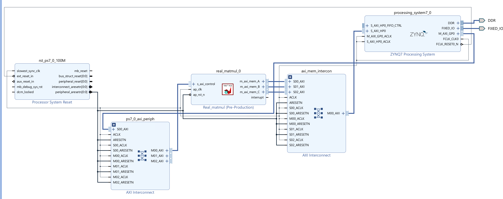
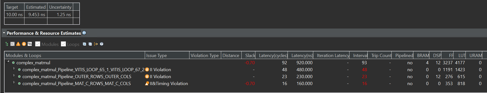

# Lab24 Real and complex matrix multiplication

<script type="text/x-mathjax-config">
  MathJax.Hub.Config({
    tex2jax: {
        inlineMath: [ ['$','$'], ["\\(","\\)"] ],
        displayMath: [ ['$$','$$'], ["\\[","\\]"] ],
        processEscapes: false,
    }
  });
</script>
     
<script type="text/javascript"
        src="https://cdn.mathjax.org/mathjax/latest/MathJax.js?config=TeX-AMS-MML_HTMLorMML">
</script>

## Instructions

The goal of this lab is to design accelerators for matrix multiplication. There are two parts to this lab:
- In Part A, you will optimize an existing implementation of matrix multiplication with actual values. 
- In Part B, you will implement and optimize matrix multiplication with complex values. 

In either part, we will multiply a 100 × 200 matrix with a 200 × 300 matrix to get a 100 × 300 matrix product and accelerate the design for the Pynq-Z2 board.

### Part A: Real Matrix Multiplication

Matrix multiplication is at the heart of all deep learning applications and has a high scope for parallelism. Compared to a trivial implementation, the amount of parallelism you can exploit is constrained by the hardware resources and how well your code is optimized.

**Reference Material**: Ryan Kastner et al., [Parallel Programming for FPGAs](https://github.com/KastnerRG/pp4fpgas/raw/gh-pages/main.pdf), Chapter 7.

This Lab aims to design an accelerator for matrix multiplication. In the base implementation shown below, the dimension n of matrix A is M x N (100 x 200), and that of matrix B is (N x K) 200 x 300. 

**real.h**
```c++
#ifndef __REAL_H__
#define __REAL_H__

#include <stdio.h>
#include <stdlib.h>

#include <ap_int.h>

typedef ap_fixed<32, 10> FIX_TYPE;

#define M 100
#define N 200
#define K 300
#define D 25
#define W 10

void real_matmul( 
    FIX_TYPE MatA_DRAM[M][N], 
    FIX_TYPE MatB_DRAM[N][K], 
    FIX_TYPE MatC_DRAM[M][K]
);

#endif
```
**real_matmul.cpp**
```c++
#include "real.h"

void real_matmul( 
    FIX_TYPE MatA_DRAM[M][N], 
    FIX_TYPE MatB_DRAM[N][K], 
    FIX_TYPE MatC_DRAM[M][K])
{
#pragma HLS interface m_axi depth=1 port=MatA_DRAM offset=slave bundle=mem
#pragma HLS interface m_axi depth=1 port=MatB_DRAM offset=slave bundle=mem
#pragma HLS interface m_axi depth=1 port=MatC_DRAM offset=slave bundle=mem

#pragma HLS interface s_axilite port=return
    
    FIX_TYPE MatA[M][N];
    FIX_TYPE MatB[N][K];
    FIX_TYPE MatC[M][K];

    // Read in the data (Matrix A) from DRAM to BRAM
    MAT_A_ROWS:
    for(int i = 0; i < M; i++) {
        MAT_A_COLS:
        for(int j = 0; j < N; j++) {
            MatA[i][j] = MatA_DRAM[i][j];
        }
    }

    // Read in the data (Matrix B) from DRAM to BRAM
    MAT_B_ROWS:
    for(int i = 0; i < N; i++) {
        MAT_B_COLS:
        for(int j = 0; j < K; j++) {
            MatB[i][j] = MatB_DRAM[i][j];
        }
    }

    // Initialize product matrix C
    MAT_C_ROWS_INIT:
    for(int i = 0; i < M; i++) {
        MAT_C_COLS_INIT:
        for(int j = 0; j < K; j++) {
            MatC[i][j] = 0;
        }
    }

    // Perform matrix multiplication 
    OUTER_ROWS:
    for(int i = 0; i < M; i++) {
        OUTER_COLS:
        for(int j = 0; j < K; j++) {
            
            INNER_ROW_COL:
            for(int p = 0; p < N; p++) {
                MatC[i][j] += MatA[i][p] * MatB[p][j];
            }

        }
    }

    // Write back the data from BRAM to DRAM
    MAT_C_ROWS:
    for(int i = 0; i < M; i++) {
        MAT_C_COLS:
        for(int j = 0; j < K; j++) {
            MatC_DRAM[i][j] = MatC[i][j];
        }
    }

}
```

The latency and resource utilization for the base implementation are:

<div align=center></div>


#### Acceleration Techniques

* Loop Tiling: Loop reordering allows unrolling the innermost loop, provided matrices A, B, and C are partitioned. However, due to the large size of the matrices, partitioning and unrolling causes scalability issues. Hence, the loop tiling technique achieves parallelism within smaller tiles. Matrices A, B, and C are partially and cyclically partitioned based on the dimension of the tile, as shown below:

<div align=center></div>

The loop tiling technique helps speed up D x W (D = depth, W = width of the tile). For example, when D = 25 and W = 10, the number of cycles for matrix multiplication is reduced to 24004 from 6000004, thus giving a 250x speedup for Matrix multiplication. But the resource has been consumed more than before, like DSP.

<div align=center></div>

* Loop Fusion: In the above, it can be observed that computation is no longer a bottleneck. The read/write operations from DRAM to BRAM take 85% of the cycles, while actual computation takes 15%. This is because loading matrices A and B and initializing matrix C happens sequentially. Different DRAM ports can be used for all three matrices to allow parallel access
and loop fusion can be applied to reduce the DRAM to BRAM transfer latency.

**loop_fusion**
```c++
 int max_m_n = ((M >= N) ? M : N);
    int max_n_k = ((N >= K) ? N : K);
    for(int i = 0; i < max_m_n; i++)
    {
        for(int j = 0; j < max_n_k; j++)
        {
            if((i < M) && (j < N))
            {
                MatA[i][j] = MatA_DRAM[i][j];
            }

            if((i < N) && (j < K))
            {
                MatB[i][j] = MatB_DRAM[i][j];
            }

            if((i < M) && (j < K))
            {
                MatC[i][j] = 0;
            }
        }
    }
```
From the below, it can be observed that loop fusion leads to a further reduction of 50,030 cycles.

<div align=center></div>

The final design achieves parallelism in tiles of D = 25 and W = 10. The performance and utilization estimates can be seen above.
The latency of the optimized design is 114044. Thus, an overall speedup of 55.94 (6380037/114044) is gained compared to the base implementation.

While tiling helps in achieving a speedup of D x W for matrix multiplication, it can be observed that after a point, increasing D and W does not result in a high speed-up as memory becomes a bottleneck. Even after loop fusion, about 78.9% of the cycles
(90,023 cycles) are spent loading and storing data from DRAM to BRAM, whereas only 21.06% of cycles (24004 cycles) are spent in the actual computation. Thus, further optimization techniques such as data streaming can be applied to reduce the memory overhead – i.e., begin computation as soon as the first few elements of A and B are available instead of waiting for all elements of A and B to be loaded in BRAM.

Secondly, in the current design, fanout is high as D elements from matrix A are multiplied with W elements in matrix B, which can be improved.

Finally, for an M x K matrix, D and W must be factors of M and K, respectively, to maintain functional correctness. Thus, there is a lot of constraint in the incremental step size of D and W. Moreover, if M and K are not factorizable, tiling becomes slightly complicated.

However, the PYNQ-Z2 board has many hardware resources, so this optimization cannot be implemented on the PYNQ-Z2 board.

We can use another example to implement it on the PYNQ-Z2 board, as shown below.

**real. h**
```c++
#ifndef __REAL_H__
#define __REAL_H__

#include <stdio.h>
#include <stdlib.h>

#include <ap_int.h>

//typedef int real_t;
typedef ap_int<16> real_t;

#define M 100
#define N 150
#define K 200

void real_matmul(
    real_t MatA_DRAM[M][N],
    real_t MatB_DRAM[N][K],
    real_t MatC_DRAM[M][K]
);

#endif
```

**real_matmul.cpp**
```c++
#include "real.h"

void real_matmul(
    real_t MatA_DRAM[M][N],
    real_t MatB_DRAM[N][K],
    real_t MatC_DRAM[M][K])
{
#pragma HLS interface m_axi depth=1 port=MatA_DRAM offset=slave bundle=mem_A
#pragma HLS interface m_axi depth=1 port=MatB_DRAM offset=slave bundle=mem_B
#pragma HLS interface m_axi depth=1 port=MatC_DRAM offset=slave bundle=mem_C

#pragma HLS interface s_axilite port=return

    real_t MatA[M][N];
    real_t MatB[N][K];
    real_t MatC[M][K];

#pragma HLS ARRAY_PARTITION variable=MatA type=cyclic factor=50 dim=1
#pragma HLS ARRAY_PARTITION variable=MatB type=block factor=50 dim=1
#pragma HLS ARRAY_PARTITION variable=MatC type=cyclic factor=50  dim=1

    // Read in the data (Matrix A) from DRAM to BRAM
    MAT_A_ROWS:
    for(int i = 0; i < M; i++) {
        MAT_A_COLS:
        for(int j = 0; j < N; j++) {
            MatA[i][j] = MatA_DRAM[i][j];
        }
    }

    // Read in the data (Matrix B) from DRAM to BRAM
    MAT_B_ROWS:
    for(int i = 0; i < N; i++) {
        MAT_B_COLS:
        for(int j = 0; j < K; j++) {
            MatB[i][j] = MatB_DRAM[i][j];
        }
    }

    // Initialize product matrix C
    MAT_C_ROWS_INIT:
    for(int i = 0; i < M; i++) {
        MAT_C_COLS_INIT:
        for(int j = 0; j < K; j++) {
            MatC[i][j] = 0;
        }
    }

    // Perform matrix multiplication
    OUTER_ROWS:
	   for(int i = 0; i < M; i++) {
	        for(int j = 0; j < K; j++) {
#pragma HLS PIPELINE II=1
	            for(int p = 0; p < N; p++) {
//	            	#pragma HLS PIPELINE II=1
	                MatC[i][j] += MatA[i][p] * MatB[p][j];
	            }
	        }
	    }

    // Write back the data from BRAM to DRAM
    MAT_C_ROWS:
    for(int i = 0; i < M; i++) {
        MAT_C_COLS:
        for(int j = 0; j < K; j++) {
            MatC_DRAM[i][j] = MatC[i][j];
        }
    }
}
```

The synthesis report is shown below:

<div align=center></div>

Though there is slack, the ```Estimated``` of the ```Timing Estimate``` is less than ten ns, so we can have a try by implementing it on the board. And eventually, we made it.

**real_tb.cpp**
```c++
#include "real.h"

int main()
{
    // Declare matrices
	FIX_TYPE MatA_tb[M][N];
	FIX_TYPE MatB_tb[N][K];
	FIX_TYPE MatC_tb[M][K];
	FIX_TYPE MatC_expected[M][K];

    // Generate Matrix A with random values
    for(int i = 0; i < M; i++) {
        for(int j = 0; j < N; j++) {
            MatA_tb[i][j] = 1;
        }
    }

    // Generate Matrix B with random values
    for(int i = 0; i < N; i++) {
        for(int j = 0; j < K; j++) {
            MatB_tb[i][j] = 1;
        }
    }

    // Initialize Matrix C
    for(int i = 0; i < M; i++) {
        for(int j = 0; j < K; j++) {
            MatC_tb[i][j] = 0;
        }
    }

    // Call DUT
    real_matmul(MatA_tb,MatB_tb,MatC_tb);

    // Expected value for Matrix C
    // To make sure your optimizations do not change the functionality
    for(int i = 0; i < M; i++) {
        for(int j = 0; j < K; j++) {

            MatC_expected[i][j] = 0;
            for(int p = 0; p < N; p++) {
                MatC_expected[i][j] += MatA_tb[i][p]*MatB_tb[p][j];
            }

        }
    }

    // Verify functional correctness before synthesizing
    int passed = 1;
    for(int i = 0; i < M; i++) {
        for(int j = 0; j < K; j++) {
//        	printf("result is %d",MatC_expected[i][j]);
            if(MatC_tb[i][j] != MatC_expected[i][j]) {
                printf("Mismatch at MatC[%d][%d]: Expected: %hi \t Actual: %hi\n",
                        i, j, MatC_expected[i][j], MatC_tb[i][j]);
                passed = 0;
            }
        }
    }

    if(passed) {
        printf("-----------------------------------\n");
        printf("|         TEST PASSED!            |\n");
        printf("-----------------------------------\n");
    }
    else {
        printf("-----------------------------------\n");
        printf("|         TEST FAILED :(          |\n");
        printf("-----------------------------------\n");
    }
    return 0;
}
```
If you see the "TEST PASSED!" after the C simulation, the function ```real_matmul``` is correct.


#### Create the Vivado project

The configure block design can use reference materials [here](https://uri-nextlab.github.io/ParallelProgammingLabs/HLS_Labs/Lab1.html#implementation). We also need to choose the number of the DMA according to the number of the interface.

<div align=center></div>

#### Run synthesis,  Implementation, and generate bitstream

It may show some errors about I/O Ports; please fix them.

#### Download the bitstream file to PYNQ

<div align=center></div>


```python
from pynq import (allocate, Overlay)
import numpy as np
import pynq
ol = Overlay('design_1.bit')

top_ip = ol.real_matmul_0
top_ip.signature

a_buffer = pynq.allocate((100,150), np.int16)
b_buffer = pynq.allocate((150,200), np.int16)
sum_buffer = pynq.allocate((100,200), np.int16)

# initialize input
for i in range (0, 100):
    for j in range(0,150):
        a_buffer[i][j] = 1
for i in range (0, 150):
    for j in range(0,200):
        b_buffer[i][j] = 1 

aptr = a_buffer.physical_address
bptr = b_buffer.physical_address
sumptr = sum_buffer.physical_address

top_ip.write(0x10, aptr)
top_ip.write(0x1c, bptr)
top_ip.write(0x28, sumptr)
top_ip.write(0x00, 1)
```

We will see:

<div align=center></div>

### Part B: Complex Matrix Multiplication

Many applications in scientific computing and signal processing require working with the magnitude and phase. This information is aptly captured using complex numbers. Let's build on Part A and develop an accelerator to perform matrix multiplication with complex numbers.

**Reference Material**: [Complex Matrix Multiplication](https://mathworld.wolfram.com/ComplexMatrix.html)

**complex_2.h**
```c++
#ifndef __COMPLEX_2_H__
#define __COMPLEX_2_H__

#include <iostream>
#include <fstream>
#include <stdio.h>
#include <stdlib.h>

#include <ap_int.h>

typedef ap_int<16> int_t;

typedef struct re_im {
    int_t real;
    int_t imag;
} re_im;

#define M 2
#define N 3
#define K 2

#define M1 100
#define N1 150
#define K1 200

void complex_matmul (
		re_im MatA_DRAM[M][N],
		re_im MatB_DRAM[N][K],
		re_im MatC_DRAM[M][K]
);

using namespace std;

#endif
```

**complex_matmul.cpp**
```c++
#include "complex_2.h"

void complex_matmul(
		re_im MatA_DRAM[M][N],
		re_im MatB_DRAM[N][K],
		re_im MatC_DRAM[M][K]
)
{

#pragma HLS interface m_axi depth=1 port=MatA_DRAM offset=slave bundle=mem
#pragma HLS interface m_axi depth=1 port=MatB_DRAM offset=slave bundle=mem
#pragma HLS interface m_axi depth=1 port=MatC_DRAM offset=slave bundle=mem
#pragma HLS interface s_axilite port=return
	re_im MatA[M][N];
	re_im MatB[N][K];
    re_im MatC[M][K];


#pragma HLS ARRAY_PARTITION variable=MatA type=cyclic dim=1 factor=5
#pragma HLS ARRAY_PARTITION variable=MatB type=block dim=1 factor=5
#pragma HLS ARRAY_PARTITION variable=MatC type=cyclic dim=1 factor=5

	  // Read in the data (Matrix A) from DRAM to BRAM
	    MAT_A_ROWS:
	    for(int i = 0; i < M; i++) {
	        MAT_A_COLS:
	        for(int j = 0; j < N; j++) {
	            MatA[i][j].real = MatA_DRAM[i][j].real;
	            MatA[i][j].imag = MatA_DRAM[i][j].imag;
	        }
	    }

	    // Read in the data (Matrix B) from DRAM to BRAM
	    MAT_B_ROWS:
	    for(int i = 0; i < N; i++) {
	        MAT_B_COLS:
	        for(int j = 0; j < K; j++) {
	            MatB[i][j].real = MatB_DRAM[i][j].real;
	            MatB[i][j].imag = MatB_DRAM[i][j].imag;
	        }
	    }

	    // Initialize product matrix C
	    MAT_C_ROWS_INIT:
	    for(int i = 0; i < M; i++) {
	        MAT_C_COLS_INIT:
	        for(int j = 0; j < K; j++) {
	            MatC[i][j].real = 0;
	            MatC[i][j].imag = 0;
	        }
	    }

	    // Perform matrix multiplication
	    OUTER_ROWS:
	    for(int i = 0; i < M; i++) {
	        OUTER_COLS:
	        for(int j = 0; j < K; j++) {
//	#pragma HLS PIPELINE II=1
	            INNER_ROW_COL:
	            for(int p = 0; p < N; p++) {
	                MatC[i][j].real += MatA[i][p].real * MatB[p][j].real-MatA[i][p].imag * MatB[p][j].imag;
	                MatC[i][j].imag += MatA[i][p].real * MatB[p][j].imag+MatA[i][p].imag * MatB[p][j].real;
	            }

	        }
	    }

	    // Write back the data from BRAM to DRAM
	    MAT_C_ROWS:
	    for(int i = 0; i < M; i++) {
	        MAT_C_COLS:
	        for(int j = 0; j < K; j++) {
	            MatC_DRAM[i][j].real = MatC[i][j].real;
	            MatC_DRAM[i][j].imag = MatC[i][j].imag;
	        }
	    }
}
```

The synthesis report is shown below:

<div align=center></div>


**complex_tb.cpp**
```c++
#include "complex_2.h"

re_im MatA_tb[M][N];
re_im MatB_tb[N][K];
re_im MatC_tb[M][K];
re_im MatC_expected[M][K];

void loadMatrix(string filename, int numRows, int numCols)
{
	re_im Mat_tb[numRows][numCols];

    int i = 0, j = 0, t = 0;
    int_t real, imag;

    std::ifstream Mat(filename);

    while(Mat >> real >> imag)
    {
        i = t / numCols;
        j = t % numCols;
        
        if(filename == "MatA_test.txt")
        {
            MatA_tb[i][j].real = real;
            MatA_tb[i][j].imag = imag;
        }
        else if(filename == "MatB_test.txt")
        {
            MatB_tb[i][j].real = real;
            MatB_tb[i][j].imag = imag;
        }
        else
        {
            MatC_expected[i][j].real = real;
            MatC_expected[i][j].imag = imag;
        }
        
        t++;
    }
}

int main()
{
    int_t real, imag; 
    int i, j, t;
    
    // Load input matrices and expected output matrix
    loadMatrix("MatA_test.txt", M1, N1);
    loadMatrix("MatB_test.txt", N1, K1);

    // Uncomment for debugging
    printf("A[0][0] = %d + %dj\n", MatA_tb[0][0].real, MatA_tb[0][0].imag);


    // Call DUT
    complex_matmul(MatA_tb, MatB_tb, MatC_tb);

    // Verify funtional correctness
    int passed = 1;
    for(int i = 0; i < M; i++) 
    {
        for(int j = 0; j < K; j++) 
        {
            
            printf(" Actual: (%hi + %hij)\n", i, j,  MatC_tb[i][j].real, MatC_tb[i][j].imag);
            
        }
    }


    return 0;
}
```

**MatA_test.txt**
```
4 3
4 3
5 4
6 5
4 3
6 5
```
**MatB_test.txt**
```
3 4
5 6
4 5
1 2
1 2
1 2
```
The simulation result is shown below:

<div align=center></div>

#### Create the Vivado project

The configure block design can use reference materials [here](https://uri-nextlab.github.io/ParallelProgammingLabs/HLS_Labs/Lab1.html). And we need to choose the number of the DMA according to the number of the interface.

<div align=center></div>

#### Run synthesis,  Implementation, and generate bitstream

It may show some errors about I/O Ports, and please fix them.

#### Download the bitstream file to PYNQ

<div align=center></div>


```python
from pynq import (allocate, Overlay)
import numpy as np
import pynq
ol = Overlay('design_1.bit')

top_ip = ol.complex_matmul_0
top_ip.signature

a_buffer = pynq.allocate((2,3), np.int32)
b_buffer = pynq.allocate((3,2), np.int32)
sum_buffer = pynq.allocate((2,2), np.int32)
# initialize input

import numpy as np  # Using NumPy for efficient array handling

# Choose a method to represent the re_im structure (e.g., namedtuple):
from collections import namedtuple
ReIm = namedtuple("ReIm", ["real", "imag"])

def load_matrix(filename, num_rows, num_cols):
    """Loads a matrix from a file into a NumPy array of ReIm structures."""

    # Initialize a NumPy array with the appropriate dimensions and dtype:
    Mat_tb = np.empty((num_rows, num_cols), dtype=ReIm)

    t = 0
    with open(filename, "r") as Mat:
        for line in Mat:
            try:
                real, imag = map(int, line.split())  # Convert to floats
            except ValueError:
                print(f"Invalid data format in line {t + 1}: {line.strip()}")
                continue  # Skip invalid lines

            i = t // num_cols
            j = t % num_cols

            # Assign values to the NumPy array:
            Mat_tb[i][j] = ReIm(real, imag)

            t += 1

    return Mat_tb  # Return the loaded matrix


MatA = load_matrix("MatB_test.txt", 6, 1)  # 6 rows, 1 columns
MatB = load_matrix("MatA_test.txt",6,1)

real_A={}
imag_A={}
for i in range(6):
    for j in range(1):
        real_A[i]=MatA[i][j].real
        imag_A[i]=MatA[i][j].imag  

real_B={}
imag_B={}
for i in range(6):
    for j in range(1):
        real_B[i]=MatB[i][j].real
        imag_B[i]=MatB[i][j].imag  

# initialize input
for i in range (0, 2):
    for j in range(0,3):
        a_buffer[i][j] = real_A[i*3+j]<<16
        a_buffer[i][j] += imag_A[i*3+j]
        # initialize input
for i in range (0, 3):
    for j in range(0,2):
        b_buffer[i][j] = real_B[i*2+j]<<16
        b_buffer[i][j] += imag_B[i*2+j]

aptr = a_buffer.physical_address
bptr = b_buffer.physical_address
sumptr = sum_buffer.physical_address


top_ip.write(0x10, aptr)
top_ip.write(0x1c, bptr)
top_ip.write(0x28, sumptr)
top_ip.write(0x00, 1)
```

We will see:

<div align=center></div>

## Demonstrate

Please finish the ```real_matrix multiplication``` example and implement it on the PYNQ-Z2 board.
