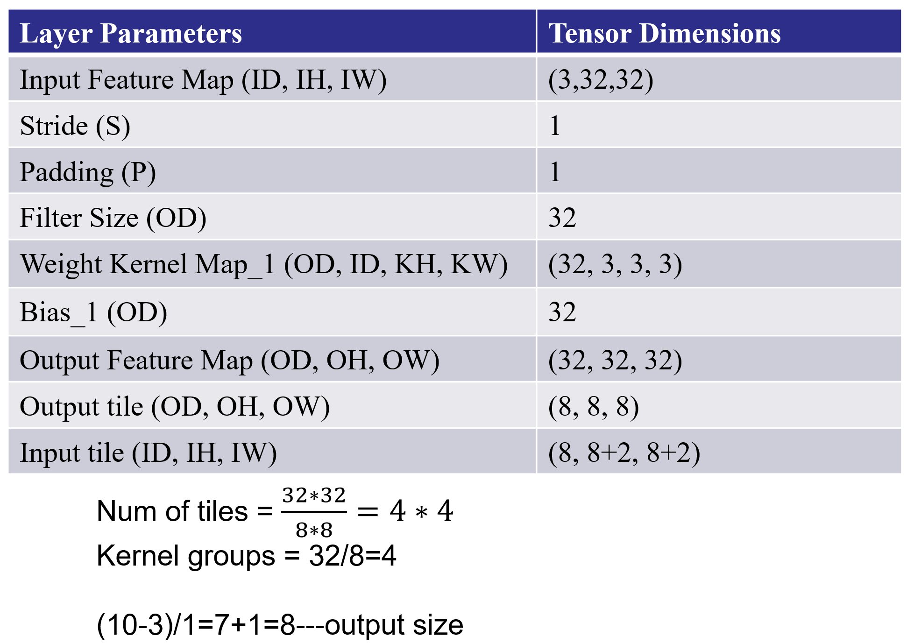
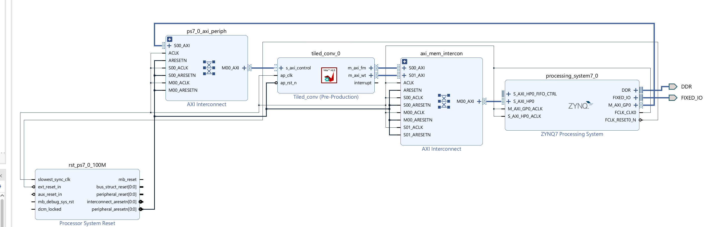
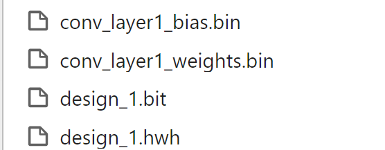
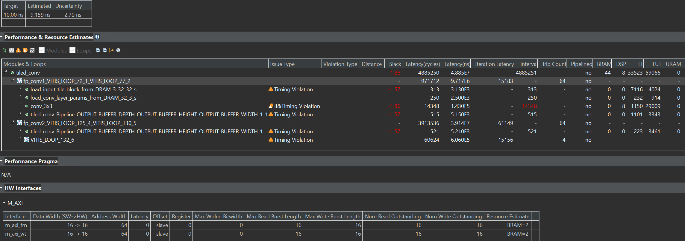
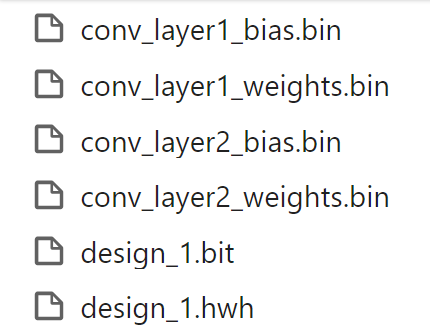
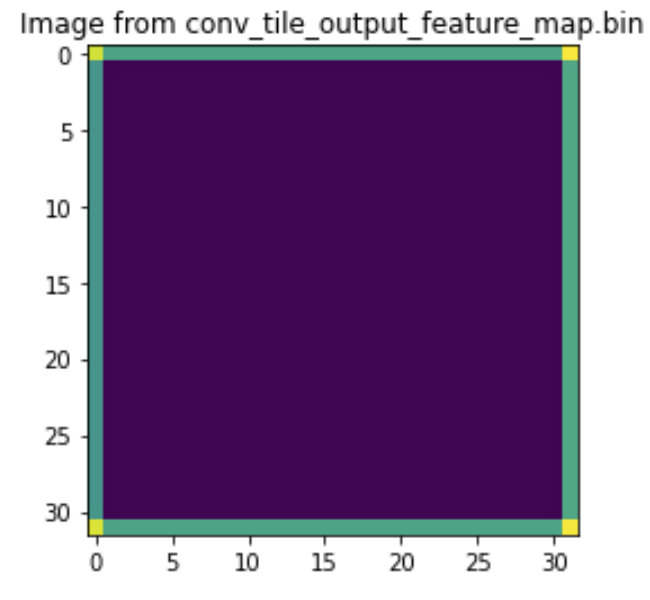

# Lab25 Tiling-based Convolution

<script type="text/x-mathjax-config">
  MathJax.Hub.Config({
    tex2jax: {
        inlineMath: [ ['$','$'], ["\\(","\\)"] ],
        displayMath: [ ['$$','$$'], ["\\[","\\]"] ],
        processEscapes: false,
    }
  });
</script>
     
<script type="text/javascript"
        src="https://cdn.mathjax.org/mathjax/latest/MathJax.js?config=TeX-AMS-MML_HTMLorMML">
</script>

## Convolution for Object Detection

At the core of almost every object detection model is a convolution neural network (CNN) such as VGG-16, ResNet50, Xception, YOLO, MobileNet, etc. These are essentially feature extraction networks. They "look" at images and extract salient features such as edges, shapes, etc. The convolutional layer in convolutional neural networks systematically applies filters to input and creates output feature maps. Although the convolutional layer is very simple, it can achieve sophisticated and impressive results. Nevertheless, it can be challenging to develop an intuition for how the shape of the filters impacts the shape of the output feature map and how related configuration hyperparameters such as padding and stride should be configured.

### Motivation - ResNet-50 for HD Inputs

ResNet-50 is a popular convolutional neural network (CNN) that is 50 layers deep. At its core, ResNet-50 is a feature extraction network. Based on how it is used in a deep learning model, ResNet-50 can act as an image classifier or as a feature extractor for object detection/tracking.

We want to implement this convolution layer of ResNet-50 with the above HD input image. Suppose that the input image (feature map) is described by a 3D tensor ```X(ID, IH, IW)```. We use a filter ```W``` with 64 kernels, each of dimensions ```(ID, KH, KW)``` where ```KH``` and ```KW``` are kernel window heights and widths. The resulting output feature map can be described by another 3D tensor, ```Y(OD, OH, OW)```. The output feature map dimensions are a function of the stride ```S``` and padding size ```P``` chosen. For the first layer of ResNet-50, the values of these parameters are described in the table below.

| Layer Parameters |  Layer Values |
| ---------------- | ----------------- |
| Kernel Size (KH x KW)  | 3 x 3 |
| Filter Size	(OD) | 64 |
| Input Feature Map (ID, IH, IW) | (64, 184, 320) |
| Stride (S) | 1 |
| Padding (P) | 1	|	
| Output Feature Map (OD, OH, OW) | (64, 184, 320) |

If these values do not make any sense to you at first glance, don't worry. You can learn these concepts easily through this well-written [CNN cheatsheet](https://stanford.edu/~shervine/teaching/cs-230/cheatsheet-convolutional-neural-networks). 

There are a few caveats in handling border pixels that you must keep in mind while writing your convolution code. This [article](https://sharc-knowledgebase.netlify.app/articles/cnn/tiling-based_convolution_for_hls/) from last year's assignment explaining 3 x 3 convolution may be useful. Most of the concepts are extensible to 7 x 7 convolution. 

### Convolution Layer

In a convolutional neural network, a convolutional layer systematically applies one or more filters to an input.

The multiplication of the filter to the input image results in a single output. The input is typically three-dimensional images (e.g. rows, columns and channels). In turn, the filters are also three-dimensional, with the same number of channels and fewer rows and columns than the input image. As such, the filter is repeatedly applied to each part of the input image, resulting in a two-dimensional output map of activations called a feature map.

Keras provides an implementation of the convolutional layer called Conv2D.

It requires that you specify the expected shape of the input images in terms of rows (height), columns (width), and channels (depth) or [rows, columns, channels].

The filter contains the weights that must be learned during the layer training. The filter weights represent the structure or feature that the filter will detect, and the strength of the activation indicates the degree to which the feature was detected.

The layer requires that the number of filters and the shape of the filters be specified.

We can demonstrate this with a small example. In this example, we define a single input image or sample with one channel: an eight-pixel by eight-pixel square with all 0 values and a two-pixel wide vertical line in the center.

```python
# define input data
data =  [[0, 0, 0, 1, 1, 0, 0, 0],
	[0, 0, 0, 1, 1, 0, 0, 0],
	[0, 0, 0, 1, 1, 0, 0, 0],
	[0, 0, 0, 1, 1, 0, 0, 0],
	[0, 0, 0, 1, 1, 0, 0, 0],
	[0, 0, 0, 1, 1, 0, 0, 0],
	[0, 0, 0, 1, 1, 0, 0, 0],
	[0, 0, 0, 1, 1, 0, 0, 0]]
data = asarray(data)
data = data.reshape(1, 8, 8, 1)
```

Next, we can define a model that expects input samples to have the shape (8, 8, 1) and has a single hidden convolutional layer with a single filter with the shape of three pixels by three pixels.

```python
# create model
model = Sequential()
model.add(Conv2D(1, (3,3), input_shape=(8, 8, 1)))
# summarize model
model.summary()
```
The filter is initialized with random weights as part of the initialization of the model. We will overwrite the random weights and hard code our own 3×3 filter that will detect vertical lines.

That is, the filter will strongly activate when it detects a vertical line and weakly activate when it does not. By applying this filter across the input image, we expect the output feature map to show that the vertical line was detected.

```python
# define a vertical line detector
detector = [[[[0]],[[1]],[[0]]],
            [[[0]],[[1]],[[0]]],
            [[[0]],[[1]],[[0]]]]
weights = [asarray(detector), asarray([0.0])]
# store the weights in the model
model.set_weights(weights)
```

Next, we can apply the filter to our input image by calling the predict() function on the model.

```python
# apply filter to input data
yhat = model.predict(data)
```
The result is a four-dimensional output with one batch, several rows and columns, and one filter, or [batch, rows, columns, filters].
Of note is that the single hidden convolutional layer will take the 8×8 pixel input image and will produce a feature map with the dimensions of 6×6. We will go into why this is the case in the next section.

### Problem of Border Effects

In the previous section, we defined a single filter with a size of three pixels high and three pixels wide (rows, columns).
We saw that applying the 3×3 filter, referred to as the kernel size in Keras, to the 8×8 input image resulted in a feature map with the size of 6×6.
The input image with 64 pixels was reduced to a feature map with 36 pixels. Where did the other 28 pixels go?
The filter is applied systematically to the input image. It starts at the top left corner of the image and is moved from left to right one-pixel column at a time until the filter's edge reaches the edge.
For a 3×3 pixel filter applied to an 8×8 input image, we can see that it can only be applied six times, resulting in a width of six in the output feature map.
For example, let’s work through each of the six patches of the input image (left) dot product (“.” operator) the filter (right):

```
0, 0, 0   0, 1, 0
0, 0, 0 . 0, 1, 0 = 0
0, 0, 0   0, 1, 0
```
Moved right one pixel:
```
0, 0, 1   0, 1, 0
0, 0, 1 . 0, 1, 0 = 0
0, 0, 1   0, 1, 0
```
Moved right one pixel:
```
0, 1, 1   0, 1, 0
0, 1, 1 . 0, 1, 0 = 3
0, 1, 1   0, 1, 0
```
Moved right one pixel:
```
1, 1, 0   0, 1, 0
1, 1, 0 . 0, 1, 0 = 3
1, 1, 0   0, 1, 0
```
Moved right one pixel:
```
1, 0, 0   0, 1, 0
1, 0, 0 . 0, 1, 0 = 0
1, 0, 0   0, 1, 0
```
Moved right one pixel:
```
0, 0, 0   0, 1, 0
0, 0, 0 . 0, 1, 0 = 0
0, 0, 0   0, 1, 0
```

That gives us the first row and each column of the output feature map:

```
0.0, 0.0, 3.0, 3.0, 0.0, 0.0
```

The reduction in the size of the input to the feature map is called the border effect. It is caused by the filter's interaction with the image's border.
This is often not a problem for large images and small filters but can be a problem with small images. It can also become a problem once a number of convolutional layers are stacked.
For example, if the size of the input feature image is 8×8 and it has two stacked convolutional layers, this means that a 3×3 filter is applied to the 8×8 input image to result in a 6×6 feature map as in the previous section. A 3×3 filter is then applied to the 6×6 feature map.


### Effect of Filter Size (Kernel Size)

Different-sized filters will detect different-sized features in the input image and, in turn, will result in differently-sized feature maps.
It is common to use 3×3 sized filters, and perhaps 5×5 or even 7×7 sized filters, for larger input images.
For example, it is an example of a model with a single filter updated to use a filter size of 5×5 pixels. The 5×5 filter can only be applied to the 8×8 input image 4 times, resulting in a 4×4 feature map output. It may help to develop further the intuition of the relationship between filter size and the output feature map to look at two extreme cases.
The first is a filter with the size of 1×1 pixels, and the output feature map has the same size as the input, specifically 8×8. This is because the filter only has a single weight (and a bias).


### Fix the Border Effect Problem with Padding

By default, a filter starts at the left of the image, with the left-hand side of the filter sitting on the far left pixels of the image. The filter is then stepped across the image one column at a time until the right-hand side of the filter is sitting on the far right pixels of the image.
An alternative approach to applying a filter to an image is to ensure that each pixel in the image is given an opportunity to be at the center of the filter.
By default, this is not the case, as the pixels on the edge of the input are only ever exposed to the filter's edge. By starting the filter outside the frame of the image, it gives the pixels on the border of the image more of an opportunity for interacting with the filter, more of an opportunity for features to be detected by the filter, and in turn, an output feature map that has the same shape as the input image.

For example, when applying a 3×3 filter to the 8×8 input image, we can add a border of one pixel around the outside of the image. This has the effect of artificially creating a 10×10 input image. When the 3×3 filter is applied, it results in an 8×8 feature map. The added pixel values could have a zero value that does not affect the dot product operation when the filter is applied.

```
x, x, x   0, 1, 0
x, 0, 0 . 0, 1, 0 = 0
x, 0, 0   0, 1, 0
```

The addition of pixels to the edge of the image is called padding.
In Keras, this is specified via the “padding” argument on the Conv2D layer, which has the default value of ‘valid‘ (no padding). This means that the filter is applied only to valid ways to the input.
The ‘padding‘ value of ‘same‘ calculates and adds the padding required to the input image (or feature map) to ensure that the output has the same shape as the input.

### Downsample Input With Stride

The filter is moved across the image from left to right, top to bottom, with a one-pixel column change on the horizontal movements and then a one-pixel row change on the vertical movements.
The amount of movement between applications of the filter to the input image is referred to as the stride, and it is almost always symmetrical in height and width dimensions.
The default stride or strides in two dimensions is (1,1) for the height and the width movement, performed when needed. And this default works well in most cases.

The stride can be changed, which has an effect both on how the filter is applied to the image and, in turn, the size of the resulting feature map.
For example, the stride can be changed to (2,2). This has the effect of moving the filter two pixels right for each horizontal movement of the filter and two pixels down for each vertical movement of the filter when creating the feature map.

We can demonstrate this with an example using the 8×8 image with a vertical line (left) dot product (“.” operator) with the vertical line filter (right) with a stride of two pixels:
```
0, 0, 0   0, 1, 0
0, 0, 0 . 0, 1, 0 = 0
0, 0, 0   0, 1, 0
```

Moved two pixels right:
```
0, 1, 1   0, 1, 0
0, 1, 1 . 0, 1, 0 = 3
0, 1, 1   0, 1, 0
```
Moved two pixels right:
```
1, 0, 0   0, 1, 0
1, 0, 0 . 0, 1, 0 = 0
1, 0, 0   0, 1, 0
```

We can see only three valid applications of the 3×3 filters to the 8×8 input image with a stride of two. This will be the same in the vertical dimension.
This has the effect of applying the filter in such a way that the normal feature map output (6×6) is down-sampled so that the size of each dimension is reduced by half (3×3), resulting in 1/4 the number of pixels (36 pixels down to 9).

We can also get the height and the width of the output feature map according to the size of the input feature map and stride. For example, if the kernel size is 3×3, the input feature map is 3×27×21, and the stride is 2, then we can see the output size is (27-3)/2+1 and (21-3)/2+1, which is 13×10. And it is (input_height-kernel_size)/stride+1.


The values of these parameters are described in the table below for our example:

<div align=center></div>


We need to add the four files as the source file ```gradient.h```, ```io.h```, ```utils.h```, ```tile_conv.cpp``` and two bin files. You can find these files in [here](https://github.com/jia1217/ParallelProgammingLabs/tree/patch-2/Labs/Lab25_1).


We need to change the ```Uncertainty``` like below:

<div align=center></div>


The synthesis report is shown below：

<div align=center></div>

The ```sim.cpp``` is the testbench file.


We can first see the effect of one convolution of the ```tile_conv``` function by implementing it on the PYNQ-Z2 board.

#### Create the Vivado project

The configure block design can use reference materials [here](https://uri-nextlab.github.io/ParallelProgammingLabs/HLS_Labs/Lab1.html). And we need to choose the number of the DMA according to the number of the interface.

<div align=center></div>

#### Run synthesis,  Implementation, and generate bitstream

It may show some errors about I/O ports, so please fix them.

#### Download the bitstream file to PYNQ

<div align=center></div>


```python
from pynq import (allocate, Overlay)
import numpy as np
import pynq
import struct
ol = Overlay('design_1.bit')

top_ip = ol.tiled_conv_0
top_ip.signature

in_buffer = pynq.allocate((3,32,32), np.int16)
w_buffer = pynq.allocate((32,3,3,3), np.int16)
b_buffer = pynq.allocate((32), np.int16)
out_buffer = pynq.allocate((32,32,32), np.int16)
# initialize input

for i in range (3):
    for j in range (32):
        for k in range (32):
            in_buffer[i][j][k]=1
```

```python
#read data from bin file
# Weights
with open("conv_layer1_weights.bin", "rb") as f:
    conv_layer_weights = struct.unpack("{}f".format(32*3*3*3), f.read())

# Bias
with open("conv_layer1_bias.bin", "rb") as f:
    conv_layer_bias = struct.unpack("{}f".format(32), f.read())
```


```python
#define functions that can convert between the fixed-point and float
def to_fixed_point(dst, src, *, width=None, iwidth, signed=True):
    if width is None:
        width = dst.dtype.itemsize * 8

    fwidth = width - iwidth
    epsilon = 1.0 / (2.0 ** fwidth)
    min_ = -1.0 * (2.0 ** (iwidth - 1)) if signed else 0.0
    max_ = (2.0 ** (iwidth - (1 if signed else 0))) - epsilon

    src = np.copy(src)
    src = src.reshape(dst.shape)
    src[src < min_] = min_
    src[src > max_] = max_
    if signed:
        src[src < 0] += (2 ** iwidth)
    dst[:] = np.around(src * (2.0 ** fwidth)).astype(dst.dtype)
    
# Convert fixed-point array back to floating point
# Sample Usage:
# B_float = from_fixed_point(B_fixp, iwidth=3)
def from_fixed_point(src, *, width=None, iwidth, signed=True):
    if width is None:
        width = src.dtype.itemsize * 8

    fwidth = width - iwidth
    src = np.array(src, dtype=np.int64)
    if signed:
        src[src >= (2 ** (width - 1))] -= (2 ** width)
    return src / (2.0 ** fwidth)

#Perform data type conversion
to_fixed_point(w_buffer,conv_layer_weights,iwidth=3)
to_fixed_point(b_buffer,conv_layer_bias,iwidth=3)
```

```python
#start the data transfer process
inptr = in_buffer.physical_address
wptr = w_buffer.physical_address
bptr = b_buffer.physical_address
outptr = out_buffer.physical_address

top_ip.write(0x10, inptr)
top_ip.write(0x1c, outptr)
top_ip.write(0x28, wptr)
top_ip.write(0x34, bptr)

top_ip.write(0x00, 1)
isready = top_ip.read(0x00)

out_float= from_fixed_point(out_buffer,iwidth=3)
print(out_float.shape)
```

```python
#by painting the image we can see the difference between the ideal and output
import matplotlib.pyplot as plt
import numpy as np
plt.imshow(out_float[0])

# Add a descriptive title to the plot
plt.title("Image from conv_tile_output_feature_map.bin")

# Optionally, adjust color scaling if needed
# plt.clim(vmin=0, vmax=255)  # Example: scale values between 0 and 255

# Display the plot
plt.show()
```

We will see the input image:

<div align=center></div>


And the input image:
```python
plt.imshow(in_buffer[0])

# Add a descriptive title to the plot
plt.title("Image from conv_tile_input_feature_map.bin")

# Optionally, adjust color scaling if needed
# plt.clim(vmin=0, vmax=255)  # Example: scale values between 0 and 255

# Display the plot
plt.show()
```
<div align=center></div>


And we can have the second stacked convolutional layers on the basis of the previous one like below:

<div align=center></div>

The second coding and bin files can be found [here](https://github.com/jia1217/ParallelProgammingLabs/tree/patch-2/Labs/Lab25_2).

The synthesis report is shown below:

<div align=center></div>

#### Create the Vivado project

The configure block design can use reference materials [here](https://uri-nextlab.github.io/ParallelProgammingLabs/HLS_Labs/Lab1.html). And we need to choose the number of the DMA according to the number of the interface.

<div align=center></div>

#### Run synthesis,  Implementation, and generate bitstream

It may show some errors about I/O ports, so please fix them.

#### Download the bitstream file to PYNQ

<div align=center></div>

```python
from pynq import (allocate, Overlay)
import numpy as np
import pynq
import struct
ol = Overlay('design_1.bit')

top_ip = ol.tiled_conv_0
top_ip.signature

in_buffer = pynq.allocate((3,32,32), np.int16)
w_buffer_1 = pynq.allocate((32,3,3,3), np.int16)
b_buffer_1 = pynq.allocate((32), np.int16)
w_buffer_2 = pynq.allocate((32,32,3,3), np.int16)
b_buffer_2 = pynq.allocate((32), np.int16)
out_buffer = pynq.allocate((32,32,32), np.int16)
# initialize input
for i in range (3):
    for j in range (32):
        for k in range (32):
            in_buffer[i][j][k]=1
```

```python
# Weights
with open("conv_layer1_weights.bin", "rb") as f:
    conv_layer_weights_1 = struct.unpack("{}f".format(32*3*3*3), f.read())

# Bias
with open("conv_layer1_bias.bin", "rb") as f:
    conv_layer_bias_1 = struct.unpack("{}f".format(32), f.read())
    # Weights
with open("conv_layer2_weights.bin", "rb") as f:
    conv_layer_weights_2 = struct.unpack("{}f".format(32*32*3*3), f.read())

# Bias
with open("conv_layer2_bias.bin", "rb") as f:
    conv_layer_bias_2 = struct.unpack("{}f".format(32), f.read())
```


```python
def to_fixed_point(dst, src, *, width=None, iwidth, signed=True):
    if width is None:
        width = dst.dtype.itemsize * 8

    fwidth = width - iwidth
    epsilon = 1.0 / (2.0 ** fwidth)
    min_ = -1.0 * (2.0 ** (iwidth - 1)) if signed else 0.0
    max_ = (2.0 ** (iwidth - (1 if signed else 0))) - epsilon

    src = np.copy(src)
    src = src.reshape(dst.shape)
    src[src < min_] = min_
    src[src > max_] = max_
    if signed:
        src[src < 0] += (2 ** iwidth)
    dst[:] = np.around(src * (2.0 ** fwidth)).astype(dst.dtype)
    
# Convert fixed-point array back to floating point
# Sample Usage:
# B_float = from_fixed_point(B_fixp, iwidth=3)
def from_fixed_point(src, *, width=None, iwidth, signed=True):
    if width is None:
        width = src.dtype.itemsize * 8

    fwidth = width - iwidth
    src = np.array(src, dtype=np.int64)
    if signed:
        src[src >= (2 ** (width - 1))] -= (2 ** width)
    return src / (2.0 ** fwidth)

to_fixed_point(w_buffer_1,conv_layer_weights_1,iwidth=3)
to_fixed_point(b_buffer_1,conv_layer_bias_1,iwidth=3)
to_fixed_point(w_buffer_2,conv_layer_weights_2,iwidth=3)
to_fixed_point(b_buffer_2,conv_layer_bias_2,iwidth=3)
```

```python
inptr = in_buffer.physical_address
wptr1 = w_buffer_1.physical_address
bptr1 = b_buffer_1.physical_address
wptr2 = w_buffer_2.physical_address
bptr2 = b_buffer_2.physical_address
outptr = out_buffer.physical_address

top_ip.write(0x10, inptr)
top_ip.write(0x1c, outptr)
top_ip.write(0x28, wptr1)
top_ip.write(0x34, bptr1)
top_ip.write(0x40, wptr2)
top_ip.write(0x4c, bptr2)

top_ip.write(0x00, 1)
isready = top_ip.read(0x00)
```

```python
import matplotlib.pyplot as plt
import numpy as np
plt.imshow(out_float[0])

# Add a descriptive title to the plot
plt.title("Image from conv_tile_output_feature_map.bin")

# Optionally, adjust color scaling if needed
# plt.clim(vmin=0, vmax=255)  # Example: scale values between 0 and 255

# Display the plot
plt.show()
```

We can see the image like below:

<div align=center></div>

We can also see the input image:

```python
plt.imshow(in_buffer[0])

# Add a descriptive title to the plot
plt.title("Image from conv_tile_input_feature_map.bin")

# Optionally, adjust color scaling if needed
# plt.clim(vmin=0, vmax=255)  # Example: scale values between 0 and 255

# Display the plot
plt.show()
```

<div align=center></div>

## Demonstrate

Please finish the ```tile_conv``` example and implement it on the PYNQ-Z2 board.
