# Lab3 Task_level_Parallelism_control_driven_1

<script type="text/x-mathjax-config">
  MathJax.Hub.Config({
    tex2jax: {
        inlineMath: [ ['$','$'], ["\\(","\\)"] ],
        displayMath: [ ['$$','$$'], ["\\[","\\]"] ],
        processEscapes: false,
    }
  });
</script> 
    
<script type="text/javascript"
        src="https://cdn.mathjax.org/mathjax/latest/MathJax.js?config=TeX-AMS-MML_HTMLorMML">
</script>

## Introduction

Task-Level Parallelism (TLP) is a form of parallelism where multiple tasks or operations are executed concurrently to improve performance and efficiency. TLP focuses on dividing a program or application into multiple tasks that can be executed in parallel, either on multiple cores of a processor, multiple processors, or distributed computing resources.
TLP helps exploit the capabilities of multi-core and multi-processor systems to improve performance and responsiveness.

### Control-driven Task-level Parallelism

Control-driven TLP is useful to model parallelism while relying on the sequential semantics of C++, rather than on continuously running threads. It's characterized by

Task Identification:

* Breaking down a program into independent units of work called tasks.

* Analyzing algorithms and data structures to identify potential parallelism.

Dependency Analysis:

* Determining relationships between tasks, such as which tasks must complete before others can start.

* Representing dependencies using graphs or other structures.

Advantages:

* Fine-Grained Control: Programmers specify task dependencies and execution flow.

* Suitable for Complex Algorithms: Handles irregular computations and dynamic behavior effectively.

* Potential for Better Performance: Achieves higher parallelism and reduces processor idle time.

The control-driven TLP (or dataflow) model provides:

* A subsequent function can start before the previous finishes

* A function can be restarted before it finishes

* Two or more sequential functions can be started simultaneously

#### Bypassing

The control-driven TLP model optimizes the flow of data between tasks (functions and loops), and ideally pipelined functions and loops for maximum performance. It does not require these tasks to be chained, one after the other, however there are some limitations in how the data is transferred. The following behaviors can prevent or limit the overlapping that the tool can perform in the dataflow model:

* Reading from function inputs or writing to function outputs in the middle of the dataflow region

* Single-producer-consumer violations

* Conditional execution of tasks

* Loops with multiple exit conditions

Reading of inputs of the function should be done at the start of the dataflow region, and writing to outputs should be done at the end of the dataflow region. Reading/writing to the ports of the function can cause the processes to be executed in sequence rather than in an overlapped fashion, adversely impacting performance. For the tool to use the dataflow model, all elements passed between tasks must follow a single-producer-consumer model. Each variable must be driven from a single task and only be consumed by a single task. In addition, data should generally flow from one task to another. If you bypass tasks, this can reduce the performance of the dataflow model. 

The ```DATAFLOW``` pragma enables task-level pipelining, allowing functions and loops to overlap in their operation, increasing the concurrency of the RTL implementation and increasing the overall throughput of the design.

All operations are performed sequentially in a C description. In the absence of any directives that limit resources (such as pragma HLS allocation), the Vitis HLS tool seeks to minimize latency and improve concurrency. However, data dependencies can limit this. For example, functions or loops that access arrays must finish all read/write accesses to the arrays before they complete. This prevents the next function or loop that consumes the data from starting operation. The DATAFLOW optimization enables the operations in a function or loop to start operation before the previous function or loop completes all its operations.

<div align=center>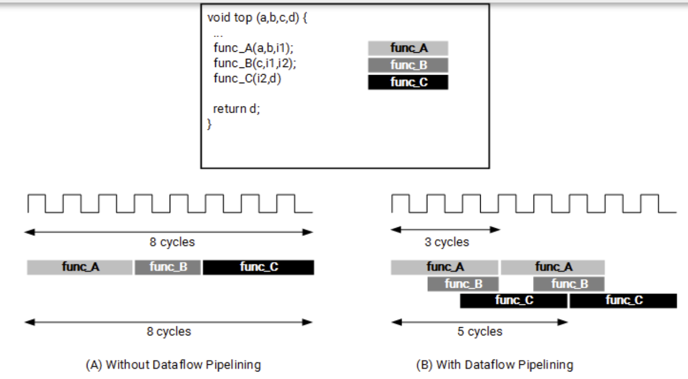</div>

When the ```DATAFLOW``` pragma is specified, the HLS tool analyzes the dataflow between sequential functions or loops and creates channels (based on ```ping pong RAMs``` or ```FIFOs```) that allow consumer functions or loops to start operation before the producer functions or loops have completed. This allows functions or loops to operate in parallel, which decreases latency and improves the throughput of the RTL. For the ```DATAFLOW``` optimization to work, the data must flow through the design from one task to the next.

For the ```DATAFLOW``` optimization to work, the data must flow through the design from one task to the next. The following coding styles prevent the HLS tool from performing the ```DATAFLOW``` optimization.

* Single-producer-consumer violations

* Feedback between tasks

* Conditional execution of tasks

* Loops with multiple exit conditions

Finally, the ```DATAFLOW``` optimization has no hierarchical implementation. If a sub-function or loop contains additional tasks that might benefit from the ```DATAFLOW``` optimization, you must apply the optimization to the loop, the sub-function, or inline the sub-function.

##### input_bypass

This example shows a common issue within a ```DATAFLOW``` Pipeline where the input arguments bypass the first function which causes performance degradation in the ```DATAFLOW``` pipeline. The example shows both the problem and the solution

**dut. cpp**
```c++
void add_kernel(int tmp1[128], int tmp2[128], int tmp3[128]) {

    int buff[127];
    for (int i = 0; i < 128; i++) {
        tmp3[i] = tmp1[i] + tmp2[i];
    }
}

void double_pass(int b[128], int tmp2[128], int tmp1[128], int tmp4[128]) {

    int buff[127];
    for (int i = 0; i < 128; i++) {
        tmp2[i] = b[i];
        tmp4[i] = tmp1[i];
    }
}

void pass(int a[128], int tmp1[128]) {
    for (int i = 0; i < 128; i++) {
        tmp1[i] = a[i];
    }
}

void dut(int a[128], int b[128], int tmp3[128]) {
#pragma HLS DATAFLOW

    int tmp1[128], tmp2[128], tmp4[128];

    pass(a, tmp1);
    double_pass(b, tmp2, tmp1, tmp4);
    add_kernel(tmp4, tmp2, tmp3);
}
```

The dataflow view is shown below. We can see that the input data labeled as ```a``` in a top-level function is passed to the ```pass_u0``` function, and the input data labeled as ```b``` in the same top-level function is passed to the ```double_pass_u0``` function where the input arguments bypass the first function which causes performance degradation in the DATAFLOW pipeline.

<div align=center>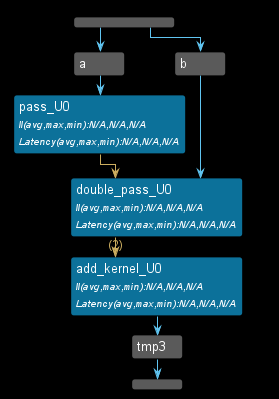</div>

<div align=center>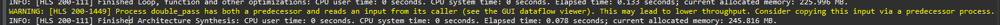</div>

**dut_sol. cpp**
```c++
void add_kernel(int tmp1[128], int tmp2[128], int tmp3[128]) {

    int buff[127];
    for (int i = 0; i < 128; i++) {
        tmp3[i] = tmp1[i] + tmp2[i];
    }
}

void Double_pass(int tmp2[128], int tmp1[128], int tmp4[128], int tmp5[128]) {

    int buff[127];
    for (int i = 0; i < 128; i++) {
        tmp4[i] = tmp1[i];
        tmp5[i] = tmp2[i];
    }
}

void pass(int a[128], int b[128], int tmp1[128], int tmp2[128]) {
    for (int i = 0; i < 128; i++) {
        tmp1[i] = a[i];
        tmp2[i] = b[i];
    }
}

void dut(int a[128], int b[128], int tmp3[128]) {
#pragma HLS DATAFLOW

    int tmp1[128], tmp2[128], tmp4[128];
    int tmp5[128];

    pass(a, b, tmp1, tmp2);
    Double_pass(tmp2, tmp1, tmp4, tmp5);
    add_kernel(tmp4, tmp5, tmp3);
}
```

The dataflow view is shown below. The top-level function reads both input data labeled as ```a``` and ```b``` and passes them to the ```pass_2_u0``` function.

<div align=center>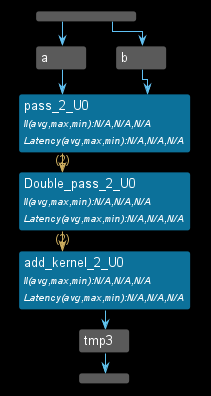</div>


##### middle_bypass

**dut. cpp**

```c++
void bypass(int tmp1[128], int tmp2[128], int tmp3[128]) {
    //	static int j;

    int buff[127];
    for (int i = 0; i < 128; i++) {
        tmp3[i] = tmp1[i] + tmp2[i];
    }
}

void pass(int tmp2[128], int tmp4[128]) {
    //	static int j;

    int buff[127];
    for (int i = 0; i < 128; i++) {

        tmp4[i] = tmp2[i];
    }
}

void double_pass(int a[128], int b[128], int tmp1[128], int tmp2[128]) {
    static int j;
    for (int i = 0; i < 128; i++) {
        j++;
        tmp1[i] = a[i];
        tmp2[i] = b[i];
    }
}

void dut(int a[128], int b[128], int tmp3[128]) {
#pragma HLS DATAFLOW

    int tmp1[128], tmp2[128], tmp4[128];

    double_pass(a, b, tmp1, tmp2);
    pass(tmp2, tmp4);
    bypass(tmp1, tmp4, tmp3);
}
```

This is a common DATAFLOW issue, where the channels inside the ```DATAFLOW``` are not feed-forward and bypass the tasks which causes a degradation in performance. This example shows both the problem and the solution. The dataflow view is shown below. 

<div align=center>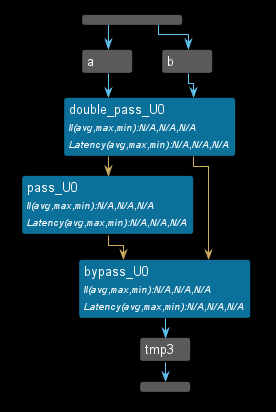</div>

<div align=center>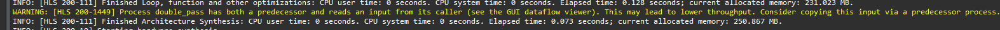</div>


**dut_sol .cpp**

```c++
void bypass(int tmp1[128], int tmp2[128], int tmp3[128]) {

    for (int i = 0; i < 128; i++) {
        tmp3[i] = tmp1[i] + tmp2[i];
    }
}

void pass(int tmp2[128], int tmp4[128], int tmp1[128], int tmp5[128]) {
    //	static int j;

    int buff[127];
    for (int i = 0; i < 128; i++) {

        tmp4[i] = tmp2[i];
        tmp5[i] = tmp1[i];
    }
}

void double_pass(int a[128], int b[128], int tmp1[128], int tmp2[128]) {
    static int j;
    for (int i = 0; i < 128; i++) {
        j++;
        tmp1[i] = a[i];
        tmp2[i] = b[i];
    }
}

void dut(int a[128], int b[128], int tmp3[128]) {
#pragma HLS DATAFLOW

    int tmp1[128], tmp2[128], tmp4[128], tmp5[128];

    double_pass(a, b, tmp1, tmp2);
    pass(tmp2, tmp4, tmp1, tmp5);
    bypass(tmp5, tmp4, tmp3);
}
```
The dataflow view is shown below. 

<div align=center>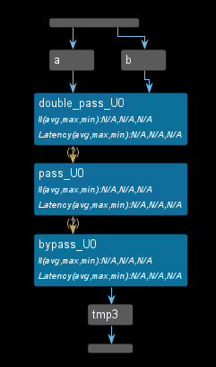</div>

##### output_bypass


**dut.cpp**

```c++
void pass(int tmp1[128], int b[128]) {
    int buff[127];
    for (int i = 0; i < 128; i++) {
        b[i] = tmp1[i];
    }
}

void split(int a[128], int tmp1[128], int tmp2[128]) {
    static int j;
    for (int i = 0; i < 128; i++) {
        j++;
        tmp1[i] = a[i];
        tmp2[i] = a[i];
    }
}

void dut(int a[128], int b[128], int tmp2[128]) {
#pragma HLS DATAFLOW

    int tmp1[128], tmp3[128];

    split(a, tmp1, tmp2);
    pass(tmp1, b);
}
```
This is a common DATAFLOW issue, where the channels inside the ```DATAFLOW``` does not follow the feed-forward which causes degradation in performance. This example shows both the problem and solution 

<div align=center>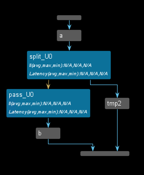</div>

<div align=center>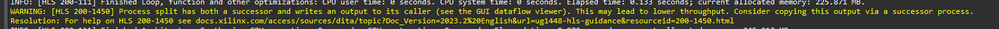</div>

**dut_sol.cpp**

```c++
void pass(int tmp3[128], int tmp2[128], int tmp1[128], int b[128]) {
    for (int i = 0; i < 128; i++) {
        b[i] = tmp1[i];
        tmp2[i] = tmp3[i];
    }
}

void split(int a[128], int tmp1[128], int tmp2[128]) {
    static int j;
    for (int i = 0; i < 128; i++) {
        j++;
        tmp1[i] = a[i];
        tmp2[i] = a[i];
    }
}

void dut(int a[128], int b[128], int tmp2[128]) {
#pragma HLS DATAFLOW

    int tmp1[128], tmp3[128];

    split(a, tmp1, tmp3);
    pass(tmp3, tmp2, tmp1, b);
}
```

The dataflow view is shown below. 

<div align=center>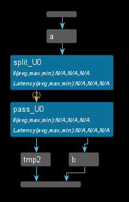</div>

#### Channel_1

Vitis HLS implements channels between the tasks as either ```PIPO``` or ```FIFO``` buffers, depending on the user's choice:

* For scalars, Vitis HLS automatically infers ```FIFOs``` as the channel type.

* If the parameter (of a producer or consumer) is an array, the user has a choice of implementing the channel as a ```PIPO``` or a ```FIFO``` based on the following considerations:

If the data is always accessed in sequential order, the user can choose to implement this memory channel as ```PIPO/FIFO```. Choosing ```PIPOs``` comes with the advantage that ```PIPOs``` can never deadlock but they require more memory to use. Choosing FIFOs offers the advantage of lesser memory requirements but this comes with the risk of deadlock if the ```FIFO``` sizes are not correct.

If the data is accessed in an arbitrary manner, the memory channel must be implemented as a ```PIPO``` (with a default size that is twice the size of the original array).

Specifying the size of the ```FIFO``` channels overrides the default value that is computed by the tool to attempt to optimize the throughput. If any function in the design can produce or consume samples at a greater rate than the specified size of the ```FIFO```, the ```FIFOs``` might become empty (or full). In this case, the design halts operation, because it is unable to read (or write). This might lead to a stalled, deadlock state.

##### Merge_split

A merge channel has many producers and a single consumer, and operates [Ref](https://docs.xilinx.com/r/en-US/ug1399-vitis-hls/HLS-Split/Merge-Library) based on the reverse logic:

###### merge_load_balance

* The load balancing merge channel, where the first producer that completes the work will write first into the channel with non-deterministic results.

```c++
hls::merge::load_balancing<DATATYPE, NUM_PORTS[, DEPTH]> name
```

Where:

* round_robin/load_balancing: Specifies the type of scheduler mechanism used for the channel.

* ```DATATYPE```: Specifies the data type on the channel. This has the same restrictions as standard hls::stream. The DATATYPE can be:

* Any C++ native data type

* A Vitis HLS arbitrary precision type (for example, ap_int<>, ap_ufixed<>)

* A user-defined struct containing either of the above types

* ```NUM_PORTS```: Indicates the number of write ports required for split (1:num) or read-ports required for merge (num:1) operation.

* ```DEPTH```: Optional argument is the depth of the main buffer, located before the split or after the merge. This is optional, and the default depth is 2 when not specified.

* ```N_PORT_DEPTH```: Optional field for round-robin to specify the depth of output buffers applied after the split, or before merge. This is optional and the default depth is 0 when not specified.

Tip: To specify the optional ```N_PORT_DEPTH``` value, you must also specify ```DEPTH```.

**test.h**
```c++
#ifndef _TEST_H
#define _TEST_H

#include "hls_np_channel.h"
#include "hls_stream.h"

void dut(hls::stream<int>& in1, hls::stream<int>& out1, hls::stream<int>& out2,
         hls::stream<int>& out3, hls::stream<int>& out4);

#endif
```


**test.cpp**
```c++
#include "test.h"

void producer1(hls::stream<int>& out, hls::stream<int>& in) {
#pragma HLS inline off
    for (int i = 0; i < 16; i++) {
        int tmp_d = in.read();
        out.write(tmp_d);
    }
}

void producer2(hls::stream<int>& out, hls::stream<int>& in) {
#pragma HLS inline off
    for (int i = 0; i < 16; i++) {
        int tmp_d = in.read();
        out.write(tmp_d);
    }
}

void producer3(hls::stream<int>& out, hls::stream<int>& in) {
#pragma HLS inline off
    for (int i = 0; i < 16; i++) {
        int tmp_d = in.read();
        out.write(tmp_d);
    }
}

void producer4(hls::stream<int>& out, hls::stream<int>& in) {
#pragma HLS inline off
    for (int i = 0; i < 16; i++) {
        int tmp_d = in.read();
        out.write(tmp_d);
    }
}

void consumer1(hls::stream<int>& in, hls::stream<int>& out) {
#pragma HLS inline off
    for (int i = 0; i < 64; i++) {
        int tmp = in.read();
        out.write(tmp);
    }
}

void dut(hls::stream<int>& in1, hls::stream<int>& out1, hls::stream<int>& out2,
         hls::stream<int>& out3, hls::stream<int>& out4) {
#pragma HLS dataflow

    hls::merge::load_balance<int, 4, 20> s;

// int: Data type of inputs and output (integers).
// 4: Number of input streams to merge.
// 20: Maximum depth of the output FIFO.

    producer1(s.in[0], out1);
    producer2(s.in[1], out2);
    producer3(s.in[2], out3);
    producer4(s.in[3], out4);
    consumer1(s.out, in1);
}
```
The dataflow view is shown below.

<div align=center>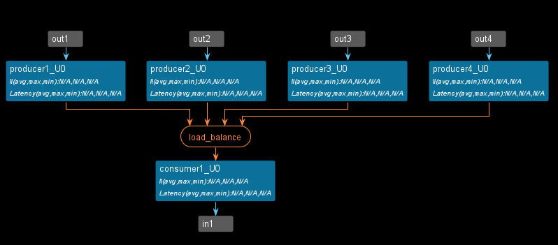</div>

**test_tb.cpp**
```c++
#include "test.h"

int main() {
    hls::stream<int> a;
    hls::stream<int> b1;
    hls::stream<int> b2;
    hls::stream<int> b3;
    hls::stream<int> b4;
    int cnt1 = 0;
    int cnt2 = 0;
    int cnt3 = 0;
    int cnt4 = 0;

    for (int i = 0; i < 16; i++) {
        b1.write(i);
        b2.write(i);
        b3.write(i);
        b4.write(i);
    }

    dut(a, b1, b2, b3, b4);

    int sum = 0;
    for (int i = 0; i < 64; i++) {
        int tmp1 = a.read();
        std::cout << "tmp1[" << i << "] is " << tmp1 << "\t";
        if ((i + 1) % 4 == 0) {
			   std::cout << std::endl;
		   }

		   // Print newline after every 16 elements
		   if ((i + 1) % 16 == 0) {
			   std::cout << std::endl;
		   }
        sum += tmp1;
    //    printf("sum[%d] is %d\r\n",i,sum);
    }

    if (sum != 480)
        return 1;

    return 0;
}
```

The result of the C simulation is shown below.

<div align=center>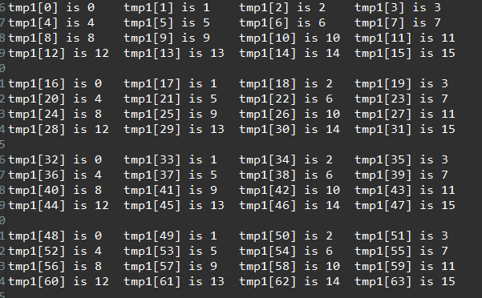</div>

###### merge_round_robin

* Round-robin, where the producer output data is merged using a fixed rotating order, thus ensuring deterministic behavior, but not allowing load sharing with dynamically varying computational loads for the workers.

```c++
hls::merge::round_robin<DATATYPE, NUM_PORTS[, DEPTH]> name
```

The code is the same with the merge_load_balance but the optimization is different.

```c++
void dut(hls::stream<int>& in1, hls::stream<int>& out1, hls::stream<int>& out2,
         hls::stream<int>& out3, hls::stream<int>& out4) {
#pragma HLS dataflow

    hls::merge::round_robin<int, 4, 5, 100> s;
// int: Data type of the inputs and output (integers in this case).
// 4: Number of input streams to merge
// 5: Maximum depth of each input FIFO (buffer).
// 100: Maximum depth of the output FIFO.

    producer1(s.in[0], out1);
    producer2(s.in[1], out2);
    producer3(s.in[2], out3);
    producer4(s.in[3], out4);
    consumer1(s.out, in1);
}
```

The dataflow view is shown below.

<div align=center>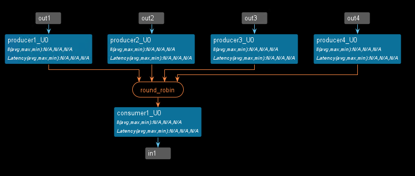</div>

The result of the C simulation is shown below.

<div align=center>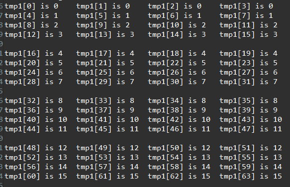</div>

###### split_load_balance

A split channel has one producer and many consumers, and can be typically used to distribute tasks to a set of workers, abstracting and implementing in RTL the distribution logic, and thus leading to both better performance and fewer resources. The distribution of an input to one of the ```N``` outputs can be:

* Load balancing, where the first consumer to attempt a read will read the first input data, thus ensuring good load balancing, but with non-deterministic results.

```c++
hls::split::load_balancing<DATATYPE, NUM_PORTS[, DEPTH, N_PORT_DEPTH]> name;
```

**test.h**
```c++
#ifndef _TEST_H
#define _TEST_H
#include "ap_int.h"
#include "hls_np_channel.h"
#include "hls_stream.h"

void dut(hls::stream<int>& in1, hls::stream<ap_uint<32>>& out1,
         hls::stream<ap_uint<32>>& out2, hls::stream<ap_uint<32>>& out3,
         hls::stream<ap_uint<32>>& out4);
#endif
```
**test.cpp**
```c++
#include "test.h"

void producer(hls::stream<ap_uint<32>>& out, hls::stream<int>& in) {
#pragma HLS inline off
    ap_uint<32> tmp;
    for (int i = 0; i < 16; i++) {
        int tmp_d = in.read();
        out.write(tmp_d);
    }
}

void consumer1(hls::stream<ap_uint<32>>& in, hls::stream<ap_uint<32>>& out) {
#pragma HLS inline off
    for (int i = 0; i < 4; i++) {
        ap_uint<32> tmp = in.read();
        out.write(tmp);
    }
}

void consumer2(hls::stream<ap_uint<32>>& in, hls::stream<ap_uint<32>>& out) {
#pragma HLS inline off
    for (int i = 0; i < 4; i++) {
        ap_uint<32> tmp = in.read();
        out.write(tmp);
    }
}

void consumer3(hls::stream<ap_uint<32>>& in, hls::stream<ap_uint<32>>& out) {
#pragma HLS inline off
    for (int i = 0; i < 4; i++) {
        ap_uint<32> tmp = in.read();
        out.write(tmp);
    }
}

void consumer4(hls::stream<ap_uint<32>>& in, hls::stream<ap_uint<32>>& out) {
#pragma HLS inline off
    for (int i = 0; i < 4; i++) {
        ap_uint<32> tmp = in.read();
        out.write(tmp);
    }
}

void dut(hls::stream<int>& in1, hls::stream<ap_uint<32>>& out1,
         hls::stream<ap_uint<32>>& out2, hls::stream<ap_uint<32>>& out3,
         hls::stream<ap_uint<32>>& out4) {
#pragma HLS dataflow

    hls::split::load_balance<ap_uint<32>, 4, 6> s;

    producer(s.in, in1);
    consumer1(s.out[0], out1);
    consumer2(s.out[1], out2);
    consumer3(s.out[2], out3);
    consumer4(s.out[3], out4);
}
```
The dataflow view is shown below.

<div align=center>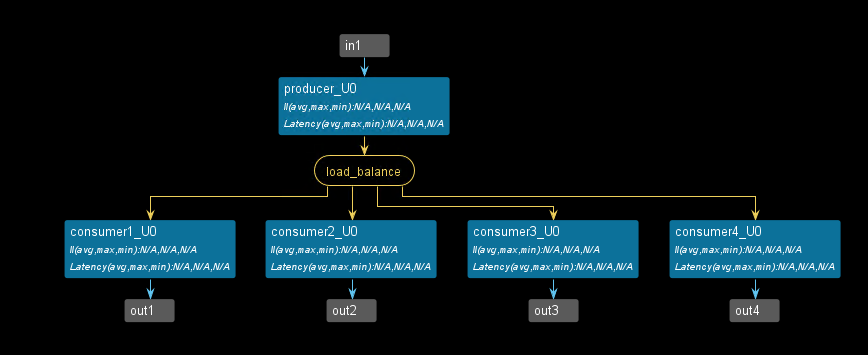</div>


**test_tb.cpp**
```c++
#include "test.h"

int main() {
    hls::stream<int> a;
    hls::stream<ap_uint<1>> e;
    hls::stream<ap_uint<32>> b1;
    hls::stream<ap_uint<32>> b2;
    hls::stream<ap_uint<32>> b3;
    hls::stream<ap_uint<32>> b4;
    int cnt1 = 0;
    int cnt2 = 0;
    int cnt3 = 0;
    int cnt4 = 0;

    for (int i = 0; i < 4; i++) {
        for (int j = 0; j < 4; j++) {
            a.write(j);
        }
    }

    dut(a, b1, b2, b3, b4);
    for(int i=0;i<4;i++)
    {
    	int tmp1 = b1.read();
    	printf("tmp1[%d] is %d ,",i,tmp1);
    	int tmp2 = b2.read();
    	printf("tmp2 is %d ,",tmp2);
	    int tmp3 = b3.read();
	    printf("tmp3 is %d ,",tmp3);
		int tmp4 = b4.read();
		printf("tmp4 is %d ,\r\n",tmp4);
    }

    return 0;
}
```

The result of the C simulation is shown below.

<div align=center>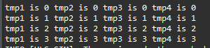</div>
 
###### split_round_robin

* Round-robin, where the consumers read the input data in a fixed rotating order, thus ensuring deterministic behavior but not allowing load sharing with dynamically varying computational loads for the workers.

```c++
hls::split::round_robin<DATATYPE, NUM_PORTS[, DEPTH]> name
```

```c++
void dut(hls::stream<int>& in1, hls::stream<ap_uint<32>>& out1,
         hls::stream<ap_uint<32>>& out2, hls::stream<ap_uint<32>>& out3,
         hls::stream<ap_uint<32>>& out4) {
#pragma HLS dataflow

    hls::split::round_robin<ap_uint<32>, 4, 2, 100> s;

    producer(s.in, in1);
    consumer1(s.out[0], out1);
    consumer2(s.out[1], out2);
    consumer3(s.out[2], out3);
    consumer4(s.out[3], out4);
}
```
The dataflow view is shown below.

<div align=center>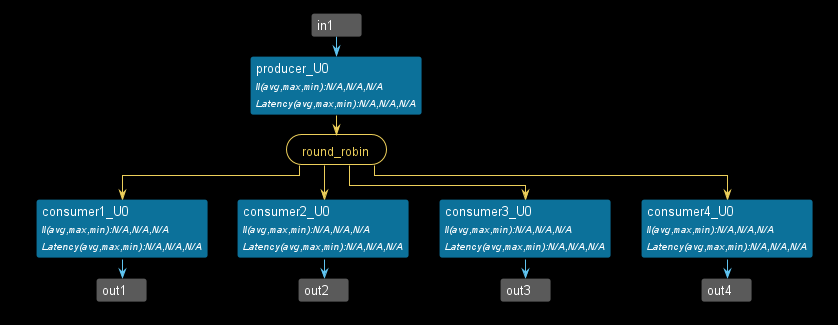</div>

The result of the C simulation is shown below.

<div align=center>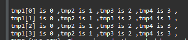</div>

## Demonstrate
Please finish the three ```bypasing``` writing styles and compare the differences between the ```merge``` and ```split``` pragma.

