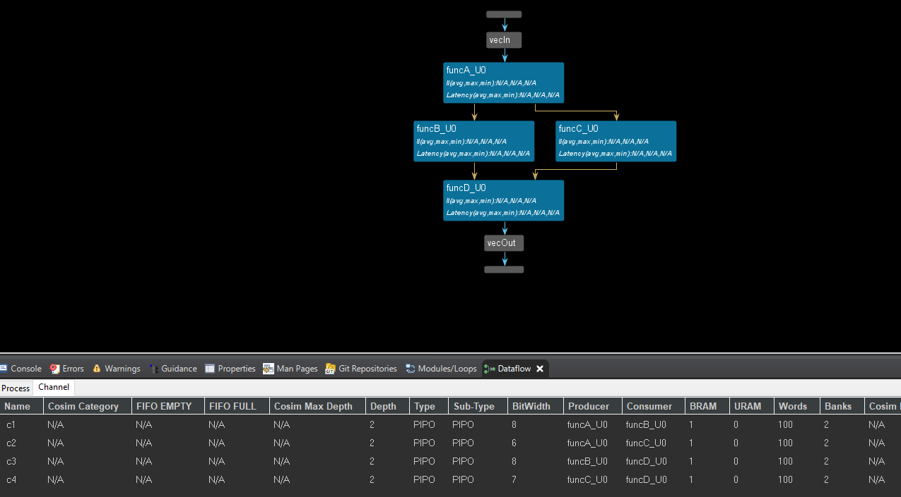
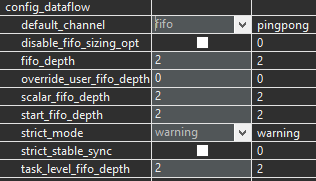
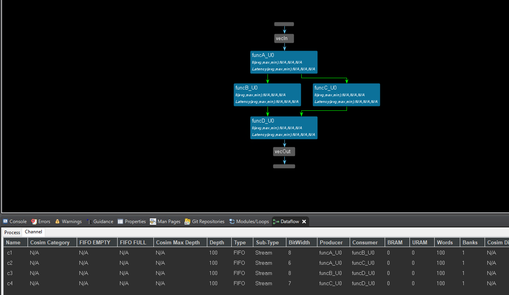
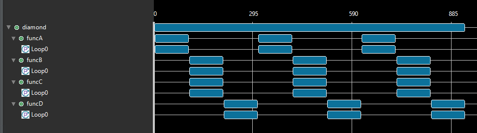
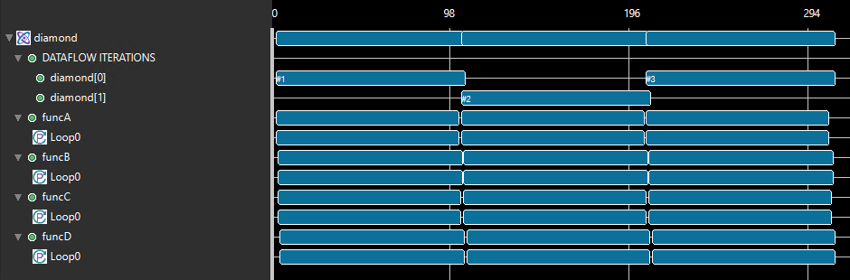
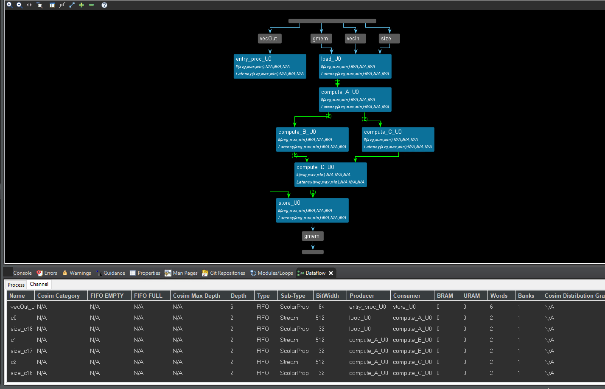
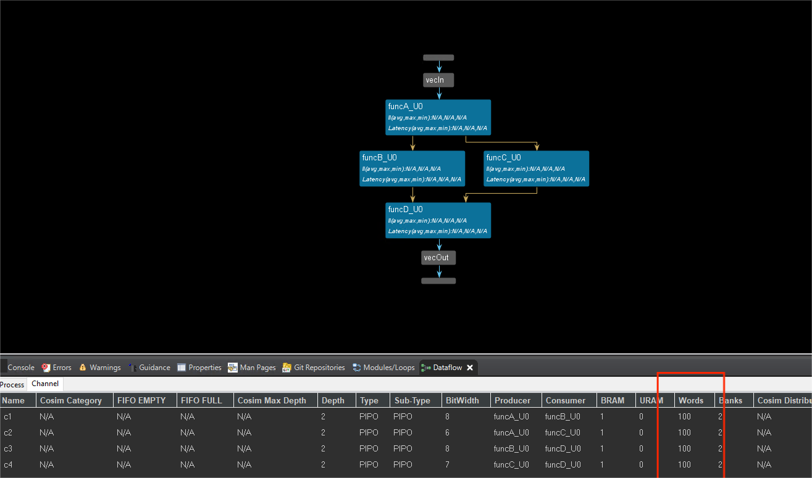
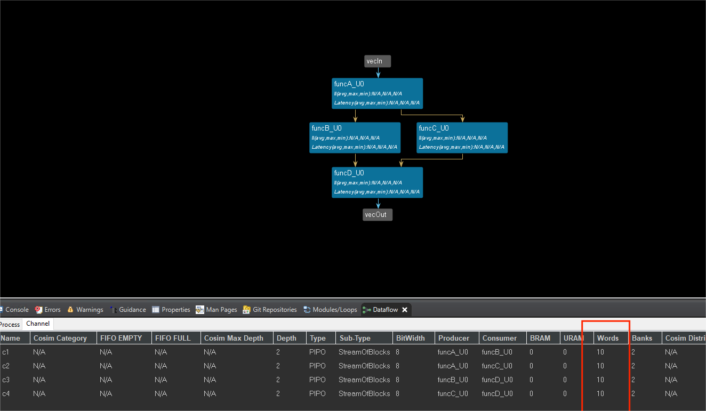

# Lab4 Task_level_Parallelism_control_driven_2

<script type="text/x-mathjax-config">
  MathJax.Hub.Config({
    tex2jax: {
        inlineMath: [ ['$','$'], ["\\(","\\)"] ],
        displayMath: [ ['$$','$$'], ["\\[","\\]"] ],
        processEscapes: false,
    }
  });
</script> 
    
<script type="text/javascript"
        src="https://cdn.mathjax.org/mathjax/latest/MathJax.js?config=TeX-AMS-MML_HTMLorMML">
</script>

#### Channel_2

The dataflow model takes this series of sequential functions and creates a task-level pipeline architecture of concurrent processes. The tool does this by inferring the parallel tasks and channels. The designer specifies the region to model in the dataflow style (for example, a function body or a loop body) by specifying the DATAFLOW pragma or directive as shown below. The tool scans the loop/function body, extracts the parallel tasks as parallel processes, and establishes communication channels between these processes. The designer can additionally guide the tool to select the type of channels - for example, ```FIFO``` (```hls::stream``` or ```#pragma HLS STREAM```) or ```PIPO``` or ```hls::stream_of_blocks```. The dataflow model is a powerful method for improving design throughput and latency.

##### Simple_fifos

This example shows how to use ```FIFOs``` as the channel type.

**diamond.h**
```c++
#define N 100
typedef unsigned char data_t;

// Top function
void diamond(data_t vecIn[N], data_t vecOut[N]);

// Sub functions
void funcA(data_t f1In[N], data_t f1Out[N], data_t f1bisOut[N]);
void funcB(data_t f2In[N], data_t f2Out[N]);
void funcC(data_t f3In[N], data_t f3Out[N]);
void funcD(data_t f4In[N], data_t f4bisIn[N], data_t f4Out[N]);
```

**diamond.cpp**
```c++
#include "diamond.h"

void diamond(data_t vecIn[N], data_t vecOut[N]) {
    data_t c1[N], c2[N], c3[N], c4[N];
#pragma HLS dataflow
    funcA(vecIn, c1, c2);
    funcB(c1, c3);
    funcC(c2, c4);
    funcD(c3, c4, vecOut);
}

void funcA(data_t* in, data_t* out1, data_t* out2) {
#pragma HLS inline off
Loop0:
    for (int i = 0; i < N; i++) {
#pragma HLS pipeline
        data_t t = in[i] * 3;
        out1[i] = t;
        out2[i] = t;
    }
}

void funcB(data_t* in, data_t* out) {
#pragma HLS inline off
Loop0:
    for (int i = 0; i < N; i++) {
#pragma HLS pipeline
        out[i] = in[i] + 25;
    }
}

void funcC(data_t* in, data_t* out) {
#pragma HLS inline off
Loop0:
    for (data_t i = 0; i < N; i++) {
#pragma HLS pipeline
        out[i] = in[i] * 2;
    }
}

void funcD(data_t* in1, data_t* in2, data_t* out) {
#pragma HLS inline off
Loop0:
    for (int i = 0; i < N; i++) {
#pragma HLS pipeline
        out[i] = in1[i] + in2[i] * 2;
    }
}
```
In the above example, there are four functions: ```funcA```, ```funcB```, ```funcC```, and ```funcD```. ```funcB``` and ```funcC``` do not have any data dependencies between them and therefore can be executed in parallel. ```funcA``` reads from the non-local memory (```vecIn```) and needs to be executed first. Similarly, ```funcD``` writes to the non-local memory (```vecOut```) and therefore has to be executed last.

The default_channel of the config_dataflow is ```PIPO``` and the dataflow view is shown below.

<div align=center></div>

We can set the optimization directives as ```config_dataflow -default_channel fifo -fifo_depth 2``` and like below.

<div align=center></div>

The dataflow view is shown below; we can see that the channel is ```FIFO```.

<div align=center></div>


**diamond_test.cpp**
```c++
#include "diamond.h"
#include <fstream>
#include <iostream>
using namespace std;

int main() {

    data_t test[N];
    data_t outcome[N];

    int retval = 0;


    // Init test vector
    for (int i = 0; i < N; i++) {
        test[i] = (data_t)i;
    }


    // Executing the DUT thrice
    for (int iter = 0; iter < 3; iter++) {
        // Execute DUT
        diamond(test, outcome);

        // Display the results
        for (int i = 0; i < N; i++) {
            cout << "Series " << iter;
            cout << " Outcome: " << (int)outcome[i] << endl;
        }
    }
}
```

The following waveform shows the execution profile of this design without the dataflow model. There are three calls to the function diamond from the test bench. ```funcB```, ```funcC```, and ```funcD``` are executed in sequential order. Each call to diamond, therefore, takes 475 cycles in total as shown in the following figure.

<div align=center></div>

In the following figure, when the dataflow model is applied and the designer selected to use ```FIFOs``` for channels, all the functions are started immediately by the controller and are stalled waiting on input. As soon as the input arrives, it is processed and sent out. Due to this type of overlap, each call to diamond now only takes 275 cycles in total as shown below. [Ref](https://docs.xilinx.com/r/en-US/ug1399-vitis-hls/Control-driven-Task-level-Parallelism)

<div align=center></div>


##### Using_fifos

The dataflow model is not limited to a chain of processes but can be used on any directed acyclic graph (DAG) structure, or cyclic structure when using hls::streams. It can produce two different forms of overlapping: within an iteration if processes are connected with ```FIFOs```, and across different iterations when connected with ```PIPOs``` and ```FIFOs```. This potentially improves performance over a statically pipelined solution. It replaces the strict, centrally-controlled pipeline stall philosophy with a distributed handshaking architecture using ```FIFOs``` and/or ```PIPOs```. The replacement of the centralized control structure with a distributed one also benefits the fanout of control signals, for example register enables, which is distributed among the control structures of individual processes.

All arrays are implemented by default as ```ping-pong``` to enable random access. These buffers can also be re-sized if needed. For example, in some circumstances, such as when a task is being bypassed, performance degradation is possible. To mitigate this effect on performance, you can give more slack to the producer and consumer by increasing the size of these buffers by using the STREAM pragma or directive as shown below.

This example shows how to use ```FIFOs``` instead of the default ```PIPOs``` as the channel type.

**diamond.h**
```c++
typedef unsigned int data_t;
#include <hls_stream.h>
#include <hls_vector.h>
#include <iostream>
#include <vector>

#define NUM_WORDS 16

// Each vector will be 64 bytes (16 x 4 bytes)
typedef hls::vector<uint32_t, NUM_WORDS> vecOf16Words;

extern "C" {
// Top function
void diamond(vecOf16Words* vecIn, vecOf16Words* vecOut, int size);
}

// Sub functions

void load(vecOf16Words* in, hls::stream<vecOf16Words>& out, int vSize);
void compute_A(hls::stream<vecOf16Words>& in, hls::stream<vecOf16Words>& out1,
               hls::stream<vecOf16Words>& out2, int vSize);
void compute_B(hls::stream<vecOf16Words>& in, hls::stream<vecOf16Words>& out,
               int vSize);
void compute_C(hls::stream<vecOf16Words>& in, hls::stream<vecOf16Words>& out,
               int vSize);
void compute_D(hls::stream<vecOf16Words>& in1, hls::stream<vecOf16Words>& in2,
               hls::stream<vecOf16Words>& out, int vSize);
void store(hls::stream<vecOf16Words>& in, vecOf16Words* out, int vSize);
```

**diamond.cpp**
```c++
#include "diamond.h"
#define NUM_WORDS 16
extern "C" {

void diamond(vecOf16Words* vecIn, vecOf16Words* vecOut, int size) {
// The depth setting is required for pointer to array in the interface.
#pragma HLS INTERFACE m_axi port = vecIn depth = 32
#pragma HLS INTERFACE m_axi port = vecOut depth = 32

    hls::stream<vecOf16Words> c0, c1, c2, c3, c4, c5;
    assert(size % 16 == 0);

#pragma HLS dataflow
    load(vecIn, c0, size);
    compute_A(c0, c1, c2, size);
    compute_B(c1, c3, size);
    compute_C(c2, c4, size);
    compute_D(c3, c4, c5, size);
    store(c5, vecOut, size);
}
}

void load(vecOf16Words* in, hls::stream<vecOf16Words>& out, int size) {
Loop_Ld:
    for (int i = 0; i < size; i++) {
#pragma HLS performance target_ti = 32
#pragma HLS LOOP_TRIPCOUNT max = 32
        out.write(in[i]);
    }
}

void compute_A(hls::stream<vecOf16Words>& in, hls::stream<vecOf16Words>& out1,
               hls::stream<vecOf16Words>& out2, int size) {
Loop_A:
    for (int i = 0; i < size; i++) {
#pragma HLS performance target_ti = 32
#pragma HLS LOOP_TRIPCOUNT max = 32
        vecOf16Words t = in.read();
        out1.write(t * 3);
        out2.write(t * 3);
    }
}

void compute_B(hls::stream<vecOf16Words>& in, hls::stream<vecOf16Words>& out,
               int size) {
Loop_B:
    for (int i = 0; i < size; i++) {
#pragma HLS performance target_ti = 32
#pragma HLS LOOP_TRIPCOUNT max = 32
        out.write(in.read() + 25);
    }
}

void compute_C(hls::stream<vecOf16Words>& in, hls::stream<vecOf16Words>& out,
               int size) {
Loop_C:
    for (data_t i = 0; i < size; i++) {
#pragma HLS performance target_ti = 32
#pragma HLS LOOP_TRIPCOUNT max = 32
        out.write(in.read() * 2);
    }
}
void compute_D(hls::stream<vecOf16Words>& in1, hls::stream<vecOf16Words>& in2,
               hls::stream<vecOf16Words>& out, int size) {
Loop_D:
    for (data_t i = 0; i < size; i++) {
#pragma HLS performance target_ti = 32
#pragma HLS LOOP_TRIPCOUNT max = 32
        out.write(in1.read() + in2.read());
    }
}

void store(hls::stream<vecOf16Words>& in, vecOf16Words* out, int size) {
Loop_St:
    for (int i = 0; i < size; i++) {
#pragma HLS performance target_ti = 32
#pragma HLS LOOP_TRIPCOUNT max = 32
        out[i] = in.read();
    }
}
```

The dataflow view is shown below. We can see the channel is ```FIFO```. We can see that the interface of the function is streaming with ```hls::stream```.

<div align=center></div>


##### Using_pipos

This example shows how to use the default PIPOs as the channel type.

**diamond.h**
```c++
#define N 100
typedef unsigned char data_t;

// Top function
void diamond(data_t vecIn[N], data_t vecOut[N]);

// Sub functions
void funcA(data_t f1In[N], data_t f1Out[N], data_t f1bisOut[N]);
void funcB(data_t f2In[N], data_t f2Out[N]);
void funcC(data_t f3In[N], data_t f3Out[N]);
void funcD(data_t f4In[N], data_t f4bisIn[N], data_t f4Out[N]);

```

**diamond.cpp**
```c++
#include "diamond.h"

void diamond(data_t vecIn[N], data_t vecOut[N]) {
    data_t c1[N], c2[N], c3[N], c4[N];
#pragma HLS dataflow
    funcA(vecIn, c1, c2);
    funcB(c1, c3);
    funcC(c2, c4);
    funcD(c3, c4, vecOut);
}

void funcA(data_t* in, data_t* out1, data_t* out2) {
Loop0:
    for (int i = 0; i < N; i++) {
#pragma HLS pipeline 

        data_t t = in[i] * 3;
        out1[i] = t;
        out2[i] = t;
    }
}

void funcB(data_t* in, data_t* out) {
Loop0:
    for (int i = 0; i < N; i++) {
#pragma HLS pipeline 

        out[i] = in[i] + 25;
    }
}

void funcC(data_t* in, data_t* out) {
Loop0:
    for (data_t i = 0; i < N; i++) {
  #pragma HLS pipeline     
        out[i] = in[i] * 2;
    }
}

void funcD(data_t* in1, data_t* in2, data_t* out) {
Loop0:
    for (int i = 0; i < N; i++) {
#pragma HLS pipeline 

        out[i] = in1[i] + in2[i] * 2;
    }
}
```
The dataflow view is shown below. We can see the channel is ```PIPO```.

<div align=center></div>

And compare the two examples, we can see that the difference between the use of ```FIFO``` and ```PIPO``` depends on the hls::stream. The Vitis HLS default optimization is ```PIPO```, but if we use the ```hls::stream``` to the type of data then the channel of dataflow is ```FIFO```. In essence, Vitis HLS defaults to ```PIPO``` for general efficiency, but automatically switches to ```FIFO``` when ```hls::stream``` is used to ensure correct dataflow behavior for streaming applications. The choice between ```PIPO``` and ```FIFO``` often involves trade-offs between hardware efficiency, latency, throughput, and algorithm requirements. Vitis HLS tools often provide pragmas or directives to control the type of dataflow channel used, allowing for fine-tuning based on specific needs.

PIPO (Push In, Push Out):

* Default optimization for most dataflow channels.

* Simpler hardware implementation (usually just registers).

* Can potentially lead to lower latency and higher throughput.

FIFO (First In, First Out):

* Used when a stricter ordering of data elements is necessary.

* Requires additional hardware resources (memory blocks).

##### Using_stream_of_blocks

The ```hls::strema_of_blocks``` type:

* supports streaming blocks of data for process-level interfaces in a dataflow context, where each block is an array or multidimensional array.

* replace array-based communication between a pair of processes within a dataflow region.

Currently, Vitis HLS implements arrays written by a producer process and read by a consumer process in a dataflow region by mapping them to ping pong buffers (```PIPOs```). The buffer exchange for a PIPO buffer occurs at the return of the producer function and the calling of the consumer function in C++.

On the other hand, for a stream-of-blocks the communication between the producer and the consumer is modeled as a stream of array-like objects, providing several advantages over array transfer through ```PIPO```. [Ref](https://docs.xilinx.com/r/en-US/ug1399-vitis-hls/Specifying-Arrays-as-Stream-of-Blocks)


The stream-of-blocks object template is:

```c++
hls::stream_of_blocks<block_type, depth> v
```

Where:

* <block_type> specifies the data type of the array or multidimensional array held by the stream-of-blocks

* <depth> is an optional argument that provides depth control like ```hls::stream``` or ```PIPOs```, and specifies the total number of blocks, including the one acquired by the producer and the one acquired by the consumer at any given time. The default value is 2

* ```v``` specifies the variable name for the stream-of-blocks object

Use the following steps to access a block in a stream of blocks:

* The producer or consumer process that wants to access the stream first needs to acquire access to it, using a ```hls::write_lock``` or ```hls::read_lock``` object.

* After the producer has acquired the lock it can start writing (or reading) the acquired block. Once the block has been fully initialized, it can be released by the producer, when the write_lock object goes out of scope.

Note: The producer process with a write_lock can also read the block as long as it only reads from already written locations, because the newly acquired buffer must be assumed to contain uninitialized data. The ability to write and read the block is unique to the producer process, and is not supported for the consumer.

* Then the block is queued in the stream-of-blocks in a FIFO fashion, and when the consumer acquires a read_lock object, the block can be read by the consumer process.
This example uses the same design as using_pipos and using_fifos designs to illustrate how the same design can be converted to use a stream of blocks (SOB) as the channel type.

While this ensures a concurrent communication semantic that is fully compliant with the sequential C++ execution semantics, it also implies that the consumer cannot start until the producer is done, as shown in the following code example.

```c++
void producer (int b[M][N], ...) {
  for (int i = 0; i < M; i++)
    for (int j = 0; j < N; j++)
      b[i][f(j)] = ...;
}
  
void consumer(int b[M][N], ...) {
   for (int i = 0; i < M; i++)
     for (int j = 0; j < N; j++)
       ... = b[i][g(j)] ...;;
}
  
void top(...) {
#pragma HLS dataflow
  int b[M][N];
#pragma HLS stream off variable=b
  
  producer(b, ...);
  consumer(b, ...);
}
```
This can unnecessarily limit throughput and/or increase resources if the producer generates data for the consumer in smaller blocks, for example by writing one row of the buffer output inside a nested loop, and the consumer uses the data in smaller blocks by reading one row of the buffer input inside a nested loop, as the example above does. In this example, due to the non-sequential buffer column access in the inner loop, you cannot simply stream the array b. However, the row access in the outer loop is sequential thus supporting ```hls::stream_of_blocks``` communication where each block is a 1-dimensional array of size N.

The main purpose of the ```hls::stream_of_blocks``` feature is to provide PIPO-like functionality but with user-managed explicit synchronization, accesses, and a better coding style. Stream-of-blocks lets you avoid the use of dataflow in a loop containing the producer and consumer, which would have been a way to optimize the example above. However, in this case, the use of the dataflow loop containing the producer and consumer requires the use of a ```PIPO``` buffer (2xN) as shown in the following example:

```c++
void producer (int b[N], ...) {
  for (int j = 0; j < N; j++)
    b[f(j)] = ...;
}
  
void consumer(int b[N], ...) {
   for (int j = 0; j < N; j++)
     ... = b[g(j)];
}
  
void top(...) {
// The loop below is very constrained in terms of how it must be written
  for (int i = 0; i < M; i++) {
#pragma HLS dataflow
    int b[N];
#pragma HLS stream off variable=b
  
    producer(b, ...); // writes b
    consumer(b, ...); // reads b
  }
}
```
The dataflow-in-a-loop code above is also not desirable because this structure has several limitations in Vitis HLS, such as the loop structure must be very constrained (single induction variable, starting from 0 and compared with a constant or a function argument and incremented by 1).

The main difference between ```hls::stream_of_blocks``` and the ```PIPO``` mechanism seen in the prior examples is that the block becomes available to the consumer as soon as the write_lock goes out of scope, rather than only at the return of the producer process. Therefore the amount of storage is much less with stream-of-blocks than with ```PIPOs```: namely 2N instead of 2xMxN.

The producer acquires the block by constructing an ```hls::write_lock``` object called b, and passing it the reference to the stream-of-blocks object, called s. The write_lock object provides an overloaded array access operator, letting it be accessed as an array to access underlying storage in random order as shown in the example below.

```c++
#include "hls_streamofblocks.h"
typedef int buf[N];
void producer (hls::stream_of_blocks<buf> &s, ...) {
  for (int i = 0; i < M; i++) {
    // Allocation of hls::write_lock acquires the block for the producer
    hls::write_lock<buf> b(s);
    for (int j = 0; j < N; j++)
      b[f(j)] = ...;
    // Deallocation of hls::write_lock releases the block for the consumer
  }
}
  
void consumer(hls::stream_of_blocks<buf> &s, ...) {
  for (int i = 0; i < M; i++) {
    // Allocation of hls::read_lock acquires the block for the consumer
    hls::read_lock<buf> b(s);
    for (int j = 0; j < N; j++)
       ... = b[g(j)] ...;
    // Deallocation of hls::write_lock releases the block to be reused by the producer
  }
}
  
void top(...) {
#pragma HLS dataflow
  hls::stream_of_blocks<buf> s;
  
  producer(b, ...);
  consumer(b, ...);
}
```

This example uses the same design as using_pipos and using_fifos designs to illustrate how the same design can be converted to use stream of blocks (SOB) as the channel type.

**diamond.h**
```c++
#include "hls_stream.h"
#include "hls_streamofblocks.h"

#define N 100
#define NUM_BLOCKS 10
typedef unsigned char data_t;
typedef data_t block_data_t[NUM_BLOCKS]

//block_data_t: The new name given to this custom array type.
//[NUM_BLOCKS]: Specifies the fixed size of the array at NUM_BLOCKS elements.

// Top function
void diamond(hls::stream<data_t>& vecIn, hls::stream<data_t>& vecOut);

// Sub functions
void funcA(hls::stream<data_t>& in, hls::stream_of_blocks<block_data_t>& out1,
           hls::stream_of_blocks<block_data_t>& out2);
void funcB(hls::stream_of_blocks<block_data_t>& in,
           hls::stream_of_blocks<block_data_t>& out);
void funcC(hls::stream_of_blocks<block_data_t>& in,
           hls::stream_of_blocks<block_data_t>& out);
void funcD(hls::stream_of_blocks<block_data_t>& in1,
           hls::stream_of_blocks<block_data_t>& in2, hls::stream<data_t>& out);
```

**diamond.cpp**
```c++
#include "diamond.h"

void diamond(hls::stream<data_t>& vecIn, hls::stream<data_t>& vecOut) {
#pragma HLS INTERFACE ap_ctrl_chain port = return

    hls::stream_of_blocks<block_data_t> c1, c2, c3, c4;

#pragma HLS dataflow
    funcA(vecIn, c1, c2);
    funcB(c1, c3);
    funcC(c2, c4);
    funcD(c3, c4, vecOut);
}

void funcA(hls::stream<data_t>& in, hls::stream_of_blocks<block_data_t>& out1,
           hls::stream_of_blocks<block_data_t>& out2) {
#pragma HLS INLINE off

funcA_Loop0:
    for (int i = 0; i < N / NUM_BLOCKS; i++) {
#pragma HLS pipeline II = 10

        // Obtain write locks for the two output channels
        hls::write_lock<block_data_t> out1L(out1);
        //the first name of the output channel is out1L and this channel receive the data from the out1
        hls::write_lock<block_data_t> out2L(out2);
      //the second name of the output channel is out2L and this channel receive the data from the out2
        // Read a block of 10 data items from the stream
    funcA_Loop1:
        for (unsigned int j = 0; j < NUM_BLOCKS; j++) {
            data_t t = in.read() * 3;
//The interface of in is the streaming type, so if we want to get the data from in, we should use the in.read().
            out1L[j] = t;
            out2L[j] = t;
        }
    }
}

void funcB(hls::stream_of_blocks<block_data_t>& in,
           hls::stream_of_blocks<block_data_t>& out) {
#pragma HLS INLINE off

funcB_Loop0:
    for (int i = 0; i < N / NUM_BLOCKS; i++) {
#pragma HLS pipeline II = 5

        // Obtain a read lock on the input channel
        // and a write lock for the output channel
        hls::read_lock<block_data_t> inL(in);
        hls::write_lock<block_data_t> outL(out);
    funcB_Loop1:
        for (unsigned int j = 0; j < NUM_BLOCKS; j++)
            outL[j] = inL[j] + 25;
    }
}

void funcC(hls::stream_of_blocks<block_data_t>& in,
           hls::stream_of_blocks<block_data_t>& out) {
#pragma HLS INLINE off

Loop0:
    for (data_t i = 0; i < N / NUM_BLOCKS; i++) {
#pragma HLS pipeline II = 5

        // Obtain a read lock on the input channel
        // and a write lock for the output channel
        hls::read_lock<block_data_t> inL(in);
        hls::write_lock<block_data_t> outL(out);
        for (unsigned int j = 0; j < NUM_BLOCKS; ++j)
            outL[j] = inL[j] * 2;
    }
}

void funcD(hls::stream_of_blocks<block_data_t>& in1,
           hls::stream_of_blocks<block_data_t>& in2, hls::stream<data_t>& out) {
#pragma HLS INLINE off

Loop0:
    for (int i = 0; i < N / NUM_BLOCKS; i++) {
#pragma HLS pipeline II = 10

        // Obtain two read locks on the input channels
        hls::read_lock<block_data_t> in1L(in1);
        hls::read_lock<block_data_t> in2L(in2);
        for (unsigned int j = 0; j < NUM_BLOCKS; ++j)
            out.write(in1L[j] + in2L[j] * 2);
    }
}
```

And we can see the dataflow view is shown below. This example divides 100 pieces of data into 10 stream_blocks and each stream_block contains 10 pieces of data. However, the input and output of the top-level function are read into and written out of ```hls::stream``` for data. And comparing with the previous example using PIPOs, we can see that although both are dataflow, the words contained in each ```PIPO``` channel are different. This is because the stream_block divides the entire 100 pieces of data into 10 blocks. From the dataflow view of the channel, we can see the words are different.

<div align=center></div>

But the initial interval(II) of the ```funcA``` is 10 not 1 because the number of each stream_blcok is 10 and each of stream_block is PIP0 channel. And the II of the ```funcB``` and ```funcC``` is 5 and the last ```funcD``` is 10.

<div align=center></div>

**diamond_test.cpp**
```c++
#include "diamond.h"
#include <fstream>
#include <iostream>
using namespace std;

int main() {

    hls::stream<data_t> test;
    hls::stream<data_t> outcome;

    int retval = 0;
   
    // Executing the DUT thrice
    for (int iter = 0; iter < 3; iter++) {

        // Init test vector
        for (int i = 0; i < N; i++) {
            test.write(i);
        }

        // Execute DUT
        diamond(test, outcome);

        // Display the results
        for (int i = 0; i < N; i++) {
            data_t outp = outcome.read();
            cout << "Series " << iter;
            cout << " Outcome: " << (int)outp << endl;           
        }
    }
}
```
## Demonstrate 
Please find the differences between the use of the fifos and pipos and the difference between the stream and stream_of_blocks.

