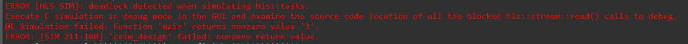
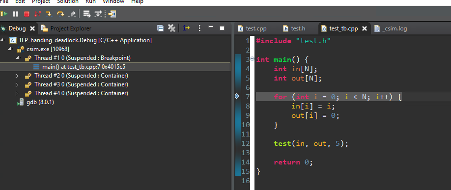
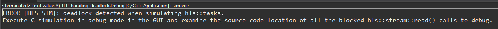
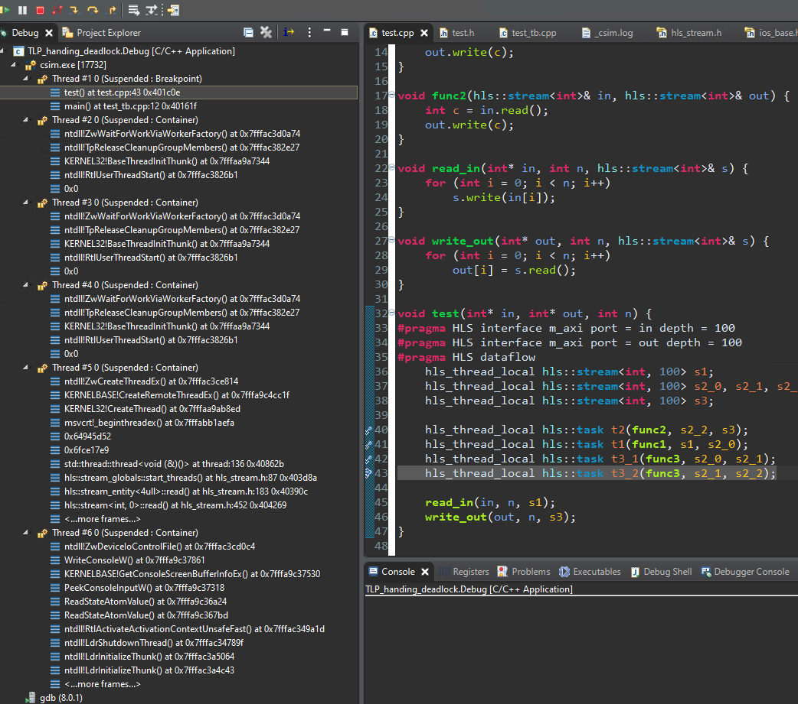
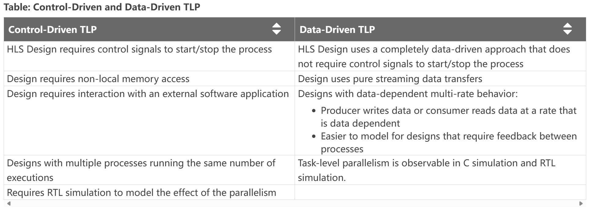
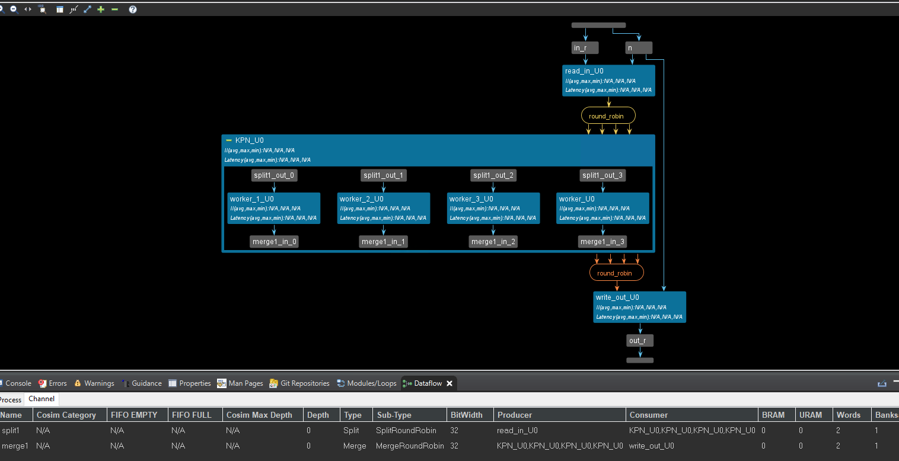
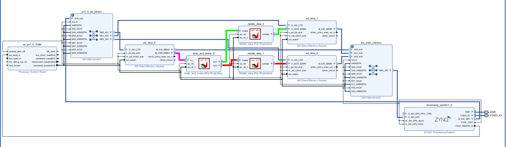
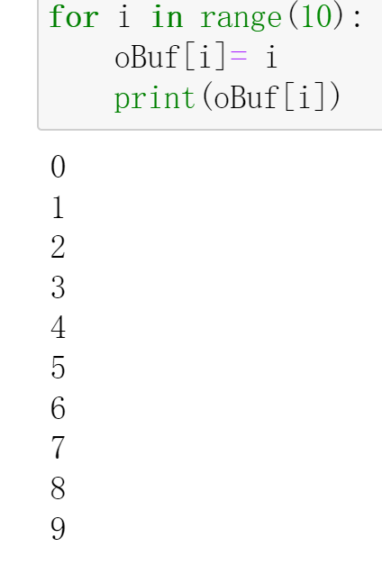
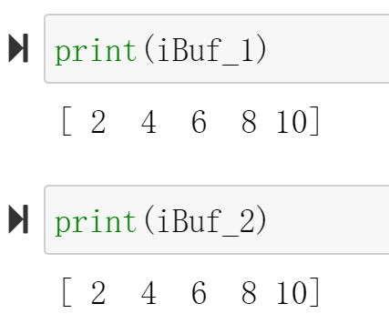

# Lab5 TLP_data_driven_1

<script type="text/x-mathjax-config">
  MathJax.Hub.Config({
    tex2jax: {
        inlineMath: [ ['$','$'], ["\\(","\\)"] ],
        displayMath: [ ['$$','$$'], ["\\[","\\]"] ],
        processEscapes: false,
    }
  });
</script> 
    
<script type="text/javascript"
        src="https://cdn.mathjax.org/mathjax/latest/MathJax.js?config=TeX-AMS-MML_HTMLorMML">
</script>

## Introduction

Data-driven task-level parallelism uses a task-channel modeling style that requires you to statically instantiate and connect tasks and channels explicitly. The tasks are not controlled by any function call/return semantics but rather are always running waiting for data on their input stream. Tasks in this modeling style typically only have stream type inputs and outputs. Data-driven TLP models are tasks that execute when there is data to be processed. In Vitis HLS C-simulation used to be limited to seeing only the sequential semantics and behavior. With the data-driven model it is possible during simulation to see the concurrent nature of parallel tasks and their interactions via the FIFO channels. [Ref](https://docs.xilinx.com/r/en-US/ug1399-vitis-hls/Data-driven-Task-level-Parallelism)

Implementing data-driven TLP in the Vitis HLS tool uses simple classes for modeling tasks ( ```hls::task``` ) and channels ( ```hls::stream```/```hls::stream_of_blocks``` ). While Vitis HLS supports hls::tasks for a top-level function, you cannot use ```hls::stream_of_blocks``` for interfaces in top-level functions.

The special ```hls::task``` C++ class is:

* A new object declaration in your source code that requires a special qualifier. The hls_thread_local qualifier is required to keep the object (and the underlying thread) alive across multiple calls of the instantiating function.

The hls_thread_local qualifier is only required to ensure that the C simulation of the data-driven TLP model exhibits the same behavior as the RTL simulation. In the RTL, these functions are already in always running mode once started. To ensure the same behavior during C Simulation, the hls_thread_local qualifier is required to ensure that each task is started only once and keeps the same state even when called multiple times. Without the hls_thread_local qualifier, each new invocation of the function would result in a new state.

* Task objects implicitly manage a thread that runs a function infinitely, passing to it a set of arguments that must be either hls::stream or hls::stream_of_blocks

No other types of arguments are supported. In particular, even constant values cannot be passed as function arguments. If constants need to be passed to the task's body, define the function as a templated function and pass the constant as a template argument to this templated function.

* The supplied function is called the task body, and it has an implicit infinite loop wrapped around it to ensure that the task keeps running and waiting on input.

* The supplied function can contain pipelined loops but they need to be flushable pipelines (FLP) to prevent deadlock. The tool automatically selects the right pipeline style to use for a given pipelined loop or function.
* 
In general, ```hls::task``` designs must use flushing pipelines (```flp```) or free-running pipelines (```frp```), as described in Flushing Pipelines and Pipeline Types [Ref](https://docs.xilinx.com/r/en-US/ug1399-vitis-hls/Flushing-Pipelines-and-Pipeline-Types). Non-flushing pipelines introduce dependencies between process executions and can result in unexpected deadlocks.

### Handing_deadlock

Due to the fact that a read of an empty stream is a blocking read, deadlocks can occur due to:

* The design itself, where the production and consumption rates by processes are unbalanced.

During C simulation, deadlocks can occur only due to a cycle of processes, or a chain of processes starting from a top-level input, that are attempting to read from empty channels.
Deadlocks can occur during both C/RTL Co-simulation and when running in hardware (HW) due to cycles of processes trying to write to full channels and/or reading from empty channels.

* The test bench, which is providing less data than those that are needed to produce all the outputs that the test bench is expecting when checking the computation results.

A deadlock is a situation in which processes inside a DATAFLOW region share the same channels, effectively preventing each other from writing to it or reading from it, resulting in both processes getting stuck. This scenario is common when there are either FIFO’s or a mix of PIPOs and FIFOs as channels inside the DATAFLOW.

* A situation where two or more processes or threads are blocked, permanently waiting for each other to release resources they need to proceed.

* Results in complete standstill, as none of the involved processes can make progress.

This example shows how to debug a data-driven task-level parallelsim model that deadlocks when running C simulation.

**test.h**
```c++
#include "hls_task.h"

#define N 100

void test(int* in, int* out, int n);
```

**test.cpp**
```c++
#include "test.h"

void func1(hls::stream<int>& in, hls::stream<int>& out) {
    int offset;
    int c = in.read();
    offset = 0;
    offset = offset << 16;
    out.write(c + offset);
}

void func3(hls::stream<int>& in, hls::stream<int>& out) {
    int c = in.read(); // First read
    c = in.read();     // Second read CAUSES DEADLOCK
    out.write(c);
}

void func2(hls::stream<int>& in, hls::stream<int>& out) {
    int c = in.read();
    out.write(c);
}

void read_in(int* in, int n, hls::stream<int>& s) {
    for (int i = 0; i < n; i++)
        s.write(in[i]);
}

void write_out(int* out, int n, hls::stream<int>& s) {
    for (int i = 0; i < n; i++)
        out[i] = s.read();
}

void test(int* in, int* out, int n) {
#pragma HLS interface m_axi port = in depth = 100
#pragma HLS interface m_axi port = out depth = 100
#pragma HLS dataflow
    hls_thread_local hls::stream<int, 100> s1;
    hls_thread_local hls::stream<int, 100> s2_0, s2_1, s2_2;
    hls_thread_local hls::stream<int, 100> s3;

    hls_thread_local hls::task t2(func2, s2_2, s3);
    hls_thread_local hls::task t1(func1, s1, s2_0);
    hls_thread_local hls::task t3_1(func3, s2_0, s2_1);
    hls_thread_local hls::task t3_2(func3, s2_1, s2_2);

    read_in(in, n, s1);
    write_out(out, n, s3);
}
```

**test_tb.cpp**
```c++
#include "test.h"

int main() {
    int in[N];
    int out[N];

    for (int i = 0; i < N; i++) {
        in[i] = i;
        out[i] = 0;
    }

    test(in, out, 5);

    return 0;
}
```

After the Run C Simulation, we will see the error below.

<div align=center></div>

And then in the window, (titled "C Simulation Dialog") that pops up, select the "Launch Debugger" option and click "OK".

<div align=center></div>

The debugging process is currently stopped in the main() function. Click the "Resume" icon (Top Left-most Green Triangle Icon) to continue the simulation.

<div align=center></div>

Click "Resume" causes the simulation to run and you will see the "deadlock detected when simulating hls::tasks" in the Console window. 

<div align=center></div>

In the Debug window, you can see all the task Threads that are Suspended state. Step into each thread and select the line in the user code to see where each thread is stalled. Look for the function names to identify each thread. 

Stepping through the threads, you will see two tasks t3_1 and t3_2 (usually Thread #5 and #6 but this could be different on your machine but both running function func3) stuck reading their input streams.

<div align=center></div>

### Mixed_control_and_data_driven

The following table highlights factors of the HLS design that can help you determine when to apply control-driven task-level parallelism (TLP) or data-driven TLP. [Ref](https://docs.xilinx.com/r/en-US/ug1399-vitis-hls/Mixing-Data-Driven-and-Control-Driven-Models)

<div align=center></div>

As the preceding table indicates, the two forms of task-level parallelism presented have different use cases and advantages. However, sometimes it is not possible to design an entire application that is purely data-driven TLP, while some portion of the design can still be constructed as a purely streaming design. In this case, a mixed control-driven/data-driven model can be useful to create the application.

Two types of task-level parallelism (TLP) models can be used to structure and design your application. TLP can be data-driven or control-driven, or can mix control-driven and data-driven tasks in a single design. The main differences between these two models are:

* If your application is purely data-driven, does not require any interaction with external memory and the functions can execute in parallel with no data dependencies, then the data-driven TLP model is the best fit. You can design a purely data-driven model that is always running, requires no control, and reacts only to data. For additional details refer to Data-driven Task-level Parallelism.

* If your application requires some interaction with external memory, and there are data dependencies between the tasks that execute in parallel, then the control-driven TLP model is the best fit. Vitis HLS infers the parallelism between tasks and creates the right channels (as defined by you) such that these functions can be overlapped during execution. The control-driven TLP model is also known as the dataflow optimization in Vitis HLS as described in Control-driven Task-level Parallelism.

```hls::task ``` also supports the definition of tasks inside of dataflow regions. The dataflow region allows the definition of processes that access external arrays mapped to M_AXI, scalar, or PIPO arguments from upper levels of the design hierarchy. This requires dataflow processes identified by the ```#pragma HLS dataflow``` statement, synchronized via ```ap_ctrl_chain```, that read data from any non-streamed C++ data structure and output it as ```hls::stream``` or ```hls::stream_of_blocks``` channels for connection to ```hls::tasks```. Tasks can then output streams that are read by other dataflow processes and written to M_AXI, scalar, or PIPO arguments. Tasks must be declared after the processes or regions that produce their input streams, and before the processes or regions that consume their output streams. [Ref](https://docs.xilinx.com/r/en-US/ug1399-vitis-hls/Tasks-and-Dataflow)

Important: Because ```hls::task``` objects cannot read or write M_AXI, scalar, or PIPO arguments dataflow processes must read or write these interfaces and write or read stream channels to ```hls::task``` as shown in the example below.

This example shows how to use both Control-driven and Data-driven Task-level parallelism models in the same design.

**test.h**
```c++
#include "hls_np_channel.h"
#include "hls_task.h"

const int N = 16;
const int NP = 4;

void dut(int in[N], int out[N], int n);
```
**test.cpp**
```c++
#include "test.h"

void worker(hls::stream<int>& in, hls::stream<int>& out) {
    int i = in.read();
    int o = i * 2 + 1;
    out.write(o);
}

void read_in(int* in, int n, hls::stream<int>& out) {
    for (int i = 0; i < n; i++) {
        out.write(in[i]);
    }
}

void write_out(hls::stream<int>& in, int* out, int n) {
    for (int i = 0; i < n; i++) {
        out[i] = in.read();
    }
}

void dut(int in[N], int out[N], int n) {
    hls_thread_local hls::split::round_robin<int, NP> split1;
    hls_thread_local hls::merge::round_robin<int, NP> merge1;
#pragma HLS dataflow

    read_in(in, n, split1.in);

    // Task-Channels
    hls_thread_local hls::task t[NP];
    for (int i = 0; i < NP; i++) {
#pragma HLS unroll
        t[i](worker, split1.out[i], merge1.in[i]);
    }

    write_out(merge1.out, out, n);
}

```

In the above example, there are two distinct regions - a dataflow region that has the functions read_in/write_out in which the sequential semantics are preserved - for example, read_in can be executed before write_out and a task-channel region that contains the dynamic instantiation of 4 tasks (since NP = 4 in this example) along with some special type of channels called a split or a merge channel. A split channel has a single input but has multiple outputs - in this case, the split channel has 4 outputs. Similarly, a merge channel has multiple inputs but only one output.

In addition, to the ports, these channels also support an internal job scheduler. In the above example, both the merge and the split channels have selected a round-robin scheduler that assigns the incoming data to each of the 4 tasks, one by one starting with worker_U0. If a load balancing scheduler had been chosen then the incoming data would have been assigned to the first available worker task (and this would lead to a non-deterministic simulation since this order might be different each time you run the simulation). Because this is a pure task-channel region, the 4 tasks are executed in parallel as soon as there is data in their incoming stream.

It is important to note that, although the code above can give the impression that each task is "called" in the loop, and connected to a potentially different pair of channels every time the loop body is executed, in reality, this usage implies a static instantiation, i.e.:

* each t[i] (...) call must be executed exactly once per execution of dut().

* the loop over i must be fully unrolled, to infer a corresponding set of 4 instances in RTL.

* The dut() function must be called exactly once by the test bench.

* Each split output or merge input must be bound to exactly one ```hls::task``` instance.

While it is true that for ```hls::task``` objects the order of specification does not matter, for the control-driven dataflow network, Vitis HLS must be able to see that there is a chain of processes, such as from read_in to write_out. To define this chain of processes, Vitis HLS uses the calling order, which for ```hls::task``` is also the declaration order. This means that the model must define an explicit order from the read_in function to the ```hls::task``` region and then finally to the write_out function in the dataflow region as shown in the example above.

Generally:
If a control-based process (i.e. regular dataflow) produces a stream for an ```hls::task```, then it must be called before the declaration of the tasks in the code
If a control-based process consumes a stream from an ```hls::task```, then it must be called after the declaration of the tasks in the code
Violation of the above rules can cause unexpected outcomes because each of the NP ```hls::task``` instances is statically bound to the channels that are used in the first invocation of t[i](...).

```#pragma HLS DATAFLOW``` is required for the two sequential functions, but the hls::task objects do not require it. Internally, Vitis HLS will automatically split top-func, including both regular dataflow processes and ```hls::task``` processes into two dataflow regions:

* One dataflow region using ```ap_ctrl_chain``` that contains regular dataflow processes, like ```read_in()``` and ```write_out()```, in the order in which they appear in the C++ code, and a call to the ```ap_ctrl_none``` region below

* A second dataflow region using ```ap_ctrl_none``` containing the task and channels.

As shown in the figure below, data is read from an input stream and split through the round-robin scheduler mechanism, and distributed to associated worker tasks. After a worker completes the task, it writes the output which is merged also using the round-robin scheduler, into a single stream.

<div align=center></div>

In the above code, we can see that the interface of the ```dut()``` function is array not streaming. The dut function processes an input array in of size n and produces an output array out.

Key Features:

* Employs a round-robin splitting and merging mechanism for data distribution and collection.

* Potentially utilizes task-level parallelism for concurrent processing.

Declarations:

* hls_thread_local split and merge channels for round-robin distribution and collection (assuming thread-local behavior).

* #pragma HLS dataflow: Likely instructs the HLS compiler to create a dataflow-style pipeline for efficient execution.

Processing:
* Loop to create NP tasks, potentially launching them concurrently: hls_thread_local task objects (t[i]) potentially for thread-specific tasks.

* #pragma HLS unroll: Possibly instructs the compiler to unroll the loop for performance optimization.

* t[i] (worker, split1.out[i], merge1.in[i]): Each task likely calls a worker function (not shown) to process data from split1.out[i] and send results to merge1.in[i].

This example is typical for the mixed control and data-driven. You can see that the interface of the top function is an array, while the interface of the inner function is streaming. This is the outcome for the ```hls::task```. Implementing data-driven TLP in the Vitis HLS tool uses simple classes for modeling tasks ( ```hls::task``` ) and channels ( ```hls::stream```/```hls::stream_of_blocks``` ).

**test_tb.cpp**
```c++
#include "test.h"
#include <cstdio>

int main() {
    int a[N];
    int b[N];

    for (int i = 0; i < N; i++)
        a[i] = i;
    dut(a, b, N);
    for (int i = 0; i < N; i++) {
        if (b[i] != a[i] * 2 + 1) {
            printf("i=%d %d!=%d FAIL\n", i, b[i], a[i] * 2 + 1);
            return 1;
        }
    }
    return 0;
}

```

### Simple_data_driven

The original DATAFLOW model lets you write sequential functions, and then requires the AMD Vitis™ HLS tool to identify dataflow processes (tasks) and make them parallel, analyze and manage dependencies, perform scalar propagation and optimizations such as array-to-stream. Alternatively, the use of ```hls::task``` objects requires you to explicitly instantiate tasks and channels, managing parallelization yourself in your algorithm design. The purpose of ```hls::task``` is to define a programming model that supports parallel tasks using only streaming data channels. Tasks are not controlled by function call/return, but run whenever data is present in the input streams. The ```hls::task``` library provides concurrent semantics so that the C-simulation will be consistent with the RTL. This eliminates some of the problems with the sequential dataflow model.

This example shows how to use the data-driven task-level parallelism model in a design. 

**test. h**
```c++
#include "hls_task.h"

#define N 10

void odds_and_evens(hls::stream<int>& in, hls::stream<int>& out1,
                    hls::stream<int>& out2);

```

**test.cpp**
```c++
#include "test.h"

void splitter(hls::stream<int>& in, hls::stream<int>& odds_buf,
              hls::stream<int>& evens_buf) {
#pragma HLS INTERFACE ap_ctrl_none port=return
#pragma HLS INTERFACE mode=AXIS port=in register_mode=off
#pragma HLS INTERFACE mode=AXIS port=odds_buf register_mode=off
#pragma HLS INTERFACE mode=AXIS port=evens_buf register_mode=off
#pragma HLS PIPELINE II=1 style=flp
    int data = in.read();
    if (data % 2 == 0)
        evens_buf.write(data);
    else
        odds_buf.write(data);
}

void odds(hls::stream<int>& in, hls::stream<int>& out) {
#pragma HLS INTERFACE ap_ctrl_none port=return
#pragma HLS INTERFACE mode=AXIS port=in register_mode=off
#pragma HLS INTERFACE mode=AXIS port=out register_mode=off
#pragma HLS PIPELINE II=1 style=flp
    out.write(in.read() + 1);
}

void evens(hls::stream<int>& in, hls::stream<int>& out) {
#pragma HLS INTERFACE ap_ctrl_none port=return
#pragma HLS INTERFACE mode=AXIS port=in register_mode=off
#pragma HLS INTERFACE mode=AXIS port=out register_mode=off
#pragma HLS PIPELINE II=1 style=flp
    out.write(in.read() + 2);
}

void odds_and_evens(hls::stream<int>& in, hls::stream<int>& out1,
                    hls::stream<int>& out2) {
#pragma HLS INTERFACE ap_ctrl_none port=return
#pragma HLS INTERFACE mode=AXIS port=in register_mode=off
#pragma HLS INTERFACE mode=AXIS port=out1 register_mode=off
#pragma HLS INTERFACE mode=AXIS port=out2 register_mode=off
    hls_thread_local hls::stream<int, N / 2> s1; // channel connecting t1 and t2
    hls_thread_local hls::stream<int, N / 2> s2; // channel connecting t1 and t3

    // t1 infinitely runs func1, with input in and outputs s1 and s2
    hls_thread_local hls::task t1(splitter, in, s1, s2);

    // t2 infinitely runs func2, with input s1 and output out1
    hls_thread_local hls::task t2(odds, s1, out1);

    // t3 infinitely runs func3, with input s2 and output out2
    hls_thread_local hls::task t3(evens, s2, out2);
}
```
Notice the top-level function, ```odds_and_evens``` uses streaming input and output interfaces. This is a purely streaming kernel. The top-level function includes the following:


* s1 and s2 are thread-local streams (```hls_thread_local```) and are used to connect the task-channel tasks t1 and t2. These streams need to be thread-local so that they can be kept alive across top-level calls.

* t1, t2, and t3 are the thread-local ```hls::task``` that execute the functions (```splitter```, ```odds```, and ```evens``` respectively). The tasks run infinitely and process data on their input streams. No synchronization is needed.

However, this type of stream-only model does have some restrictions such as:

* You cannot access non-local memory 

* Non-stream data, such as scalars, arrays, and pointers, can be passed in as arguments, provided these ports are declared stable via the STABLE pragma. Currently top pointers with ```m_axi``` interface can be passed only with the ```offset=off``` option

Important: Scalars, arrays and pointers will be read at unknown intervals as there is no synchronization with ```hls::task```. So the code needs to be written such that it does not depend on when these ports are read.

* You must explicitly describe the parallelism in the design by the specification of parallel tasks

* An ```hls::task``` must always be instantiated in a parallel context and can not be nested in a sequential context

* If you use ```hls::task``` in your top function, then the top function becomes a parallel context

* You can instantiate an ```hls::task``` inside a dataflow region as it is a parallel context

* In a sequential context, if you call a function that instantiates a task:

* The function must be a parallel context such as a dataflow region

* The task inputs and output streams must be produced and consumed by regular dataflow processes in the parallel context

* Control-driven TLP can be at the top, inside another control-driven, or a sequential region

* Data-driven can be at top, inside another data-driven, or nested between control-driven tasks

* Control-driven TLP cannot be inside a pipeline or DIRECTLY inside data-driven. In the la,tter case, it must be inside a sequential region executed by a data-driven task

* Data-driven cannot be directly inside a sequential, pipeline or control driven

* A sequential region, or a pipeline can only be inside the body of a control or data-driven TASK (not a control or data-driven region)

The ```hls::task``` objects can be mixed freely with standard dataflow-style function calls, which can move data in and out of memories (DRAM and BRAM). Tasks also support splitting channels (```hls::split```) to support one-to-many data distributions to build pools of workers that process streams of data, and merging channels (```hls::merge```) to support many-to-one data aggregation.

The following diagram shows the graphical representation in Vitis HLS of the code example above. In this diagram, the green colored arrows are FIFO channels while the blue arrows indicate the inputs and outputs of the instantiating function (odds_and_evens). Tasks are shown as blue rectangular boxes.

<div align=center></div>

In summary, the ```hls::task``` model is recommended if your design requires a completely data-driven, pure streaming type of behavior, with no sort of control. This type of model is also useful in modeling feedback and dynamic multi-rate designs. Feedback in the design occurs when there is a cyclical dependency between tasks. Dynamic multi-rate models, where the producer writes data or consumer reads data at a rate that is data dependent, can only be handled by the data-driven TLP.

**test_tb.cpp**
```c++
#include "test.h"

int main() {

    hls::stream<int, N> in;
    hls::stream<int, N / 2> out1;
    hls::stream<int, N / 2> out2;

    for (int i = 0; i < N; i++)
        in.write(i);

    odds_and_evens(in, out1, out2);

    int sum1 = 0, sum2 = 0;
    for (int i = 0; i < N / 2; i++)
    {
    	sum1 += out1.read();
    	printf("sum1 is %d\r\n",sum1);
    }


    for (int i = 0; i < N / 2; i++)
    {
    	   sum2 += out2.read();
    	   printf("sum2 is %d\r\n",sum2);
    }

    return 0;
}

```

#### Export the test.IP

* Run C simulation and see the result whether is correct

* Run C synthesis and see the dataflow view

* Run Cosimulation and you can see the *PASS* if everything is good

* Export RTL and choose the directory that you want to export IP

We also need to set the last and keep signals for the AXIS interface so that this IP can communicate with DMA.

Here, we can additionally generate a ```middle_data``` IP to provide the last and keep signals.

**middle.h**
```c++
#ifndef _MIDDLE_H
#define _MIDDEL_H


#include <stdio.h>
#include "hls_stream.h"
#include <assert.h>
#include <ap_fixed.h>
#include <ap_axi_sdata.h>


#define num 5

// the number of the data for the IP

typedef hls::axis<int,0,0,0> data_t_pack;
typedef hls::stream<data_t_pack> d_stream;


void middle_data(d_stream &indata,d_stream &outdata);


#endif
```

**middle.cpp**
```c++
#include "middle.h"

void middle_data(d_stream &indata,d_stream &outdata)
{
#pragma HLS INTERFACE ap_ctrl_none port=return
#pragma HLS INTERFACE mode=axis port=indata
#pragma HLS INTERFACE mode=axis port=outdata
#pragma HLS PIPELINE II=1 style=flp
	data_t_pack valuein;
	data_t_pack valueout;
static int counter=0;
	int datain;
	int dataout;
	valuein.keep=-1;
	valuein.last=0;
	valueout.keep=-1;

	valuein=indata.read();
	datain=valuein.data;

	valueout.data=datain;

	if(counter==num-1)
	{
		valueout.last=1;
		counter=0;
	}
	else
	{
		valueout.last=0;
		counter++;

	}
	outdata.write(valueout);


}

```

**middle_tb.cpp**
```c++
#include "middle.h"

int main()
{

	d_stream indata;
	d_stream outdata;
	data_t_pack  valuein;
	data_t_pack  valueout;
	for(int i=0;i<num;i++)
	{
		valuein.data=i+1;
		indata.write(valuein);
middle_data(indata,outdata);
	}

	for(int j=0;j<num;j++)
	{
		valueout=outdata.read();

		printf("outdata is %d\r\n",valueout.data);
	}
}

```

And export the IP core based on the above operations.

#### Create the Vivado project

The configure block design can use reference materials [here](https://uri-nextlab.github.io/ParallelProgammingLabs/HLS_Labs/Lab1.html)

<div align=center></div>

#### Run synthesis,  Implementation and generate bitstream

It may shows some errors about I/O Ports, please fix them.

#### Download the bitstream file to PYNQ

The first step is to allocate the buffer. pynq allocate will be used to allocate the buffer, and NumPy will be used to specify the type of the buffer.

```python
from pynq import Overlay
from pynq import allocate
import numpy as np
import time
```

<div align=center></div>

#### Create DMA instances

Using the labels for the DMAs listed above, we can create three DMA objects.

```python

hw = Overlay('design_1.bit')
mm2s = hw.axi_dma_0.sendchannel
s2mm_1 = hw.axi_dma_1.recvchannel
s2mm_2 = hw.axi_dma_2.recvchannel
```

#### Read DMA

The first step is to allocate the buffer. pynq.allocate will be used to allocate the buffer, and NumPy will be used to specify the type of the buffer.

```python
N = 5
iBuf_1 = allocate(shape=(N,), dtype = np.int32)
iBuf_2 = allocate(shape=(N,), dtype = np.int32)
oBuf = allocate(shape=(10,), dtype = np.int32)
for i in range(10):
    oBuf[i]= i
    print(oBuf[i])
```

Print the value of input_buffer, you will see:

<div align=center></div>

```python
mm2s.transfer(oBuf)
s2mm_1.transfer(iBuf_1)
s2mm_2.transfer(iBuf_2)
mm2s.wait()
s2mm_1.wait()
s2mm_2.wait()


```

We will see:

<div align=center></div>

## Demonstrate
Please finish a function in a data-driven style and implement it on the PYNQ-Z2 board.

