# Lab6 TLP_data_driven_2

<script type="text/x-mathjax-config">
  MathJax.Hub.Config({
    tex2jax: {
        inlineMath: [ ['$','$'], ["\\(","\\)"] ],
        displayMath: [ ['$$','$$'], ["\\[","\\]"] ],
        processEscapes: false,
    }
  });
</script> 
    
<script type="text/javascript"
        src="https://cdn.mathjax.org/mathjax/latest/MathJax.js?config=TeX-AMS-MML_HTMLorMML">
</script>

### Unique_task_regions

This example shows how to call a dataflow function that contains a task region. Recall that a ```hls: task``` should not be treated as a function call - instead a ```hls::task``` needs to be thought of as a persistent instance statically bound to channels. Due to this, it will be your responsibility to ensure that multiple invocations to any function that contains hls::tasks are uniquified or these calls will use the same ```hls::tasks``` and channels.

This example shows how you can use the function template instances to uniquify such dataflow functions that contain a ```hls::task``` region. 

**test.h**
```c++
#include "hls_task.h"

void top(hls::stream<int>& in1, hls::stream<int>& out1, hls::stream<int>& in2,
         hls::stream<int>& out2, hls::stream<int>& in3, hls::stream<int>& out3,
         hls::stream<int>& in4, hls::stream<int>& out4);

```

**test.cpp**
```c++
#include "test.h"

void copy(hls::stream<int>& in, hls::stream<int>& out) {
#pragma HLS INTERFACE ap_ctrl_none port=return
#pragma HLS INTERFACE mode=AXIS port=in register_mode=off
#pragma HLS INTERFACE mode=AXIS port=out register_mode=off
#pragma HLS PIPELINE style=flp II=1
    for (int i = 0; i < 8; i++)
        out.write(in.read());
}
//Copies 8 elements from one stream to another, demonstrating basic stream usage.
void func(hls::stream<int>& in, hls::stream<int>& out) {
#pragma HLS INTERFACE ap_ctrl_none port=return
#pragma HLS INTERFACE mode=AXIS port=in register_mode=off
#pragma HLS INTERFACE mode=AXIS port=out register_mode=off
    int cnt = 0;
    // This loop is only needed for the persistent variable above
    while (1) {
#pragma HLS pipeline off
        int t = in.read();
        out.write(t + cnt++);
    }
}
//Represents a persistent task with an internal counter (cnt).
//Reads from its input stream, increments and adds cnt to the value, and writes to its output stream.
//#pragma HLS pipeline off disables hardware pipelining within this task.

template <typename>
void mid(hls::stream<int>& in1, hls::stream<int>& out1, hls::stream<int>& in2,
         hls::stream<int>& out2) {
#pragma HLS INTERFACE mode=AXIS port=in1 register_mode=off
#pragma HLS INTERFACE mode=AXIS port=out1 register_mode=off
#pragma HLS INTERFACE mode=AXIS port=in2 register_mode=off
#pragma HLS INTERFACE mode=AXIS port=out2 register_mode=off
#pragma HLS dataflow
    HLS_TASK_STREAM<int> in1_t, out1_t, in2_t, out2_t;//HLS_TASK_STREAM hls_thread_local hls::stream
    copy(in1, in1_t);
    copy(in2, in2_t);

    HLS_TASK t1(func, in1_t, out1_t);// HLS_TASK hls_thread_local hls::task
    HLS_TASK t2(func, in2_t, out2_t);

    copy(out1_t, out1);
    copy(out2_t, out2);
}
//Encapsulates a dataflow region with two tasks (t1, t2), each running func.
//Uses task streams for direct task communication.
//Copies data between external streams and task streams for input/output.

//We can see that the ```copy()``` function contains loop and the ```func()``` function contains ```while(1)```. 
//The dataflow region contain two parts, one is the ```copy()``` and the other is the ```func()```. The task should be data_drivn, so the ```func()``` contains ```while(1)```

void middle(hls::stream<int>& in1, hls::stream<int>& out1,
            hls::stream<int>& in2, hls::stream<int>& out2,
            hls::stream<int>& in3, hls::stream<int>& out3,
            hls::stream<int>& in4, hls::stream<int>& out4) {
    /* Top level dataflow region that calls a task region uniquely Top-levelate
     * instantiation */
#pragma HLS INTERFACE mode=AXIS port=in1 register_mode=off
#pragma HLS INTERFACE mode=AXIS port=out1 register_mode=off
#pragma HLS INTERFACE mode=AXIS port=in2 register_mode=off
#pragma HLS INTERFACE mode=AXIS port=out2 register_mode=off
#pragma HLS INTERFACE mode=AXIS port=in3 register_mode=off
#pragma HLS INTERFACE mode=AXIS port=out3 register_mode=off
#pragma HLS INTERFACE mode=AXIS port=in4 register_mode=off
#pragma HLS INTERFACE mode=AXIS port=out4 register_mode=off
#pragma HLS dataflow
    mid<class c1>(in1, out1, in2, out2);
    mid<class c2>(in3, out3, in4, out4);
}
//Top-level dataflow region.
//Instantiates two unique mid templates (c1, c2) for independent task execution.

/* ************************************************************************ */
/* ************* TOP LEVEL FUNCTION *************************************** */
/* ************************************************************************ */
void top(hls::stream<int>& in1, hls::stream<int>& out1, hls::stream<int>& in2,
         hls::stream<int>& out2, hls::stream<int>& in3, hls::stream<int>& out3,
         hls::stream<int>& in4, hls::stream<int>& out4) {
#pragma HLS INTERFACE ap_ctrl_none port=return
#pragma HLS INTERFACE mode=AXIS port=in1 register_mode=off
#pragma HLS INTERFACE mode=AXIS port=out1 register_mode=off
#pragma HLS INTERFACE mode=AXIS port=in2 register_mode=off
#pragma HLS INTERFACE mode=AXIS port=out2 register_mode=off
#pragma HLS INTERFACE mode=AXIS port=in3 register_mode=off
#pragma HLS INTERFACE mode=AXIS port=out3 register_mode=off
#pragma HLS INTERFACE mode=AXIS port=in4 register_mode=off
#pragma HLS INTERFACE mode=AXIS port=out4 register_mode=off
    /* two calls to the lower level dataflow region */
    middle(in1, out1, in2, out2, in3, out3, in4, out4);
    middle(in1, out1, in2, out2, in3, out3, in4, out4);
}
//Calls middle twice, demonstrating multiple calls to the dataflow region.
```
The dataflow view is shown below.

<div align=center>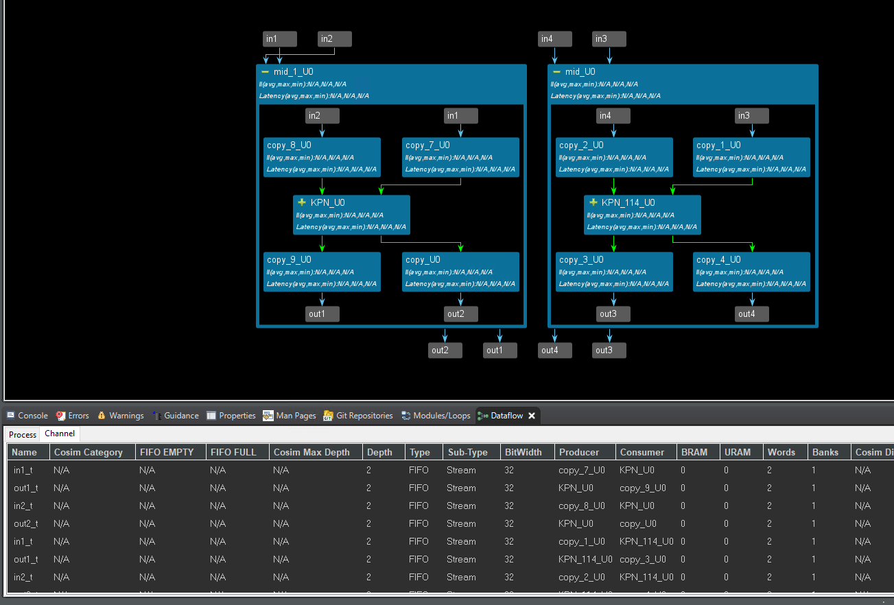</div>

The timeline trace is shown below.

<div align=center>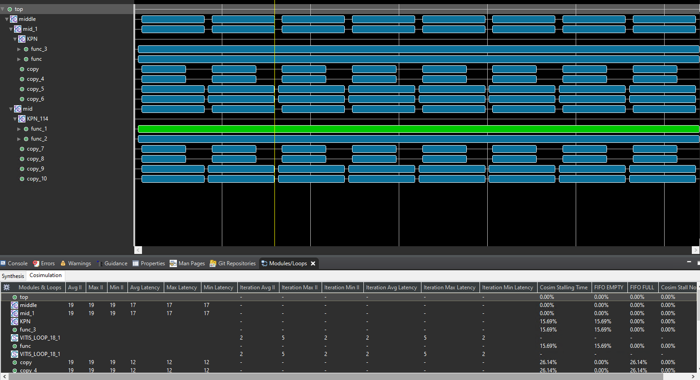</div>

* Templates enable unique task instances with distinct channel bindings for flexibility and reusability. We can see that two ``` middle()``` instances are independent. 

* Tasks vs. Function Calls: Tasks aren't traditional function calls; they're persistent entities with state and static channel bindings.

* Dataflow Execution: Tasks execute independently based on data availability, not sequential order.

The result of the optimization is shown below.

<div align=center>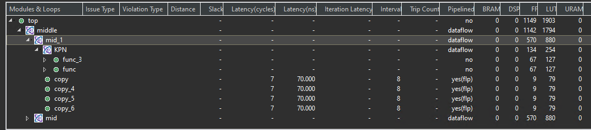</div>


**test_tb.cpp**
```c++
#include "test.h"

int main() {
    hls::stream<int> in1, in2, in3, in4;
    hls::stream<int> out1, out2, out3, out4;
    for (int i = 0; i < 64; i++) {
        in1.write(i);
        in2.write(i);
        in3.write(i);
        in4.write(i);
    }

    for (int j = 0; j < 4; j++) {
        top(in1, out1, in2, out2, in3, out3, in4, out4);
    }

    for (int i = 0; i < 64; i++) {
        int t = out1.read();
        if (t != 2 * i) {
            printf("Error 1 at %d %d != %d\n", i, t, 2 * i);
            return 1;
        }
        t = out2.read();
        if (t != 2 * i) {
            printf("Error 2 at %d %d != %d\n", i, t, 2 * i);
            return 1;
        }
        t = out3.read();
        if (t != 2 * i) {
            printf("Error 3 at %d %d != %d\n", i, t, 2 * i);
            return 1;
        }
        t = out4.read();
        if (t != 2 * i) {
            printf("Error 4 at %d %d != %d\n", i, t, 2 * i);
            return 1;
        }
    }
    printf("PASS\n");
}
```

And export the IP core based on the above operations. We also need middle_data IP to provide the last and keep the signal. [Ref](https://uri-nextlab.github.io/ParallelProgammingLabs/HLS_Labs/Lab5.html)

#### Create the Vivado project

The configure block design can use reference materials [here](https://uri-nextlab.github.io/ParallelProgammingLabs/HLS_Labs/Lab1.html). And we need to choose the number of the DMA according to the number of the interface.

<div align=center>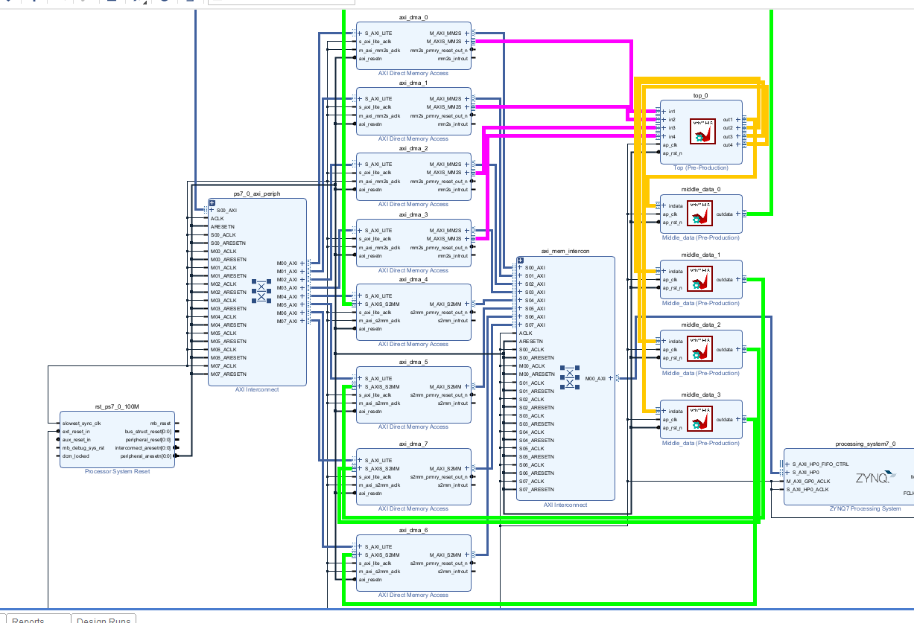</div>

#### Run synthesis,  Implementation, and generate bitstream

It may show some errors about I/O Ports, please fix them.

#### Download the bitstream file to PYNQ

The first step is to allocate the buffer. pynq allocate will be used to allocate the buffer, and NumPy will be used to specify the type of the buffer.

```python
from pynq import Overlay
from pynq import allocate
import numpy as np
import time
```


#### Create DMA instances

We can create three DMA objects using the labels for the DMAs listed above.

```python

hw = Overlay('design_1.bit')
mm2s_0 = hw.axi_dma_0.sendchannel
mm2s_1 = hw.axi_dma_1.sendchannel
mm2s_2 = hw.axi_dma_2.sendchannel
mm2s_3 = hw.axi_dma_3.sendchannel
s2mm_0 = hw.axi_dma_4.recvchannel
s2mm_1 = hw.axi_dma_5.recvchannel
s2mm_2 = hw.axi_dma_6.recvchannel
s2mm_3 = hw.axi_dma_7.recvchannel
```

#### Read DMA

The first step is to allocate the buffer. pynq.allocate will be used to allocate the buffer, and NumPy will be used to specify the type of the buffer.

```python
N = 64
iBuf_0 = allocate(shape=(N,), dtype = np.int32)
iBuf_1 = allocate(shape=(N,), dtype = np.int32)
iBuf_2 = allocate(shape=(N,), dtype = np.int32)
iBuf_3 = allocate(shape=(N,), dtype = np.int32)
oBuf_0 = allocate(shape=(N,), dtype = np.int32)
oBuf_1 = allocate(shape=(N,), dtype = np.int32)
oBuf_2 = allocate(shape=(N,), dtype = np.int32)
oBuf_3 = allocate(shape=(N,), dtype = np.int32)
for i in range(N):
    oBuf_0[i]= i
    oBuf_1[i]= i
    oBuf_2[i]= i
    oBuf_3[i]= i
```


```python
mm2s_0.transfer(oBuf_0)
mm2s_1.transfer(oBuf_1)
mm2s_2.transfer(oBuf_2)
mm2s_3.transfer(oBuf_3)
s2mm_0.transfer(iBuf_0)
s2mm_1.transfer(iBuf_1)
s2mm_2.transfer(iBuf_2)
s2mm_3.transfer(iBuf_3)
mm2s_0.wait()
mm2s_1.wait()
mm2s_2.wait()
mm2s_3.wait()
s2mm_0.wait()
s2mm_1.wait()
s2mm_3.wait()
s2mm_2.wait()

```

We will see:

<div align=center>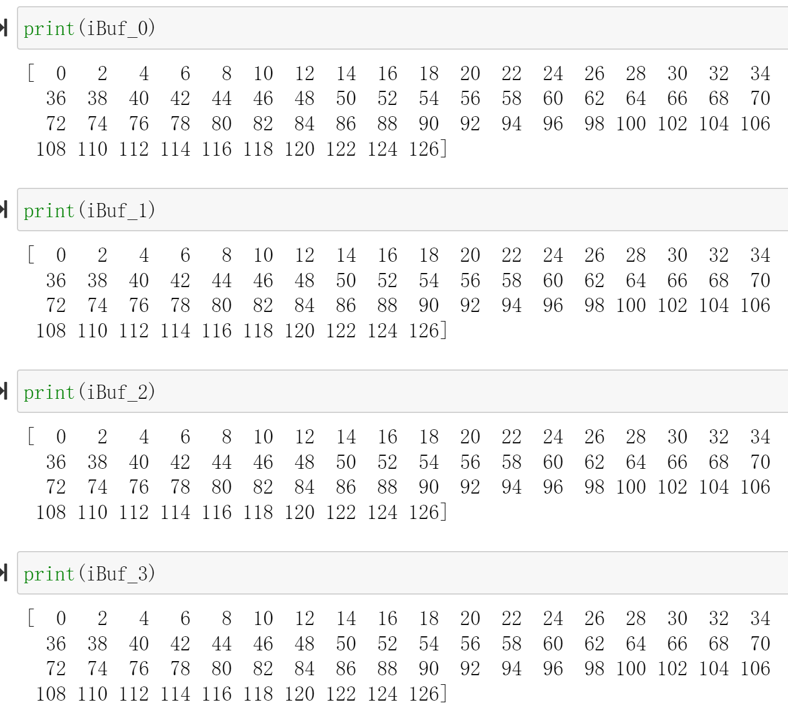</div>


### Unsynchronized_io_maxi

Data-driven TLP designs using ```hls::task``` run-continuously until reset. These modules support un-synchronized I/O that can change at any time, regardless of whether the module is executing or idle; this is different from control-driven TLP where the input only changes during the idle state. The module designer is not particular about the timing of the change as long as the module can see the updated data at some point in time. Non-stream data, such as scalar and array variables, must all be local to the task functions and cannot be passed as arguments, except as noted in ```Stable``` ```M_AXI``` and ```S_AXILITE``` Accesses below.

You can also pass scalar values (both local and top-level arguments) and pointers to array arguments in the top-level function, provided that they are marked with the ```STABLE``` pragma or directive. You must also be careful to ensure that either their value never changes during kernel execution (this is virtually impossible to ensure with ```hls::task``` instantiated alone at the top, without regular dataflow processes), or the kernel behavior does not depend on when these arguments change value. For example the process can tolerate a value change at an arbitrary point in time, or some other stream-based synchronization mechanism is used to regulate their access.

There are two types of un-synchronized I/O:

* Scalars: where the host periodically checks the status of registers for value change

* Memory I/O : where the module receives a ```DRAM``` buffer from the host code, and privately manages it

The ```stable``` pragma can be used to mark input or output variables of a dataflow region. Its effect is to remove their corresponding task-level synchronizations, assuming that the user guarantees this removal is indeed correct.

```c++
void dataflow_region(int A[...], ...
#pragma HLS stable variable=A
#pragma HLS dataflow
    proc1(...);
    proc2(A, ...);
```
Without the ```stable``` pragma, and assuming that ```A``` is read by ```proc2```, then ```proc2``` would be part of the initial synchronization for the dataflow region where it is located. This means that ```proc1``` would not restart until ```proc2``` is also ready to start again, which would prevent dataflow iterations from overlapping and induce a possible loss of performance. The ```stable``` pragma indicates that this synchronization is not necessary to preserve correctness.

With the ```stable``` pragma, the compiler assumes that:

* If ```A``` is read by ```proc2```, then the memory locations that are read are still accessible and can not be overwritten by any other process or calling context, while the ```dataflow_region``` is being executed.

* If ```A``` is written by ```proc2```, then the memory locations written can not be read, before their definition, by any other process or calling context, while ```dataflow_region``` is being executed.


<div align=center></div>

And we can have an example as shown below:

**stable_test.h**
```c++

#ifndef _STABLE_TEST_H
#define _STABLE_TEST_H

#define N 8

void dataflow_region(int A[N],int in1[N],int in2[N],int out1[N]);


#endif


```
**stable_test.cpp**
```c++
#include"stable_test.h"


void add(int a[N],int b[N],int sum[N])
{
	for(int i=0;i<N;i++)
	{
		sum[i]=a[i]+b[i];
	}
}


void dataflow_region(int A[N],int in1[N],int in2[N],int out1[N])
{
//#pragma HLS stable variable=A
#pragma HLS dataflow
	int sum1[N];
    add(in1,in2,sum1);
    add(A,sum1,out1 );
}

```
**stable_tb.cpp**
```c++
#include "stable_test.h"
#include <stdio.h>

int main(){

	int A[N];
	int B[N];
	int C[N];
	int sum[N];
	for(int i=0;i<N;i++)
	{
		A[i]=i;
		B[i]=i;
		C[i]=i;
	}
	dataflow_region(A,B,C,sum);
	dataflow_region(A,B,C,sum);
	for(int j=0;j<N;j++)
	{
		printf("sum[%d] is %d\r\n",j,sum[j]);
	}
}

```

After run the Cosimulation,we can see that:

Without the ```stable``` pragma:
<div align=center>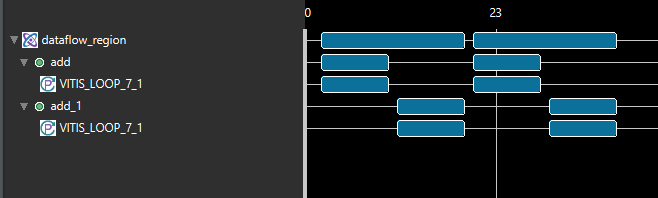</div>

With the ```stable``` pragma:

<div align=center>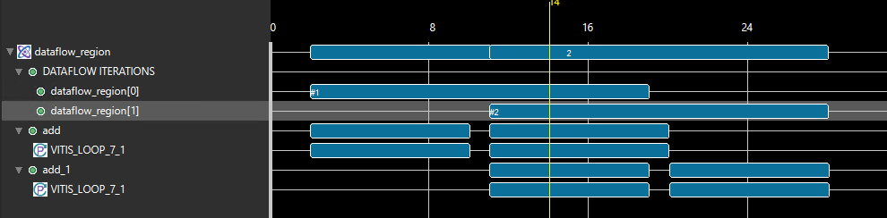</div>

Stable top pointers with the ```m_axi``` protocol and an ```s_axilite``` offset must be enabled for C/RTL Co-simulation using the ```cosim.enable_tasks_with_m_axi``` command as described in Co-Simulation Configuration[Ref](https://docs.xilinx.com/r/en-US/ug1399-vitis-hls/Co-Simulation-Configuration).

The following example shows an ```hls::task``` design with a stable ```m_axi``` pointer argument in the top-level function. Any access to the underlying DRAM buffer will be unsynchronized with the process of the function. Because the offset register for the ```m_axi``` interface automatically uses the ap_none protocol, the C++ and RTL will re-read its value only when the write_process is executed again.

**dut. cpp**
```c++
#include "ap_axi_sdata.h"
#include "ap_int.h"
#include "hls_stream.h"
#define HLS_TASK_ALLOW_NON_STREAM_ARGS

//It instructs the HLS tool to allow tasks to have non-stream arguments (e.g., scalar variables, pointers, or arrays) in addition to stream arguments.
//It's often used to enable more flexible task communication and data sharing.

#include "hls_print.h"
#include "hls_task.h"

void process_23(hls::stream<int>& in, hls::stream<int>& out) {
#pragma HLS INLINE off
    static int state = 0;
    static int val;

    in.read(val);
    val = val * 23;
    out.write(val);
}

void process_11(hls::stream<int>& in, hls::stream<int>& out) {
#pragma HLS INLINE off
    static int state = 0;
    static int val;

    in.read(val);
    val = val * 11;
    out.write(val);
}

void write_process(hls::stream<int>& in, hls::stream<int>& out, int* mem) {
    int val;
    static int addr = 0;

    in.read(val);
    if (addr >= 32)
        addr = 0;
    mem[addr] = val;
    addr++;
    val = mem[addr - 1];
    out.write(val);
}

extern "C" {

void stable_pointer(int* mem, hls::stream<int>& in, hls::stream<int>& out) {
#pragma HLS INTERFACE mode = m_axi bundle = gmem depth =                       \
    256 max_read_burst_length = 16 max_widen_bitwidth =                        \
        512 max_write_burst_length = 16 num_read_outstanding =                 \
            16 num_write_outstanding = 16 port = mem
#pragma HLS stable variable = mem

    hls_thread_local hls::stream<int> int_fifo("int_fifo");
#pragma HLS STREAM depth = 512 type = fifo variable = int_fifo
    hls_thread_local hls::stream<int> int_fifo2("int_fifo2");
#pragma HLS STREAM depth = 512 type = fifo variable = int_fifo2

    hls_thread_local hls::task t1(process_23, in, int_fifo);
    hls_thread_local hls::task t2(process_11, int_fifo, int_fifo2);
    hls_thread_local hls::task t3(write_process, int_fifo2, out, mem);
}

} // extern "C"
```

**dut_tb.cpp**
```c++
#include "ap_axi_sdata.h"
#include "ap_int.h"
#include "hls_stream.h"
#include <unistd.h>

extern "C" void stable_pointer(int* mem, hls::stream<int>&, hls::stream<int>&);

int main(int argc, char* argv[]) {
    int memory[512];
    // memset(memory, 0, 128*256/8);
    hls::stream<int> in, out;
    int val;
    for (int i = 0; i < 100; i++) {
        in.write(i);
        memory[i] = 0;
    }

    stable_pointer(memory, in, out);

    for (int i = 0; i < 100; i++) {
        out.read(val);
        if (val != i * 23 * 11) {
            printf("%d != %d\n", val, i * 23 * 11);
            return 1;
        }
    }

    return 0;
}

```
The dataflow view is shown below.

<div align=center>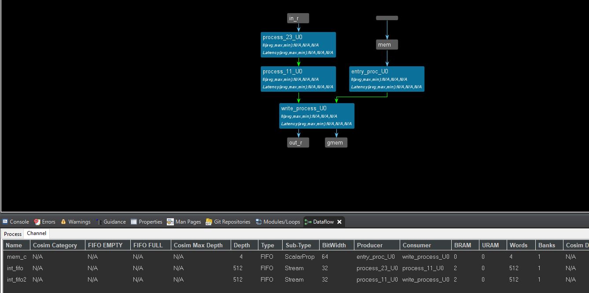</div>

### Unsynchronized_io_scalar

Scalar values are passed by reference:

```c++
void test(hls::stream<int> &in, hls::stream<int> &out, int &n)

```

The following is an example of an ```hls::task``` design with a stable by-reference scalar argument, whose behavior is by and large insensitive to the exact timing of a change of value of that argument:

**test. h**
```c++
#include "hls_task.h"
#define N 100
#include <iostream>

void test(hls::stream<int>& in, hls::stream<int>& out, int n);

```

**test.cpp**
```c++

#include "test.h"

void sub_task1(hls::stream<int>& in, hls::stream<int>& out) {
#pragma HLS INTERFACE ap_ctrl_none port=return
#pragma HLS INTERFACE mode=AXIS port=in register_mode=off
#pragma HLS INTERFACE mode=AXIS port=out register_mode=off
#pragma HLS PIPELINE style=flp II=1
    int c = in.read();
    out.write(c + 2);
}

void sub_task2(hls::stream<int>& in, hls::stream<int>& out) {
#pragma HLS INTERFACE ap_ctrl_none port=return
#pragma HLS INTERFACE mode=AXIS port=in register_mode=off
#pragma HLS INTERFACE mode=AXIS port=out register_mode=off
#pragma HLS PIPELINE style=flp II=1
    int c = in.read();
    out.write(c - 1);
}

void task2(hls::stream<int>& in, hls::stream<int>& out, int n) {
#pragma HLS INTERFACE ap_ctrl_none port=return
#pragma HLS INTERFACE mode=AXIS port=in register_mode=off
#pragma HLS INTERFACE mode=AXIS port=out register_mode=off
#pragma HLS INTERFACE mode=s_axilite port=n
#pragma HLS PIPELINE style=flp II=1
    int c = in.read();
    out.write(c + 2 + n);
}

void test(hls::stream<int>& in, hls::stream<int>& out, int n) {

#pragma HLS INTERFACE ap_ctrl_none port=return
#pragma HLS INTERFACE mode=AXIS port=in register_mode=off
#pragma HLS INTERFACE mode=AXIS port=out register_mode=off
#pragma HLS INTERFACE mode=s_axilite port=n

#pragma HLS STABLE variable = n
    HLS_TASK_STREAM<int, N> s1;
    HLS_TASK_STREAM<int, N> s2;

    HLS_TASK t1(sub_task1, in, s1);
    HLS_TASK t2(sub_task2, s1, s2);
    HLS_TASK t(task2, s2, out, n);
}

```
```pragma HLS stable``` : Arguments marked as stable cannot change during kernel execution. Inputs that only change when the kernel is not running, such as ports that provide configuration data, should be marked with a ```STABLE``` pragma or directive. The ```STABLE``` Pragma can only be used for Control-Driven task modeling because in Data-driven Task-level Parallelism there is no way to detect when the kernel is idle.

The ```STABLE``` pragma informs Vitis HLS of the following:

* The data applied to the port remains stable during normal operation but is not a constant value that can be optimized.

* The fanout from this port is not required to be registered.

Pragma ```STABLE``` pragma in ```DATAFLOW``` networks tells the compiler that input does not need to be read by the first dataflow process and that output does not need to be written by the last dataflow process in a network. This can dramatically improve II.

And the dataflow view is shown below:

<div align=center>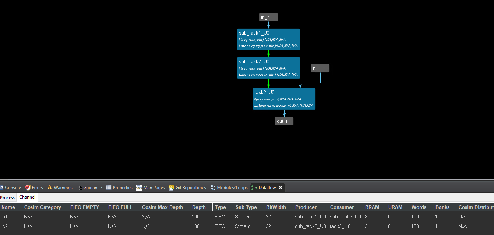</div>

**test_tb.cpp**
```c++
#include "test.h"

int main() {

    hls::stream<int> in;
    hls::stream<int> out;

    for (int i = 0; i < N; i++)
        in.write(i);
    test(in, out, N);

    int sum = 0;
    for (int i = 0; i < N; i++)
        sum += out.read();
    if (sum != 15250)
        return 1;
    return 0;
}

```

Before you add the ```middle_data``` IP, you need to change the ```num``` in the ```middle_data.h``` according to the different needs for the output data and run C synthesis and export the IP.

#### Create the Vivado project

The configure block design can use reference materials [here](https://uri-nextlab.github.io/ParallelProgammingLabs/HLS_Labs/Lab1.html)

<div align=center>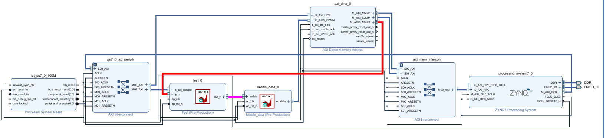</div>

#### Run synthesis,  Implementation and generate bitstream

It may shows some errors about I/O Ports, please fix them.

#### Download the bitstream file to PYNQ

The first step is to allocate the buffer. ```pynq``` allocate will be used to allocate the buffer, and ```NumPy``` will be used to specify the type of the buffer.

```python
from pynq import Overlay
from pynq import allocate
import numpy as np
import time
```

<div align=center>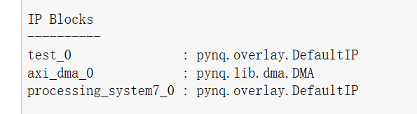</div>

#### Create DMA instances

We can create three DMA objects using the labels for the DMAs listed above.

```python

hw = Overlay('design_1.bit')
mm2s = hw.axi_dma_0.sendchannel
s2mm = hw.axi_dma_0.recvchannel
register_n=hw.test_0
```

#### Read DMA

The first step is to allocate the buffer. ```pynq``` allocate will be used to allocate the buffer, and ```NumPy``` will be used to specify the type of the buffer.

```python
N = 100
iBuf = allocate(shape=(N,), dtype = np.int32)
oBuf = allocate(shape=(N,), dtype = np.int32)
for i in range(N):
    oBuf[i]= i
```

```python
register_n.register_map

register_n.register_map.n=100

```
For a single variable ```n```, we assign its value by defining it as an ```s_axilite``` interface, as shown in the following diagram.

<div align=center>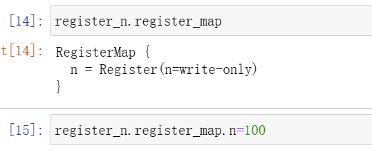</div>

```python
mm2s.transfer(oBuf)
s2mm.transfer(iBuf)
mm2s.wait()
s2mm.wait()

```

We will see:

<div align=center>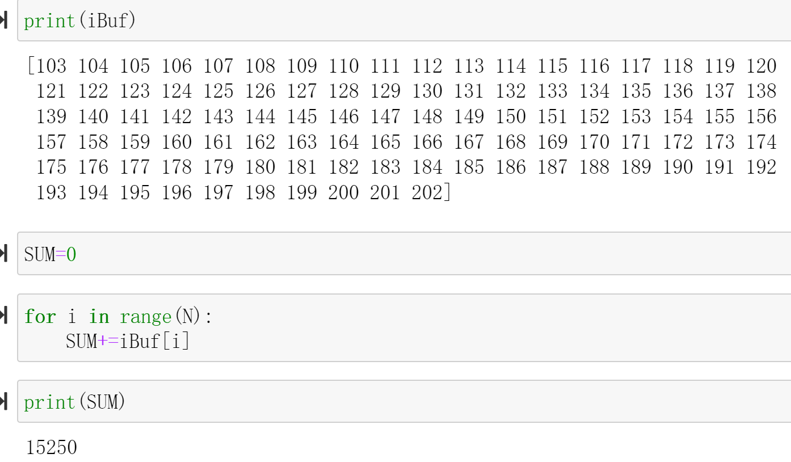</div>

## Demonstrate
Please finish one function that uses the ```hls::task``` object and implement it on the PYNQ-Z2 board.
