# Lab7 Interface_Aggregation

<script type="text/x-mathjax-config">
  MathJax.Hub.Config({
    tex2jax: {
        inlineMath: [ ['$','$'], ["\\(","\\)"] ],
        displayMath: [ ['$$','$$'], ["\\[","\\]"] ],
        processEscapes: false,
    }
  });
</script> 
    
<script type="text/javascript"
        src="https://cdn.mathjax.org/mathjax/latest/MathJax.js?config=TeX-AMS-MML_HTMLorMML">
</script>

## Introduction

The arguments of the top-level function in an HLS component are synthesized into interfaces and ports that group multiple signals to define the communication protocol between the HLS component and elements external to the design. The tool defines interfaces automatically, using industry standards to specify the protocol used. The type of interfaces that the tool chooses depends on the data type and direction of the parameters of the top-level function, the target flow for the HLS component, the default interface configuration settings as described in Interface Configuration, and any specified INTERFACE pragmas or directives. [Ref](https://docs.xilinx.com/r/en-US/ug1399-vitis-hls/Introduction-to-Interface-Synthesis)

The interface defines three elements of the kernel:

* The interface defines channels for data to flow into or out of the HLS design. Data can flow from a variety of sources external to the kernel or IP, such as a host application, an external camera or sensor, or from another kernel or IP implemented on the AMD device. The default channels for Vitis kernels are AXI adapters as described in Interfaces for Vitis Kernel Flow.

* The interface defines the port protocol that is used to control the flow of data through the data channel, defining when the data is valid and can be read or can be written, as defined in Port-Level Protocols for Vivado IP Flow.

* The interface also defines the execution control scheme for the HLS design, specifying the operation of the kernel or IP as pipelined or sequential, as defined in Block-Level Control Protocols.

Vitis HLS supports memory, stream, and register interface paradigms where each paradigm follows a certain interface protocol and uses the adapter to communicate with the external world.

* Memory Paradigm (```m_axi```): the data is accessed by the kernel through memory such as DDR, HBM, PLRAM/BRAM/URAM

* Stream Paradigm (```axis```): the data is streamed into the kernel from another streaming source, such as video processor or another kernel, and can also be streamed out of the kernel.

* Register Paradigm (```s_axilite```): The data is accessed by the kernel through register interfaces and accessed by software as register reads/writes.

Vitis HLS will not automatically infer the default interfaces for the member elements of a struct/class when the elements require different interface types. For example, when one element of a struct requires a stream interface while another member element requires an s_axilite interface. You must explicitly define an INTERFACE pragma for each element of the struct instead of relying on the default interface assignment.


The Vivado IP flow supports a wide variety of I/O protocols and handshakes due to the requirement of supporting FPGA design for a wide variety of applications. This flow supports a traditional system design flow where multiple IP are integrated into a system. IP can be generated through Vitis HLS. In this IP flow there are two modes of control for execution of the system:

* Software Control: The system is controlled through a software application running on an embedded Arm processor or external x86 processor, using drivers to access elements of the hardware design, and reading and writing registers in the hardware to control the execution of IP in the system.

* Self Synchronous: In this mode the IP exposes signals which are used for starting and stopping the kernel. These signals are driven by other IP or other elements of the system design that handles the execution of the IP.

The Vivado IP flow supports memory, stream, and register interface paradigms where each paradigm supports different interface protocols to communicate with the external world, as shown in the following table. Note that while the Vitis kernel flow supports only the AXI4 interface adapters, this flow supports a number of different interface types.

<div align=center>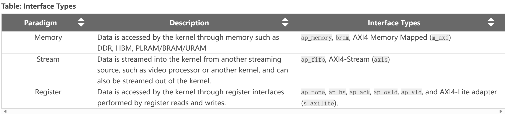</div>

The default interfaces are defined by the C-argument type in the top-level function, and the default paradigm, as shown in the following table.

<div align=center>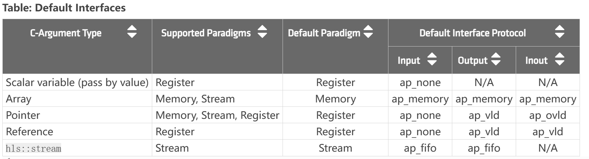</div>

The default execution mode for Vivado IP flow is sequential execution, which requires the HLS IP to complete one iteration before starting the next. This is specified by the ```ap_ctrl_hs``` block control protocol. The control protocol can be changed as specified in [Block-Level Control Protocols](https://docs.xilinx.com/r/en-US/ug1399-vitis-hls/Block-Level-Control-Protocols).

### Aggregation_Disaggregation

Aggregation: Collects and groups the data fields of a struct into a single scalar with a wider word width.

The AGGREGATE pragma is used for grouping all the elements of a struct into a single wide vector to allow all members of the struct to be read and written to simultaneously. The bit alignment of the resulting new wide-word can be inferred from the declaration order of the struct elements. The first element takes the LSB of the vector, and the final element of the struct is aligned with the MSB of the vector.

If the struct contains arrays, the AGGREGATE pragma performs a similar operation as ARRAY_RESHAPE, and combines the reshaped array with the other elements in the struct. Any arrays declared inside the struct are completely partitioned and reshaped into a wide scalar and packed with other scalar elements.

 You should exercise some caution when using the AGGREGATE optimization on struct objects with large arrays. If an array has 4096 elements of type int, this will result in a vector (and port) of width 4096×32=131072 bits. The Vitis HLS tool can create this RTL design, however it is very unlikely logic synthesis will be able to route this during the FPGA implementation.

 Place the pragma near the definition of the struct variable to aggregate:
 ```c++
 #pragma HLS aggregate variable=<variable> compact=<arg>
 ```

 Where:
```c++
variable=<variable>
```

Specifies the variable to be grouped.
```c++
compact=[bit | byte | none | auto]
```
Specifies the alignment of the aggregated struct. Alignment can be on the bit-level, the byte-level, none, or automatically determined by the tool which is the default behavior.

#### aggregation_of_m_axi_ports
In this simple example, the size of the m_axi interface port "arr" is 3 bytes (or 24 bits) but due to the specification of the aggregate pragma, the size of the port will be aligned to 4 bytes (or 32 bits) as this is the closest power of 2. 

**example.h**
```c++
#include <iostream>
#define N 10

struct A {
    char foo; // 1 byte
    short bar; // 2 bytes
};

// Top function
int dut(A* arr);
```

**example.cpp**
```c++
#include "example.h"

int dut(A* arr) {
#pragma HLS interface m_axi port = arr depth = 10
#pragma HLS interface s_axilite port = arr
#pragma HLS aggregate variable = arr compact = auto

//This directive instructs the tool to potentially compact data into wider words for better memory bandwidth utilization.
    int sum = 0;
    for (unsigned i = 0; i < N; i++) {
        auto tmp = arr[i];
        sum += tmp.foo + tmp.bar;
    }
    return sum;
}
```

For the above example, the size of the ```m_axi``` interface port ```arr``` is 3 bytes (or 24 bits) but due to the ```AGGREGATE compact=auto``` pragma, the size of the port will be aligned to 4 bytes (or 32 bits) as this is the closest power of 2. Vitis HLS will issue the following message in the log file:

<div align=center>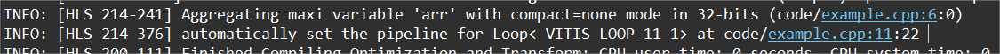</div>

<div align=center></div>

The message above is only issued if the AGGREGATE pragma is specified. But even without the pragma, the tool will automatically aggregate and pad the interface port arr to 4 bytes as the default behavior for an AXI interface port.

If we change the interface to the ```axis```, then the II will be 1.

<div align=center>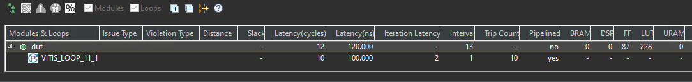</div>

After the optimization, memory layout of char and short variables will shown as below.

<div align=center>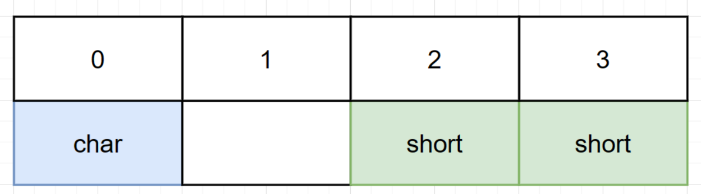</div>

**example_test.cpp**
```c++
#include "example.h"

int main() {
    A arr[N];
    for (unsigned i = 0; i < N; i++) {
        arr[i].foo = i;
        arr[i].bar = i;
    }
    auto ret = dut(arr);
    std::cout << "ret = " << ret << std::endl;
    if (ret != 90)
        return 1;
    return 0;
}
```


#### aggregation_of_nested_structs

In this example, the aggregation algorithm will create a port of size 104 bits for ports ```a```, and ```c``` as the ```compact=byte``` option was specified in the aggregate pragma but the ```compact=bit``` default option is used for port b and its packed size will be 97 bits. The nested structures ```S``` and ```T``` are aggregated to encompass three 32-bit member variables (```p```, ```m```, and ```n```) and one bit/byte member variable (``` o```).

Note that this example uses the default flow target setting of Vivado IP to illustrate the aggregation behavior. In Viti's kernel flow, port b will be automatically inferred as an ```m_axi``` port and will not allow the ```compact=bit``` setting.

**example.h**
```c++
#include <iostream>

#define N 8

struct T {
    int m;//4 bytes
    int n;// 4 bytes
    bool o;// 1 byte
};

struct S {
    int p; // 4 bytes
    T q;// 9 bytes
};

// Top function
void top(S a[N], S b[N], S c[N]);
```

**example.cpp**
```c++
#include "example.h"

void top(S a[N], S b[N], S c[N]) {

#pragma HLS interface bram port = c
#pragma HLS interface ap_memory port = a
#pragma HLS aggregate variable = a compact = byte
#pragma HLS aggregate variable = c compact = byte

top_label0:
    for (int i = 0; i < N; i++) {
#pragma HLS PIPELINE II = 3
        c[i].q.m = a[i].q.m + b[i].q.m;
        c[i].q.n = a[i].q.n - b[i].q.n;
        c[i].q.o = a[i].q.o || b[i].q.o;
        c[i].p = a[i].q.n;
    }
}
```
Each element of S is 13 bytes (4 bytes for p, 9 bytes for q), and byte-level packing aligns each element to a byte boundary, resulting in 13 bytes * 8 bits/byte = 104 bits. Bit-level packing attempts to pack elements as tightly as possible, leading to a smaller size. However, the 1-byte o member within T cannot be partially packed, so it occupies a full byte, resulting in 12 bytes * 8 bits/byte + 1 bit = 97 bits.

<div align=center>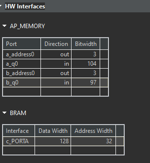</div>

**example_test.cpp**
```c++
#include "example.h"

int main(int, char**) {
    S a[N] = {{0, {5, 1, 0}}, {1, {5, 2, 1}}, {2, {5, 3, 1}},
              {3, {5, 4, 0}}, {4, {5, 5, 1}}, {5, {5, 6, 0}}};
    S b[N] = {{9, {5, 10, 1}},  {10, {5, 11, 1}}, {11, {5, 12, 0}},
              {12, {5, 13, 0}}, {13, {5, 14, 1}}, {14, {5, 15, 1}}};
    S c[N];

    top(a, b, c);

    if ((c[4].q.m == 10) && (c[5].q.n == -9))
        std::cout << "PASSED " << c[4].q.m << "," << c[5].q.n << std::endl;
    else
        std::cout << "FAILED " << c[4].q.m << "," << c[5].q.n << std::endl;

    return 0;
}
```
#### aggregation_of_struct

In this simple example, the aggregation algorithm will create a port of size 119 bits for port arr (which is mapped to ap_fifo which will create a streaming interface). The array "myArr" will take 12 bytes (or 96 bits) and the element "length" will take 23 bits for a total of 119 bits.

**example.h**
```c++
#include "ap_int.h"
#include <iostream>

#define N 10

struct A {
    int foo[3];
    ap_int<23> bar;
};

// Top function
int dut(A arr[N]);
```

**example.cpp**
```c++
#include "example.h"

int dut(A arr[N]) {
#pragma HLS interface ap_fifo port = arr
#pragma HLS aggregate variable = arr
    int sum = 0;
    for (unsigned i = 0; i < N; i++) {
        auto tmp = arr[i];
        sum += tmp.foo[0] + tmp.foo[1] + tmp.foo[2] + tmp.bar;
    }
    return sum;
}
```

For the ```ap_fifo``` interface, the struct will packed at the bit-level with or without ```aggregate``` pragma.

In the above example, the AGGREGATE pragma will create a port of size 119 bits for port ```arr```. The array ```myArr``` will take 12 bytes (or 96 bits) and the element length will take 23 bits for a total of 119 bits. Vitis HLS will issue the following message in the log file:

<div align=center>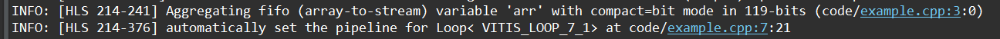</div>

The synthesis report is shown below.

<div align=center>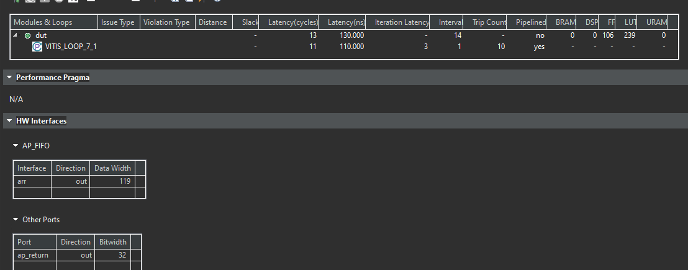</div>

**example_tb.h**
```c++
#include "example.h"

int main() {
    A arr[N];
    for (unsigned i = 0; i < N; i++) {
        arr[i].foo[0] = i * 4;
        arr[i].foo[1] = i * 4 + 1;
        arr[i].foo[2] = i * 4 + 2;
        arr[i].bar = i * 4 + 3;
    }

    // 0: 0000_0003_0000_0002_0000_0001_0000_0000
    // 1: 0000_0007_0000_0006_0000_0005_0000_0004
    // 2: 0000_000b_0000_000a_0000_0009_0000_0008
    // 3: 0000_000f_0000_000e_0000_000d_0000_000c
    // 4: 0000_0013_0000_0012_0000_0011_0000_0010
    // 5: 0000_0017_0000_0016_0000_0015_0000_0014
    // 6: 0000_001b_0000_001a_0000_0019_0000_0018
    // 7: 0000_001f_0000_001e_0000_001d_0000_001c
    // 8: 0000_0023_0000_0022_0000_0021_0000_0020
    // 5: 0000_0027_0000_0026_0000_0025_0000_0024
    auto ret = dut(arr);
    std::cout << "ret = " << ret << std::endl;
    if (ret != 780)
        return 1;
    return 0;
}
```

#### auto_disaggregation_of_struct
Using a ```hls::stream``` object inside a structure that is used in the interface will cause the struct port to be automatically disaggregated by the Vitis HLS compiler. The generated RTL interface will containseparate RTL ports for the ```hls::stream``` object ```s_in``` (named d_s_in_*) and separate RTL ports for the array ```arr``` (named d_arr_*).

**example.h**
```c++
#include "hls_stream.h"
#include <iostream>

#define N 10

struct A {
    hls::stream<int> s_in;// 4 bytes
    long arr[N]; //8 bytes
};

// Top function
long dut(struct A& d);
```

**example.cpp**
```c++
#include "example.h"

long dut(struct A& d) {
    long sum = 0;
    while (!d.s_in.empty())
        sum += d.s_in.read();
    for (unsigned i = 0; i < N; i++)
        sum += d.arr[i];
    return sum;
}
```
Vitis HLS will issue the following messages in the log file:

<div align=center>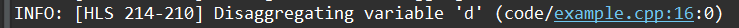</div>
 
And the synthesis report is shown below.

<div align=center>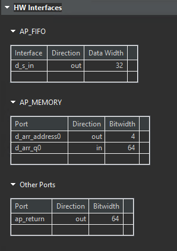</div>

**example_test.cpp**
```c++
#include "example.h"

int main() {
    A a;
    for (unsigned i = 0; i < N; i++)
        a.s_in.write(i);
    for (unsigned i = 0; i < N; i++)
        a.arr[i] = i;

    auto ret = dut(a);
    std::cout << "ret = " << ret << std::endl;

    return 0;
}
```
#### disaggregation_of_axis_port
In this disaggregation example, ```a``` struct port is mapped to an AXI stream and then disaggregated causing the Vitis HLS compiler to create two AXI stream ports - one for each member (```c``` and ```i```) of the struct ```A```. 

<div align=center>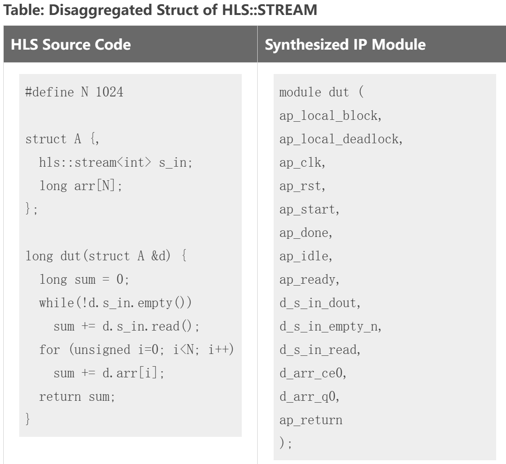</div>

**example.h**
```c++
#define N 10

struct A {
    char c;
    int i;
};

// Top function
void dut(A in[N], A out[N]);

```

**example.cpp**
```c++
#include "example.h"

void dut(A in[N], A out[N]) {
#pragma HLS interface axis port = in
#pragma HLS interface axis port = out
#pragma HLS disaggregate variable = in
#pragma HLS disaggregate variable = out
    int sum = 0;
    for (unsigned i = 0; i < N; i++) {
        out[i].c = in[i].c;
        out[i].i = in[i].i;
    }
}
```
In the above disaggregation example, the struct arguments ``` in``` and ```out``` are mapped to AXIS interfaces, and then disaggregated. This results in Vitis HLS creating two AXI streams for each argument: ```in_c```, ```in_i```, ```out_c``` and ```out_i```. Each member of the struct A becomes a separate stream.

<div align=center></div>

**example_test.cpp**
```c++
#include "example.h"
#include <iostream>

int main() {
    A arr[N], out[N];
    for (unsigned i = 0; i < N; i++)
        arr[i].c = arr[i].i = i;

    dut(arr, out);
    for (unsigned i = 0; i < N; i++) {
        std::cout << i << ": " << int(out[i].c) << ", " << out[i].i
                  << std::endl;
        if (out[i].c != i || out[i].i != i)
            return 1;
    }
    return 0;
}
```

#### struct_ii_issue

This example illustrates the effect of misaligned data in the interface. Struct A defined in example.h has a size of 192 bits / 24 Bytes. As the port is defined as ```m_axi```, Vitis HLS will pad this field to the closest power of 2 - 256 bits (or 32 bytes). This causes a mismatch in the software and hardware sizes, resulting in II violations in the two loops that read and write to the ```m_axi``` interfaces.

The m_axi interface, in particular, often has stricter alignment requirements to optimize for high-bandwidth data transfers. It often pads data to power-of-2 sizes for efficient burst transfers and cache alignment.

**example. h**
```c++
#include <iostream>
#define NUM 100

// struct alignas(32) A { /* Total size = 256 bits or 32 bytes */
struct A { /* Total size = 192 bits (32 x 6) or 24 bytes */
    int s_1;//4 bytes
    int s_2;
    int s_3;
    int s_4;
    int s_5;
    int s_6;
};

// Top function
void dut(A a_in[NUM], A a_out[NUM], int size);

```

**example.cpp**
```c++
#include "example.h"

void read(A* a_in, A buf_out[NUM]) {
READ:
    for (int i = 0; i < NUM; i++) {
        buf_out[i] = a_in[i];
    }
}

void compute(A buf_in[NUM], A buf_out[NUM], int size) {
COMPUTE:
    for (int j = 0; j < NUM; j++) {
        buf_out[j].s_1 = buf_in[j].s_1 + size;
        buf_out[j].s_2 = buf_in[j].s_2;
        buf_out[j].s_3 = buf_in[j].s_3;
        buf_out[j].s_4 = buf_in[j].s_4;
        buf_out[j].s_5 = buf_in[j].s_5;
        buf_out[j].s_6 = buf_in[j].s_6 % 2;
    }
}

void write(A buf_in[NUM], A* a_out) {
WRITE:
    for (int k = 0; k < NUM; k++) {
        a_out[k] = buf_in[k];
    }
}

void dut(A a_in[NUM], A a_out[NUM], int size) {
#pragma HLS INTERFACE m_axi port = a_in bundle = gmem0
#pragma HLS INTERFACE m_axi port = a_out bundle = gmem1
    A buffer_in[NUM];
    A buffer_out[NUM];

#pragma HLS dataflow
    read(a_in, buffer_in);
    compute(buffer_in, buffer_out, size);
    write(buffer_out, a_out);
}
```
Loops that read or write misaligned data can experience Initiation Interval (II) violations, as extra cycles are needed for memory access. This limits the ability to start new iterations in each clock cycle, reducing overall loop performance.

The synthesis report is shown below.

<div align=center></div>

Edit ```example. h``` to uncomment the line that sizes the struct to a power of 2. Rerun and observe that the II violations are no longer there as the interfaces are properly sized and aligned. 

**example. h**
```c++
#include <iostream>
#define NUM 100

// struct alignas(32) A { /* Total size = 256 bits or 32 bytes */
struct A { /* Total size = 256 bits (32 x 8) or 32 bytes */
    int s_1;//4 bytes
    int s_2;
    int s_3;
    int s_4;
    int s_5;
    int s_6;
    int s_7;//add two int variables
    int s_8;
};

//if we add one char and one short variable, then it still  does not meet alignment requirements.

// Top function
void dut(A a_in[NUM], A a_out[NUM], int size);

```

The synthesis report is shown below.

<div align=center>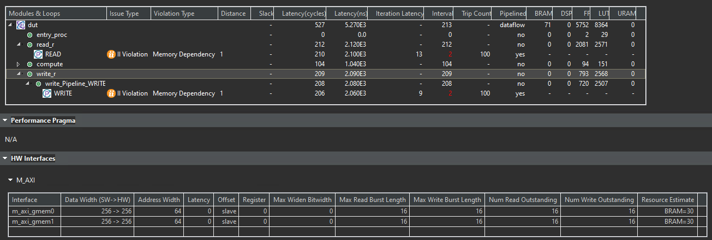</div>

And we can see that the II is 2. This is because the interface ```m_axi``` has the memory dependency.

<div align=center></div>

**example_test.cpp**
```c++
#include "example.h"

int main() {
    A a_in[NUM];
    A a_out[NUM];

    for (unsigned i = 0; i < NUM; i++) {
        a_in[i].s_1 = i;
        a_in[i].s_2 = i + 1;
        a_in[i].s_3 = i + 2;
        a_in[i].s_4 = i + 3;
        a_in[i].s_5 = i + 4;
        a_in[i].s_6 = i + 5;
    }

    int size = 8;

    dut(a_in, a_out, size);

    for (unsigned int i = 0; i < NUM; i++) {
        if (a_out[i].s_1 != a_in[i].s_1 + size) {
            return -1;
        }
    }
    printf("Test Pass!\n");
    return 0;
}
```
## Demonstrate
Please finish six examples for the use of the ```aggregation``` pragma.
