# Lab8 Interface_Memory_1

<script type="text/x-mathjax-config">
  MathJax.Hub.Config({
    tex2jax: {
        inlineMath: [ ['$','$'], ["\\(","\\)"] ],
        displayMath: [ ['$$','$$'], ["\\[","\\]"] ],
        processEscapes: false,
    }
  });
</script> 
    
<script type="text/javascript"
        src="https://cdn.mathjax.org/mathjax/latest/MathJax.js?config=TeX-AMS-MML_HTMLorMML">
</script>

## Introduction

A Vitis accelerated system includes a global memory subsystem that is used to share data between the kernels and the host application. Global memory available on the host system, outside of the AMD device, provides very large amounts of storage space but at the cost of longer access time compared to local memory on the AMD device. One of the measurements of the performance of a system/application is throughput, which is defined as the number of bytes transferred in a given time frame. Therefore, inefficient data transfers from/to the global memory will have a long memory access time which can adversely affect system performance and kernel execution time. Development of accelerated applications in Vitis HLS should include two phases: kernel development, and improving system performance. Improving system performance involves implementing an efficient load and store design that can improve the kernel execution time. [Ref](https://docs.xilinx.com/r/en-US/ug1399-vitis-hls/Optimizing-AXI-System-Performance)

### burst_rw

Bursting is an optimization that tries to intelligently aggregate your memory accesses to the DDR to maximize the throughput bandwidth and/or minimize the latency. Bursting is one of many possible optimizations to the kernel. Bursting typically gives you a 4-5x improvement while other optimizations, like access widening or ensuring there are no dependencies through the DDR memory, can provide even bigger performance improvements. Typically, bursting is useful when you have contention on the DDR ports from multiple competing kernels.

The burst feature of the AXI4 protocol improves the throughput of the load-store functions by reading/writing chunks of data to or from the global memory in a single request. The larger the size of the data, the higher the throughput. This metric is calculated as follows ((#of bytes transferred)* (kernel frequency)/(Time)). The maximum kernel interface bitwidth is 512 bits, and if the kernel is compiled to run at 300 MHz then it can theoretically achieve (512* 300 MHz)/1 sec = ~17 GBps for a DDR memory.

<div align=center>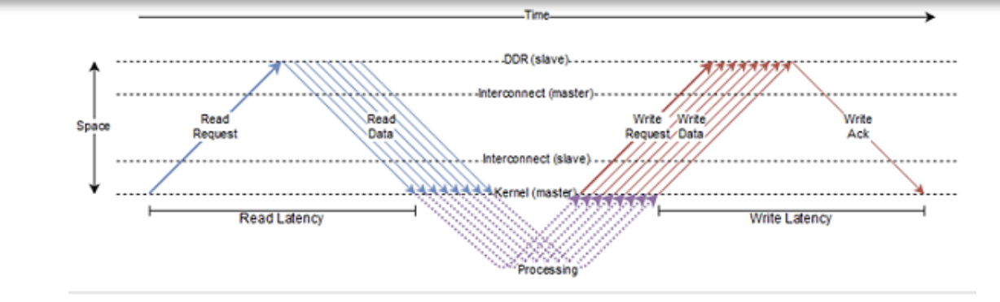</div>

The preceding figure shows how the AXI protocol works. The HLS kernel sends out a read request for a burst of length 8 and then sends a write request burst of length 8. The read latency is defined as the time taken between the sending of the read request burst to when the data from the first read request in the burst is received by the kernel. Similarly, the write latency is defined as the time taken between when data for the last write in the write burst is sent and the time the write acknowledgment is received by the kernel. Read requests are usually sent at the first available opportunity while write requests get queued until the data for each write in the burst becomes available.

Vitis HLS performs automatic burst optimization, which intelligently aggregates the memory accesses inside the loops/functions from the user code and performs read/write to the global memory of a particular size. These read/writes are converted into a read request, write request, and write response to the global memory. Depending on the memory access pattern Vitis HLS automatically inserts these read and write requests either outside the loop bound or inside the loop body. Depending on the placement of these requests, Vitis HLS defines two types of burst requests: sequential burst and pipelined burst. [Ref](https://docs.xilinx.com/r/en-US/ug1399-vitis-hls/AXI-Burst-Transfers)

Bursting is about aggregating successive memory access requests. Here are the set of preconditions that these successive accesses must meet for the bursting optimization to launch successfully:

* Must be all reads, or all writes – bursting reads and writes is not possible.

* Must be a monotonically increasing order of access (both in terms of the memory location being accessed as well as in time). You cannot access a memory location that is in between two previously accessed memory locations.

* Must be consecutive in memory – one next to another with no gaps or overlap and in forward order.

* The number of read/write accesses (or burst length) must be determinable before the request is sent out. This means that even if the burst length is computed at runtime, it must be computed before the read/write request is sent out.

* If bundling two arrays to the same M-AXI port, bursting will be done only for one array, at most, in each direction at any given time.

* If same direction accesses on the same channel of the same bundle in the same region, there will be no burst for all these accesses.

* There must be no dependency issues from the time a burst request is initiated and finished.

This is simple example of using AXI4-master interface for burst read and write in Vitis HLS.

**vadd.h**
```c++
#define DATA_SIZE 32
#define INCR_VALUE 10
// define internal buffer max size
#define BURSTBUFFERSIZE 16

void vadd(int* a, int size, int inc_value);

```
**vadd.cpp**
```c++

#include <stdio.h>
#include <string.h>
#include "vadd.h"

// TRIPCOUNT identifiers
const unsigned int c_size_min = 1;
const unsigned int c_size_max = BURSTBUFFERSIZE;
const unsigned int c_chunk_sz = DATA_SIZE;

void vadd(int* a, int size, int inc_value) {
// Map pointer a to AXI4-master interface for global memory access
#pragma HLS INTERFACE m_axi port = a offset = slave bundle = gmem max_read_burst_length = 16 max_write_burst_length = 16 depth = 32
// We also need to map a and return to a bundled axilite slave interface
#pragma HLS INTERFACE s_axilite port = a
#pragma HLS INTERFACE s_axilite port = size
#pragma HLS INTERFACE s_axilite port = inc_value
#pragma HLS INTERFACE s_axilite port = return

    int burstbuffer[BURSTBUFFERSIZE];
    int chunk_size = BURSTBUFFERSIZE;
read_buf:
    // Per iteration of this loop perform BURSTBUFFERSIZE vector addition
    for (int i = 0; i < size; i += BURSTBUFFERSIZE) {
#pragma HLS LOOP_TRIPCOUNT min = c_size_min* c_size_min max = c_chunk_sz * c_chunk_sz / (c_size_max * c_size_max)
       //16
        // boundary checks
        // burst read
        // Auto-pipeline is going to apply pipeline to these loops
        for (int j = 0; j < chunk_size; j++) {
// As the outer loop is not a perfect loop
#pragma HLS loop_flatten off
#pragma HLS LOOP_TRIPCOUNT min = c_size_min max = c_size_max
            burstbuffer[j] = a[i + j];
//            printf("buffer[%d] is %d\r\n",j,burstbuffer[j]);
        }

    // calculate and write results to global memory, the sequential write in a for
    // loop can be inferred to a memory burst access
    calc_write:
        for (int j = 0; j < chunk_size; j++) {
#pragma HLS LOOP_TRIPCOUNT min = c_size_max max = c_chunk_sz
            burstbuffer[j] = burstbuffer[j] + inc_value;
            a[i + j] = burstbuffer[j];
//            printf("a[%d] is %d\r\n",i+j,a[i+j]);
        }
    }
}

```

The synthesis report is shown below. The II will not be 1 for this burst read and write process.

<div align=center></div>

After the cosimulation, we can see the Wave Viewer as shown below. The type of the ```a``` is inout, so we can see that the write process is after the read process for the ```maxi``` interface.

<div align=center>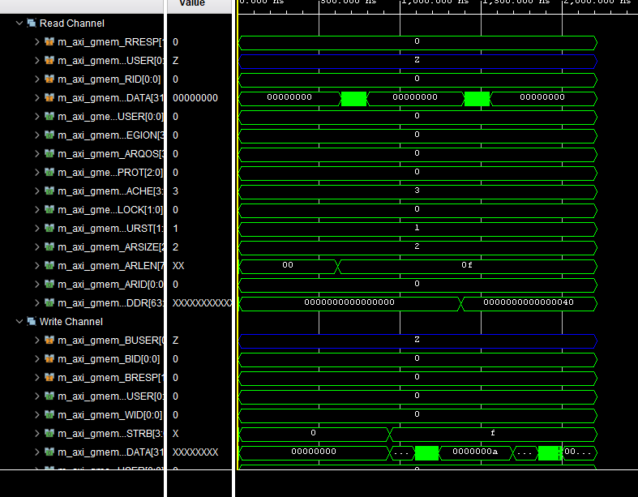</div>

**vadd_test.cpp**
```c++
#include <vector>
#include <iostream>
#include "vadd.h"

int main() {

    int size = DATA_SIZE;
    int inc_value = INCR_VALUE;
    // Allocate Memory in Host Memory
    size_t vector_size_bytes = sizeof(int) * size;
    std::vector<int> source_in(size);
    std::vector<int> source_out(size);
    std::vector<int> source_sw_results(size);
    int source[size];
    // Create the test data and Software Result
    for (int i = 0; i < size; i++) {
        source_in[i] = i;
        source_sw_results[i] = i + inc_value;
    }

    vadd(source,size, inc_value);
}
```

#### Create the Vivado project

The configure block design can use reference materials [here](https://uri-nextlab.github.io/ParallelProgammingLabs/HLS_Labs/Lab1.html). And we need to choose the number of the DMA according to the number of the interface.

<div align=center>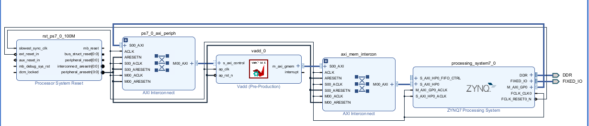</div>

#### Run synthesis,  Implementation, and generate bitstream

It may show some errors about I/O Ports, please fix them.

#### Download the bitstream file to PYNQ

<div align=center></div>


```python
import numpy as np
import pynq
from pynq import MMIO
```

#### Allocate DMA memory address size

The first step is to allocate the buffer. pynq allocate will be used to allocate the buffer, and NumPy will be used to specify the type of the buffer.

```python

overlay = pynq.Overlay('design_1.bit')

top_ip = overlay.vadd_0
top_ip.signature

a_buffer = pynq.allocate((32), np.int32)
# initialize input
for i in range (0, 32):
    a_buffer[i] = i
```


```python
aptr = a_buffer.physical_address

top_ip.register_map
```

<div align=center>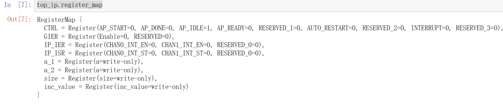</div>

```python
top_ip.register_map.size=32
top_ip.register_map.inc_value=10
# specify the address
# These addresses can be found in the generated .v file: vadd_control_s_axi.v
top_ip.write(0x10, aptr)
# start the HLS kernel
top_ip.write(0x00, 1)

```

We will see:

<div align=center>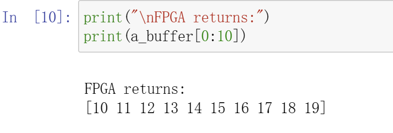</div>


### cache

In FPGA, non-burst accesses to the DDR memory are very expensive and can impact the overall performance of the design. Hence, it is important to devise a scheme that reduces the time needed to access the necessary information. An efficient solution is to re-write the code or use manual burst, but if that does not work then another solution might be to use a cache memory.

Cache provides a temporary storage area in the M_AXI adapter so the design can more quickly retrieve data. The effectiveness of the cache mechanism is measured in a hit/miss ratio and it is based on a property of computer programs called locality of reference, or the tendency of a program to access the same set of memory locations repetitively over a short period of time. It suggests that when a particular memory block is accessed, it is likely to be accessed again in the near future, along with memory located in close proximity. For instance, when executing consecutive instructions in memory, the next set of instructions to be accessed will most likely be within a contiguous block of data nearby.

**Syntax**
```c++
#pragma HLS cache port=<name> lines=<value> depth=<value>

```
Where:

* ```port=<name>```: Specifies the port to add cache to.

* ```lines=<value>```: Indicates the number of cache lines. The number of lines can be specified as 1, which indicates a single cache line, or a value greater than 1 expressed as a power of 2, indicating multiple cache lines. This is an optional value and defaults to 1 if not specified.

* ```depth=<value>```: Specifies the size of each line in words. The depth must be specified as a power of 2, and indicates the size in words of the pointer datatype for each line.
This is an optional value, and defaults to the max burst length if not specified. The max burst length defaults to 16, but can be globally ```specified by the syn.interface.m_axi_max_read_burst_length``` command as described in Interface Configuration, or by the ```syn.directive.interface``` command for specific interfaces.

Limitations

The CACHE directive or pragma has the following limitations:

* Cache is only supported for read-only port

* The cache is implemented as a Single port, Single-way cache.

* Cache is not supported for multiple ports connected to the same bundle

#### maxi_cache_conditional

This example illustrates case of usefulness of cases in cases of Vitis HLS burst failures

**dut. cpp**
```c++
extern "C" {
void dut(const unsigned int* in, // Read-Only Vector 1
         unsigned int* out,      // Output Result
         int size                // Size in integer
) {

#pragma HLS INTERFACE m_axi port = in bundle = aximm depth = 1024
#pragma HLS INTERFACE m_axi port = out bundle = out depth = 1024

// new cache pragma
#pragma HLS cache port = in lines = 8 depth = 128
//indicate the number of cache lines is 8
//and the size of each line is 128 in words
    for (int i = 0; i < size; i++) {
#pragma HLS pipeline II = 1
        int t;
        if (i != 512)
            t = in[i] + 1;
        else
            t = in[i];
        out[i] = t;
    }
}
}

```
The synthesis report is shown below:

<div align=center>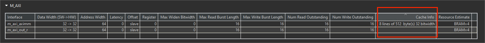</div>

How Caching Can Help:

* Reduces Memory Accesses: The cache buffers elements of in, potentially reducing individual memory transactions and mitigating burst failures.

* Improves Performance: Caching can improve performance by avoiding memory stalls and leveraging burst transfers more effectively.


**vadd_test.h**
```c++
#include <iostream>
#include <math.h>
#include <string.h>

#define N 1024

extern "C" void dut(const unsigned int* in, // Read-Only Vector 1
                    unsigned int* out,      // Output Result
                    int size                // Size in integer
);

void dut_sw(const unsigned int* in, // Read-Only Vector 1
            unsigned int* out,      // Output Result
            int size                // Size in integer
) {
    for (int i = 0; i < size; i++) {
        if (i != 512)
            out[i] = in[i] + 1;
        else
            out[i] = in[i];
    }
}

int main() {
    unsigned int A[N];
    unsigned int B[N], C[N];
    const unsigned int* in = A;
    unsigned int* out = B;
    unsigned int* ref = C;
    int i = 0;

    for (i = 0; i < N; i++)
        A[i] = i;

    for (i = 0; i < N; i++) {
        B[i] = 0;
        C[i] = 0;
    }

    dut(in, out, N);
    dut_sw(in, ref, N);

    int err = 0;

    for (i = 0; i < N; i++)
        if (ref[i] != out[i]) {
            std::cout << "index " << i << " ref = " << ref[i]
                      << " out = " << out[i] << std::endl;
            err++;
        }

    if (err) {
        std::cout << "FAIL" << std::endl;
        return -1;
    } else
        std::cout << "PASS" << std::endl;

    return 0;
}

```


#### maxi_cache_locality
The following example shows a design where overlapping access will cause the burst to fail. Using the CACHE pragma or directive will improve the performance of the design.

**dut.cpp**
```c++
#include <stdio.h>

extern "C" {
void dut(const int* in, // Read-Only Vector 1
         int* out,      // Output Result
         int size          // Size in integer
) {

#pragma HLS INTERFACE mode = m_axi bundle = aximm2 depth =                     \
    1024 max_read_burst_length = 16 num_read_outstanding = 32 port = in
#pragma HLS INTERFACE m_axi port = out bundle = aximm depth = 1024
#pragma HLS INTERFACE mode=s_axilite port=return
#pragma HLS INTERFACE mode=s_axilite port=in
#pragma HLS INTERFACE mode=s_axilite port=out
#pragma HLS INTERFACE mode=s_axilite port=size

#pragma HLS cache port = in lines = 1 depth = 128

    for (int i = 0; i < size; i++) {
        out[i] = in[i] + in[i + 1];
        printf("out[%d] is %d\r\n",i,out[i]);
    }
}
}

```
The synthesis report is shown below:

<div align=center>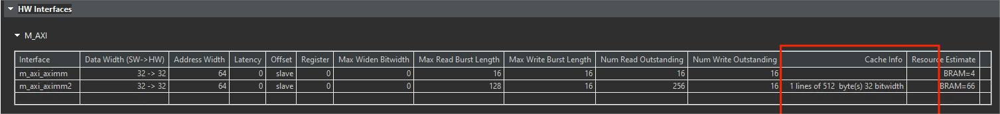</div>

Caching can improve performance and mitigate burst failures in scenarios with:

* Misaligned accesses

* Limited outstanding read capability
  
However, it might not completely eliminate burst failures, especially for very irregular access patterns or cache misses. Choosing appropriate cache parameters (lines, depth) is essential for effectiveness.
It's crucial to balance performance gains with potential area overhead and design complexity when using caches.

**dut_tb.cpp**
```c++
#include <iostream>
#include <math.h>
#include <string.h>

#define N 1024

extern "C" void dut(const int* in, // Read-Only Vector 1
		int* out,      // Output Result
                    int size          // Size in integer
);

int main() {
    int A[N + 1];
    int B[N + 1], C[N + 1];
    const int* in = A;
    int* out = B;
    int* ref = C;
    int i = 0;

    for (i = 0; i < N + 1; i++) {
        A[i] = i;
        B[i] = 0;
        C[i] = 0;
    }

    dut(in, out, N);
    int err = 0;

    for (i = 0; i < N; i++)
        if (fabs(out[i] / ref[i] - 1) > 1e-6) {
            std::cout << "index " << i << " ref = " << ref[i]
                      << " out = " << out[i] << std::endl;
            err++;
        }

    if (err) {
        std::cout << "FAIL" << std::endl;
        return -1;
    } else
        std::cout << "PASS" << std::endl;

    return 0;
}


```
#### Create the Vivado project

The configure block design can use reference materials [here](https://uri-nextlab.github.io/ParallelProgammingLabs/HLS_Labs/Lab1.html). And we need to choose the number of the DMA according to the number of the interface.

<div align=center>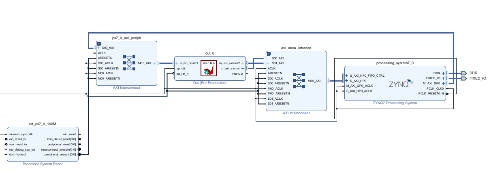</div>

#### Run synthesis,  Implementation, and generate bitstream

It may show some errors about I/O Ports, please fix them.

#### Download the bitstream file to PYNQ

<div align=center></div>

```python
import numpy as np
import pynq
from pynq import MMIO
```

#### Allocate DMA memory address size

The first step is to allocate the buffer. pynq allocate will be used to allocate the buffer, and NumPy will be used to specify the type of the buffer.

```python
overlay = pynq.Overlay('design_1.bit')

top_ip = overlay.dut_0
top_ip.signature

a_buffer = pynq.allocate((32), np.int32)
b_buffer = pynq.allocate((32), np.int32)


# initialize input
for i in range (0, 32):
    a_buffer[i] = i
```


```python
aptr = a_buffer.physical_address
bptr = b_buffer.physical_address

top_ip.register_map
```

<div align=center>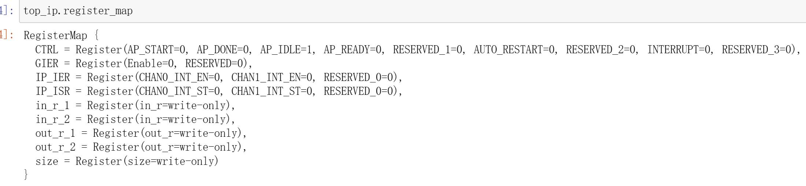</div>

```python
top_ip.register_map.size=32
# specify the address
# These addresses can be found in the generated .v file: vadd_control_s_axi.v
top_ip.write(0x10, aptr)
top_ip.write(0x1c, bptr)
# start the HLS kernel
top_ip.write(0x00, 1)

```
// Find the address offset of the memory ports (input, and output in this example). This information can be found in the xtop_hw.h file under solution1/impl/misc/drivers/top_v1_0/src directory.
We will see:

<div align=center>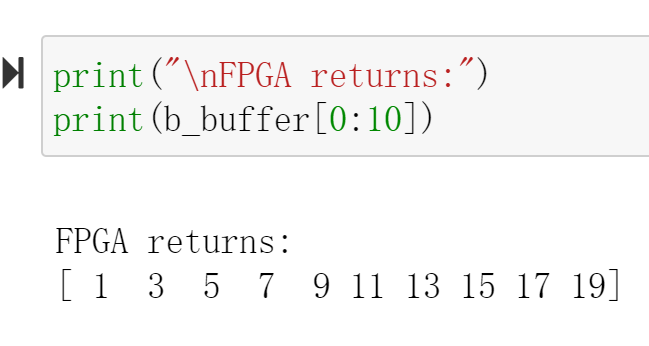</div>

### coefficient_filter

Example code for a scaled-integer fixed-point Hamming window function. This example is intended to demonstrate the recommended coding style when an array should be implemented as a ROM.  The key guideline is that the ROM's source (in the C code) array should be initialized by a sub-function to the function that accesses (reads from) the array.  When the
the array is properly inferred to be a ROM, the initialization function will be optimized away during HLS.

**hamming_window.cpp**
```c++
#include "hamming_window.h" // Provides default WINDOW_LEN if not user defined

// Translation module function prototypes:
static void hamming_rom_init(int16_t rom_array[]);

// Function definitions:
void hamming_window(int32_t outdata[WINDOW_LEN], int16_t indata[WINDOW_LEN]) {
  static int16_t window_coeff[WINDOW_LEN];
  unsigned i;

  // In order to ensure that 'window_coeff' is inferred and properly
  // initialized as a ROM, it is recommended that the array initialization
  // be done in a sub-function with global (wrt this source file) scope.
  hamming_rom_init(window_coeff);
process_frame:
  for (i = 0; i < WINDOW_LEN; i++) {
#pragma HLS pipeline
    outdata[i] = (int32_t)window_coeff[i] * (int32_t)indata[i];
  }
}

// This initialization function will be optimized away during high level
// sythesis (HLS), resulting in the underlying memory being inferred as a ROM
// by RTL synthesis.
static void hamming_rom_init(int16_t rom_array[WINDOW_LEN]) {
  int i;
  for (i = 0; i < WINDOW_LEN; i++) {
    float real_val =
        0.54f - 0.46f * cos(2.0f * M_PI * i / (float)(WINDOW_LEN - 1));
    rom_array[i] = (int16_t)(round(WIN_COEFF_SCALE * real_val));
  }
}
```

**hamming_window.h**
```c++
#ifndef HAMMING_WINDOW_H_
#define HAMMING_WINDOW_H_

#include <math.h>
#include <stdint.h>

#ifndef M_PI
#define M_PI 3.14159265358979323846
#endif

// If WINDOW_LEN is not defined by the user, define a default value
#ifndef WINDOW_LEN
#define WINDOW_LEN 256
#endif
// If WIN_COEFF_FRACBITS not defined by user, set a default value
#ifndef WIN_COEFF_FRACBITS
#define WIN_COEFF_FRACBITS (14)
#endif
// Set the scale factor for the window coefficients
#define WIN_COEFF_SCALE ((float)(1 << WIN_COEFF_FRACBITS))

// This function applies an Hamming window function to the 'indata' buffer,
// returning the windowed data in 'outdata'.  The coefficients are 16-bit
// scaled integer, which may be interpreted as a signed fixed point format,
// with WIN_COEFF_FRACBITS bits after the binary point.
void hamming_window(int32_t outdata[], int16_t indata[]);

#endif // HAMMING_WINDOW_H_ not defined
```
**hamming_window_test.cpp**
```c++
#include <stdio.h>

#include "hamming_window.h"

int main(int argc, char *argv[]) {
  int16_t test_data[WINDOW_LEN];
  int32_t hw_result[WINDOW_LEN], sw_result[WINDOW_LEN];
  int i;
  unsigned err_cnt = 0, check_dots = 0;

  for (i = 0; i < WINDOW_LEN; i++) {
    // Generate a test pattern for input to DUT
    test_data[i] = (int16_t)((32767.0 * (double)((i % 16) - 8) / 8.0) + 0.5);
    // Calculate the coefficient value for this index
    int16_t coeff_val = (int16_t)(round(
        WIN_COEFF_SCALE *
        (0.54 - 0.46 * cos(2.0 * M_PI * i / (double)(WINDOW_LEN - 1)))));
    // Generate array of expected values -- n.b. explicit casts to avoid
    // integer promotion issues
    sw_result[i] = (int32_t)test_data[i] * (int32_t)coeff_val;
  }

  // Call the DUT
  printf("Running DUT...");
  hamming_window(hw_result, test_data);
  printf("done.\n");

  // Check the results returned by DUT against expected values
  printf("Testing DUT results");
  for (i = 0; i < WINDOW_LEN; i++) {
    if (hw_result[i] != sw_result[i]) {
      err_cnt++;
      check_dots = 0;
      printf("\n!!! ERROR at i = %4d - expected: %10d\tgot: %10d", i,
             sw_result[i], hw_result[i]);
    } else { // indicate progress on console
      if (check_dots == 0)
        printf("\n");
      printf(".");
      if (++check_dots == 64)
        check_dots = 0;
    }
  }
  printf("\n");

  // Print final status message
  if (err_cnt) {
    printf("!!! TEST FAILED - %d errors detected !!!\n", err_cnt);
  } else
    printf("*** Test Passed ***\n");

  // Only return 0 on success
  if (err_cnt)
    return 1;
  else
    return 0;
}
```

### ecc_flags

#### pragma HLS bind_storage

The BIND_STORAGE pragma assigns a variable (array, or function argument) in the code to a specific memory type (```type```) in the RTL. If the pragma is not specified, the Vitis HLS tool determines the memory type to assign. The HLS tool implements the memory using specified implementations (```impl```) in the hardware.

For example, you can use the pragma to specify which memory type to use to implement an array. This lets you control whether the array is implemented as a single or a dual-port RAM for example.
Important: This feature is important for arrays on the top-level function interface, because the memory type associated with the array determines the number and type of ports needed in the RTL, as discussed in Arrays on the Interface. However, for variables assigned to top-level function arguments you must assign the memory type and implementation using the ```-storage_type``` and ```-storage_impl``` options of the INTERFACE pragma or directive.

You can also specify the latency of the implementation. For block RAMs on the interface, the ```latency``` option lets you model off-chip, non-standard SRAMs at the interface, for example supporting an SRAM with a latency of 2 or 3. For internal operations, the ```latency``` option allows the memory to be implemented using more pipelined stages. These additional pipeline stages can help resolve timing issues during RTL synthesis.
Important: To use the ```latency``` option, the operation must have an available multi-stage implementation. The HLS tool provides a multi-stage implementation for all block RAMs.

Place the pragma in the C/C++ source within the body of the function where the variable is defined.
```c++
#pragma HLS bind_storage variable=<variable> type=<type>\
[ impl=<value> latency=<int> ]
```

Where:
```c++
variable=<variable>
```
 Defines the variable to assign the BIND_STORAGE pragma to. This is required when specifying the pragma.

```c++
type=<type>
```
Defines the type of memory to bind to the specified variable.

Supported types include: ```fifo```, ```ram_1p```, ```ram_1wnr```, ```ram_2p```, ```ram_s2p```, ```ram_t2p```, ```rom_1p```, ```rom_2p```, ```rom_np```.

<div align=center>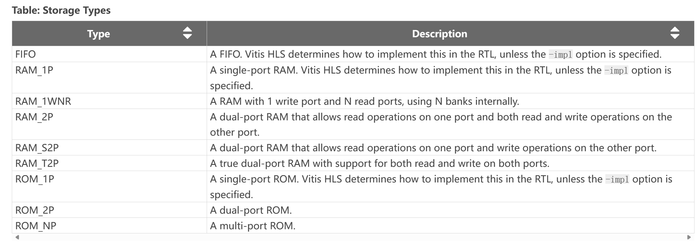</div>


```c++
impl=<value>
```
Defines the implementation for the specified memory type. Supported implementations include: ```bram```, ```bram_ecc```, ```lutram```, ```uram```, ```uram_ecc```, ```srl```, ```memory```, and ```auto``` as described below.

<div align=center>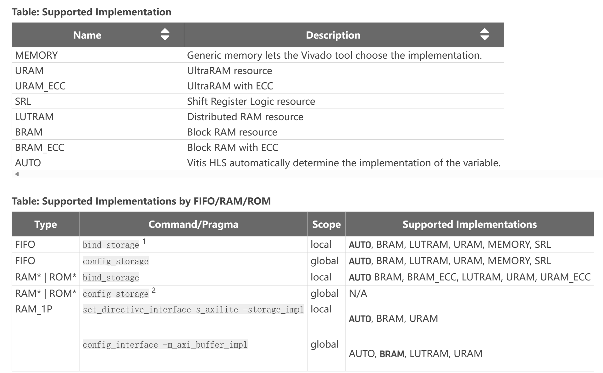</div>

```c++
latency=<int>
```
Defines the default latency for the binding of the type. The following table shows that the valid latency varies according to the specified ```type``` and ```simple ``. The default is -1, which lets Vitis HLS choose the latency.

<div align=center>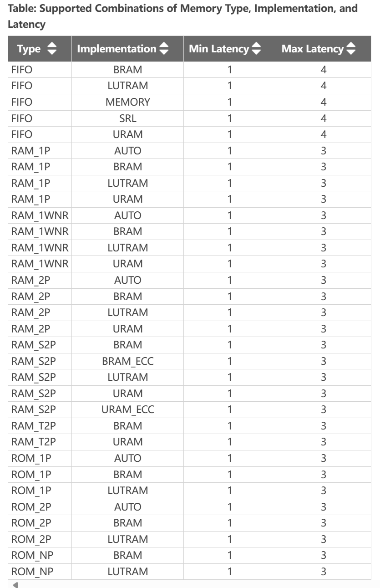</div>

This example illustrates how to infer an error code correction ultra-RAM using BIND_STORAGE. 

**ecc_flags.h**
```c++
#define N 10

using din_t = int;

void ecc_flags(din_t in1[N], din_t in2[N], const din_t Iter, din_t output[N]);
```

**ecc_flags.cpp**
```c++
#include "ecc_flags.h"

void sfunc2(din_t vec1[N], const din_t sIter, din_t ovec[N]) {
    for (int i = 0; i < N; ++i)
        ovec[i] = vec1[i] / sIter;
}

void sfunc1(const din_t cIter, din_t a[N], din_t b[N], din_t res[N]) {
    int i;
    din_t res1[N];
#pragma HLS ARRAY_RESHAPE variable = res1 dim = 1 factor = 2 block
// #pragma HLS BIND_STORAGE variable = res1 type = ram_s2p impl = uram_ecc
#pragma HLS BIND_STORAGE variable = res1 type = ram_s2p impl = bram_ecc
//Because the PYNQ hasn't the uram, so we change to the bram_ecc

    for (i = 0; i < N; i++) {
        res1[i] = b[i] + a[i];
    }
    sfunc2(res1, cIter, res);
}

void sfunc3(din_t inrun[N], din_t oval[N]) {
    int i;
    din_t calc = 0;
    for (i = 0; i < N; ++i) {
        calc = (inrun[i] * inrun[i]) / (i + 1);
        oval[i] = calc;
    }
}

void ecc_flags(din_t in1[N], din_t in2[N], const din_t Iter, din_t output[N]) {
    din_t auxbuffer1[N];

    sfunc1(Iter, in1, in2, auxbuffer1);
    sfunc3(auxbuffer1, output);

    return;
}
```
The synthesis report is shown below.

<div align=center>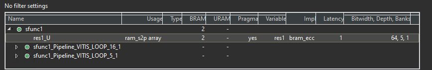</div>

**ecc_flags_test .h**
```c++
#include "ecc_flags.h"

#include <cstdlib>
#include <fstream>
#include <iostream>
using namespace std;

int main() {
    din_t in1[N];
    din_t in2[N];
    din_t output[N];
    const din_t Iter = 100;

    int i, retval = 0;
    ofstream FILE;

    // Create input data
    for (i = 0; i < N; ++i) {
        in1[i] = 1000 * i;
        in2[i] = 1000 * i;
        cout << in1[i] << endl;
        cout << in2[i] << endl;
    }
    // Save the results to a file
    FILE.open("result.dat");

    // Call the function

    ecc_flags(in1, in2, Iter, output);

    // Save output data
    for (i = 0; i < N; ++i) {
        cout << output[i] << endl;
        FILE << output[i] << endl;
    }
    FILE.close();

    // Compare the results file with the golden results
    retval = system("diff --brief -w result.dat result.golden.dat");
    if (retval != 0) {
        printf("Test failed  !!!\n");
        retval = 1;
    } else {
        printf("Test passed !\n");
    }

    // Return 0 if the test passes
    return retval;
}
```

### Imem_2rw

#### Mapping Software Arrays to Hardware Memory

Arrays are a fundamental data structure in any C++ software program. Software programmers view arrays as simply a container and allocate/deallocate arrays on demand - often dynamically. This type of dynamic memory allocation for arrays is not supported when the same program needs to be synthesized for hardware. For synthesizing arrays to hardware, knowing the exact amount of memory (statically) required for your algorithm becomes necessary. In addition, the memory architecture on FPGAs (also called "local memory") has very different trade-offs when compared to global memory which is often the DDR memory or HBM memory banks. Access to global memory has high latency costs and can take many cycles while access to local memory is often quick and only takes one or more cycles.

When an HLS design has been suitably pipelined and/or unrolled, the memory access pattern becomes established. The HLS compiler allows users to map arrays to various types of resources - where the array elements are available in parallel with or without handshaking signals. Both internal arrays and arrays in the top-level function's interface can be mapped to registers or memories. If the array is in the top-level interface, the tool automatically creates the address, data, and control signals required to interface to external memory. If the array is internal to the design, the tool not only creates the necessary address, data, and control signals to access the memory but also instantiates the memory model (which is then inferred as memory by the downstream RTL synthesis tool).

Arrays are typically implemented as memory (RAM, ROM, or shift registers) after synthesis. Arrays can also be fully partitioned into individual registers to create a fully parallel implementation provided the platform has enough registers to support this step. Arrays on the top-level function interface are synthesized as RTL ports that access external memory. Internal to the design, arrays sized less than 1024 will be synthesized as a shift register. Arrays sized greater than 1024 will be synthesized into block RAM (BRAM), LUTRAM, or UltraRAM (URAM) depending on the optimization settings (see BIND_STORAGE directive/pragma).

This is simple example of vector addition to demonstrate how to utilize both ports of Local Memory in Vitis HLS:

**vadd.h**
```c++
#define DATA_SIZE 4096
#define BUFFER_SIZE 1024

void vadd(const unsigned int* in1, // Read-Only Vector 1
          const unsigned int* in2, // Read-Only Vector 2
          unsigned int* out_r,     // Output Result
          int size                 // Size in integer
          );

```

**vadd.cpp**
```c++
#include <string.h>
#include "vadd.h"


// TRIPCOUNT identifiers
const unsigned int c_chunk_sz = BUFFER_SIZE;//1024
const unsigned int c_size = DATA_SIZE;//4096

/*
    Vector Addition Kernel Implementation
    Arguments:
        in1   (input)     --> Input Vector1
        in2   (input)     --> Input Vector2
        out_r   (output)    --> Output Vector
        size  (input)     --> Size of Vector in Integer
   */
void vadd(const unsigned int* in1, // Read-Only Vector 1
          const unsigned int* in2, // Read-Only Vector 2
          unsigned int* out_r,     // Output Result
          int size                 // Size in integer
          ) {
    unsigned int v1_buffer[BUFFER_SIZE];   // Local memory to store vector1
    unsigned int v2_buffer[BUFFER_SIZE];   // Local memory to store vector2
    unsigned int vout_buffer[BUFFER_SIZE]; // Local Memory to store result

#pragma HLS INTERFACE m_axi port = in1 depth = DATA_SIZE
#pragma HLS INTERFACE m_axi port = in2 depth = DATA_SIZE
#pragma HLS INTERFACE m_axi port = out_r depth = DATA_SIZE
//#pragma HLS DATAFLOW
#pragma HLS interface s_axilite register port=return
#pragma HLS interface s_axilite port=size
    // Per iteration of this loop perform BUFFER_SIZE vector addition
    for (int i = 0; i < size; i += BUFFER_SIZE) {
#pragma HLS LOOP_TRIPCOUNT min = c_size / c_chunk_sz max = c_size / c_chunk_sz
        int chunk_size = BUFFER_SIZE;
        // boundary checks
//        if ((i + BUFFER_SIZE) > size) chunk_size = size - i;

    // burst read of v1 and v2 vector from global memory
    read1:
        for (int j = 0; j < chunk_size; j++) {
#pragma HLS LOOP_TRIPCOUNT min = c_chunk_sz max = c_chunk_sz
            v1_buffer[j] = in1[i + j];
        }
    read2:
        for (int j = 0; j < chunk_size; j++) {
#pragma HLS LOOP_TRIPCOUNT min = c_chunk_sz max = c_chunk_sz
            v2_buffer[j] = in2[i + j];
        }

    // FPGA implementation, local array is mostly implemented as BRAM Memory
    // block.
    // BRAM Memory Block contains two memory ports which allow two parallel access
    // to memory. To utilized both ports of BRAM block, vector addition loop is
    // unroll with factor of 2. It is equivalent to following code:
    //  for (int j = 0 ; j < chunk_size ; j+= 2){
    //    vout_buffer[j]   = v1_buffer[j] + v2_buffer[j];
    //    vout_buffer[j+1] = v1_buffer[j+1] + v2_buffer[j+1];
    //  }
    // Which means two iterations of loop will be executed together and as a
    // result
    // it will double the performance.
    // Auto-pipeline is going to apply pipeline to this loop
    vadd:
        for (int j = 0; j < chunk_size; j++) {
// As the outer loop is not a perfect loop
#pragma HLS loop_flatten off
#pragma HLS UNROLL FACTOR = 2
#pragma HLS LOOP_TRIPCOUNT min = c_chunk_sz max = c_chunk_sz
            // perform vector addition
            vout_buffer[j] = v1_buffer[j] + v2_buffer[j];
        }

    // burst write the result
    write:
        for (int j = 0; j < chunk_size; j++) {
#pragma HLS LOOP_TRIPCOUNT min = c_chunk_sz max = c_chunk_sz
            out_r[i + j] = vout_buffer[j];
        }
    }
}

```

**vadd_test.h**
```c++
#include <vector>
#include <iostream>
#include "vadd.h"

int main() {

    // Allocate Memory in Host Memory
    size_t vector_size_bytes = sizeof(int) * DATA_SIZE;

    std::vector<unsigned int> source_in1(DATA_SIZE);
    std::vector<unsigned int> source_in2(DATA_SIZE);
    std::vector<unsigned int> source_hw_results(DATA_SIZE);
    std::vector<unsigned int> source_sw_results(DATA_SIZE);

    // Create the test data and Software Result
    for (int i = 0; i < DATA_SIZE; i++) {
        source_in1[i] = i;
        source_in2[i] = i * i;
        source_sw_results[i] = i * i + i;
        source_hw_results[i] = 0;
    }

    vadd(source_in1.data(), source_in2.data(), source_hw_results.data(), DATA_SIZE);

    // Compare the results of the Device to the simulation
    int match = 0;
    for (int i = 0; i < DATA_SIZE; i++) {
        if (source_hw_results[i] != source_sw_results[i]) {
            std::cout << "Error: Result mismatch" << std::endl;
            std::cout << "i = " << i << " CPU result = " << source_sw_results[i]
                      << " Device result = " << source_hw_results[i] << std::endl;
            match = 1;
            break;
        }
    }

    std::cout << "TEST " << (match ? "FAILED" : "PASSED") << std::endl;
    return (match ? EXIT_FAILURE : EXIT_SUCCESS);
}

```
#### Create the Vivado project

The configure block design can use reference materials [here](https://uri-nextlab.github.io/ParallelProgammingLabs/HLS_Labs/Lab1.html). And we need to choose the number of the DMA according to the number of the interface.

<div align=center>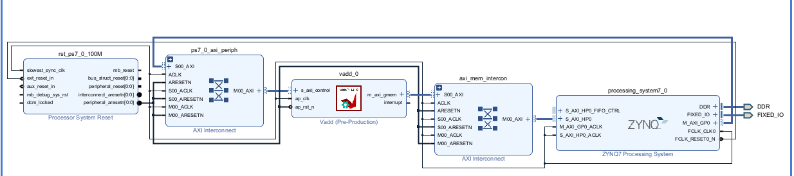</div>

#### Run synthesis,  Implementation, and generate bitstream

It may show some errors about I/O Ports, please fix them.

#### Download the bitstream file to PYNQ

<div align=center></div>

#### Allocate DMA memory address size

The first step is to allocate the buffer. pynq allocate will be used to allocate the buffer, and NumPy will be used to specify the type of the buffer.

```python

overlay = pynq.Overlay('design_1.bit')

top_ip = overlay.vadd_0
top_ip.signature

a_buffer = pynq.allocate((32), np.int32)
b_buffer = pynq.allocate((32), np.int32)
sum_buffer = pynq.allocate((32), np.int32)

# initialize input
for i in range (0, 32):
    a_buffer[i] = i
    b_buffer[i] = i
```


```python
aptr = a_buffer.physical_address
bptr = b_buffer.physical_address
sumptr = sum_buffer.physical_address

top_ip.register_map

```

<div align=center>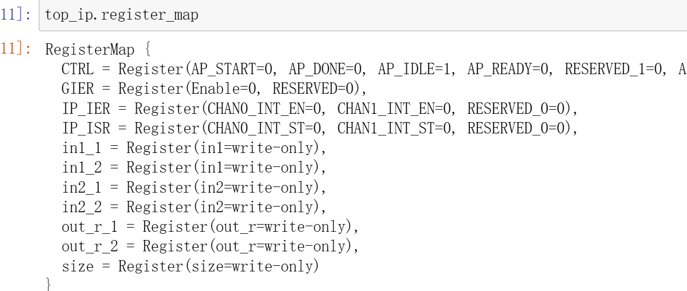</div>

```python
top_ip.register_map.size=32
# specify the address
# These addresses are in the generated .v file: vadd_control_s_axi.v
top_ip.write(0x10, aptr)
top_ip.write(0x1c, bptr)
top_ip.write(0x28, sumptr)
# start the HLS kernel
top_ip.write(0x00, 1)

```

We will see:

<div align=center>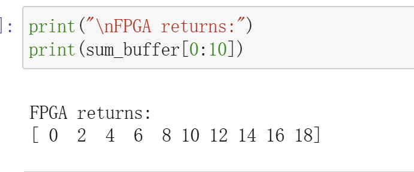</div>

## Demonstrates

You need to finish the ```vadd``` function for the ```burst_rw``` and the ```dut``` function for the ```cache``` and implement it on the PYNQ-Z2 board.
