# Lab9 Interface_Memory_2

<script type="text/x-mathjax-config">
  MathJax.Hub.Config({
    tex2jax: {
        inlineMath: [ ['$','$'], ["\\(","\\)"] ],
        displayMath: [ ['$$','$$'], ["\\[","\\]"] ],
        processEscapes: false,
    }
  });
</script> 
    
<script type="text/javascript"
        src="https://cdn.mathjax.org/mathjax/latest/MathJax.js?config=TeX-AMS-MML_HTMLorMML">
</script>

## manual_burst
Burst transfers improve the throughput of the I/O of the kernel by reading or writing large chunks of data to the global memory. The larger the size of the burst, the higher the throughput, this metric is calculated as follows ((# of bytes transferred)* (kernel frequency)/(Time)). The maximum kernel interface bitwidth is 512 bits and if the kernel is compiled at 300 MHz, then it can theoretically achieve = (80-95% efficiency of the DDR)*(512* 300 MHz)/1 sec = ~17-19 GBps for a DDR. As explained, Vitis HLS performs automatic burst optimizations which intelligently aggregates the memory accesses of the loops/functions from the user code and performs read/write of a particular size in a single burst request. However, burst transfer also has requirements that can sometimes be overburdening or difficult to meet, as discussed in [Preconditions and Limitations of Burst Transfer](https://docs.xilinx.com/r/en-US/ug1399-vitis-hls/Preconditions-and-Limitations-of-Burst-Transfer).

In some cases, where autmatic burst access has failed, an efficient solution is to re-write the code or use manual burst. In such cases, if you are familiar with the AXI4 ```m_axi``` protocol, and understand hardware transaction modeling, you can implement manual burst transfers using the ```hls::burst_maxi``` class as described below. 

**hls::burst_maxi Class**

The ```hls::burst_maxi``` class provides a mechanism to perform read/write access to the DDR memory. These methods will translate the class methods usage behavior into respective AXI4 protocol and send and receive requests on the AXI4 bus signals - AW, AR, WDATA, BVALID, RDATA. These methods control the burst behavior of the HLS scheduler. The adapter, which receives the commands from the scheduler, is responsible for sending the data to the DDR memory. These requests will adhere to the user-specified INTERFACE pragma options, such as ```max_read_burst_length``` and ```max_write_burst_length```. The class methods should only be used in the kernel code, and not in the test bench (except for the class constructor as described [below](https://docs.xilinx.com/r/en-US/ug1399-vitis-hls/Using-Manual-Burst)).

**Using Manual Burst in HLS Design**

In the HLS design, when you find that automatic burst transfers are not working as desired, and you cannot optimize the design as needed, you can implement the read and write transactions using the ```hls::burst_maxi``` object. In this case, you will need to modify your code to replace the original pointer argument with ```burst_maxi``` as a function argument. These arguments must be accessed by the explicit ```read``` and ```write``` methods of the ```burst_maxi``` class, as shown in the following examples.

The following shows an original code sample, which uses a pointer argument to read data from global memory.

```c++
void dut(int *A) {
  for (int i = 0; i < 64; i++) {
  #pragma pipeline II=1
      ... = A[i]
  }
}
```
In the modified code below, the pointer is replaced with the ```hls::burst_maxi<>``` class objects and methods. In the example, the HLS scheduler puts 4 requests of ```len``` 16 from port ```A``` to the ```m_axi``` adapter. The Adapter stores them inside a FIFO and whenever the AW/AR bus is available it will send the request to the global memory. In the 64 loop iterations, the ```read()``` command issues a blocking call that will wait for the data to come back from the global memory. After the data becomes available the HLS scheduler will read it from the ```m_axi``` adapter FIFO.

```c++
#include "hls_burst_maxi.h"
void dut(hls::burst_maxi<int> A) {
  // Issue 4 burst requests
  A.read_request(0, 16); // request 16 elements, starting from A[0]
  A.read_request(128, 16); // request 16 elements, starting from A[128]
  A.read_request(256, 16); // request 16 elements, starting from A[256]
  A.read_request(384, 16); // request 16 elements, starting from A[384]
  for (int i = 0; i < 64; i++) {
  #pragma pipeline II=1
      ... = A.read(); // Read the requested data
  }
}
```

In example 2 below, the HLS scheduler/kernel puts 2 requests from port A to the adapter, the first request of ```len``` 2, and the second request of ```len``` 1, for a total of 2 write requests. It then issues corresponding, because the total burst length is 3 write commands. The Adapter stores these requests inside a FIFO and whenever the AW, W bus is available it will send the request and data to the global memory. Finally, two ```write_response``` commands are used, to await response for the two ```write_requests```.

```c++
void trf(hls::burst_maxi<int> A) {
  A.write_request(0, 2);
  A.write(x); // write A[0]
  A.write_request(10, 1);
  A.write(x, 2); // write A[1] with byte enable 0010
  A.write(x); // write A[10]
  A.write_response(); // response of write_request(0, 2)
  A.write_response(); // response of write_request(10, 1)
}
```


**Using Manual Burst in C-Simulation**

You can pass a regular array to the top function, and the array will be transformed to ```hls::burst_maxi``` automatically by the constructor.

```c++
#include "hls_burst_maxi.h"
void dut(hls::burst_maxi<int> A);
 
int main() {
  int Array[1000];
  dut(Array);
  ......
}
```

Vitis HLS characterizes two types of burst behaviors: pipeline burst, and sequential burst. [Ref](https://docs.xilinx.com/r/en-US/ug1399-vitis-hls/Using-Manual-Burst)

### manual_burst_example

#### auto_burst_inference_failure

This example shows that auto burst inference failure as the size is unknown at compile time. Manual burst can be used to improve the performance. 

**example.h**
```c++
#include "ap_int.h"
const int NUM = 10;
void krnl_transfer(int* in, int* out, const int size);
```
**example.cpp**
```c++
#include "example.h"


//The function passes the input data to the output and  repeats NUM times.
//Input: in and size
//Output: out
//NUM is defined to decide the times of repeating
void krnl_transfer(int* in, int* out, const int size) {
#pragma HLS INTERFACE m_axi port = in depth = 512
#pragma HLS INTERFACE m_axi port = out depth = 5120
    int buf[8192];
    for (int i = 0; i < size; i++) {
#pragma HLS PIPELINE II = 1
        buf[i] = in[i];
    }

    for (int i = 0; i < NUM; i++) {
        for (int j = 0; j < size; j++) {
#pragma HLS PIPELINE II = 1
            out[j + size * i] = buf[j];
        }
    }
}

```
The synthesis report is shown below.

<div align=center>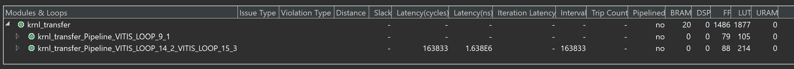</div>

And the synthesis result is shown below.

<div align=center>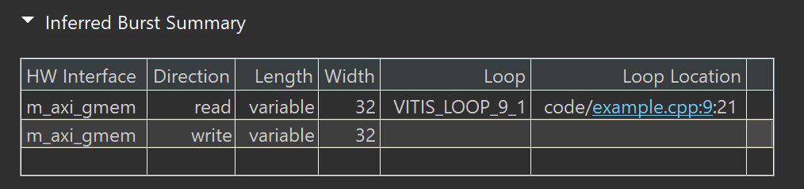</div>


Performance Benefits is shown below.

<div align=center>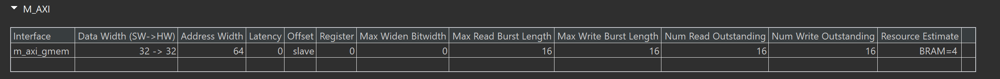</div>

<div align=center>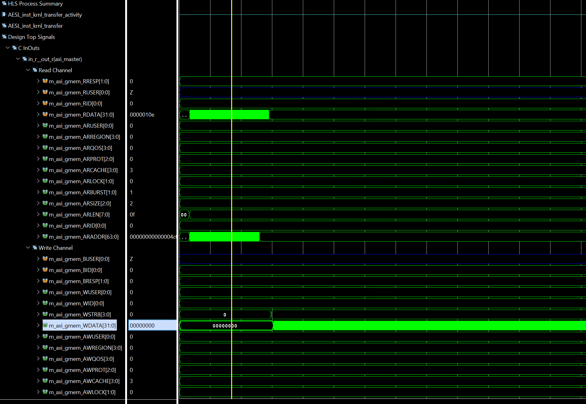</div>

Potential Burst Failure:

* Unknown Size: The size parameter is unknown at compile time, hindering the HLS tool's ability to automatically infer optimal burst lengths for memory accesses.

* Consequence: The tool might generate conservative burst sizes, potentially leading to suboptimal performance.

**example_tb.cpp**
```c++
#include "example.h"
#include <iostream>
#define iter 10

int main() {

    int size = 512;
    int in[size * iter];
    int a[size];

    int out[size * iter];

    for (int i = 0; i < size; i++) {
        in[i] = i;
        a[i] = i;
    }

    krnl_transfer(in, out, size);

    int var;
// The iter is the same effect as the NUM in the example.cpp
    for (int j = 0; j < iter; j++) {
        for (int i = 0; i < size; i++) {
            if (out[i] != a[i]) {
                std::cout << "design fails"
                          << " i " << i << " out " << out[i] << " a " << a[i]
                          << std::endl;
                return 1;
            }
        
        }
    }
    return 0;
}
```

#### manual_burst_inference_success

This example shows how to modify a design that failed automatic burst inference with one that succeeds when we use the manual burst flow. 

**example.h**
```c++
#include "ap_int.h"
#include "hls_burst_maxi.h"
const int NUM = 10;

void transfer_kernel(hls::burst_maxi<int> in, hls::burst_maxi<int> out,
                     const int size);
```

**example.cpp**
```c++
#include "example.h"


//The function has the same effect as the last example but used another way
//Input: in and size
//Output: out
void transfer_kernel(hls::burst_maxi<int> in, hls::burst_maxi<int> out,
                     const int size) {
#pragma HLS INTERFACE m_axi port = in depth = 512 latency = 32 offset =        \
    slave bundle = bundle1
#pragma HLS INTERFACE m_axi port = out depth = 5120 offset = slave latency =   \
    32 bundle = bundle2
#pragma HLS INTERFACE mode=s_axilite port=return
#pragma HLS INTERFACE mode=s_axilite port=size
    int buf[8192];
    in.read_request(0, size);
    for (int i = 0; i < size; i++) {
#pragma HLS PIPELINE II = 1
        buf[i] = in.read();
    }

    out.write_request(0, size * NUM);

    for (int i = 0; i < NUM; i++) {
        for (int j = 0; j < size; j++) {
#pragma HLS PIPELINE II = 1
            int a = buf[j];
            out.write(a);
        }
    }
    out.write_response();
}
```
The synthesis report is shown below.

<div align=center>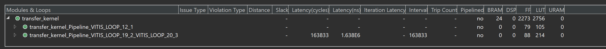</div>

And the sythesis result is shown below.

<div align=center>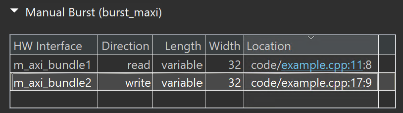</div>

As you can see from the preceding figure, the tool has inferred the burst from the user code and length is mentioned as variable at compile time.

Performance Benefits is shown below.

<div align=center>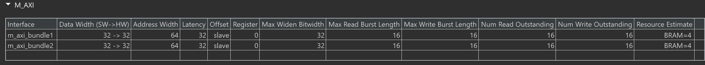</div>

<div align=center>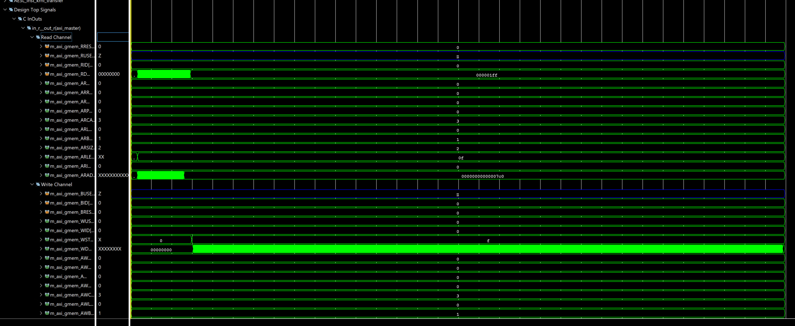</div>

During the runtime the HLS compiler sends a burst request of ```length = size``` and the adapter will partition them into the user-specified ```burst_length``` pragma option. In this case the default burst length is set to 16, which is used in the ```ARlen``` and ```AWlen``` channels. The read/write channel achieved maximum throughput because there are no bubbles during the transfer.

**example_tb.cpp**
```c++
#include "example.h"
#include <iostream>
#define iter 10

int main() {

    int size = 512;
    int in[size * iter];
    int a[size];

    int out[size * iter];

    for (int i = 0; i < size; i++) {
        in[i] = i;
        a[i] = i;
    }

    transfer_kernel(in, out, size);

    int var;
    for (int j = 0; j < iter; j++) {
        for (int i = 0; i < size; i++) {
            if (out[i] != a[i]) {
                std::cout << "design fails"
                          << " i " << i << " out " << out[i] << " a " << a[i]
                          << std::endl;
                return 1;
            }
        }
    }
    return 0;
}
```

#### Create the Vivado project

The configure block design can use reference materials [here](https://uri-nextlab.github.io/ParallelProgammingLabs/HLS_Labs/Lab1.html). And we need to choose the number of the DMA according to the number of the interface.

<div align=center>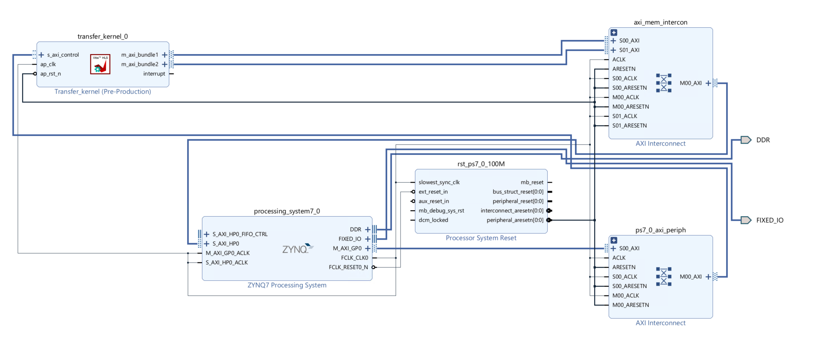</div>

#### Run synthesis,  Implementation, and generate bitstream

It may show some errors about I/O Ports, please fix them.

#### Download the bitstream file to PYNQ

<div align=center></div>


```python
import numpy as np
import pynq
from pynq import MMIO
```

#### Allocate DMA memory address size

The first step is to allocate the buffer. pynq allocate will be used to allocate the buffer, and NumPy will be used to specify the type of the buffer.

```python

overlay = pynq.Overlay('design_1.bit')

top_ip = overlay.transfer_kernel_0
top_ip.signature

a_buffer = pynq.allocate((32), np.int32)
sum_buffer = pynq.allocate((32), np.int32)
# initialize input
for i in range (0, 32):
    a_buffer[i] = i
```

```python
aptr = a_buffer.physical_address
sumptr = sum_buffer.physical_address
top_ip.register_map
```

<div align=center>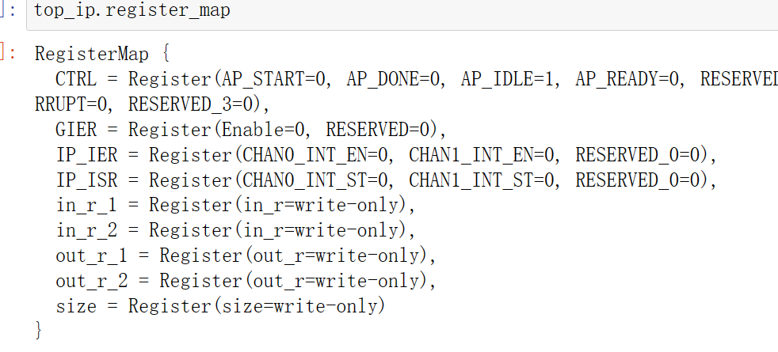</div>

```python
top_ip.register_map.size=32
# specify the address
# These addresses can be found in the generated .v file: vadd_control_s_axi.v
top_ip.write(0x10, aptr)
top_ip.write(0x1C, sumptr)
# start the HLS kernel
top_ip.write(0x00, 1)

```

We will see:

<div align=center>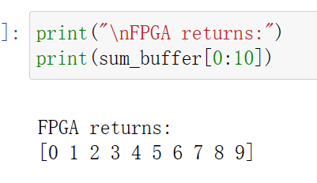</div>


### manual_burst_with_conditions

This example shows how manual bursting can be used even if there are memory accesses that are guarded by conditional expressions.  

**example.h**
```c++
#include "hls_burst_maxi.h"

#ifndef _LOOP_SEQUENTIAL_H_
#define _LOOP_SEQUENTIAL_H_

#include "ap_int.h"
#define N 800

typedef ap_int<30> din_t;
typedef ap_int<20> dout_t;

typedef struct {
    din_t A;
    dout_t B;
} DUO;

void example(hls::burst_maxi<din_t> A, hls::burst_maxi<din_t> B,
             hls::burst_maxi<dout_t> RES, din_t factor);

#endif
```

**example.cpp**
```c++
#include "example.h"

//The function is to read the input data and accumulate the values for the first N/4 data and the last N/4 data and the have the subtraction operation for the last N/4 data
//Input: IN and factor
//Output: x_aux[N]
void read_a(hls::burst_maxi<din_t> IN, dout_t x_aux[N], din_t factor) {

    IN.read_request( 0,N / 4); // request to read N/4 elements from the first element
    IN.read_request( N - N / 4,N / 4); // request to read N/4 elements from the last quarter element

    dout_t X_accum = N / 4;
    din_t temp;
    for (int i = 0; i < factor / 2; i++) {
        if (i < N / 4) {
            temp = IN.read();
            X_accum += temp;
            x_aux[i] = X_accum;
        }
        else {
            if (i == N / 4) {
                X_accum = i;
            }
            temp = IN.read();
            X_accum += temp;
            x_aux[N - N / 2 + i] = X_accum - N;
        }
    }
}


//The function has the same effect as the read_a function
void read_b(hls::burst_maxi<din_t> IN, dout_t y_aux[N], din_t factor) {

    IN.read_request( 0,N / 4); // request to read N/4 elements from the first element
    IN.read_request( N - N / 4,N / 4); // request to read N/4 elements from the last quarter element


    dout_t Y_accum = N / 4;
    din_t temp;
    for (int i = 0; i < factor / 2; i++) {
        if (i < N / 4) {
            temp = IN.read();
            Y_accum += temp;
            y_aux[i] = Y_accum;
        } else {
            if (i == N / 4) {
                Y_accum = i;
            }
            temp = IN.read();
            Y_accum += temp;
            y_aux[N - N / 2 + i] = Y_accum + N;
        }
    }
}


//The function performs a subtraction operation on the first N/4 data and last N/4 data of the array x_aux[N] and input array y_aux.
//Input: x_aux[N] and y_aux[N]
//Output: RES
void write(hls::burst_maxi<dout_t> RES, dout_t x_aux[N], dout_t y_aux[N]) {
    RES.write_request( 0, N / 4); // request to write N/4 elements from the first element
    RES.write_request(N - N / 4,N / 4); // request to write N/4 elements from the last quarter element

    for (int i = 0; i < N / 2; i++) {
        if (i < N / 4)
            RES.write(x_aux[i] - y_aux[i]);
        else
            RES.write(x_aux[N - N / 2 + i] - y_aux[N - N / 2 + i] / N);
    }
    RES.write_response(); // wait for the write operation to complete
    RES.write_response(); // wait for the write operation to complete
}

//The function performs the addition and then performs the subtraction operation on the array and the factor
//Inout: x_aux[N] and y_aux[N], which means that they are input and output
//Input: factor
void process(dout_t x_aux[N], dout_t y_aux[N], din_t factor) {

    for (int i = 0; i < N / 4; i++) {
        x_aux[i] = factor + x_aux[i];
        y_aux[i] = factor + y_aux[i];
    }

    for (int i = N - N / 4; i < N; i++) {
        x_aux[i] = x_aux[i] - factor;
        y_aux[i] = y_aux[i] - factor;
    }
}

//The function is to read A and B and has the process of the A and B and write the result at last
//Input: A and B and factor
//Output: RES 
void example(hls::burst_maxi<din_t> A, hls::burst_maxi<din_t> B,
             hls::burst_maxi<dout_t> RES, din_t factor) {
#pragma HLS INTERFACE m_axi depth = 800 port = A bundle = bundle1
#pragma HLS INTERFACE m_axi depth = 800 port = B bundle = bundle2
#pragma HLS INTERFACE m_axi depth = 800 port = RES bundle = bundle3
#pragma HLS INTERFACE mode=s_axilite port=return
#pragma HLS INTERFACE mode=s_axilite port=factor
    dout_t x_aux[N];
    dout_t y_aux[N];
    read_a(A, x_aux, factor);
    read_b(B, y_aux, factor);

    process(x_aux, y_aux, factor);

    write(RES, x_aux, y_aux);
}
```
The co-simulation report is shown below.

<div align=center>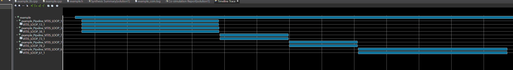</div>


**example_tb.cpp**
```c++
#include "example.h"

void example_sw(din_t A[N], din_t B[N], dout_t RES[N], din_t factor) {

    dout_t X_accum = 0;
    dout_t Y_accum = 0;
    int i, j;
    dout_t x_aux[N];
    dout_t y_aux[N];

SUM_X0:
    for (i = 0; i < N / 4; i++) {
        X_accum += A[i];
        x_aux[i] = X_accum;
    }
SUM_Y0:
    for (i = 0; i < N / 4; i++) {
        Y_accum += B[i];
        y_aux[i] = Y_accum;
    }

    for (int i = 0; i < N / 4; i++) {
        x_aux[i] = factor + x_aux[i];
        y_aux[i] = factor + y_aux[i];
    }

MUL0:
    for (i = 0; i < N / 4; i++) {
        RES[i] = (x_aux[i] - y_aux[i]);
    }

    X_accum = N / 4;

SUM_X16:
    for (i = N - N / 4; i < N; i++) {
        X_accum += A[i];
        x_aux[i] = X_accum - N;
    }
    Y_accum = N / 4;
SUM_Y16:
    for (i = N - N / 4; i < N; i++) {
        Y_accum += B[i];
        y_aux[i] = Y_accum + N;
    }

    for (int i = N - N / 4; i < N; i++) {
        x_aux[i] = x_aux[i] - factor;
        y_aux[i] = y_aux[i] - factor;
    }

MUL16:
    for (i = N - N / 4; i < N; i++) {
        RES[i] = (x_aux[i] - y_aux[i] / N);
    }
}

int main() {
    din_t A[N];
    din_t B[N];
    dout_t RES[N];
    din_t A_sw[N], B_sw[N];
    dout_t RES_sw[N];
    din_t factor = N;

    int i, errval = N / 2;

    // Create input data
    for (i = 0; i < N; ++i) {
        A[i] = N / 4 - i;
        B[i] = N - 1 - i;
        A_sw[i] = A[i];
        B_sw[i] = B[i];
    }

    // Call the HW function:
    example(A, B, RES, factor);

    // Call the SW function:
    example_sw(A, B, RES_sw, factor);

    // Compare the results file with the golden results:
    for (i = 0; i < N / 4; ++i) {
        if (RES[i] != RES_sw[i])
            printf("\n ERROR (%d) expected (int): %d != %d found", i, RES_sw[i],
                   RES[i]);
        else
            errval--;
    }
    for (i = N - N / 4; i < N; ++i) {
        if (RES[i] != RES_sw[i])
            printf("\n ERROR (%d) expected (int): %d != %d found", i, RES_sw[i],
                   RES[i]);
        else
            errval--;
    }

    // Return the final test result:
    if (errval > 0)
        printf("\n golden mismatch \n");
    else
        printf("\n Test passed !\n");
    // Return 0 if the test passed
    return 0;
}
```
#### Create the Vivado project

The configure block design can use reference materials [here](https://uri-nextlab.github.io/ParallelProgammingLabs/HLS_Labs/Lab1.html). And we need to choose the number of the DMA according to the number of the interface.

<div align=center>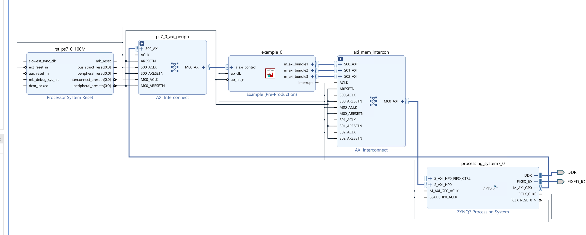</div>

#### Run synthesis,  Implementation, and generate bitstream

It may show some errors about I/O Ports, please fix them.

#### Download the bitstream file to PYNQ

<div align=center></div>


```python
import numpy as np
import pynq
from pynq import MMIO
overlay = pynq.Overlay('design_1.bit')
overlay?
```
<div align=center></div>

#### Allocate DMA memory address size

The first step is to allocate the buffer. pynq allocate will be used to allocate the buffer, and NumPy will be used to specify the type of the buffer.

```python


top_ip = overlay.example_0
top_ip.signature

# allcoate memory for the a, b and c and the size is 32 int32 type data
a_buffer = pynq.allocate((32), np.int32)
b_buffer = pynq.allocate((32), np.int32)
c_buffer = pynq.allocate((32), np.int32)
# initialize input
for i in range (0, 32):
    a_buffer[i] = i+1
    b_buffer[i] = 1;
```
<div align=center>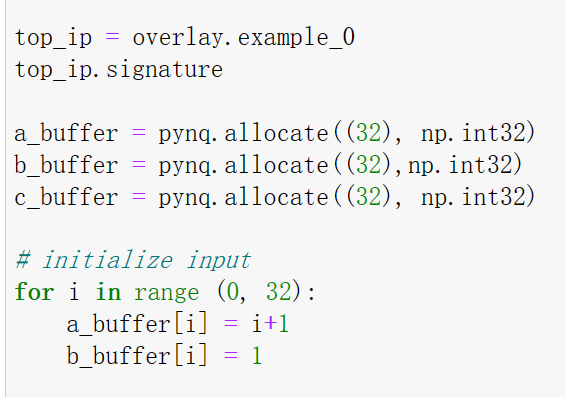</div>

```python
//obtain the physical address of the buffer to make it easily
aptr = a_buffer.physical_address
bptr = b_buffer.physical_address
cptr = c_buffer.physical_address
top_ip.register_map
```

<div align=center>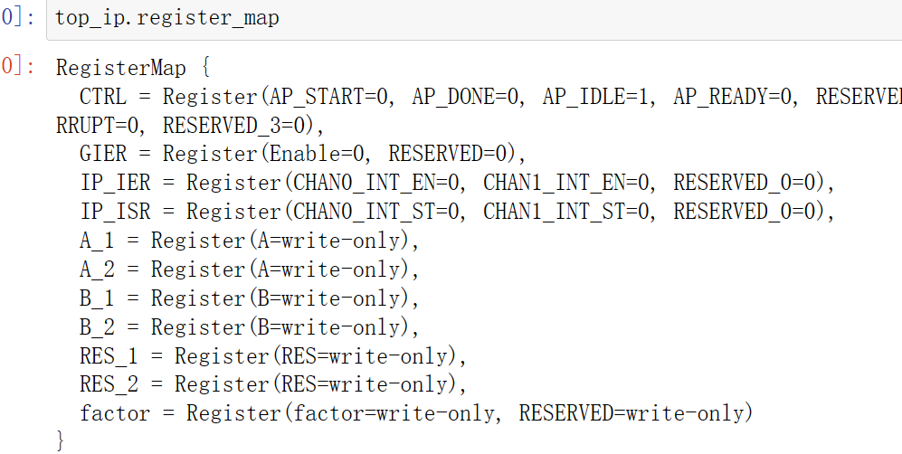</div>

```python
top_ip.register_map.factor=32
# specify the address
# These addresses can be found in the generated .v file: vadd_control_s_axi.v
top_ip.write(0x10, aptr)
top_ip.write(0x1C, bptr)
top_ip.write(0x28, cptr)
# start the HLS kernel
top_ip.write(0x00, 1)

```

We will see:

<div align=center>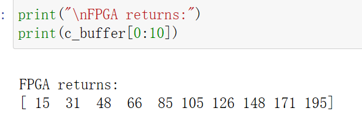</div>

## Demonstrates 
Please finish the example under the  ```manual_burst_inference_success``` and ```manual_burst_with_conditions```sections and implement them on the PYNQ-Z2 board.
