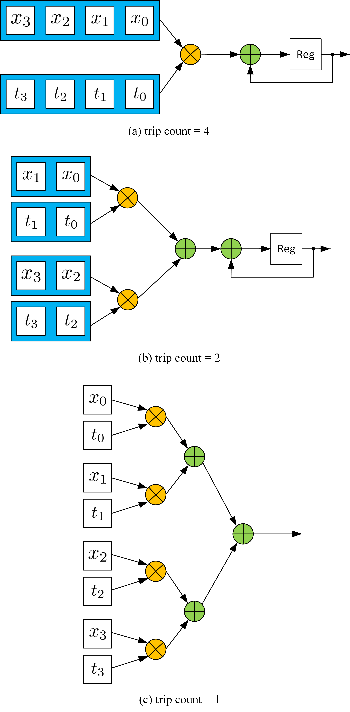
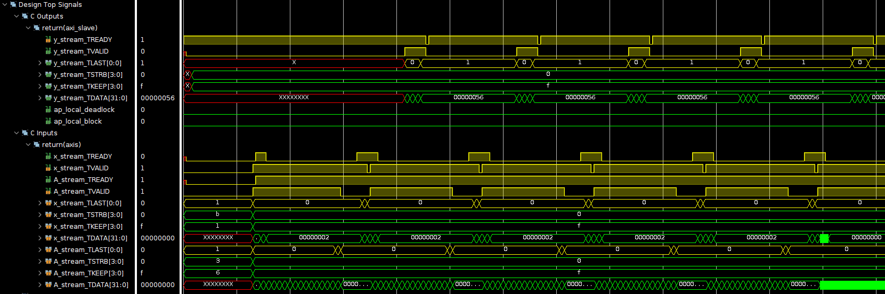

<script type="text/x-mathjax-config">
  MathJax.Hub.Config({
    tex2jax: {
        inlineMath: [ ['$','$'], ["\\(","\\)"] ],
        displayMath: [ ['$$','$$'], ["\\[","\\]"] ],
        processEscapes: false,
    }
  });
</script>
    
<script type="text/javascript"
        src="https://cdn.mathjax.org/mathjax/latest/MathJax.js?config=TeX-AMS-MML_HTMLorMML">
</script>

# DFT


## Introduction
Discrete Fourier Transform (DFT) is widely used in digital signal processing (Fast-Fourier Transform, FFT, is an optimized algorithm to calculate DFT). The formula is simple:

$$
X(k) = \sum_{n = 0}^{N - 1}x(n)e^{-j\frac{2\pi}{N}nk}
$$

Given a certain $k$, DFT is actully a inner product between series $x(n)$ and a complex rotating vector $e^{-j\frac{2k\pi}{N}n}$. Therefore, let $x(n)$ written as a column vector $\vec{x}$, and $e^{-j\frac{2k\pi}{N}n}$ written as a row vector $\vec T_k$, we have $X(k) = \vec T_k \cdot \vec x$. Hence, the entire transform becomes a Matrix-Vector Multiplication (MTV).

$$
\begin{equation}
\left[\begin{matrix}
X(0)\\
X(1)\\
...\\
X(N-1)
\end{matrix}\right]
=\left[\begin{matrix}
\vec T_0\\
\vec T_1\\
...\\
\vec T_{N-1}
\end{matrix}\right]
\vec x
\end{equation}
$$

$$
\vec T_k = e^{-j\frac{2k\pi}{N}n}, n = 0,1,2,...,N-1
$$

Since DFT has a better implementation called FFT, in this experiment we just foucus on Matrix-Vector Multiplication for real numbers for simplification.

## Inner product implementation

The MTV can be treated as $N$ inner products between the row vectors in Matrix and the column vector. The inner product is easy to be implemented with the following code:

```c++
int acc = 0;
for (int i = 0; i < N; i++){
    acc += t[i] * x[i];
}
```

The loop can either be pipelined or unrolled, depending on the data accessibility. For example, mostly the input $\vec x$ comes from a stream interface, which infers that in each clock cycle, only one $x[i]$ is available. In this case, even when the loop is unrolled, it still requires at least $N$ clocks to finish, which is the same with the pipelined structure. This structure is shown in (a) below. However, if both $x$ and $t$ have higher accessibility, it is possible to carry out more multiplications in each clock cycle and then reduce the trip count. For example, in (b), $x$ and $t$ are saved in two blocks. Therefore, in each cycle, two multiplications can be done. In another word, the 'for' loop can be unrolled by a factor of 2 in this case. Furthermore, if the $x$ and $t$ are completely partitioned, it is possible to finish all multiplication and the 'for' loop can be fully unrolled. In summary, data accessibility determines the parallelism of the implementation. The unroll factor should be picked carefully depending on how much data is available in one cycle. Also, if unroll is required to increase the performance, the memory used to save the data should also be changed accordingly. Xilinx provides 'array_partition' pragma to specify the data accessibility ([Ref](https://docs.xilinx.com/r/en-US/ug1399-vitis-hls/pragma-HLS-array_partition)). In general, if the memory is implemented with BRAM on FPGA, two data is available in each cycle. If the memory is implemented with FFs (completely partitioned), all data is available in one clock cycle.  



## MTV Implementation

The MTV is $N$ dot products. It can be realized with the following code:

```c++
int T[N][N];
int X[N] = {0};
COL_LOOP:
for (int i = 0; i < N; i++){
ROW_LOOP:
    for(int j = 0; j < N; j++){
        X[j] += T[j][i] * x[i];
    }
}
```

The first thing to do is to determine which loop should be the first. In this example, we assume that $x$ comes in series, which means only $x[i]$ comes in order and only one $x[i]$ is available in each cycle. In this case, once a new $x[i]$ is received, we should finish all computations that require $x[i]$ all some extra memory is required to save the $x$ for future use. Hence, the $i$ loop should be the first. If not, then $x$ has to be iterated in each outer loop. Then, the second step is to determine the data accessibility in the ROW_LOOP. In the ROW_LOOP (j), the $i_{th}$ value in all rows of $T$ is required. Then, if we don't do any partition to array $T$, only one $T[j][i]$ is available in each cycle, which means it takes $N^2$ trips to finish the operation. Partitioning the $T$ array in the second dimension doesn't help as only one $xi$ is available. Even though we have more value in the same row available, no computation can be done. Partitioning the $T$ array in the first dimension makes the data in different rows available at the same time, which helps reduce the trip count. For example, if we completely partition the $T$ in the first dimension, the ROW_LOOP can also be fully unrolled, generating $N$ independent dot product instances like the figure (a) in the last section (see Figure 4.12 in the textbook as well).  

Since multiplication operation mostly requires more than 1 clock cycle to finish, we still need to pipeline the outer loop for better performance. The pipeline is shown below:


If we pipeline the outer loop and unroll the inner loop, $N$ instances of this pipeline are generated. Here is the implementation of the MVM ($y = Ax$, all real number cases):

mvm.h

```c++
/*
Filename: MVM.h
	Header file
	MVM lab
*/
#ifndef MVM_H_
#define MVM_H_

#include "hls_stream.h"
#include "ap_axi_sdata.h"
#include "ap_fixed.h"

const int N = 4;

typedef int data_t;
typedef int acc_t;


typedef hls::axis<data_t,0,0,0> data_axis_dp;
typedef hls::axis<acc_t,0,0,0> acc_axis_dp;
typedef hls::stream<data_axis_dp> data_stream;
typedef hls::stream<acc_axis_dp> acc_stream;

void mvm (
		data_stream& A_stream,
		data_stream& x_stream,
		data_stream& y_stream
);

#endif
```

```c++
#include "mvm.h"

void mvm (
		data_stream& A_stream,
		data_stream& x_stream,
		data_stream& y_stream
){
#pragma HLS INTERFACE mode=ap_ctrl_none port=return
#pragma HLS INTERFACE mode=axis register_mode=both port=A_stream
#pragma HLS INTERFACE mode=axis register_mode=both port=x_stream
#pragma HLS INTERFACE mode=axis register_mode=both port=y_stream
#pragma HLS DATAFLOW

	data_t local_A[N][N];
#pragma HLS ARRAY_PARTITION dim=1 type=complete variable=local_A
	acc_t local_y[N] = {0};
#pragma HLS ARRAY_PARTITION dim=1 type=complete variable=local_y

load_A_loop:
	for (int loc = 0, i = 0, j = 0; loc < N * N; loc++, j++) {
#pragma HLS PIPELINE
        if (j == N) {
            i++;
            j = 0;
        }
        data_axis_dp temp;
        A_stream >> temp;
        local_A[i][j] = temp.data;
    }

COL_LOOP:
	for (int i = 0; i < N; i++){
#pragma HLS PIPELINE
		data_axis_dp temp;
		x_stream >> temp;
ROW_LOOP:
		for(int j = 0; j < N;j++){
#pragma HLS UNROLL
			local_y[j] += local_A[j][i] * temp.data;
		}
	}

write_y_loop:
	for (int i = 0; i < N;i++){
#pragma HLS PIPELINE
		acc_axis_dp temp;
		temp.data = local_y[i];
		temp.keep = -1;
		temp.last = (i == (N-1));
		y_stream << temp;
	}

}
```

Testbench

```c++
/*
	Filename: mvm_test.h
		Testbench file
		Calls mvm() function from mvm.cpp
		Compares the output from mvm() with out.gold.dat
*/

#include <stdio.h>
#include <math.h>
#include <stdlib.h>
#include "mvm.h"

int main () {
	data_stream A_stream;
	data_stream x_stream;
	data_stream y_stream;
	data_t A[N][N];
	data_t x[N];
	acc_t soft_y[N] = {0};
	acc_t hard_y[N];

	for (int i = 0; i < N; i++){
		for (int j = 0; j < N; j++){
			A[i][j] = i * N + j;
		}
		x[i] = i;
	}
// push into stream first
	for (int k = 0; k < 5; k++){

		for (int i = 0; i < N; i++){
			for (int j = 0; j < N; j++){
				data_axis_dp temp;
				temp.data = A[i][j];
				temp.keep = -1;
				temp.last = (i == (N - 1)) && (j == (N - 1));
				A_stream << temp;
			}
			data_axis_dp temp;
			temp.data = x[i];
			temp.keep = -1;
			temp.last = (i == (N - 1));
			x_stream << temp;
		}
	}

// run kernel
	for (int k = 0; k < 5; k++){
		mvm(A_stream, x_stream, y_stream);
	}
	for (int k = 0; k < 5; k++){
		for (int i = 0; i < N; i++){
			acc_axis_dp temp;
			y_stream >> temp;
			hard_y[i] = temp.data;
		}
	}
	for (int i = 0; i < N; i++){
		for (int j = 0; j < N; j++){
			soft_y[j] += A[j][i] * x[i];
		}
	}
	bool correct = true;

	for (int i = 0; i < N; i++){
		if (soft_y[i] != hard_y[i]){
			correct = false;
		}
	}
	if (correct){
		printf("Pass!\n");
		return 0;
	}
	else{
		printf("Fail!\n");
		return 1;
	}
}
```

The waveform is shown below:



The waveform shows that the module has very low efficiency. Firstly, matrix A is reloaded every time. For an AXI stream bus, it requires $N^2$ clock cycles to reload the matrix, while the computation only requires $N$ cycles. This stops vector $x$ from being received continuously. Since in most cases, the matrix remains the same while the input vector varies (for example, DFT has a constant transform matrix). Secondly, this structure makes the new input $x$ be accessed by all rows, which means one FF in the final implementation is fanned out to $N$ receivers. When $N$ is small, it is still Okay, but when $N$ goes to hundreds or even thousands, it leads to high load capacitance that will slow down the circuit. Xilinx Vivado may use redundant resources to avoid too large a fanout, but it consequently increases the difficulty of routing.  
The systolic array is a typical way to solve the problem. The systolic array uses interconnected independent data processing elements to achieve the final algorithm. The input of a PE comes from the outside or other PEs; the input from the outside and the output of PE are only fanned out to one receiver. Thus, a chain or a network of PEs is formed. In MVM, each PE can simply do the inner product (one row vector times one column vector). However, the input $x$ is only sent to the first PE (the first row) rather than all PEs like the simply unrolled implementation. The first PE then registers the input $x$ and sends it to the next PE (the second row). Therefore, PE can be simply described with the following figure and formula, where acc has to be cleared every time the calculation starts:

<center></center>

$$
\begin{aligned}
x_{out} &= x_{in}\\
A_{out} &= A_{in}\\
acc &= acc + A_{in} \times x_{in}
\end{aligned}
$$

Depending on how the PEs are connected, different operations can be realized. For example, if we connect the new PEs vertically ($x_{out}$ connect to new $x_{in}$, $A_{out}$ is neglected) and form an $N$ row $1$ column array, MVM is realized. If we form an $N$ by $N$ grid, matrix-matrix multiplication can be realized.  

Avoiding reloading $A$ every time is tricky. All HLS IP has a block-level interface (Interface pragma, port = return)([Ref](https://docs.xilinx.com/r/en-US/ug1399-vitis-hls/pragma-HLS-interface)). Except for $$$ap_ctrl_none$$ interface, the IP kernel (block, module) must be started manually. Unless the latency from the first input to the last output is much smaller than the length of the total data stream, or the whole module can be implemented as an FRP pipeline (Like fir and Cordic example), starting signal can significantly slow down the process. For example, even when the systolic array is used, the first output of MVM comes after the final $x$ is received, which requires $N$ clock cycles, and another $N$ clock cycles are still required to let the result being pushed out. In this case, even under the perfect circumstance, the latency between the first input and last output is at least $2\times N$. If the module requires a start signal, the corresponding 'done' comes after $2\times N$ clock cycles. During this time, the software can only wait, and no input can be received between $N\to 2N$ cycles. Hence, even when all pipeline inside the loop has II=1, the total average II for the module is at least 2. Reloading $A$ requires at least $N^2$ clock cycles and no operation can be done during this time, which means it is impossible to make the module an FRP pipeline via HLS (reloading itself is a pipeline, then the whole module cannot be a pipeline because if the module is specified as pipelined the reload loop must be unrolled). To solve the problem, we have to create independent reloading $A$ module and let the module forwards the columns of $A$ to the MVM module. Only in this case, the MVM kernel is simple enough to be designed as an FRP pipeline. Vitis HLS cannot simulate with multiple kernels connected (Vitis allows). Therefore, here we assume the matrix $A$ is a constant matrix, and we just write it inside the bitstream and not need to be reloaded. The ultimate purpose is to have a module with II=1 and new data can still be received during the $N\to 2N$ cycles.

## Special: Four-point DFT implementation
Since DFT has a better implementation called FFT, it doesn't make sense to create a large MVM kernel to do DFT in specific. However, Four-point DFT is important due to the simple $T$ matrix:

$$
\begin{equation}
T = \left[\begin{matrix}
1&1&1&1\\
1&-j&-1&j\\
1&-1&1&-1\\
1&j&-1&-j
\end{matrix}\right]
\end{equation}
$$

Obviously, only add and subtrication is required in Four-point DFT. Here is an implementation of the Four-point DFT:


dft.h
```c++
/*
Filename: dft.h
	Header file
	DFT lab
*/
#ifndef DFT_H_
#define DFT_H_

#include "hls_stream.h"
#include "ap_axi_sdata.h"
#include "ap_fixed.h"

const int N = 4;

typedef ap_fixed<32,8> data_t;
typedef ap_fixed<32,8> acc_t;

typedef struct {
	data_t x[N];
}dft_tdp;

typedef struct {
	acc_t real[N];
	acc_t imag[N];
}dft_fdp;

typedef hls::axis<dft_tdp,0,0,0> dft_tdp_axis_dp;
typedef hls::axis<dft_fdp,0,0,0> dft_fdp_axis_dp;
typedef hls::stream<dft_tdp_axis_dp> dft_time_stream;
typedef hls::stream<dft_fdp_axis_dp> dft_freq_stream;

void dft (
		dft_freq_stream& y,
		dft_time_stream& x
);

#endif
```

dft.cpp
```c++
#include "dft.h"

void dft(
		dft_freq_stream& y,
		dft_time_stream& x)
{
#pragma HLS INTERFACE mode=ap_ctrl_none port=return
#pragma HLS INTERFACE mode=axis register_mode=both port=y
#pragma HLS INTERFACE mode=axis register_mode=both port=x

#pragma HLS pipeline style=frp
	dft_tdp_axis_dp x_temp;
	x >> x_temp;

	dft_fdp_axis_dp y_temp;
	y_temp.data.real[0] = (x_temp.data.x[0] + x_temp.data.x[1]) + (x_temp.data.x[2] + x_temp.data.x[3]);
	y_temp.data.real[1] = (x_temp.data.x[0] - x_temp.data.x[2]);
	y_temp.data.real[2] = (x_temp.data.x[0] - x_temp.data.x[1]) + (x_temp.data.x[2] - x_temp.data.x[3]);
	y_temp.data.real[3] = (x_temp.data.x[0] - x_temp.data.x[2]);


	y_temp.data.imag[0] = 0;
	y_temp.data.imag[1] = (-x_temp.data.x[1] + x_temp.data.x[3]);
	y_temp.data.imag[2] = 0;
	y_temp.data.imag[3] = (x_temp.data.x[1] - x_temp.data.x[3]);

	y_temp.last = x_temp.last;
	y_temp.keep = -1;
	y << y_temp;

}
```

This module can be easily pipelined. According to Vitis HLS synthesis report, with 100MHz clock, the II for the module is 1 and the latency is also 1, which means it is a combinational logic module (Under higher frequency, it may become a real pipeline).

## Result
