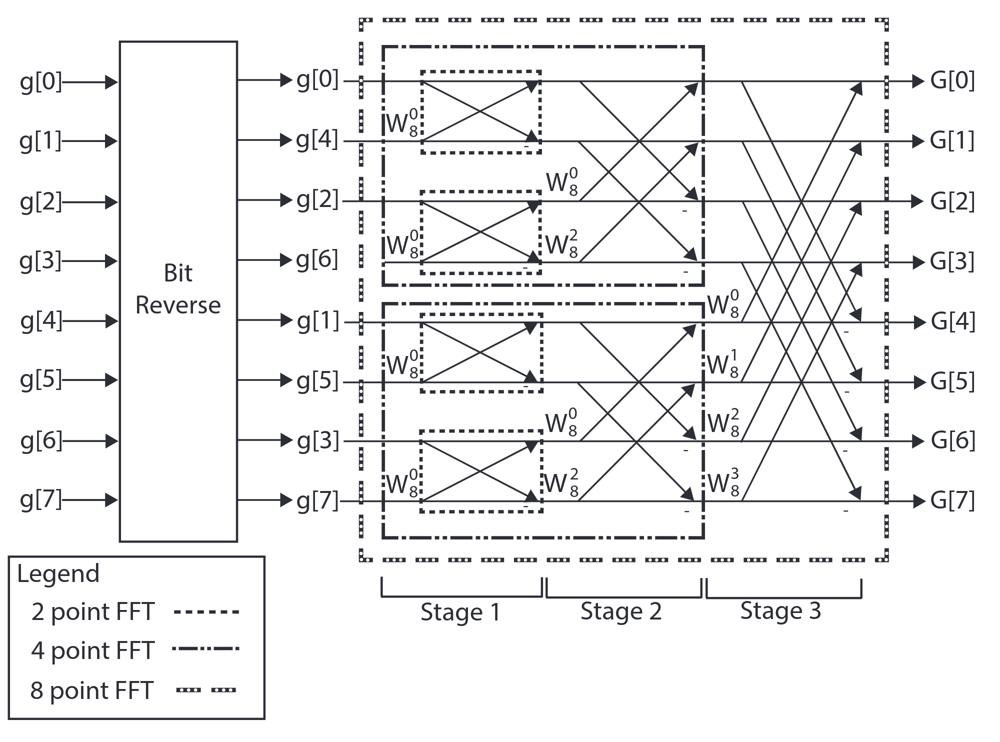

# FFT

<script type="text/x-mathjax-config">
  MathJax.Hub.Config({
    tex2jax: {
        inlineMath: [ ['$','$'], ["\\(","\\)"] ],
        displayMath: [ ['$$','$$'], ["\\[","\\]"] ],
        processEscapes: false,
    }
  });
</script>
    
<script type="text/javascript"
        src="https://cdn.mathjax.org/mathjax/latest/MathJax.js?config=TeX-AMS-MML_HTMLorMML">
</script>

Fast Fourier Transform (FFT) is an optimized algorithm to calculate DFT. The formula for DFT is shown below:

$$
X(k) = \sum_{n = 0}^{N - 1}x(n)e^{-j\frac{2\pi}{N}nk}
$$

For an $N$ point series, the output of DFT is also an $N$ point complex series. Each output point $X(k)$ requires $N$ multiplications (ignore adds). Therefore, to calculate DFT according to the formula, $N^2$ multiplications are required, and we name it an $O(N^2)$ algorithm. $O(N^2)$ algorithm is typically not acceptable as the computing time increases too fast as $N$ increases. The divide-and-conquer algorithm is a typical way to slow down the trend. The basic requirements are that the problem can be divided into two parts and can be combined back without too much overhead. If the requirements are satisfied, it is possible to continue dividing the two sub-problems into four sub-sub-problems until the final problem is easy to be solved. In each dividing stage, the computation required is mostly $O(N)$, and there are $log_2^N$ stages. Hence, the original problem is reduced to the $O(nlog^n)$ level, which is more acceptable.

Then the problem is how to divide the DFT operations. A more intuitive way is shown below (from now, we assume $N = 2^M$ and $M$ is an integer). First, we divide the series $x$ into two parts $x_e = x(2n)$ and $x_o = x(2n+1)$, where $x_e$ is the sample on the even index and the $x_o$ is the sample on the odd index. Then, we have:

$$
\begin{aligned}
X(k) &= \sum_{n = 0}^{N - 1}x(n)e^{-j\frac{2\pi}{N}nk}\\
&= \sum_{n = 0}^{N/2 - 1}x_e(n)e^{-j\frac{2\pi}{N}2nk} + \sum_{n = 0}^{N/2 - 1}x_o(n)e^{-j\frac{2\pi}{N}(2n+1)k}\\
&= \sum_{n = 0}^{N/2 - 1}x_e(n)e^{-j\frac{2\pi}{N}2nk} + e^{-j\frac{2\pi}{N}k}\sum_{n = 0}^{N/2 - 1}x_o(n)e^{-j\frac{2\pi}{N}(2n)k}\\
&= \sum_{n = 0}^{N/2 - 1}x_e(n)e^{-j\frac{2\pi}{\frac{N}{2}}nk} + e^{-j\frac{2\pi}{N}k}\sum_{n = 0}^{N/2 - 1}x_o(n)e^{-j\frac{2\pi}{\frac{N}{2}}nk}\\
&= DFT(x_e) + e^{-j\frac{2\pi}{N}k}DFT(x_o)
\end{aligned}
$$

Now, the $N$ point DFT is divided into two $\frac{N}{2}$ DFT. The combination of the two DFTs requires $N$ multiplications. Another trick is that $e^{j\pi}=-1$, so $W_N^k=e^{-j\frac{2\pi}{N}k}, k = 0\to N-1$ is an odd symetric series that $W_N^{k+\frac{N}{2}} = -W_N^k, k = 0\to \frac{N}{2}-1$. That gives the well-known radix-2 butterfly structure ([Ref](https://en.wikipedia.org/wiki/Butterfly_diagram)). Take 8 point FFT as an example, the stage is shown below:


The two $\frac{N}{2}$ can be divided into two $\frac{N}{4}$ FFTs, and the structure is similar. Finally, for an 8-point FFT, the system can be shown as:




Hence, to do FFT, we have to do the following steps:

1. Resort the data, bit reverse.
2. Calculate $W_N^0\to W_N^{\frac{N}{2}-1}$.
3. Path the data through $log_2^N$ stages.

# Algorithm Introduction

## Bit reverse

The first step is to sort the input series differently. It is a little complex on software, but very easy on hardware. The software implementation is shown below:

```c++
unsigned int reverse_bits(unsigned int input) {
  int i, rev = 0;
  for (i = 0; i < M; i++) {
    rev = (rev << 1) | (input & 1);
    input = input >> 1;
  }
  return rev;
}
```

This implementation is very slow as there is a data dependency between loops as the input is shifted right one by one. In hardware, bit reversing is simply reordering the wires. In HLS, the fixed point number defined by ap_fixed<> (or ap_ufixed<>) allows bitwise access, which means the fixed point number can also be viewed as an array of binary numbers ([Ref](https://docs.xilinx.com/r/en-US/ug1399-vitis-hls/Other-Class-Methods-Operators-and-Data-Members)). Therefore, we have the following simpler implementation:

```c++
#define N 1024
#define S 10

typedef ap_ufixed<S,S> idx_type;

idx_type idx_reverse(idx_type idx_in){
#pragma HLS INLINE
    idx_type idx_out;
    for (int i = 0; i < S;i++){
#pragma HLS UNROLL
        idx_out[S - 1 - i] = idx_in[i];
    }
    return idx_out;
}
```

This code reverses the bit order and gets the new index value. This implementation is much better as the loop can be entirely unrolled, which gives minimum latency. It turned out that after synthesis, the index reverse function doesn't exist at all as it is nothing for hardware. Then, we can use the index to reorder the input series.

```c++
void bit_reverse(cplx x_in[N],cplx x_out[N]){
    for (int i = 0; i < N;i++){
        idx_type idx = (idx_type)(i);
        idx_type idx_r = idx_reverse(idx);
#ifndef __SYNTHESIS__
        printf("%d, %d\n",(int)idx, (int)idx_r);
#endif
        x_out[idx_r] = x_in[idx];
    }
}
```

Notice that the code put the original data into new places, which means the $x_{in}$ is accessed in order. This matches the nature of a stream interface so that the bit reverse operation can start immediately after the input comes and finish immediately after the input is received.

The second code to write is the butterfly operation. Here is a simple implementation where **w_r** (**w_i**) is the real (imaginary) part of $W_N^k$:

```c++
typedef float dtype;
typedef float wtype;
typedef struct{
    dtype real;
    dtype imag;
}cplx;

// y_l = x_l + x_h * W
// y_h = x_l - x_h * W

void butterfly(cplx& y_l, cplx& y_h,cplx x_l, cplx x_h, dtype wr, dtype wi){
#pragma HLS INLINE
    dtype r_temp = wr * x_h.real - x_h.imag * wi;
#pragma HLS BIND_OP variable=r_temp op=fmul impl=meddsp
    dtype i_temp = wr * x_h.imag + x_h.real * wi;
#pragma HLS BIND_OP variable=i_temp op=fmul impl=meddsp
    y_l.real = x_l.real + r_temp;
    y_l.imag = x_l.imag + i_temp;
    y_h.real = x_l.real - r_temp;
    y_h.imag = x_l.imag - i_temp;
}
```

The INLINE pragma is used to avoid the overhead caused by function calling (function calling in hardware requires handshake logic, which requires extra logic and adds latency).

# Implementation

# Result
