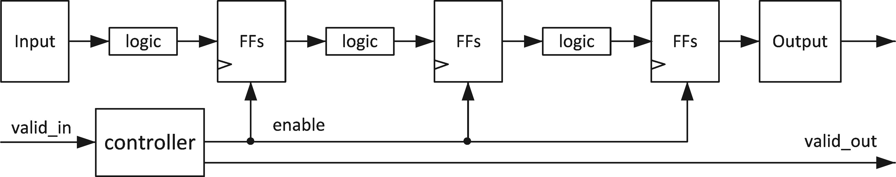
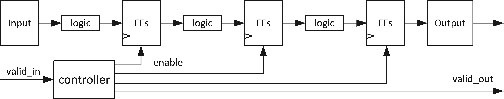
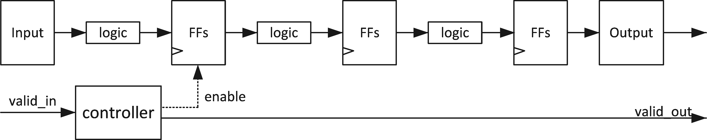

# FIR

<script type="text/x-mathjax-config">
  MathJax.Hub.Config({
    tex2jax: {
        inlineMath: [ ['$','$'], ["\\(","\\)"] ],
        displayMath: [ ['$$','$$'], ["\\[","\\]"] ],
        processEscapes: false,
    }
  });
</script>
    
<script type="text/javascript"
        src="https://cdn.mathjax.org/mathjax/latest/MathJax.js?config=TeX-AMS-MML_HTMLorMML">
</script>

## Introduction

Finite Impulse Response (FIR) filter is a well known and widely used digital filter. The algorithm is shown below:

$$y[i] = \sum_{j = 0}^{N-1}h[j]x[i-j]$$

where $$h[j]$$ is the impulse response.

## Optimization

### The unoptimized code

Following code shows a highly unoptimized version of FIR filter in HLS. in the header file (fir.h), this code uses **typedef** to define the datatype of different variables. Datatype of all three variables (```coef_t```, ```data_t```, and ```acc_t```) are int (32 bit) in this example. ```hls::axis<data_t,0,0,0>``` from ```ap_axi_sdata.h``` packs data_t into a standarded AXI4-Stream Interfaces datatype, namely, data_t_pack. ([Ref](https://docs.xilinx.com/r/en-US/ug1399-vitis-hls/How-AXI4-Stream-is-Implemented)) Finally, ```hls::stream<data_t_pack>``` from ```hls_stream.h``` creates a HLS stream (also an AXIs datatype) datatype, ```d_stream```.

**fir.h**
```c++

/*
Filename: fir.h
	Header file
	FIR lab
*/
#ifndef FIR_H_
#define FIR_H_

#include "hls_stream.h"
#include "ap_axi_sdata.h"
#include "ap_fixed.h"

const int N=11;

typedef int	coef_t;
typedef int	data_t;
typedef int	acc_t;

typedef hls::axis<data_t,0,0,0> data_t_pack;
typedef hls::stream<data_t_pack> d_stream;

void fir (
  d_stream& y,
  d_stream& x
);

#endif

```


**fir.cpp**

```c++
#include "fir.h"

// Unoptimzied code in Figure 2.1

void fir(d_stream& y, d_stream& x){
#pragma HLS INTERFACE mode=ap_ctrl_none port=return
#pragma HLS INTERFACE mode=axis register_mode=both port=y
#pragma HLS INTERFACE mode=axis register_mode=both port=x
    coef_t c[N] = {
        53, 0, -91, 0, 313, 500, 313, 0, -91, 0, 53
    };
    static data_t shift_reg[N];
    data_t_pack x_temp;
    acc_t acc = 0;
    int i;
    x >> x_temp;
    // x_temp = x.read();  
    // x.read(x_temp);
    // x as an AXI4-stream input includes data, keep, and last. 

// Algorithm
Shift_Accum_Loop:
    for (i = N - 1; i >= 0; i--){
        if (i == 0){
            shift_reg[0] = x_temp.data;
            acc += x_temp.data * c[0];
        }
        else{
            shift_reg[i] = shift_reg[i-1];
            acc += shift_reg[i] * c[i];
        }
    }

// Output Stream
    data_t_pack y_temp;
    y_temp.data = acc;
    y_temp.keep = -1;
    y_temp.last = x_temp.last;
    y << y_temp;
    // y.write(y_temp);
    // It it required to pack data, keep, and last into the output y
    
    
  // Clear all shift_reg at the last data, otherwise shift_regs are non-zero next time it is called
    if (x_temp.last){
Clear_Loop:
    	for (i = N - 1; i >= 0; i--){
            shift_reg[i] = 0;
        }
    }
}

```
According to the report, the core loop (Shift_Accum_Loop) has II = 2 and the II of the IP block is 31, which means this IP can only receive 1 data every 31 clock cycles. This is extremely slow. An optimized design should have an II = 1 (receive new data every clock; maximum throughput). This design consumes 442 FFs and 265 LUTs for the Shift_Accum_Loop.

The II = 2 comes from a fake data dependency. Since the hardware circuit is always running (the code in software runs independently), which means the two branches in the Shift_Accum_Loop both have a hardware implementation. For a pipelined structure, all the operations in the loop have dedicated hardware implementation. In the Shift_Accum_Loop, there exists two write operations (shift_reg[0] = x_temp.data; shift_reg[i] = shift_reg[i-1];), requiring 2 write ports for shift_reg (implemented in a BRAM). BRAM does not support 2 write ports. Therefore, the tool failed to make the II = 1 because of the conflict between the two write (store) operations. It is reported in the synthesis log from the console:

>  The II Violation in module ... Unable to enforce a carried dependence constraint (II = 1, distance = 1, offset = 1) between '**store**' operation of variable 'shift_reg_load', ./srcs/fir.cpp:25 on array 'shift_reg' and '**store**' operation ('0_write_ln22', ./srcs/fir.cpp:22) of variable 'tmp_data_1_read' on array 'shift_reg'.
 
### Optimization 1: Loop hoisting

The if/else operation is inefficient in for loop. Loop hoisted can be carried out.  "HLS tool creates logical hardware that checks if the condition is met, which is executed in every iteration of the loop. Furthermore, this conditional structure limits the execution of the statements in either the if or else branches; these statements can only be executed after the if condition statement is resolved."([Ref](https://kastner.ucsd.edu/hlsbook/)) Now the "Shift_Accum_Loop" becomes:

```c++
Shift_Accum_Loop:
    for (i = N - 1; i > 0; i--){
        shift_reg[i] = shift_reg[i-1];
        acc += shift_reg[i] * c[i];
    }

    acc += x_temp.data * c[0];
    shift_reg[0] = x_temp.data;
```

With the new implementation, the II of the "Shift_Accum_Loop" becomes 1 and the II of the entire module becomes 18. This is a huge improvement. However, this performance increase is not directly from the loop hoisting optimization. Moving branch i == 0 out of the for loop reduces one write operation to the shift_reg, removing the conflict (2 writes in the same clock cycle). This design consumes 407 FFs and 196 LUTs. 

### Optimization 2: Loop fission

There are two operations in the Shift_Accum_Loop, one is moving the shift_reg and another one is performing the multiplication and accumulation (MAC). Loop fission refers to separating the operations into independent loops. In this case, the code becomes:

```c++

TDL:
    for (i = N - 1; i > 0;i--){
        shift_reg[i] = shift_reg[i-1];
    }
    shift_reg[0] = x_temp.data;

MAC:
    for (i = N - 1; i >= 0;i--){
        acc += shift_reg[i] * c[i];
    }

```

In the above code, the label "TDL" stands for tapped delay line, which is implemented as shift registers in a digital circuit, and "MAC" refers to multiply-accumulate. Notice that in TDL the loop hoisting is used as it is required to check if i equals 0, while the MAC loop doesn't need loop hoisting (i > 0 or i >= 0). The II of both two loops (TDL and MAC) is 1 and the II for the entire module is 31. The TDL and MAC loops consume a total of 415 FFs and 247 LUTs. This is worse than the result with optimization 1. The II of the module becomes 31 as one loop becomes two loops, each requiring 11 trips. More LUTs are required as each loop requires its control circuit.

### Optimization 3: Loop Unrolling

Optimization 2 doesn't make the design faster, but it makes further optimizations possible. The HLS executes the loops in a sequential manner, which means only one circuit instance of the loop body. Essentially, loop unrolling creates multiple running instances for the loop body. A manual unrolling TDL loop is shown below:

```c++

TDL:
    for (i = N - 1; i > 1;i= i - 2){
        shift_reg[i] = shift_reg[i-1];
        shift_reg[i-1] = shift_reg[i-2];
    }
    if (i == 1){
        shift_reg[1] = shift_reg[0];
    }
    shift_reg[0] = x_temp.data;

```

``` if (i == 1)``` is added to support even N. The unrolling reduces the trip count and increases the hardware required. However, if we synthesis this module directly, the II of TDL loop is 2, which means the total clock cycles required don't change (II * trip_count). This is caused by the same reason in the original code. "In the unrolled code, each iteration requires that we read two values from the shift reg array; and we write two values to the same array. Thus, if we wish to execute both statements in parallel, we must be able to perform two read operations and two write operations from the shift reg array in the same cycle."([Ref](https://kastner.ucsd.edu/hlsbook/)) In most cases, RAM only provides one read port and one write port simultaneously. To solve this problem, the shift_array is required to be **partitioned**, which means saving the value in a different memory (or even registers) instead of saving all the values in one single memory. The is called array_partition. HLS provides pragma to do this in the background, this syntax is in [Ref](https://docs.xilinx.com/r/en-US/ug1399-vitis-hls/pragma-HLS-array_partition):

```

#pragma HLS array_partition variable=<variable name> type=<cyclic, block, complete> factor=<int> dim=<int>

```

Since we know that the shift_reg should be implemented as shift registers on hardware, we can simply use:

```

#pragma HLS array_partition variable=shift_reg type=complete dim=1

```

With this pragma, the HLS should be able to give an implementation of TDL with II=1, which reduces the total II of the module by 1/2.

If we unroll the TDL loop by a larger factor (or even completely) can further increase the performance. However, it is unwise and not always possible to do that manually. Another pragma called ```unroll``` is provided by HLS so that the designer can realize the loop unrolling more easily, the syntax is shown below: ([Ref](https://docs.xilinx.com/r/en-US/ug1399-vitis-hls/pragma-HLS-unroll))

```
#pragma HLS unroll factor=<N> skip_exit_check
```

Manual unrolling can then be simply realized by adding pragma under the for loop header:

```c++
TDL:
    for (i = N - 1; i > 0;i--){
#pragma HLS unroll factor=2
        shift_reg[i] = shift_reg[i-1];
    }
    shift_reg[0] = x_temp.data;
```

Since N is small in the example, we can remove the ```factor=2``` so that the HLS completely unrolls the loop.

As for the MAC loop, though the accumulator acc seems to have a loop carry dependency (the next loop requires the result of the current loop), it is still possible to unroll the MAC loop (sum up the results of all independent multiplications). The unroll pragma can be used as well (the Clear_Loop can also be unrolled). Now the code becomes:

```c++
#include "fir.h"

// Unrolling and array partition

void fir(d_stream& y, d_stream& x){
#pragma HLS INTERFACE mode=ap_ctrl_none port=return
#pragma HLS INTERFACE mode=axis register_mode=both port=y
#pragma HLS INTERFACE mode=axis register_mode=both port=x
    coef_t c[N] = {
        53, 0, -91, 0, 313, 500, 313, 0, -91, 0, 53
    };
    static data_t shift_reg[N];
#pragma HLS array_partition type=complete variable=shift_reg dim=1
    data_t_pack x_temp;
    acc_t acc = 0;
    int i;
    x >> x_temp;

// Algorithm
TDL:
    for (i = N - 1; i > 0;i--){
#pragma HLS unroll
        shift_reg[i] = shift_reg[i-1];
    }
    shift_reg[0] = x_temp.data;

MAC:
    for (i = N - 1; i >= 0;i--){
#pragma HLS unroll
        acc += shift_reg[i] * c[i];
    }
    
// Output Stream
    data_t_pack y_temp;
    y_temp.data = acc;
    y_temp.keep = -1;
    y_temp.last = x_temp.last;
    y << y_temp;
    if (x_temp.last){
Clear_Loop:
    	for (i = N - 1; i >= 0;i--){
#pragma HLS unroll
            shift_reg[i] = 0;
        }
    }
}

```

According to the synthesis result, now the II of the loop (TDL and MAC) becomes 1. II of the entire block becomes 5, which is a huge improvement. The trade-off is that the required FF becomes 1242 and the required LUT becomes 791. This is due to the fact the unrolling and array partition increases the parallelism and of course, require more hardware resources. In this example, N = 11 so it is possible to unroll all loops and partition all arrays. If N equals 4096 or more, we may need to reduce the unroll factor to balance the resources with speed.

In addition, only 4 multipliers rather than N are used. HLS does some conditional optimization. In this case, if the coefficient is 0, it is not required to perform the multiplication. and since the coefficients are symmetric, some multiplications can be combined. Therefore, the unrolled MAC loop is finally implemented as:

```
acc = c[0] * (shift_reg[0] + shift_reg[10])
    + c[2] * (shift_reg[2] + shift_reg[8])
    + c[4] * (shift_reg[4] + shift_reg[6])
    + c[5] *  shift_reg[5]
```

Clearly, only 4 multipliers are required. The scheduling of math operations is shown below:


In the first period, three add operations are completed, corresponding to the three sums in parentheses. Then, four multiplications are done and each requires more than one clock period, which makes the result only available at the fourth (3rd in the scheduling figure) cycle. Notice that only three add operations are required as HLS automatically uses "adder tree" structure to implement accumulation-like loops. For four numbers, only 4 adders are required.


### Optimization 4: Pipelining

Pipelining is a widely used hardware trhoughput improvement method. Pipelining can be applied both to a loop and a function. In this example, pipelining any loop is not a good idea as it will reduce the II of the entire module (This is why we unrolled all the loops). The unrolled loops are not loops anymore from the hardware perspective, as unrolling makes all loop iterations run together in parallel. Hence, now the module has the following stages of operations:

> 1. Read new x and shift the TDL
> 2. MAC
> 3. Write y out (and clear shift_reg, when the last signal x comes)

Without pipelining, the operations are executed one by one, and new data can only be received after the last step is finished. Some resources can also be shared, for example, the adders in 2.1 can be reused in 2.3, though some extra logic may be required to control the dataflow. Pipelining, however, creates independent hardware for operation and some flip-flops to tap the inputs and middle results. The book ([Ref](https://kastner.ucsd.edu/hlsbook/)) gives an example for the MAC loop (though we are not pipelining the MAC loop here) shown below, (a) is without pipelining and (b) is with pipelining:


Notice that no resources can be shared if the function is pipelined. Circuits at different stages are processing data simultaneously. For example, the circuit at the first stage is always processing the newest data, while the circuit at the second stage is always processing the data input (via shift register) from the previous cycle and the output from the first stage circuit. Hence, pipelining mostly requires more resources.

To pipelining the loop, we can simply add a pragma to the source file (under the function or loop header). The syntax is: ([Ref](https://docs.xilinx.com/r/en-US/ug1399-vitis-hls/pragma-HLS-pipeline))

```
#pragma HLS pipeline II=<int> off rewind style=<stp, frp, flp>
```

The II determines the throughput of the module. Mostly, we want the II=1 which means the module (loop) can receive new data every clock. In this case, we just tell the tool to pipeline the fir function and the code becomes:

```c++

#include "fir.h"

// pipelining

void fir(d_stream& y, d_stream& x){
#pragma HLS INTERFACE mode=ap_ctrl_none port=return
#pragma HLS INTERFACE mode=axis register_mode=both port=y
#pragma HLS INTERFACE mode=axis register_mode=both port=x
#pragma HLS PIPELINE
    coef_t c[N] = {
        53, 0, -91, 0, 313, 500, 313, 0, -91, 0, 53
    };
    static data_t shift_reg[N];
    ...
}

```

According to the synthesis report, now the II of the entire module becomes 1 and 1306 FFs and 796 LUTs are required.  

#### Pipeline Type
According to Xilinx Doc, the HLS supports three types of pipelines: ([Ref](https://docs.xilinx.com/r/en-US/ug1399-vitis-hls/pragma-HLS-pipeline))  

**Stalled pipeline (STP)**  
Default pipeline. No usage constraints.  
Advantages:
> Typically the lowest overall resource usage.  
> Default pipeline. No usage constraints.  

Disadvantages:
> Not flushable:  
>> Cause mroe deadlock in dataflow.  
>> Prevent already calculated output data from being delivered, if the inputs to the next iterations are missing.  
> Timing issues due to high fanout on pipeline controls.  

Take a pipeline with three stages as an example. As is shown in the following figure, one single enable signal is shared with three stages (this causes the high fanout of pipeline control signals). If the input data continuously comes, stalled pipeline is good. However, if a packet of data (fixed length) is being processed, after the last data arrives, the input valid becomes '0'. Since no valid data comes, the first stage of the pipeline should be closed (set enable to 0). Consequently, the second and third stages of the pipeline are also closed, stopping the data from flowing out from the pipeline (not flushable). A deadlock could happen if there exists a software level data dependency. For example, if there are 10 packets to be processed, and the progammer write a totally resonable code like this:

```c++
    for (int i = 0; i < 10; i++){
        fir(y[i],x[i]);
    }
```

When running this code, it doesn't stack at the last iteration (i = 9). Actully, the new data is only sent out when the result of first iteration fully received, while the hardware is waiting the new data for the second iteration to fully send out the result of the first iteration. This is socalled deadlock.  

A typical solution is to add some zeors after the last data of the packet to push the useful data out. Though the solution looks promising, it is hard for progamming as the added zeros also needs to be removed from the output of next packet mannully.



**Flushable Pipeline (FLP)**  
Flushable pipeline is a better choice when processing packets of data.  
Advantages:
> Flushable

Disadvantages:
> May have larger II  
> More resources  

In flushable pipeline, once the input data becomes invalid, it shutting down each successive pipeline stage, until the final input has been processed through to the output of the pipeline rather than close all stages at once. The structure is shown below.



In the FIR application, unless the input data comes directly from an ADC (infinite data), a flushable pipeline is preferred.

**Free-Running/Flushanle Pipeline (FRP)**  
Though the FLP reduces some fanout of the pipeline controlling signal, it is still perfect as one stage of pipeline may have hundreds of FFs to control. Free running pipeline simplifies it even more.   
Advantages:
> Flushable  
> Better Timing:  
>> Less fanout  
>> simpler pipeline control logic  

Disadvantages:
> Moderate resource increase due to FIFOs added on outputs  

The structure is shown below:



The enable signal for the first stage is optional. It is only required when a shift register is put at the first stage (if the input is not valid, the shift register shouldn't run). For the next stages, FRP pipeline just make them always running. The output valid signal is calculated by the valid_in. Therefore, only minimum enable signal is required. However, makeing the circuit always running is not energy efficient.

## C simulation

## Co-simulation

## Implementation


