# Lab10_Bit-pair Recoded Multiplie

## Lab Overview

In this lab you will implement a Bit-pair Recoded fixed point multiplier in Verilog. The top-level entity should be a structural design, and all lower-level components should be kept completely modular and use Verilog parameters. The processor should be tested in Vivado Simulator with appropriate testbench(es) that that test for all cases (+/-
and varying ranges) in an 8-bit multiplier. You will map your top-level entity to the board which will use a shortened
4-bit version of the multiplier.

## Multiplier Design

You are to design an N-bit shift-add multiplier using bit-pair recoding. Each
component in the design should be a separate module that you will connect in your top-level structural entity. You will be required to set the design to 4-bits to program it to the board and 8-bits when performing test bench
simulations.

Model your design based on the figure below. Multiplication will begin when the start signal is high and the busy signal is low (note, busy and done are set by the state machine, **Ctrl**). The system will multiply through the following steps:

* 1) Load the *multiplicand* and *multiplier* into their corresponding registers and activate the *busy* signal. 

* 2) Iteratively perform N/2 add/shift cycles. (N is the number of bits in the multiplicand and multiplier)

* 3) Activate the *done* signal in the last clock cycle when the product is on the output.

* 4) Deactivate the *busy* and *done* signals while the machine waits for the next multiplication.

<div align=center>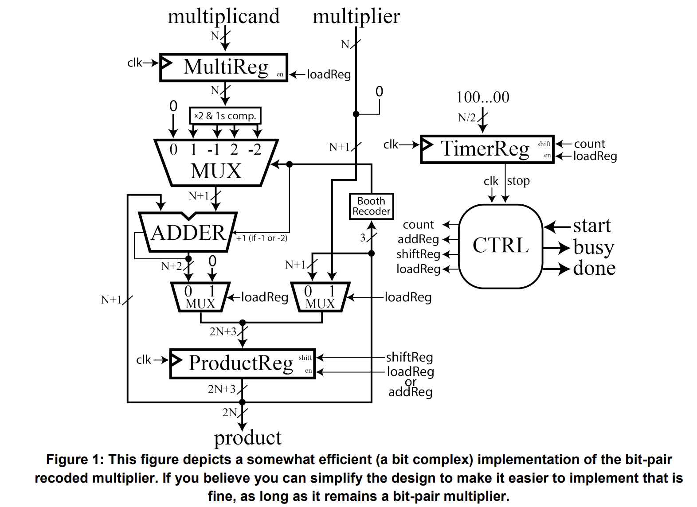</div>

## Understanding Multiplication

This multiplier utilizes a very similar algorithm to the one we typically learn in grade school but for binary numbers. This algorithm works by partitioning the multiplier into its distinct digits and then
iteratively performing (multiply => add => shifts) until all the digits of the multiplier have been used. Compare the following decimal and binary multiplication algorithms.

<div align=center>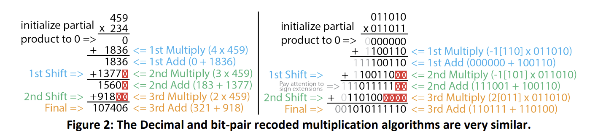</div>

Moving to binary multiplication there are a few things we need to consider.

* 1) Recoding – Rather than directly multiplying by the binary digit we use booth encoding to determine the
digit (-2, -1, 0, 1, 2) to multiply by.

* 2) Shift – Shift by two binary digits rather than one, this implies N/2 iterations of the algorithm rather than N.

* 3) Signs – The sign of a binary number is indicated by the leading digit, rather than a `-` sign. Be careful to
ensure the sign of your values are preserved while performing shifts and additions. For example, in the 2nd
add, the addition of 2 negative number should never be positive; however, if we do not sign extend
properly our leading bit will be 0. This is a common issue.


## Implementation Details

Most of the components in this design should be fairly familiar to you by now. However, this design is fairly optimized, so here are a few clarifications to help you implement it.

### Multiplication

This design decomposes the multiplier into a
series of {-2, -1, 0, 1, 2} that represents it. The reason we do this
is that multiplying any binary number by these values is super
easy to implement. All these implementation requires are shift
(<<), NOT, sign extends, and +1 operations. Of these, the most
difficult to perform is the +1. Luckily, since we already have an
adder in our design, we can absorb this +1 operation into it. We
do this by passing that +1 in as the carry in bit of the adder when
the partial product is added. Se the figure for more details.

<div align=center>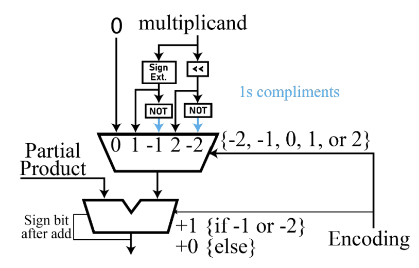</div>

### ProductReg

The product register is optimized to store the product, partial
product, and multiplier at different times during the multiplication operation.
The accompanying figure attempts to depict how each flip-flop in the register
is mapped to the other components. Upon starting a new multiplication the
system will initialize the most significant N+2 bits and the least significant
bits of this register with 0’s and bits 1 to N with the multiplier. 

<div align=center>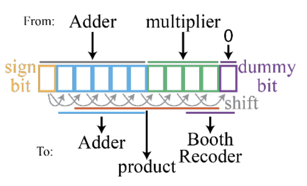</div>

Then, the 3 least significant bits will be used to determine the first partial
product. This will be added to the running partial product contained in bits N+1 to 2N+1 and stored in bits N+1 to 2N+2. Then, each of the will be shifted rightward in the register copying the sign bit for the top two bits. This will occuer N/2 times until the multiplication is complete. The product will be contained in bits 1 to 2N after completion.
In the figure below is an example of how data would move through the Product Register as the product -6 x -5 is computed.

<div align=center>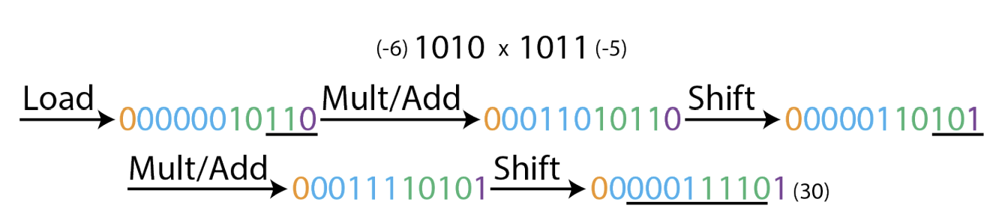</div>

### Ctrl and TimerReg

 Similar to the previous lab the control unit drive the control signals of the other components to
orchestrate the multiplication. However, this time it also comes with a TimerReg. This is because we know exactly how many add/shift cycles week need to complete to compute and fixed width multiplication (N/2). This TimerReg, works as an alarm that signals to the control unit that it is finished and needs to stop the add shift cycle. There are many ways to implement this alarm. But, one of the easiest is to utilize another shift register. When the multiplier starts an operation, this register is initialized to a specific N-bit value such as “100…00” then after each cycle is completed you shift the bits by 1, “010…00”. After N cycles the 1 will have shifted all the way to the right, “000…01”, which can be easily used to send a signal to the controller to tell it to conclude the operation.


## Demoing on the board

You are to map a 4-bit instance of your top-level entity to the board. You should test 4 different multiplications: (-2 x 7), (6 x 5), (5 x 6), and (4 x -7).

### Add the source file

**shift_reg.v**
```verilog
module shift_reg #(
    parameter N = 8  // N is the number of bits in the shift register.
)(
    input clk,                     // Clock input: triggers the shifting or setting actions.
    input set,                     // Set control: if high, load 'din' into the register.
    input shift,                   // Shift control: if high, perform a right shift on the register content.
    input [1:0] shift_in,          // 2-bit input value to be shifted into the register from the left.
    input [N-1:0] din,             // Data input: value to load into the register when 'set' is high.
    output reg [N-1:0] dout        // Data output: current value of the shift register.
);
    
    // Sequential logic block triggered by the rising edge of the clock.
    always @(posedge clk) begin
        if (set == 1'b1) begin
            // When 'set' is high, load 'din' into the register.
            dout <= din; 
        end 
        else if (shift == 1'b1) begin
            // When 'shift' is high, perform a right shift of the register content by two bits,
            // and insert 'shift_in' at the leftmost two bits.
            dout <= {shift_in, dout[N-1:2]};  // Correct for a 2-bit right shift
        end
    end

endmodule


```

**MUX_multiplicand.v**
```verilog
// Define a module for a multiplexer that selects one of five multiplicand values.
// The width of each multiplicand and the output is parameterizable through N.
module MUX_multiplicand #(parameter N = 8)(
    input [2:0] sel,         // 3-bit select input to choose which data line is output.
    input [N-1:0] x1,        // Multiplicand option +0 (no change).
    input [N-1:0] x2,        // Multiplicand option +1 (original value).
    input [N-1:0] x3,        // Multiplicand option -1 (two's complement or negated value).
    input [N-1:0] x4,        // Multiplicand option +2 (double the original value).
    input [N-1:0] x5,        // Multiplicand option -2 (negated double value).
    output reg [N-1:0] y     // Output of the multiplexer, selected based on `sel`.
    );
    
    // Combinational logic to select the output based on the select signal.
    always @(*) begin
        case(sel)
            3'b000: y <= x1; // Selects +0 multiplicand, often used for no operation.
            3'b001: y <= x2; // Selects +1 multiplicand, equivalent to the original number.
            3'b101: y <= x3; // Selects -1 multiplicand, which is the negated original number.
            3'b010: y <= x4; // Selects +2 multiplicand, double the original number.
            3'b110: y <= x5; // Selects -2 multiplicand, negated and double the original number.
            // Note: Other case values like 3'b011, 3'b100, and 3'b111 are not covered.
            // Depending on the design, you may want to handle these undefined states.
        endcase    
    end
endmodule

```


**adder.v**
```verilog
// Parameterizable N-bit adder module.
module adder #(parameter N = 8)(
    input cin,                    // Carry-in input: Adds an extra bit to the sum if set to 1.
    input [N-1:0] x0,              // First N-bit input operand.
    input [N-1:0] x1,              // Second N-bit input operand.
    output reg extend,            // Output flag for sign extension (carry-out or overflow indication).
    output reg [N-1:0] y          // N-bit output sum of the inputs.
);

    // Combinational logic block to compute the sum.
    always @(*) begin
        // If carry-in (cin) is high, add both operands and an additional 1.
        // Otherwise, just add the two operands.
        if(cin == 1)
            y = x0 + x1 + 1;  // Add with carry
        else
            y = x0 + x1;      // Regular addition
    end

    // Combinational logic block to determine the need for sign extension.
    always @(*) begin
        // Check combinations of the most significant bits (MSBs) of inputs for sign extension.
        if (x0[N-1] == 1'b1 & x1[N-1] == 1'b1)
            extend <= 1'b1;  // Both MSBs are 1, indicating potential overflow for positive numbers.
        else if (x0[N-1] == 1'b0 & x1[N-1] == 1'b0)
            extend <= 1'b0;  // Both MSBs are 0, no overflow for positive numbers.
        else if (x0[N-1] == 1'b1 & x1[N-1] == 1'b0)
            extend <= y[N-1];  // Mixed MSBs, check MSB of result for overflow indication.
        else if (x0[N-1] == 1'b0 & x1[N-1] == 1'b1)
            extend <= y[N-1];  // Mixed MSBs, check MSB of result for overflow indication.
        else
            extend <= 1'b0;  // Default case, should logically never occur due to covered cases.
    end

endmodule


```


**RESET.v**
```verilog
// Module definition for a resettable register.
// Parameter N specifies the width of the register.
module RESET #(
	parameter N = 8  // Width of the register and the inputs/outputs.
)(
	input s,                // Reset signal: when high, output follows input; when low, output is cleared.
	input [N-1:0] x1,       // Data input: value to be loaded into the register when 's' is high.
	output reg [N-1:0] y    // Data output: current value of the register.
);

    // The always block triggers on any change of inputs.
	always @(*) 
	begin
		if (s == 1'b1)
			y <= x1;  // If reset signal 's' is high, load 'x1' into the output 'y'.
		else if (s == 1'b0)
			y <= 0;   // If reset signal 's' is low, clear the output 'y'.
	end
	
endmodule


```


**MultiReg.v**
```verilog
// Define a module for a multi-functional register with parameterizable width N.
module MultiReg #(
    parameter N = 8  // N is the number of bits in the register.
)(
    input clk,                    // Clock input: triggers the operations within the register.
    input set,                    // Set control: if high, load 'din' into the register.
    input shift,                  // Shift control: if high, perform a shift operation on the register content.
    input [1:0] shift_in,         // 2-bit input value to be shifted into the register from the left.
    input [N-1:0] din,            // Data input: value to load into the register when 'set' is high.
    output reg [N-1:0] dout       // Data output: current value of the register.
);
    
    // Sequential logic block triggered by the rising edge of the clock.
    always @(posedge clk) begin
        if (shift == 1'b1) begin
            // When 'shift' is high, perform a shift operation.
            // The content of 'dout' is updated to include the 2-bit 'shift_in' value at the left
            // and the existing 'din' data shifted right by two positions.
            dout <= {shift_in, din[N-1:2]};
        end 
        else if (set == 1'b1) begin
            // When 'set' is high, load the 'din' value directly into 'dout'.
            // This operation overrides the shifting behavior if both 'shift' and 'set' are high.
            dout <= din;  
        end
    end

endmodule


```


**Counter.v**
```verilog
// Define a module for a countdown counter with a parameterizable width N.
module Counter #(
    parameter N = 8  // N defines the total count range; actual counter width is N/2.
)(
    input start,          // Start signal: when high, resets or initializes the counter.
    input tick,           // Tick signal: serves as a clock input, driving the counter's decrement.
    output done           // Done signal: goes high when the counter reaches zero.
);

    // Internal counter register with a width of N/2 bits.
    // The counter size is halved presumably to fit specific design constraints or requirements.
    reg [N/2-1:0] count;
    
    // Sequential logic block triggered by the rising edge of 'tick' or 'start'.
    // This block is responsible for resetting the counter on 'start' and decrementing it on 'tick'.
    always @(posedge tick or posedge start) begin
        if (start)
            count <= -1; // Reset the counter to its maximum value (all bits set due to -1 in two's complement).
        else 
            count <= {1'b0, count[N/2-1:1]}; // Perform a right shift, effectively decrementing the counter.
    end
    
    // The 'done' signal is assigned the value of the least significant bit of the counter.
    // When the counter reaches zero, 'count[0]' would be 0, indicating the countdown is not yet complete.
    // There seems to be a logical discrepancy here: typically, 'done' might be expected to signal completion.
    // You may need to revise this based on your intended counter behavior.
    assign done = count[0];

endmodule

```

**CTRL.v**
```verilog
// Control module for managing operations such as counting, shifting, and loading,
// parameterized by bit width N.
module CTRL #(
    parameter N = 8  // Bit width for shift_data.
)(
    input clk,              // Clock input for synchronous operation.
    input rst,              // Active low reset to initialize the state machine.
    input start,            // Start signal to initiate counting or processing.
    input alarm,            // Alarm or external signal to transition from counting.
    input [1:0] bits,       // Input bits for shifting into shift_data.
    output reg busy,        // Busy signal indicating the machine is in operation.
    output reg done,        // Done signal indicating completion of a cycle.
    output reg count,       // Count signal to trigger counting (unused in current context).
    output reg tick,        // Tick signal, typically used for timing or synchronization.
    output reg addReg,      // Control signal to trigger addition operation.
    output reg shiftReg,    // Control signal to trigger shifting operation.
    output reg loadReg,     // Control signal to trigger loading operation.
    output reg [N-1:0] shift_data  // Data register for holding or shifting data.
);

    // State definitions for the state machine.
    reg [2:0] state, next_state;  // Current and next state variables.
    
    // State constants for readability and maintainability.
    parameter RESET = 2'b00;  // State constant for the reset state.
    parameter COUNT = 2'b11;  // State constant for the counting state.
    
    // Shift operation for shift_data, happens every positive clock edge or when reset.
    always @(posedge clk or negedge rst) begin
        if (!rst)
            shift_data <= 0;  // Clear shift_data on reset.
        else
            shift_data <= {bits, shift_data[N-1:2]};  // Shift in new bits on clock edge.
    end
    
    // State transition logic, triggered on clock edge or reset.
    always @(posedge clk or negedge rst) begin
        if (!rst)
            state <= RESET;  // Move to RESET state on reset.
        else
            state <= next_state;  // Transition to next state on clock edge.
    end
    
    // State behavior and output logic based on current state and inputs.
    always @(*) begin
        case (state)
            RESET: begin  // In RESET state...
                if (start == 1'b1) begin
                    next_state = COUNT;  // Move to COUNT state if start is high.
                    busy <= 1'b1;  // Indicate that machine is busy.
                    done <= 1'b0;  // Not done yet.
                end else begin
                    next_state = RESET;  // Stay in RESET if start is not high.
                    busy <= 1'b0;  // Indicate machine is not busy.
                    done <= 1'b0;  // Not done as we are in reset.
                end
            end
            COUNT: begin  // In COUNT state...
                if (alarm == 1'b0) begin
                    next_state = RESET;  // Return to RESET state if alarm is low.
                    busy <= 1'b1;  // Still busy as we were counting.
                    done <= 1'b1;  // Indicate completion as we leave COUNT state.
                end else begin
                    next_state = COUNT;  // Stay in COUNT state if alarm is high.
                    busy <= 1'b1;  // Indicate machine is busy.
                    done <= 1'b0;  // Not done as counting continues.
                end
            end
            default: begin  // In default case...
                next_state = RESET;  // Return to RESET for any undefined states.
                busy <= 1'b0;  // Not busy in undefined state.
                done <= 1'b0;  // Not done as this is an unexpected state.
            end
        endcase
    end
    
    // Output logic for control signals based on current state.
    always @(*) begin
        if (rst == 1'b0) begin  // If in reset...
            loadReg <= 1'b1;  // Prepare to load data.
            addReg <= 1'b0;  // No addition.
            shiftReg <= 1'b0;  // No shifting.
            tick <= 1'b0;  // No tick signal.
        end else begin
            case (state)
                RESET: begin  // In RESET state...
                    loadReg <= (start == 1'b1);  // Load data if start is high

```

**MUX_recoded.v**
```verilog
// Module for recoding multiplier data according to Booth's encoding.
// This is typically used to reduce the number of operations in binary multiplication.
module MUX_recoded(
    input [2:0] mul_data,       // 3-bit input representing a part of the multiplier.
    output reg [2:0] recoded_data // 3-bit output representing the recoded multiplier data.
);

    // Combinational logic to recode the input data based on typical Booth's algorithm patterns.
    always @(*) begin
        case (mul_data)
            // No change needed: Represents multiplication by 0.
            3'b000: recoded_data <= 3'b000; // +0

            // Standard positive multipliers: Represents multiplication by +1.
            3'b001: recoded_data <= 3'b001; // +1
            3'b010: recoded_data <= 3'b001; // +1 (redundant, but aligns with Booth for certain implementations)

            // Special case for handling +2 (not typically standard Booth but may represent a double operation).
            3'b011: recoded_data <= 3'b010; // +2

            // Negative multipliers: Represents multiplication by -1.
            3'b100: recoded_data <= 3'b110; // -2 (In two's complement, '110' represents -2)
            3'b101: recoded_data <= 3'b101; // -1
            3'b110: recoded_data <= 3'b101; // -1 (redundant, but aligns with Booth for certain implementations)

            // Represents a return to zero or no operation needed at the end of a cycle.
            3'b111: recoded_data <= 3'b000; // +0
            
            // Default case can be added if required, especially for handling unexpected inputs.
            // default: recoded_data <= 3'bxxx; // Undefined or X state for illegal inputs.
        endcase    
    end
endmodule


```

**Bitpair_Mult.v**
```verilog
// Parameterized module for bit-pair multiplication, typically used in DSPs or ALUs.
module Bitpair_Mult #(
    parameter N = 8  // Specifies the bit width for the multiplicand and multiplier.
)(
    input clk,                         // Clock input for synchronization.
    input rst,                         // Asynchronous reset signal.
    input start,                       // Start signal to initiate the multiplication process.
    input [N-1:0] multiplican,         // Input multiplicand.
    input [N-1:0] multiplier,          // Input multiplier.
    output [2*N-1:0] product,          // Result of the multiplication.
    output busy,                       // Flag indicating the module is currently processing.
    output done                        // Flag indicating completion of multiplication.
);

    // Control signals for internal operations.
    wire load, shift, add, count, tick, LorA, sign_extend;
    wire [2:0] code;                   // Encoded value for multiplication steps.

    // Intermediate values and registers.
    wire [N:0] product_1, product_0;   // Extended product registers for accumulation.
    wire [N-1:0] multiplican_save;     // Register to store the multiplicand.
    wire [N:0] multi_multiplican;      // Result of selected operation on multiplicand.
    wire [N:0] partial;                // Partial sum/product for each step.
    wire [N:0] reset;                  // Reset value for the adder block.
    wire [N-1:0] data;                 // Additional data, possibly for future use or debugging.

    // Register to store and potentially modify the multiplicand.
    shift_reg #(
        .N(N)
    ) multiplican_Reg (
        .clk(clk),
        .set(load),
        .shift(),              // Not used here as multiplicand does not need shifting.
        .shift_in(),           // No input needed as there's no shift operation.
        .din(multiplican),
        .dout(multiplican_save)
    );
    
    // Register to store and shift the multiplier, integrating partial products.
    shift_reg #(
        .N(N+1)
    ) multiplier_Reg (
        .clk(clk),
        .set(load),
        .shift(shift),
        .shift_in(product_1[1:0]),  // Feed back lower bits of product for Booth encoding.
        .din({multiplier,1'b0}),    // Initialize with multiplier and an added zero bit.
        .dout(product_0)
    );	

    // Compute complementary version of the multiplicand for subtraction.
    assign x3 = (multiplican_save[N-1] == 1'b1) ? {1'b0, ~multiplican_save} : {1'b1, ~multiplican_save};	

    // Multiplexing different operation results based on Booth encoding.
    MUX_multiplicand #(
        .N(N+1)
    ) multi_multi (
        .sel(code),                           // Selection based on Booth recoding.
        .x1(0),                               // No operation (mult by 0).
        .x2({1'b0, multiplican_save}),        // Addition (mult by +1).
        .x3(x3),                              // Subtraction (mult by -1).
        .x4({multiplican_save, 1'b0}),        // Double (mult by +2).
        .x5({~multiplican_save, 1'b1}),       // Negative double (mult by -2).
        .y(multi_multiplican)                 // Output selected operation result.
    );
    
    // Adder for accumulating the multiplication results.
    adder #(
        .N(N + 1)
    ) adder_inst (
        .cin(code[2]),                        // Carry-in based on Booth code, affects addition.
        .x0(multi_multiplican),               // First operand for addition.
        .x1(product_1),                       // Second operand, accumulated product.
        .y(partial)                           // Result of addition.
    );

    // Reset block to clear or set the partial sum/product.
    RESET #(
        .N(N+1)
    ) Reset_blk (
        .s(!load),
        .x1(partial),
        .y(reset)
    );

    // Logic to determine load or add operation.
    assign LorA = load | add;
    
    // Register block used for updating and shifting the partial product.
    MultiReg #(
        .N(N+1)  // Parameter for bit width, extended by one for overflow.
    ) product_Reg (
        .clk(clk),                           // Clock signal to synchronize operations.
        .set(LorA),                          // Signal to set (load) or add to the register.
        .shift(shift),                       // Signal to shift the contents of the register.
        .shift_in({sign_extend, sign_extend}), // Input bits for shifting, based on sign extension.
        .din(reset),                         // Data input, coming from the RESET module or partial sum.
        .dout(product_1)                     // Output of the register, fed back into the system.
    );
    
    // Counter used for controlling the number of multiplication cycles.
    Counter#(
        .N(N)  // Using the same parameter N for consistency with bit width.
    ) timer (
        .start(load),   // Start signal for the counter, initiates counting.
        .tick(count),   // Tick signal used to increment the counter.
        .done(tick)     // Done signal, indicates counting is complete.
    );
    
    // Control unit orchestrates the overall operation of the multiplication.
    CTRL #(
        .N(N)  // Parameter for matching bit width.
    ) ctrl_unit (
        .clk(clk),         // Clock signal for synchronization.
        .rst(rst),         // Reset signal for initializing the control unit.
        .start(start),     // Start signal to kick-off the multiplication process.
        .alarm(tick),      // Alarm or trigger from the counter indicating a cycle is complete.
        .bits(reset[1:0]), // Bits used for control decisions, derived from the RESET module.
        .shiftReg(shift),  // Signal to control shifting operation.
        .addReg(add),      // Signal to control addition operation.
        .loadReg(load),    // Signal to control data loading operation.
        .tick(count),      // Signal to manage timing and counting.
        .busy(busy),       // Output signal indicating the module is processing.
        .done(done),       // Output signal indicating the multiplication is complete.
        .shift_data(data)  // Data involved in shifting operations.
    );  
    
    // Booth recoding unit for transforming multiplier bits into control signals.
    MUX_recoded booth (
        .mul_data(product_0[2:0]),  // Input data from the shifted multiplier.
        .recoded_data(code)         // Output recoded data for controlling the multiplication steps.
    );

    // Final product assembly, combining sign extension, partial product, and data.
    // This forms the complete output product from the multiplication process.
    assign product = {sign_extend, product_1[N:0], data};  // Concatenate to form the full product.

endmodule
```


We will map ```clk``` port to button, so we also need the debouncing module like below:

**btn_lab4.v**
```verilog

// Module definition for lab 4 button interface with parameterizable data width N.
module btn_lab4 #(
    parameter N = 4  // Define the data width for the system.
)(
    input clk,               // Clock input for synchronization.
    input rst,               // Global reset signal.
    input key,               // Input signal from a physical button.
    input start,             // Control signal to start the processor.
    input [N-1:0] multiplicand,    // Data input port for the multiplicand.
    input [N-1:0] multiplier,       // Data input port for the multiplier.
    output [2*N-1:0] product,       // Output port for the product result.
    output Busy,                     // Processor's busy status output.
    output Done                      // Signal indicating completion of the operation.
);
    
    // Internal signals for debouncing logic.
    wire key_pulse;          // Pulse signal generated after key debounce.
    reg [7:0] key_buffer;    // Buffer to store states of the key for debouncing.
    reg key_reg;             // Register to hold the debounced key value.
    
    // Debounce logic for the key input, triggered on clock edge or reset.
    always @(posedge clk or negedge rst) begin
        if (!rst)
            key_reg <= 1'b0;  // Clear the key register on reset.
        else if (key == 1'b1)
            key_reg <= 1'b1;  // Set the key register if key input is high.
        else 
            key_reg <= 1'b0;  // Clear the key register if key input is low.
    end

integer i; 
    // Update key buffer on each clock cycle, used for edge detection.
    always @(posedge clk or negedge rst) begin
        if (!rst)
            key_buffer <= 8'b0;  // Reset the key buffer on reset.
        else begin
            // Sequentially fill the buffer based on the debounced key value.
            for (i = 0; i < 8; i = i + 1) begin
                if (key_reg == 1'b1)
                    key_buffer[i] <= 1'b1;  // Set buffer bits if key is pressed.
                else
                    key_buffer[i] <= 1'b0;  // Clear buffer bits if key is not pressed.
            end            
        end  
    end
    
    // Generate a single-cycle pulse when the key is pressed.
    // This is a simplification; typically, edge detection logic would be used.
    assign key_pulse = &key_buffer;  // AND all bits to generate a pulse.
    
    // Instantiation of the system_processor (or Bitpair_Mult) module 
    // with the debounced key_pulse signal as the clock input.
    Bitpair_Mult #(
        .N(N)  // Pass the parameter N to the instantiated module.
    ) dut (
        .clk(key_pulse),        // Use the debounced key signal as a clock for simulation purposes.
        .rst(rst),              // Pass the reset signal.
        .start(start),          // Pass the start control signal.
        .multiplican(multiplican), // Pass the multiplicand input.
        .multiplier(multiplier),   // Pass the multiplier input.
        .product(product),         // Connect to the product output.
        .busy(Busy),               // Connect to the busy status output.
        .done(Done)                // Connect to the done signal output.
    );
    
endmodule


```

Now we can see the ```Schematic``` under the RTL ANALYSIS part like below:

<div align=center>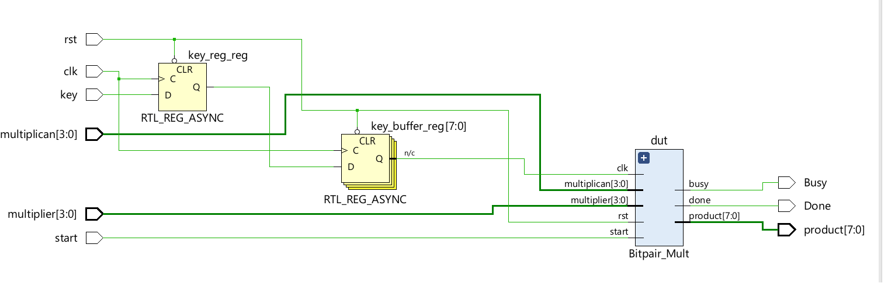</div>

For the system module, we can see:

<div align=center>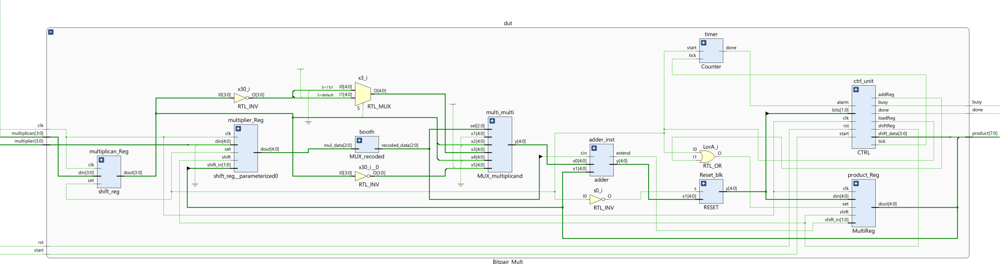</div>

### Creating a testbench

Then we can run Simulation to check the code of the ```Bitpair_Mult``` module.

**tb.v**
```verilog
// Define a testbench module for the Bitpair_Mult
module BitPairMult_tst();

    // Define variables for loop iterations and their maximum values
    integer i;
    integer j;
    integer max_i = 4; // Maximum value for i loop
    integer max_j = 4; // Maximum value for j loop
    
    parameter N = 4; // Bit width for multiplicand and multiplier

    // Testbench control signals
    reg clk;        // Clock signal for synchronization
    reg rst;        // Reset signal to initialize the module
    reg start;      // Start signal to trigger multiplication

    // Input values for the multiplier
    reg [N-1:0] multiplican; // Input multiplicand
    reg [N-1:0] multiplier;  // Input multiplier
    
    // Outputs from the multiplier module
    wire busy;               // Indicates if the module is currently processing
    wire done;               // Indicates if the multiplication is complete
    wire [2*N-1:0] product;  // The result of the multiplication

    // Instantiate the Bitpair_Mult module with parameter N
    Bitpair_Mult #(
        .N(N)
    ) dut (
        .clk(clk),
        .rst(rst),
        .start(start),
        .multiplican(multiplican),
        .multiplier(multiplier),
        .product(product),
        .busy(busy),
        .done(done)
    );
    
    // Clock generation block
    initial begin
        clk <= 1'b0; // Initialize the clock to 0
        // Toggle clock every 5 time units to create a clock signal
        repeat (2*(2 + max_i * max_j * 3 + 3)) begin
            #5 clk <= ~clk;
        end
    end
    
    // Test sequence block
    initial begin
        $display("Running testbench"); // Display message on simulation start
        
        // Initialize inputs
        rst <= 1'b0;         // Assert reset initially
        start <= 1'b0;       // Ensure start is low
        multiplican <= 0;    // Initialize multiplicand
        multiplier <= 0;     // Initialize multiplier
        #10;                 // Wait for two clock cycles
        rst <= 1'b1;         // De-assert reset to start module operation
        #10;                 // Wait for two more clock cycles before starting test

        // Set test values for multiplicand and multiplier
        multiplican <= 4'b0100; // Set multiplicand to 4
        multiplier <=  4'b1001;  // Set multiplier to -7
    //  multiplican	<= 4'b1110;//-2
    //  multiplier	<= 4'b0111;//7
    //  multiplican	<= 4'b0110; //6
    //  multiplier	<= 4'b0101;//5
    //  multiplican	<= 4'b1010; //-6
    //  multiplier	<= 4'b1011;//-5
        #2;                      // Wait a short time
        start <= 1'b1;           // Assert start to begin multiplication
        #4;                      // Wait two clock cycles
        start <= 1'b0;           // Deassert start to simulate single pulse
        #4;                      // Wait two more clock cycles for results


    end

    
endmodule


```


And we can run Simulation to check the code by clicking the ```Run Simulation``` under the ```SIMULATION``` and choose the first ```Run Behavioral Simulation```. Here, the function of the ```clk``` is the same as the ```submit``` of the lab8.

<div align=center>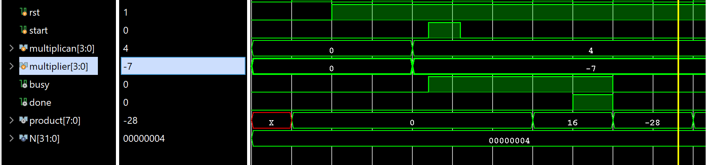</div>

The multipican is 4 and the multipier is -7, then the result is -28.

<div align=center></div>

The multipican is -2 and the multipier is 7, then the result is -14.

<div align=center>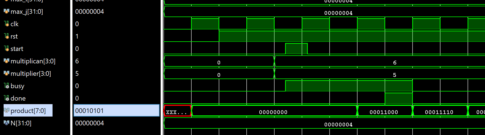</div>

The multipican is 6 and the multipier is 5, then the result is 00111110, which is equal to the 30.

<div align=center>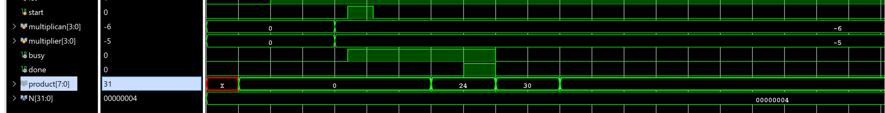</div>

The multipican is -6 and the multipier is -5, then the result is 30.


### Implementation

The part can reference the [Generate Bitstream](https://uri-nextlab.github.io/ParallelProgammingLabs/Labs/Lab1_led.html#generate-the-bitstream) in lab1.

The block design is shown below:

<div align=center>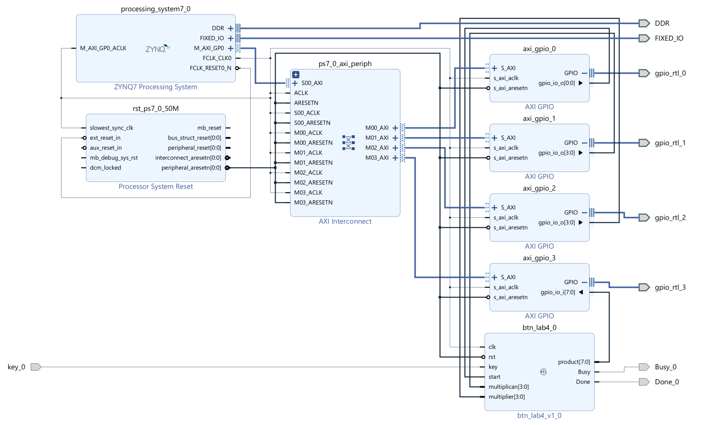</div>


For the value of ```start``` ```multiplican``` ```multiplier``` ports can be read from the ```AXI_GPIO``` IP, and we need to write data to the ```product``` input ports by ```AXI_GPIO``` and the ```key``` port will map to the button(L19) and the ```Done``` port will map to the LED(M14)  and the ```Busy``` will map to the LED(R14) of the board.

### Download the bitstream file to PYNQ

We need to download the design_1_wrapper.bit to the local machine. Go to Lab9/project_1/project_1.runs/impl_1, download design_1_wrapper.bit, and upload the file to the PYNQ. And we also need to upload the design_1.hwh  file which is in the Lab9/project_1/project_1.gen/sources_1/bd/design_1/hw_handoff.

```python
from pynq import Overlay
from pynq import Bitstream
bit = Bitstream("design_1.bit")
bit.download()
bit.bitfile_name

```

```python
from pynq import MMIO 
GPIO_BASE_ADDRESS = 0X41200000
GPIO_RANGE = 0x1000
start_write = MMIO(GPIO_BASE_ADDRESS, GPIO_RANGE)
```

```python
GPIO_BASE_ADDRESS = 0X41210000
GPIO_RANGE = 0x1000
multiplican = MMIO(GPIO_BASE_ADDRESS, GPIO_RANGE)
```

```python
GPIO_BASE_ADDRESS = 0X41220000
GPIO_RANGE = 0x1000
multiplier = MMIO(GPIO_BASE_ADDRESS, GPIO_RANGE)
```

```python
GPIO_BASE_ADDRESS_r = 0X41230000
GPIO_RANGE = 0x1000
product = MMIO(GPIO_BASE_ADDRESS_r, GPIO_RANGE)
```


```python
representations = {
    '0': ('###', '# #', '# #', '# #', '###'),
    '1': ('  #', '  #', '  #', '  #', '  #'),
    '2': ('###', '  #', '###', '#  ', '###'),
    '3': ('###', '  #', '###', '  #', '###'),
    '4': ('# #', '# #', '###', '  #', '  #'),
    '5': ('###', '#  ', '###', '  #', '###'),
    '6': ('###', '#  ', '###', '# #', '###'),
    '7': ('###', '  #', '  #', '  #', '  #'),
    '8': ('###', '# #', '###', '# #', '###'),
    '9': ('###', '# #', '###', '  #', '###'),
    '-': ('   ', '   ', '###', '   ', '   '),
    '.': ('   ', '   ', '   ', '   ', '  #'),
}

def seven_segment(number):
    # treat the number as a string, since that makes it easier to deal with
    # on a digit-by-digit basis
    digits = [representations[digit] for digit in str(number)]
    # now digits is a list of 5-tuples, each representing a digit in the given number
    # We'll print the first lines of each digit, the second lines of each digit, etc.
    for i in range(5):
        print("  ".join(segment[i] for segment in digits))
```

```python
DATA_OFFSET = 0X0
DATA_0 = 0x06
DATA_1 = 0X05
multiplican.write(DATA_OFFSET,DATA_0)
multiplier.write(DATA_OFFSET,DATA_1)
```

```python
start_write.write(0x0,1)
```

Then we need to press the button(L19) until you can see the LED(M14) is on which means the process is done. And we need to press the button again and you can see the LED is off and we can see the result below:

```python
# Decimal value
decimal_value = product.read(0x0)

# Convert the decimal value to an 8-bit binary string
binary_str = format(decimal_value, '08b')

# Convert to signed decimal
if binary_str[0] == '1':  # Check if the number is negative in two's complement
    # Invert the digits
    inverted_str = ''.join('1' if bit == '0' else '0' for bit in binary_str)
    # Convert to decimal and subtract 1 to get the magnitude
    signed_decimal = -1 * (int(inverted_str, 2) + 1)
else:
    # If the number is positive, just convert directly
    signed_decimal = int(binary_str, 2)

seven_segment(signed_decimal)
```
<div align=center>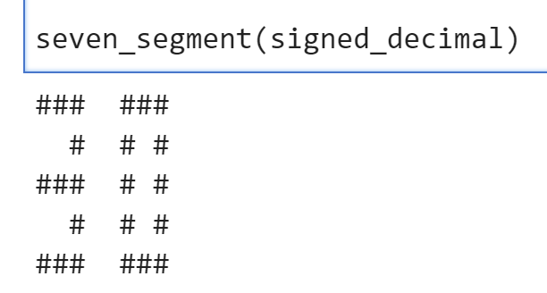</div>

```python
DATA_OFFSET = 0X0
DATA_0 = 0x05
DATA_1 = 0X06
multiplican.write(DATA_OFFSET,DATA_0)
multiplier.write(DATA_OFFSET,DATA_1)
```

```python
start_write.write(0x0,1)
```

```python
# Decimal value
decimal_value = product.read(0x0)

# Convert the decimal value to an 8-bit binary string
binary_str = format(decimal_value, '08b')

# Convert to signed decimal
if binary_str[0] == '1':  # Check if the number is negative in two's complement
    # Invert the digits
    inverted_str = ''.join('1' if bit == '0' else '0' for bit in binary_str)
    # Convert to decimal and subtract 1 to get the magnitude
    signed_decimal = -1 * (int(inverted_str, 2) + 1)
else:
    # If the number is positive, just convert directly
    signed_decimal = int(binary_str, 2)

seven_segment(signed_decimal)
```
<div align=center></div>

```python
DATA_OFFSET = 0X0
DATA_0 = 0xe   #-2*7
DATA_1 = 0X07
multiplican.write(DATA_OFFSET,DATA_0)
multiplier.write(DATA_OFFSET,DATA_1)
```

```python
start_write.write(0x0,1)
```
Then we need to press the button(L19) until you can see the LED(M14) is on which means the process is done. And we need to press the button again and you can see the LED is off and we can see the result below:

```python
# Decimal value
decimal_value = product.read(0x0)

# Convert the decimal value to an 8-bit binary string
binary_str = format(decimal_value, '08b')

# Convert to signed decimal
if binary_str[0] == '1':  # Check if the number is negative in two's complement
    # Invert the digits
    inverted_str = ''.join('1' if bit == '0' else '0' for bit in binary_str)
    # Convert to decimal and subtract 1 to get the magnitude
    signed_decimal = -1 * (int(inverted_str, 2) + 1)
else:
    # If the number is positive, just convert directly
    signed_decimal = int(binary_str, 2)

seven_segment(signed_decimal)
```
<div align=center>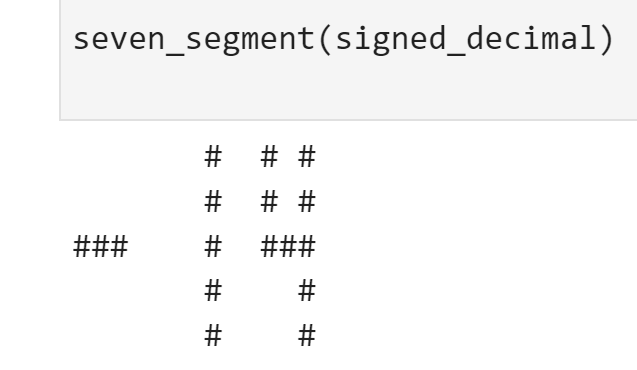</div>

```python
DATA_OFFSET = 0X0
DATA_0 = 0x04 #4*-7
DATA_1 = 0X09
multiplican.write(DATA_OFFSET,DATA_0)
multiplier.write(DATA_OFFSET,DATA_1)
```

```python
start_write.write(0x0,1)
```
Then we need to press the button(L19) until you can see the LED(M14) is on which means the process is done. And we need to press the button again and you can see the LED is off and we can see the result below:

```python
# Decimal value
decimal_value = product.read(0x0)

# Convert the decimal value to an 8-bit binary string
binary_str = format(decimal_value, '08b')

# Convert to signed decimal
if binary_str[0] == '1':  # Check if the number is negative in two's complement
    # Invert the digits
    inverted_str = ''.join('1' if bit == '0' else '0' for bit in binary_str)
    # Convert to decimal and subtract 1 to get the magnitude
    signed_decimal = -1 * (int(inverted_str, 2) + 1)
else:
    # If the number is positive, just convert directly
    signed_decimal = int(binary_str, 2)

seven_segment(signed_decimal)
```
<div align=center>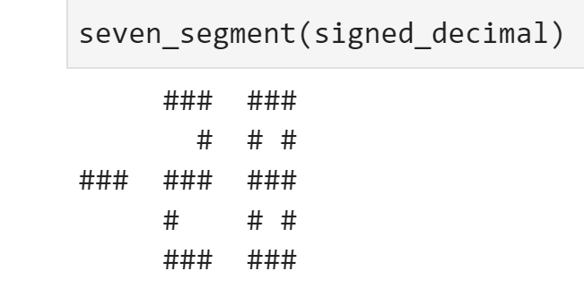</div>

```python
DATA_OFFSET = 0X0
DATA_0 = 0x0a #-6*-5
DATA_1 = 0X0b
multiplican.write(DATA_OFFSET,DATA_0)
multiplier.write(DATA_OFFSET,DATA_1)
```

```python
start_write.write(0x0,1)
```

Then we need to press the button(L19) until you can see the LED(M14) is on which means the process is done. And we need to press the button again and you can see the LED is off and we can see the result below:

```python
seven_segment(product.read(0x0))# Decimal value
decimal_value = product.read(0x0)

# Convert the decimal value to an 8-bit binary string
binary_str = format(decimal_value, '08b')

# Convert to signed decimal
if binary_str[0] == '1':  # Check if the number is negative in two's complement
    # Invert the digits
    inverted_str = ''.join('1' if bit == '0' else '0' for bit in binary_str)
    # Convert to decimal and subtract 1 to get the magnitude
    signed_decimal = -1 * (int(inverted_str, 2) + 1)
else:
    # If the number is positive, just convert directly
    signed_decimal = int(binary_str, 2)

seven_segment(signed_decimal)```
```
<div align=center></div>

