# Lab1_led 

This lab guides you through the process of using Vivado IDE to create a simple HDL design targeting the PYNQ-Z2. You will simulate, synthesize, and implement the design with default settings. Finally, you will generate the bitstream and download it into the hardware to verify the design functionality.

<div align=center></div>

## Objectives

After completing this lab, you will be able to:

* Create a Vivado project sourcing HDL model(s) and targeting the ZYNQ devices located on the PYNQ-Z2 boards.

* Use the provided Xilinx Design Constraint (XDC) file to constrain the pin locations.

* Simulate the design using the Vivado simulator.

* Synthesize and implement the design.

* Generate the bitstream.

* Configure ZYNQ using the generated bitstream and verify the functionality.

## Source code

-[source code](https://github.com/Xilinx/xup_fpga_vivado_flow/tree/main/source/pynq-z2/lab1)

## Steps

### Create Project Folder and Launch Vivado

<u>For Linux User:</u>

* Launch Palmetto Desktop

* Open a new terminal. Notice that when you open a new terminal, the first step is sourcing the environment variables to run Vitis and Vivado.

```bash
    source /project/twei2/vitis/vitinstall/Vitis/2022.2/settings64.sh
```

* You can create a folder first for making the file path more clearly or run `vivado` directly, it up to you.

```bash
    mkdir Lab1
    cd Lab1
    vivado
```

<u>For Windows User:</u>

* Create a new folder (e.g., `C:\Users\twei2\workspace\course\Lab1`)

* Launch Vivado 

### Create a Vivado Project 

* Click *Create New Project*, and click *Next*. Then, give your project a name (i.e. project_1) and choose *RTL Project*. Making sure the *Project location* is the correct path that you want to save the project.

* Select the board, search `pynq` and choose `pynq-z2`, then click *Next* and *Finish*. If you do not have it, follow the instruction in the provided link below.

  [Add BSP file to Vivado](https://pynq.readthedocs.io/en/latest/overlay_design_methodology/board_settings.html)

<div align=center>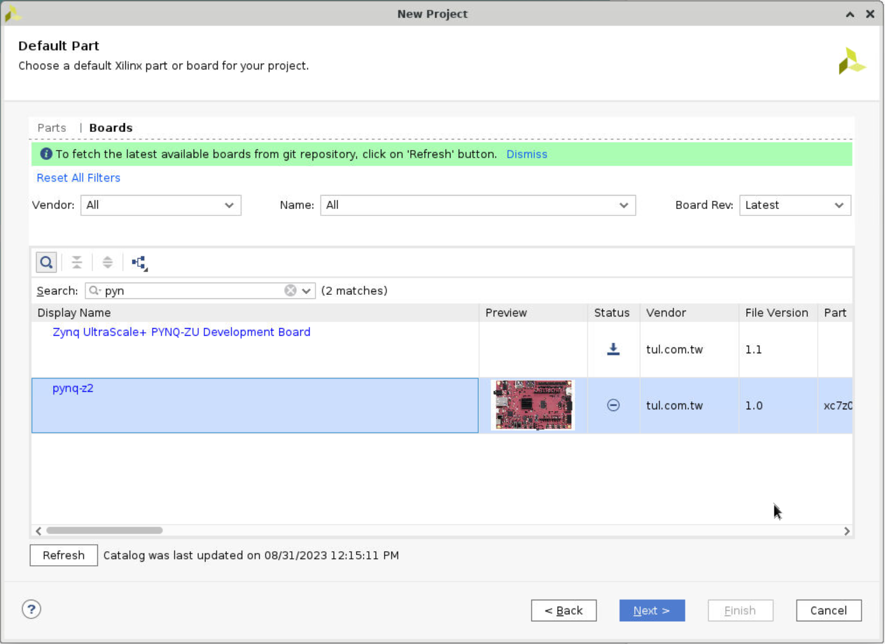</div>

### Add source files 

* Read this document first.

-[Vivado design suite user guide](https://docs.xilinx.com/r/2022.2-English/ug895-vivado-system-level-design-entry/Introduction?tocId=YFapF_t0U4KZweOG8SPPMg)

There are three kinds of source files: constrains file, design source file and silumation source file. Simulation source file and constraints file specify the timing requirements for the design and physical constraints defining the Xilinx device resources used by the design.

* Click *Add Sources* under the *PROJECT MANAGER - Settings* and choose *Add or create design sources*. Then, click *Create File*, give the file name (i.e. lab1.v), and choose *Finish*. Later, you will see a window letting you define the I/O port. You don't need to change anything here, just click *OK* and choose *Yes*. Then, you will see the file under the *Design Sources* in the *Source* window. 

<div align=center>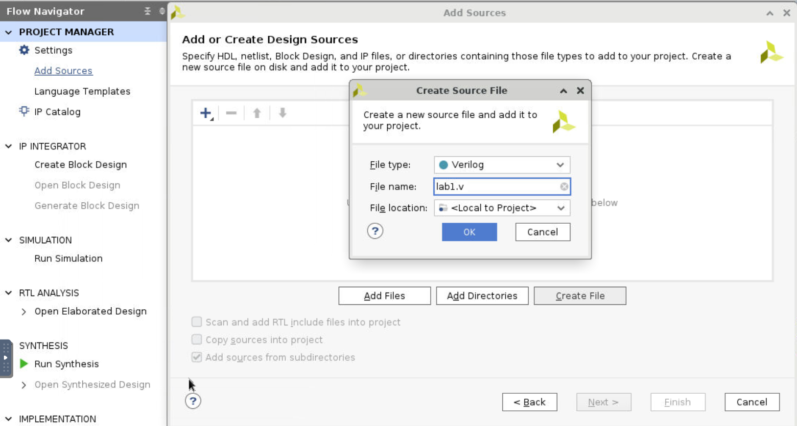</div>

* Execute similar steps to add both the constraints file and the simulation sources file.

<div align=center>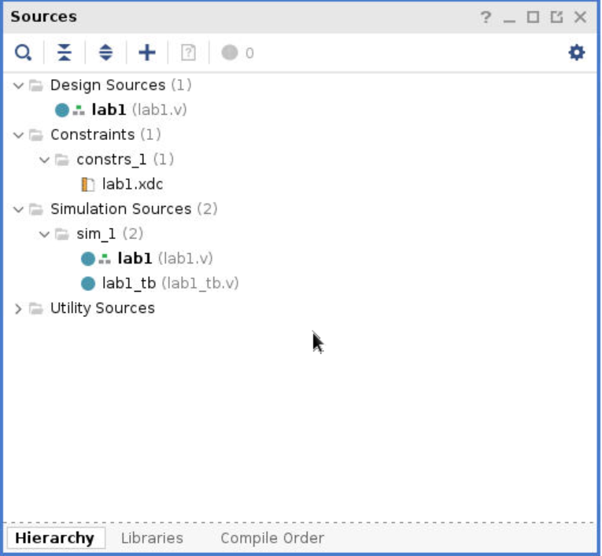</div>

### Add code

* *Add design source code:* Double click on the `lab1.v` file, and enter the following code:

```verilog
    module lab1(
        input [3:0] btn,
        output [3:0] led
        );

        assign led[0] = ~btn[0];
        assign led[1] = btn[1] & ~btn[2];
        assign led[3] = btn[2] & btn[3];
        assign led[2] = led[1] | led[3];
     
    endmodule
```

* *Add simulation code:* Double click `lab1_tb.v`.

```verilog
    module lab1_tb();
        
        reg [3:0] btns;
        wire [3:0] leds;
        reg [3:0] e_led;

        integer i;

        lab1 dut(.led(leds),.btn(btns));

        function [3:0] expected_led;
            input [3:0] btn;
            begin      
                expected_led[0] = ~btn[0];
                expected_led[1] = btn[1] & ~btn[2];
                expected_led[3] = btn[2] & btn[3];
                expected_led[2] = expected_led[1] | expected_led[3];
            end   
        endfunction   

        initial
        begin
            for (i=0; i < 15; i=i+1)
            begin
                #50 btns=i;
                #10 e_led = expected_led(btns);
                if(leds == e_led)
                    $display("LED output matched at", $time);
                else
                    $display("LED output mis-matched at ",$time,": expected: %b, actual: %b", e_led, leds);
            end
        end
          
    endmodule
```

* *Add constraints code:* Double click `lab1.xdc`.

```verilog
# PYNQ Pin Assignments
############################
# On-board Slide Buttons  #
############################
set_property -dict { PACKAGE_PIN D19   IOSTANDARD LVCMOS33 } [get_ports { btn[0] }];
set_property -dict { PACKAGE_PIN D20   IOSTANDARD LVCMOS33 } [get_ports { btn[1] }];
set_property -dict { PACKAGE_PIN L20   IOSTANDARD LVCMOS33 } [get_ports { btn[2] }];
set_property -dict { PACKAGE_PIN L19   IOSTANDARD LVCMOS33 } [get_ports { btn[3] }];

############################
# On-board leds             #
############################
set_property -dict { PACKAGE_PIN R14   IOSTANDARD LVCMOS33 } [get_ports { led[0] }];
set_property -dict { PACKAGE_PIN P14   IOSTANDARD LVCMOS33 } [get_ports { led[1] }];
set_property -dict { PACKAGE_PIN N16   IOSTANDARD LVCMOS33 } [get_ports { led[2] }];
set_property -dict { PACKAGE_PIN M14   IOSTANDARD LVCMOS33 } [get_ports { led[3] }];
```

Lines 5-8 define the pin locations for the input buttons and lines 13-16 define pin locations for output LEDs. The pin layout of PYNQ_Z2 is shown in the following figure.

<div align=center></div>

###  Simulate the design using the Vivado simulator

* Select *Settings* under the *Project Manager* tasks of the *Flow Navigator* pane.

A *Settings* form will appear showing the *Simulation* properties form.

* Ensure the *Simulation top module name* is `lab1_tb`.

* Select the *Simulation* tab, and set the *Simulation Run Time* value to 200 ns and click *OK*.

<div align=center>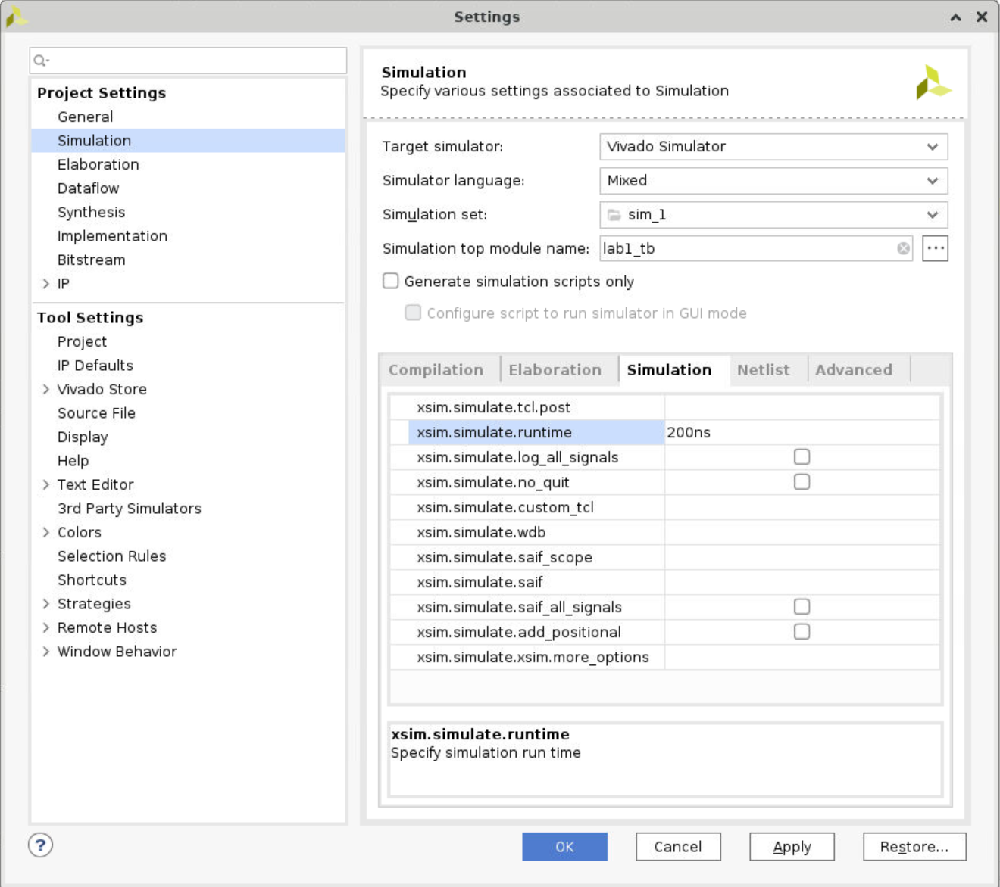</div>

* Click on *Simulation > Run Simulation > Run Behavioral Simulation* Under the *Project Manager* tasks of the *Flow Navigator* pane.

The testbench and source files will be compiled and the Vivado simulator will be run (assuming no errors). You will see a simulator output like the one shown below.

<div align=center>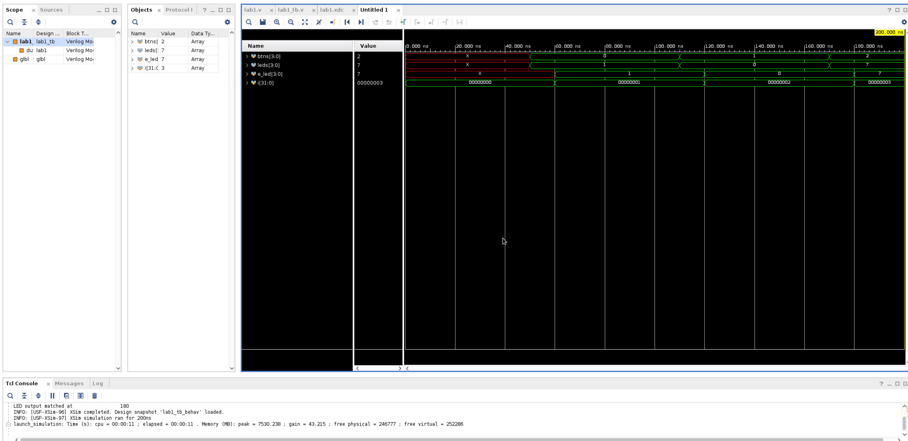</div>

You will see four main views: (i) Scopes, where the testbench hierarchy as well as glbl instances are displayed, (ii) Objects, where top-level signals are displayed, (iii) the waveform window, and (iv) Tcl Console where the simulation activities are displayed. Notice that since the testbench used is self-checking, the results are displayed as the simulation is run.

Notice that the `<project_name>.sim` directory is created under the `<project_name>` directory, along with several low-level directories. 

<u>For Linux User:</u>

To verify, open a new terminal and execute the following shell command:

```bash
    cd <project path>
    tree <project_name.sim>
```

For example, I create a new folder named *Lab1*, and name the project *project_1*, I will run:

```bash
    cd Lab1/project_1
    tree project_1.sim
```

The display will resemble the figure below.

<div align=center>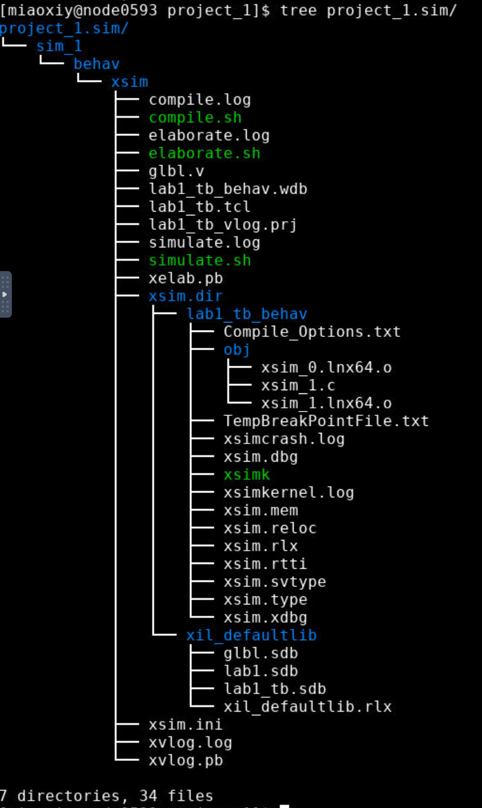</div>

<u>For Windows User:</u>

Launch Command Prompt and execute the following command (example):

```bash
    cd C:\Users\twei2\workspace\course\Lab1\Lab1.sim
    tree /f /a
```

You should see the tree now.

* Back to vivado, you will see several buttons next to the waveform window which can be used for the specific purpose as listed in the figure blow.

<div align=center></div>

We can click the fifth pattern (Zoom Fit) to see the entire waveform. Notice that the output changes when the input changes. You can also float the simulation waveform window by clicking on the *Float button* on the upper right hand side of the view. This will allow you to have a wider window to view the simulation waveforms. To reintegrate the floating window back into the GUI, simply click on the *Dock Window* button.

<div align=center>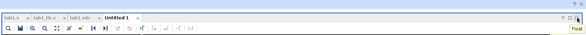</div>

<div align=center>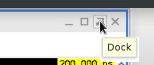</div>

### Change display format if desired

Select *i[31: 0]* in the waveform window, right-click, select Radix, and then select Unsigned Decimal to view the for-loop index in an unsigned integer form. Similarly, change the radix of *btn[3: 0]* to Hexadecimal. Leave the *leds[3: 0]* and *e_led[3: 0]* radix to binary as we want to see each output bit.

### Add more signals to monitor the lower-level signals and continue to run the simulation for *500 ns*.

* Expand the *lab1_tb* instance, if necessary, in the Scopes window and select the *dut* (Device Under Test) instance.

The btn[3:0] and led[3:0] signals will be displayed in the Objects window.

* Select *btn[3:0]* and *led[3:0]* and drag them into the waveform window to monitor those lower-level signals. 

<div align=center>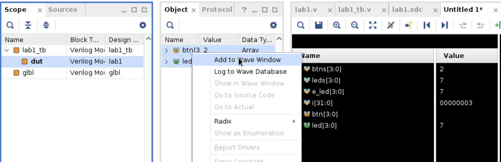</div>

* On the simulator tool buttons ribbon bar, type 500 in the simulation run time field, click on the drop-down button of the units field and select *ns* since we want to run for 500 ns (total of 700 ns), and click on the *Run for 500ns* button. The simulation will run for an addtional 500 ns. 

<div align=center>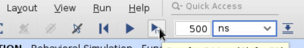</div>

* Click on the *Zoom Fit* button and observe the output.

<div align=center>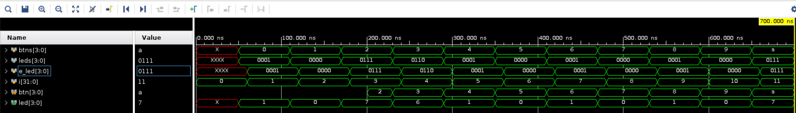</div>

Observe the Tcl Console window and see the output is being displayed as the testbench uses the `$display` task.

<div align=center>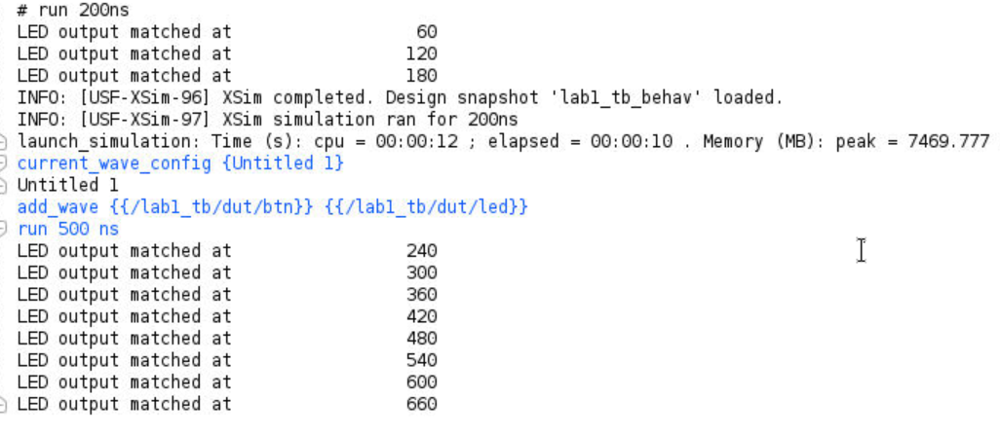</div>

* Close the simulator by select *File > Close Simulation*.

* Click *Ok* and then click *Discard* to close it without saving the waveform.

### Synthesize the Design and Analyze the Project Summary Output

* Click on *Run Synthesis* under the *SYNTHESIS* tasks of the *Flow Navigator* pane.

The synthesis process will be run on the `lab1.v` file (and all its hierarchical files if they exist; `lab1.v` is the top file in this example). When the process is completed a Synthesis Completed dialog box with three options will be displayed.

* Select the *Open Synthesized Design* option and click *OK* as we want to look at the synthesis output before progressing to the implementation stage.

Click *Yes* to close the elaborated design if the dialog box is displayed.

* Select the *Project Summary* tab and understand the various windows.

If you don't see the Project Summary tab then select *Window > Project Summary* or click the *Project Summary* icon.

<div align=center>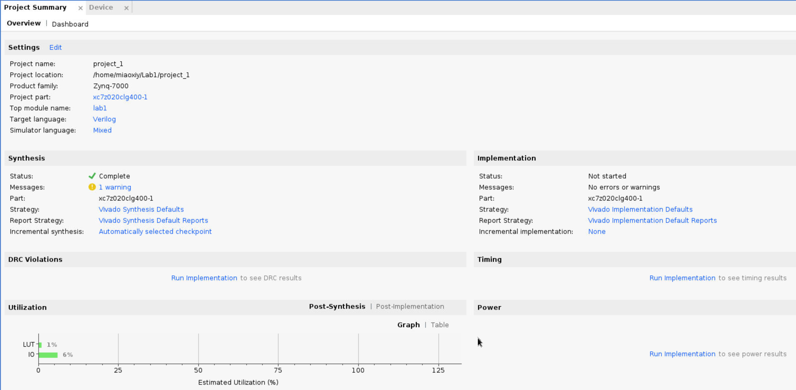</div>

Click on the various links to see what information they provide and which allows you to change the synthesis settings.

* Click on the *Table* tab in the *Project Summary* tab at the *Utilization* small window.

Notice that there are an estimated 3 LUTs and 8 IOs (4 input and 4 output) that are used.

<div align=center>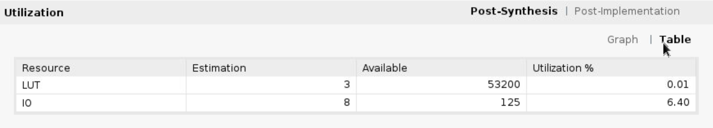</div>

* In the Flow Navigator, under Synthesis (expand Open Synthesized Design if necessary), click on *Schematic* to view the synthesized design in a schematic view.

<div align=center>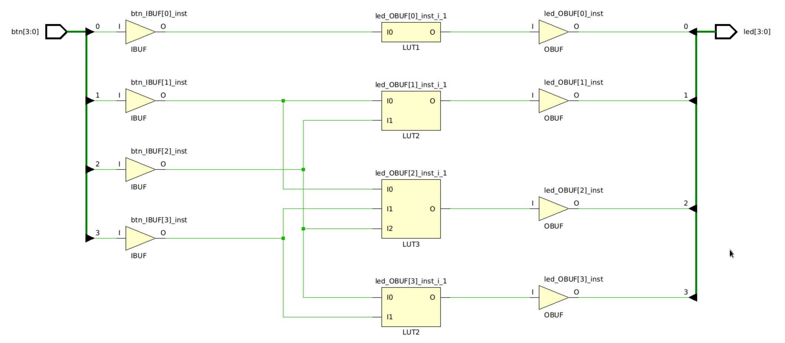</div>

Using Windows Explorer, verify that `project_1.runs (in my project)` directory is created under project1. Under the runs directory, synth_1 directory is created which holds several files related to synthesis.

<div align=center>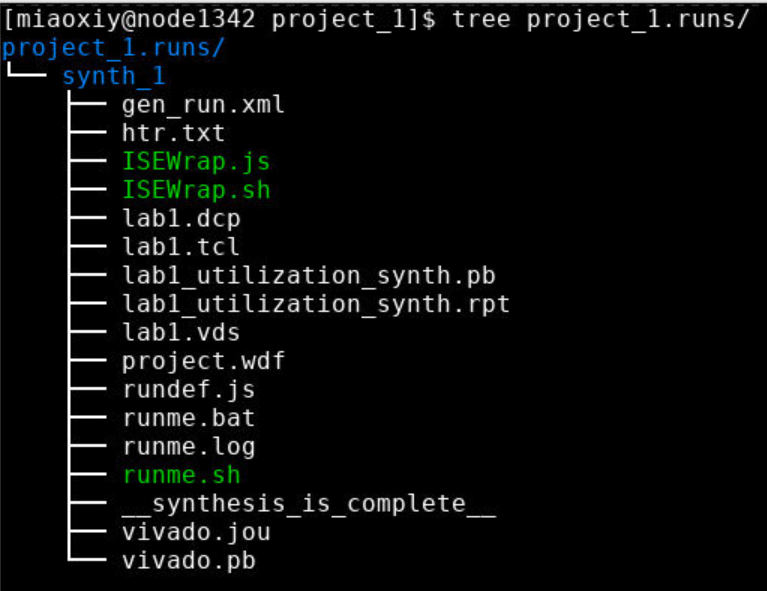</div>

### Implement the Design

* Click on `Run Implementation` under the Implementation tasks of the Flow Navigator pane.

The implementation process will be run on the synthesized design. When the process is completed an Implementation Completed dialog box with three options will be displayed. You can choose to use how many jobs you want to implement this design. In general, more jobs consumes more computing resources and less runtime.

<div align=center>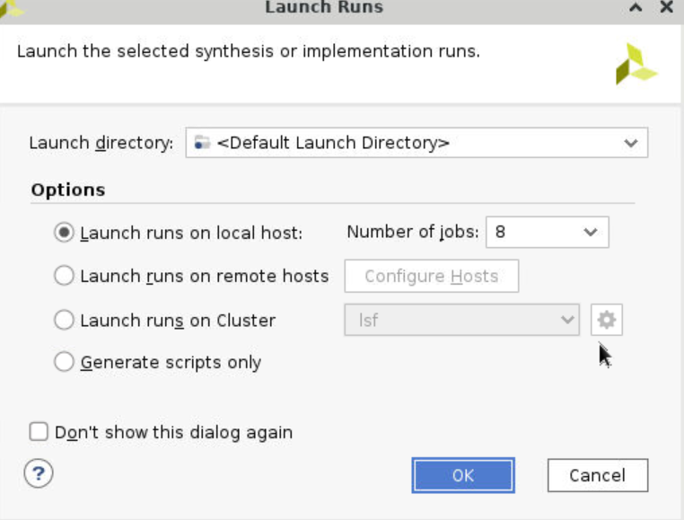</div>

* Select *Open implemented design* and click *OK* as we want to look at the implemented design in a Device view tab.

* Click *Yes*, if promoted, to close the synthesized design. The implemented design will be opened.

* In the Netlist pane, select one of the nets (e.g. led_OBUF[3]) and notice that the net displayed in the X1Y2 clock region in the Device view tab (you may have to zoom in to see it).

* If it is not selected, click the *Routing Resources icon* to show routing resources. For example, I highlighted the *led_OBUF* net.

<div align=center>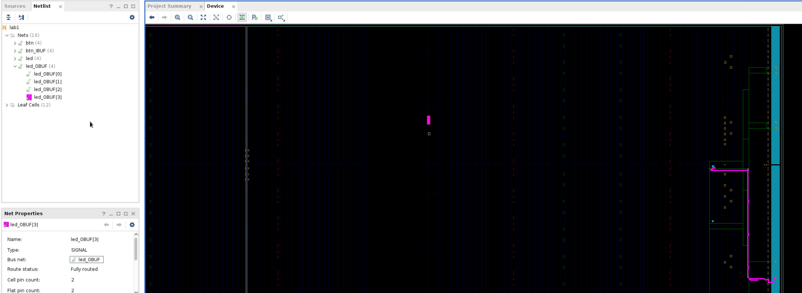</div>

* Close the implemented design view by selecting *File > Close Implemented Design*, and select the *Project Summary* tab (you may have to change to the Default Layout view) and observe the results.

* Select the *Post-Implementation* tab.

*Notice* that the actual resource utilization is 3 LUTs and 8 IOs. Also, it indicates that no timing constraints were defined for this design (since the design is combinational).

<div align=center>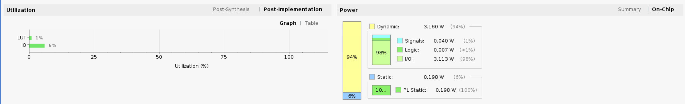</div>

Using the Windows Explorer, verify that *impl_1* directory is created at the same level as *synth_1* under the `project_1.runs` directory. The *impl_1* directory contains several files including the implementation report files.

* In Vivado, select the *Reports* tab in the bottom panel (if not visible, click Window in the menu bar and select *Reports*), and double-click on the Utilization Report entry under the Place Design section. The report will be displayed in the auxiliary view pane showing resource utilization. Note that since the design is combinatorial, no registers are used.

### Perform Timing Simulation

* Select *Run Simulation > Run Post-Implementation Timing Simulation* process under the Simulation tasks of the Flow Navigator pane.

The Vivado simulator will be launched using the implemented design and `lab1_tb` as the top-level module.

Using the Windows Explorer, verify that timing directory is created under the *project_1.sim > sim_1 > impl* directory. The timing directory contains generated files to run the timing simulation.

* Click on the Zoom Fit button to see the waveform window from 0 to 200 ns.

* Right-click at 50 ns (where the btns input is set to 0000b) and select *Markers > Add Marker*.

* Similarly, right-click and add a marker at around 58.000 ns where the *leds* changes.

* You can also add a marker by clicking on the *Add Marker* button. Click on the *Add Marker* button and left-click at around 60 ns where *e_led* changes.

<div align=center>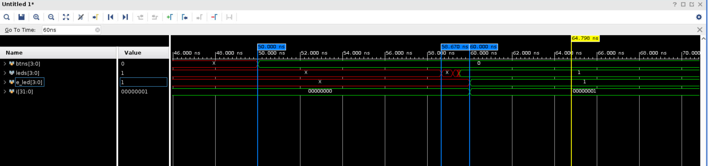</div>

Notice that we monitored the expected led output at 10 ns after the input is changed (see the testbench) whereas the actual delay is about 8 to 9.7 ns (depending on the board).

* Close the simulator by selecting *File > Close Simulation* without saving any changes.

### Generate the Bitstream

*Notice!* You may encounter a stuck problem. No worries, just restart the vivado and do the same operations.

In order to let it work successfully, we need to add *PS* part first.

* Click *Create Block design* under *IP INTEGRATOR*, then click *OK*.

* Click *+ (Add IP)*, search *zynq* and choose *ZYNQ7 Processing System*.

* Click `Run Block Automation`. Then connect the `FCLK_CLK0` and `M_AXI_GP0_ACLK` together.

<div align=center>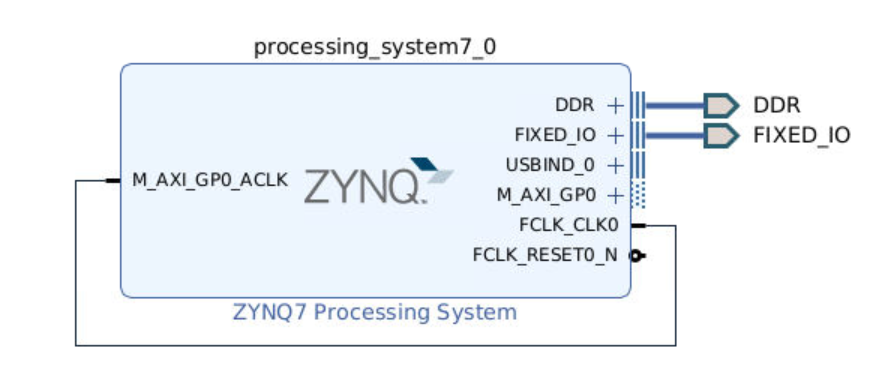</div>

* Right click `lab1` under the *Sources* window and choose `Add Module to Block Design`. In the Diagram window, you will see the *lab1_v1_0* module has been added to the block design, move the cursor to the *btn*, right click and choose *Make External*. Do the same thing on *led[3: 0]*. 

<div align=center>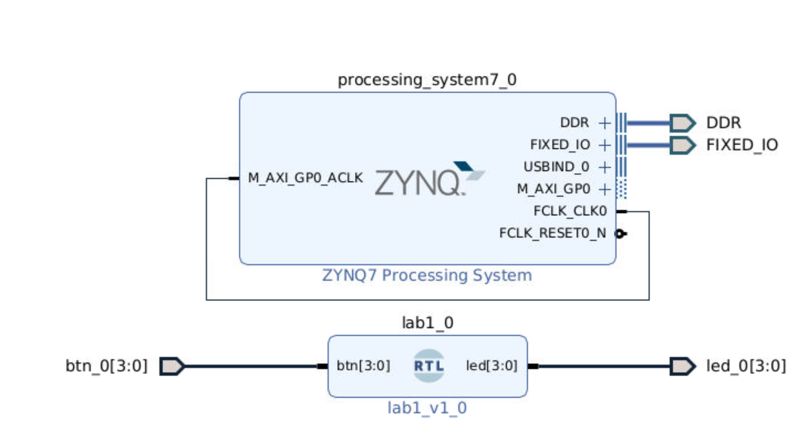</div>

* Right click in the blank *Diagram* region and choose *Validate Design*, then click *OK*.

* Right click `design_1` and choose *Create HDL wrapper*, then click *Set as top*.

* Expand the `design_1_wrapper` and double click `design_1(design_1.v)`. Check the port of this module and change the constraints file (Note that the PIN names are different from simulation files, e.g., btn is now btn_0).

```verilog
module design_1
   (DDR_addr,
    DDR_ba,
    DDR_cas_n,
    DDR_ck_n,
    DDR_ck_p,
    DDR_cke,
    DDR_cs_n,
    DDR_dm,
    DDR_dq,
    DDR_dqs_n,
    DDR_dqs_p,
    DDR_odt,
    DDR_ras_n,
    DDR_reset_n,
    DDR_we_n,
    FIXED_IO_ddr_vrn,
    FIXED_IO_ddr_vrp,
    FIXED_IO_mio,
    FIXED_IO_ps_clk,
    FIXED_IO_ps_porb,
    FIXED_IO_ps_srstb,
    btn_0,
    led_0);
```

```verilog
# PYNQ Pin Assignments
############################
# On-board Slide Buttons  #
############################
set_property -dict { PACKAGE_PIN D19   IOSTANDARD LVCMOS33 } [get_ports { btn_0[0] }];
set_property -dict { PACKAGE_PIN D20   IOSTANDARD LVCMOS33 } [get_ports { btn_0[1] }];
set_property -dict { PACKAGE_PIN L20   IOSTANDARD LVCMOS33 } [get_ports { btn_0[2] }];
set_property -dict { PACKAGE_PIN L19   IOSTANDARD LVCMOS33 } [get_ports { btn_0[3] }];

############################
# On-board leds             #
############################
set_property -dict { PACKAGE_PIN R14   IOSTANDARD LVCMOS33 } [get_ports { led_0[0] }];
set_property -dict { PACKAGE_PIN P14   IOSTANDARD LVCMOS33 } [get_ports { led_0[1] }];
set_property -dict { PACKAGE_PIN N16   IOSTANDARD LVCMOS33 } [get_ports { led_0[2] }];
set_property -dict { PACKAGE_PIN M14   IOSTANDARD LVCMOS33 } [get_ports { led_0[3] }];
```

* Click *Generate Bitstream* under *PROGRAM AND DEBUG*, then click *OK*.
  
If generate bitstream failed, please ensure the setting of the pins like below:

<div align=center>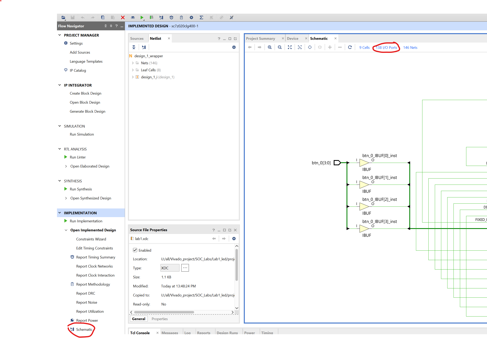</div>

Please check the pin assignments are the same as the below:

<div align=center>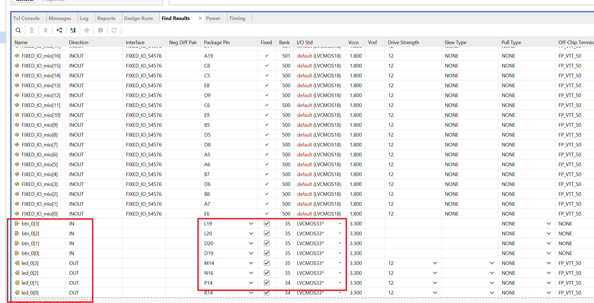</div>

This process will have generated a `design_1_wrapper.bit` file under the *project_1.runs > impl_1* directory.

* We need to download the `design_1_wrapper.bit` to local machine. Back to *dashboard-launch Palmetto Desktop*, click `Files` in the orange bar and choose `Home Directory`. Go to `Lab1/project_1/project_1.runs/impl_1` and download `design_1_wrapper.bit`.

### Verify Functionality

* Power pynq_z2 on

* Open a new tab and input 192.168.2.99

* Expand `New` and create a new folder. Click this *Untitled Folder* and rename it (i.e. Lab1).

* Double click *Lab1*, then click `Upload` and uplaod *design_1_wrapper.bit* file

* Expand `New` and choose `Python3 (ipykernel)`. 

* The example code to download the *bit* file.

* Then you can verify the function (Createa a Look Up Table based on the design to help with on-board verification). 

```python
    from pynq import Overlay
    from pynq import Bitstream
    bit = Bitstream("design_1_wrapper.bit")
    bit.download()
    bit.bitfile_name
```
<div align=center>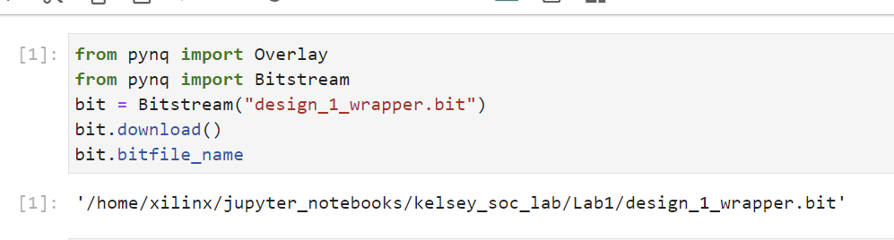</div>

## Conclusion

The Vivado software tool can be used to perform a complete HDL based design flow. The project was created using the supplied source files (HDL model and user constraint file). A behavioral simulation using the provided testbench was done to verify the model functionality. The model was then synthesized, implemented, and a bitstream was generated. The timing simulation was run on the implemented design using the same testbench. The functionality was verified in hardware using the generated bitstream.


