# Lab2_uart

The design consists of a uart receiver receiving the input typed on a keyboard (emulated in PS) and displaying the binary equivalent of the typed character on the 4 LEDs. When a push button is pressed, the lower and upper nibbles are XORed. The block diagram is as shown in the following figure.

<div align=center></div>

## Source code

-[source code](https://github.com/Xilinx/xup_fpga_vivado_flow/tree/main/source/pynq-z2/lab2)

## Steps

### Create a Vivado Project

* Same operations as Lab1. (Do it yourself this time!)

### Add source files 

* You should see a hierarchy like this in your Sources window.

<div align=center>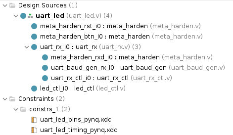</div>

### Add code

* Double-click on the `uart_led` entry to view its content. Notice in the Verilog code, the `BAUD_RATE` and `CLOCK_RATE` parameters are defined to be 115,200 and 125 MHz. Also, notice that the lower-level modules are instantiated. The `meta_harden` modules are used to synchronize the asynchronous reset and push-button inputs (Read the code!).

* Expand `uart_rx_i0` instance to see its hierarchy. This module used the baud rate generator (It generate a 16x Baud enable.) and a finite state machine. The `rxd_pin` is sampled at a rate that is 16x the baud rate.

* Because there are only 4 leds on PYNQ_Z2 board (The source code was oringally used for a differenct board.), so we need to change the code in three files: `led_ctl.v`, `uart_led.v` and `uart_led_pins_pynq.xdc`.

* The `uart_led_timing_pynq.xdc` file is not required for this project, as it causes a `setup timing problem`. This file was originally intended to demonstrate how to analyze timing problems, but it is not relevant for the LEDs, which do not need any timing constraints. However, if you are interested in learning more about timing analysis, you can refer to this:

[Document timing](https://docs.xilinx.com/r/en-US/ug949-vivado-design-methodology/Defining-Timing-Constraints-in-Four-Steps)


* Double click on `led_ctl.v`.

```verilog
module led_ctl(
    input clk_rx,
    input rst_clk_rx,
    input btn_clk_rx,
    input [7: 0] rx_data,
    input rx_data_rdy,
    output reg [3: 0] led_o
);

    reg old_rx_data_rdy;
    reg [7: 0] char_data;
    reg [3: 0] led_pipeline_reg;

    always @(posedge clk_rx)
    begin
        if (rst_clk_rx)
        begin
            old_rx_data_rdy <= 1'b0;
            char_data <= 8'b0;
            led_o <= 4'b0;
        end
        else
        begin
            old_rx_data_rdy <= rx_data_rdy;

            if (rx_data_rdy && !old_rx_data_rdy)
            begin
                char_data <= rx_data;
            end

            if (btn_clk_rx)
                led_pipeline_reg <= char_data[7: 4];
            else
                led_pipeline_reg <= char_data[3: 0];
        end
        led_o <= led_pipeline_reg;
    end
endmodule
```

* Double-click on `uart_led.v`

```verilog
module uart_led(
    input clk_pin,
    input rst_pin,
    input btn_pin,
    input rxd_pin,
    output [3:0] led_pins
);

    parameter BAUD_RATE = 115_200;
    parameter CLOCK_RATE = 125_000_000;

    wire rst_clk_rx;
    wire btn_clk_rx;
    wire [7: 0] rx_data;
    wire rx_data_rdy;
    
     meta_harden meta_harden_rst_i0 (
        .clk_dst      (clk_pin),
        .rst_dst      (1'b0),    // No reset on the hardener for reset!
        .signal_src   (rst_pin),
        .signal_dst   (rst_clk_rx)
      );

      meta_harden meta_harden_btn_i0 (
        .clk_dst      (clk_pin),
        .rst_dst      (rst_clk_rx),
        .signal_src   (btn_pin),
        .signal_dst   (btn_clk_rx)
      );

      uart_rx #(
        .CLOCK_RATE   (CLOCK_RATE),
        .BAUD_RATE    (BAUD_RATE)
      ) uart_rx_i0 (
        .clk_rx      (clk_pin),
        .rst_clk_rx  (rst_clk_rx),

        .rxd_i       (rxd_pin),
        .rxd_clk_rx  (),

        .rx_data_rdy (rx_data_rdy),
        .rx_data     (rx_data),
        .frm_err     ()
      );

      led_ctl led_ctl_i0 (
        .clk_rx      (clk_pin),
        .rst_clk_rx  (rst_clk_rx),
        .btn_clk_rx  (btn_clk_rx),
        .rx_data     (rx_data),
        .rx_data_rdy (rx_data_rdy),
        .led_o       (led_pins)
      );
endmodule
```
* You need to add this constraint file (`uart_led_pins_pynq.xdc`) to your project.

* Double click on `uart_led_pins_pynq.xdc`:

```verilog
# On-board led 
set_property PACKAGE_PIN M14 [get_ports {led_pins_0[3]}]
set_property IOSTANDARD LVCMOS33 [get_ports {led_pins_0[3]}]
set_property PACKAGE_PIN N16 [get_ports {led_pins_0[2]}]
set_property IOSTANDARD LVCMOS33 [get_ports {led_pins_0[2]}]
set_property PACKAGE_PIN P14 [get_ports {led_pins_0[1]}]
set_property IOSTANDARD LVCMOS33 [get_ports {led_pins_0[1]}]
set_property PACKAGE_PIN R14 [get_ports {led_pins_0[0]}]
set_property IOSTANDARD LVCMOS33 [get_ports {led_pins_0[0]}]
# Reset - BTN1
set_property PACKAGE_PIN L19 [get_ports btn_pin_0]
set_property IOSTANDARD LVCMOS33 [get_ports btn_pin_0]

# CLK source 125 MHz
create_clock -period 8.000 -name clk_pin_0 -waveform {0.000 4.000} [get_ports clk_pin]
set_property PACKAGE_PIN H16 [get_ports clk_pin]
set_property IOSTANDARD LVCMOS33 [get_ports clk_pin]
```
### Synthesize the Design

#### Synthesize the design with the Vivado synthesis tool and analyze the Project Summary output.

* Click on Run Synthesis under the Synthesis tasks of the Flow Navigator pane.

The synthesis process will be run on the `uart_led.v` and all its hierarchical files. When the process is completed a Synthesis Completed dialog box with three options will be displayed.

* Select the Open Synthesized Design option and click *OK* as we want to look at the synthesis output. Click *Yes* to close the elabrated design if the dialog box is displayed.

* Select the Project Summary tab. If you don’t see the Project Summary tab then select *Layout > Default Layout*.

* Click on the Table tab in the Project Summary tab.

<div align=center>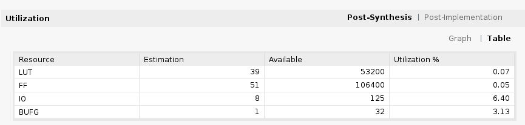</div>

* Click on Schematic under the Open Synthesized Design tasks of Synthesis tasks of the Flow Navigator pane to view the synthesized design in a schematic view.

<div align=center>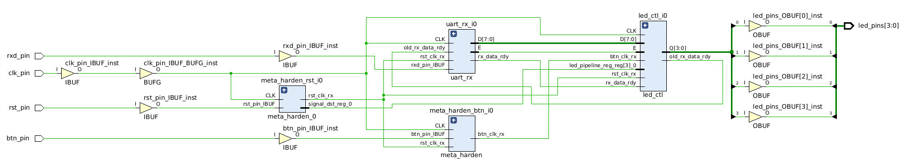</div>

Notice that IBUF and OBUF are automatically instantiated (added) to the design as the input and output are buffered. There are still four lower level modules instantiated.

* Double-click on the `uart_rx_i0` instance in the schematic view to see the underlying instances.

* Select the `uart_baud_gen_rx_i0` instance, right-click on it, and select Go To Source. Notice that the line instantiated `uart_rx_i0` is highlighted. Also notice that the `CLOCK_RATE` and `BAUD_RATE` parameters are passed to the module being called.

* Go back to the schematic, double-click on the `meta_harden_rxd_io` instance to see how the synchronization circuit is implemented using two FFs. This synchronization is necessary to reduce the likelihood of metastability.

#### Generate the utilization and power reports

* Click on Report Utilization under the Synthesized Design, and click *OK* to generate the utilization report.

<div align=center>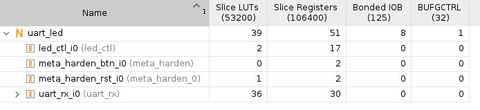</div>

* Select Slice LUTs entry in the left pane and see the utilization by lower-level instances. You can expand the instances in the right pane to see the complete hierarchy utilization.

<div align=center>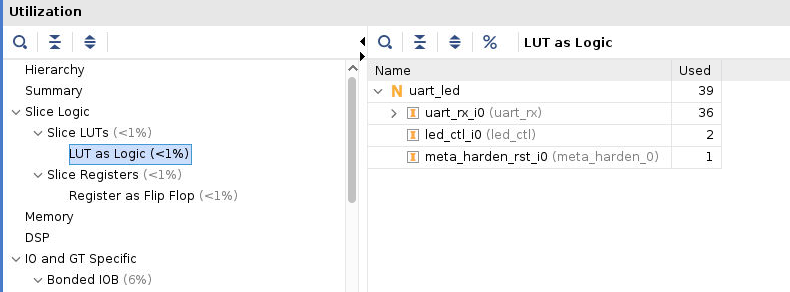</div>

* Click on Report Power under the Synthesized Design, and click *OK* to generate the estimated power consumption report using default values. Note that this is just an estimate as no simulation run data was provided and no accurate activity rate, or environment information was entered. 

<div align=center>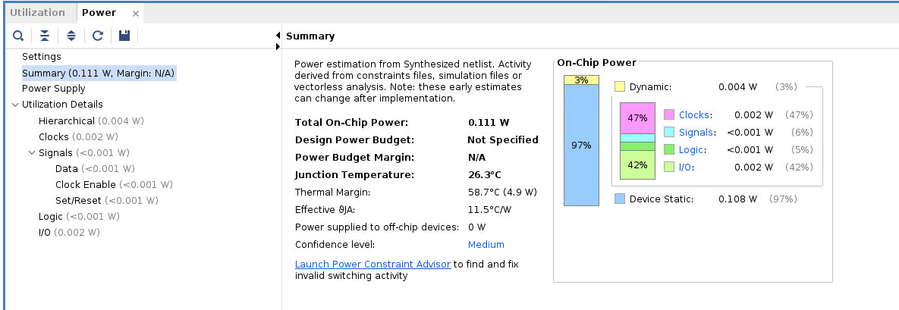</div>

#### Implement the Design

* Click *Create Block Design* under *IP INTEGRATOR*. Click *+ (Add IP)* and search *zynq*, add *ZYNQ7 Processing Syatem* into the block design.

* Create a wrapper on the block diagram and set it as the top file (Do it yourslef!).

<!--* In the `Sources` under *BlOCK DESIGN*, right click `uart_led` and choose *Add module to block design*.-->

* Right click on the blank part of Diagram, select *Add Module...*, select `uart_led` and click *OK*.

<div align=center>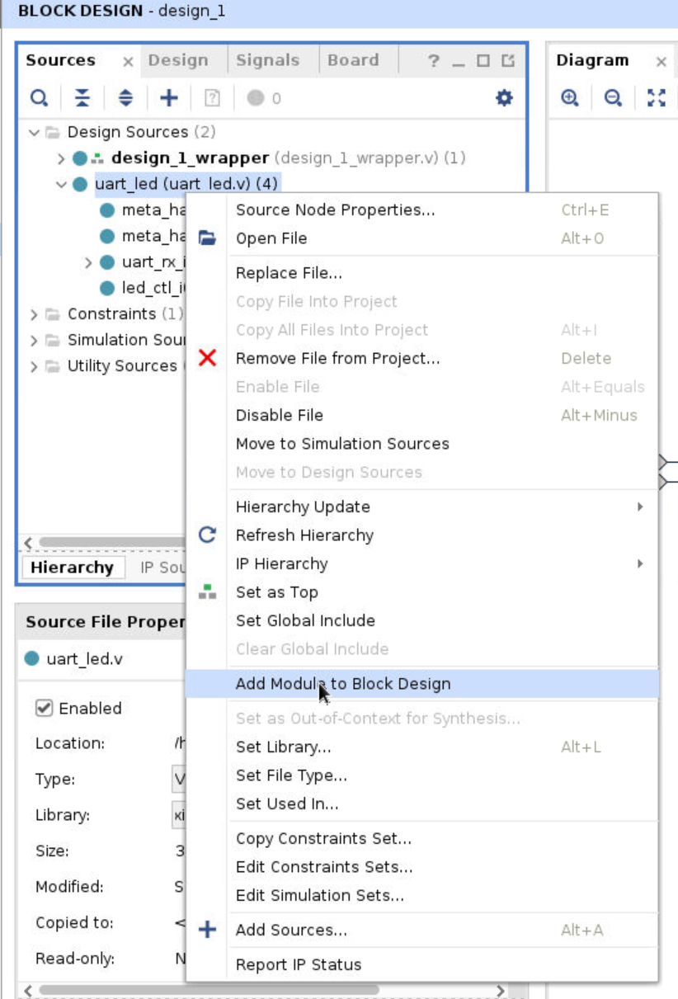</div>

* Back to *Diagram* window, add `axi uartlite` module. We want to send data to the uart_led module through its `rx` port. To do this, we will use the UART from PS side, which is connected to the ARM core by the AXI protocol. Then, we will connect the `tx` port of the UART on the PS side (`axi uartlite`) to the `uart_led` module in PL. Double-click on this module and configure it as shown in the subsequent figure. To prevent the `rx` port of `axi uartlite` from becoming floating, set the `rx` port to 1 (it is not needed for this project; ensure it remains in the IDLE state). We can disregard other ports, such as the interrupt of `axi uartlite`, since it's an output port.

<div align=center>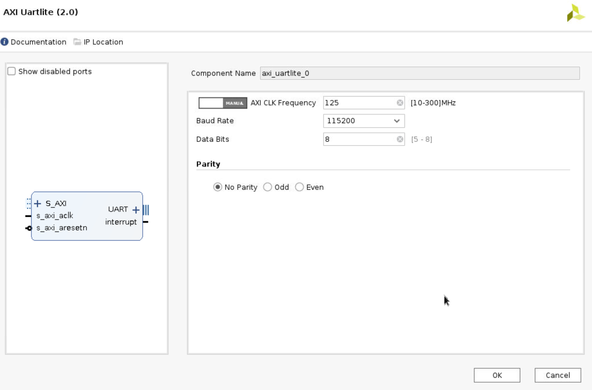</div>

* Now, let us create the system clock. Right click on the blank part and choose *Create port*. Set the port name to be *clk_pin_0*, set the *Type* as *Clock* and the *Frequency* as 125 MHz. And connect this port to `uart_led`'s `clk_pin` and `ZYNQ7 Processing System`'s `M_AXI_GP0_ACLK`. Remeber to connect the `clk_pin` to `ZYNQ7 Processing System`'s `M_AXI_GP0_ACLK` first and then connect the `uart_led`'s `clk_pin`.

<div align=center>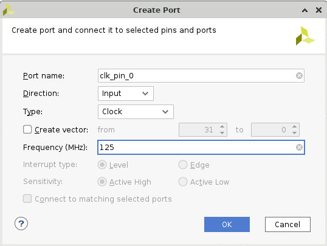</div>

* The `rst_pin` of `uart_led` module is active high. You will need to convert it to active low for uart_led module. So add `util_vector_logic` as a bridge that connect the `peripheral_areset` of `Processor System Reset`.

* Double click on `util_vector_logic` and set the `C_SIZE` as 1 and select the *not* operation.

<div align=center>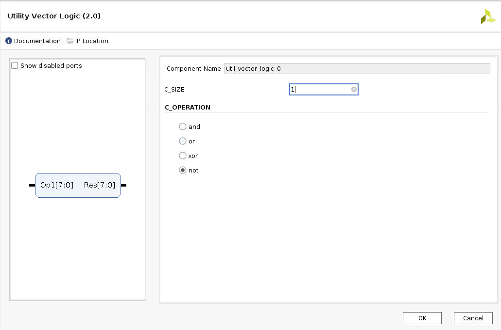</div>

* Expand `UART` in the `axi_uartlite` module, and connect `tx` to `rxd_pin` port of `uart_led` module. Connect `rx` to a constant module (add IP and set the value = 0; Figure it out yourself!).

* Click `Run Connection Automation` and `Run Block Automation`, keep in mind not to opt for UART (you do not want to use auto-connection for UART), then click *OK*. 

<div align=center>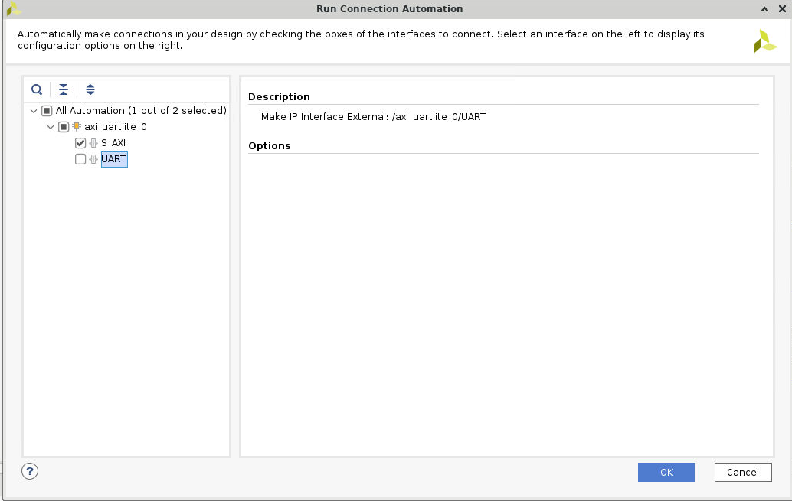</div>

* Right click `btn_pin` and `btn_pin`, select `make external`.

* The whole system diagram is shown in the following figure.

<div align=center>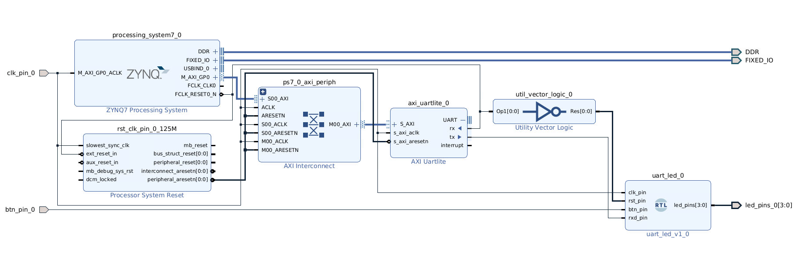</div>

* You need to ensure that the wrapper file is set as the top-level module of your project before generating the bitstream file. This is because Vivado only uses the top-level module to create the bitstream file, and ignores any other files in your project.

Right click on `design_1_wrapper` and choose Set to Top if it is not the top file yet.

* Continue with the remaining steps simliar to what we did in *Lab 1* (i.e., Check the port of this module and change the constraint file as needed).
   
* Remember to change the constraint file to match the names of the pins.

* Add this line `create_clock -period 8.000 -name clk_pin_0 -waveform {0.000 4.000} [get_ports clk_pin_0]` in the contraint file for the primary clock (125 MHz).

By click the `Schematic` under the `Open Implemented Design`, and you can check the pin assignments like below:

<div align=center>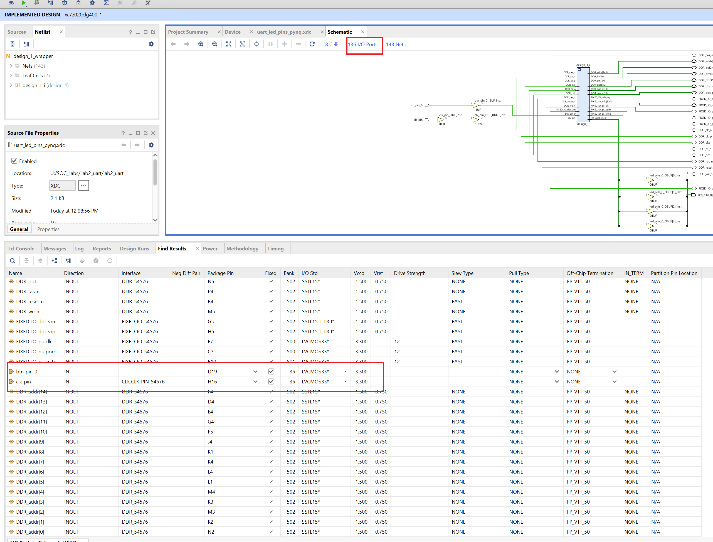</div>

And the pin assignments of led are below the page.

#### Generate the Bitstream

* Click *Generate Bitstream* under *PROGRAM AND DEBUG*

#### Verify the Functionality

* Download the `.bit` file and `.hwh` file to your local PC. If you cannot find these two files, open a new terminal and go the project path, then run the shell command:

```bash
find . -name *.bit
find . -name *.hwh
```

* Power *PYNQ* on

-[PYNQ code](https://github.com/parthpower/axi_uartlite_pynq/tree/master)

* Following the similar steps in the *Lab 1*. Upload `.bit` and `.hwh`, make sure that they have the same name (e.g., `design_1_wrapper.bit` and `design_1_wrapper.hwh`). Copy `uartlite.py` from the upper github source to the folder. Here, we need to fix the `write` function to fit our project.

```python
def write(self, buf, timeout = 10):
        """
        buf: iterable
        
        """
        stop_time = time() + timeout
        wr_count = 0
        for i in buf:
            #Wait while TX FIFO is Full, stop waiting if timeout passes 
            while (self.uart.read(STAT_REG) & 1<<TX_FULL) and (time()<stop_time):
                pass
            # Check timeout
            if time()>stop_time:
                break
            self.uart.write(TX_FIFO, i)
            wr_count += 1
        return wr_count
```


* Create a new `Python3`.

```python
from pynq import MMIO
from pynq import Overlay

import sys
sys.path.insert(1, './src')
from uartlite import *

ol = Overlay("design_1_wrapper.bit")
ol.download()

# Address of the ip core
# Address can be found in the .hwh file 
ADDRESS = 0x42c00000           
uart = UartAXI(ADDRESS)

# Setup AXI UART register
uart.setupCtrlReg()

# Loopback test
l = [0x42] #0100 0010
uart.write(l)
```

* Then you can observe the phenomenon that corresponds to the input.

According to the code in `led_ctl.v`,

```verilog
if (btn_clk_rx)
    led_pipeline_reg <= char_data[7:4];
else
    led_pipeline_reg <= char_data[3:0];
```

If you input 0xd3 and do not press the button, you should see.

<div align=center></div>

Else, if you press the button, you should see.

<div align=center></div>


