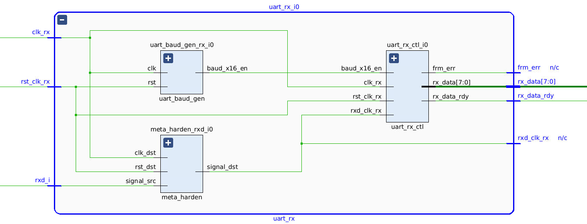
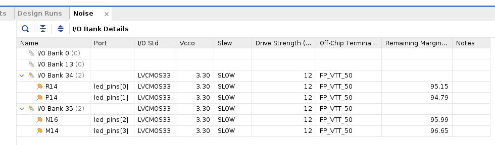
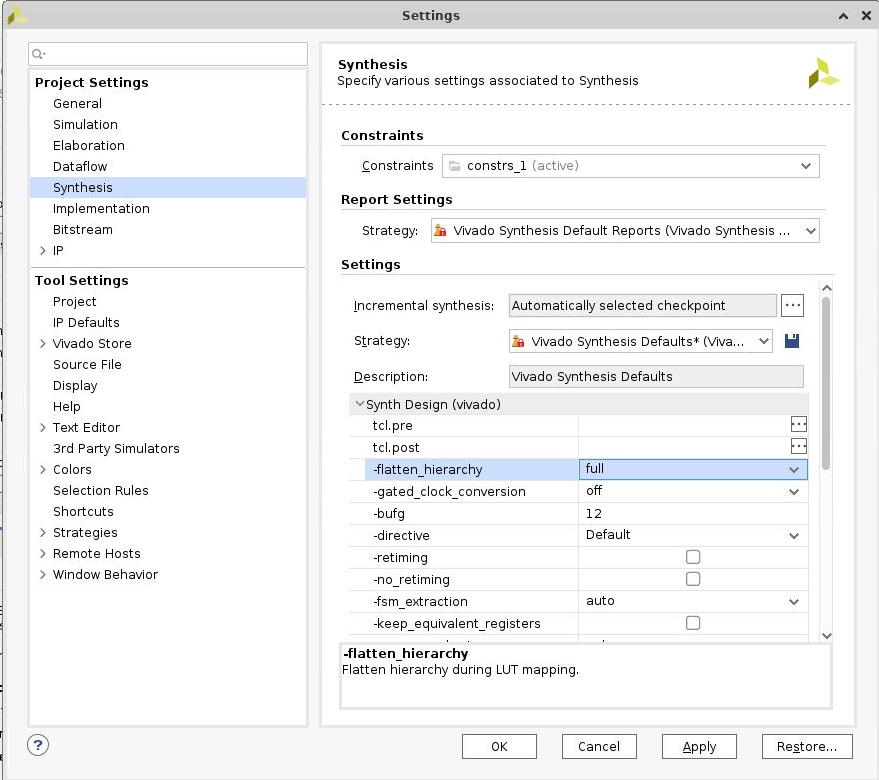
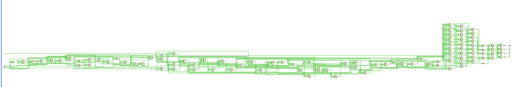

# Lab3 

In this lab you will use the IP Catalog to generate a clock resource. You will instantiate the generated clock core in the provided waveform generator design. You will also use IP Integrator to generate a FIFO core and then use it in the HDL design.

<div align=center></div>

## Objectives

After completing this lab, you will be able to:

* Include an IP in the project during the project creation.

* Use IP Catalog to generate a clocking core.

* Instantiate the generated core.

* Create a block design using IP Integrator.

* Instantiate the block design.

* Generate bitstream and verify the functionality in hardware.

## Design Description

The design used in this lab is a programmable waveform generator, also known as a signal generator.

The waveform generator in this design is intended to be a “standalone” device that is controlled via a PC (or other terminal device) using RS-232 serial communication. The design described here implements the RS-232 communication channel, the waveform generator and connection to the external DAC, and a simple parser to implement a small number of “commands” to control the waveform generation.

The wave generator implements a look-up table of 1024 samples of 16 bits each in a RAM. The wave generator also implements three variables:

* nsamp: The number of samples to use for the output waveform. Must be between 1 and 1024.

* prescale: The prescaler for the sample clock. Must be 32 or greater.

* speed: The speed (or rate) for the output samples in units of the prescaled clock.

The wave generator can be instructed to send the appropriate number of samples once, cycling from 0 to nsamp-1 once and then stopping, or continuously, where it continuously loops the nsamp samples. When enabled, either once or continuously, the wave generator will send one sample to the DAC every (prescale x speed) clk_tx clock cycles. The contents of the RAM, as well as the three variables, can be changed via commands sent over the RS-232 link, as can the mode of the wave
generator. The wave generator will generate responses for all commands.

There are three clock domains within this design: *clk_rx, clk_tx, and clk_samp*. The clock generator module instantiates all the clocking resources required for generating these three clocks. All three clocks are derived from a single clock input, coming in on clk_pin. The frequency of the clock input is 125MHz for PYNQ-Z2.

## For PYNQ-Z2

In this design we will use board’s USB-UART which is controlled by the Zynq’s ARM Cortex-A9 processor. Our PL design needs access to this USB-UART. So first thing we will do is to create a Processing System design which will put the USB-UART connections in a simple GPIO-style and make it available to the PL section.

The provided design places the UART (RX and TX) pins of the PS (processing system) on the Cortex-A9 in a simple GPIO mode to allow the UART to be connected (passed through) to the programmable logic. The processor samples the RX signal and sends it to the EMIO channel 0 which is connected to Rx input of the HDL module provided in the Static directory. Similarly, the design samples the Tx output of the HDL module through another EMIO channel 1 and sends it on the PS UART TX pin. This part has been integrated into a boot image BOOT.binlocated in the {SOURCES}/{BOARD}/lab4 folder. There will be no need for you to run the PS side configuration or software application.

## Steps

### Create a Vivado Project

* Same operations as Lab1.

### Add source files 

<div align=center></div>


Note: There is no lab4 code under PYNQ folder, we can use the code under boolean folder. However, we need to fix the code to meet the PYNQ board. For example, the clock frequency is 125 Mhz for PYNQ-Z2 and only 4 leds on the board.

### Generate and Instantiate Clock Generator Module

<div align=center></div>

You will see four components at the top-level, 2 instances of meta_harden, one instance of uart_rx, and one instance of led_ctl.

* To see where the uart_rx_i0 gets generated, right-click on the uart_rx_i0 instance and select Go To Source and see that line 84 in the source code is generating it.

* Double-click on the uart_rx_i0 instance in the schematic diagram to see the underlying components.

<div align=center></div>

* Click on Report Noise under the Open Elaborated Design entry of the RTL Analysis tasks of the Flow Navigator pane. Click Ok to generate the report named `ssn_1`. View the `ssn_1` report and observe the unplaced ports. 

<div align=center></div>

### Synthesize the Design

#### Synthesize the design with the Vivado synthesis tool and analyze the Project Summary output.

* Click on Run Synthesis under the Synthesis tasks of the Flow Navigator pane.

The synthesis process will be run on the uart_led.v and all its hierarchical files. When the process is completed a Synthesis Completed dialog box with three options will be displayed.

* Select the Open Synthesized Design option and click OK as we want to look at the synthesis output. Click Yes to close the elabrated design if the dialog box is displayed.

* Select the Project Summary tab. If you don’t see the Project Summary tab then select *Layout > Default Layout*.

* Click on the Table tab in the Project Summary tab.

<div align=center></div>

* Click on Schematic under the Open Synthesized Design tasks of Synthesis tasks of the Flow Navigator pane to view the synthesized design in a schematic view.

<div align=center></div>

Notice that IBUF and OBUF are automatically instantiated (added) to the design as the input and output are buffered. There are still four lower level modules instantiated.

* Double-click on the uart_rx_i0 instance in the schematic view to see the underlying instances.

* Select the uart_baud_gen_rx_i0 instance, right-click, and select Go To Source. Notice that the line instantiated uart_rx_i0 is highlighted. Also notice that the CLOCK_RATE and BAUD_RATE parameters are passed to the module being called.

* Go back to the schematic, double-click on the meta_harden_rxd_io instance to see how the synchronization circuit is implemented using two FFs. This synchronization is necessary to reduce the likelihood of metastability.

#### Generate the utilization and power reports

* Click Report Utilization under the Synthesized Design, and click OK to generate the utilization report.

<div align=center></div>

* Select Slice LUTs entry in the left pane and see the utilization by lower-level instances. You can expand the instances in the right pane to see the complete hierarchy utilization.

<div align=center></div>

* Click Report Power under the Synthesized Design, and click OK to generate the estimated power consumption report using default values. Note that this is just an estimate as no simulation run data was provided and no accurate activity rate, or environment information was entered. 

<div align=center></div>

#### Write the checkpoint in order to analyze the results without going through the actual synthesis process.

* Select *File > Checkpoint > Write* to save the processed design so it can be opened later for further analysis. A dialog box will appear showing the default name of the file in the current project directory.Click *OK*.

#### Change the synthesis settings to flatten the design. Re-synthesize the design and analyze the results.

* Click on the Settings under the Project Manager, and select Synthesis. Click on the flatten_hierarchy drop-down button and select full to flatten the design. Click OK. A Create New Run dialog box will appear asking you whether you want to create a new run since the settings have been changed.

<div align=center></div>

Change the name from synth_1_copy_1 to synth_flatten and click OK. Click Run Synthesis to synthesize the design. Click OK to open the synthesized design when synthesis process is completed. Click on Schematic under the Open Synthesized Design tasks of Synthesis tasks of the Flow Navigator pane to view the synthesized design in a schematic view. Notice that the design is completely flattened. Click on Report Utilization and observe that the hierarchical utilization is no longer available. Also note that the number of Slice Registers is 38.

<div align=center></div>

#### Write the checkpoint in order to analyze the results without going through the actual synthesis process.

Select File > Checkpoint > Write to save the processed design so it can be opened later for further analysis. A dialog box will appear showing the default name of the file in the current project directory.Click OK.

### Read the Checkpoints: Read the previously saved checkpoint (checkpoint_1) in order to analyze the results without going through the actual synthesis process.

* Launch Vivado and select *File > Checkpoint > Open ** at the *Getting Started Screen. Browse to {TUTORIAL}/lab2 and select uart_led.dcp or system_wrapper.dcp. Click OK.

* If the schematic isn’t open by default, in the netlist tab, select the top-level instance, uart_led/system_wrapper, right-click and select Schematic. You will see the hierarchical blocks. You can double-click on any of the first-level block and see the underlying blocks. You can also select any lower-level block in the netlist tab, right-click and select Schematic to see the corresponding level design.

* In the netlist tab, select the top-level instance, uart_led, right-click and select Show Hierarchy. You will see how the blocks are hierarchically connected.

* Select Reports > Timing > Report Timing Summary and click OK to see the report you saw previously.

* Select Reports > Report Utilization and click OK to see the utilization report you saw previously.

* Select File > Open Checkpoint, browse to {TUTORIAL}/lab2 and select uart_led.dcp or system_wrapper.dcp.

* Click No to keep the Checkpoint_1 open. This will invoke second Vivado GUI.

* If the schematic isn’t open by default, in the netlist tab, select the top-level instance, uart_led, right-click and select Schematic. You will see the flattened design. You can generate the desired reports on this checkpoint as you wish. Close the Vivado program by selecting File > Exit and click OK.

### Continues with the previous lab

#### Open a Vivado Project

1. Start the Vivado, if necessary, and open either the lab2 project (lab2.xpr) you created in the previous lab or the lab2 project in the labsolution directory using the Open Project link in the Getting Started page.

2. Select *File > Project > Save As …* to open the Save Project As dialog box. Enter *lab3* as the project name. Make sure that the Create Project Subdirectory option is checked, the project directory path is {TUTORIAL} and click OK.

3. Click on the Settings in the Flow Navigator pane, select Project Settings > Synthesis.

4. Make sure that the flatten_hierarchy is set to rebuilt, which allows the design hierarchy to be preserved for synthesis, and then rebuilt which is more useful for design analysis because many logical references will be maintained.

5. Click OK.

A Create New Run dialog box will appear asking you if a new run should be created. Click Yes and then OK to create the new run with synth_2 name.

<div align=center></div>

#### Implement the Design

* Click *Create Block Design* under *IP INTEGRATOR*. Click *+ (Add IP)* and search *zynq*, add *ZYNQ7 Processing Syatem* into the block design.

* In the `Sources` under *BlOCK DESIGN*, right click `uart_led` and choose *Add module to block design*.

* Back to *Diagram* window, add `axi uartlite` module.

* Right click and choose *Create port*. Set the port name to be *clk_pin_0*, set the *Type* as *Clock* and the *Frequency* as 125 MHz. And connect this port to `uart_led's clk_pin` and `ZYNQ7 Processing System's M_AXI_GP0_ACLK`.

<div align=center></div>

* The `rst_pin` of `uart_led` module is active high. So add `util_vector_logic` as a bridge that connect the `FCLK_RESET0_N` of `ZYNQ7 Processing System` and `rst_pin` of `uart_led` together.

Double click `util_vector_logic` and set the `C_SIZE` as 1 and select the *not* operation.

<div align=center></div>

* Expand `UART` in the `axi_uartlite` module, and connect `tx` to `rxd_pin` port of `uart_led` module. Connect `rx` to the `FCLK_RESET0_N` of `ZYNQ7 Processing System`.

* Click `Run Connection Automation` and `Run Block Automation`, remember that don't choose UART, then click *OK*.

<div align=center></div>

* The whole system diagram is shown in the following figure.

<div align=center></div>

* Following the left steps in the Lab1.

#### Generate the Bitstream

* Click *Generate Bitstream* under *PROGRAM AND DEBUG*

#### Verify the Functionality

1. Download the `.bit` file and `.hwh` file to your local PC. If you cannot find these two files, open a new terminal and go the project path, then run the shell command:

```bash
find . -name *.bit
find . -name *.hwh
```

2. Power *PYNQ* on

-[PYNQ code](https://github.com/parthpower/axi_uartlite_pynq/tree/master)

3. Following the similar step in the Lab1. Upload `.bit` and `.hwh`, make sure they are the same name. Copy `uartlite.py` from the upper github source to the folder. Here, we need to fix the `write function` to fit our project.

```python
def write(self, buf, timeout = 10):
        """
        buf: iterable
        
        """
        stop_time = time() + timeout
        wr_count = 0
        for i in buf:
            #Wait while TX FIFO is Full, stop waiting if timeout passes 
            while (self.uart.read(STAT_REG) & 1<<TX_FULL) and (time()<stop_time):
                pass
            # Check timeout
            if time()>stop_time:
                break
            self.uart.write(TX_FIFO, i)
            wr_count += 1
        return wr_count   
```

4. Create a new `Python3`.

```python
from pynq import MMIO
from pynq import Overlay

import sys
sys.path.insert(1, './src')
from uartlite import *

ol = Overlay("design_1_wrapper.bit")
ol.download()

# Address of the ip core
# Address can be found in the .hwh file 
ADDRESS = 0x42c00000           
uart = UartAXI(ADDRESS)

# Setup AXI UART register
uart.setupCtrlReg()

# Loopback test
l = [0xd3]
uart.write(l)
```

5. Then you can see the phenomenon that correspond to the input. 
