# Lab4_ILA 

## Introduction

In this lab you will use the uart_led design that was introduced in the previous labs. You will use *Mark Debug* feature and also the available *Integrated Logic Analyzer (ILA)* core (in IP Catalog) to debug the hardware.

## Objectives

After completing this lab, you will be able to:

* Use the *Integrated Logic Analyzer (ILA) core* from the IP Catalog as a debugging tool.

* Use *Mark Debug* feature of Vivado to debug a design.

* Use hardware debugger to debug a design.

## Design Description

Quick recap: The design consists of a uart receiver receiving the input typed on a keyboard and displaying the binary equivalent of the typed character on the LEDs. When a push button is pressed, the lower and upper nibbles are swapped.

## Steps

### Step 1 Create a new project and add source

Please copy the whole `Lab2` project and re-name it as `Lab4`:

### Step 2 Add the ILA Core

* Click *Open Block Design* under *IP INTEGRATOR*.

* Choose the Port you want to debug. If you can't find the port in the existing diagram, we can add two outputs to the top file to connect the internal signal out. For example, to check the waveform of `rx_data_rdy` and `rx_data`, but it is not available in the block design. Then we can go back to the `uart_led.v`, and change it like the following:

```verilog
    module uart_led (
      // Write side inputs
      input            clk_pin,      // Clock input (from pin)
      input            rst_pin,      // Active HIGH reset (from pin)
      input            btn_pin,      // Button to swap high and low bits
      input            rxd_pin,      // RS232 RXD pin - directly from pin
      output     [3:0] led_pins,      // 8 LED outputs
      output             rx_data_rdy,  // Data ready output of uart_rx
      output [7:0]       rx_data      // Data output of uart_rx
    );
```

* Back to *Diagram* window, select `uart_led_0` module, and right click *Refresh module*, then you can see the port. Select one port (like `rx_data_rdy`), right-click it and choose *Debug*.

* Similar operation to the other port.

* Click *Run connection Automation* and choose all. 

<div align=center>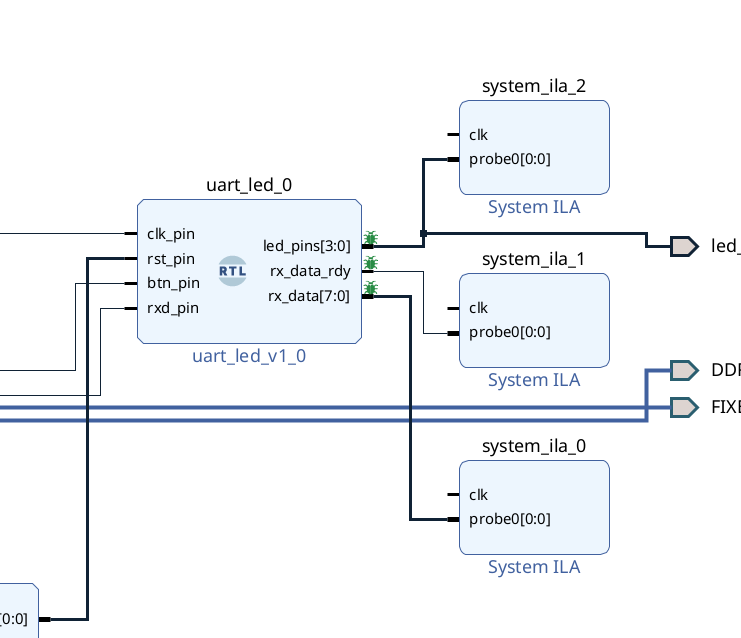</div>

* If you want to combine two ports into one ILA, we can delete one (for example, `system_ila_0`) and double click (i.e. `system_ila_1`). And set the *Number of Probes* as 2.

<div align=center>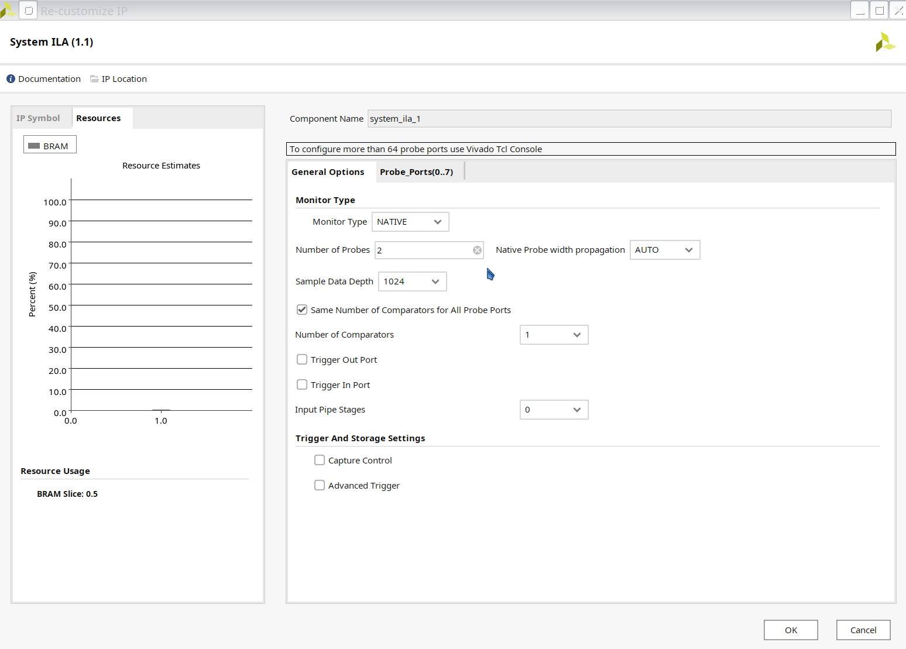</div>

* We need to connect the `clk` of ilas by ourselves. We can connect them to the `clk_pin_0`. Just make sure that the clk signal is the synchronized.

<div align=center>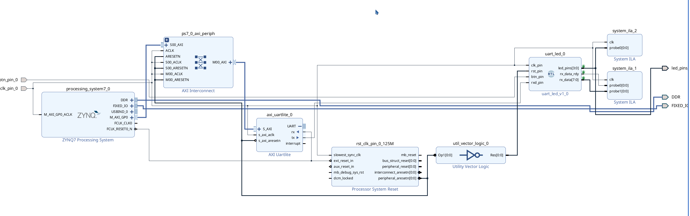</div>

### Step 3 Run synthesis, implementation and generate a bitstream

* Click *PROGRAM AND DEBUG --> Open Hardware Manager --> Open Target*

* Choose `Auto connect`. Remember to turn on the PYNQ board and connect its USB cable to the computer.

* Select `Program Device` and download the bitstream file to the board.

<div align=center>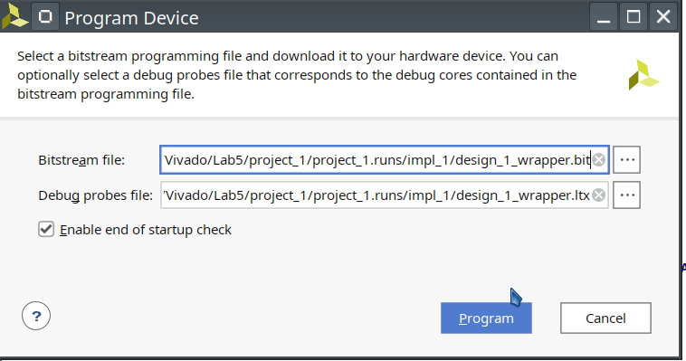</div>

* The programming bit file be downloaded and the DONE light will be turned ON indicating the FPGA has been programmed. *Debug Probes* window will also be opened, if not, then select *Window > Debug Probes*. In the Hardware window in Vivado notice that there are two debug cores, `hw_ila_1` and `hw_ila_2`. The hardware session status window also opens showing that the FPGA is programmed having two ILA cores with the idle state.

<div align=center>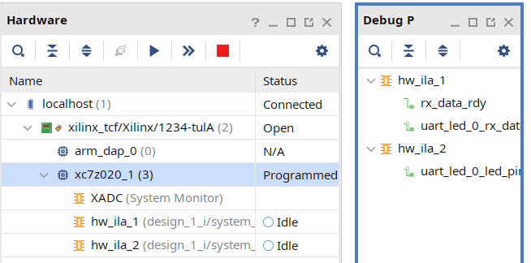</div>

* Select the target `FPGA xc7z020_1`, and click on the *Run Trigger Immediate* button to see the signals in the waveform window. Two waveform windows will be created, one for each ILA; one ILA window is for the instantiated ILA core and another for the *MARK DEBUG* method.

<div align=center>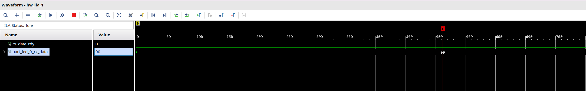</div>

### Setup trigger conditions to trigger on a write to led port (rx_data_rdy_out=1) and the trigger position to 512. Arm the trigger.

* In the *Trigger Setup* window, click *Add Probes* and select the `rx_data_rdy`.

<div align=center>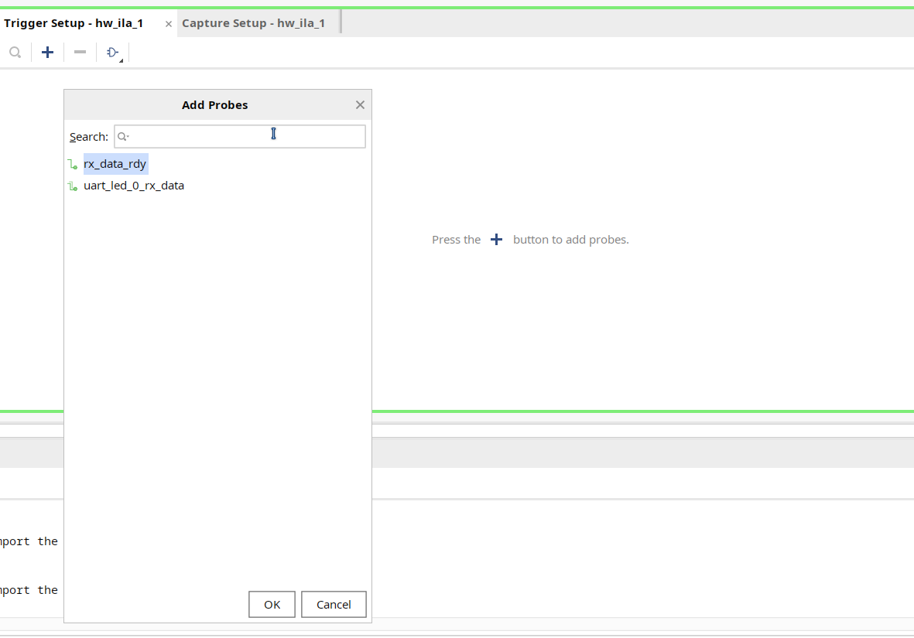</div>

* Set the compare value (== [B] X) and change the value from x to 1. Click OK.

<div align=center>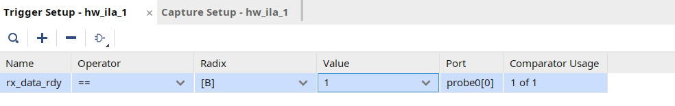</div>

* Set the trigger position of the `hw_ila_1` to 512.

<div align=center>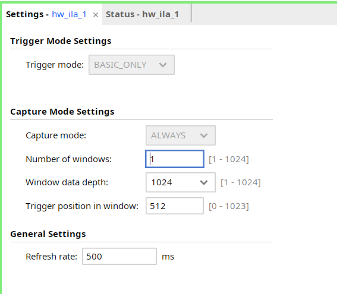</div>

* Similarly, set the trigger position of the `hw_ila_2` to 512.

* Select the `hw_ila_1` in the Hardware window and then click on the *Run Trigger* button. Observe that the `hw_ila_1` core is armed and showing the status as *Waiting for Trigger*.

<div align=center>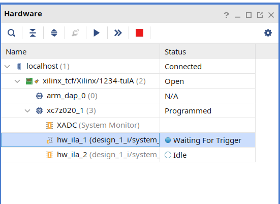</div>

* Open a new jupyter notebook, run the below code and observe that the `hw_ila_1` status changes from capturing to idle.

```python
from pynq import MMIO
from pynq import Overlay

import sys
sys.path.insert(1, './src')
from uartlite import *

ol = Overlay("design_1.bit")
ol.download()

# Address of the ip core
# Address can be found in the .hwh file 
ADDRESS = 0x42c00000           
uart = UartAXI(ADDRESS)

# Setup AXI UART register
uart.setupCtrlReg()


# Loopback test
while True:
    l = [0xd3] 
    uart.write(l)
```
* But maybe we can not see the waveform, we can ```Program Device``` like below.

<div align=center>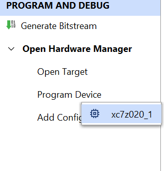</div>

Then we can click on the *Run Trigger* button, we can observe the rx_data_rdy_out became 1 like below:

<div align=center>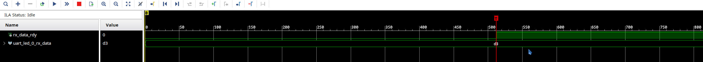</div>

### If you want to see more information about UART, please do the following

* You can pull `baud_x16_en`,  `over_sample_cnt_done` and `rx_begin` out and set them as a trigger. The enable signal is to flag the start state. We can add one code in the `uart_rx_ctl` file. Don't forget to debug `tx` port. 

* Here we need to fix three files, `uart_rx_ctl.v`, `uart_rx.v` and `uart_led.v`.

In the `uart_rx_ctl.v` file, please add the following code and connect `rx_begin` and `over_sample_cnt_done` out. To do this operation, please follow the previous description.

```verilog
assign rx_begin = (state != IDLE);
```

In the `uart_rx.v` file. 

```verilog
module uart_rx (
    // Write side inputs
    input            clk_rx,       // Clock input
    input            rst_clk_rx,   // Active HIGH reset - synchronous to clk_rx

    input            rxd_i,        // RS232 RXD pin - Directly from pad
    output           rxd_clk_rx,   // RXD pin after synchronization to clk_rx

    output     [7:0] rx_data,      // 8 bit data output
    //  - valid when rx_data_rdy is asserted
    output           rx_data_rdy,  // Ready signal for rx_data
    output           frm_err,       // The STOP bit was not detected
    output             baud_x16_en,  // 1-in-N enable for uart_rx_ctl FFs
    output           over_sample_cnt_done,
    output rx_begin
);
/* */
uart_rx_ctl uart_rx_ctl_i0 (
    .clk_rx      (clk_rx),
    .rst_clk_rx  (rst_clk_rx),
    .baud_x16_en (baud_x16_en),

    .rxd_clk_rx  (rxd_clk_rx),

    .rx_data_rdy (rx_data_rdy),
    .rx_data     (rx_data),
    .frm_err     (frm_err),
    .over_sample_cnt_done (over_sample_cnt_done),
    .rx_begin (rx_begin)
);
```

In the `uart_led.v` file,

```verilog
module uart_led (
  // Write side inputs
  input            clk_pin,      // Clock input (from pin)
  input            rst_pin,      // Active HIGH reset (from pin)
  input            btn_pin,      // Button to swap high and low bits
  input            rxd_pin,      // RS232 RXD pin - directly from pin
  output     [3:0] led_pins,      // 8 LED outputs
  output             rx_data_rdy,  // Data ready output of uart_rx
  output [7:0]       rx_data,      // Data output of uart_rx
  output baud_x16_en,
  output over_sample_cnt_done,
  output rx_begin
);
/* */
  uart_rx #(
    .CLOCK_RATE   (CLOCK_RATE),
    .BAUD_RATE    (BAUD_RATE) 
  ) uart_rx_i0 (
    .clk_rx      (clk_pin),
    .rst_clk_rx  (rst_clk_rx),

    .rxd_i       (rxd_pin),
    .rxd_clk_rx  (),
    
    .rx_data_rdy (rx_data_rdy),
    .rx_data     (rx_data),
    .frm_err     (),
    .baud_x16_en (baud_x16_en),
    .over_sample_cnt_done (over_sample_cnt_done),
    .rx_begin (rx_begin)
  );
```

<div align=center>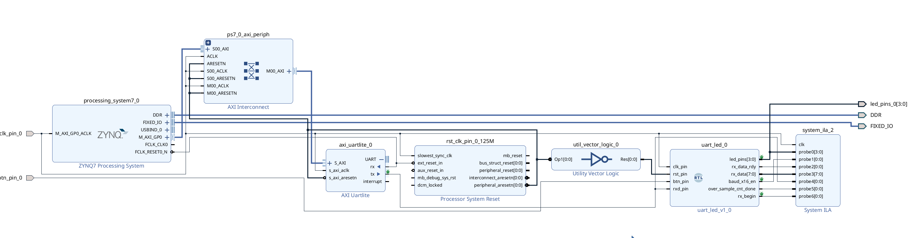</div>

* Generate the bitstream and load it to the board.

* Set up the trigger.

<div align=center>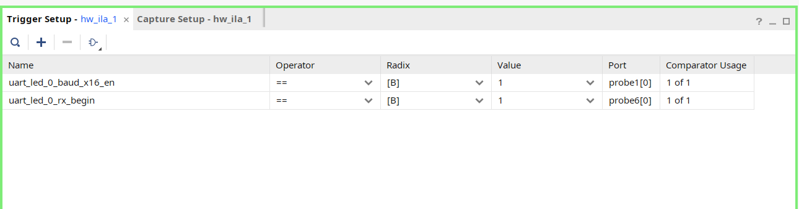</div>

* Set the *Number of windows* as 512

<div align=center>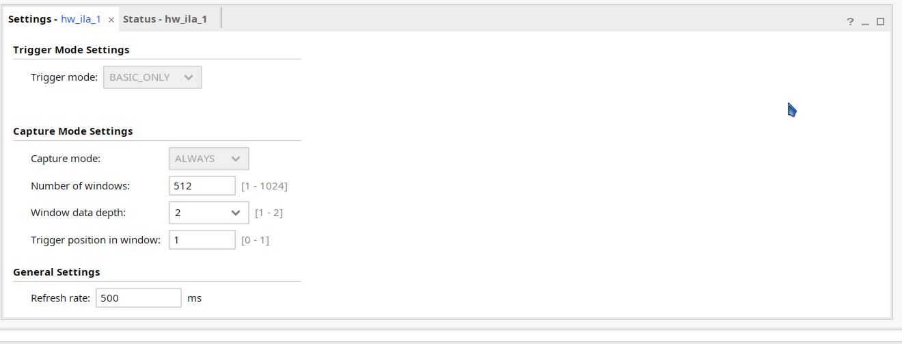</div>

* In the jupyter notebook

```python
while True:
    l = [0xA5] #A5 is easier to be recognized
    uart.write(l)
```

* Back to the waveform window,  you will see in the following first figure. For `axi_uartlite_0_tx`, between the *blue marker* and the *yellow marker*, it has complete data. You will see that after 16 triggers, it starts to transmit the data and every bit occupies 16 triggers.

* In the following second figure, for the `rx` signal, we can see `uart_led_0_over_sample_cnt_done`, it will first count 1/2 bit period, then begin to read the data.

<div align=center>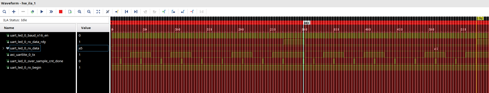</div>

<div align=center>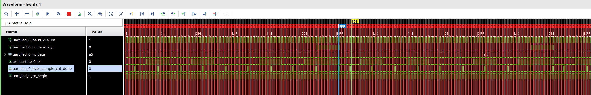</div>
