# Lab5_IPI 

In this lab you will use the *IP Catalog* to generate a clock resource. You will instantiate the generated clock core in the provided waveform generator design. You will also use *IP Integrator* to generate a FIFO core and then use it in the HDL design.

<div align=center></div>

## Objectives

After completing this lab, you will be able to:

* Include an IP in the project during the project creation.

* Use *IP Catalog* to generate a clocking core.

* Create a block design using *IP Integrator*.

* Create and package your custom IP 

## Design Description

The design used in this lab is a programmable waveform generator, also known as a signal generator.

The waveform generator in this design is intended to be a “standalone” device that is controlled via a PC (or other terminal device) using RS-232 serial communication. The design described here implements the RS-232 communication channel, the waveform generator and connection to the external DAC, and a simple parser to implement a small number of “commands” to control the waveform generation.

The wave generator implements a look-up table (LUT) of 1024 samples of 16 bits each in a RAM. The wave generator also implements three variables:

* `nsamp`: The number of samples to use for the output waveform. Must be between 1 and 1024.

* `prescale`: The prescaler for the sample clock. Must be 32 or greater.

* `speed`: The speed (or rate) for the output samples in units of the prescaled clock.

The wave generator can be instructed to send the appropriate number of samples once, cycling from 0 to `nsamp`-1 once and then stopping, or continuously, where it continuously loops the `nsamp` samples. When enabled, either once or continuously, the wave generator will send one sample to the DAC every (`prescale` x `speed`) `clk_tx` clock cycles. The contents of the RAM, as well as the three variables, can be changed via commands sent over the RS-232 link, as can the mode of the wave generator. The wave generator will generate responses for all commands.

There are three clock domains within this design: `clk_rx`, `clk_tx`, and `clk_samp`. The clock generator module instantiates all the clocking resources required for generating these three clocks. All three clocks are derived from a single clock input, coming in on `clk_pin`. The frequency of the clock input is 125 MHz for PYNQ-Z2.

## For PYNQ-Z2

In this design we will use board’s USB-UART which is controlled by the Zynq’s ARM Cortex-A9 processor (PS). Our PL design needs access to this USB-UART. So first thing we will do is to create a PS design which will put the USB-UART connections in a simple GPIO-style and make it available to the PL section.

The provided design places the UART (`rx` and `tx`) pins of the PS (processing system) on the Cortex-A9 in a simple GPIO mode to allow the UART to be connected (passed through) to the programmable logic. The processor samples the `rx` signal and sends it to the EMIO channel 0 which is connected to `rx` input of the HDL module provided in the *Static directory*. Similarly, the design samples the `tx` output of the HDL module through another EMIO channel 1 and sends it on the PS UART `tx` pin.

## Steps

### Create a Vivado Project

* Same operations as Lab2.

### Add source files 

-[source code](https://github.com/Xilinx/xup_fpga_vivado_flow/tree/main/source/boolean/lab4)

Because we only have the source code working on the boolean board, so we must fix the code to match the pynq board. For example, the clock frequency of boolean is 100 Mhz but the system clock frequency of pynq is 125 Mhz. You will need to read the code and fix the issues yourself this time (similar to what we did before). Meanwhile, the different constraints for the ports need to apply. In some files, the code shows that `include "clogb2.txt"`, which will cause some errors. Therefore, we need to copy the `clogb2.txt` content to the `.v` files, replacing the `include` part in the code.

### Generate and Instantiate Clock Generator Module

Launch the clocking wizard from the *IP Catalog* of Vivado and generate the clock core with an input frequency of 125.00 MHz and two output clocks of 50.000 MHZ each.

* Click on *IP Catalog* in the *Flow Navigator* pane. The *IP Catalog* will open in the auxiliary pane.

* Expand *FPGA Features and Design > Clocking* and double-click on the *Clocking Wizard* entry.

<div align=center>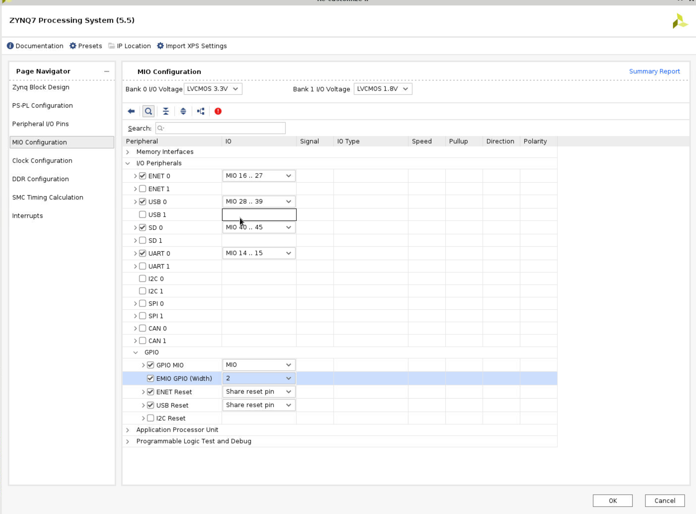</div>

* Click *Customize IP* on the following *Add IP* window. The clocking wizard will open.

* Make sure that the Primary input clock frequency is 125.000 MHz and the primitive used is MMCM.

<div align=center>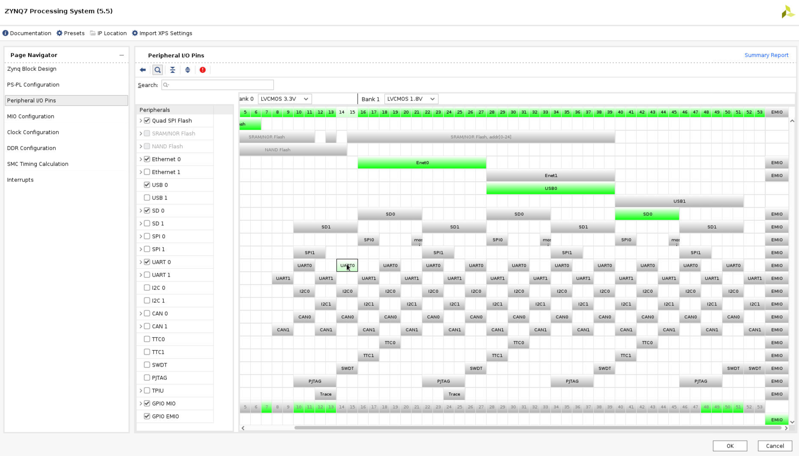</div>

* Select the Output Clocks tab. Click on the check box to enable the second clock output. Make sure that the requested output frequency is 50 MHz for both clocks.

<div align=center>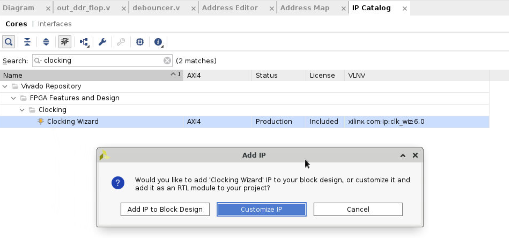</div>

* Click on the Summary tab and check the information.

<div align=center>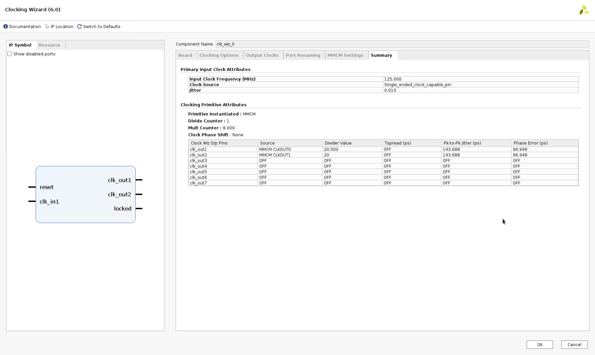</div>

* Click OK to see the Generate Output Products form.

* Click on Generate to generate the output products including the instantiation template. Click OK to proceed.

#### Instantiate the generated clock core.

* Select the IP Sources tab in the Sources pane.

* Expand the IP branch. Notice the two IP entries: the char_fifo IP and the clk_core. They are what you need to generate.

* Expand *clk_wiz_0 > Instantiation Template* and double-click on clk_core.veo to see the instantiation template.

* Copy lines 72 through 82 and paste them to the clk_gen.v file.

* Change the instance name and net names to as shown in the figure below to match the names of existing signals in the design.

```verilog
    clk_wiz_0 clk_wiz_i0
       (
        // Clock out ports
        .clk_out1(clk_rx),     // output clk_out1
        .clk_out2(clk_tx),     // output clk_out2
        // Status and control signals
        .reset(rst_i), // input reset
        .locked(clock_locked),       // output locked
       // Clock in ports
        .clk_in1(clk_pin)      // input clk_in1
    );
```

* Save `clk_gen.v`.

* Select the Hierarchy tab, expand *wave_gen > clk_gen_i0 hierarchy* and verify that clk_core.xci is in the hierarchy. The IP has a bordered yellow square icon next to it.

<div align=center>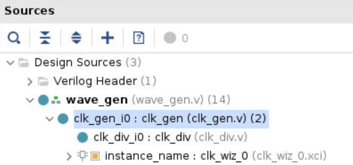</div>

#### Generate and Instantiate an IPI Block

* Double-click on the wave_gen.v to open it in the editor window.

* Comment out line comments on the instantiation of the char_fifo from the file around line 336.

<div align=center></div>

* Select *File > Save File*.

* Click `IP Catalog` and search `fifo generator`.

<div align=center>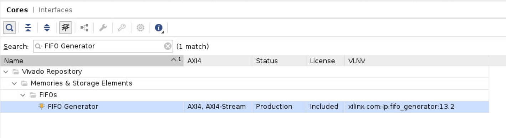</div>

*Double click FIFO Generator*:

* deselect show disabled port. Make sure that the default Native option is selected for the interface type. Select Independent Clocks Block RAM from the Fifo Implementation drop-down list.

<div align=center>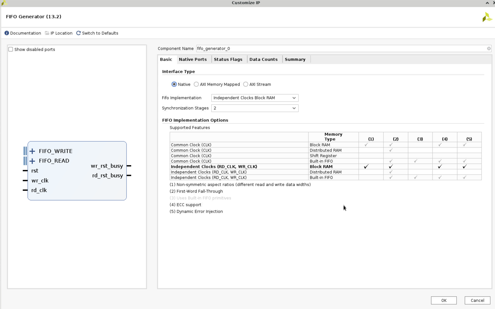</div>

* Select the Native Ports tab. From the Native Ports tab, you can configure the read mode, built-in FIFO options, data port parameters, and implementation options. Select First Word Fall Through as the read mode. Set the write width to be 8 bits. Click in the Read Width field to see it automatically to match the write width. Deselect the Enable Safety Circuit option. 

<div align=center>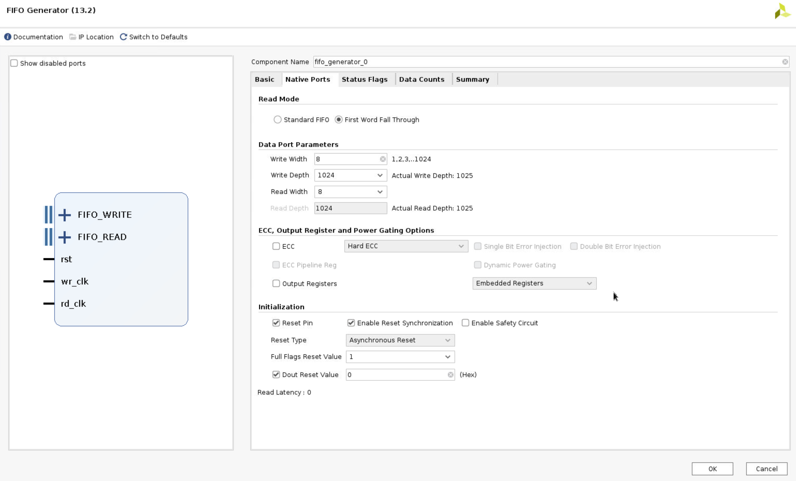</div>

* Browse through the settings of the Status Flags and Data Counts tabs. These tabs configure other options for the FIFO Generator. For this design, leave everything at their default settings. Select the Summary tab. This tab displays a summary of all the selected configuration options, as well as listing resources used for this configuration. Verify that the information is correct. For this configuration, you are using one 18K block RAM. Click OK.

<div align=center>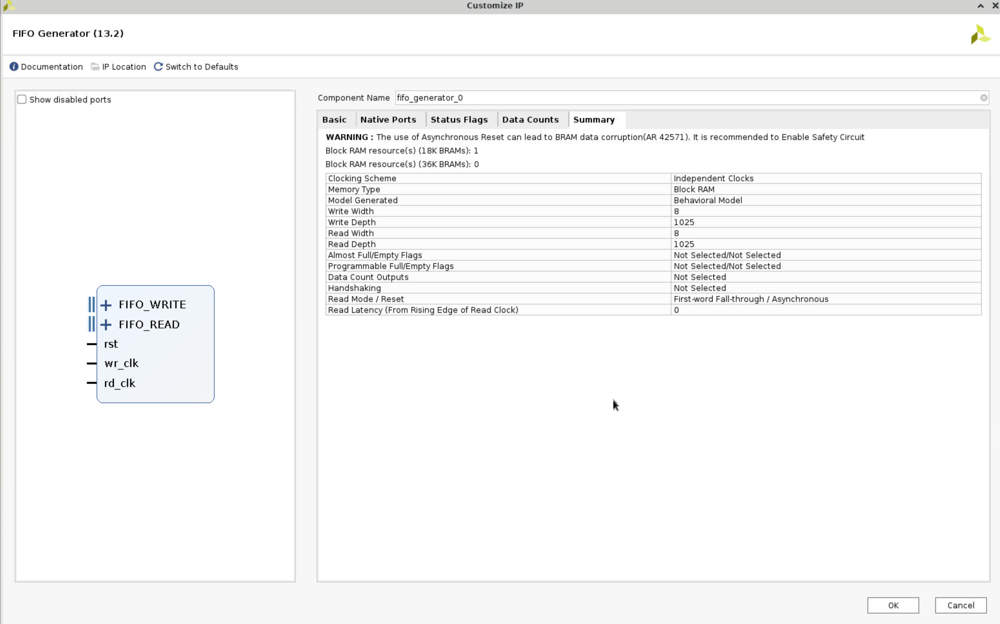</div>

* Click `IP Sources` in the Sources window, expand `fifo_generator_0` and `Instantiation Template`, and click `fifo_generator_0.veo`. Copy the code and paste it to the `wave_gen.v`, and change the port as the following.

```verilog
    fifo_generator_0 char_fifo_i0 (
      .rst(rst_i),        // input wire rst
      .wr_clk(clk_rx),  // input wire wr_clk
      .rd_clk(clk_tx),  // input wire rd_clk
      .din(char_fifo_din),        // input wire [7 : 0] din
      .wr_en(char_fifo_wr_en),    // input wire wr_en
      .rd_en(char_fifo_rd_en),    // input wire rd_en
      .dout(char_fifo_dout),      // output wire [7 : 0] dout
      .full(char_fifo_full),      // output wire full
      .empty(char_fifo_empty)    // output wire empty
    );
```

#### Run synthesis and Implementation.

* Test and make sure that there are no errors.

#### Create and package new IP

-[Toturial](https://www.instructables.com/Creating-Custom-Vivado-IP/)

* Click `Tools` and choose `Create and Package New IP`.

<div align=center>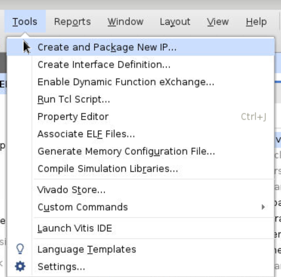</div>

* Click double `Next` and save it to the path that we want to save. For example, we can create a new folder before, and then in this process choose this folder. 

* Then click `Next` to the end, then click `finish`.

* The next screen asks where you would like to keep the IP definition and any other files needed for saving options. Normally you would point this at a general location for all custom IP. Give your IP a name.

<div align=center>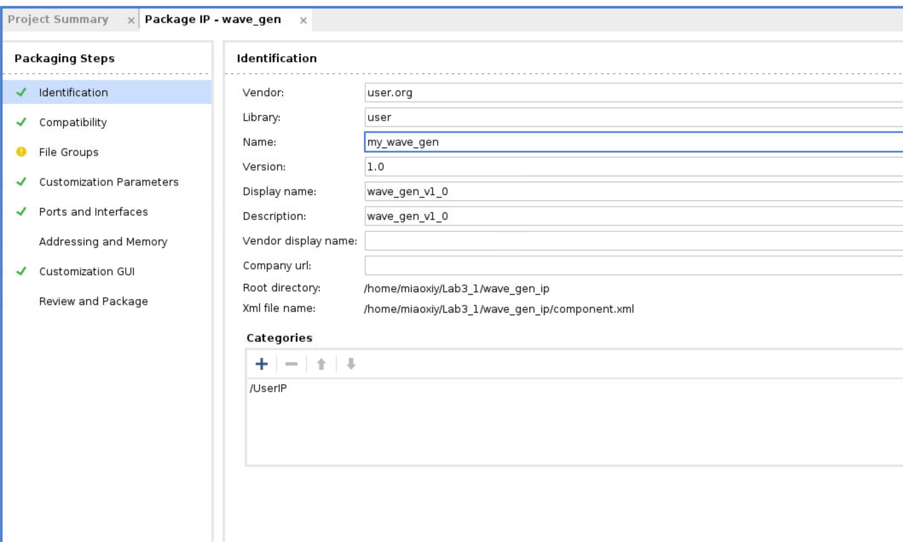</div>

* Click `Review and Package` and choose `Package IP`. Then you will see the IP in the folder you created before.

<div align=center>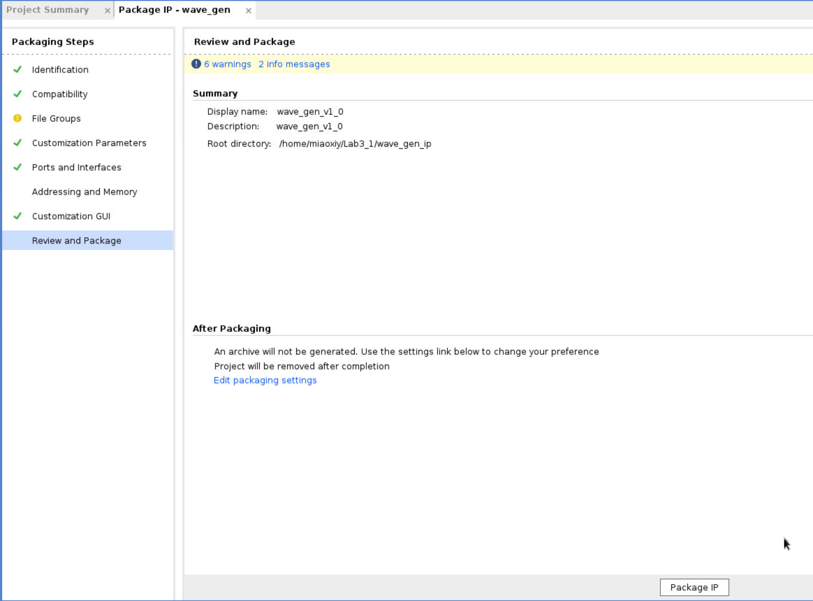</div>

<div align=center>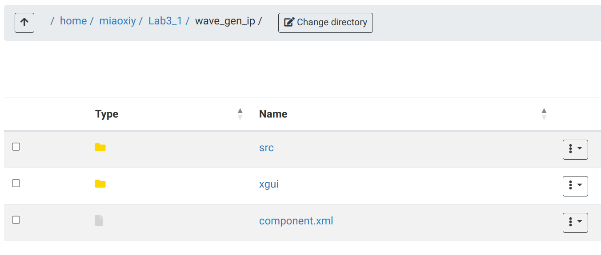</div>

* Now, we need to close the project and create a new project. And add the IP to a block design.

#### Add the my_ip to a block design

* Create a new project.

* Click `Settings`,  expand `IP` and click `Reposity`. Click `+` and choose the folder where you put your IP. 

<div align=center>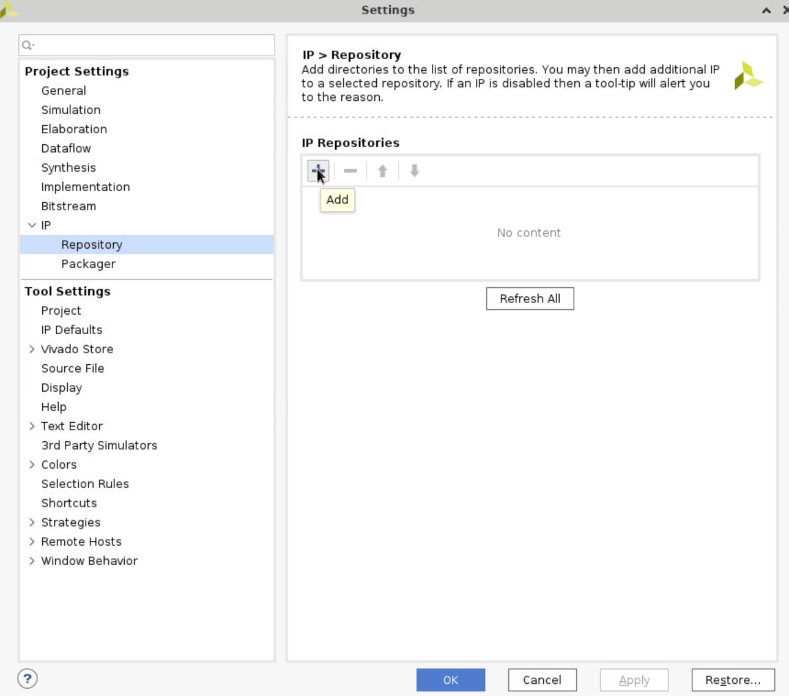</div>

<div align=center>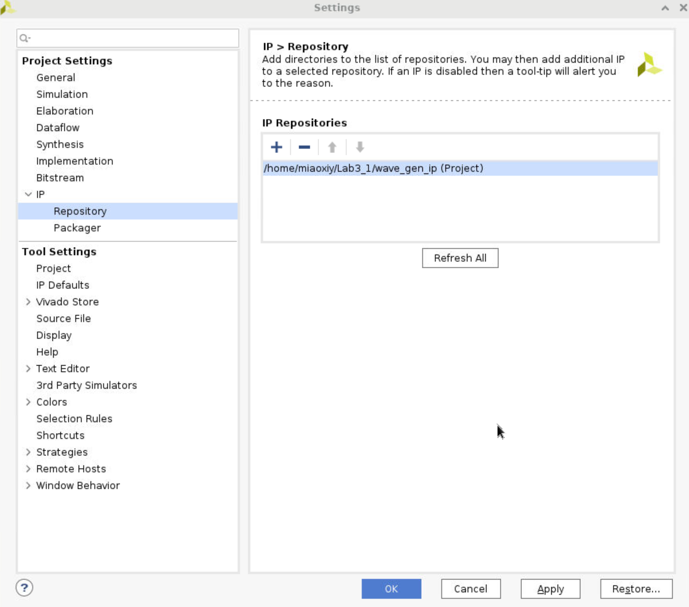</div>

* Click `Create Block Design`, click `+ (add IP)` and search `my_ip`, then it will show it. Click it and add it to the block design.

<div align=center>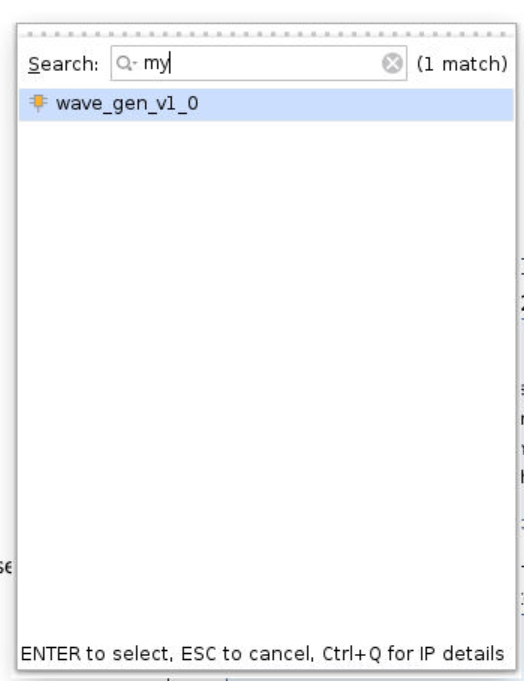</div>

* Do similar operations as the previous labs. Add `ZYNQ`, `AXI UARTLITE`, set the port. After these operations, you will find that there are some ports like `wave_gen_v1_0` left. 

* Now, we can add `system ila` and debug these ports. This operation has no means, just don't want to leave them hanging. Because `spi_clk_pin` is an ODDR output, we can't connect it to the ILA, so we right-click this port and select make external.

<div align=center>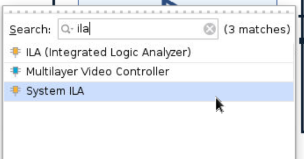</div>

<div align=center>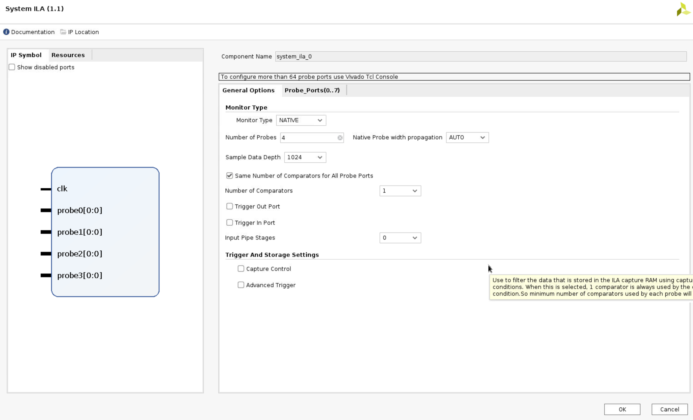</div>

* The system diagram will show the following.

<div align=center>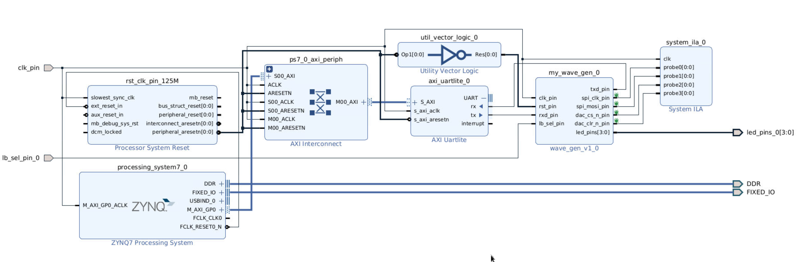</div>

#### Run the synthesis and Implementation 

* Right-click the `design_1` and select `create HDL Wrapper`.

* Run Synthesis 

#### Generate the bitstream

Please follow the instructions in Lab 2. There may be some errors about constraints when generating bitstream, we can open Layout > I/O Planning to fix the errors. 
