# Lab6_DMA 

This tutorial will show you how to use the Xilinx AXI DMA with PYNQ. It will cover adding the AXI DMA to a new Vivado hardware design and show how the DMA can be controlled from PYNQ.

## Create a new project

Create a project, and add the ZYNQ PS block.

### Add the source file

Please add the source file under `/ParallelProgammingLabs/Labs/Lab6/AXIS_Square.v`. Back to source window, right click `AXIS_Square` and choose `Add Module to Block Design`.


## Adding the DMA

In the block diagram which should contain the ZYNQ PS block, add the *AXI Direct Memory Access* block to your design. 

<div align=center>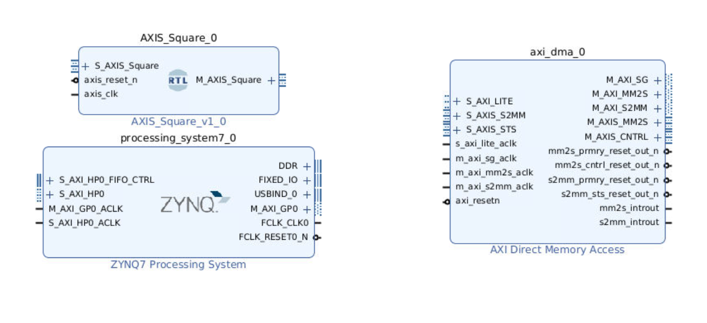</div>

### DMA background

The DMA allows you to stream data from memory, PS DRAM in this case, to an AXI stream interface. This is called the READ channel of the DMA. The DMA can also receive data from an AXI stream and write it back to PS DRAM. This is the WRITE channel.

The DMA has AXI Master ports for the read channel, and another for the write channel, and are also referred to as memory-mapped ports - they can access the PS memory. The ports are labelled MM2S (Memory-Mapped to Stream) and S2MM (Stream to Memory-Mapped). You can consider these as the read or write ports to the DRAM for now.

### Control port

The DMA has an AXI lite control port. This is used to write instructions to configure, start and stop the DMA, and readback status.

### AXI Masters

There are two AXI Master ports that will be connected to the DRAM. M_AXI_MM2S (READ channel) and M_AXI_S2MM (WRITE channel). AXI masters can read and write the memory. In this design they will be connected to the Zynq HP (High Performance) AXI Slave ports. The width of the HP ports can be changed in the Vivado design, however these ports are configured when PYNQ boots the board. You need to make sure the width of the ports in your Vivado design matches the PYNQ boot settings. In all official PYNQ images, the width of the HP ports is 64-bit.

If you set the HP ports to 32-bit if your design by mistake, you will likely see only 32-bits out of every 64-bits are transferred correctly.

### AXI Streams

There are two AXI stream ports from the DMA. One is an AXI master Stream (M_AXIS_MM2S) and corresponds to the READ channel. Data will be read from memory through the M_AXI_MM2S port and sent to the M_AXIS_MM2S port (and on to the IP connected to this port).

The other AXI stream port is an AXI Slave (S_AXIS_S2MM). This is connected to your IP. The DMA receives AXI stream data from the IP, and writes it back to memory through the M_AXI_S2MM port.

If the IP is not ready to receive data from the M_AXIS port, then this port will stall. You can also use AXI Stream FIFOs. If the IP tries to write back data but a DMA write has not started, the S_AXIS channel will stall the IP. Again, FIFOs can be used if required. The DMA has some built in buffering so if you are trying to debug your design you may see some (or all) data is read from memory, but it may not necessarily have been sent to your IP and may be queued interally or in the HP port FIFOs.

### Scatter gather support

PYNQ doesn’t support scatter gather functionality of the DMA. This is where data can be transferred from fragmented or disjointed memory locations. PYNQ only supports DMA from contiguous memory buffers

Scatter-Gather can be enabled on the DMA to allow multiple transfers of up to 8,388,608 bytes (from contiguous memory buffers). If you do this, you need to use the SG M_AXI ports instead od the M_AXI ports. This is not covered in this tutorial.

An alternative to SG for large transfers is to segment your memory transfers in software into chunks of 67,108,863 or less and run multiple DMA transfers.

### Configure the DMA

* Double click the DMA to open the configuration settings

<div align=center></div>

* Uncheck Enable Scatter Gather Engine to disable Scatter Gather

* Set the Width of Buffer Length Register to 26

    This value determines the maximum packet size for a single DMA transfer. width = 26 allows transfers of 67,108,863 bytes - the maximum size the DMA supports. I usually set this value to the maximum value of 26. If you know you will never need more than a smaller size transfer, you can set this to a smaller value and save a small amount of PL resources. I prefer to set the maximum value for flexibility as the hardware resource increase is relatively modest.

    When using the DMA if you try to do a transfer but only see that the first part of your buffer is transferred , check this value in your hardware design and check how much data you are transferring. Leaving the default with set to 14-bits is a common mistake which will limit the DMA to 16,384 byte transfers. If you try to send more than this the transfer will terminate once the maximum number of bytes supported is transferred. Remember to check the size of the transfer in bytes.

* Check the address width is set to 32. In this example, I will connect the DMA to the PS memory which is 32-bit for Zynq. You can set this up to 64-bit if you are connecting this to a larger memory, for example, if you are using a Zynq Ultrascale+ or if your DMA is connected to a PL connected memory.

* For this design, leave both read and write channels enabled

* Set the memory-mapped data width to 64 matches the HP port (defined in the PYNQ image and applied at boot time)

* Set the stream data to match your IP stream width. In this example, I will leave it set to 32.

* Make sure Allow unaligned transfers is NOT enabled

* Click OK to accept the changes

<div align=center>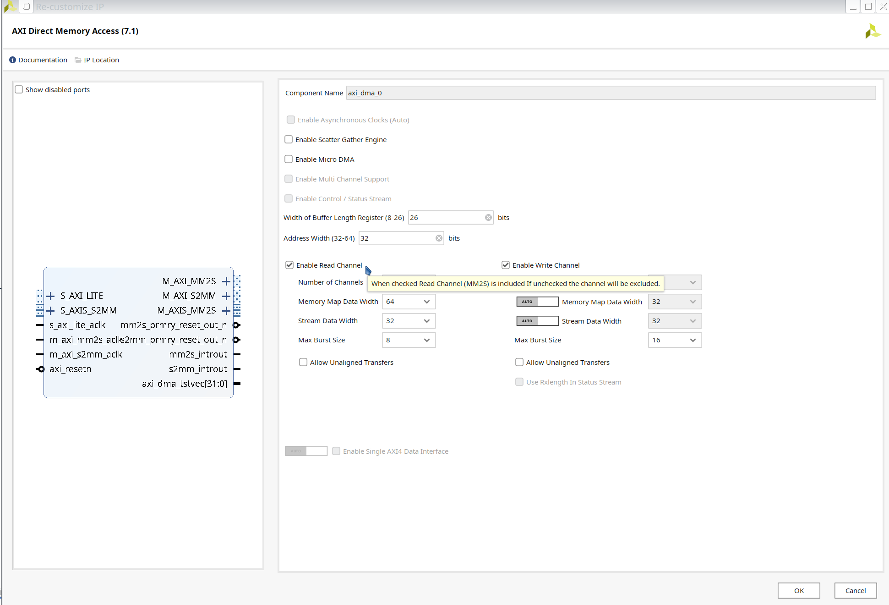</div>

### Connect the DMA

*  Double click `ZYNQ7 Processing System`, *PS-PL Configuration > HP Slave AXI Interface > Select S AXI HP0 Interface*.

<div align=center>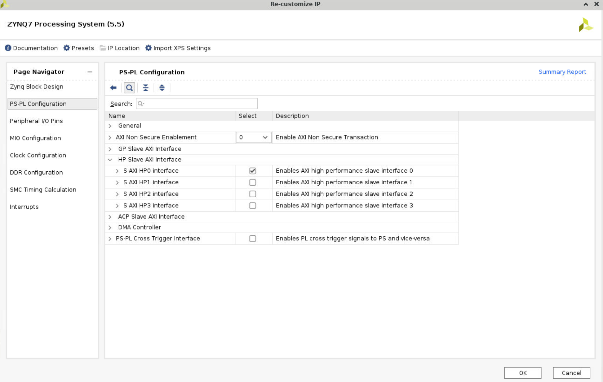</div>

* Add `Clocking Wizard`, double click it. In the *Board option*, change the *Board Interface* in the *CLK_IN1* row to `sys clock`.

<div align=center>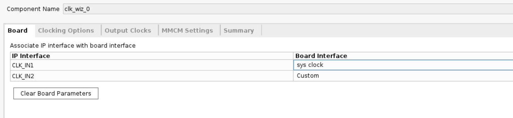</div>

* In the *Output Clocks* option, change the output frequency to 125M Hz.
  
* Disable the `reset` under the output Clocks options. Connect the `locked` port to the `ext_reset_in` of `Processor System Reset`.

* Click `Run Block Automation` and `Run connection automation`. Left the `reset` signal.

<div align=center>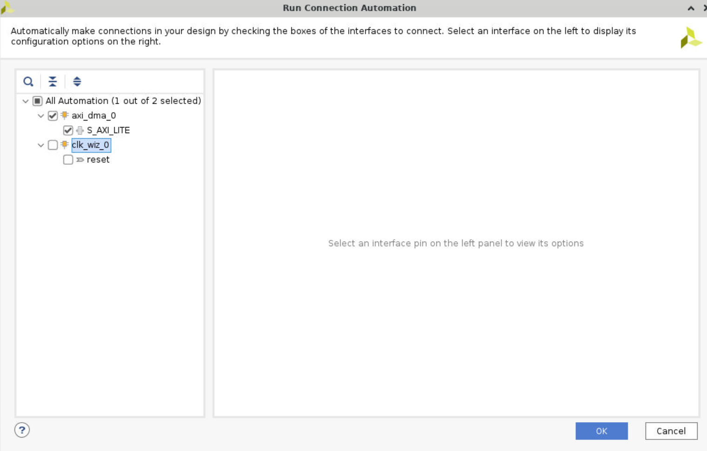</div>

* Delete the *orange line* shown in the following figure, and connect the `clk_out1` to the `M_AXI_GP0_ACLK` of `ZYNQ7 Processing System`. Then click `Run Connection Automation`.

<div align=center>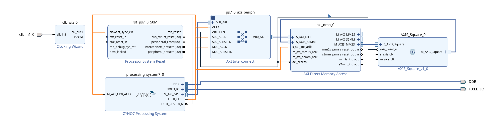</div>

<div align=center>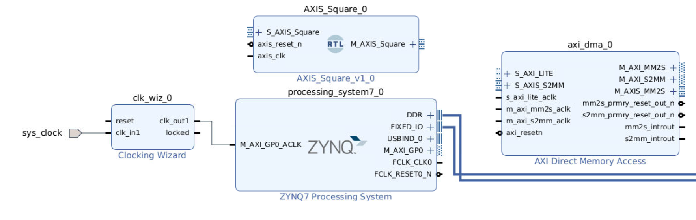</div>

* Click `s_axi_lite_aclk`, change the `clock source` to `/clk_wiz_0/clk_out1`. Repeat this operation to other clock signals.

<div align=center>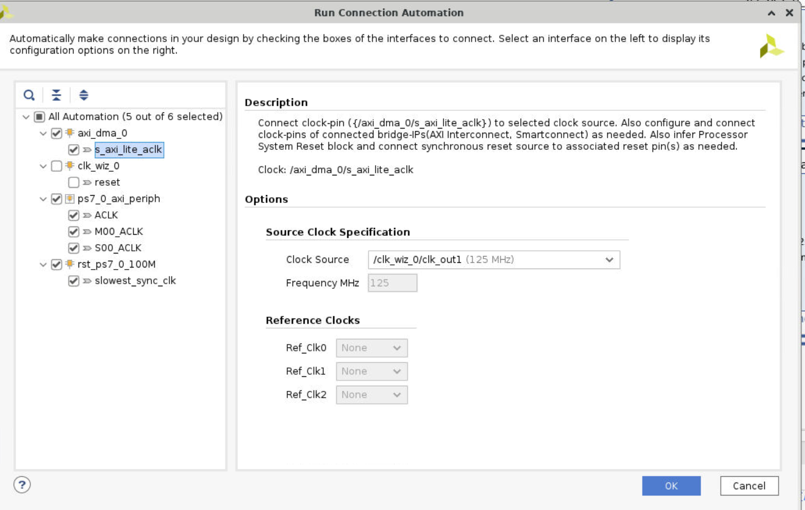</div>

* Connect the `M_AXIS_Square` of `AXIS_Square_v1_0` to the `S_AXIS_S2MM` of `AXI Direcr Memory Access`, and `M_AXIS_MM2S` of DMA to `S_AXIS_Square` of `AXIS_Square`. Then click `Run Connection Automation`

* The whole diagram will show like the following.

<div align=center>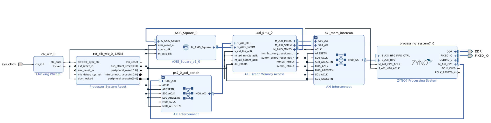</div>

* Create wrapper and set it as top 

## Run synthesis,  Implementation and generate bitstream

It may shows some errors about I/O Ports, please fix them.

## Download the bitstream file to PYNQ

```python
from pynq import Overlay
from pynq import allocate
import numpy as np
ol = Overlay("design_1_wrapper.bit")
ol.download()
```

We can check the IPs in this overlay using the IP dictionary (ip_dict). Note that the output you see here is cut short. The full optput can be viewed if you run this code on your PYNQ enabled board.

```python
ol.ip_dict
```

<div align=center>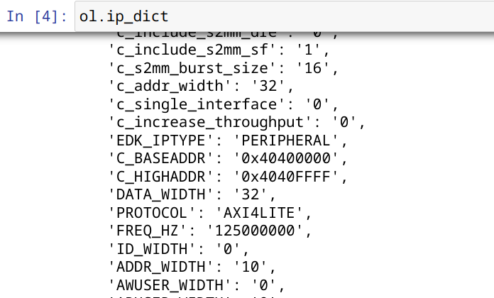</div>

### Create DMA instances

Using the labels for the DMAs listed above, we can create two DMA objects.

```python
dma = ol.axi_dma_0
dma_send = dma.sendchannel
dma_recv = dma.recvchannel
```

### Read DMA

The first step is to allocate the buffer. pynq.allocate will be used to allocate the buffer, and NumPy will be used to specify the type of the buffer.

```python
data_size = 100
input_buffer = allocate(shape=(data_size,), dtype=np.uint32)
output_buffer = allocate(shape=(data_size,), dtype=np.uint32)
output_buffer[:] = 0
for i in range(data_size):
    input_buffer[i] = i
```

Print the value of input_buffer, you will see:

```python
for i in range(10):
    print(input_buffer[i])
```

<div align=center>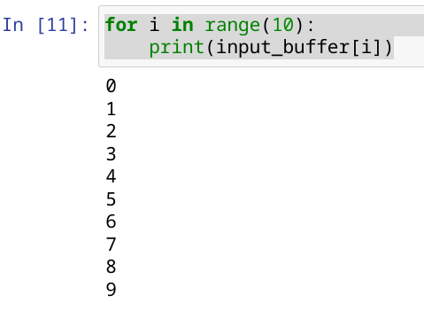</div>

```python
dma_recv.transfer(output_buffer)
dma_send.transfer(input_buffer)
output_buffer.flush()
for i in range(20):
    print(output_buffer[i])
```

We will see:

<div align=center>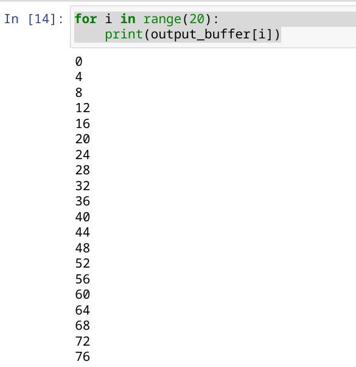</div>
