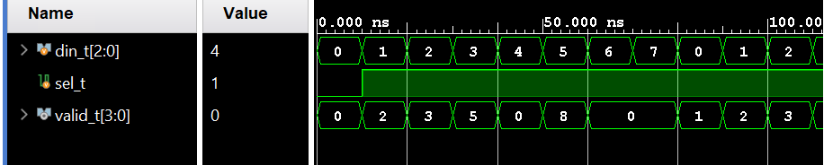
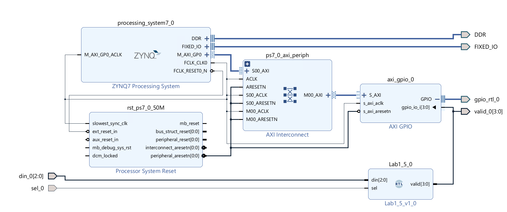
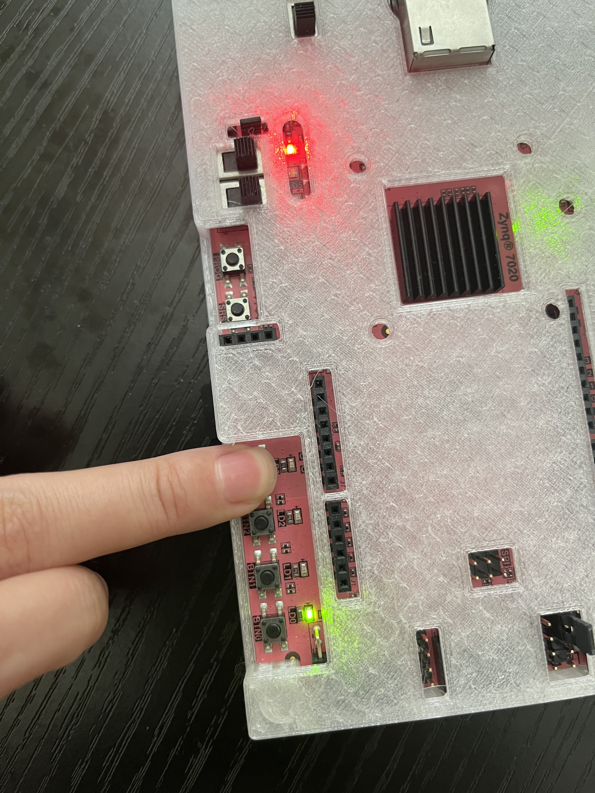
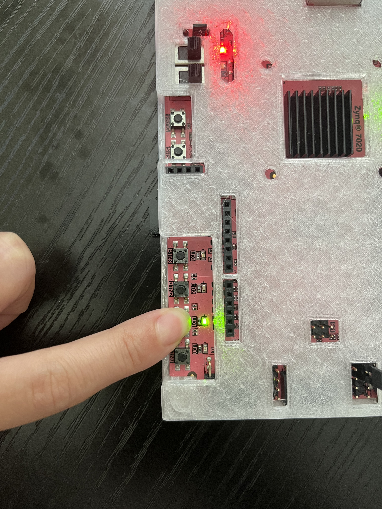

# Lab7_Fibonacci_sp

## Lab Overview

The purpose of this exercise is to learn how to connect simple input and output devices to an FPGA chip and implement a circuit that uses these devices. We will use the buttons (btn3-0) on the PYNQ-Z2 board as
inputs to the circuit. We will use light emitting diodes (LEDR3-0) as output
devices. The requirements for this lab consist of completing the Vivado designs.


Fibonacci refers to a sequence of numbers named after Leonardo of Pisa, commonly known as Fibonacci. The sequence starts with 0 and 1, and each subsequent number is the sum of the two preceding ones. Therefore, the sequence goes like this: 0, 1, 1, 2, 3, 5, 8, 13, 21, and so on.

Formally, the Fibonacci sequence can be defined recursively as follows:

* F(0)=0

* F(1)=1

* F(n)=F(n-1)+F(n-2) for n>1

The Fibonacci sequence appears in various areas of mathematics, science, and nature. It has interesting properties and applications in fields such as number theory, combinatorics, algorithms, and even in financial markets.

## Background
The PYNQ-Z2 board provides 4 buttons, called btn3-0, that can be used as inputs to a circuit, and 4 red lights, called LEDR3-0, that can be used to display output values. Since there are 10 buttons and lights, it is convenient to represent them as arrays (STD_LOGIC_VECTOR) in verilog code.

## Part I
The figure below shows a sum-of-products circuit that implements a 2-to-1 multiplexer with select inputs.
If s = 0, the multiplexer’s output m equals the input x; if s = 1, the output equals y. Part b of the figure gives a truth table for this multiplexer, and part c shows its circuit symbol.

<div align=center></div>

The multiplexer can be described by the following *Data Flow* verilog statement:

m <= (NOT (s) AND x) OR (s AND y);

1. Write a Verilog entity that describes the circuit given in below figure (an eight-bit wide 2-to-1 multiplexer).
This circuit has two eight-bit inputs, X and Y, and produces the eight-bit output M. If s = 0 then M = X,
while if s = 1 then M = Y. It has the circuit symbol shown in b, in which X, Y, and M are depicted as eightbit wires (vectors). Note, it will be very difficult to describe this as data flow! Refer to lecture notes for
some good designs that demonstrate multiplexer code!

2. Simulate with a test bench.

<div align=center></div>

### Add the source file

**part_1.v** 
```verilog

module part_1(
    input sel,
    input [7:0] a,
    input [7:0] b,
    output reg [7:0] y
    );
    
    always @(*) begin
    if(sel == 1'b0)
        y = a;
    else
        y = b;
    end

endmodule

```

**tb_part1.v**
```verilog
module tb_part1;

    // Inputs
    reg sel;
    reg [7:0] a;
    reg [7:0] b;

    // Output
    wire [7:0] y;

    // Instantiate the part_1
    part_1 uut (
        .sel(sel),
        .a(a),
        .b(b),
        .y(y)
    );
 initial begin
        // Test case 1: select a
        sel = 0;
        a = 8'b10101010;
        b = 8'b00001111;
        #10;

        // Test case 2: select b
        sel = 1;
        a = 8'b10101010;
        b = 8'b00001111;
        #10;

        // Add more test cases as needed
    end

    // Display output
    always @* begin
        $display("sel=%b, a=%b, b=%b, y=%b", sel, a, b, y);
    end


endmodule


```

And we can run Simulation to check the code by clicking the ```Run Simulation``` under the ```SIMULATION``` and choose the first ```Run Behavioral Simulation```. 

<div align=center></div>

## Part II
Create a circuit that accepts a four-bit input and outputs a single bit. This circuit will output logic high if the input bits are valid Fibonacci numbers (0, 1, 2, 3, 5, 8, 13), and logic is low otherwise.

1. Write the Verilog entity/architecture as described.

2. Simulate with a test bench.

3. Wrap this (as shown in Lab0) in another entity to compile it for board use. Map the input to press the button and map the output to one of the LEDR outputs.

### Add the source file

**fibonacci_checker.v**
```verilog
module fibonacci_checker(din,valid);
  input [3:0] din;
  output reg valid;
   reg [3:0] dout[0:6];
   reg [6:0] out_valid;
   reg [3:0] data;
    initial begin
      dout[0] = 4'h00;
      dout[1] = 4'h01;
      dout[2] = 4'h02;
      dout[3] = 4'h03;
      dout[4] = 4'h05;
      dout[5] = 4'h08;
      dout[6] = 4'h0D;
    end   
    
integer i;
always @(*) begin
    for (i = 0; i < 7; i = i + 1) begin
         data = dout[i];
         if(din == data)
            out_valid[i]=1'b1;
         else
            out_valid[i]=1'b0;
    end          
end

always @(*) begin
    if(out_valid==7'd0)
        valid = 1'd0;
    else
        valid = 1'd1; 
end

endmodule
```
You can see the ```Schematic``` under the RTL ANALYSIS as shown below:

<div align=center></div>

 Add constraints code: `part_2.xdc`.

```verilog
# PYNQ Pin Assignments
############################
# On-board Slide Buttons  #
############################
set_property PACKAGE_PIN L19 [get_ports {din_0[3]}]
set_property IOSTANDARD LVCMOS33 [get_ports {din_0[3]}]
set_property PACKAGE_PIN L20 [get_ports {din_0[2]}]
set_property PACKAGE_PIN D20 [get_ports {din_0[1]}]
set_property PACKAGE_PIN D19 [get_ports {din_0[0]}]
set_property IOSTANDARD LVCMOS33 [get_ports {din_0[2]}]
set_property IOSTANDARD LVCMOS33 [get_ports {din_0[1]}]
set_property IOSTANDARD LVCMOS33 [get_ports {din_0[0]}]

############################
# On-board leds             #
############################
set_property PACKAGE_PIN R14 [get_ports valid_0]
set_property IOSTANDARD LVCMOS33 [get_ports valid_0]
```


### Run Simulation

**tb_fi_ch.v**
``` verilog
module tb_fi_ch();
  reg [3:0] din_t;
  wire  valid_t; 
  initial
  begin
    din_t=0;
  end
  always #10 din_t=din_t+1;
  fibonacci_checker myFibonacci_task(
    .valid(valid_t),
    .din(din_t));
endmodule

```

<div align=center></div>

### Implemention

The part can reference the [Generate Bitstream](https://uri-nextlab.github.io/ParallelProgammingLabs/Labs/Lab1_led.html#generate-the-bitstream) in lab1.

The block design is shown below:

<div align=center></div>

### Download the bitstream file to PYNQ

We need to download the design_1_wrapper.bit to local machine. Back to dashboard-launch Palmetto Desktop, click Files in the orange bar and choose Home Directory. Go to Lab7/project_1/project_1.runs/impl_1 and download design_1_wrapper.bit and upload the file to the PYNQ.


```python
    from pynq import Overlay
    from pynq import Bitstream
    bit = Bitstream("design_1_wrapper.bit")
    bit.download()
    bit.bitfile_name

```

If you don't press the button, which means the input is 0, then the first led will light as shown below:

<div align=center></div>

If you press the third button, which means the input is 4, then the leds will light as shown below:

<div align=center></div>


## Part III
Create a circuit that accepts a four-bit input and outputs five bits. This circuit will output the next
Fibonacci number if the input is a valid number. This circuit will begin at *“0001”* instead of *“0000”* (this is to
protect against the difficult beginning of the sequence: 0, 1, 1…). So for *“0001”* the output will be *“00010”* up to
*“1101”* outputting *“10101”*. For invalid inputs, output *“11111”*.

1. Write the Verilog entity/architecture as described.

2. Simulate with a test bench.

3. Wrap this (as shown in Lab0) in another entity to compile it for board use. Map the input to press the buttons and map
the output to *LEDR* outputs.

### Add the source file

**part_3.v**
```verilog
 module part_3(
   input [3:0] din,
   output reg [4:0] valid
    );
 
    localparam dout_0 = 8'h00,
            dout_1 = 8'h01,
            dout_2 = 8'h02,
            dout_3 = 8'h03,
            dout_4 = 8'h05,
            dout_5 = 8'h08,
            dout_6 = 8'h0D,
            dout_7 = 8'h15;
    always @(*) begin
        case(din)
            dout_0:begin
                    valid = dout_1;
                    end
            dout_1:begin
                    valid = dout_2;
                    end
            dout_2:
                    begin
                    valid = dout_3;
                    end
            dout_3:
                    begin
                    valid = dout_4;
                    end
            dout_4:
                    begin
                    valid = dout_5;
                    end
             dout_5:
                    begin
                    valid = dout_6;
                    end
             dout_6:
                    begin
                    valid = dout_7;
                    end
                    
              default:
                    begin
                    valid = 5'b11111;
                    end
                  
        endcase
    end
    
    
endmodule
```
You can see the ```Schematic``` under the RTL ANALYSIS as shown below:

<div align=center></div>


 Add constraints code: `part_3.xdc`.

```verilog
# PYNQ Pin Assignments
############################
# On-board Slide Buttons  #
############################
set_property PACKAGE_PIN L19 [get_ports {din_0[3]}]
set_property PACKAGE_PIN L20 [get_ports {din_0[2]}]
set_property PACKAGE_PIN D20 [get_ports {din_0[1]}]
set_property PACKAGE_PIN D19 [get_ports {din_0[0]}]
############################
# On-board leds             #
############################
set_property PACKAGE_PIN L15 [get_ports {valid_0[4]}]
set_property PACKAGE_PIN M14 [get_ports {valid_0[3]}]
set_property PACKAGE_PIN N16 [get_ports {valid_0[2]}]
set_property PACKAGE_PIN P14 [get_ports {valid_0[1]}]
set_property PACKAGE_PIN R14 [get_ports {valid_0[0]}]
set_property IOSTANDARD LVCMOS33 [get_ports {din_0[3]}]
set_property IOSTANDARD LVCMOS33 [get_ports {din_0[2]}]
set_property IOSTANDARD LVCMOS33 [get_ports {din_0[1]}]
set_property IOSTANDARD LVCMOS33 [get_ports {din_0[0]}]
set_property IOSTANDARD LVCMOS33 [get_ports {valid_0[4]}]
set_property IOSTANDARD LVCMOS33 [get_ports {valid_0[3]}]
set_property IOSTANDARD LVCMOS33 [get_ports {valid_0[2]}]
set_property IOSTANDARD LVCMOS33 [get_ports {valid_0[1]}]
set_property IOSTANDARD LVCMOS33 [get_ports {valid_0[0]}]

```


### Run Simulation

**tb_3.v**
``` verilog
module tb_3();
 reg [3:0] din_t;
  wire[4:0] valid_t; 
  initial
  begin
    din_t=0;
  end
  always #10 din_t=din_t+1;
  part_3 myFibonacci_task(
    .valid(valid_t),
    .din(din_t));

endmodule

```

<div align=center></div>

### Implemention

The part can reference the [Generate Bitstream](https://uri-nextlab.github.io/ParallelProgammingLabs/Labs/Lab1_led.html#generate-the-bitstream) in lab1.

The block design is shown below:

<div align=center></div>

### Download the bitstream file to PYNQ

We need to download the design_1_wrapper.bit to local machine. Back to dashboard-launch Palmetto Desktop, click Files in the orange bar and choose Home Directory. Go to Lab7/project_1/project_1.runs/impl_1 and download design_1_wrapper.bit and upload the file to the PYNQ.

```python
from pynq import Overlay
from pynq import Bitstream
bit = Bitstream("design_1_wrapper.bit")
#keep the name of the bit file and hwh file the same
bit.download()
bit.bitfile_name
#download the file to the board
```

If you press the second button, which means the input is 2, then the first led will light as shown below:

<div align=center></div>

If you press the third button, which means the input is 4, then the leds will light as shown below:

<div align=center></div>

Here, we use another RGB LED as the fifth output to stand for the ```0x1f```.

## Part IV
Table 1 below lists the
Characters that should be displayed for each valuation of c3c2c1c0. Note only valid Fibonacci numbers from 0-8 are
displayed; E is displayed (for Error) when a non-Fibonacci number is selected.

<div align=center></div>


1. Write a Verilog entity/architecture to activate each of the seven segments. Use only simple Verilog
assignment statements in your code to specify each logic function.

2. Simulate with a test bench.

3. Wrap this (as shown in Lab0) in another entity to compile for board use. Map the inputs to press buttons and
connect the outputs of the LED.

4. Converting integers to seven-segment display in python, but we add the ```AXI_GPIO``` IP to read the data of the led.

### Add the source file

**part_4.v**
```verilog
  module part_4(
   input [3:0] din,
   output reg [3:0] valid
    );
 
    localparam dout_0 = 8'h00,
            dout_1 = 8'h01,
            dout_2 = 8'h02,
            dout_3 = 8'h03,
            dout_4 = 8'h05,
            dout_5 = 8'h08;
        
    always @(*) begin
        case(din)
            dout_0:begin
                    valid = dout_0;
                    end
            dout_1:begin
                    valid = dout_1;
                    end
            dout_2:
                    begin
                    valid = dout_2;
                    end
            dout_3:
                    begin
                    valid = dout_3;
                    end
            dout_4:
                    begin
                    valid = dout_4;
                    end
            dout_5:
                    begin
                    valid = dout_5;
                    end
       
            default:
                    begin
                    valid = 4'b1110;
                    end
                  
        endcase
    end
    
    
endmodule
```

 Add constraints code: `part_2.xdc`.

```verilog
# PYNQ Pin Assignments
############################
# On-board Slide Buttons  #
############################
set_property PACKAGE_PIN L19 [get_ports {din_0[3]}]
set_property PACKAGE_PIN L20 [get_ports {din_0[2]}]
set_property PACKAGE_PIN D20 [get_ports {din_0[1]}]
set_property PACKAGE_PIN D19 [get_ports {din_0[0]}]

############################
# On-board leds             #
############################
set_property PACKAGE_PIN M14 [get_ports {valid_0[3]}]
set_property PACKAGE_PIN N16 [get_ports {valid_0[2]}]
set_property PACKAGE_PIN P14 [get_ports {valid_0[1]}]
set_property PACKAGE_PIN R14 [get_ports {valid_0[0]}]

set_property IOSTANDARD LVCMOS33 [get_ports {din_0[3]}]
set_property IOSTANDARD LVCMOS33 [get_ports {din_0[2]}]
set_property IOSTANDARD LVCMOS33 [get_ports {din_0[1]}]
set_property IOSTANDARD LVCMOS33 [get_ports {din_0[0]}]
set_property IOSTANDARD LVCMOS33 [get_ports {valid_0[3]}]
set_property IOSTANDARD LVCMOS33 [get_ports {valid_0[2]}]
set_property IOSTANDARD LVCMOS33 [get_ports {valid_0[1]}]
set_property IOSTANDARD LVCMOS33 [get_ports {valid_0[0]}]

```


### Run Simulation

**tb_4.v**
``` verilog
module tb_4();
 reg [3:0] din_t;
  wire[3:0] dout_t; 
  initial
  begin
    din_t=0;
  end
  always #10 din_t=din_t+1;
  part_4 myFibonacci_task(
    .valid(dout_t),
    .din(din_t));


endmodule

```

<div align=center></div>

### Implemention

The part can reference the [Generate Bitstream](https://uri-nextlab.github.io/ParallelProgammingLabs/Labs/Lab1_led.html#generate-the-bitstream) in lab1.
We just add the AXI_GPIO and double click on the IP and have the setting like below:

<div align=center></div>

And then we just need to click on the green words like ```Run Block Automation``` and connect the ```FCLK_CLK0``` and ```M_AXI_GP0_ACLK``` together.
The block design is shown below:

<div align=center></div>


### Download the bitstream file to PYNQ

We need to download the design_1_wrapper.bit to local machine. Back to dashboard-launch Palmetto Desktop, click Files in the orange bar and choose Home Directory. Go to Lab7/project_1/project_1.runs/impl_1 and download design_1_wrapper.bit and upload the file to the PYNQ. And we also need the ```.hwh``` file in the /project_1/project_1.gen/sources_1/bd/design_1/hw_handoff and upload the file to the PYNQ like below:

<div align=center></div>

```python
from pynq import Overlay
from pynq import Bitstream
bit = Bitstream("design_1.bit")
#keep the name of the bit file and hwh file the same
bit.download()
bit.bitfile_name
#download the file to the board
```
```python
overlay = Overlay('design_1.bit')

representations = {
    '0': ('###', '# #', '# #', '# #', '###'),
    '1': ('  #', '  #', '  #', '  #', '  #'),
    '2': ('###', '  #', '###', '#  ', '###'),
    '3': ('###', '  #', '###', '  #', '###'),
    '4': ('# #', '# #', '###', '  #', '  #'),
    '5': ('###', '#  ', '###', '  #', '###'),
    '6': ('###', '#  ', '###', '# #', '###'),
    '7': ('###', '  #', '  #', '  #', '  #'),
    '8': ('###', '# #', '###', '# #', '###'),
    '9': ('###', '# #', '###', '  #', '###'),
    'e': ('###', '#  ', '###', '#  ', '###'),
}

def seven_segment(number):
    # treat the number as a string, since that makes it easier to deal with
    # on a digit-by-digit basis
    digits = [representations[digit] for digit in str(number)]
    # now digits is a list of 5-tuples, each representing a digit in the given number
    # We'll print the first lines of each digit, the second lines of each digit, etc.
    for i in range(5):
        print("  ".join(segment[i] for segment in digits))
```

```python
led=overlay.leds_gpio
#define the leds_gpio and then we can read the values of the leds
```
If you press the third button which means the input data is 4, then the three leds will on which means the value is e

<div align=center></div>

At the same time, you can run the code below:
```python
state=hex(led.read())
seven_segment(state[-1])
#display the values of the leds
```
You can see the state is ```e```

<div align=center></div>

If you press the first button, which means the input is 1, then the first led will light as shown below:

<div align=center></div>

At the same time, you can run the code below:
```python
state=hex(led.read())
seven_segment(state[-1])
#display the values of the leds
```
You can see:

<div align=center></div>

## Part V

Using all of the components above, create a structural design that links all of the components. Your input to the entity will be a four-bit code for the current number and a one-bit select line for the multiplexer. Your outputs
There Will be a single bit high for valid Fibonacci numbers on the input. The multiplexer (note you will need to modify the multiplexer shown to the
correct bit width) will be used to control if the current Fibonacci input
 (when select is 0, the input is displayed when 1, the next Fibonacci number is displayed). This only displays
When selected, 0-8, ignoring the 13 from the following Fibonacci output.

1. Write the Verilog entity/architecture as described.

2. Simulate with a test bench.

3. Wrap this (as shown in Lab0) in another entity to compile for board use. Map the input to press buttons (you pick
which to use) and map the output to the LEDs.

4. Converting integers to seven-segment display in python, but we add the ```AXI_GPIO``` IP to read the data of the led.
   
### Add the source file

**Lab1_5.v**
```verilog
module Lab1_5(
  input [3:0] din,
  input sel,
  output  [4:0] valid_put,
  output  dout
    );
    
    test_2 one_put(
    .din(din),
    .valid(dout)
    );
    
    test_1 display(
    .sel(sel),
    .din(din),
    .y(valid_put)
    );
    
    
endmodule
```
**test_1.v**
```verilog
module test_1(
    input sel,
    input [3:0] din,
    output reg [4:0] y
    );
    
    wire [4:0] next_vaild;
# This IP actually is the code of the part III
    test_3 next(
    .din(din),
    .valid(next_vaild)
    );
     wire [3:0] current_vaild;
# This IP actually is the code of the part IV
    test_4 current(
    .din(din),
    .valid(current_vaild)
    );

    always @(*) begin
    if(sel == 1'b0)
        y = current_vaild;
    else
        y = next_vaild;
    end

endmodule
```

**test_2.v**
```verilog
module test_2(din,valid);
  input [3:0] din;
  output  reg valid;
  
   reg [3:0] dout[0:6];
   reg [6:0] out_valid;
   reg [3:0] data;
    initial begin
      dout[0] = 4'h00;
      dout[1] = 4'h01;
      dout[2] = 4'h02;
      dout[3] = 4'h03;
      dout[4] = 4'h05;
      dout[5] = 4'h08;
      dout[6] = 4'h0D;
    end   
    
integer i;
always @(*) begin
    for (i = 0; i < 7; i = i + 1) begin
         data = dout[i];
         if(din == data)
            out_valid[i]=1'b1;
         else
            out_valid[i]=1'b0;
    end          
end

always @(*) begin
    if(out_valid==7'd0)
        valid = 1'd0;
    else
        valid = 1'd1; 
end


endmodule
```


Add constraints code: `part_2.xdc`.

```verilog
# PYNQ Pin Assignments
############################
# On-board Slide Buttons  #
############################
set_property PACKAGE_PIN L20 [get_ports {din_0[2]}]
set_property PACKAGE_PIN D20 [get_ports {din_0[1]}]
set_property PACKAGE_PIN D19 [get_ports {din_0[0]}]
set_property PACKAGE_PIN M14 [get_ports {valid_0[3]}]
set_property PACKAGE_PIN N16 [get_ports {valid_0[2]}]
set_property PACKAGE_PIN P14 [get_ports {valid_0[1]}]
set_property PACKAGE_PIN R14 [get_ports {valid_0[0]}]
set_property IOSTANDARD LVCMOS33 [get_ports {din_0[2]}]
set_property IOSTANDARD LVCMOS33 [get_ports {din_0[1]}]
set_property IOSTANDARD LVCMOS33 [get_ports {din_0[0]}]
set_property IOSTANDARD LVCMOS33 [get_ports {valid_0[3]}]
set_property IOSTANDARD LVCMOS33 [get_ports {valid_0[2]}]
set_property IOSTANDARD LVCMOS33 [get_ports {valid_0[1]}]
set_property IOSTANDARD LVCMOS33 [get_ports {valid_0[0]}]

set_property PACKAGE_PIN L19 [get_ports sel_0]
set_property IOSTANDARD LVCMOS33 [get_ports sel_0]

```

You can see the ```Schematic``` under the RTL ANALYSIS as shown below:

<div align=center></div>

### Run Simulation

**tb_5.v**
``` verilog
module tb_5();
  reg [3:0] din_t;
  reg sel_t;
  wire  [4:0] valid_t;
  wire one_put;
  initial
  begin
    din_t=0;
  end
  always #10 din_t=din_t+1;
initial begin
    // Test case 1: select a
    sel_t = 0;
    #10;
    // Test case 2: select b
    sel_t = 1;
    #10;

    // Add more test cases as needed
end
  Lab1_5 myFibonacci_task(
   .valid_put(valid_t),
    .din(din_t),
    .sel(sel_t),
    .dout(one_put)


endmodule
```

<div align=center></div>

### Implemention

The part can reference the [Generate Bitstream](https://uri-nextlab.github.io/ParallelProgammingLabs/Labs/Lab1_led.html#generate-the-bitstream) in lab1.
The setting of the ```AXI_GPIO``` is the same as part IV.

The block design is shown below:

<div align=center></div>

### Download the bitstream file to PYNQ

We need to download the design_1_wrapper.bit to local machine. Back to dashboard-launch Palmetto Desktop, click Files in the orange bar and choose Home Directory. Go to Lab7/project_1/project_1.runs/impl_1 and download design_1_wrapper.bit and upload the file to the PYNQ.


```python
    from pynq import Overlay
    from pynq import Bitstream
    bit = Bitstream("design_1_wrapper.bit")
    bit.download()
    bit.bitfile_name

```

```python
overlay = Overlay('design_1.bit')

representations = {
    '0': ('###', '# #', '# #', '# #', '###'),
    '1': ('  #', '  #', '  #', '  #', '  #'),
    '2': ('###', '  #', '###', '#  ', '###'),
    '3': ('###', '  #', '###', '  #', '###'),
    '4': ('# #', '# #', '###', '  #', '  #'),
    '5': ('###', '#  ', '###', '  #', '###'),
    '6': ('###', '#  ', '###', '# #', '###'),
    '7': ('###', '  #', '  #', '  #', '  #'),
    '8': ('###', '# #', '###', '# #', '###'),
    '9': ('###', '# #', '###', '  #', '###'),
    'e': ('###', '#  ', '###', '#  ', '###'),
}

def seven_segment(number):
    # treat the number as a string, since that makes it easier to deal with
    # on a digit-by-digit basis
    digits = [representations[digit] for digit in str(number)]
    # now digits is a list of 5-tuples, each representing a digit in the given number
    # We'll print the first lines of each digit, the second lines of each digit, etc.
    for i in range(5):
        print("  ".join(segment[i] for segment in digits))
```


If you press the ```sel```, which means the sel is high, then the first led will light as shown below:

<div align=center></div>

At the same time, you can run the code below:

```python
led=overlay.leds_gpio
seven_segment(led.read())
```
We will see:

<div align=center></div>

If you choose the ```sel``` is low, and input is 2, then the second led will light as shown below:

<div align=center></div>

At the same time, you can run the code below:
```python
led=overlay.leds_gpio
seven_segment(led.read())
```
We will see:

<div align=center></div>
