# Lab7_Fibonacci_sp

## Lab Overview

This exercise aims to learn how to interface with simple input and output devices on an FPGA chip. Specifically, you will implement a circuit on the PYNQ-Z2 board that interacts with the board's buttons and light-emitting diodes (LEDs).
Complete the design in Vivado for the PYNQ-Z2 board. This design should map the board's buttons (BTN3 to BTN0) as inputs to your circuit. Use the board's LEDs (LED3 to LED0) as output devices. Your circuit should drive these LEDs based on the input received from the buttons.

Fibonacci refers to a sequence of numbers named after Leonardo of Pisa, commonly known as Fibonacci. The sequence starts with 0 and 1, and each subsequent number is the sum of the two preceding ones. Therefore, the sequence goes like this: 0, 1, 1, 2, 3, 5, 8, 13, 21, and so on.

Formally, the Fibonacci sequence can be defined recursively as follows:

* F(0)=0

* F(1)=1

* F(n)=F(n-1)+F(n-2) for n>1

The Fibonacci sequence appears in various mathematics, science, and nature areas. It has interesting properties and applications in number theory, combinatorics, algorithms, and financial markets.

## Background
The PYNQ-Z2 board is equipped with four push buttons and four red LEDs. These components are useful for interacting with and visualizing the behavior of your digital circuit designs. In this exercise, you will utilize these buttons and LEDs to create an interactive Verilog module.

## Part I
The figure below shows a sum-of-products circuit that implements a 2-to-1 multiplexer with select inputs.
If s = 0, the multiplexer’s output m equals the input x; if s = 1, the output equals y. Part b of the figure gives a truth table for this multiplexer, and part c shows its circuit symbol.

<div align=center>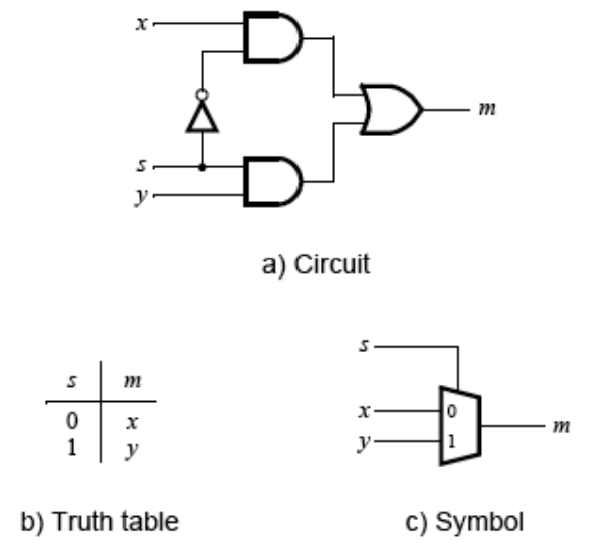</div>

The multiplexer can be described by the following *Data Flow* Verilog statement:

m <= (NOT (s) AND x) OR (s AND y);

1. Design a Verilog module that implements an 8-bit wide 2-to-1 multiplexer. This multiplexer should take two 8-bit inputs, X and Y, and select between them based on a single-bit selector, s. The output of the multiplexer, M, will be one of the two inputs depending on the state of s: when s = 0, M should equal X, and when s = 1, M should equal Y.

2. Simulate with a test bench.

<div align=center>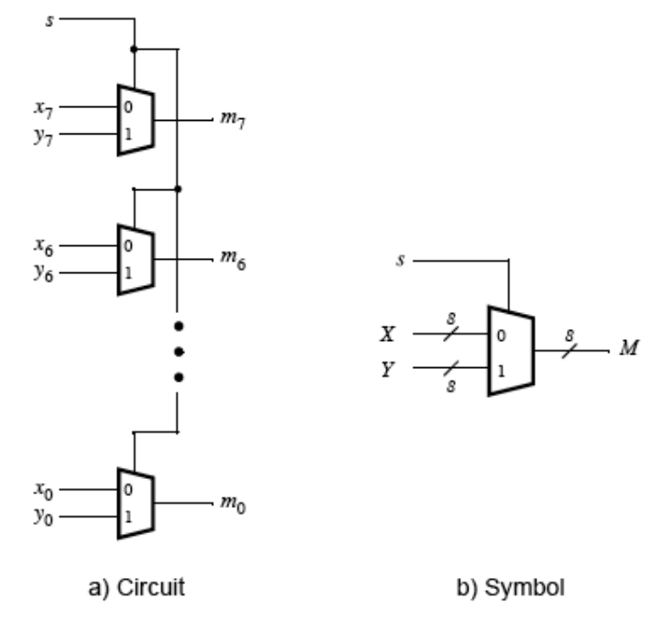</div>

### Add the source file

**part_1.v** 
```verilog

// Define a module named part_1
module part_1(
    input sel,              // Declare a single-bit input 'sel' for selection
    input [7:0] a,          // Declare an 8-bit input 'a'
    input [7:0] b,          // Declare an 8-bit input 'b'
    output reg [7:0] y      // Declare an 8-bit output 'y' and make it a reg type to allow procedural assignments
);

    // Define a combinational always block that triggers any change of inputs
    always @(*) begin
        if(sel == 1'b0)     // Check if the selection input 'sel' is 0
            y = a;          // If 'sel' is 0, assign the value of 'a' to 'y'
        else
            y = b;          // If 'sel' is not 0 (i.e., is 1), assign the value of 'b' to 'y'
    end

endmodule // End of module part_1

```

**tb_part1.v**
```verilog
// Define a testbench module for part_1
module tb_part1;

    // Test Inputs
    reg sel;            // Define a single-bit register 'sel' for selection
    reg [7:0] a;        // Define an 8-bit register 'a'
    reg [7:0] b;        // Define an 8-bit register 'b'

    // Test Output
    wire [7:0] y;       // Define an 8-bit wire 'y' for the output of the device under test (DUT)

    // Instantiate the Device Under Test (DUT): part_1 module
    part_1 uut (
        .sel(sel),      // Connect the testbench 'sel' to the DUT 'sel'
        .a(a),          // Connect the testbench 'a' to the DUT 'a'
        .b(b),          // Connect the testbench 'b' to the DUT 'b'
        .y(y)           // Connect the DUT 'y' to the testbench 'y'
    );

    // Begin the initial block for the test stimulus
    initial begin
        // Test case 1: select input 'a'
        sel = 0;        // Set 'sel' to 0 to select input 'a'
        a = 8'b10101010; // Assign test value to 'a'
        b = 8'b00001111; // Assign test value to 'b'
        #10;             // Wait for 10 time units

        // Test case 2: select input 'b'
        sel = 1;        // Set 'sel' to 1 to select input 'b'
        a = 8'b10101010; // Assign test value to 'a'
        b = 8'b00001111; // Assign test value to 'b'
        #10;             // Wait for 10 time units

        // Add more test cases as needed
    end

    // Always block to display the results whenever any of the inputs or output changes
    always @* begin
        $display("sel=%b, a=%b, b=%b, y=%b", sel, a, b, y); // Display the current values of 'sel', 'a', 'b', and 'y'
    end

endmodule // End of testbench module tb_part1


```

We can run a Simulation to check the code by clicking the ```Run Simulation``` under ```SIMULATION``` and choosing the first ```Run Behavioral Simulation```. 

<div align=center>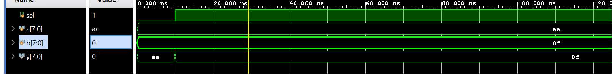</div>

## Part II
Create a circuit that accepts a four-bit input and outputs a single bit. This circuit will output a logic high if the input bits are valid Fibonacci numbers (0, 1, 2, 3, 5, 8, 13), and logic is low otherwise.

1. Write the Verilog module as described.

2. Simulate with a test bench.

3. Configure the circuit's input to be controlled by pressing a button on the FPGA board and map the circuit's output to illuminate one of the LEDs on the board.

### Add the source file

**fibonacci_checker.v**
```verilog
// Define a module named fibonacci_checker
module fibonacci_checker(din, valid);
    input [3:0] din;         // 4-bit input 'din' representing the data to check
    output reg valid;        // Output 'valid' indicating if 'din' is a Fibonacci number

    reg [6:0] out_valid;     // 7-bit register to hold validity status for each Fibonacci number
    reg [3:0] data;          // Temporary register to hold current Fibonacci number being checked

    // Local parameter array holding the first eight Fibonacci numbers (as 4-bit values)
    localparam [3:0] dout[7] = {4'h0, 4'h1, 4'h2, 4'03, 4'h5, 4'h8, 4'hD}; 
    integer i;               // Integer used for loop indexing

    // Always block to check if 'din' is a Fibonacci number
    always @(*) begin
        for (i = 0; i < 7; i = i + 1) begin    // Iterate over all Fibonacci numbers defined
            data = dout[i];                   // Assign the current Fibonacci number to 'data'
            if(din == data)                   // Check if input 'din' matches the current Fibonacci number
                out_valid[i] = 1'b1;          // If match, set corresponding bit in 'out_valid'
            else
                out_valid[i] = 1'b0;          // If not, clear corresponding bit in 'out_valid'
        end          
    end

    // Always block to set 'valid' output based on 'out_valid' contents
    always @(*) begin
        if(out_valid == 7'd0) // Check if none of the Fibonacci numbers matched 'din'
            valid = 1'd0;     // If no match, set 'valid' to 0
        else
            valid = 1'd1;     // If there's a match, set 'valid' to 1
    end

endmodule // End of module fibonacci_checker

```
You can see the ```Schematic``` under the RTL ANALYSIS as shown below:

<div align=center>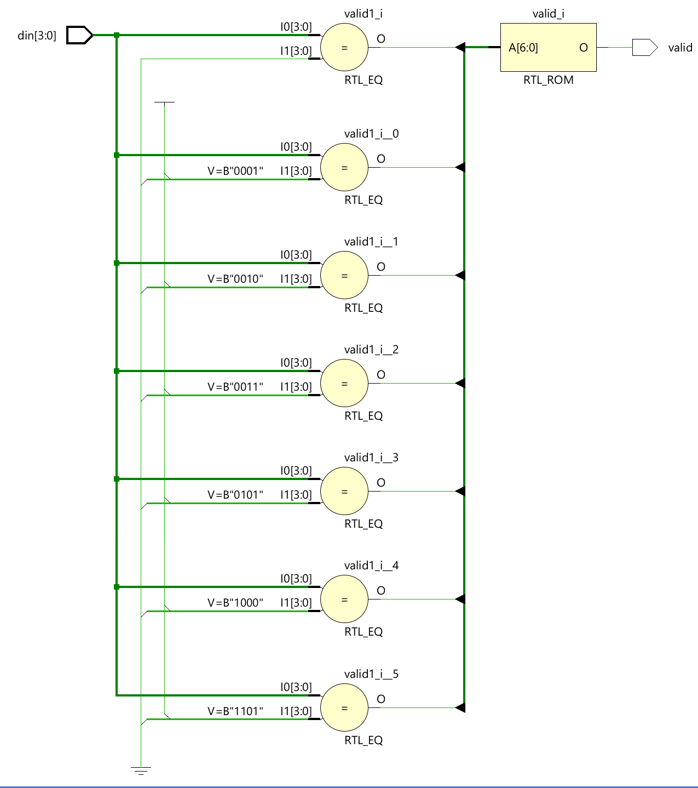</div>

 Add constraints code: `part_2.xdc`.

```verilog
# PYNQ Pin Assignments
############################
# On-board Slide Buttons  #
############################
set_property PACKAGE_PIN L19 [get_ports {din_0[3]}]
set_property IOSTANDARD LVCMOS33 [get_ports {din_0[3]}]
set_property PACKAGE_PIN L20 [get_ports {din_0[2]}]
set_property PACKAGE_PIN D20 [get_ports {din_0[1]}]
set_property PACKAGE_PIN D19 [get_ports {din_0[0]}]
set_property IOSTANDARD LVCMOS33 [get_ports {din_0[2]}]
set_property IOSTANDARD LVCMOS33 [get_ports {din_0[1]}]
set_property IOSTANDARD LVCMOS33 [get_ports {din_0[0]}]

############################
# On-board leds             #
############################
set_property PACKAGE_PIN R14 [get_ports valid_0]
set_property IOSTANDARD LVCMOS33 [get_ports valid_0]
```


### Run Simulation

**tb_fi_ch.v**
``` verilog
// Define a testbench module named tb_fi_ch for the fibonacci_checker
module tb_fi_ch();
    reg [3:0] din_t;   // Define a 4-bit register 'din_t' for driving the input to the DUT
    wire valid_t;     // Define a wire 'valid_t' to receive the output from the DUT

    // Initial block to initialize test values
    initial begin
        din_t = 0;     // Start testing with the input value 0
    end

    // Always block to increment 'din_t' every 10 time units
    always #10 din_t = din_t + 1; // Increment 'din_t' every 10 simulation time units

    // Instantiate the Device Under Test (DUT): fibonacci_checker
    fibonacci_checker myFibonacci_task(
        .din(din_t),     // Map the testbench 'din_t' to the DUT 'din'
        .valid(valid_t)  // Map the DUT 'valid' output to the testbench 'valid_t'
    );
endmodule // End of the testbench module tb_fi_ch


```

<div align=center>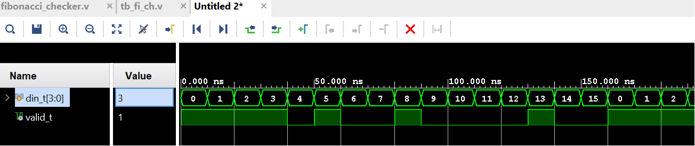</div>

### Implementation

The part can reference the [Generate Bitstream](https://uri-nextlab.github.io/ParallelProgammingLabs/Labs/Lab1_led.html#generate-the-bitstream) in lab1.

The block design is shown below:

<div align=center>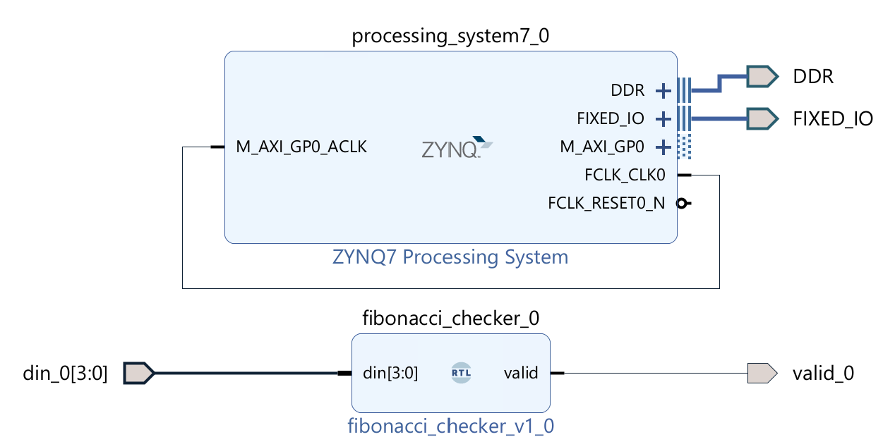</div>

### Download the bitstream file to PYNQ

We need to download the design_1_wrapper.bit to the local machine. Go to Lab7/project_1/project_1.runs/impl_1, download design_1_wrapper.bit, and upload the file to the PYNQ.
Ensure you follow each step to properly transfer the bitstream file from your development environment to the PYNQ board.

```python

# Import the Overlay and Bitstream classes from the pynq package.
# Overlay loads and manages a hardware design on the FPGA.
# Bitstream is used to manage bitstream files specifically.
    from pynq import Overlay
    from pynq import Bitstream
    bit = Bitstream("design_1_wrapper.bit")
    bit.download()
# Download the bitstream to the FPGA.
# This method programs the FPGA using the hardware design specified by the bitstream.
    bit.bitfile_name

```

If you don't press the button, which means the input is 0, then the first LED will light up as shown below:

<div align=center>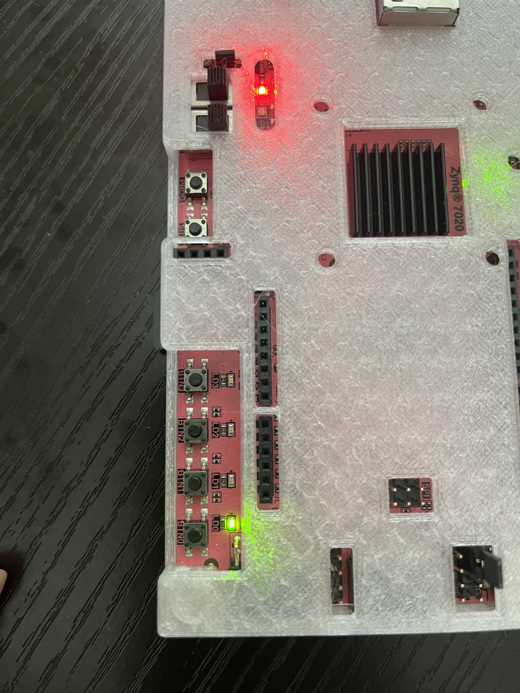</div>

If you press the third button, which means the input is 4, then the LEDs will light as shown below:

<div align=center>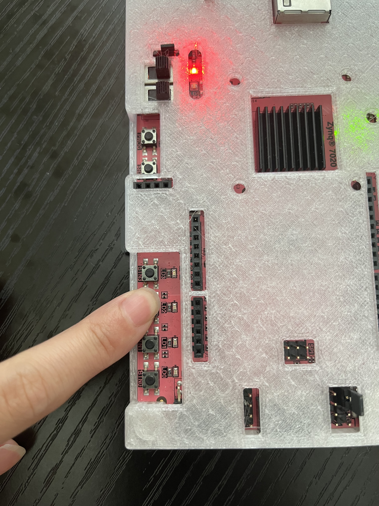</div>


## Part III
Design a digital circuit that receives a four-bit binary input and produces a five-bit binary output. This circuit is intended to recognize valid Fibonacci numbers within a predefined range and calculate the next number in the Fibonacci sequence based on the input. The sequence should start from "0001" instead of the traditional "0000" to avoid the initial repeating ones in the Fibonacci series (0, 1, 2, 3, 5...).

* Input: The circuit accepts a four-bit binary number as input.
  
* Output: The circuit outputs a five-bit binary number.
  
* If the input is recognized as a valid number in the modified Fibonacci sequence (starting from 1 instead of 0), the circuit will output the next number in the sequence. For example, if the input is "0001" (1 in decimal), the output should be "00010" (2 in decimal).
  
* The circuit recognizes and processes inputs up to "1101" (13 in decimal), outputting "10101" (21 in decimal) for this input.

* For any input that does not correspond to a recognized number in this modified Fibonacci sequence, the circuit will output "11111."

1. Write the Verilog module as described.

2. Simulate with a test bench.

3. Configure the circuit's input to be controlled by pressing a button on the FPGA board and map the circuit's input to press the buttons and output to illuminate one of the LEDs on the board.
### Add the source file

**part_3.v**
```verilog
// Define a module named part_3
module part_3(
   input [3:0] din,         // 4-bit input 'din' representing the data input
   output reg [4:0] valid   // 5-bit output 'valid' to hold the next Fibonacci number or a default value
);

    // Local parameters representing predefined Fibonacci numbers (coded as 8-bit for some reason, should match input size if used for comparison)
    localparam dout_0 = 8'h00,
                dout_1 = 8'h01,
                dout_2 = 8'h02,
                dout_3 = 8'h03,
                dout_4 = 8'h05,
                dout_5 = 8'h08,
                dout_6 = 8'h0D,
                dout_7 = 8'h15;

    // Always block triggers on any change to 'din'
    always @(*) begin
        case(din) // Begin case statement to compare 'din' with known Fibonacci numbers
            dout_0: begin
                    valid = dout_1; // If 'din' is the first Fibonacci number, output the second
                    end
            dout_1: begin
                    valid = dout_2; // If 'din' is the second Fibonacci number, output the third
                    end
            dout_2: begin
                    valid = dout_3; // If 'din' is the third Fibonacci number, output the fourth
                    end
            dout_3: begin
                    valid = dout_4; // If 'din' is the fourth Fibonacci number, output the fifth
                    end
            dout_4: begin
                    valid = dout_5; // If 'din' is the fifth Fibonacci number, output the sixth
                    end
            dout_5: begin
                    valid = dout_6; // If 'din' is the sixth Fibonacci number, output the seventh
                    end
            dout_6: begin
                    valid = dout_7; // If 'din' is the seventh Fibonacci number, output the eighth
                    end
            default: begin
                    valid = 5'b11111; // If 'din' does not match any predefined Fibonacci number, output a default value (all ones)
                    end
        endcase
    end
    
endmodule // End of module part_3

```
You can see the ```Schematic``` under the RTL ANALYSIS as shown below:

<div align=center>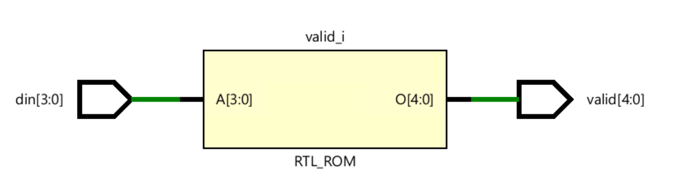</div>


 Add constraints code: `part_3.xdc`.

```verilog
# PYNQ Pin Assignments
############################
# On-board Slide Buttons  #
############################
set_property PACKAGE_PIN L19 [get_ports {din_0[3]}]
set_property PACKAGE_PIN L20 [get_ports {din_0[2]}]
set_property PACKAGE_PIN D20 [get_ports {din_0[1]}]
set_property PACKAGE_PIN D19 [get_ports {din_0[0]}]
############################
# On-board leds             #
############################
set_property PACKAGE_PIN L15 [get_ports {valid_0[4]}]
set_property PACKAGE_PIN M14 [get_ports {valid_0[3]}]
set_property PACKAGE_PIN N16 [get_ports {valid_0[2]}]
set_property PACKAGE_PIN P14 [get_ports {valid_0[1]}]
set_property PACKAGE_PIN R14 [get_ports {valid_0[0]}]
set_property IOSTANDARD LVCMOS33 [get_ports {din_0[3]}]
set_property IOSTANDARD LVCMOS33 [get_ports {din_0[2]}]
set_property IOSTANDARD LVCMOS33 [get_ports {din_0[1]}]
set_property IOSTANDARD LVCMOS33 [get_ports {din_0[0]}]
set_property IOSTANDARD LVCMOS33 [get_ports {valid_0[4]}]
set_property IOSTANDARD LVCMOS33 [get_ports {valid_0[3]}]
set_property IOSTANDARD LVCMOS33 [get_ports {valid_0[2]}]
set_property IOSTANDARD LVCMOS33 [get_ports {valid_0[1]}]
set_property IOSTANDARD LVCMOS33 [get_ports {valid_0[0]}]

```


### Run Simulation

**tb_3.v**
``` verilog
// Define a testbench module named tb_3 for testing part_3
module tb_3();
    reg [3:0] din_t;     // Define a 4-bit register 'din_t' for driving the input to the DUT (Device Under Test)
    wire [4:0] valid_t;  // Define a 5-bit wire 'valid_t' to receive the output from the DUT

    // Initial block to initialize test values
    initial begin
        din_t = 0;      // Start testing with the input value 0
    end

    // Always block to increment 'din_t' every 10 time units
    always #10 din_t = din_t + 1; // Increment 'din_t' every 10 simulation time units to test different values

    // Instantiate the Device Under Test (DUT): part_3 module
    part_3 myFibonacci_task(
        .din(din_t),    // Connect the testbench 'din_t' to the DUT 'din'
        .valid(valid_t) // Connect the DUT 'valid' output to the testbench 'valid_t'
    );

endmodule // End of the testbench module tb_3


```

<div align=center></div>

### Implementation

The part can reference the [Generate Bitstream](https://uri-nextlab.github.io/ParallelProgammingLabs/Labs/Lab1_led.html#generate-the-bitstream) in lab1.

The block design is shown below:

<div align=center>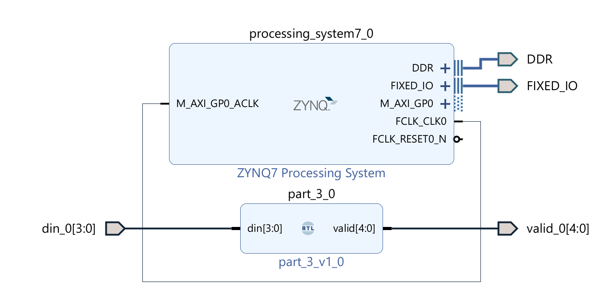</div>

### Download the bitstream file to PYNQ

We need to download the design_1_wrapper.bit to the local machine. Go to Lab7/project_1/project_1.runs/impl_1 and download design_1_wrapper.bit, and upload the file to the PYNQ.

```python
from pynq import Overlay
from pynq import Bitstream
bit = Bitstream("design_1_wrapper.bit")
#keep the name of the bit file and hwh file the same
bit.download()
bit.bitfile_name
#download the file to the board
```

If you press the second button, which means the input is 2, then the first LED will light as shown below:

<div align=center>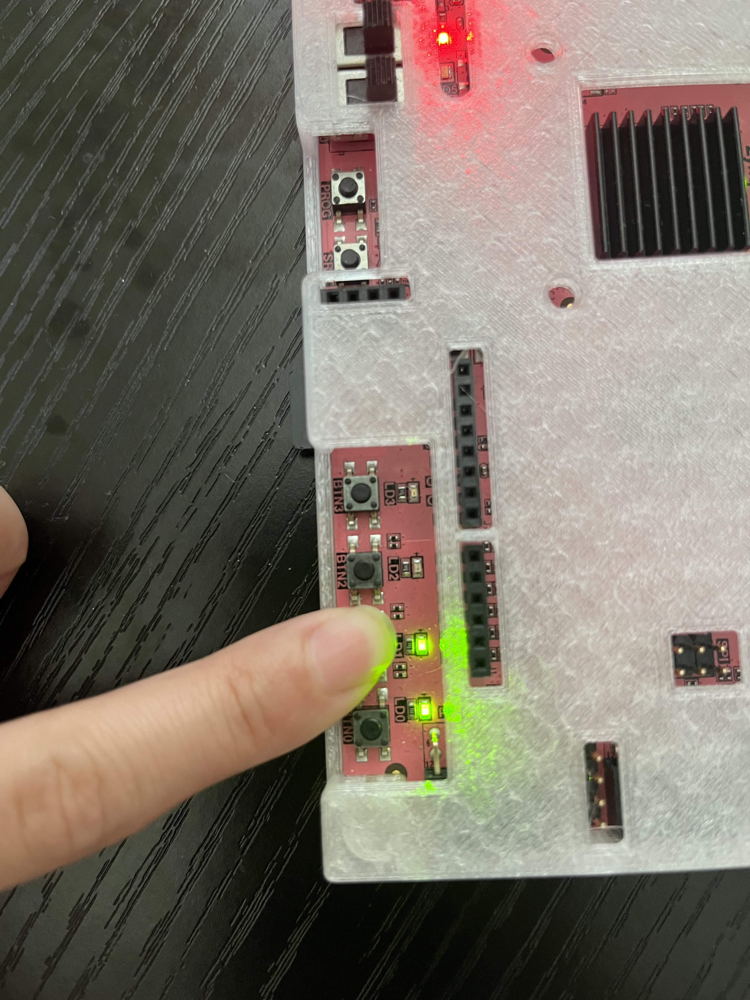</div>

If you press the third button, which means the input is 4, then the LEDs will light as shown below:

<div align=center>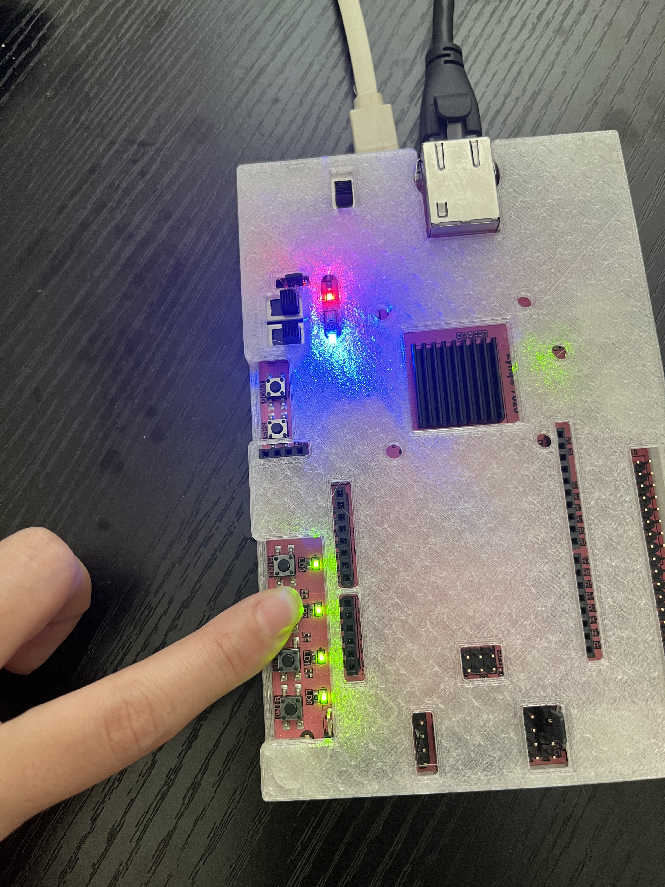</div>

We use another RGB LED as the fifth output to stand for the ```0x1f```.

## Part IV
The table below outlines the characters that should be displayed corresponding to each value of the 4-bit input combination c3c2c1c0. It specifically includes valid Fibonacci numbers ranging from 0 to 8. If the input does not correspond to a valid Fibonacci number within this range, the character 'E' (representing "Error") should be displayed.

Note: Only the Fibonacci numbers within the specified range are considered valid. Any other input is treated as invalid, resulting in an 'E' display output.

<div align=center>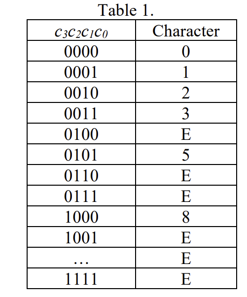</div>

1. Write the Verilog module as described.

2. Simulate with a test bench.

3. Configure the circuit's input to be controlled by pressing a button on the FPGA board and map the circuit's input to press buttons and output to illuminate one of the LEDs on the board.

4. We converted integers to a seven-segment display in Python, but we added the ```AXI_GPIO``` IP to read the data of the LEDs.

### Add the source file

**part_4.v**
```verilog
// Define a module named part_4
module part_4(
   input [3:0] din,        // 4-bit input 'din' representing the data input
   output reg [3:0] valid  // 4-bit output 'valid' to hold the Fibonacci number matching the input or a default value
);

    // Local parameters representing predefined Fibonacci numbers
    localparam dout_0 = 8'h00,  // Define the first Fibonacci number
                dout_1 = 8'h01,  // Define the second Fibonacci number
                dout_2 = 8'h02,  // Define the third Fibonacci number
                dout_3 = 8'h03,  // Define the fourth Fibonacci number
                dout_4 = 8'h05,  // Define the fifth Fibonacci number
                dout_5 = 8'h08;  // Define the sixth Fibonacci number
        
    // Always block triggers on any change to 'din'
    always @(*) begin
        case(din) // Begin case statement to compare 'din' with known Fibonacci numbers
            dout_0: begin
                    valid = dout_0; // If 'din' is the first Fibonacci number, output the same
                    end
            dout_1: begin
                    valid = dout_1; // If 'din' is the second Fibonacci number, output the same
                    end
            dout_2: begin
                    valid = dout_2; // If 'din' is the third Fibonacci number, output the same
                    end
            dout_3: begin
                    valid = dout_3; // If 'din' is the fourth Fibonacci number, output the same
                    end
            dout_4: begin
                    valid = dout_4; // If 'din' is the fifth Fibonacci number, output the same
                    end
            dout_5: begin
                    valid = dout_5; // If 'din' is the sixth Fibonacci number, output the same
                    end
            default: begin
                    valid = 4'b1110; // If 'din' does not match any predefined Fibonacci number, output a default value (1110)
                    end
        endcase
    end
    
endmodule // End of module part_4

```

 Add constraints code: `part_2.xdc`.

```verilog
# PYNQ Pin Assignments
############################
# On-board Slide Buttons  #
############################
set_property PACKAGE_PIN L19 [get_ports {din_0[3]}]
set_property PACKAGE_PIN L20 [get_ports {din_0[2]}]
set_property PACKAGE_PIN D20 [get_ports {din_0[1]}]
set_property PACKAGE_PIN D19 [get_ports {din_0[0]}]

############################
# On-board leds             #
############################
set_property PACKAGE_PIN M14 [get_ports {valid_0[3]}]
set_property PACKAGE_PIN N16 [get_ports {valid_0[2]}]
set_property PACKAGE_PIN P14 [get_ports {valid_0[1]}]
set_property PACKAGE_PIN R14 [get_ports {valid_0[0]}]

set_property IOSTANDARD LVCMOS33 [get_ports {din_0[3]}]
set_property IOSTANDARD LVCMOS33 [get_ports {din_0[2]}]
set_property IOSTANDARD LVCMOS33 [get_ports {din_0[1]}]
set_property IOSTANDARD LVCMOS33 [get_ports {din_0[0]}]
set_property IOSTANDARD LVCMOS33 [get_ports {valid_0[3]}]
set_property IOSTANDARD LVCMOS33 [get_ports {valid_0[2]}]
set_property IOSTANDARD LVCMOS33 [get_ports {valid_0[1]}]
set_property IOSTANDARD LVCMOS33 [get_ports {valid_0[0]}]

```


### Run Simulation

**tb_4.v**
``` verilog
// Define a testbench module named tb_4 for testing the part_4 module
module tb_4();
    reg [3:0] din_t;      // Define a 4-bit register 'din_t' for driving the input to the DUT (Device Under Test)
    wire [3:0] dout_t;    // Define a 4-bit wire 'dout_t' to receive the output from the DUT

    // Initial block to initialize test values
    initial begin
        din_t = 0;       // Start testing with the input value 0
    end

    // Always block to increment 'din_t' every 10 time units
    always #10 din_t = din_t + 1; // Increment 'din_t' every 10 simulation time units to test different values

    // Instantiate the Device Under Test (DUT): part_4 module
    part_4 myFibonacci_task(
        .din(din_t),     // Connect the testbench 'din_t' to the DUT 'din'
        .valid(dout_t)   // Connect the DUT 'valid' output to the testbench 'dout_t'
    );

endmodule // End of the testbench module tb_4

```

<div align=center>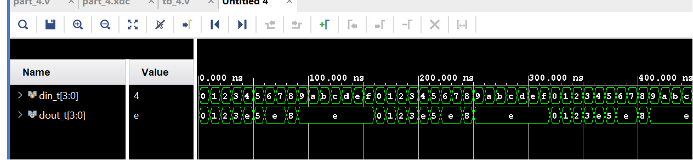</div>

### Implementation

The part can reference the [Generate Bitstream](https://uri-nextlab.github.io/ParallelProgammingLabs/Labs/Lab1_led.html#generate-the-bitstream) in lab1.
We add the AXI_GPIO, double click on the IP, and have the setting like below:

<div align=center>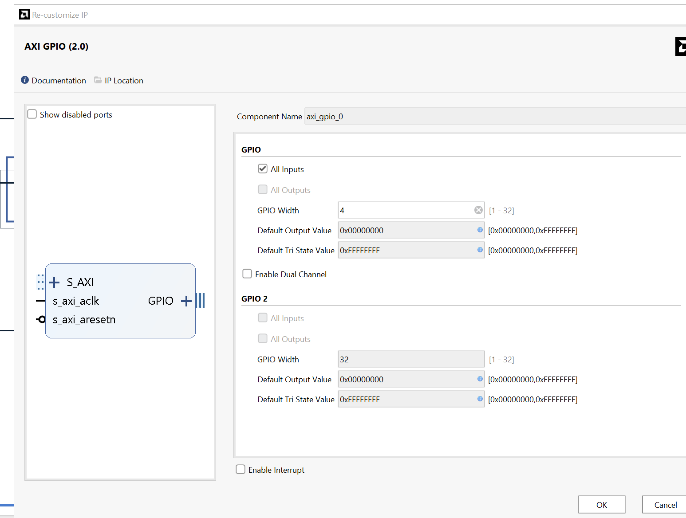</div>

Then we need to click on the green words like ```Run Block Automation``` and connect the ```FCLK_CLK0``` and ```M_AXI_GP0_ACLK``` together.
The block design is shown below:

<div align=center>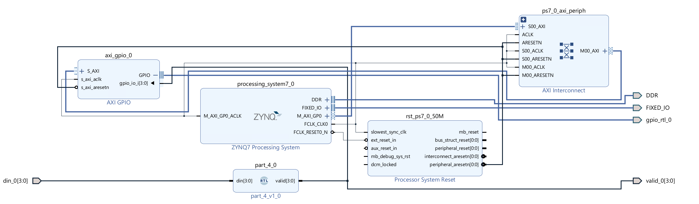</div>


### Download the bitstream file to PYNQ

We need to download the design_1_wrapper.bit to the local machine. Go to Lab7/project_1/project_1.runs/impl_1, download design_1_wrapper.bit, and upload the file to the PYNQ. And we also need the ```.hwh``` file in the /project_1/project_1.gen/sources_1/bd/design_1/hw_handoff and upload the file to the PYNQ like below:

<div align=center>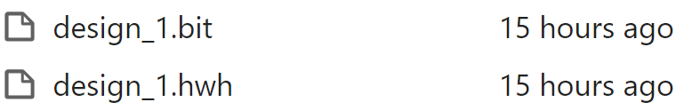</div>

```python
from pynq import Overlay
from pynq import Bitstream
bit = Bitstream("design_1.bit")
#keep the name of the bit file and hwh file the same
bit.download()
bit.bitfile_name
#download the file to the board
```
```python
overlay = Overlay('design_1.bit')
# Dictionary containing the patterns for each character to be displayed on a 7-segment-like display.
# Each character is represented by a tuple of five strings, each representing a line.

representations = {
    '0': ('###', '# #', '# #', '# #', '###'),
    '1': ('  #', '  #', '  #', '  #', '  #'),
    '2': ('###', '  #', '###', '#  ', '###'),
    '3': ('###', '  #', '###', '  #', '###'),
    '4': ('# #', '# #', '###', '  #', '  #'),
    '5': ('###', '#  ', '###', '  #', '###'),
    '6': ('###', '#  ', '###', '# #', '###'),
    '7': ('###', '  #', '  #', '  #', '  #'),
    '8': ('###', '# #', '###', '# #', '###'),
    '9': ('###', '# #', '###', '  #', '###'),
    'e': ('###', '#  ', '###', '#  ', '###'),
}

def seven_segment(number):
    # treat the number as a string since that makes it easier to deal with
    # on a digit-by-digit basis
    digits = [representations[digit] for digit in str(number)]
    # Now digits is a list of 5-tuples, each representing a digit in the given number
    # We'll print the first lines of each digit, the second lines of each digit, etc.
    for i in range(5):
        print("  ".join(segment[i] for segment in digits))
```

```python
led=overlay.leds_gpio
#define the leds_gpio, and then we can read the values of the LEDs
```
If you press the third button, which means the input data is 4, then the three LEDs will be on, which means the value is e

<div align=center>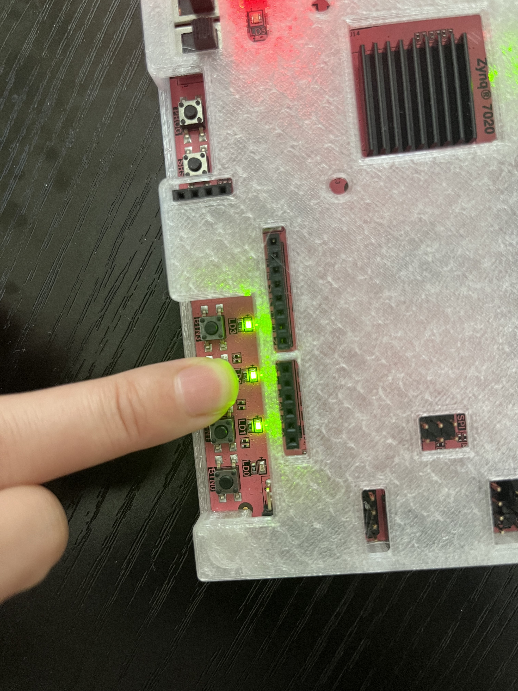</div>

At the same time, you can run the code below:
```python
state=hex(led.read())
seven_segment(state[-1])
#display the values of the LEDs
```
You can see the state is ```e```

<div align=center>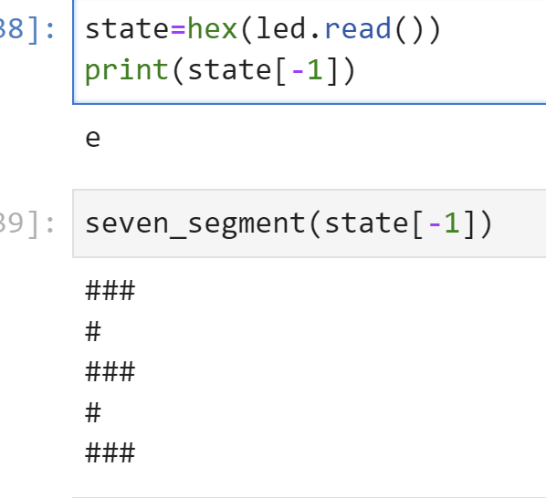</div>

If you press the first button, which means the input is 1, then the first LED will light as shown below:

<div align=center>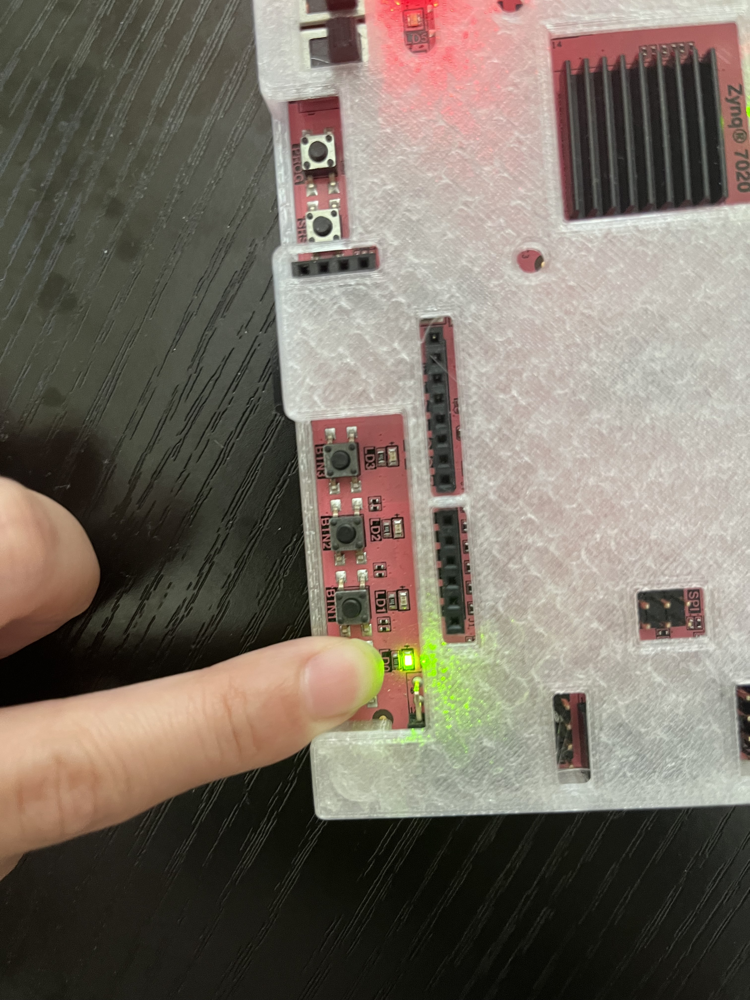</div>

At the same time, you can run the code below:
```python
state=hex(led.read())
seven_segment(state[-1])
#display the values of the LEDs
```
You can see:

<div align=center>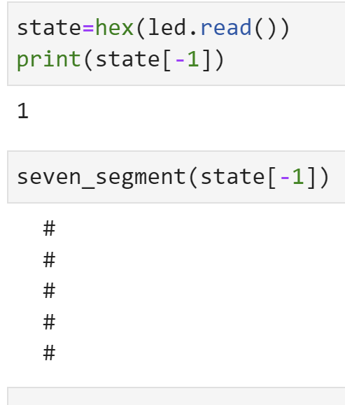</div>

## Part V

Create a structural design that incorporates various components to form a complete system. This system will accept a four-bit input representing a number and a single-bit selection signal for a multiplexer.

* Inputs: A four-bit code (c3c2c1c0) Represents the current number to be evaluated or displayed.
  A one-bit select line (sel) Controls the operation mode of the multiplexer.
  
* Outputs: A single-bit signal (valid): Indicates whether the provided four-bit input corresponds to a valid Fibonacci number.
Display Output: Controlled by the multiplexer, it can either show the current input or the next Fibonacci number based on the sel signal

The structural design should link all components logically and efficiently to meet the specified requirements.
The display output, influenced by the multiplexer, should accurately reflect either the current input or the subsequent Fibonacci number, depending on the state of the sel line.
All components should be appropriately sized in bit width to handle the required input and output values range.

1. Write the Verilog module as described.

2. Simulate with a test bench.

3. Configure the circuit's input to be controlled by pressing a button on the FPGA board and map the circuit's input to press buttons and output to illuminate one of the LEDs on the board.

4. We converted integers to a seven-segment display in Python, but we added the ```AXI_GPIO``` IP to write the ```sel``` and read the output value data.
   
### Add the source file

**test_5.v**
```verilog
// Define a module named Lab1_5
module test_5(
  input [3:0] din,          // 4-bit input 'din' representing the data input
  input sel,                // Single-bit input 'sel' used for selection in the display module
  output [4:0] valid_put,   // 5-bit output 'valid_put' from the display module
  output dout               // Single-bit output 'dout' from the test_2 module
);

    // Instantiate test_2 module named one_put
    test_2 one_put(
        .din(din),          // Connect 'din' from Lab1_5 to 'din' in test_2
        .valid(dout)        // Connect 'dout' from test_2 to 'dout' in Lab1_5
    );
    
    // Instantiate test_1 module named display
    test_1 display(
        .sel(sel),          // Connect 'sel' from Lab1_5 to 'sel' in test_1
        .din(din),          // Connect 'din' from Lab1_5 to 'din' in test_1
        .y(valid_put)       // Connect 'valid_put' from test_1 to 'valid_put' in Lab1_5
    );
    
endmodule // End of module Lab1_5

```
**test_1.v**
```verilog
// Define a module named test_1
module test_1(
    input sel,                  // Single-bit input 'sel' used for selecting between current and next valid values
    input [3:0] din,            // 4-bit input 'din' representing the data input
    output reg [4:0] y          // 5-bit output 'y' to hold the current or next valid value based on 'sel'
);

    // Wire to hold the next valid value calculated by test_3
    wire [4:0] next_vaild;

    // Instantiate test_3 module named next
    // This IP actually is the code of part III (as indicated by the comment)
    test_3 next(
        .din(din),              // Connect 'din' from test_1 to 'din' in test_3
        .valid(next_vaild)      // Connect 'next_vaild' from test_3 to 'next_vaild' in test_1
    );

    // Wire to hold the current valid value calculated by test_4
    wire [3:0] current_vaild;

    // Instantiate test_4 module named current
    // This IP actually is the code of the part IV (as indicated by the comment)
    test_4 current(
        .din(din),              // Connect 'din' from test_1 to 'din' in test_4
        .valid(current_vaild)   // Connect 'current_vaild' from test_4 to 'current_vaild' in test_1
    );

    // Always block to select between the current valid value and the next valid value based on 'sel'
    always @(*) begin
        if(sel == 1'b0)
            y = {1'b0, current_vaild}; // If 'sel' is 0, assign 'current_vaild' to 'y' (extended to 5 bits)
        else
            y = next_vaild;            // If 'sel' is 1, assign 'next_vaild' to 'y'
    end

endmodule // End of module test_1

```

**test_2.v**
```verilog
// Define a module named test_2
module test_2(
    input [3:0] din,      // 4-bit input 'din' representing the data input
    output reg valid      // Single-bit output 'valid' indicating if 'din' is a Fibonacci number
);

    // Register to hold the validation status for each Fibonacci number
    reg [6:0] out_valid;
    // Temporary register to hold the current Fibonacci number being checked
    reg [3:0] data;

    // Initial block to populate the 'dout' array with the first seven Fibonacci numbers
   localparam [3:0] dout[7] = {4'h0, 4'h1, 4'h2, 4'03, 4'h5, 4'h8, 4'hD}; 
    
    // Integer used for loop indexing
    integer i;
    // Always block to check if 'din' is a Fibonacci number
    always @(*) begin
        for (i = 0; i < 7; i = i + 1) begin
            data = dout[i];        // Assign the current Fibonacci number to 'data'
            if(din == data)        // Check if input 'din' matches the current Fibonacci number
                out_valid[i] = 1'b1; // If match, set corresponding bit in 'out_valid'
            else
                out_valid[i] = 1'b0; // If not, clear corresponding bit in 'out_valid'
        end          
    end

    // Always block to set 'valid' output based on 'out_valid' contents
    always @(*) begin
        if(out_valid == 7'd0) // Check if none of the Fibonacci numbers matched 'din'
            valid = 1'b0;     // If no match, set 'valid' to 0
        else
            valid = 1'b1;     // If there's a match, set 'valid' to 1
    end

endmodule // End of module test_2

```
You can see the ```Schematic``` under the RTL ANALYSIS as shown below:

<div align=center>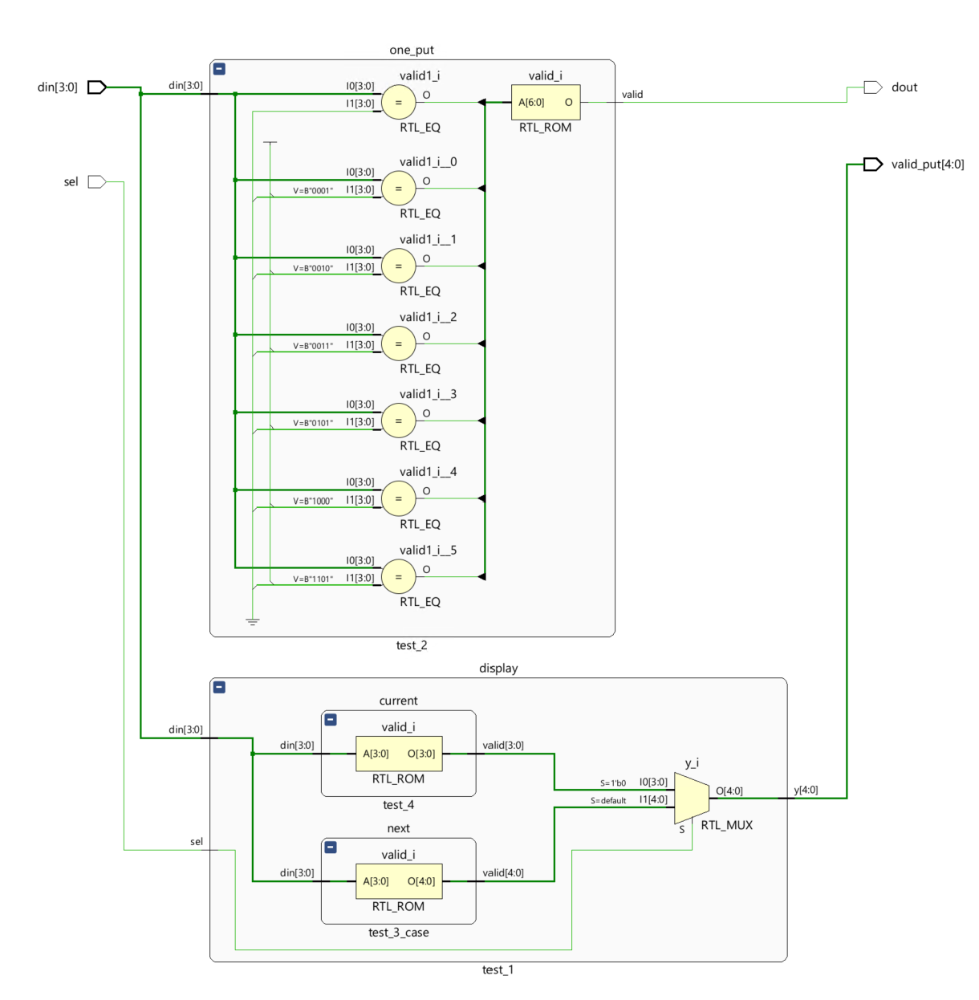</div>


Add constraints code: `part_2.xdc`.

```verilog
# PYNQ Pin Assignments
############################
# On-board Slide Buttons  #
############################
set_property PACKAGE_PIN R14 [get_ports dout_0]
set_property IOSTANDARD LVCMOS33 [get_ports dout_0]
set_property PACKAGE_PIN L19 [get_ports {din_0[3]}]
set_property PACKAGE_PIN L20 [get_ports {din_0[2]}]
set_property PACKAGE_PIN D19 [get_ports {din_0[0]}]
set_property PACKAGE_PIN D20 [get_ports {din_0[1]}]
set_property IOSTANDARD LVCMOS33 [get_ports {din_0[3]}]
set_property IOSTANDARD LVCMOS33 [get_ports {din_0[2]}]
set_property IOSTANDARD LVCMOS33 [get_ports {din_0[1]}]
set_property IOSTANDARD LVCMOS33 [get_ports {din_0[0]}]


```


### Run Simulation

**tb_5.v**
``` verilog
// Define a testbench module named tb_5 for testing the Lab1_5 module
module tb_5();
    reg [3:0] din_t;       // Define a 4-bit register 'din_t' for driving the input to the DUT (Device Under Test)
    reg sel_t;             // Define a single-bit register 'sel_t' for selecting between two different modes or values in the DUT
    wire [4:0] valid_t;    // Define a 5-bit wire 'valid_t' to receive the output from the DUT
    wire one_put;          // Define a single-bit wire 'one_put' to receive another output from the DUT

    // Initial block to initialize test values
    initial begin
        din_t = 0;        // Start testing with the input value 0
    end

    // Always block to increment 'din_t' every 10 time units
    always #10 din_t = din_t + 1; // Increment 'din_t' every 10 simulation time units to test different values

    // Initial block for handling the selection input 'sel_t' and its timing
    initial begin
        // Test case 1: 'sel_t' set to 0
        sel_t = 0;       // Set 'sel_t' to 0 for the first part of the testing
        #20;             // Wait for 20 time units

        // Test case 2: 'sel_t' set to 1
        sel_t = 1;       // Change 'sel_t' to 1 for the second part of the testing
        #20;             // Wait for another 20 time units

        // Additional test cases can be added here as needed
    end

    // Instantiate the Device Under Test (DUT): Lab1_5 module
    test_5 myFibonacci_task(
        .valid_put(valid_t), // Connect the testbench 'valid_t' to the DUT 'valid_put'
        .din(din_t),         // Connect the testbench 'din_t' to the DUT 'din'
        .sel(sel_t),         // Connect the testbench 'sel_t' to the DUT 'sel'
        .dout(one_put)       // Connect the DUT 'one_put' to the testbench 'one_put'
    );

endmodule // End of the testbench module tb_5

```

<div align=center>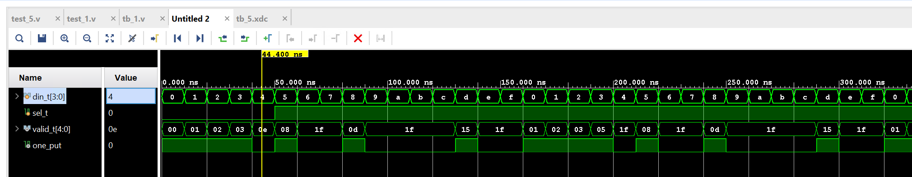</div>

### Implementation

The part can reference the [Generate Bitstream](https://uri-nextlab.github.io/ParallelProgammingLabs/Labs/Lab1_led.html#generate-the-bitstream) in lab1.
The setting of the ```AXI_GPIO``` is the same as part IV.

The block design is shown below:

<div align=center>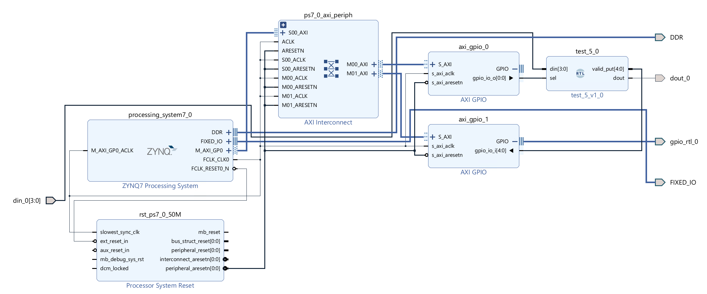</div>

The AXI GPIO block will be assigned memory-mapped addresses that the processor can access. These addresses are used to control the GPIO pins and read their status. The memory mapping allows the processor to interact with the GPIO through standard read and write operations to specific addresses associated with the GPIO functions. We can get the addresses of the two GIPOs below:

<div align=center>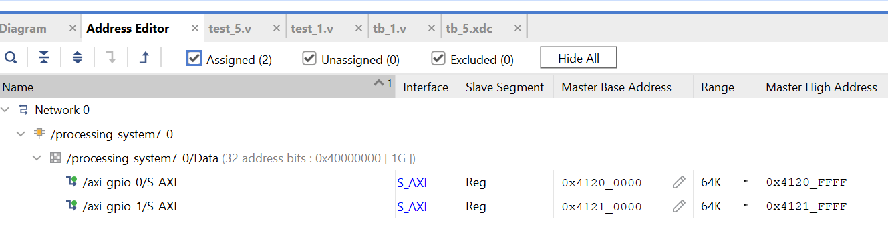</div>

### Download the bitstream file to PYNQ

We need to download the design_1_wrapper.bit to the local machine. Go to Lab7/project_1/project_1.runs/impl_1 and download design_1_wrapper.bit, and upload the file to the PYNQ.


```python
from pynq import Overlay
from pynq import Bitstream
bit = Bitstream("design_1.bit")
bit.download()
bit.bitfile_name

```

```python
# Import the MMIO class from the PYNQ library to interface with memory-mapped I/O registers.
from pynq import MMIO

# Define constants for the GPIO base address and the range of memory it covers.
# The base address is where the GPIO registers start in the memory map.
GPIO_BASE_ADDRESS = 0X41200000  # Base address for the GPIO block
GPIO_RANGE = 0x1000             # Size of the memory-mapped area for GPIO
gpio = MMIO(GPIO_BASE_ADDRESS, GPIO_RANGE)

representations = {
    '0': ('###', '# #', '# #', '# #', '###'),
    '1': ('  #', '  #', '  #', '  #', '  #'),
    '2': ('###', '  #', '###', '#  ', '###'),
    '3': ('###', '  #', '###', '  #', '###'),
    '4': ('# #', '# #', '###', '  #', '  #'),
    '5': ('###', '#  ', '###', '  #', '###'),
    '6': ('###', '#  ', '###', '# #', '###'),
    '7': ('###', '  #', '  #', '  #', '  #'),
    '8': ('###', '# #', '###', '# #', '###'),
    '9': ('###', '# #', '###', '  #', '###'),
    'e': ('###', '#  ', '###', '#  ', '###'),
}

def seven_segment(number):
    # treat the number as a string since that makes it easier to deal with
    # on a digit-by-digit basis
    digits = [representations[digit] for digit in str(number)]
    # now digits is a list of 5-tuples, each representing a digit in the given number
    # We'll print the first lines of each digit, the second lines of each digit, etc.
    for i in range(5):
        print("  ".join(segment[i] for segment in digits))
```
```python
DATA_OFFSET = 0X0  # Offset for the data register within the GPIO space
DATA = 0X1        # Data to be written 
#control the sel value to determine the output is the current value or the next value
gpio.write(DATA_OFFSET,DATA)
```
Then the first LED will light as shown below:

<div align=center>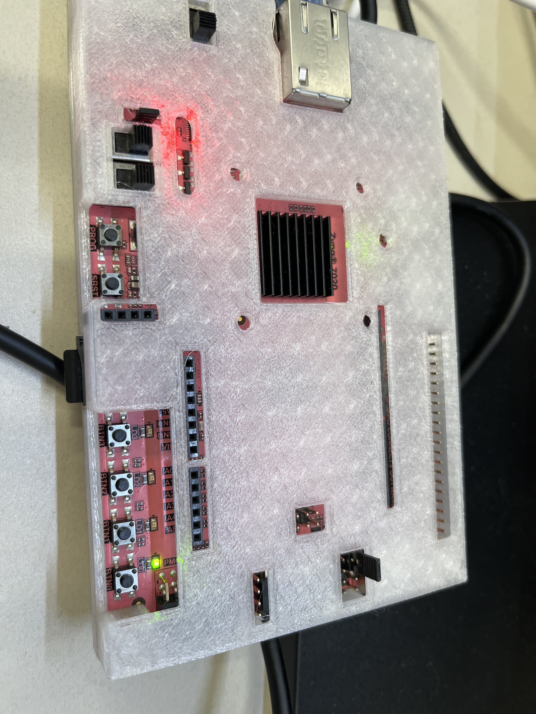</div>

At the same time, you can run the code below:

```python
GPIO_BASE_ADDRESS = 0X41210000
GPIO_RANGE = 0x1000
gpio = MMIO(GPIO_BASE_ADDRESS, GPIO_RANGE)
#input is 0, then output data will be 1
seven_segment(gpio.read(0X00))
```
We will see:

<div align=center>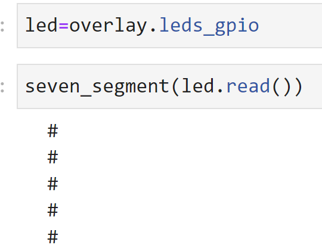</div>

If you change the sel value to 0, you can run the code below:
```python
GPIO_BASE_ADDRESS = 0X41200000
GPIO_RANGE = 0x1000
gpio = MMIO(GPIO_BASE_ADDRESS, GPIO_RANGE)
DATA_OFFSET = 0X0  # Offset for the data register within the GPIO space
DATA = 0X0        # Data to be written 

#change the sel value to the 0
gpio.write(DATA_OFFSET,DATA)

```
And when you press the second button, you can run the coding at the same time
```python
GPIO_BASE_ADDRESS = 0X41210000
GPIO_RANGE = 0x1000
gpio = MMIO(GPIO_BASE_ADDRESS, GPIO_RANGE)


state=hex(gpio.read())
seven_segment(state[-1])


```
We will see:

<div align=center>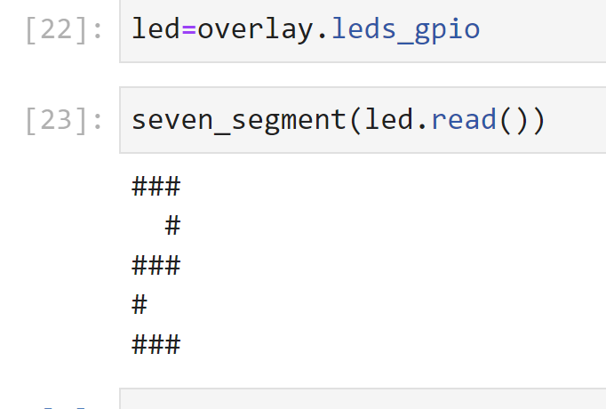</div>
