# Lab8_State_Machines

## Lab Overview

This lab aims to implement a state machine that acts as a lock. The requirements of this
The lab consists of understanding the design requirements for implementing the Verilog design.

## Background

State machines are very useful tools in any computer system. They make it easy to visualize and solve
all kinds of problems. A state machine is a device that keeps track of the `state` of something. That `state` can change due to changes to input values or through some pre-determined sequence. A common example
might be a traffic signal at an intersection. The `state` describes how the lights at the intersection may be lit at a given
time. The status will change regularly after fixed time intervals for simple timed lights. The same lights could be made
more intelligent by incorporating sensor inputs that detect whether cars are waiting, causing the state to change
differently. That might be from a radar detector or magnetic coil in the road. Additional lights could incorporate a
pedestrian crossing, so a pedestrian crosswalk request button could be another input.

Every state machine must have some initial state to ensure everything begins properly and a reset signal to return
to that initialization. There are two main categories of state machines, ```Moore``` and ```Mealy```. A Moore machine is a state machine whose output values are determined only by its current state. A ```Mealy``` machine is defined as a state
machine whose output values are determined by its current state and current inputs. 

<div align=center>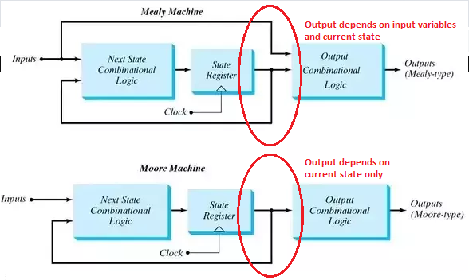</div>


## Part I(Design Requirements)

You must design a ```Moore``` state machine that controls a digital lock. Your lock
should have three inputs: a reset, a submit (clock) bit, and a decimal digit (4-bit) input. The decimal digit input will encode the
decimal digits 0-9 in the standard unsigned binary encoding. You will input 3-digit codes by setting the decimal
digit input to a number and activating the submit bit three times in a row. To unlock your device, it should
receive three correct digits. In addition, there will be three `Tamper Freeze` sequences, which will freeze the device until a
reset signal is received. You can use these sequences:

`Correct` sequence: “642”

`Tamper Freeze` sequence: “641”; “652”; “643”

Your digital lock will have three outputs: a Locked bit, a Ready bit, and a Tamper bit. The Locked bit and Ready bits should initially be on. After you input your first digit, the Ready bit should turn off. If the correct input sequence is observed, the Locked bit should turn off and remain off until the lock is reset. No further inputs should affect the
device. If one of the Tamper Freeze sequences is observed, the Tamper bit should be turned on and remain on until the reset is activated. No further inputs should affect the device. If any other input is observed, the device should return to the ready state by activating the Ready bit and waiting to accept the next 3-digit input.

You can also understand the process by the table below:

<div align=center>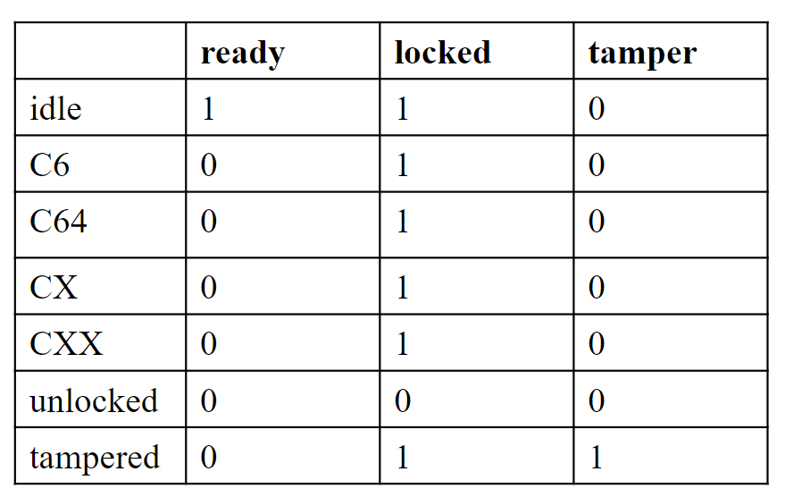</div>

### Add the source file


**digital_lock.v**
```verilog

module digital_lock(
    input clk,           // Clock input
    input submit,        // Submit button used to submit the current digit
    input reset,         // Reset input to return the lock to its initial state
    input [2:0] dint,    // 3-bit digital input representing the entered code
    output reg locked,   // Indicates whether the lock is currently locked
    output reg ready,    // Indicates whether the system is ready to receive input
    output reg tamper,   // Indicates a tampering attempt
    output reg [2:0] led // LED outputs reflecting the current input
);

    // State definitions for the finite state machine (FSM)
    reg [3:0] state;  // Current state of the lock
    localparam idle = 4'd0,       // Idle state waiting for input
               C_6 = 4'd1,       // State indicating the first digit (6) has been entered correctly
               C_64 = 4'd2,      // State indicating the first two digits (6,4) have been entered correctly
               C_65 = 4'd3,      // Unused state. You might want to remove or update this comment
               C_X = 4'd4,       // State for an incorrect initial digit
               C_XX = 4'd5,      // State for an incorrect sequence after the first digit
               unlocked = 4'd6,  // State where the lock is unlocked
               tampered = 4'd7;  // State indicating a tampering attempt

    // The next state logic variable
    reg [3:0] next_state;

    // Sequential logic for state transitions
    always @(posedge submit or negedge reset)
    begin
        if(!reset)
            state <= idle;  // Reset to initial state
        else
            state <= next_state;   // Move to the next state on the submit press
    end
    
    // Combinational logic for state transitions and output controls
    always @(*)
    begin
        // Default actions for each state
        ready = 1'b1;
        locked = 1'b1;
        tamper = 1'b0;
        next_state = idle;  // By default, return to idle unless a condition below is met

        case(state)
            idle:
                begin
                    // In idle state, the system is ready and locked. Awaiting correct input
                    if(dint == 3'b110)
                        next_state = C_6;  // Correct first digit
                    else 
                        next_state = C_X;  // Incorrect first digit              
                end
            C_6:
                begin 
                    //The first digit was correct, ready for the second
                    ready = 1'b0;  // System not ready for new input until next submit
                    if(dint == 3'b100)                           
                        next_state = C_64; // Correct second digit
                    else
                        next_state = C_XX; // Incorrect second digit
                end
            C_64:
                begin
                    // First two digits correct; decide on the final digit
                    if(dint == 3'b010)
                        next_state = unlocked; // Unlock if correct final digit
                    else if(dint == 3'b001)
                        next_state = tampered; // Tamper detected
                end     
            // Other states follow a similar pattern
            C_X:
                begin
                // For other incorrect data
                    ready = 1'b0;
                    tamper = 1'b0;
                    locked = 1'b1;
                    next_state = C_XX;
                end
            C_XX:
                begin
                    ready = 1'b0;
                    tamper = 1'b0;
                    locked = 1'b1;
                    next_state = idle;                  
                end
            unlocked:
                    begin
                        // Lock is unlocked. Stay in this state until reset
                        ready = 1'b0;
                        locked = 1'b0;  // Lock remains unlocked
                        next_state = unlocked; // Stay in this state
                    end
            tampered:
                    begin
                        // Tampering detected, lock remains locked and indicates tampering
                        ready = 1'b0;
                        tamper = 1'b1;
                        next_state = tampered; // Stay in this state
                    end
            default:
                    begin
                        ready = 1'd1;
                        tamper = 1'd0;
                        locked = 1'd1;
                        next_state = idle;
                    end       
        endcase
        // Reflect input digits on LEDs

    led = dint;
      
    end
     
endmodule


```


**tb_2**
```verilog
module tb_2();
    reg clk;
    reg submit;
    reg reset;
    reg [2:0] dint;  // Input digit to the lock
    wire locked;    // Indicates if the lock is in a locked state
    wire ready;     // Indicates if the lock is ready for new input
    wire tamper;    // Indicates if a tampering attempt has been detected
    wire [2:0] led; // Shows the current digit input through LEDs
    
    digital_lock test(
    .clk(clk),
    .submit(submit),
    .reset(reset),
    .dint(dint),
    .locked(locked),
    .ready(ready),
    .tamper(tamper),
    .led(led));

// Initial block for test sequence
    initial begin
            clk <= 0;      // Initialize the clock
            submit <= 0;   // Initialize the submit button as not pressed
            reset <= 0;    // Start with the lock in the reset state
            dint <= 0;     // Initialize the input digit
            #20;           // Wait for 20ns
            reset <= 1;    // Release the reset to start the lock operation
            #20;           // Wait for 20ns
                
	        // First input sequence: 6-2-1
            dint <= 3'b110;  // Set digit to 6
            #20;
            submit <= 1;     // Submit the digit
            #20;             
            submit <= 0;     // Release the submit button
            dint <= 3'b010;  // Set digit to 2
            #20;
            submit <= 1;     // Submit the digit
            #20;             
            submit <= 0;     // Release the submit button
            dint <= 3'b001;  // Set digit to 1
            #20;
            submit <= 1;     // Submit the digit
            #20;             
            submit <= 0;     // Release the submit button
            #20;		
			
			// input 6-4-2
			dint		<=	6;
			#20;
			submit 	<=	1;
			#20;				
			submit 	<=	0;
			dint		<=	4;
			#20
			submit 	<=	1;
			#20;				
			submit 	<=	0;
			dint		<=	2;
			#20
			submit 	<=	1;
			#20;				
			submit 	<=	0;
			#20;		
			
			// input 6-4-2
			dint		<=	6;
			#20;
			submit 	<=	1;
			#20;				
			submit 	<=	0;
			dint		<=	4;
			#20
			submit 	<=	1;
			#20;				
			submit 	<=	0;
			dint		<=	2;
			#20
			submit 	<=	1;
			#20;				
			submit 	<=	0;
			#20;	
			
			// reset
			reset 		<=	0;
			#20;
			reset 		<=	1;
			#20;
			
			// input 6-4-1
			dint		<=	6;
			#20;
			submit 	<=	1;
			#20;				
			submit 	<=	0;
			dint		<=	4;
			#20
			submit 	<=	1;
			#20;				
			submit 	<=	0;
			dint		<=	1;
			#20
			submit 	<=	1;
			#20;				
			submit 	<=	0;
			#20;		
			
			// input 6-4-1
			dint		<=	6;
			#20;
			submit 	<=	1;
			#20;				
			submit 	<=	0;
			dint		<=	4;
			#20
			submit 	<=	1;
			#20;				
			submit 	<=	0;
			dint		<=	1;
			#20
			submit 	<=	1;
			#20;				
			submit 	<=	0;
			#20;		
			// reset
			reset 		<=	0;
			#20;
			reset 		<=	1;
			#20;
    end

  always #10 clk = ~clk;

endmodule


```

Considering that the button press is at a high level, it is necessary to debounce the button to ensure the stability of the data.

**btn_digit.v**
```verilog
// Module for processing button inputs and interfacing with a digital lock system
module btn_digit (
    input clk,         // Clock input
    input rst,         // Reset input
    input key,         // Button input from the user
    input [2:0] dint,  // 3-bit digital input representing a numerical value
    output locked,     // Indicates whether the lock is currently locked
    output ready,      // Indicates whether the system is ready to receive input
    output tamper,     // Indicates a tampering attempt
    output [2:0] led   // LED outputs reflecting the current input or state
);

    // Intermediate signals and registers
    wire key_pulse;          // Pulse generated when a key press is detected

    reg [7:0] key_buffer;    // Buffer to hold the state of the key press
    reg key_reg;             // Register to hold the immediate state of the key

    // Synchronize the key press to the system clock and reset
    always @(posedge clk or negedge rst)
    begin
        if (!rst)
            key_reg <= 1'd0;    // Clear the key register on reset
        else
            begin
                if (key == 1'd1)
                    key_reg <= 1'd1;  // Set key register if the key is pressed
                else 
                    key_reg <= 1'd0;  // Clear key register if the key is not pressed           
            end       
    end
    
    // Buffer the key press status for each bit, synchronizing with the system clock
    integer i; // Loop variable
    always @(posedge clk or negedge rst)
    begin
        if (!rst)
            key_buffer <= 8'd0;  // Reset the key buffer
        else
            begin
                for (i = 0; i < 8; i = i + 1)
                    begin
                        if (key_reg == 1'd1)
                            key_buffer[i] = 1'd1;  // Set each bit if key is pressed
                        else
                            key_buffer[i] = 1'd0;  // Clear each bit if key is not pressed
                    end            
            end  
    end
    
    // Generate a key pulse signal when all bits in the buffer are set
    assign key_pulse = key_buffer & 8'hFF;  // Produces a pulse when all bits of key_buffer are high
    
    // Instantiate the digital_lock module, passing the necessary signals
    digital_lock dut(
        .dint(dint),      // Pass the digit input
        .reset(rst),      // Pass the reset signal
        .submit(key_pulse), // Use the generated key pulse as the submit signal
        .locked(locked),  // Connect the locked status output
        .tamper(tamper),  // Connect the tamper status output
        .ready(ready),    // Connect the ready status output
        .led(led)         // Connect the LED output
    );    

endmodule

```


We can run a Simulation to check the code by clicking the ```Run Simulation``` under ```SIMULATION``` and choose the first ```Run Behavioral Simulation```. 

<div align=center>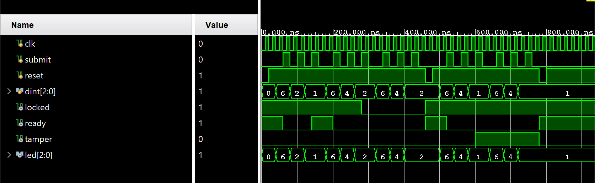</div>

Add constraints code: `lab2.xdc`.

```verilog
# PYNQ Pin Assignments
############################
# On-board Slide Buttons  #
############################
set_property PACKAGE_PIN N16 [get_ports {led_0[2]}]
set_property PACKAGE_PIN P14 [get_ports {led_0[1]}]
set_property PACKAGE_PIN R14 [get_ports {led_0[0]}]
set_property IOSTANDARD LVCMOS33 [get_ports {led_0[2]}]
set_property IOSTANDARD LVCMOS33 [get_ports {led_0[1]}]
set_property IOSTANDARD LVCMOS33 [get_ports {led_0[0]}]
set_property PACKAGE_PIN G14 [get_ports locked_0]
set_property PACKAGE_PIN M14 [get_ports ready_0]
set_property PACKAGE_PIN L15 [get_ports tamper_0]
set_property IOSTANDARD LVCMOS33 [get_ports locked_0]
set_property IOSTANDARD LVCMOS33 [get_ports ready_0]
set_property IOSTANDARD LVCMOS33 [get_ports tamper_0]


set_property PACKAGE_PIN L19 [get_ports submit_0]
set_property IOSTANDARD LVCMOS33 [get_ports submit_0]
```

### Implementation

The part can reference the [Generate Bitstream](https://uri-nextlab.github.io/ParallelProgammingLabs/Labs/Lab1_led.html#generate-the-bitstream) in lab1.

The block design is shown below:

<div align=center>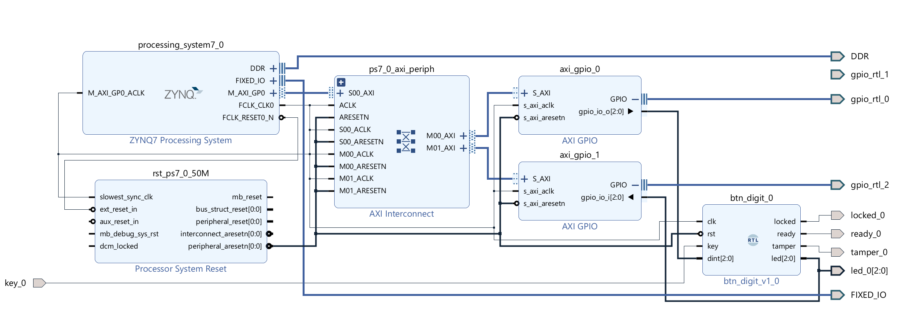</div>

Here, we use the ```AXI_GPIO``` IP, write the number to the ```dint``` as input and read the value of the LEDs as the display.

### Download the bitstream file to PYNQ

We need to download the design_1_wrapper.bit to the local machine. Go to Lab8/project_1/project_1.runs/impl_1, download design_1_wrapper.bit, and upload the file to the PYNQ. And we also need to upload the design_1.hwh  file which is in the Lab8/project_1/project_1.gen/sources_1/bd/design_1/hw_handoff.

```python
    from pynq import Overlay
    from pynq import Bitstream
    bit = Bitstream("design_1.bit")
    bit.download()
    bit.bitfile_name

```

When download the file on the board, you will see:

<div align=center>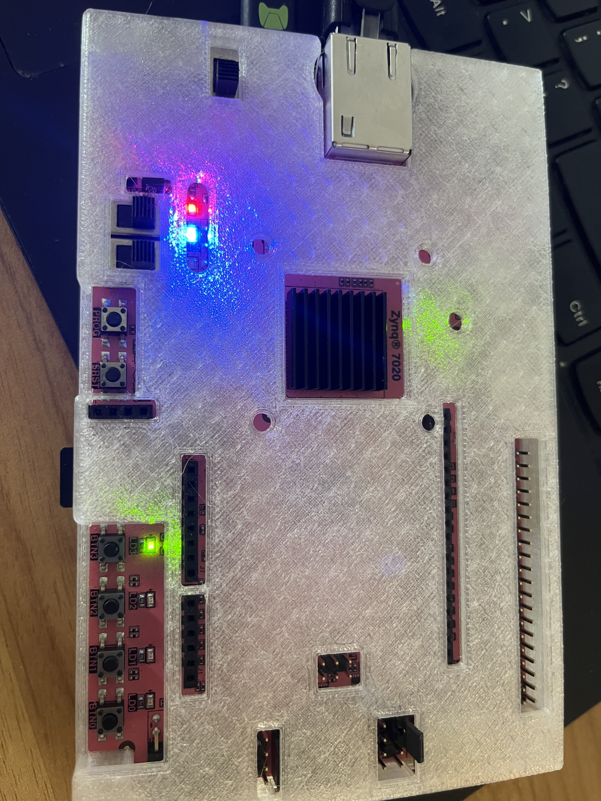</div>


```python
# Import the MMIO class from the PYNQ library. MMIO allows for memory-mapped I/O operations 
# from Python, enabling interaction with hardware registers on FPGA.
from pynq import MMIO

# Define the base address and range for the GPIO block designated for writing operations.
# This is typically set in the hardware design and must match that configuration.
GPIO_BASE_ADDRESS = 0X41200000  # Base address for the GPIO used for writing
GPIO_RANGE = 0x1000             # Address range covered by this GPIO

# Initialize an MMIO instance for writing, allowing the Python code to interact
# with the GPIO hardware mapped at the specified base address.
gpio_write = MMIO(GPIO_BASE_ADDRESS, GPIO_RANGE)

# Define the base address for the GPIO block designated for reading operations.
# This should also match the configuration specified in the hardware design.
GPIO_BASE_ADDRESS_r = 0X41210000  # Base address for the GPIO used for reading

# Note: This should likely be `GPIO_BASE_ADDRESS_r` based on context.
# Initialize an MMIO instance for reading.
gpio_read = MMIO(GPIO_BASE_ADDRESS_r, GPIO_RANGE)  # Should be GPIO_BASE_ADDRESS_r for the reading block

# Read the current state of the GPIO designated for reading. The `read` method
# accesses a specific offset within the mapped range; in this case, it reads
# from the base address of the GPIO (offset 0x0).
state = gpio_read.read(0x0)  # Read from the offset 0 of the GPIO block used for reading


```

```python
representations = {
    '0': ('###', '# #', '# #', '# #', '###'),
    '1': ('  #', '  #', '  #', '  #', '  #'),
    '2': ('###', '  #', '###', '#  ', '###'),
    '3': ('###', '  #', '###', '  #', '###'),
    '4': ('# #', '# #', '###', '  #', '  #'),
    '5': ('###', '#  ', '###', '  #', '###'),
    '6': ('###', '#  ', '###', '# #', '###'),
    '7': ('###', '  #', '  #', '  #', '  #'),
    '8': ('###', '# #', '###', '# #', '###'),
    '9': ('###', '# #', '###', '  #', '###'),
    '.': ('   ', '   ', '   ', '   ', '  #'),
}

def seven_segment(number):
    # treat the number as a string since that makes it easier to deal with
    # on a digit-by-digit basis
    digits = [representations[digit] for digit in str(number)]
    # Now digits is a list of 5-tuples, each representing a digit in the given number
    # We'll print the first lines of each digit, the second lines of each digit, etc.
    for i in range(5):
        print("  ".join(segment[i] for segment in digits))

```

```python
# Define the offset within the GPIO space where data will be written. Often, '0x0' is the offset for the output data register.
DATA_OFFSET = 0X0  # Offset for the data register in the GPIO space

# Define the data value to be written to the GPIO. For example, '0x6' could represent a specific pattern of bits to turn on LEDs.
DATA = 0X6  # Data to be written to the GPIO register

# Write the data to the GPIO device. This operation changes the state of GPIO pins configured as outputs.
gpio_write.write(DATA_OFFSET, DATA)  # Write the data to the register at the specified offset


```

When writing `6` to the input, see the board below:

<div align=center>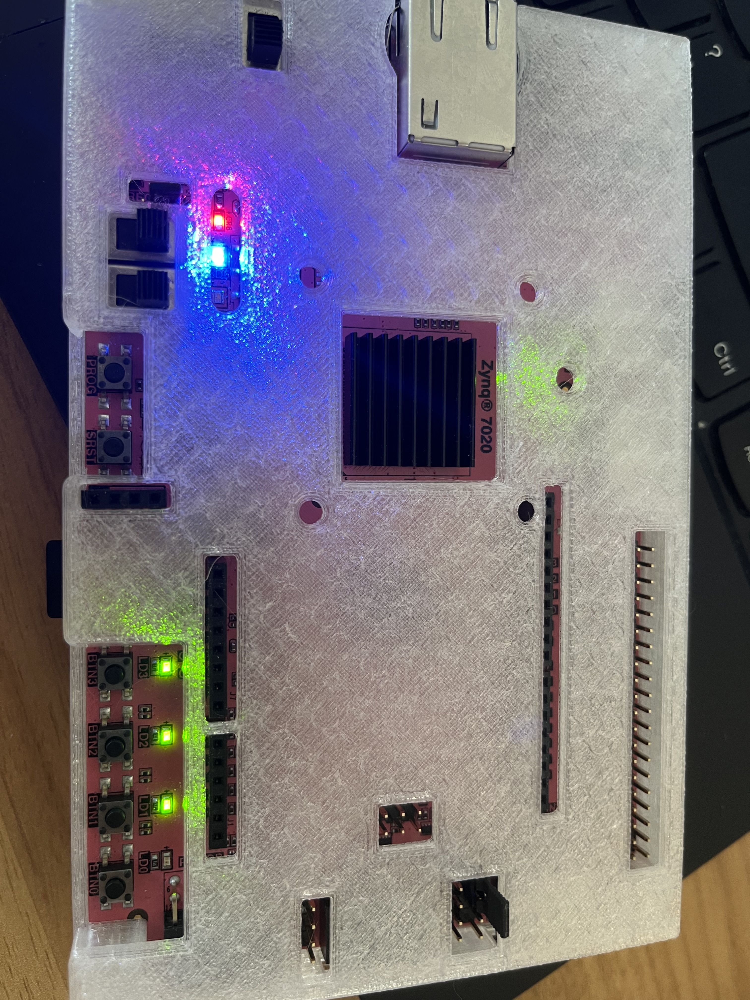</div>

The blue LED is on, showing it's locked.

And then you need to press the ```submit ``` button like below:

<div align=center>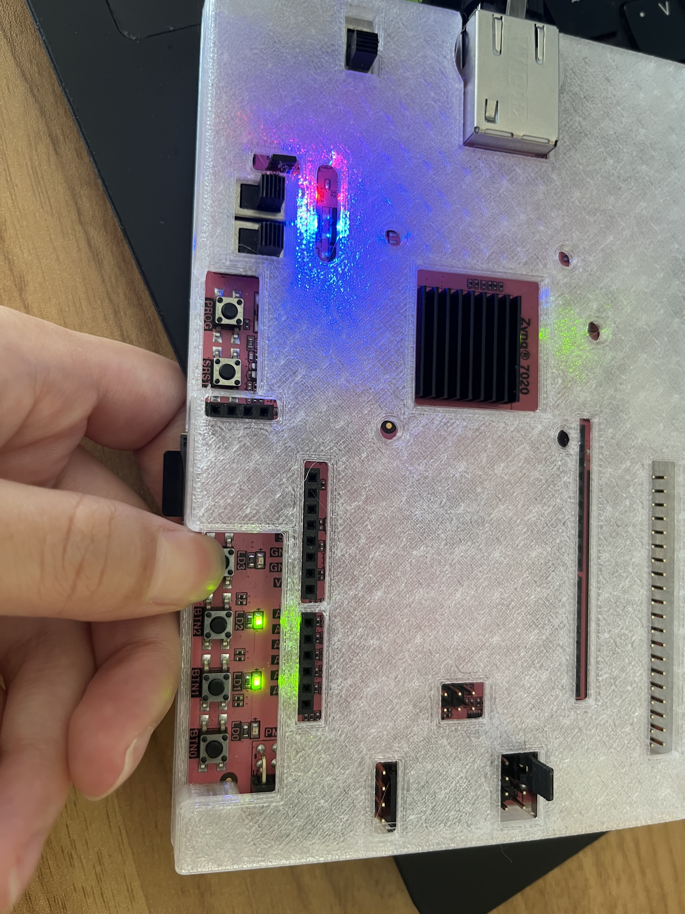</div>

 When entering the first data, the ```ready``` LED is off.

```python
# Read the current state from the GPIO device. This involves accessing the memory-mapped I/O region
state=gpio_read.read(0x0)
seven_segment(state)

```

<div align=center>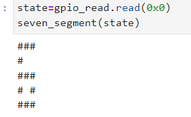</div>

```python
DATA = 0X4

gpio_write.write(DATA_OFFSET,DATA)

```
When writing `4` to the input, see the board below:

<div align=center>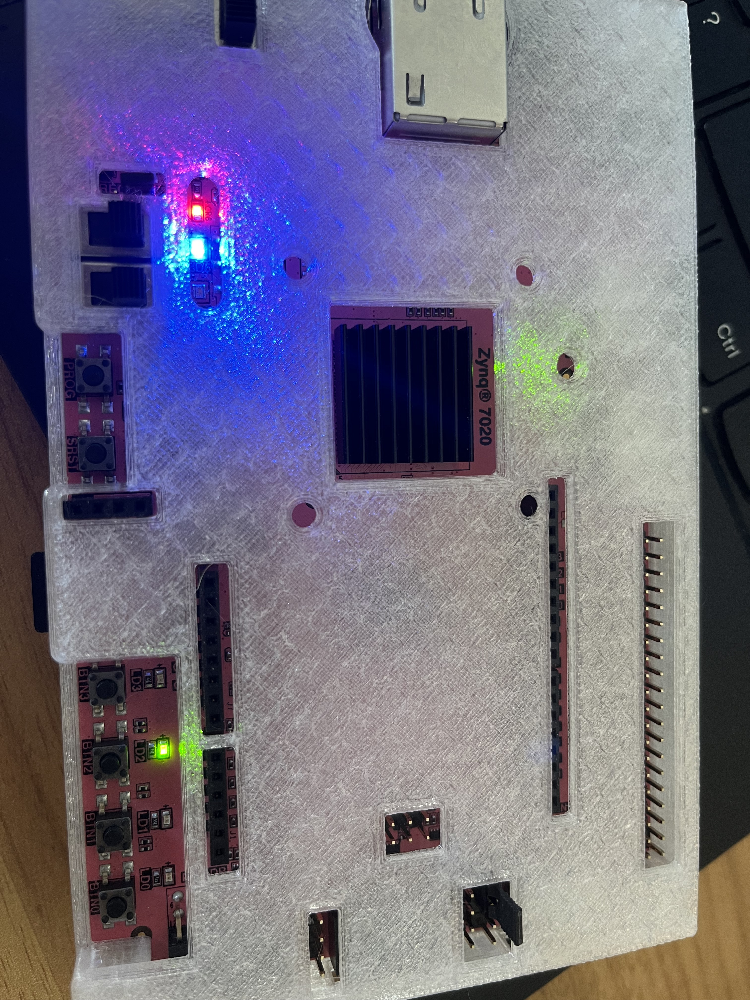</div>

Then, you need to press the ```submit ``` button.

```python
# Read the current state from the GPIO device. This involves accessing the memory-mapped I/O region
state=gpio_read.read(0x0)
seven_segment(state)

```
<div align=center>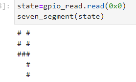</div>

```python

DATA = 0X2

gpio_write.write(DATA_OFFSET,DATA)
```

And then you need to press the ```submit ``` button like below:

<div align=center>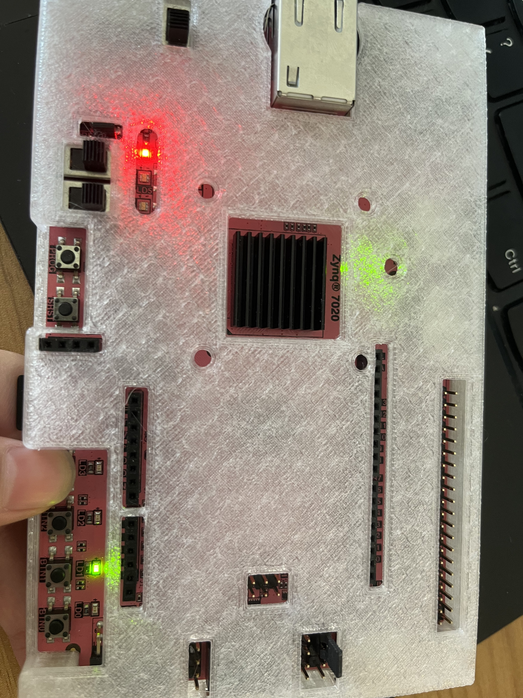</div>

It's unlocked, and the blue LED is off because we input the right code number

```python
# Read the current state from the GPIO device. This involves accessing the memory-mapped I/O region
state=gpio_read.read(0x0)
seven_segment(state)

```
<div align=center>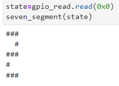</div>
