# Lab9_Simple_processor

## Lab Overview

This lab aims to implement a simple, 4-instruction processor in Verilog. The top-level entity should be a structural design, and all lower-level components should be kept completely modular and use Verilog parameters. The processor should be tested in Vivado Simulator with appropriate testbench(es) that test for many cases (+/- and varying ranges).

## Background

### Design Overview:

Figure 1 shows the layout of the processor you will design. The processor has four inputs: **DIN**, **CLK**,**RUN** and **RSTn**. **DIN** is the main data input of the processor; it is an N-bit input that can be changed during the 
processor synthesis accordingly. We will discuss how to enable this later. Internally, it utilizes four distinct subcomponents: N-Bit
Registers, an Adder, a Multiplexer, and an FSM. The registers can be divided into three groups: the instruction
register, 8 data registers, and two temporary registers. The blue line represents “data-paths.” This processor has two outputs: **BUS** and **DNE**. **BUS** holds the output of the Multiplexer, which should be visible externally and fed
back as input to the circuit’s internals. Note that the figure shows a 16-bit version of the processor, but you will need
to implement it using a variable bit width.


<div align=center>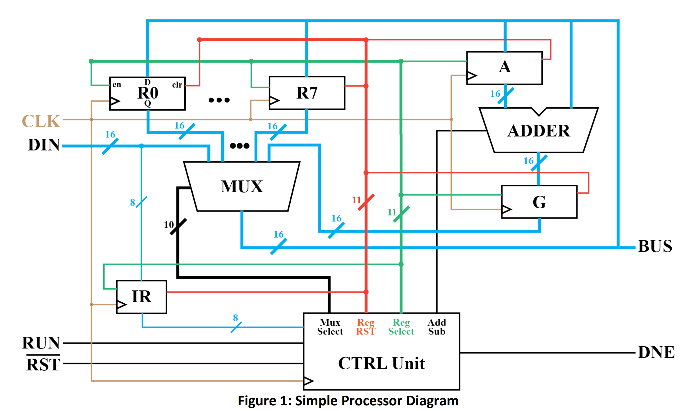</div>

### Processor Instructions and Operations:

This processor will: 

* 1) wait for and read an instruction off DIN 

* 2) perform the instruction. The processor will begin idle, waiting for the user to supply instructions. To do this, the user will write the instructions to **DIN** and then activate the **RUN** signal. The instruction will be saved upon the next rising edge of **CLK**. 

* 3) Then, the processor will execute that instruction. After the instruction, the processor will activate the **DNE** signal for
one **CLK** cycle. The processor will not accept another instruction until the **DNE** signal is activated.

The instructions will be encoded as the 8-bit value: **IIXXXYYY**, where **II** represents one of the four instructions,
**XXX** is a binary number that represents the Xth-data register: **RX**, and **YYY** represents the Yth- data register: **RY**.
Table 1 shows the 4 instructions you must implement. 

<div align=center>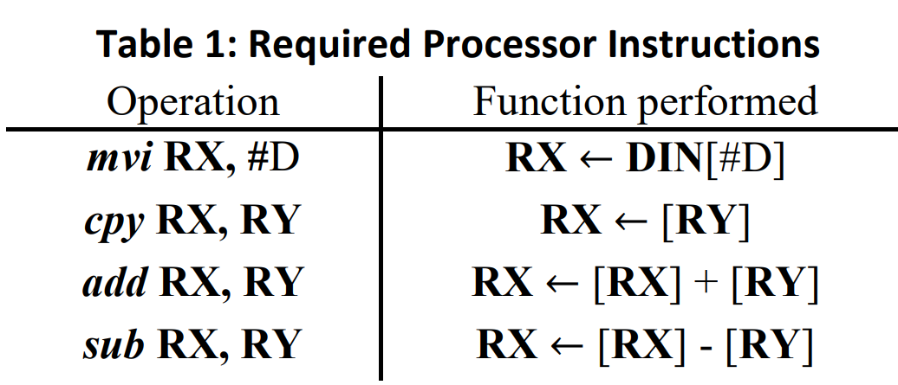</div>

Take a second to understand what these instructions do. The operation ***mvi*** is the Move-Into instruction. It will move
a value, #D, from **DIN** to **RX**. Since the instruction is being passed in through **DIN** as well, this requires you to update
**DIN** with the saved value after the instruction is read. For the ***mvi*** instruction, the three least significant bits of the
instruction, **YYY**, will simply be discarded. The ***cpy*** operation will *copy* the data in **RY** to **RX**. The add and sub-operations are straightforward. They will *Add* **RX** and **RY** or *Subtract* **RY** from RX and then store the result in **RX**,
respectively. Notice that all these operations are destructive and will erase the data currently contained
in **RX**. 

### The Control Unit:

The purpose of the control unit is to orchestrate the functionality of the other sub-components so that the
intended operations are performed. It does this by configuring control signals at the proper times using an FSM. In this system, we
They have a lot of control signals that can be grouped into three main categories: *Register Select Lines*, *Multiplexer Select Lines*, and a *Computation Select Signal*.

The *AddSub* signal is only one signal from the controller designed to select which type of mathematical computation
the processor is conducting. It aims to tell the adder whether it is performing addition or subtraction. 

There are 11 register select lines coming from the controller, one for each register in the system. One of these lines is
fed in as an enable signal to each of the registers in the processor. Notice that we do not want all registers to save their
inputs on each clock pulse. As such, it will be the responsibility of the control unit to coordinate when each register
saves by driving these lines when appropriate.

Finally, there are 10 multiplexer select lines: 1 for **DIN**, 1 for **G** and 8 for the data registers. These lines will determine
which of the 10 multiplexer inputs are fed to the data **BUS**. Unlike the previous multiplexers you’ve designed,
we will use a 1-hot encoding for this system to simplify the controller design.

A major source of error in this lab is this control unit. As you’re designing the FSM, approach it from the perspective.
It sets up the control signals for the next **CLK** edge rather than the current state.

### Routing Data through the system:

The multiplexer decides what data (**DIN**, **RX**/**RY**, **G**) is chosen to be on the **BUS**. **DIN** should be the default output
Selected by the multiplexer when idle. The **BUS** will transfer data to **RX**/**RY**, **A**, the adder's second input, and the
output. You will be able to observe the data transfers on the output as the execution of an operation occurs. Then, upon
completion of the operation, the result will be visible on the output, and **Done** will be asserted for one clock cycle.

The control unit will receive the instruction and drive the *Register Select Lines*, *Multiplexer Select Lines*, and a
*Computation Select Signal* to perform the appropriate operation. It will do this through the use of an FSM. You must design a **Mealy** state machine to control these internal signals.

The processor will start idle, waiting for the **RUN** signal to be asserted externally. On the first rising
clock edge observed while the **RUN** signal is active, the least significant 8-bits of **DIN** will be saved to the
instruction register, **IR**. This register should not be updated again until the next instruction is loaded. The control
unit will then progress through the steps required to compute the operation specified by the instruction. Not all
instructions will require the same number of clock cycles to execute. See the Figure below for details.

As an example, the execution of the ***mvi*** operation is fairly straightforward. After accepting the instruction, it should
select **DIN** to be output to the **BUS** using the *Multiplexer Select Line* and activate the *Register Select Line* for **RX**.
This will set up the processor so that the next clock pulse **DIN** will be saved to **RX**. Note that this requires two
clock pulses, the first to save the instruction and the second to save **DIN** to **RX**. Between these clock pulses **DIN**
should be updated with the value to be saved.

We leave it to you to figure out the exact functionality of the design while performing the other operations, but
provide the following figure as a guide.

<div align=center>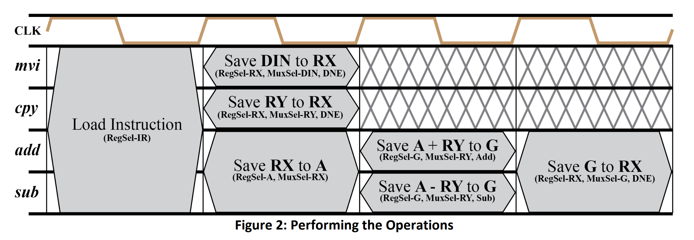</div>


## Verilog Implementation:

From Figure 1 and Figure 2, we can design some subcomponents like registers_enabled, add_sub, Mux_hot and CTRL_unit.

### Add the source file
**reg_enabled.v**
```verilog
// Define a parameterized register module with enable control.
// This module can be used for registers of any size as specified by the parameter N.
module reg_enabled #(
    parameter N=8  // Parameter N defines the width of the data input and output. The default is 8 bits.
)(
    input clk,          // Clock input: Used to synchronize the data transfer on the rising edge.
    input rst,          // Reset input: When high (positive edge detected), it resets the output to 0.
    input enable,       // Enable input: When high, allows data to be latched from din to dout.
    input [N-1:0] din,  // Data input: The data to be latched into the register when enabled.
    output reg [N-1:0] dout  // Data output: The current value stored in the register.
);

    // Sequential logic block: Sensitive to the rising edge of the clock or reset signal.
    always @(posedge clk or posedge rst)
    begin
        if(rst)  // Check if reset signal is high.
            dout <= 0;  // Asynchronously reset the output to 0.
        else if (clk == 1) begin  // Check if the clock signal is high (redundant due to posedge clk trigger).
            if(enable)  // Check if the enable signal is high.
                dout <= din;  // Latch the input data into the output register.
        end
    end
endmodule

```
This module can be used for all registers.

**add_sub.v**
```verilog
// Module definition for a parameterized adder-subtractor.
// This module can perform either addition or subtraction based on the addsub control signal.
module add_sub #( 
    parameter N = 8  // Parameter N defines the width of the data inputs and output. Default is 8 bits.
)(
    input addsub,            // Control input: Determines operation mode (0 for addition, 1 for subtraction).
    input [N-1:0] x0,        // First input operand.
    input [N-1:0] x1,        // Second input operand.
    output reg [N-1:0] result  // Output: Result of the operation, either x0 + x1 or x0 - x1.
);

    // Combinational logic block: Sensitive to changes in the inputs.
    always @(*) begin
        if (addsub == 0)
            result = x1 + x0;  // Perform addition when addsub is 0.
        else
            result = x0 - x1;  // Perform subtraction when addsub is 1.    
    end
    
endmodule

```

**Mux_hot.v**
```verilog

// Define a parameterized hot-one (one-hot) multiplexer module. This type of multiplexer selects one
// of the multiple input signals to pass to the output based on a one-hot encoding scheme.
module Mux_hot #(
    parameter N = 8  // Parameter N defines the width of the data inputs and output. Default is 8 bits.
)(
    input [9:0] select,         // One-hot select signal, determines which input to pass to the output.
    input [N-1:0] s0,           // Input signal 0
    input [N-1:0] s1,           // Input signal 1
    input [N-1:0] s2,           // Input signal 2
    input [N-1:0] s3,           // Input signal 3
    input [N-1:0] s4,           // Input signal 4
    input [N-1:0] s5,           // Input signal 5
    input [N-1:0] s6,           // Input signal 6
    input [N-1:0] s7,           // Input signal 7
    input [N-1:0] din,          // Default input signal (used when no valid select is active)
    input [N-1:0] g,            // Additional input signal (for example purposes)
    output reg [N-1:0] result   // Output signal, selected from one of the inputs based on 'select'
);

   // Combinational logic to determine the output based on the 'select' signal
   always @(*)
   begin
       case (select)
           10'b0000000001: result <= din;  // When select line is 0000000001, output is 'din'
           10'b0000000010: result <= s0;   // When select line is 0000000010, output is 's0'
           10'b0000000100: result <= s1;   // When select line is 0000000100, output is 's1'
           10'b0000001000: result <= s2;   // When select line is 0000001000, output is 's2'
           10'b0000010000: result <= s3;   // When select line is 0000010000, output is 's3'
           10'b0000100000: result <= s4;   // When select line is 0000100000, output is 's4'
           10'b0001000000: result <= s5;   // When select line is 0001000000, output is 's5'
           10'b0010000000: result <= s6;   // When select line is 0010000000, output is 's6'
           10'b0100000000: result <= s7;   // When select line is 0100000000, output is 's7'
           10'b1000000000: result <= g;    // When select line is 1000000000, output is 'g'
           default:        result <= din;  // Default case, output is 'din' if no valid select
       endcase
   end   
endmodule


```

**CTRL_unit.v**
```verilog
// Module definition for a control unit with parameterizable width, N.
module CTRL_unit #(
    parameter N = 8  // Bit width of the instruction and data paths.
)(
    input clk,                       // Clock input.
    input rst,                       // Asynchronous reset input.
    input run,                       // Input signal to start the operation.
    input [N-1:0] instruction,       // Instruction input, determining the operation.
    output reg [9:0] select_mux,     // Control signal for multiplexer selection.
    output reg [10:0] select_reg,    // Control signal for register selection.
    output reg A,                    // Auxiliary control signal, usage depends on context.
    output reg done                  // Signal indicating completion of an operation.
);

    // State machine variables and declarations.
    reg [3:0] state, next_state;  // Current and next state definitions.
    localparam idle    = 2'd0,    // State definitions for readability.
               R_M     = 2'd1,
               add_sub = 2'd2,
               last    = 2'd3;
    
    // State transition logic: triggered on clock or reset.
    always @(posedge clk or negedge rst) begin
        if (!rst)
            state <= idle;       // Reset to idle state.
        else
            state <= next_state; // Transition to the next state.
    end
    
    // Next state logic and output logic based on current state and inputs.
    always @(*) begin
        case (state)
            idle: begin
                // In idle state, transition to R_M state if 'run' is high, else stay in idle.
                if (run == 1'b1)
                    next_state = R_M;
                else
                    next_state = idle;
            end
            R_M: begin
                // In R_M state, decide next state based on the instruction's upper bits.
                if (instruction[7:6] == 2'b10 || instruction[7:6] == 2'b11)
                    next_state = add_sub;
                else
                    next_state = idle;
            end
            add_sub: begin
                // In add_sub state, always transition to last state next.
                next_state = last;
            end
            last: begin
                // In last state, transition back to idle.
                next_state = idle;                
            end
            default: begin
                // Default case: go back to idle if an unknown state is encountered.
                next_state = idle;
            end
        endcase
    end
// Combinational logic for next state determination and control signal generation.
    always @(*) begin
        case (state)
            idle: begin
                // In idle state, set default control signals and check if 'run' is activated.
                select_mux = 10'b0000000001;  // Default selection for multiplexer.
                select_reg = 11'b00000000001; // Default selection for register or functional unit.
                A = 1'b0;                     // Default state for auxiliary control signal A.
                done = 1'b0;                  // Indicate that the operation is not done.
                  end
            R_M:
            begin
                if(instruction[7:6]==2'b00) //the first instruction mvi
                begin
                       A = 1'b0;
                       done = 1'b1;
                       case(instruction[5:3])
                        3'b000:         select_reg = 11'b00000000010;
                        3'b001: 	select_reg = 11'b00000000100;
                        3'b010: 	select_reg = 11'b00000001000;
                        3'b011: 	select_reg = 11'b00000010000;
                        3'b100: 	select_reg = 11'b00000100000;
                        3'b101: 	select_reg = 11'b00001000000;
                        3'b110: 	select_reg = 11'b00010000000;
                        3'b111: 	select_reg = 11'b00100000000;
                        default: select_reg = 11'b00000000000;
                        endcase
                        select_mux = 11'b0000000001;
                end
                else if(instruction[7:6]==2'b01)// the second instruction cpy
                begin
                    A = 1'b0;
                    done = 1'b1;
                   case(instruction[5:3])
                        3'b000:         select_reg = 11'b00000000010;
                        3'b001: 	select_reg = 11'b00000000100;
                        3'b010: 	select_reg = 11'b00000001000;
                        3'b011: 	select_reg = 11'b00000010000;
                        3'b100: 	select_reg = 11'b00000100000;
                        3'b101: 	select_reg = 11'b00001000000;
                        3'b110: 	select_reg = 11'b00010000000;
                        3'b111: 	select_reg = 11'b00100000000;
                        default: select_reg = 11'b00000000000;
                    endcase
                    case(instruction[2:0])
                        3'b000:        select_mux = 10'b0000000010;
                        3'b001: 	select_mux = 10'b0000000100;
                        3'b010: 	select_mux = 10'b0000001000;
                        3'b011: 	select_mux = 10'b0000010000;
                        3'b100: 	select_mux = 10'b0000100000;
                        3'b101: 	select_mux = 10'b0001000000;
                        3'b110: 	select_mux = 10'b0010000000;
                        3'b111: 	select_mux = 10'b0100000000;
                        default: select_mux = 10'b0000000000;
                    endcase
                 
                end
                
                else if(instruction[7:6]==2'b10) // the add instruction
                begin
                    A = 1'b0;
                    done = 1'b0;
                    select_reg = 11'b01000000000;
                       case(instruction[5:3])
                        3'b000:         select_mux = 10'b0000000010;
                        3'b001: 	select_mux = 10'b0000000100;
                        3'b010: 	select_mux = 10'b0000001000;
                        3'b011: 	select_mux = 10'b0000010000;
                        3'b100: 	select_mux = 10'b0000100000;
                        3'b101: 	select_mux = 10'b0001000000;
                        3'b110: 	select_mux = 10'b0010000000;
                        3'b111: 	select_mux = 10'b0100000000;
                        default: select_mux = 10'b0000000000;
                    endcase
                
                end
                
                else // the sub instruction
                begin
                     A = 1'b1;
                    done = 1'b0;
                    select_reg = 11'b01000000000;
                       case(instruction[5:3])
                        3'b000:         select_mux = 10'b0000000010;
                        3'b001: 	select_mux = 10'b0000000100;
                        3'b010: 	select_mux = 10'b0000001000;
                        3'b011: 	select_mux = 10'b0000010000;
                        3'b100: 	select_mux = 10'b0000100000;
                        3'b101: 	select_mux = 10'b0001000000;
                        3'b110: 	select_mux = 10'b0010000000;
                        3'b111: 	select_mux = 10'b0100000000;
                        default: select_mux = 10'b0000000000;
                    endcase
                
                end
            
            end
        
        add_sub: // this state corespond to the Save A +/- RY to G part
            begin
                if(instruction[7:6]==2'b10)
                begin
                        A = 1'b0;
                        done = 1'b0;
                        select_reg = 11'b10000000000;
                       case(instruction[2:0])
                        3'b000:         select_mux = 10'b0000000010;
                        3'b001: 	select_mux = 10'b0000000100;
                        3'b010: 	select_mux = 10'b0000001000;
                        3'b011: 	select_mux = 10'b0000010000;
                        3'b100: 	select_mux = 10'b0000100000;
                        3'b101: 	select_mux = 10'b0001000000;
                        3'b110: 	select_mux = 10'b0010000000;
                        3'b111: 	select_mux = 10'b0100000000;
                        default: select_mux = 10'b0000000000;
                    endcase
                end
                
                else
                begin
                         A = 1'b1;
                        done = 1'b0;
                       select_reg = 11'b10000000000;
                       case(instruction[2:0])
                        3'b000:     select_mux = 10'b0000000010;
                        3'b001: 	select_mux = 10'b0000000100;
                        3'b010: 	select_mux = 10'b0000001000;
                        3'b011: 	select_mux = 10'b0000010000;
                        3'b100: 	select_mux = 10'b0000100000;
                        3'b101: 	select_mux = 10'b0001000000;
                        3'b110: 	select_mux = 10'b0010000000;
                        3'b111: 	select_mux = 10'b0100000000;
                        default: select_mux = 10'b0000000000;
                    endcase
                
                end
                          
            end
        
        last: // this state corespond to the Save G to RX
            begin
                 if(instruction[7:6]==2'b10)
                    A = 1'b0;
                 else
                    A = 1'b1;                      
                 done = 1'b1;
                
                   case(instruction[5:3])
                        3'b000:         select_reg = 11'b00000000010;
                        3'b001: 	select_reg = 11'b00000000100;
                        3'b010: 	select_reg = 11'b00000001000;
                        3'b011: 	select_reg = 11'b00000010000;
                        3'b100: 	select_reg = 11'b00000100000;
                        3'b101: 	select_reg = 11'b00001000000;
                        3'b110: 	select_reg = 11'b00010000000;
                        3'b111: 	select_reg = 11'b00100000000;
                        default: select_reg = 11'b00000000000;
                   endcase
                  select_mux = 10'b1000000000;  //choose the G register         
            end       
        default:
               begin
                    select_mux = 10'b0000000000;  // Reset multiplexer selection.
                    select_reg = 11'b00000000000; // Reset register selection.
                    A = 1'b0;                     // Reset auxiliary control signal.
                    done = 1'b0;                  // Reset operation completion indicator.
                   
                end   
    endcase
 
   end  

endmodule


```

The system processor unit contains the above modules.
**system_processor.v**
```verilog

// Define a system processor module with parameterizable width N.
// This module simulates a simple processing unit with various registers and operations.
module system_processor #(
	parameter N = 16  // Define the data width for the system.
)(
	input						clk, 		// Clock input for synchronization.
	input 						rst, 		// Global reset signal.
	input 						reg_rst, 	// Register reset signal.
	input 						Run, 		// Control signal to start the processor.
	input		 [N-1:0]    DIN, 		// Data input port.
	output           [N-1:0]    reg0,		// Output from register 0.
	output           [N-1:0]    reg1,  	// Output from register 1.
	output           [N-1:0]    reg2,   	// Output from register 2.
	output		 [N-1:0] Bus_data, 	// Data bus used for internal and external data communication.
	output 						Done		// Signal indicating completion of operation.
);

    // Internal wire declarations.
    wire [7:0] save_instruction;  // Wire to hold instruction from instruction register.
    wire [N-1:0] reg3;            // Additional internal registers.
    wire [N-1:0] reg4;
    wire [N-1:0] reg5;
    wire [N-1:0] reg6;
    wire [N-1:0] reg7;
    
    wire [N-1:0] a;               // Wire for temporary storage used in operations.
    wire [N-1:0] g;               // General purpose register or calculation result storage.
    wire [N-1:0] add_result;      // Result of addition or subtraction operation.
    
    wire add_ctrl;                // Control signal for addition or subtraction.
    
    wire [10:0] reg_ctrl;         // Control signals for register enable.
    wire [9:0] select_mux;        // Multiplexer selection signal.

    // Module instantiations
    // Instruction Register
    reg_enabled #(.N(8)
    ) IR (
        .clk(clk),
        .rst(reg_rst),
        .enable(reg_ctrl[0]),
        .din(DIN[7:0]),
        .dout(save_instruction)
    );
    
    // Data Registers instantiation for storing and manipulating data
    // Each Data_X module represents a register which can be used to store data from the Bus_data.
    reg_enabled #(.N(8)) Data_1 (.clk(clk), .rst(reg_rst), .enable(reg_ctrl[1]), .din(Bus_data), .dout(reg0));
    reg_enabled #(.N(8)) Data_2 (.clk(clk), .rst(reg_rst), .enable(reg_ctrl[2]), .din(Bus_data), .dout(reg1));
    // Additional data registers Data_3 to Data_8 follow similar pattern as Data_1 and Data_2
    reg_enabled #(.N(8)) Data_3 (.clk(clk), .rst(reg_rst), .enable(reg_ctrl[3]), .din(Bus_data), .dout(reg2));
    reg_enabled #(.N(8)) Data_4 (.clk(clk), .rst(reg_rst), .enable(reg_ctrl[4]), .din(Bus_data), .dout(reg3));
    reg_enabled #(.N(8)) Data_5 (.clk(clk), .rst(reg_rst), .enable(reg_ctrl[5]), .din(Bus_data), .dout(reg4));
    reg_enabled #(.N(8)) Data_6 (.clk(clk), .rst(reg_rst), .enable(reg_ctrl[6]), .din(Bus_data), .dout(reg5));
    reg_enabled #(.N(8)) Data_7 (.clk(clk), .rst(reg_rst), .enable(reg_ctrl[7]), .din(Bus_data), .dout(reg6));
    reg_enabled #(.N(8)) Data_8 (.clk(clk), .rst(reg_rst), .enable(reg_ctrl[8]), .din(Bus_data), .dout(reg7));

    // Arithmetic Control Register - Controls input to the arithmetic unit.
    reg_enabled #(.N(8)) A_ctrl (.clk(clk), .rst(reg_rst), .enable(reg_ctrl[9]), .din(Bus_data), .dout(a));
    
    // General register - Could be used for various purposes, here for storing arithmetic results.
    reg_enabled #(.N(8)) g_ctrl (.clk(clk), .rst(reg_rst), .enable(reg_ctrl[10]), .din(add_result), .dout(g));
    
    // Arithmetic Unit - Performs addition or subtraction based on add_ctrl signal.
    add_sub #(.N(N)) addition (.addsub(add_ctrl), .x0(a), .x1(Bus_data), .result(add_result));
    
    // Multiplexer - Selects one of several input data sources to output onto the Bus_data based on select_mux.
    Mux_hot #(.N(N)) Mux (.select(select_mux), .s0(reg0), .s1(reg1), .s2(reg2), .s3(reg3), .s4(reg4), .s5(reg5), .s6(reg6), .s7(reg7), .din(DIN), .g(g), .result(Bus_data));
 
    // Control Unit - Controls the processor's operation including instruction decoding and generating control signals.
    CTRL_unit #( .N(N)) Ctrl_test (.clk(clk), .rst(rst), .run(Run), .instruction(save_instruction), .select_mux(select_mux), .select_reg(reg_ctrl), .A(add_ctrl), .done(Done));
  
endmodule


```
We will map ```clk``` port to the button, so we also need the debouncing module like below:

**btn_run.v**
```verilog

// Define a module for a button-controlled run interface, integrating with a system processor.
module btn_run #(
	parameter N = 8  // Define the data width for the system.
)(
	input						clk, 		// Clock input for synchronization.
	input 						rst, 		// Global reset signal.
	input 						reg_rst, 	// Register reset signal.
	input 						key, 		// Input signal from a physical button.
	input                       run,		// Control signal to start the processor.
	input		     [N-1:0]    DIN, 		// Data input port.
	output           [N-1:0]    reg0,		// Output from register 0.
	output           [N-1:0]    reg1,  	// Output from register 1.
	output           [N-1:0]    reg2,   	// Output from register 2.
	output		[N-1:0] Bus_data, 	// Data bus used for internal and external data communication.
	output 						Done		// Signal indicating completion of operation.
);
   
    // Internal signal declarations for debouncing logic.
    wire      key_pulse;        // Pulse signal generated after key debounce.
 
    reg [7:0] key_buffer;       // Buffer to store the state of the key for debouncing.
    reg key_reg;                // Register to hold the debounced key value.
    
    // Debounce logic for the key input.
    always @(posedge clk or negedge rst) begin
        if (!rst)
            key_reg <= 1'd0;  // Reset the key register.
        else begin
            if (key == 1'd1)
                key_reg <= 1'd1;  // Set the key register if the key input is high.
            else 
                key_reg <= 1'd0;  // Clear the key register if the key input is low.
        end       
    end

integer i;
    // Buffer to hold the debounced key value for detecting edges.
    always @(posedge clk or negedge rst) begin
        if (!rst)
            key_buffer <= 8'd0;  // Reset the key buffer.
        else begin
            for (i = 0; i < 8; i = i + 1) begin
                // Fill the buffer based on the debounced key value.
                if (key_reg == 1'd1)
                    key_buffer[i] <= 1'd1;  // Set buffer bits if key is pressed.
                else
                    key_buffer[i] <= 1'd0;  // Clear buffer bits if the key is not pressed.
            end            
        end  
    end
    
    // Generate a single cycle pulse when the key is pressed.
    assign key_pulse = key_buffer & 8'hff;  
    
    // Instantiate the system_processor module with the debounced key_pulse signal.
    system_processor #(.N(8)
    ) System(
        .clk(key_pulse),         // Use the debounced key pulse as the clock input.
        .rst(rst),
        .reg_rst(reg_rst),
        .Run(run),
        .DIN(DIN),
        .reg0(reg0),
        .reg1(reg1),
        .reg2(reg2),
        .Bus_data(Bus_data),
        .Done(Done)
    );     
endmodule


```

Now we can see the ```Schematic``` under the RTL ANALYSIS part like below:

<div align=center>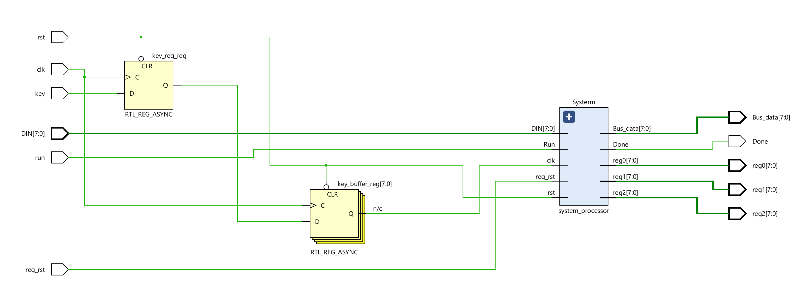</div>

For the system module, we can see:

<div align=center></div>


Then we can run Simulation to check the code of the ```system_processor``` module.

**tb.v**
```verilog

// Testbench for the system_processor module
module tb();

parameter N = 8; // Data width for the test

// Define testbench signals
reg clk;
reg rst;
reg reg_rst;
reg run;
reg [N-1:0] DIN;

wire [N-1:0] Bus;
wire Done;
wire [N-1:0] reg0;
wire [N-1:0] reg1;
wire [N-1:0] reg2;

// Instantiate the system_processor module with test signals
system_processor #(
    .N(N)
) test (
    .clk(clk), 
    .rst(rst), 
    .reg_rst(reg_rst), 
    .Run(run), 
    .DIN(DIN),
    .Bus_data(Bus), 
    .reg0(reg0),
    .reg1(reg1),
    .reg2(reg2),
    .Done(Done)
);

// Initial block begins here
initial begin
    $display("Running testbench"); // Print simulation start message
    
    // Initialize inputs
    clk <= 1'b0;      // Initial clock state
    run <= 1'b0;      // Begin with run not active
    rst <= 1'b0;      // Begin with system not reset
    reg_rst <= 1'b1;  // Begin with register reset active
    DIN <= 8'b00000000; // Initialize data input to zero
    #20; // Wait for 20 time units
    
    rst <= 1'b1;      // Release system reset
    reg_rst <= 1'b0;  // Release register reset
    #20; // Wait for 20 time units
    
    // Test sequence starts here
    // Move (00) 85 to reg 0 (000)
    DIN <= 8'b00000000; // Specify target register (example instruction)
    run <= 1'b1;        // Signal to start the operation
    #20;
	clk	 	<=	1'b1;
	#20;
    DIN <= 85;          // Load value into target register (assumed operation)
    run <= 1'b0;        // End the operation
    #40;                // Wait for the operation to complete
    clk	 		<=	1'b0;
    #20;
    clk	 		<=	1'b1;
    #20;
    
    // Move (00) 20 to reg 1 (001)
    clk	 		<=	1'b0;
    DIN 			<=	8'b00001000;
    run 			<=	1'b1;
    #20;
    clk	 		<=	1'b1;
    #20;
    DIN 			<=	20;//H14
    run 			<=	1'b0;
    clk	 		<=	1'b0;
    #20;
    clk	 		<=	1'b1;
    #20;
    
    // Move (01) reg 0 (000) to reg 2 (010)
    clk	 		<=	1'b0;
    DIN 			<=	8'b01010000;
    run 			<=	1'b1;
    #20;
    clk	 		<=	1'b1;
    #20;
    run 			<=	1'b0;
    clk	 		<=	1'b0;
    #20;
    clk	 		<=	1'b1;
    #20;
    
    // add (10)reg 1 (001) to reg 2 (010) 
    clk	 		<=	1'b0;
    DIN 			<=	8'b10010001;
    run 			<=	1'b1;
    #20;
    clk	 		<=	1'b1;
    #20;
    run 			<=	1'b0;
    clk	 		<=	1'b0;
    #20;
    clk	 		<=	1'b1;
    #20;
    clk	 		<=	1'b0;
    #20;
    clk	 		<=	1'b1;
    #20;
    clk	 		<=	1'b0;
    #20;
    clk	 		<=	1'b1;
    #20;
    
////			// sub(11) reg 2 (010) to reg 0 (000)
    clk	 		<=	1'b0;
    DIN 			<=	8'b11010000;
    run 			<=	1'b1;
    #20;
    clk	 		<=	1'b1;
    #20;
    run 			<=	1'b0;
    clk	 		<=	1'b0;
    #20; 
    clk	 		<=	1'b1;
    #20;
    clk	 		<=	1'b0;
    #20;
    clk	 		<=	1'b1;
    #20;
    clk	 		<=	1'b0;
    #20;
    clk	 		<=	1'b1;
    #20;
        

```

We can run a Simulation to check the code by clicking the ```Run Simulation``` under ```SIMULATION``` and choosing the first ```Run Behavioral Simulation```. Here, the function of the ```clk``` is the same as the ```submit``` of the lab8.

<div align=center>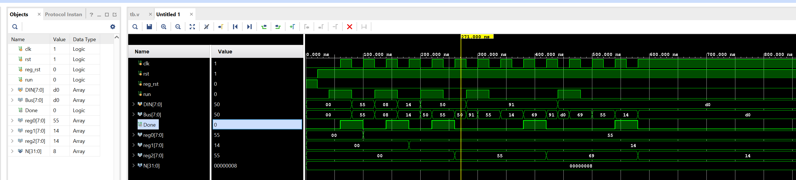</div>


### Implementation

The part can reference the [Generate Bitstream](https://uri-nextlab.github.io/ParallelProgammingLabs/Labs/Lab1_led.html#generate-the-bitstream) in lab1.

The block design is shown below:

<div align=center>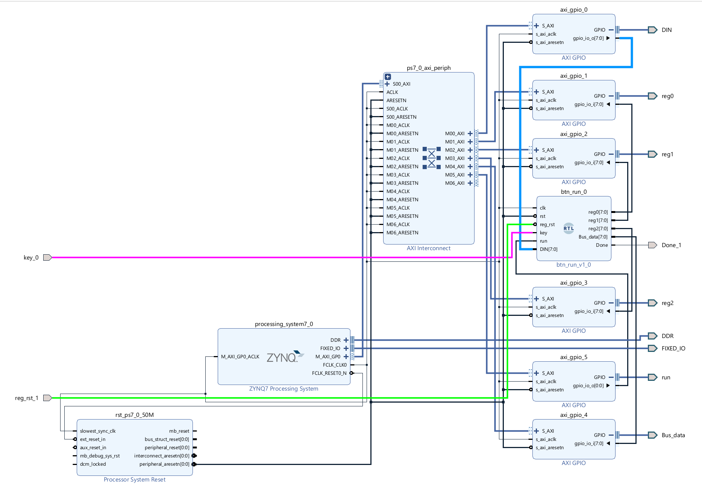</div>


For the value of ```reg0``` ```reg1``` ```reg2``` ```Bus_data``` ports can be read from the ```AXI_GPIO``` IP, and we need to write data to the ```run``` ```DIN``` input ports by ```AXI_GPIO``` and the ```key``` port will map to the button(L19) and the ```Done``` port will map to the LED(M14) of the board.

### Download the bitstream file to PYNQ

We need to download the design_1_wrapper.bit to the local machine. Go to Lab9/project_1/project_1.runs/impl_1, download design_1_wrapper.bit, and upload the file to the PYNQ. And we also need to upload the design_1.hwh  file which is in the Lab9/project_1/project_1.gen/sources_1/bd/design_1/hw_handoff.

```python
from pynq import Overlay
from pynq import Bitstream
bit = Bitstream("design_1.bit")
bit.download()
bit.bitfile_name

```

```python

from pynq import MMIO 
GPIO_BASE_ADDRESS = 0X41200000
GPIO_RANGE = 0x1000
din_write = MMIO(GPIO_BASE_ADDRESS, GPIO_RANGE)

```

```python

GPIO_BASE_ADDRESS_r = 0X41210000
GPIO_RANGE = 0x1000
reg0_read = MMIO(GPIO_BASE_ADDRESS_r, GPIO_RANGE)
reg0=reg0_read.read(0x0)

```
```python
GPIO_BASE_ADDRESS_r = 0X41220000
GPIO_RANGE = 0x1000
reg1_read = MMIO(GPIO_BASE_ADDRESS_r, GPIO_RANGE)
reg1=reg1_read.read(0x0)

```

```python

GPIO_BASE_ADDRESS_r = 0X41230000
GPIO_RANGE = 0x1000
reg2_read = MMIO(GPIO_BASE_ADDRESS_r, GPIO_RANGE)
reg2=reg2_read.read(0x0)

```


```python
GPIO_BASE_ADDRESS_r = 0X41240000
GPIO_RANGE = 0x1000
bus_read = MMIO(GPIO_BASE_ADDRESS_r, GPIO_RANGE)
bus=bus_read.read(0x0)

```
```python
GPIO_BASE_ADDRESS = 0X41250000
GPIO_RANGE = 0x1000
run = MMIO(GPIO_BASE_ADDRESS, GPIO_RANGE)

```

```python
representations = {
    '0': ('###', '# #', '# #', '# #', '###'),
    '1': ('  #', '  #', '  #', '  #', '  #'),
    '2': ('###', '  #', '###', '#  ', '###'),
    '3': ('###', '  #', '###', '  #', '###'),
    '4': ('# #', '# #', '###', '  #', '  #'),
    '5': ('###', '#  ', '###', '  #', '###'),
    '6': ('###', '#  ', '###', '# #', '###'),
    '7': ('###', '  #', '  #', '  #', '  #'),
    '8': ('###', '# #', '###', '# #', '###'),
    '9': ('###', '# #', '###', '  #', '###'),
    '.': ('   ', '   ', '   ', '   ', '  #'),
}

def seven_segment(number):
    # treat the number as a string, since that makes it easier to deal with
    # on a digit-by-digit basis
    digits = [representations[digit] for digit in str(number)]
    # now digits is a list of 5-tuples, each representing a digit in the given number
    # We'll print the first lines of each digit, the second lines of each digit, etc.
    for i in range(5):
        print("  ".join(segment[i] for segment in digits))
```

```python
DATA_OFFSET = 0X0
DATA = 0x00
#write instruction is mvi (00) to reg0(000)
din_write.write(DATA_OFFSET,DATA)
run.write(DATA_OFFSET,1)
```
At the same time, please press the ```key```(L19) button, you will see the LED is on, which means that the process is done.

<div align=center>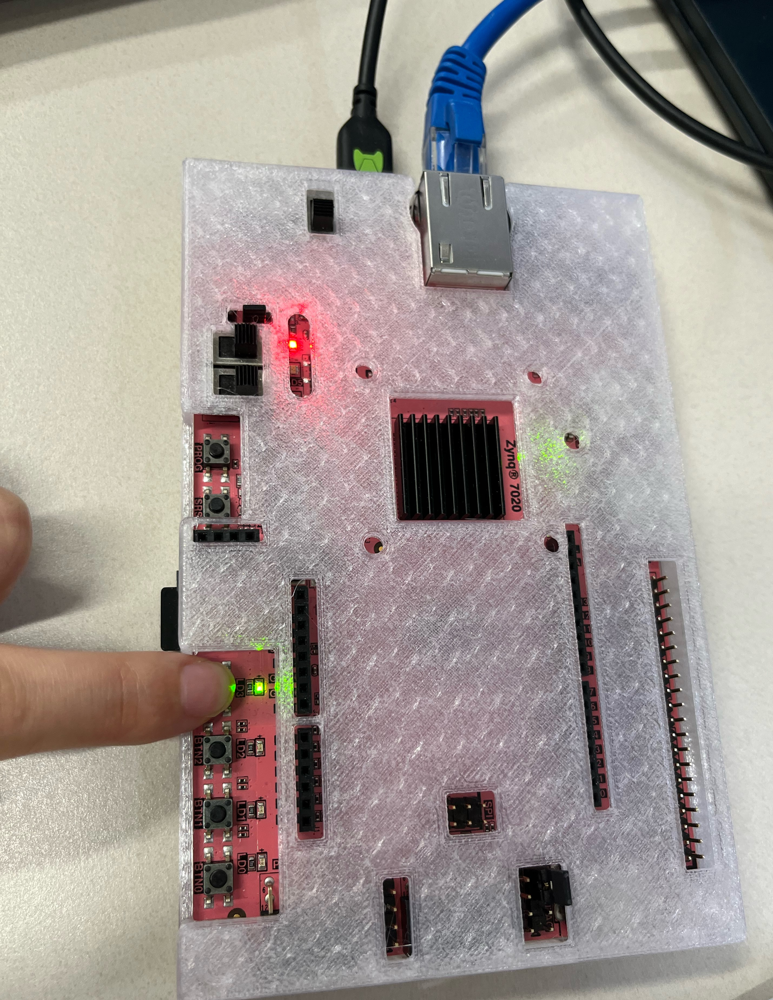</div>

```python
DATA_OFFSET = 0X0
DATA = 0x55
#write instruction is mvi (00) to reg1(000)
din_write.write(DATA_OFFSET,DATA)

```
Then press the ```key``` button again, and you will see the LED is off.

<div align=center>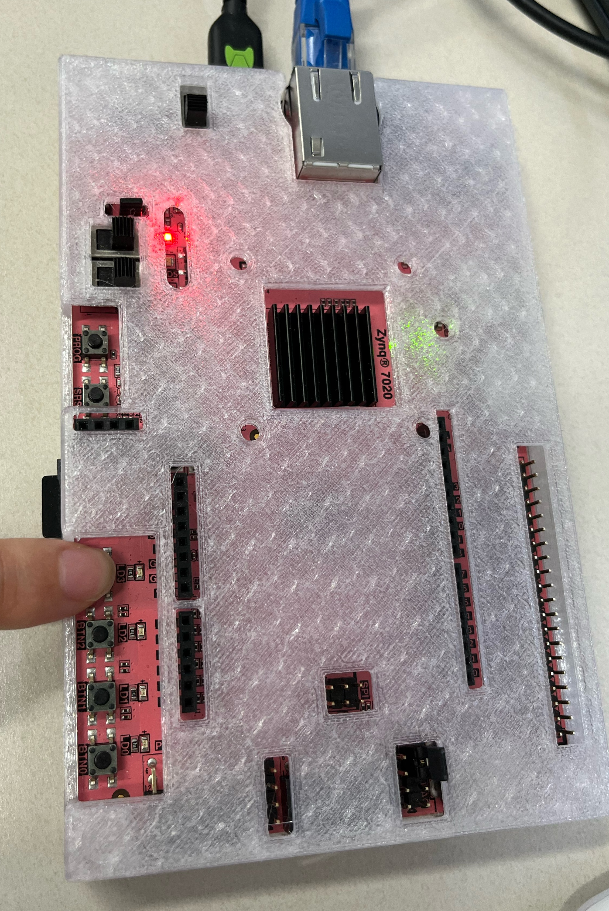</div>


```python
seven_segment(reg0_read.read(0x0))

```
We will see the value of the ```reg0```:

<div align=center>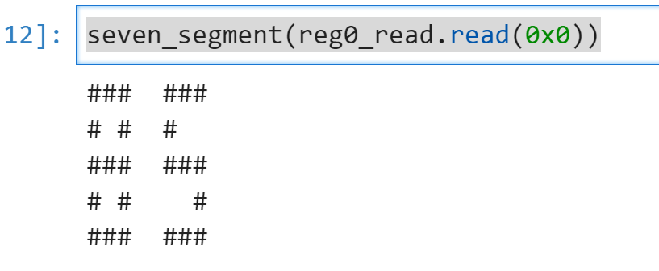</div>


```python
DATA_OFFSET = 0X0
DATA = 0x08
#write to the reg1
din_write.write(DATA_OFFSET,DATA)
run.write(DATA_OFFSET,1)

```

```python
DATA_OFFSET = 0X0
DATA = 0x14
#write 20 to reg1
din_write.write(DATA_OFFSET,DATA)

```


```python
seven_segment(reg1_read.read(0x0))
```
We will see the value of the ```reg1```:

<div align=center>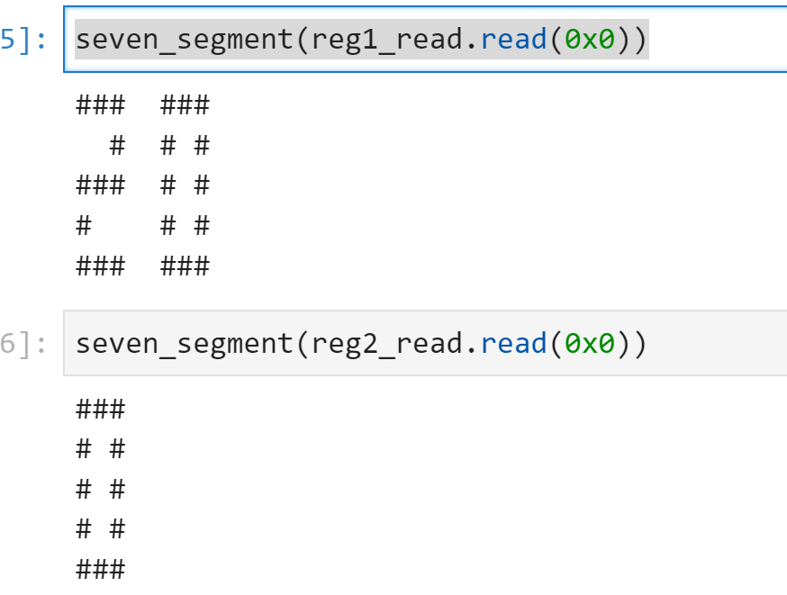</div>

```python
DATA_OFFSET = 0X0
DATA = 0x50
#move reg1 to reg2

din_write.write(DATA_OFFSET,DATA)
run.write(DATA_OFFSET,1)

```
```python
seven_segment(reg2_read.read(0x0))
```
We will see the value of the ```reg2```:

<div align=center>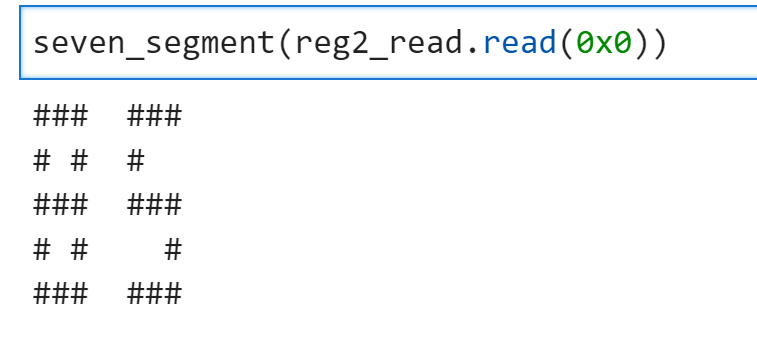</div>

Then we will try to ```add``` and ```sub```instructions.

```python
DATA_OFFSET = 0X0
DATA = 0x91   #add reg2 and reg1 
din_write.write(DATA_OFFSET,DATA)
run.write(DATA_OFFSET,1)

```
Because for the add/sub-operation, the processor will go through all states, we need to press the ```key``` button more times until you can see the  LED is on, then press the button and you can see it is off.

And you will see:

<div align=center>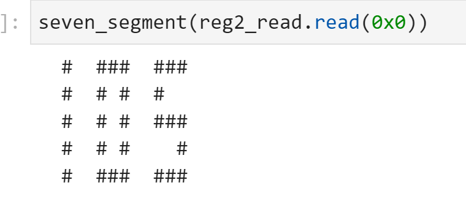</div>


The ```sub``` instruction is the same.

```python
DATA_OFFSET = 0X0
DATA = 0xd0   #add reg2 and reg1 
din_write.write(DATA_OFFSET,DATA)
run.write(DATA_OFFSET,1)


```

And you can see the result of the ```reg2```:

<div align=center>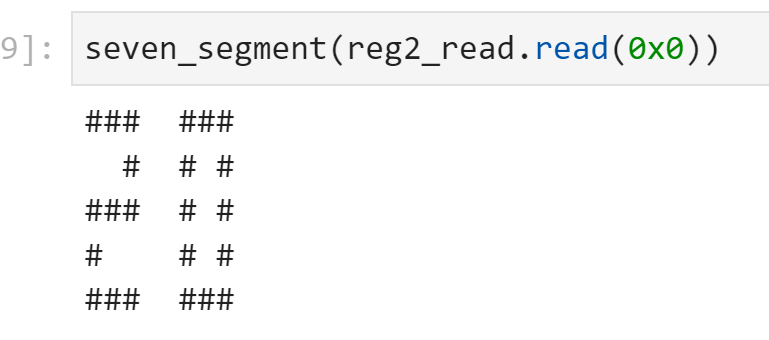</div>
