# Lab10_Finite State Machines    

## Introduction

Finite State Machines (FSM) are sequential circuits used in many digital systems to control the behavior of systems and dataflow paths. Examples of FSM include control units and sequencers. This lab introduces the concept of two types of FSMs, Mealy and Moore, and the modeling styles to develop such machines. 

## Mealy FSM
A finite-state machine (FSM) or a state machine designs computer programs and
sequential logic circuits. It is conceived as an abstract machine that can be in one of a finite number of
user-defined states. The machine is in only one state at a time; the state it is in at any given time is called
the current state. It can change from one state to another when initiated by a triggering event or condition;
this is called a transition. A particular FSM is defined by a list of its states and the triggering condition for
each transition.

The behavior of state machines can be observed in many devices in modern society performing a
predetermined sequence of actions depending on the sequence of events with which they are presented.
Simple examples are vending machines which dispense products when the proper combination of coins
are deposited, elevators which drop riders off at upper floors before going down, traffic lights which
change sequence when cars are waiting, and combination locks, which require the input of combination
numbers in the proper order.

The state machines are modeled using two basic types of sequential networks- Mealy and Moore. In a
The mealy machine's output depends on the present (current) state and the present (current) inputs.
In Moore's machine, the output depends only on the present state.

A general model of a Mealy sequential machine consists of a combinatorial network, which generates the
outputs and the next state, and a state register, which holds the present state, as shown below. The state
register is normally modeled as D flip-flops. The state register must be sensitive to a clock edge. The
other block(s) can be modeled either using the always procedural block or a mixture of the always
procedural block and dataflow modeling statements; the always procedural block will have to be
sensitive to all inputs being read into the block and must have all output defined for every branch to model it as a combinatorial block. The two blocks of the Mealy machine can be viewed as 

<div align=center>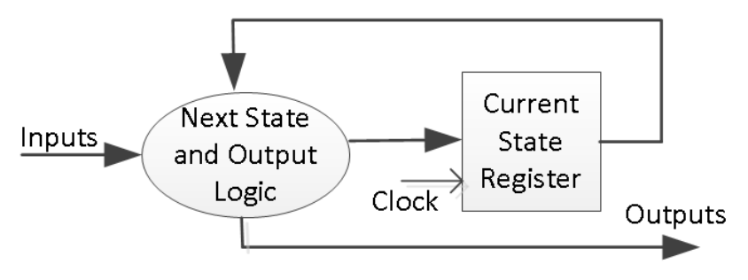</div>

Here is the state diagram of a parity checker Mealy machine and the associated model. 

<div align=center>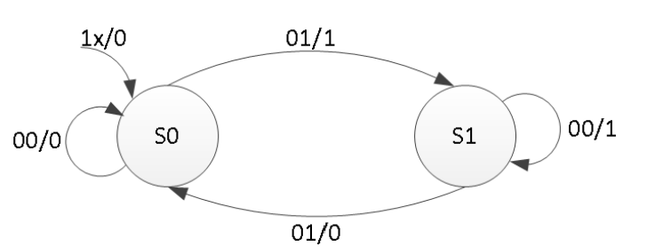</div>

```verilog
module mealy_2processes(
    input clk,           // Clock input for synchronous logic
    input reset,         // Asynchronous reset input, resets the machine state
    input x,             // Input signal to the Mealy machine
    output reg parity    // Output signal from the Mealy machine represents parity
);

    reg state, nextstate;    // 'state' holds the current state, 'next state' for the next state after the clock edge
    parameter S0 = 0, S1 = 1; // Define state encoding for readability: S0 and S1 represent the states

    // Sequential logic block: updates the current state at the rising edge of a clock or reset
    always @(posedge clk or posedge reset)
    if (reset)
        state <= S0;       // If reset is high, force state to S0
    else
        state <= nextstate; // Else, transition to next state

    // Combinatorial logic block: computes the next state and the output based on the current state and input
    always @(state or x)
    begin
        parity = 1'b0; // Default output for parity, assume it's 0 unless set to 1 below
        case(state)    // Switch between states
        S0: if(x)
            begin
                parity = 1; nextstate = S1; // If in state S0 and x is 1, set parity to 1 and move to state S1
            end
            else
                nextstate = S0; // If in state S0 and x is 0, stay in state S0
        S1: if(x)
                nextstate = S0; // If in state S1 and x is 1, move to state S0
            else
            begin
                parity = 1; nextstate = S1; // If in state S1 and x is 0, set parity to 1 and stay in state S1
            end
        default:
            nextstate = S0; // Default case for safety, should not be reached in proper operation
        endcase
    end
endmodule

```
The state assignments can be one-hot, binary, gray-code, or other types. Usually, the synthesis tool
will determine the type of the state assignment, but the user can also force a particular type by changing the
synthesis property as shown below. The state assignment type will have an impact on the number of bits
used in the state register; one-hot encoding using the maximum number of bits but decodes very fast to
Compact (binary) encoding uses the smallest number of bits but takes longer to decode.

<div align=center>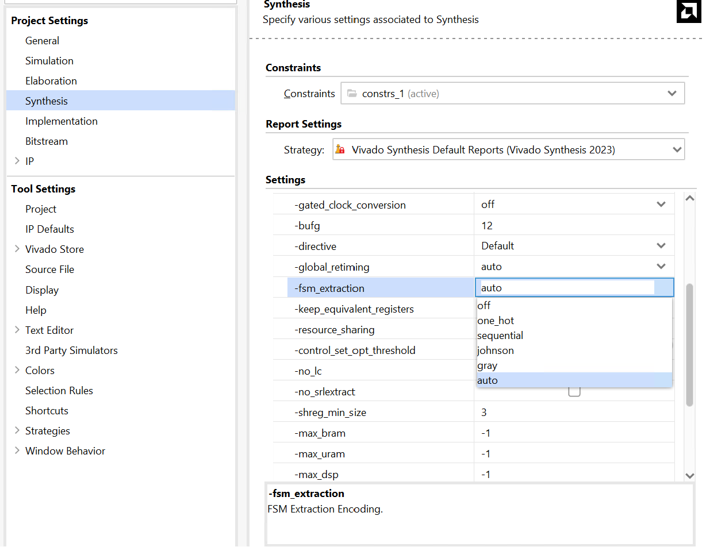</div>

### Part10-1-1
Design a sequence detector implementing a Mealy state machine using
three always blocks. The Mealy state machine has one input (ain) and one
output (yout). The output yout is one if and only if the total number of 1s
received is divisible by 3 (hint: 0 is inclusive; however, reset cycle(s) do not
count as 0- see in simulation waveform time=200). Develop a testbench and
verify the model through a behavioral simulation.

<div align=center>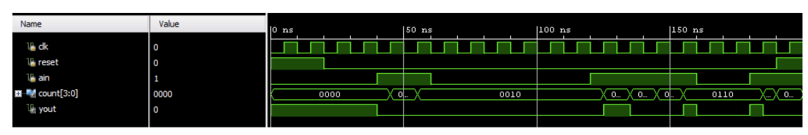</div>

**lab10_1_1.v**
```verilog
// Mealy state machine for detecting sequences where the number of 1's is divisible by 3.
module sequence_detector_mealy (
    input wire clk,          // Clock input
    input wire reset,        // Asynchronous reset
    input wire ain,          // Input signal
    output reg yout,         // Output signal (1 when the total number of '1's is divisible by 3)
    output reg [3:0] count   // Counter for the number of '1's received
);

    // State encoding
    localparam S0 = 2'b00, S1 = 2'b01, S2 = 2'b10;

    // Current and next state variables
    reg [1:0] current_state, next_state;

    // Sequential logic for state updating and counter
    always @(posedge clk or posedge reset) begin
        if (reset) begin
            current_state <= S0;
            count <= 0; // Reset count when the system is reset
        end else begin
            current_state <= next_state;
            if (ain) count <= count + 1; // Increment count with each '1' received
        end
    end

    // Combinational logic for next state and output
    always @(*) begin
        // Default conditions
        next_state = current_state;
        yout = 1'b0;
        
        case (current_state)
            S0: begin
                if (ain) next_state = S1;
            end
            S1: begin
                if (ain) next_state = S2;
            end
            S2: begin
                if (ain) next_state = S0;
            end
        endcase
        
        // Output logic for Mealy machine: 'yout' is '1' when the number of '1's is divisible by 3
        if (count % 3 == 0 && ain) yout = 1'b1;
    end

endmodule

```

**tb.v**
```verilog

// Testbench for the sequence detector
module tb_sequence_detector_mealy();

    reg clk, reset, ain;
    wire yout;
    wire [3:0] count;

    // Instantiate the sequence detector
    sequence_detector_mealy UUT (
        .clk(clk),
        .reset(reset),
        .ain(ain),
        .yout(yout),
        .count(count)
    );

    // Clock generation
    initial begin
        clk = 0;
        forever #10 clk = ~clk; // Clock with period 20 units
    end

    // Stimulus
    initial begin
        // Initialize
        reset = 1; ain = 0;
        #40; // Apply reset

        reset = 0; // Release reset
        ain = 1;
        #40;
        ain = 0;
        #60;
        ain = 1;
        #80;
        ain = 0;
        #40; // Wait more before ending simulation
        $finish;
    end

    // Monitoring
    initial begin
        $monitor("Time=%g, reset=%b, ain=%b, yout=%b, count=%d", $time, reset, ain, yout, count);
    end

endmodule
```

We can run a Simulation to check the code by clicking the Run Simulation under the SIMULATION and choosing the first Run Behavioral Simulation.

<div align=center>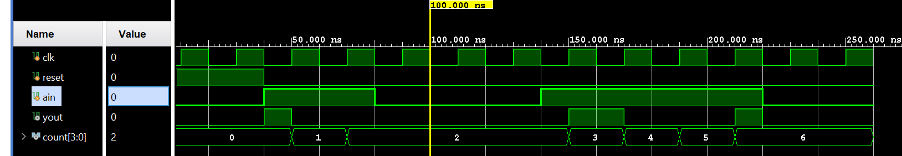</div>

## Moore FSM
A general model of a Moore sequential machine is shown below. Its output is generated from the state
register block. The next state is determined using the present (current) input and the present (current)
state. Here, the state register is also modeled using D flip-flops. Normally, Moore machines are described
using three blocks, one of which must be sequential, and the other two can be modeled using ```always``` blocks or a combination of ```always``` and dataflow modeling constructs.

<div align=center>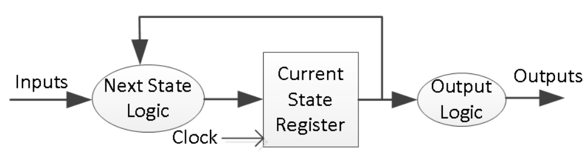</div>

Here is the state graph of the same parity checker to be modeled as a Moore machine. The associate model is shown below.

<div align=center>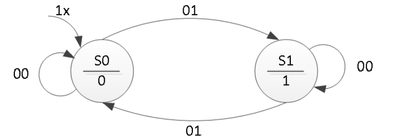</div>

```verilog
module moore_3processes(
    input clk,       // Clock signal
    input reset,     // Reset signal
    input x,         // Input signal
    output reg parity // Output signal
);
    // State and next state declaration
    reg state, nextstate;

    // State definition using parameters for readability
    parameter S0 = 0, S1 = 1;

    // Sequential always block for state updating
    // This block responds to the clock's positive edge or the reset's positive edge.
    always @(posedge clk or posedge reset) begin
        if (reset)
            state <= S0; // On reset, go to state S0
        else
            state <= nextstate; // On the clock, move to the next state
    end

    // Combinational always block to determine the output based on the current state
    // This is specific to Moore machines where output only depends on the state
    always @(state) begin
        case(state)
            S0: parity = 0; // In state S0, set parity to 0
            S1: parity = 1; // In state S1, set parity to 1
        endcase
    end

    // Combinational always blocks to compute the next state based on the current state and input
    always @(state or x) begin
        nextstate = S0; // Default next state is S0
        case(state)
            S0: if(x)
                nextstate = S1; // In state S0, move to S1 if x is 1
            S1: if(!x)
                nextstate = S1; // In state S1, stay in S1 if x is 0
            // Default condition can be added if required
        endcase
    end
endmodule

```
The output block, when it is simple, as in this example, can be modeled using dataflow modeling constructs. The following code can be used instead of the always block. You also need to change the output type from reg to wire.

```verilog
assign parity = (state==S0) ? 1'b0: 1'b1; 

```

### Part10-2-1
Design a sequence detector implementing a Moore state machine using
three always blocks. The Moore state machine has two inputs (ain[1:0]) and
one output (yout). The output yout begins as 0 and remains a constant
value unless one of the following input sequences occurs:
(i) The input sequence ain[1:0] = 01, 00 causes the output to become 0
(ii) The input sequence ain[1:0] = 11, 00 causes the output to become 1
(iii) The input sequence ain[1:0] = 10, 00 causes the output to toggle.
Develop a testbench (similar to the waveform shown below) and verify the
model through a behavioral simulation.

<div align=center>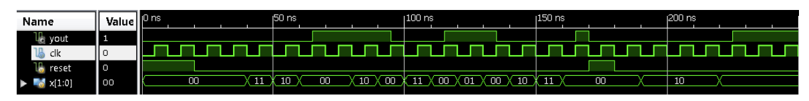</div>

**lab10_2_1.v**
```verilog
// This module implements a Moore sequence detector. The sequence detector monitors
// the input 'ain' for specific patterns and changes the output 'yout' accordingly.
// The specific patterns detected are:
// 1. Sequence 01 followed by 00 sets 'yout' to 0.
// 2. Sequence 11 followed by 00 sets 'yout' to 1.
// 3. Sequence 10 followed by 00 toggles 'yout'.
module moore_sequence_detector(
    input wire clk, // Clock signal for synchronizing the state transitions.
    input wire reset, // Asynchronous reset signal to initialize the state machine.
    input wire [1:0] ain, // 2-bit input signal for detecting patterns.
    output reg yout // Output signal that changes based on detected sequences.
);

    // Define state codes using local parameters for readability.
    localparam [2:0] 
        IDLE = 3'b000, // Idle state, waiting for a sequence to start.
        SEQ_01 = 3'b001, // Not used, as detection happens in WAIT_00_FROM_* states.
        SEQ_11 = 3'b010, // Not used, as detection happens in WAIT_00_FROM_* states.
        SEQ_10 = 3'b011, // Not used, as detection happens in WAIT_00_FROM_* states.
        WAIT_00_FROM_01 = 3'b100, // State indicating 01 has been detected, waiting for 00.
        WAIT_00_FROM_11 = 3'b101, // State indicating 11 has been detected, waiting for 00.
        WAIT_00_FROM_10 = 3'b110; // State indicating 10 has been detected, waiting for 00.

    // Registers are used to hold the current and next state of the state machine.
    reg [2:0] current_state, next_state;

    // Sequential logic block for state transition.
    // On each positive clock edge or when reset is asserted, the state machine updates its current state.
    always @(posedge clk or posedge reset) begin
        if (reset)
            current_state <= IDLE; // On reset, initialize to IDLE state.
        else
            current_state <= next_state; // Otherwise, transition to the next state.
    end

    // Combinational logic block to determine the next state based on the current state and input signals.
    always @(*) begin
        case (current_state)
            IDLE: // In the IDLE state, check the input to determine which sequence might be starting.
                case (ain)
                    2'b01: next_state = WAIT_00_FROM_01; // If input is 01, move to WAIT_00_FROM_01 state.
                    2'b11: next_state = WAIT_00_FROM_11; // If input is 11, move to WAIT_00_FROM_11 state.
                    2'b10: next_state = WAIT_00_FROM_10; // If input is 10, move to WAIT_00_FROM_10 state.
                    default: next_state = IDLE; // For any other input, remain in IDLE.
                endcase
            // In WAIT_00_FROM_* states, transition back to IDLE upon receiving 00, staying otherwise.
            WAIT_00_FROM_01: next_state = (ain == 2'b00) ? IDLE : WAIT_00_FROM_01;
            WAIT_00_FROM_11: next_state = (ain == 2'b00) ? IDLE : WAIT_00_FROM_11;
            WAIT_00_FROM_10: next_state = (ain == 2'b00) ? IDLE : WAIT_00_FROM_10;
            default: next_state = IDLE; // Fallback to IDLE for undefined states.
        endcase
    end

    // Output logic to update 'yout' based on the current state and detected sequences.
    // This block ensures that the output changes only at specific points in the sequence.
    always @(posedge clk) begin
        if (reset)
            yout <= 0; // Reset output to 0.
        else 
            case (current_state)
                // Set 'yout' based on the specific sequence detected and completed.
                WAIT_00_FROM_01: yout <= 0; // Sequence 01, 00 detected.
                WAIT_00_FROM_11: yout <= 1; // Sequence 11, 00 detected.
                WAIT_00_FROM_10: yout <= ~yout; // Sequence 10, 00 detected, toggle output.
                default: yout <= yout; // No change in output for other states.
            endcase
    end
endmodule
```

**tb.v**
```verilog
module tb_moore_sequence_detector();

    reg clk = 0, reset = 1;
    reg [1:0] ain = 2'b00;
    wire yout;

    // Instantiate the Moore sequence detector
    moore_sequence_detector uut(
        .clk(clk),
        .reset(reset),
        .ain(ain),
        .yout(yout)
    );

    // Clock generation
    always #10 clk = ~clk;

    // Test sequence generation
    initial begin
        // Reset the system
        #25 reset = 0;

        // Generate sequences
        #20 ain = 2'b01; // Trigger SEQ_01
        #20 ain = 2'b00;
        #20 ain = 2'b11; // Trigger SEQ_11
        #20 ain = 2'b00;
        #20 ain = 2'b10; // Trigger SEQ_10
        #20 ain = 2'b00;
        #20 ain = 2'b10; // Trigger TOGGLE again
        #20 ain = 2'b00;
//        #20 $finish;
    end

    // Monitor the outputs
    initial begin
        $monitor("Time=%t: reset=%b, ain=%b, yout=%b", $time, reset, ain, yout);
    end

endmodule

```
We can run a Simulation to check the code by clicking the Run Simulation under the SIMULATION and choosing the first Run Behavioral Simulation.

<div align=center></div>

## Mealy FSM Using ROM 

A Mealy sequential machine can also be implemented using ROM memory as shown below. The ROM
memory holds the next state and output content. The external inputs and the current state form the
address input to the ROM. The ROM typically is implemented using LUTs instead of BlockRAM since
LUTs give a better utilization ratio resulting from a smaller number of states in a design. 

<div align=center>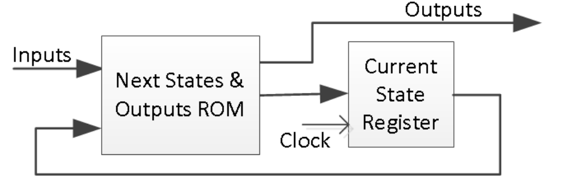</div>


### Part10-3-1
Design a specific counts counter (counting sequence listed below) using
ROM to develop a Mealy state machine. Develop a testbench and verify the
model through behavioral simulation. The counting sequence will be: 000, 001, 011, 101, 111, 010 (repeat) 000, …

<div align=center>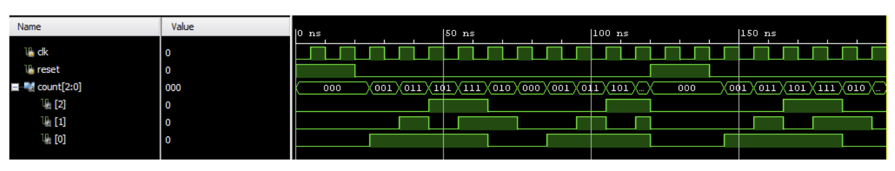</div>

**lab10_3_1.v**
```verilog
module specific_counter_mealy (
    input clk,       // Clock signal
    input reset,     // Reset signal
    input enable,    // Enable signal for counting
    output [2:0] out // Output representing the current count
);
    // ROM storage for state transitions based on the current state
    // Since the sequence has 6 unique states, use a 3-bit representation
    reg [2:0] state_rom[0:5]; // 6 states, represented by 3 bits each
    reg [2:0] state;          // Current state
    reg [2:0] next_state;     // Next state

    // Initialize the ROM with the specific counting sequence
    initial begin
        state_rom[0] = 3'b000; // First state
        state_rom[1] = 3'b001; // Second state
        state_rom[2] = 3'b011; // Third state
        state_rom[3] = 3'b101; // Fourth state
        state_rom[4] = 3'b111; // Fifth state
        state_rom[5] = 3'b010; // Sixth state (leads back to the first state)
    end

    // Sequential logic for updating the state at every clock cycle
    always @(posedge clk or posedge reset) begin
        if (reset)
            state <= 3'b000; // Reset to initial state
        else if (enable)
            state <= next_state; // Move to next state if enabled
    end

    // Combinational logic for determining the next state
    always @(*) begin
        case (state)
            3'b000: next_state = state_rom[1]; // From state 000 to 001
            3'b001: next_state = state_rom[2]; // From state 001 to 011
            3'b011: next_state = state_rom[3]; // From state 011 to 101
            3'b101: next_state = state_rom[4]; // From state 101 to 111
            3'b111: next_state = state_rom[5]; // From state 111 to 010
            3'b010: next_state = state_rom[0]; // From state 010 back to 000
            default: next_state = 3'b000;      // Default back to 000
        endcase
    end

    // Output logic (since this is a Mealy machine, output could depend on the current state and input, but here it's simply the state)
    assign out = state;
endmodule
```
**tb.v**
```verilog

module tb_specific_counter_mealy();

    reg clk, reset, enable;
    wire [2:0] out;

    // Instantiate the counter module
    specific_counter_mealy uut (
        .clk(clk),
        .reset(reset),
        .enable(enable),
        .out(out)
    );

    // Generate the clock
    always #10 clk = ~clk; // 50MHz clock

    initial begin
        // Initialize inputs
        clk = 0;
        reset = 1;
        enable = 0;
        #40; // Reset time
        
        reset = 0;
        enable = 1; // Start the counter

        // Monitor the output
        #600; // Run long enough to see a repeating sequence
        $finish;
    end

    initial begin
        $monitor("Time=%t | state=%b", $time, out);
    end

endmodule
```
We can run a Simulation to check the code by clicking the Run Simulation under SIMULATION and choosing the first Run Behavioral Simulation.

<div align=center>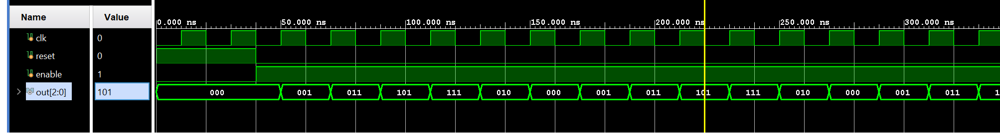</div>


## Conclusion 

In this lab, you learned Mealy and Moore state machine modeling methodologies. You designed and implemented a sequence detector, a sequence generator, and code converters using the two and three always blocks styles. 

