# Lab11_Sequential System Design Using ASM Charts    

## Introduction

Control unit designs may range from simple to highly complex. There are number of methods to design
and realize control units. Simple control units can be designed using state graphs and state table
methods. Complex control units may be designed using algorithmic charts just like flowcharts are used in
software development. In this lab, you will be introduced to the Algorithmic State Machine (ASM) chart
technique.

## ASM Charts

Just as flowcharts are useful in software design, special flowcharts called Algorithmic State Machines
(ASM) are useful in digital systems hardware design. Digital systems typically consist of datapath
processing and the control path. The control path is implemented using state machines which can be
realized using state graphs. As the control path (behavior) of the system becomes complex, it becomes
increasingly difficult to design the control path using the state graph technique. The ASM charts technique
becomes useful and handy in designing complex and algorithmic circuits. The following diagram shows a
complex digital system, partitioned into a controller (to generate the control signals) and the controlled
architecture (data processor). 

<div align=center>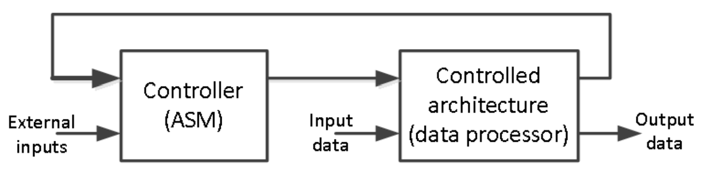</div>

The model of the Controller (ASM) block in the above figure can be viewed as the combination of Mealy and Moore machines as shown below.

<div align=center>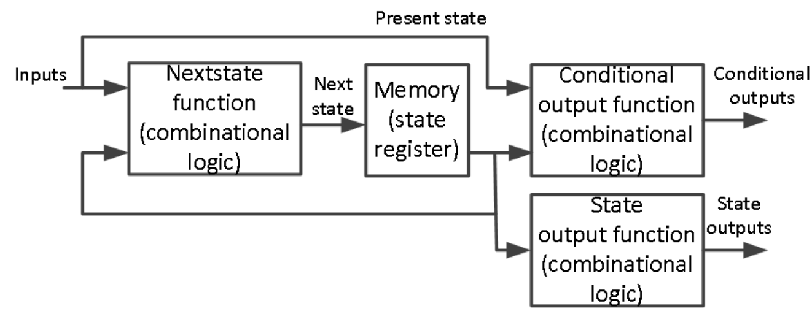</div>

The ASM chart differs from an ordinary flowchart in that specific rules must be followed in constructing the
chart. When these rules are followed, the ASM chart is equivalent to a state graph, and it leads directly to
a hardware realization. The following diagram shows the three main components of an ASM chart. 

<div align=center>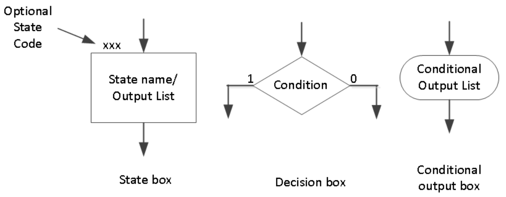</div>


The state of the system is represented by a state box. The state box contains a state name, and it may
contain an output list (just like in a state graph of the Moore machine). A state code may be placed
outside the box at the top (if you want to assign a state code). A decision box always has true and false
branches. The condition placed in the decision box must be a Boolean expression that is evaluated to
determine which branch to take. The conditional output box contains a conditional output list. The
conditional outputs depend on both the state of the system and the inputs (just like in the Mealy machine). 

The ASM chart is constructed from SM blocks. Each SM block contains exactly one state box together
with decision boxes and conditional output boxes associated with that state as shown below. An SM
block has exactly one entrance path and one or more exit paths. Each SM block describes the machine
operation during the time that the machine is in that state. A path through an SM block from entrance to
exit is referred to as a link path. 

<div align=center>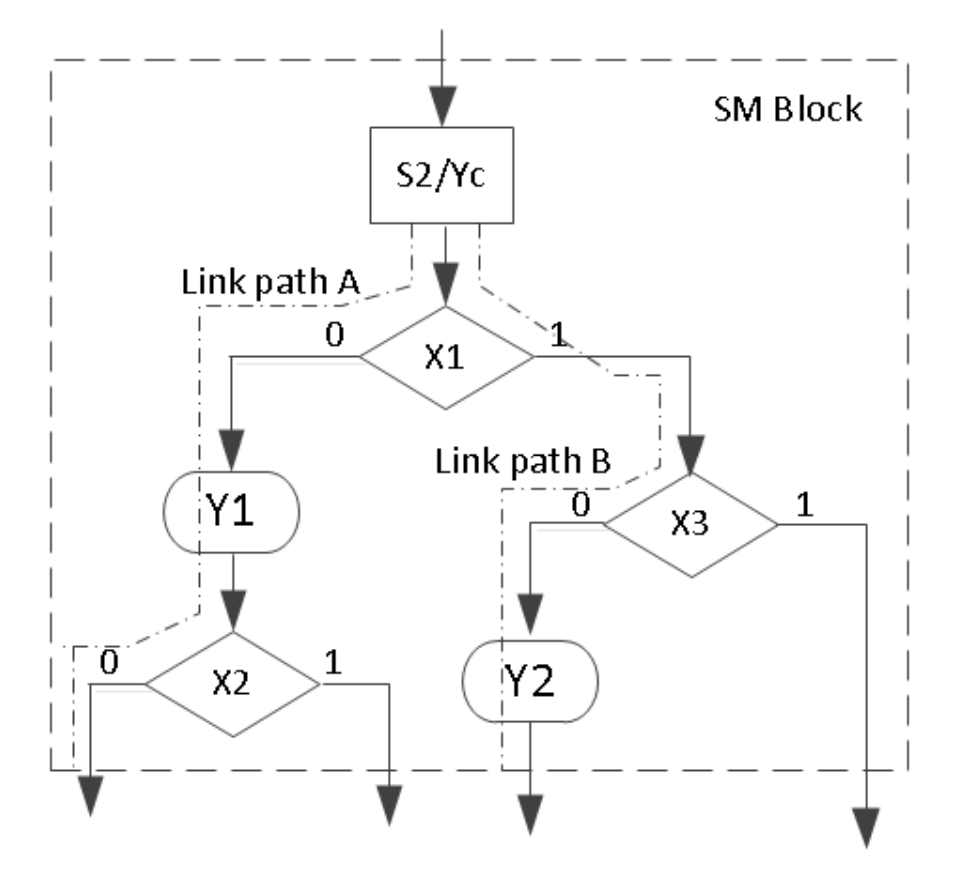</div>

Let us consider an example of a state graph of a sequential network shown below. This state graph has both Mealy and Moore outputs. The outputs Y1 and Y2 are the Mealy outputs and so should be conditional outputs. The Ya, Yb, and Yc are the Moore outputs so they should be part of state box. Input
X can either be “0” or “1” and hence it should be part of the decision box. 

<div align=center>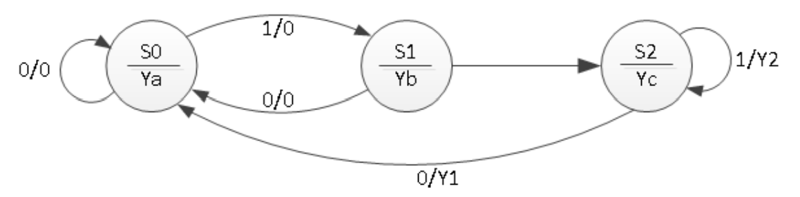</div>

The ASM chart of the above state graph is as shown below. 

<div align=center></div>

Once the ASM chart is determined, the conversion to HDL is straight forward. A ```case``` statement can be used to specify what happens in each state. Each condition box corresponds directly to an if statement (or an else if). The following code represents the functionality of the above ASM chart.

```verilog
module asm_chart(input clk, input x, output reg ya, output reg yb, output reg yc, output reg y1, output reg y2);
    // State declaration
    reg [1:0] state, nextstate; // Registers for current and next state
    parameter [1:0] S0=0, S1=1, S2=2; // States encoding
    
    // State Update Block
    always @(posedge clk) // Updates the current state on every positive clock edge
        state <= nextstate;

    // Next State and Mealy Output Logic Block
    always @(state or x) // Determines the next state and Mealy outputs based on current state and input x
    begin
        y1 = 1'b0; // Default Mealy outputs
        y2 = 1'b0;
        case (state) // Decision logic based on current state
            S0: if(x) nextstate = S1; else nextstate = S0; // Transitions from state S0
            S1: if(x) nextstate = S2; else nextstate = S0; // Transitions from state S1
            S2: if(x) begin y2 = 1'b1; nextstate = S1; end else begin y1 = 1'b1; nextstate = S0; end // Transitions from state S2
            default: nextstate = S0; // Default case to avoid latches
        endcase
    end

    // Moore Output Logic Block
    always @(state) // Determines Moore outputs based solely on current state
    begin
        // Resetting all Moore outputs
        ya = 1'b0;
        yb = 1'b0;
        yc = 1'b0;
        // Setting Moore outputs based on current state
        case (state)
            S0: ya = 1'b1; // Output for state S0
            S1: yb = 1'b1; // Output for state S1
            S2: yc = 1'b1; // Output for state S2
            default: begin ya = 1'b0; yb = 1'b0; yc = 1'b0; end // Default case to ensure defined outputs
        endcase
    end
endmodule

```

The following behavioral simulation result shows the above model functionality. 

<div align=center>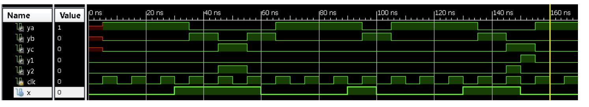</div>

### Part11-1-1

Design a 3-Bit x 3-Bit binary multiplier. The multiplier will output 6-Bit
product. The data processor unit will consist of a 3-Bit accumulator, a 3-Bit
multiplier register, a 3-Bit adder, a counter, and a 3-bit shifter. The control
unit will consist of a least-significant-bit (lsb) of the multiplier, a start
signal, a cnt_done signal, and clk as an input. It will generate start, shift,
add, and done signals. Develop an ASM chart for the control unit. Develop
models for the data processor and the control unit. Develop a testbench to
validate the design using the behavioral simulation. 

<div align=center>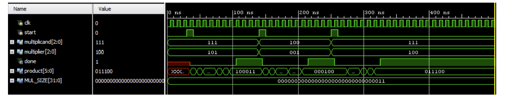</div>

**lab11_1_1.v**
```verilog
module ControlUnit(
    input clk,
    input reset,
    input start,
    input cnt_done,
    input lsb,
    output reg shift,
    output reg add,
    output reg done
);
    // State definitions for the finite state machine.
    parameter IDLE = 0, CHECK_LSB = 1, ADD = 2, SHIFT = 3, DONE = 4;

    // Current state and next state variables.
    reg [2:0] state, next_state;

    // Sequential logic to update the current state on every positive edge of the clock or when reset.
    // If reset is active, state is set to IDLE. Else, move to next state based on current state logic.
    always @(posedge clk or posedge reset) begin
        if (reset) 
            state <= IDLE; // Reset the state to IDLE.
        else 
            state <= next_state; // Transition to the next state.
    end

    // Combinational logic to decide the next state based on the current state and inputs.
    // This block sets the next state and control signals based on the state and inputs.
    always @(*) begin
        case (state)
            IDLE: 
                begin
                    done <= 0; // Clear the done signal in IDLE state.
                    if (start) next_state = CHECK_LSB; // If 'start' is active, move to CHECK_LSB.
                    else next_state = IDLE; // Stay in IDLE if not started.
                end              
            CHECK_LSB: 
                next_state = lsb ? ADD : SHIFT; // Decide next state based on LSB of the multiplier.
            ADD: 
                next_state = SHIFT; // After addition, shift the bits.
            SHIFT: 
                next_state = cnt_done ? DONE : CHECK_LSB; // If count is done, go to DONE, else check LSB again.
            DONE: 
                begin
                    done <= 1; // Mark completion.
                    next_state = IDLE; // Return to IDLE after completion.
                end
            default: 
                begin
                    done <= 0; // In default case, ensure 'done' is not high.
                    next_state = IDLE; // Revert to IDLE to handle unexpected states.
                end
        endcase
    end

    // Update shift and add control signals based on the current state.
    // These signals control the data processing part of the multiplier.
    always @(*) begin
        shift = (state == SHIFT); // Enable shift operation in SHIFT state.
        add = (state == ADD); // Enable addition in ADD state.
    end
endmodule


module DataProcessor(
    input clk,
    input reset,
    input start,
    input [2:0] multiplicand,
    input [2:0] multiplier,
    output  reg[5:0] product,
    output done
);
    // Internal registers for multiplication process
    reg [2:0] internal_multiplier; // Holds the current value of the multiplier for manipulation.
    reg [3:0] accumulator; // Accumulates partial products.
    reg [2:0] counter; // Counts the number of shifts (equivalent to multiplication steps).
    wire shift, add; // Signals from control unit for shifting and adding.
    reg cnt_done; // Indicates whether all multiplication steps are completed.
    wire lsb; // Least significant bit of the multiplier for decision-making in ControlUnit.
    reg cnt_done;
    reg bits;
    reg [2:0] shift_bits;
    // Assign least significant bit of the multiplier for use in the ControlUnit.
    assign lsb = internal_multiplier[0];

    // Sequential logic handling resets, shifting, and addition operations.
    always @(posedge clk or posedge reset) begin
        if (reset) begin
            // Initialization upon reset.
            counter <= 3'd3;
            accumulator <= 3'd0;
            internal_multiplier <= 0;
            cnt_done <= 0;
            product <= 6'd0;
            bits <= 0;
            shift_bits <= 3'd0;
        end
        else if (start) begin
            internal_multiplier <= multiplier;
            counter <= 3; // For a 3-bit multiplication
        end 
        else if (add) begin
            accumulator <= accumulator + multiplicand;
        end 
        else if (shift) begin
            internal_multiplier <= internal_multiplier >> 1;
//            product <= {accumulator[0], product >>1};
            accumulator <= accumulator >> 1;
            counter <= counter - 1;
            cnt_done <= (counter == 2);
            bits <= accumulator[0];
        end
        if (cnt_done) product <= {accumulator,shift_bits[2:1]};  
       
    end
      always @(posedge shift) begin
        if (reset)
            shift_bits <= 0;  // Clear shift_data on reset.
        else 
            shift_bits <= {bits, shift_bits[2:1]};  // Shift in new bits on clock edge.
           
    end

    
    // Instance of ControlUnit: manages the state machine controlling the multiplication process.
    ControlUnit ctrl(
        .clk(clk), 
        .reset(reset), 
        .start(start), 
        .cnt_done(cnt_done), 
        .lsb(lsb), 
        .shift(shift),
        .add(add),
        .done(done)
    );  
endmodule

```

**tb.v**
```verilog

module Testbench();
    // Testbench control signals
    reg clk = 0; // Clock signal
    reg reset = 0; // Reset signal
    reg start = 0; // Start signal to begin multiplication
    // Inputs to the DataProcessor
    reg [2:0] multiplicand = 3'b101; // Example multiplicand
    reg [2:0] multiplier = 3'b110;   // Example multiplier
    // Outputs from the DataProcessor
    wire [5:0] product; // The resulting product of the multiplication
    wire done; // Signal indicating completion of the multiplication

    // Instantiate the DataProcessor module
    DataProcessor dp(.clk(clk), .reset(reset), 
                     .start(start), .multiplicand(multiplicand), 
                     .multiplier(multiplier), .product(product), .done(done));

    // Generate a clock with a period of 10 time units
    always #5 clk = !clk;

    // Define the sequence of events for the test
    initial begin
        // Reset the system
        reset = 1; #10;
        reset = 0; #10; // Release reset and start multiplication
        start = 1; #10; // Trigger the start of multiplication
        start = 0; // Stop the start signal to continue the normal operation

        // Wait until the multiplication is complete
        wait(done == 1);
        #10;  // Give extra time to observe the final product

        // Reset for next operation
        reset = 1; #20; // Apply reset between operations
        reset = 0; #10; // Release reset for next operation
        start = 1;// Start next multiplication operation
        multiplicand = 3'd2; // Change multiplicand
        multiplier = 3'd5;  #10; 
        start = 0; // Stop start signal
         // Change multiplier

        // Wait for the second multiplication to complete
        wait(done == 1);
        #10; // Give extra time to observe the final product

        // Display the result and finish the simulation
        $display("Final product: %b", product);
//        $finish; // End the simulation
    end
endmodule

```
The following behavioral simulation result shows the above model functionality. 

<div align=center>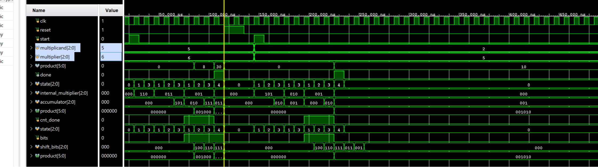</div>

## Sequential System Design Using ASM Chart
We saw how the ASM chart technique can be used in designing control units of sequential machine. Now
we will use the ASM chart technique along with the sequential design principles to design complex
systems. 

### Part11-2-1
Modify the design of 1-1 to perform 4-Bit x 4-Bit unsigned multiplication.
You will store the 4-Bit multiplicand and multipliers in 32x4 ROM (first 16
locations holding multiplicands and the other 16 locations holding
multipliers).

**lab11_2_1.v**
```verilog
module ROM_4bit(
    input [4:0] address, // 5 bits to cover 0 to 31 addresses
    output reg [3:0] data
);

    // Define the ROM content
    always @(address) begin
        case(address)
            // Define your 16 multiplicands here
            5'd0 : data = 4'b0001; // Example for multiplicand
            5'd1 : data = 4'd11; // Another multiplicand
            5'd2 : data = 4'd2;
            // Add more as needed...

            // Define your 16 multipliers here, starting from address 16 (5'd16)
            5'd16: data = 4'b0001; // Example for multiplier
            5'd17: data = 4'd11; // Another multiplier
             5'd18 : data = 4'd10;
            // Add more as needed...
            
            // Default case for safety
            default: data = 4'b0000;
        endcase
    end
endmodule

module DPU_4bits(
    input clk,
    input reset,
    input start,
    input [4:0] address,
    output  reg[7:0] product,
    output done
);

    wire [3:0] multiplicand;
    wire [3:0] multiplier;

ROM_4bit multiplicand_rom(.address(address), .data(multiplicand));

ROM_4bit multiplier_rom(.address(address+16), .data(multiplier));


    // Internal registers for multiplication process
    reg [3:0] internal_multiplier; // Holds the current value of the multiplier for manipulation.
    reg [4:0] accumulator; // Accumulates partial products.
    reg [3:0] counter; // Counts the number of shifts (equivalent to multiplication steps).
    wire shift, add; // Signals from control unit for shifting and adding.
    reg cnt_done; // Indicates whether all multiplication steps are completed.
    wire lsb; // Least significant bit of the multiplier for decision-making in ControlUnit.
    reg cnt_done;
    reg bits;
    reg [3:0] shift_bits;
    // Assign least significant bit of the multiplier for use in the ControlUnit.
    assign lsb = internal_multiplier[0];

    // Sequential logic handling resets, shifting, and addition operations.
    always @(posedge clk or posedge reset) begin
        if (reset) begin
            // Initialization upon reset.
            counter <= 4'd4;
            accumulator <= 4'd0;
            internal_multiplier <= 0;
            cnt_done <= 0;
            product <= 8'd0;
            bits <= 0;
            shift_bits <= 4'd0;
        end
        else if (start) begin
            internal_multiplier <= multiplier;
            counter <= 4; // For a 3-bit multiplication
        end 
        else if (add) begin
            accumulator <= accumulator + multiplicand;
        end 
        else if (shift) begin
            internal_multiplier <= internal_multiplier >> 1;
            accumulator <= accumulator >> 1;
            counter <= counter - 1;
            cnt_done <= (counter == 2);
            bits <= accumulator[0];
        end
        
       if (cnt_done) product <= {accumulator,shift_bits[3:1]}; 
    end
      always @(posedge shift) begin
        if (reset)
            shift_bits <= 0;  // Clear shift_data on reset.
        else
            shift_bits <= {bits, shift_bits[3:1]};  // Shift in new bits on clock edge.
    end

    
    // Instance of ControlUnit: manages the state machine controlling the multiplication process.
    ControlUnit ctrl(
        .clk(clk), 
        .reset(reset), 
        .start(start), 
        .cnt_done(cnt_done), 
        .lsb(lsb), 
        .shift(shift),
        .add(add),
        .done(done)
    );  
endmodule

```

**tb.v**
```verilog
module Testbench();
    // Testbench control signals
    reg clk = 0; // Clock signal
    reg reset = 0; // Reset signal
    reg start = 0; // Start signal to begin multiplication
    wire [7:0] product; // The resulting product of the multiplication
    wire done; // Signal indicating completion of the multiplication
    reg [4:0] address = 5'd2;


    // Instantiate the DataProcessor module
    DPU_4bits dp(.clk(clk), .reset(reset), .address(address),
                     .start(start), .product(product), .done(done));

    // Generate a clock with a period of 10 time units
    always #5 clk = !clk;

    // Define the sequence of events for the test
    initial begin
        // Reset the system
        reset = 1; #10;
        reset = 0; #10; // Release reset and start multiplication
        start = 1; #10; // Trigger the start of multiplication
        start = 0; // Stop the start signal to continue the normal operation

        // Wait until the multiplication is complete
        wait(done == 1);
        #10;  // Give extra time to observe the final product

        // Reset for next operation
        reset = 1; #20; // Apply reset between operations
        reset = 0; #10; // Release reset for next operation
        address = 5'd1;// Change multiplier
        #10;
        start = 1;
        // Start next multiplication operation
        #10;
        start = 0; // Stop start signal
        // Wait for the second multiplication to complete
        wait(done == 1);
        #10; // Give extra time to observe the final product

        // Display the result and finish the simulation
        $display("Final product: %b", product);
//        $finish; // End the simulation
    end
endmodule
```

The following behavioral simulation result shows the above model functionality. 

<div align=center>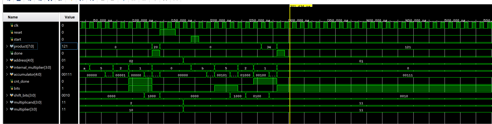</div>


## Conclusion 

In this lab, you learned how ASM charts can be used to design complex control units. You also designed
digital system to perform binary multiplication using the ASM chart technique to develop the control unit
which interfaced to the datapath processing unit. 


## Solution

ASM chart for 1-2
<div align=center>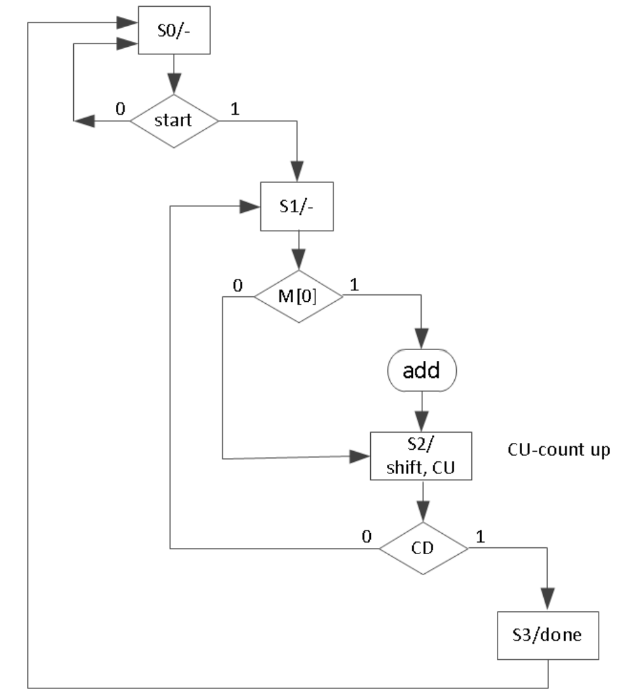</div>

Block Diagram of 2-1 
<div align=center>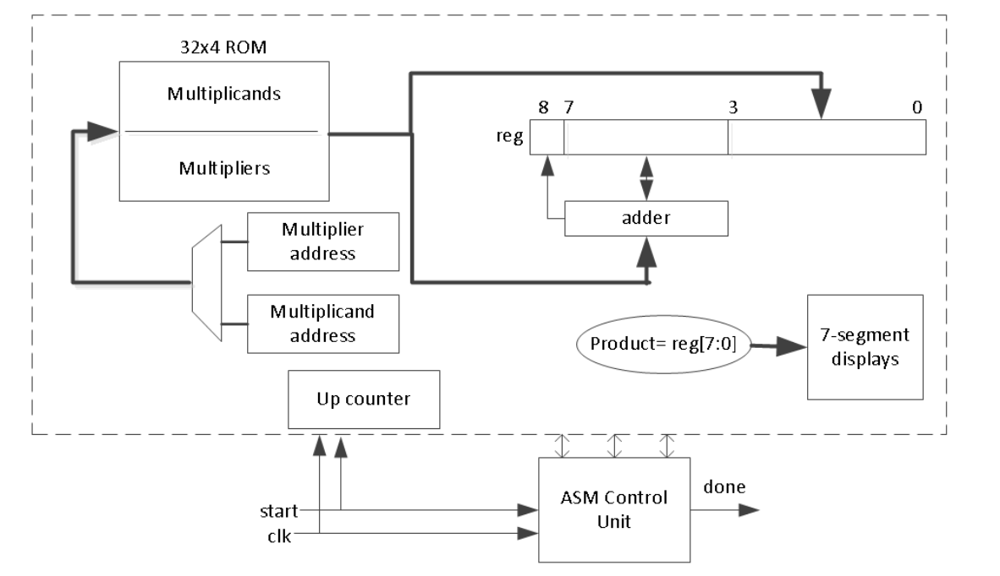</div>