# Lab1_Modeling_Concepts

## Instroduction

Verilog HDL modeling language supports three kinds of modeling styles: gate-level, dataflow, and
behavioral. The gate-level and datafow modeling are used to model combinatorial circuits whereas the
behavioral modeling is used for both combinatorial and sequential circuits.

## Gate-level Modeling

Verilog HDL supports built-in primitive gates modeling. The gates supported are multiple-input, multiple-output, tristate, and pull gates. The multiple-input gates supported are: **and**, **nand**, **or**, **nor**, **xor**, and
**xnor** whose number of inputs is two or more and has only one output. The multiple-output gates
supported are **buf** and **not**, whose output number is one or more and has only one input. The
language also supports modeling of tri-state gates which include **bufif0**, **bufif1**, **notif0**, and
**notif1**. These gates have one input, one control signal, and one output. The pull gates are
**pullup** and **pulldown** with a single output (no input) only.

The basic syntax for each type of gate with zero delays is as follows:
**and** | **nand** | **or** | **nor** | **xor** | **xnor** [instance name] (out, in1, …, inN); // [] is optional and | is
selection
**buf** | **not** [instance name] (out1, out2, …, out2, input);
**bufif0** | **bufif1** | **notif0** | **notif1** [instance name] (outputA, inputB, controlC);
**pullup** | **pulldown** [instance name] (output A);

One can also have multiple instances of the same type of gate in one construct separated by a comma
such as
**and** [inst1] (out11, in11, in12), [inst2] (out21, in21, in22, in23), [inst3] (out31, in31, in32, in33);
The language also allows the delays to be expressed when instantiating gates. The delay expressed is
from input to output. The delays can be expressed in the form of rise, fall, and turn-off delays; one, two, or all
three types of delays can be expressed in a given instance expression. The turn-off delay applies to
gates whose output can be turned OFF(.e.g. notif1). 

For example, 

```verilog
and #5 A1(Out, in1, in2); // the rise and fall delays are 5 units
and #(2,5) A2(out2, in1, in2); // the rise delay is 2 units and the fall delay is five units
notif1 #(2, 5, 4) A3(out3, in2, ctrl1); //the rise delay is 2, the fall delay is 5, and the turnoff delay is 4 unit 

```

Gate-level modeling is useful when a circuit is a simple combination, such as a multiplexer.
A multiplexer is a simple circuit which connects one of many inputs to an output. In this part, you will create
a simple 2-to-1 multiplexer and extend the design to multiple bits. 

### Part 1-1-1

Create and add the Verilog module with three inputs (x, y, s) and one output (m) using gate-level
modeling. 

<div align=center>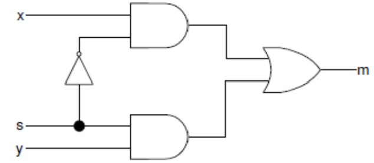</div>

Hint: Click the **Green Plus** button on the Add Sources on the New Project window. Then Click
**Create File**. Name the file **lab1_1_1**, click **OK**.

<div align=center>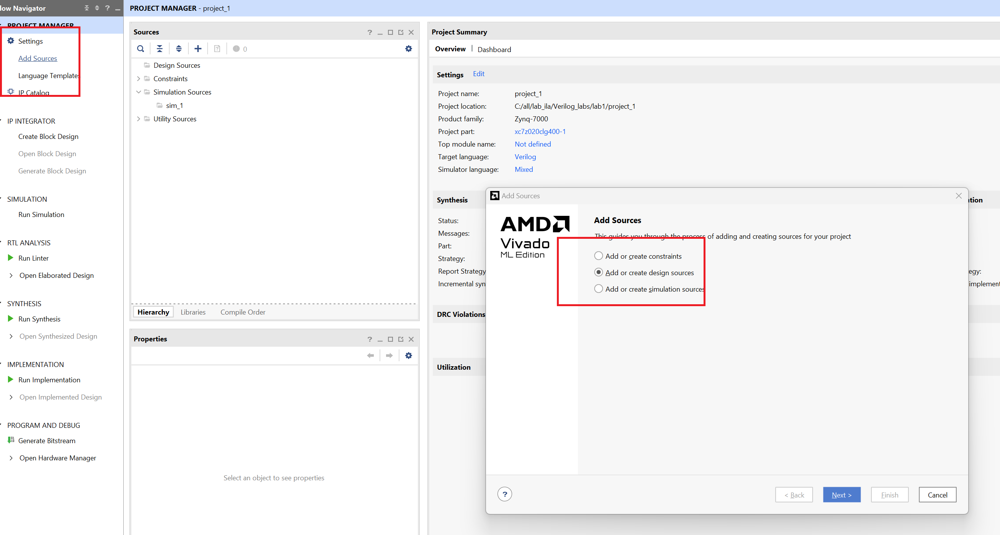</div>

<div align=center>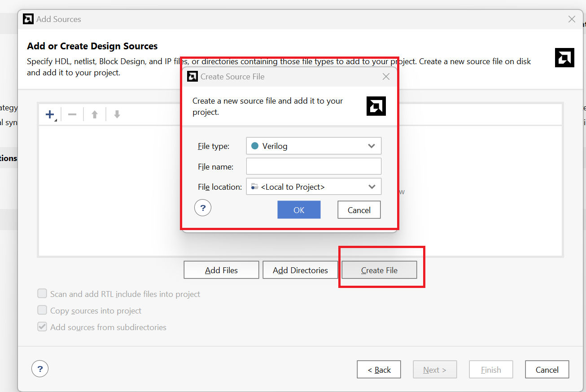</div>

**lab1_1_1.v**
```verilog
// Define the module with inputs x, y, s and output m.
module multiplexer_2to1(
    input x,  // First input of the multiplexer
    input y,  // Second input of the multiplexer
    input s,  // Select signal for the multiplexer
    output m  // Output of the multiplexer
);

    // Intermediate wires for the gate-level implementation.
    wire not_s;
    wire x_and_not_s;
    wire y_and_s;

    // Gate-level modeling of the multiplexer
    not u1(not_s, s);           // Invert the select signal
    and u2(x_and_not_s, x, not_s); // AND gate for x and the inverted select signal
    and u3(y_and_s, y, s);      // AND gate for y and the select signal
    or  u4(m, x_and_not_s, y_and_s); // OR gate to produce the final output

endmodule


```

Now we can see the ```Schematic``` under the RTL ANALYSIS part like below:

<div align=center>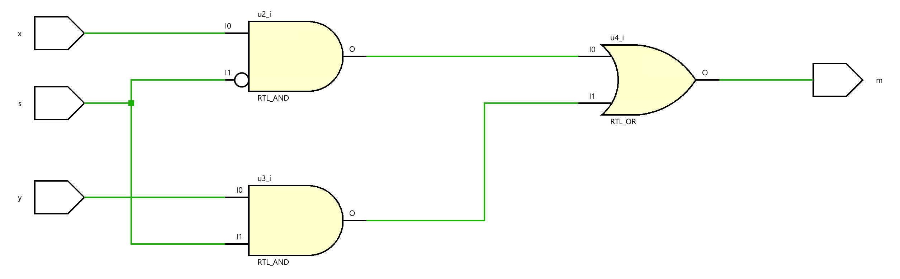</div>

Then we can click on the Run synthesis under ```SYNTHESIS``` and Run implementation under ```IMPLEMENTATION```. We should  add the appropriate board-related master XDC file to the project and edit it to include the related pins. Assign *x* to **L20**, *y* to **D20**, and the *s* to **L19** and *m* to **R14** 

<div align=center></div>

Click on the Generate Bitstream under the ```PROGRAM AND DEBUG```, and when writing bitstream is complete, we can download the file to the board and verify the lab. Here, you have two ways.

First, you can click on the ```Open Hardware Manager``` under the ```PROGRAM AND DEBUG``` and click on the ```Open Target``` to auto-connect to your board. But you need to connect your board to your computer using the USB cable. Then you will the green words like below:

<div align=center>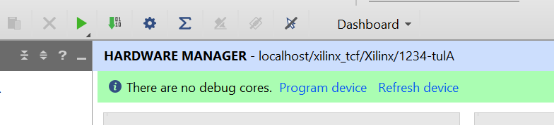</div>

We don't need to debug, we just need to ```Program device``` like below:

<div align=center></div>

Then you can press the button on the board and you can see the LED is on like below:

<div align=center>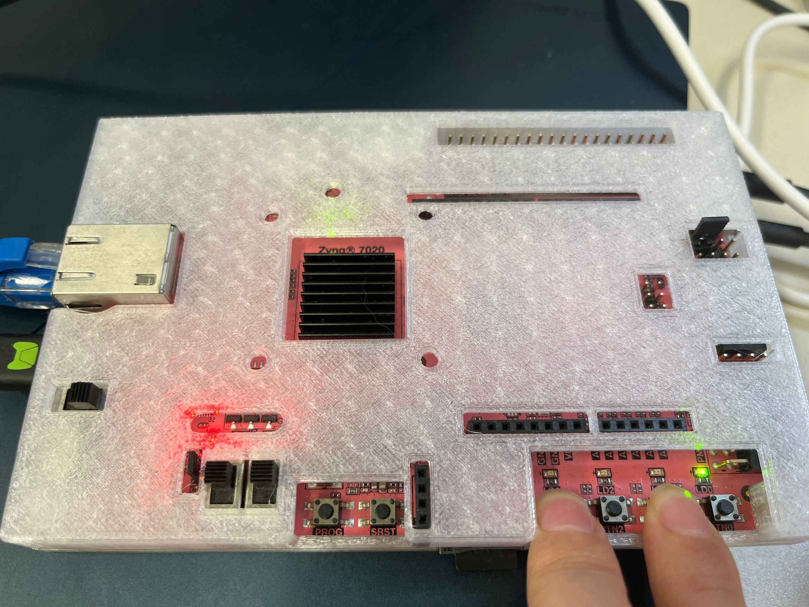</div>


The second way that you can refer to the [Soc_labs](https://uri-nextlab.github.io/ParallelProgammingLabs/Labs/Lab1_led.html#verify-functionality)

### Part 1-1-2

Create a two-bit wide 2-to-1 multiplexer using gate-level modeling. Create and add the Verilog module with two 2-bit inputs (*x[1:0]*, *y[1:0]*), a one-bit select input (s),
and two-bit output (*m[1:0]*) using gate-level modeling.

**lab1_1_2.v**
```verilog

// Define the module with 2-bit inputs x, y, single-bit select input s, and 2-bit output m.
module lab1_1_2(
    input [1:0] x,  // First 2-bit input
    input [1:0] y,  // Second 2-bit input
    input s,       // Select signal
    output [1:0] m // 2-bit output
);

    // Intermediate wires for the gate-level implementation of each bit.
    wire not_s;
    wire [1:0] x_and_not_s;
    wire [1:0] y_and_s;

    // Invert the selected signal for use with both bits
    not u0(not_s, s);

    // Implementing the 2-to-1 MUX for the least significant bit (LSB)
    and u1(x_and_not_s[0], x[0], not_s); // AND gate for x[0] and inverted select
    and u2(y_and_s[0], y[0], s);         // AND gate for y[0] and select
    or  u3(m[0], x_and_not_s[0], y_and_s[0]); // OR gate for the LSB

    // Implementing the 2-to-1 MUX for the most significant bit (MSB)
    and u4(x_and_not_s[1], x[1], not_s); // AND gate for x[1] and inverted select
    and u5(y_and_s[1], y[1], s);         // AND gate for y[1] and select
    or  u6(m[1], x_and_not_s[1], y_and_s[1]); // OR gate for the MSB

endmodule

```

Now we can see the ```Schematic``` under the RTL ANALYSIS part like below:

<div align=center>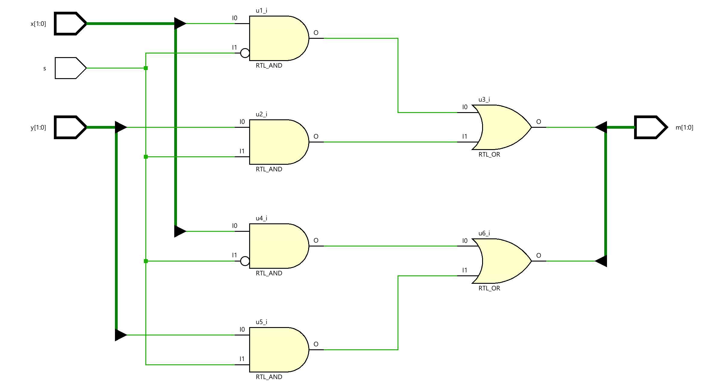</div>

## Dataflow Modeling

Dataflow modeling style is mainly used to describe combinational circuits. The basic mechanism used is
the continuous assignment. In a continuous assignment, a value is assigned to a data type called net.
The syntax of a continuous assignment is 

```verilog
assign [delay] LHS_net = RHS_expression;
```
Where LHS_net is a destination net of one or more bits, and RHS_expression is an expression consisting
of various operators. The statement is evaluated at any time any of the source operand value changes
and the result is assigned to the destination net after the delay unit. The gate-level modeling examples
listed in Part 1 can be described in dataflow modeling using the continuous assignment. For example, 

```verilog
assign out1 = in1 & in2; // perform and function on in1 and in2 and assign the result to out1
assign out2 = not in1;
assign #2 z[0] = ~(ABAR & BBAR & EN); // perform the desired function and assign the result
after two units 
```

The target in the continuous assignment expression can be one of the following:
1. A scalar net (e.g. 1st and 2nd examples above)
2. Vector net
3. Constant bit-select of a vector (e.g. 3rd example above)
4. Constant part-select of a vector
5. Concatenation of any of the above 

Let us take another set of examples in which scalar and vector nets are declared and used

```verilog
wire COUNT, CIN; // scalar net declaration
wire [3:0] SUM, A, B; // vector nets declaration
assign {COUT,SUM} = A + B + CIN; // A and B vectors are added with CIN, and the result is
 // assigned to a concatenated vector of a scalar and vector nets 

```
### Part 1-2-1

Create and add the Verilog module with 8 inputs (x_in) and 8 outputs (y_out) using dataflow
modeling. 

**lab1_2_1.v**
```verilog
module lab1_2_1(
    input wire [7:0] x_in,
    output wire [7:0] y_out
    );
    
    
    assign y_out = x_in;
endmodule
```
### Paet 1-2-2

Model a two-bit wide 2-to-1 multiplexer using dataflow modeling with net
delays of 3 ns.

**lab1_2_2.v**
```verilog

module lab1_2_2(
    input s,
    input [1:0] x,
    input [1:0] y,
    output  [1:0] m
    );
    
   assign #3 m[0] = (x[0] & ~s) | (y[0] &s);
   assign #3 m[1] = (x[1] & ~s) | (y[1] &s);
   
   
endmodule

```


## Behavioral Modeling

Behavioral modeling is used to describe complex circuits. It is primarily used to model sequential circuits, but can also be used to model pure combinatorial circuits. The mechanisms (statements) for modeling the
the behavior of a design are:

```initial``` Statements

```always``` Statements

A module may contain an arbitrary number of **initial** or **always** statements and may contain one or
more procedural statements within them. They are executed concurrently (i.e. to model parallelism such
that the order in which statements appear in the model does not matter) with respect to each other
whereas the procedural statements are executed sequentially (i.e. the order in which they appear does
matter). Both **initial** and **always** statements are executed at time=0 and then only **always**
statements are executed during the rest of the time. The syntax is as follows: 

```verilog
initial [timing_control] procedural_statements;
always [timing_control] procedural_statements; 
```

where a procedural_statement is one of:

* procedural assignment

* conditional_statement

* case_statement

* loop_statement

* wait_statement 

The **initial** statement is non-synthesizable and is normally used in testbenches. The **always**
statement is synthesizable, and the resulting circuit can be a combinatorial or sequential circuit. In order for the model to generate a combinatorial circuit, the **always** block (i) should not be edge sensitive, (ii)
every branch of the conditional statement should define all output, and (iii) every case of the case statement
should define all output and must have a default case. More detailed coverage of this topic is covered in
Lab 7. The destination (LHS) should be of **reg** type; either scalar or vector. For example,

```verilog
reg m; // scalar reg type
reg [7:0] switches; // vector reg type 
```


Here is an example of a 2-to-1 multiplexer model. Note that begin and end statements in this example are
redundant. They are included for better readability

```verilog
always @ (x or y or s)
begin
 if(s==0)
 m=y;
 else
 m=x;
end
```
### Part 1-3-1

Create and add the Verilog module with three inputs (x, y, s) and one output (m) using behavioral
modeling.

To declare a register, put reg after the declaration of input/output and before the port name. 

**lab1_3_1.v**
```verilog
// Define the module with inputs x, y, s and output m.
module lab1_3_1(
    input x,  // First input of the multiplexer
    input y,  // Second input of the multiplexer
    input s,  // Select signal for the multiplexer
    output reg m  // Output of the multiplexer declared as reg since it's driven by always block
);

    // Behavioral modeling using always block
    always @ (s, x, y) begin
        if (s == 1'b0)
            m = x;  // Assign m to x if select line s is 0
        else
            m = y;  // Assign m to y if select line s is 1
    end

endmodule

```

### Part 1-3-2

Create a two-bit wide 2-to-1 multiplexer using behavioral modeling. 

**lab1_3_2.v**
```verilog

// Define the module lab1_3_2 with inputs s, x, y, and output m.
module lab1_3_2(
    input s,          // Single-bit select input.
    input [1:0] x,    // 2-bit input x.
    input [1:0] y,    // 2-bit input y.
    output reg [1:0] m // 2-bit output m, declared as reg for procedural assignment.
);

    // Behavioral modeling using an always block.
    // This block will evaluate whenever there is a change in s, x, or y.
    always @(*) begin
        if (s == 1)  // If select signal s is high...
            m = x;   // Assign the value of x to the output m.
        else         // If select signal s is low...
            m = y;   // Assign the value of y to the output m.
    end

    // The output m is determined by the value of the select input s.
    // This is a basic example of behavioral modeling in Verilog to describe
    // the logic of a 2-bit wide 2-to-1 multiplexer.
    
endmodule


```

Now we can see the ```Schematic``` under the RTL ANALYSIS part like below:

<div align=center>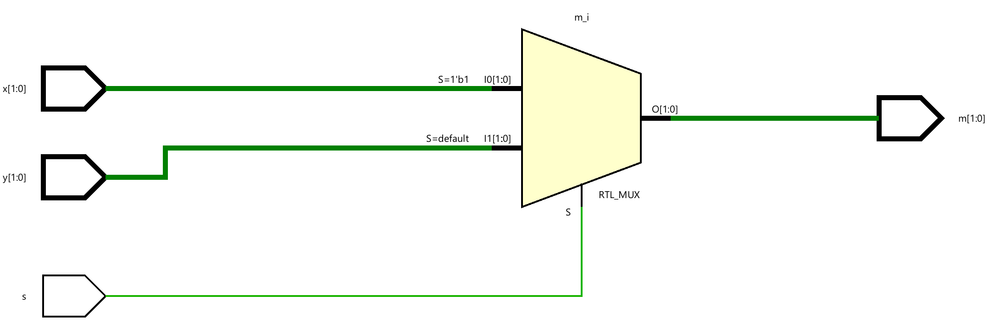</div>

## Mixed-design Style Modeling

Complex systems can be described in Verilog HDL using mixed-design style modeling. This modeling
style supports hierarchical description. The design can be described using:

* Build-in gate primitives (gate-level modeling covered in Part 1)

* Dataflow modeling (covered in Part 2)

* Behavioral modeling (covered in Part 3)

* Module instantiation

Combinations of the above.

Interconnections between various objects are done through nets (of type wire). Nets may be scalar or
vector. For example.

```verilog
wire y; // scalar net
wire [3:0] sum; // vector net 
```

In absence of size, the net is assumed to be the scalar type. 

As an example of mixed-style modeling, the following diagram shows how one can build a 3-to-1 multiplexer
using multiple instances of a 2-to-1 multiplexer. It also shows the symbol and the truth table. 

<div align=center>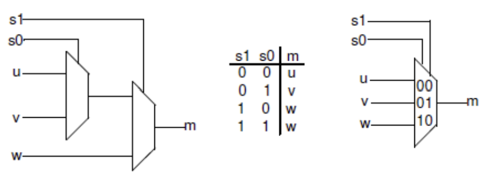</div>

In the above diagram, u, v, and w are data inputs whereas S0, and S1 are select signals, and the output is m. It
uses two instances of a 2-to-1 multiplexer. 

### Part 1-4-1

Create a top-level Verilog module with three data inputs (u, y, w), two select inputs (s0, s1), and
one-bit output (m) using the previously defined 2-to-1 multiplexer. You can use any style
designed 2-to-1 multiplexer (1-1, 2-1, or 3-1). Wire them up as shown in the above diagram. 

**lab1_4_1**
```verilog

// Define the module for a 4-to-1 multiplexer.
module lab1_4_1(
    input u,       // First input of the 4-to-1 multiplexer.
    input v,       // Second input of the 4-to-1 multiplexer.
    input w,       // Third input of the 4-to-1 multiplexer.
    input s0,      // First select the line for the multiplexer.
    input s1,      // Second select line for the multiplexer.
    output m       // Output of the 4-to-1 multiplexer.
);
    wire temp;     // Intermediate wire to hold the output from the first 2-to-1 multiplexer.

    // First 2-to-1 multiplexer instance (sel0).
    //Select between 'u' and 'v' based on 's0'.
    lab1_3_1 sel0(
        .s(s0),    // Select signal for this 2-to-1 multiplexer.
        .x(u),     // First input connected to 'u'.
        .y(v),     // Second input connected to 'v'.
        .m(temp)   // Output connected to intermediate wire 'temp'.
    );
      
    // Second 2-to-1 multiplexer instance (sel1).
    //Select between 'temp' and 'w' based on 's1'.
    lab1_3_1 sel1(
        .s(s1),    // Select signal for this 2-to-1 multiplexer.
        .x(temp),  // First input connected to 'temp' (output of sel0).
        .y(w),     // Second input connected to 'w'.
        .m(m)      // Final output of the 4-to-1 multiplexer.
    );
    
endmodule


```

Now we can see the ```Schematic``` under the RTL ANALYSIS part like below:

<div align=center>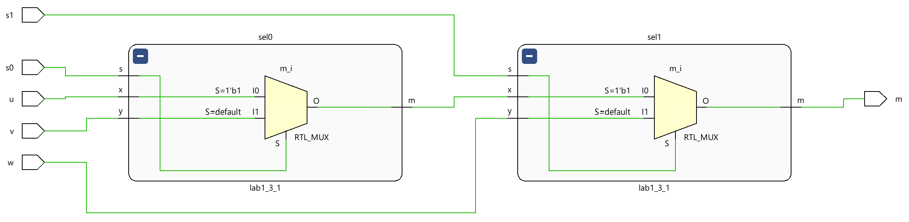</div>

### Part 1-4-2

Model a BCD to 7-Segment Decoder. A 7-segment display consists of seven segments, numbered a to g which can be used to display a character. Depending on the input type, a type conversion may be needed. If want to display a binary coded decimal (BCD) using 4-bit input, a BCD to 7-segment decoder is required. The table below shows the bit pattern you need to put to display a digit (note that to turn ON a segment you need to put logic 0 on the segment and the anode of the display needs to be driven logic 0 on this board)

<div align=center>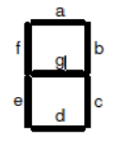</div>

<div align=center>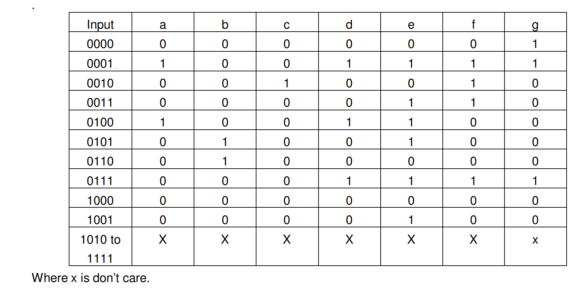</div>

**lab1_4_2**
```verilog
module lab1_4_2(
    input [3:0] x,       // 4-bit binary input to be displayed on the seven-segment display
    output [6:0] seg,    // Seven-segment display outputs (a-g)
    output reg [3:0] an  // Four anode signals to control which display is active
);

    //Seven-segment decoder expressions
    // Each line corresponds to one segment of the seven-segment display.
    // These logical expressions determine whether a specific segment should be on or off
    // based on the current value of the 4-bit input 'x'.
    assign seg[0] = (~x[3] & ~x[2] & ~x[1] & x[0]) | (~x[3] & ~x[2] & x[1] & ~x[0]);
    assign seg[1] = (~x[3] & ~x[2] & ~x[1] & ~x[0]) | (~x[3] & ~x[2] & x[1] & x[0]);
    assign seg[2] = (x[3] & ~x[2] & ~x[1] & ~x[0]) | (~x[3] & ~x[2] & x[1] & ~x[0]);
    assign seg[3] = (~x[3] & x[2] & ~x[1] & ~x[0]) | (~x[3] & ~x[2] & x[1] & ~x[0]);
    assign seg[4] = (~x[3] & ~x[2] & ~x[1] & ~x[0]) | (~x[3] & x[2] & ~x[1] & ~x[0]);
    assign seg[5] = (~x[3] & ~x[2] & ~x[1] & ~x[0]) | (~x[3] & x[2] & ~x[1] & x[0]);
    assign seg[6] = (~x[3] & ~x[2] & ~x[1] & ~x[0]) | (x[3] & ~x[2] & ~x[1] & ~x[0]);

    // Enable only the rightmost display
    // In this module, 'an' is always set to activate only one specific display.
    // The active low signal '4'b0001' means that only the rightmost seven-segment display is turned on.
    always @* begin
        an = 4'b0001; // Enable only the rightmost display
    end

endmodule
```


<div align=center>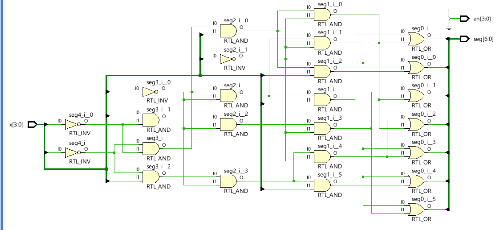</div>
