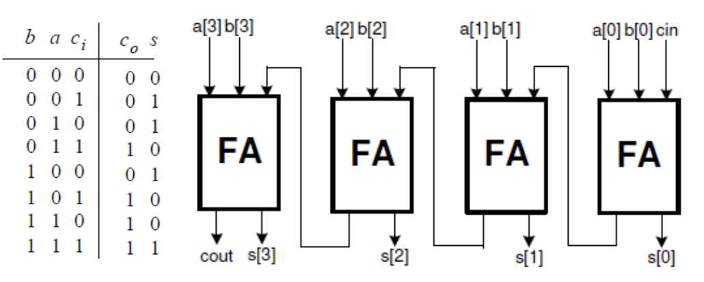
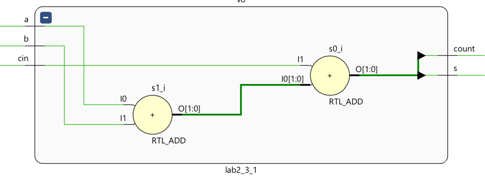
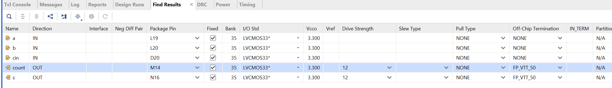
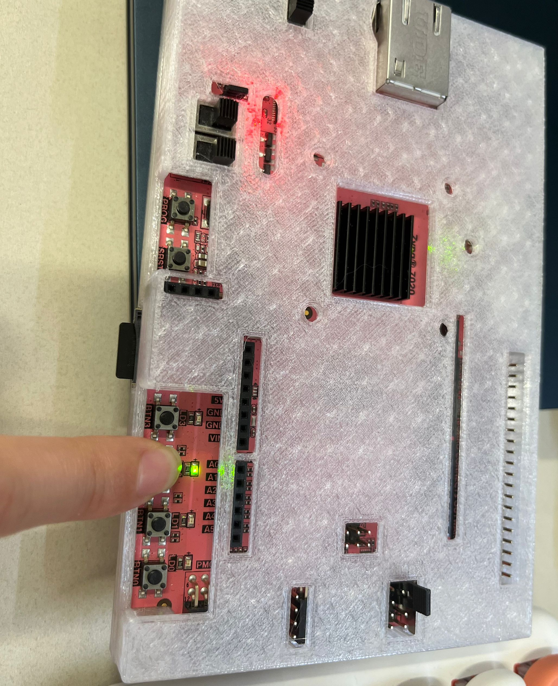
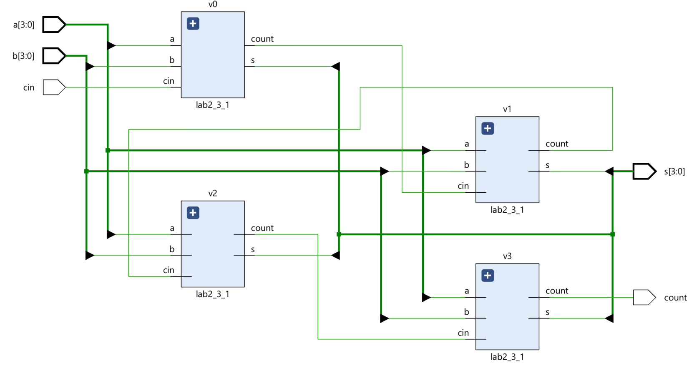
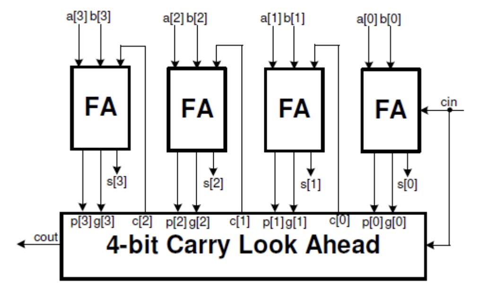
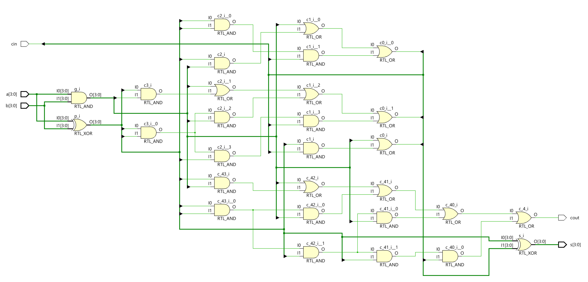
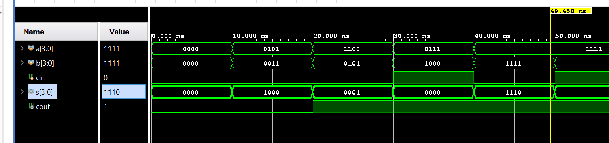

# Lab2_Addition

## Instroduction

Verilog HDL modeling language allows numbers to be represented in several radix systems. The
underlying circuit processes the number in binary. However, input into and output from such circuits is
typically done using decimal numbers. In this lab, you will learn various representations and methods for
converting numbers from one representation into another.
## Performing Addition
When two one-bit numbers are added, they may produce two-bit output. For example, 1 + 1 = 10 (all in
binary). When you add three one-bit numbers, the result will still be two bits, e.g. 1 + 1 + 1 = 11. This
simple operation can be viewed as adding two bits with carry-in from the lower significant operation,
resulting in sum, and the left bit is carried out, and the right bit is sum. The figure below shows a 4-
bit adder. Since the carry is rippled from the least significant bit position (cin) to the most significant position
(cout), such an adder is called a ripple carry adder.

<div align=center></div>

### Part 2-3-1

Create and add the Verilog module named fulladder_dataflow with three inputs (a, b, cin) and two
outputs (s and cout) using dataflow modeling. All inputs and outputs should be one bit wide.

**lab2_3_1.v**
```verilog

// Define the module with three one-bit inputs and two one-bit outputs.
module lab2_3_1(
    input a,      // First input bit of the full adder
    input b,      // Second input bit of the full adder
    input cin,    // Carry-in input bit of the full adder
    output s,     // Sum output bit of the full adder
    output count  // Carry-out output bit of the full adder
);

    // Implement the sum and carry using dataflow modeling expressions.
    // In this case, we use arithmetic addition to determine the sum and carry.
    // The arithmetic addition of 'a', 'b', and 'cin' results in a 2-bit number.
    // The least significant bit of this result is used as the sum ('s'),
    // and the most significant bit is used as the carry-out ('count').
    // This is a compact way to express the functionality of a full adder without explicitly 
    // detailing the logic operations usually seen in a full adder.
    assign {count, s} = a + b + cin; // Concatenation of carry and sum, {carry, sum} = a + b + cin

endmodule
```
Now we can see the ```Schematic``` under the RTL ANALYSIS part like below:

<div align=center></div>

Then we can run Simulation to check the code of the lab2_3_1 module.

**tb.v**
```verilog
// Define the testbench module with no ports, as it's a top-level entity
module fulladder_dataflow_tb();
    
    // Declare input signals as reg type so they can be driven by procedural assignments
    reg a, b, cin;
    // Declare output signals as wire since they will be driven by the instance of DUT (Device Under Test)
    wire cout, s;
    
    // Instantiate the Device Under Test (DUT) with the named port mapping
    lab2_3_1 DUT (.a(a), .b(b), .cin(cin), .cout(cout), .s(s));
    
    // Initial block starts at time 0 and executes sequentially
    initial
    begin
      // Initialize inputs to 0
      a = 0; b = 0; cin = 0;
      
      // Change inputs over time to test different scenarios
      #10 a = 1;                    // Test with a=1, b=0, cin=0
      #10 b = 1; a = 0;             // Test with a=0, b=1, cin=0
      #10 a = 1;                    // Test with a=1, b=1, cin=0
      #10 cin = 1; a = 0; b = 0;    // Test with a=0, b=0, cin=1
      #10 a = 1;                    // Test with a=1, b=0, cin=1
      #10 b = 1; a = 0;             // Test with a=0, b=1, cin=1
      #10 a = 1;                    // Test with a=1, b=1, cin=1
      #10;                          // Wait ten time units before ending the simulation
    end

endmodule
```
We can run a Simulation to check the code by clicking the Run Simulation under the SIMULATION and choosing the first Run Behavioral Simulation.

<div align=center></div>

Then, we can click on the Run synthesis under the SYNTHESIS and Run implementation under the IMPLEMENTATION. We should add the appropriate board-related master XDC file to the project and edit it to include the related pins like the below:

<div align=center></div>

Generate the bitstream and program device like [Lab1](https://uri-nextlab.github.io/ParallelProgammingLabs/Verilog_Labs/Lab1_Modeling_Concepts.html).

Then you can press the button on the board, and you can see the LED is on like below:

<div align=center></div>

### Part lab2-3-2

 Create and add the Verilog module (called rca_dataflow) to the project with three inputs (a, b, cin)
and two outputs (cout and s), instantiating full adder (FA) four times and connecting them as
necessary. The a, b, and s should be a 4-bit vector and cin and cout should each be one-bit wide.

**lab2_3_1_rca_dataflow.v**
```verilog
// Define the module with two 4-bit inputs, a single-bit input, and a 4-bit plus single-bit output.
module lab2_3_1_rca_dataflow(
    input [3:0] a,       // First 4-bit operand
    input [3:0] b,       // Second 4-bit operand
    input cin,           // Carry-in bit for the least significant bit addition
    output [3:0] s,      // 4-bit sum output
    output count         // Carry-out bit from the most significant bit addition
);
   
    wire [3:0] c_temp;   // Internal wires to propagate carry between full adder stages

    // Instantiate the first full adder for the least significant bit
    lab2_3_1 v0(
        .a(a[0]),
        .b(b[0]),
        .cin(cin),     // This is the external carry-in for the entire 4-bit addition
        .s(s[0]),      // Sum bit for the least significant position
        .count(c_temp[0]) // Carry-out used as carry-in for the next significant bit
    );
    
    // Instantiate the second full adder
    lab2_3_1 v1(
        .a(a[1]),
        .b(b[1]),
        .cin(c_temp[0]), // Carry-in from the previous less significant adder
        .s(s[1]),        // Sum bit for the second least significant position
        .count(c_temp[1]) // Carry-out used as carry-in for the next significant bit
    );

    // Instantiate the third full adder
    lab2_3_1 v2(
        .a(a[2]),
        .b(b[2]),
        .cin(c_temp[1]), // Carry-in from the previous less significant adder
        .s(s[2]),        // Sum bit for the second most significant position
        .count(c_temp[2]) // Carry-out used as carry-in for the next significant bit
    );
    
    // Instantiate the fourth and final full adder
    lab2_3_1 v3(
        .a(a[3]),
        .b(b[3]),
        .cin(c_temp[2]), // Carry-in from the previous less significant adder
        .s(s[3]),        // Sum bit for the most significant position
        .count(count)    // Final carry-out, which is the carry-out of the entire 4-bit addition
    );

endmodule


```

Now we can see the ```Schematic``` under the RTL ANALYSIS part like below:

<div align=center></div>


## Improving Addition Speed

The ripple-carry adders take a longer time to compute when two large numbers (e.g. 8, 16, 32 bits) are
added. Another structure, called carry-lookahead adders (see figure
below), can be used to reduce the computation time. It works by creating two signals (P and G) for each bit position, based on whether a
carry is propagated through a less significant bit position (at least one input is a '1'), generated in that bit
position (both inputs are '1'), or killed in that bit position (both inputs are '0'). After P and G are generated
the carries for every bit position are created.

<div align=center></div>

Where Pi = Ai + Bi and Gi = AiBi. Within the Carry Look Ahead unit, Ci+1 = Gi + PiCi. The speed-up is
achieved through the fact that Ci is being generated simultaneously, irrespective of its position.

### Part 2-4-1

Create a carry-lookahead adder circuit by modifying the project of 3-1 and
using dataflow modeling. 

Modify the project of 3-1 to add two four-bit numbers using the
carry look-ahead structure and output the result on the LEDs. Provide carry-in through SW15.
Hint: You will need to modify FA to output Pi and Gi and then create and add another module
CLA will perform the carry look ahead function.


**lab2_4_1.v**
```verilog
module lab2_4_CLA_dataflow(
    input [3:0] a,      // 4-bit input operand
    input [3:0] b,      // 4-bit input operand
    input cin,          // Carry input
    output [3:0] s,     // 4-bit sum output
    output cout         // Carry output
);

    // Generate and Propagate for each bit
    wire [3:0] p; // Propagate
    wire [3:0] g; // Generate
    assign p = a ^ b; // Propagate is high if a XOR b
    assign g = a & b; // Generate is high if both a and b are high

    // Carry terms
    wire [4:0] c; // Intermediate carries, c[0] is cin
    assign c[0] = cin;
    assign c[1] = g[0] | (p[0] & c[0]);
    assign c[2] = g[1] | (p[1] & g[0]) | (p[1] & p[0] & c[0]);
    assign c[3] = g[2] | (p[2] & g[1]) | (p[2] & p[1] & g[0]) | (p[2] & p[1] & p[0] & c[0]);
    assign c[4] = g[3] | (p[3] & g[2]) | (p[3] & p[2] & g[1]) | (p[3] & p[2] & p[1] & g[0]) | (p[3] & p[2] & p[1] & p[0] & c[0]);

    // Sum and carry out
    assign s = p ^ c[3:0]; // Sum is Propagate XOR Carry_in
    assign cout = c[4]; // Carry out

endmodule

```

Now we can see the ```Schematic``` under the RTL ANALYSIS part like below:

<div align=center></div>

Then we can run Simulation to check the code of the lab2_3_1 module.
**tb.v**
```verilog
// Define the testbench module with no ports, as it's a top-level entity
module fulladder_dataflow_tb();
    
    // Declare input signals as reg type so procedural assignments can drive them
    reg [3:0] a, b;
    reg cin;
    // Declare output signals as wire since they will be driven by the instance of DUT (Device Under Test)
    wire [3:0] s;
	wire cout;
    
    // Instantiate the Device Under Test (DUT) with the named port mapping
   lab2_4_1 DUT (.a(a), .b(b), .cin(cin), .cout(cout), .s(s));
    
 // Initial block to define the sequence of test cases
    initial begin
        // Initialize inputs
        a = 4'b0000; b = 4'b0000; cin = 0;
        #10;  // Wait for simulation to stabilize

        // Apply different test cases
        a = 4'b0101; b = 4'b0011; cin = 0; // Test addition without carry
        #10;
        a = 4'b1100; b = 4'b0101; cin = 0; // Test addition with carry result but no input carry
        #10;
        a = 4'b0111; b = 4'b1000; cin = 1; // Test addition with input carry
        #10;
        a = 4'b1111; b = 4'b1111; cin = 0; // Test edge case for maximum values
        #10;
        a = 4'b1111; b = 4'b0001; cin = 1; // Test addition leading to overflow
        #10;
        
        // Additional test cases as needed...
        
        // Complete the simulation
        #10;
        $finish; // Terminate simulation
    end

endmodule
```
We can run a Simulation to check the code by clicking the Run Simulation under the SIMULATION and choosing the first Run Behavioral Simulation.

<div align=center></div>

## Conclusion 

You learned how to define numbers in various radix systems in this lab. You also designed various
number conversion circuits using dataflow modeling. You also learned a technique for improving addition
speed. 
