# Lab3_Multi-Output Circuits: Encoders, Decoders, and Memories 

## Introduction

Boolean expressions are used to output a Boolean function of number of variables. Dataflow construct
like assign can be used to model such functions. There are circuits which have multiple outputs and
multiple inputs. In this lab you will design encoders, decoders, and read only memories.

## Multi-output Decoder Circuits

Decoders are combinatorial circuits which have multiple outputs. They are widely used in memory chips
to select one of the words addressed by the address input. For example, an 8-words memory will have
three bit address input. The decoder will decode the 3-bit address and generate a select line for one of
the eight words corresponding to the input address. The 3-to-8 decoder symbol and the truth table are
shown below. 

<div align=center>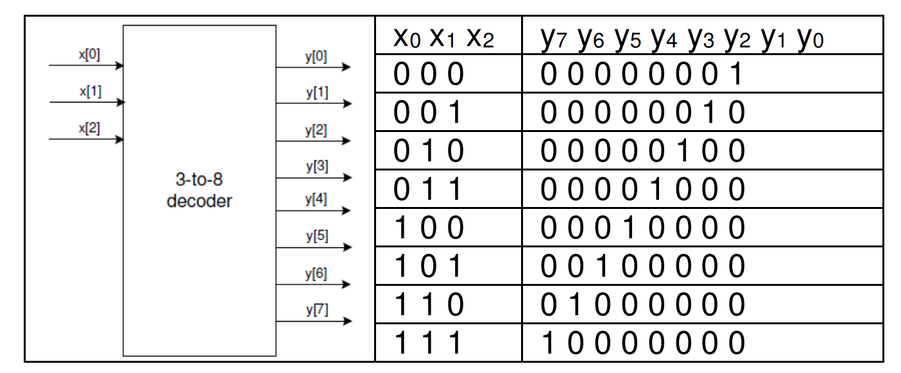</div>

Such circuits, also known as binary decoders, and can be modeled using dataflow statements as only
each output is true for a unique input combination. 

### Part3-1-1

Design a 3-to-8 line decoder. Let the input be through btn2-btn0 and
output be on LED7-LED0. Use dataflow modeling constructs. 

Create and add the Verilog module, naming it decoder_3to8_dataflow.v, that defines the 3-to-8
line decoder with three-bit input x and 8-bit output y. Use dataflow modeling constructs. 

**lab3_1_1.v**
```verilog

// Define the module with a 3-bit input x and an 8-bit output y.
module lab3_1_1(
    input [2:0] x,   // 3-bit input used to select one of the eight outputs
    output [7:0] y   // 8-bit output where only one bit is set to 1 based on input x
);

    // Implement the 3-to-8 line decoder functionality using dataflow modeling.
    // Each line of y is set to 1 only when x matches the corresponding binary value.
    // Otherwise, the line is set to 0.
    assign y[0] = (x == 3'b000) ? 1'b1 : 1'b0; // y[0] is high if x is 000
    assign y[1] = (x == 3'b001) ? 1'b1 : 1'b0; // y[1] is high if x is 001
    assign y[2] = (x == 3'b010) ? 1'b1 : 1'b0; // y[2] is high if x is 010
    assign y[3] = (x == 3'b011) ? 1'b1 : 1'b0; // y[3] is high if x is 011
    assign y[4] = (x == 3'b100) ? 1'b1 : 1'b0; // y[4] is high if x is 100
    assign y[5] = (x == 3'b101) ? 1'b1 : 1'b0; // y[5] is high if x is 101
    assign y[6] = (x == 3'b110) ? 1'b1 : 1'b0; // y[6] is high if x is 110
    assign y[7] = (x == 3'b111) ? 1'b1 : 1'b0; // y[7] is high if x is 111

endmodule

```

Now we can see the ```Schematic``` under the RTL ANALYSIS part like below:

<div align=center></div>


Then we can run Simulation to check the code of the lab3_1_1 module.

**decoder_3to8_dataflow_tb.v**
```verilog
// Define the testbench module with no ports as it's a top-level entity
module decoder_3to8_dataflow_tb();
    
    // Declare input signals as reg type to drive them with procedural assignments
    reg [2:0] x;
    // Declare output signals as wire since they will be driven by the instance of DUT (Device Under Test)
    wire [7:0] y;
    // Declare an integer for use in the for-loop
    integer k;
    
    // Instantiate the Device Under Test (DUT) with named port mapping
    lab3_1_1 DUT (.x(x), .y(y));   
 
    // Initial block to define the sequence of test cases
    initial begin
      // Initialize input
      x = 0; // Start with input 0
      
      // Loop through all possible inputs from 0 to 7
      for (k = 0; k < 8; k = k + 1) begin
		#5 x = k; // Assign the value of k to x and wait for 5 time units
      end
      #10; // Wait for 10 time units before ending the simulation
      
      // Optional: Add $finish to explicitly end the simulation.
      // Some simulation environments automatically end when there are no more events,
      // but others require $finish to terminate the simulation.
      $finish;
    end

    // Optional: Monitor changes in variables
    // Display changes in input and output to observe the test results
    initial begin
        $monitor("Time = %t, Input x = %b, Output y = %b", $time, x, y);
    end

endmodule

```

We can run Simulation to check the code by clicking the Run Simulation under the SIMULATION and choose the first Run Behavioral Simulation.

<div align=center>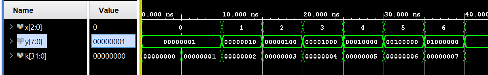</div>


Then we can click on the Run synthesis under the SYNTHESIS and Run implementation under the IMPLEMENTATION. And we should add the appropriate board related master XDC file to the project and edit it to include the related pins like below:

<div align=center>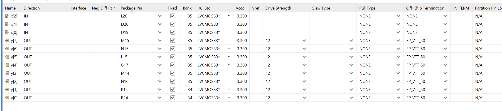</div>

Because the board has four LEDs, so we can also use the RGB LED(LD5 and LD4).

<div align=center>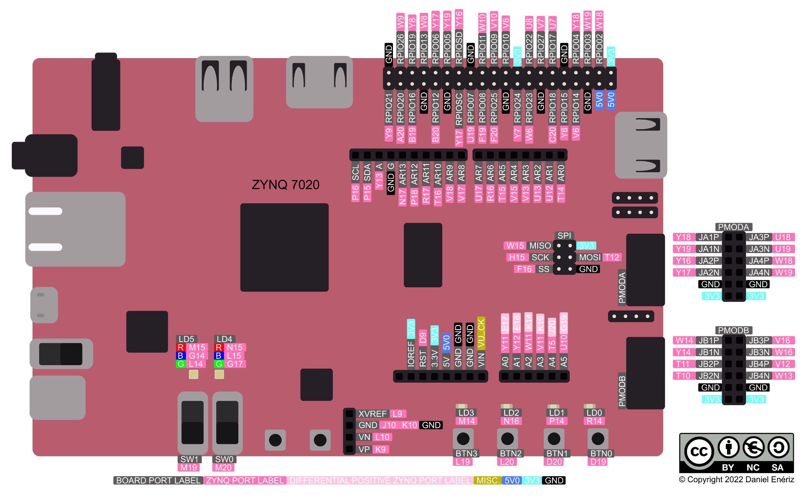</div>

The click on the Generate Bitstream under the PROGRAM AND DEBUG, and when writing bitstream is complete, we can donwload the file to the board and verify the lab.


### Part3-1-2

Design and implement a popular IC, 74138, functionality using dataflow
modeling and the decoder you used in 1-1. The IC symbol and truth table
are given below.

<div align=center></div>

X = don’t care 

Note that this is very similar to the one you had created in 1-1, It has additional control (Enable)
signals G1, /G2A, and /G2B. These enable signals simplify decoding in some systems. 

Create and add the Verilog module, named decoder_74138_dataflow, instantiating the model you
had developed in 1-1. Add additional logic, by using the dataflow modeling constructs, to model
the desired functionality.

**lab3_1_2.v**
```verilog
module Lab3_1_2(
    input [2:0] x,        // 3-bit input
    input G1,             // Active-high enable
    input G2A_n, G2B_n,   // Active-low enables
    output [7:0] y        // 8-bit output
);

    // Internal signal for combined enable condition
    wire enable;
    wire [7:0] y_data;  
    // The decoder is enabled only if G1 is high and both G2A_n and G2B_n are low
    assign enable = G1 & ~G2A_n & ~G2B_n;

    // Instantiate the basic 3-to-8 decoder, passing the enable condition
    // The outputs are only asserted if the enable condition is true
    lab3_1_1 basic_decoder (
        .x(x),
        .y(y_data)
    );

    // Modify the output based on the enable condition using dataflow constructs
    // If 'enable' is not asserted, all outputs should be low.
    assign y[0] = enable & y_data[0];
    assign y[1] = enable & y_data[1];
    assign y[2] = enable & y_data[2];
    assign y[3] = enable & y_data[3];
    assign y[4] = enable & y_data[4];
    assign y[5] = enable & y_data[5];
    assign y[6] = enable & y_data[6];
    assign y[7] = enable & y_data[7];

endmodule

```

Then we can run Simulation to check the code of the lab3_1_2 module.

**decoder_74138_dataflow_tb.v**
```verilog
// Define the testbench module with no ports as it's a top-level entity
module decoder_74138_dataflow_tb();
    
    // Declare input signals as reg type to drive them with procedural assignments
    reg [2:0] x;        // 3-bit address input
    reg g1, g2a_n, g2b_n; // Enable inputs for the decoder, g1 is active high, g2a_n and g2b_n are active low
    
    // Declare output signals as wire since they will be driven by the instance of DUT (Device Under Test)
    wire [7:0] y;      // 8-bit output representing the decoded line
    
    // Declare an integer for use in the for-loop
    integer k;
    
    // Instantiate the Device Under Test (DUT) with named port mapping
    Lab3_1_2 DUT (.G1(g1), .G2A_n(g2a_n), .G2B_n(g2b_n), .x(x), .y(y));   
 
    // Initial block to define the sequence of test cases
    initial begin
      // Test all possible input combinations under different enable configurations
      // Set initial conditions: Decoder disabled due to g2a_n and g2b_n being high
      x = 0; g1 = 0; g2a_n = 1; g2b_n = 1;
      // Iterate through all input combinations
      for (k = 0; k < 8; k = k + 1)
		#5 x = k;  // Change address input every 5 time units
      #10; // Wait for 10 time units before changing enable conditions
      
      // Enable the decoder with G1 high and G2A_n low
      x = 0; g1 = 1; g2a_n = 0; g2b_n = 1;
      for (k = 0; k < 8; k = k + 1)
		#5 x = k;  
      #10; // Wait and switch to another enable condition
      
      // Enable the decoder with G1 low and G2B_n low
      x = 0; g1 = 0; g2a_n = 1; g2b_n = 0;
      for (k = 0; k < 8; k = k + 1)
		#5 x = k;  
      #10;
      
      // Fully enable the decoder with both G1 high and G2B_n low (G2A_n also low for typical 74138 behavior)
      x = 0; g1 = 1; g2a_n = 0; g2b_n = 0;
      for (k = 0; k < 8; k = k + 1)
		#5 x = k;  // Test all combinations when fully enabled
      #10; // Wait before ending simulation
      
      // End the simulation
      $finish;
    end

    // Optional: Monitor changes in variables
    // This helps in debugging and observing the behavior of the decoder under different enable signals
    initial begin
        $monitor("Time = %t, Enable: G1=%b, G2A_n=%b, G2B_n=%b, Input x = %b, Output y = %b", $time, g1, g2a_n, g2b_n, x, y);
    end

endmodule

```

We can run Simulation to check the code by clicking the Run Simulation under the SIMULATION and choose the first Run Behavioral Simulation.

<div align=center></div>


## Multi-output Encoder Circuits

Encoder circuit converts information from one format (code) to another for the purposes of
standardization, speed, secrecy, security, or saving space by shrinking size. In digital circuits, encoding information may reduce size and/or prioritize functions. Widely used encoder circuits examples include priority encoders, Huffman encoders, etc.


### Part3-2-1

Design an 8-to-3 priority encoder, whose truth table is given below. Use
behavioral modeling. 

<div align=center></div>

Create and add the Verilog module with *v* and *en_in_n* input; *y*, *en_out*, and *gs* output. The *v*
input will be 8-bit data inputs (labeled 0 to 7 in the table), *en_in_n* input will be one bit (E1), *y*
output will be 3-bit (A2, A1, A0), *en_out* will be one bit output (GS), and **en_out** will be one bit
output (E0).


**lab3_2_1.v**
```verilog
module lab3_2_1(
    input [7:0] v,      // 8-bit data inputs representing the binary code
    input en_in_n,      // Active low enable input indicating whether the encoder should operate
    output reg [2:0] y, // 3-bit output representing the encoded value
    output reg en_out,  // Active low enable output indicating valid output (E0)
    output reg gs       // Group Select, active low when any input is active
);

    // Combine enable signal and inputs into a single 9-bit vector for easier case handling
    wire [8:0] inputs;
    assign inputs = {en_in_n, v}; // Combine enable input with data inputs for case evaluation
    
    // Behavioral block to determine the output based on the inputs
always@(*)
    begin
     case (inputs)
          // Check for encoder being disabled or no input active
            9'b1xxxxxxxx: // If enable is high (active low logic), encoder is disabled
                        begin
                            y = 3'b111;
                            en_out = 1;
                            gs = 1;
                        end
            9'b011111111:
                        begin
                            y = 3'b111;
                            en_out = 0;
                            gs = 1;
                        end
            9'b0xxxxxxx0:
                        begin
                            y = 3'b000;
                            en_out = 1;
                            gs = 0;
                        end
            9'b0xxxxxx01:
                        begin
                            y = 3'b001;
                            en_out = 1;
                            gs = 0;
                        end    
            9'b0xxxxx011:
                        begin
                            y = 3'b010;
                            en_out = 1;
                            gs = 0;
                        end           
            9'b0xxxx0111:
                        begin
                            y = 3'b011;
                            en_out = 1;
                            gs = 0;
                        end
            9'b0xxx01111:
                        begin
                            y = 3'b111;
                            en_out = 1;
                            gs = 0;
                        end            
            9'b0xx011111:
                        begin
                            y = 3'b100;
                            en_out = 1;
                            gs = 0;
                        end            
            9'b0xx011111:
                        begin
                            y = 3'b101;
                            en_out = 1;
                            gs = 0;
                        end             
            9'b0x0111111:
                        begin
                            y = 3'b110;
                            en_out = 1;
                            gs = 0;
                        end            
            9'b001111111:
                        begin
                            y = 3'b111;
                            en_out = 1;
                            gs = 0;
                        end             
             default:  begin
                            y = 3'b000;
                            en_out = 0;
                            gs = 0;
                        end              
        endcase
    
    end
endmodule

```

## Read-Only Memories
Read-only memories (ROM) consist of interconnected arrays to store an array of binary information. Once
the binary information is stored it can be read any time but cannot be altered. Large ROMs are typically used to store programs and/or data which will not change by the other circuitry in the system. Small ROMs can be used to implement combinatorial circuits. A ROM uses a decoder, similar to one designed in 1-1 earlier, to address a particular location. 

A ROM will have m address input pins and n information output pins to store 2^m words information, each word being n bit in length. The content is accessed by placing an address and the content of the corresponding word is read at the output pins.

In Verilog HDL, memories can be defined as a two dimensional array using **reg** data type, as illustrated below: 
```verilog
reg [3:0] MY_ROM [15:0]; 

```

where **reg** is data type, MY_ROM is a 16x4 memory with 16 locations each location being 4-bit wide. If the memory is to be modeled as read only then two things must happen: (i) memory should only be read and not written into, and (ii) memory should somehow be initialized with the desired content. Verilog HDL provides a system task, called **$readmemb**, to initialize memory with a content. Following is an example of definition and usage of 4x2 ROM.

```verilog

module ROM_4x2 (ROM_data, ROM_addr);
 output [1:0] ROM_data;
 input [1:0] ROM_addr;
 reg [1:0] ROM [3:0]; // defining 4x2 ROM
 assign ROM_data = ROM[ROM_addr]; // reading ROM content at the address
ROM_addr
 initial $readmemb (“ROM_data.txt”, ROM, 0, 3); // load ROM content from
ROM_data.txt file
endmodule 
```

The ROM_data.txt file, for this example, should be present in the same directory where the model is
defined (since no directory path is given), and may have 8 or less lines such as: 
```
 10
 01
 11
 00 
```

Note that if the number of lines is less than the size of the ROM, the unspecified locations will be initialized with 0s. Also, note that there is another system task available, called $readmembh, which allows the data file to be written using hexadecimal symbols. 

For adding text file: Select "Add sources" from the Project Navigator > Add or create Design sources > Add files
In the Add source file window select "File of type" as "All files".


For the example, we can also run simulation to verify.

**tb.v**
```verilog
// Define the testbench module with no ports as it's a top-level entity
module ROM_4x2_tb;

   //  Declare the ROM address and data lines as wires and regs appropriately
    reg [1:0] ROM_addr;          // Address lines for the ROM as input
    wire [1:0] ROM_data;         // Data lines from the ROM as output

    // Instantiate the Device Under Test (DUT) with named port mapping
    Lab3_3_1 DUT(
        .ROM_data(ROM_data), 
        .ROM_addr(ROM_addr)
    );

    // Initial block to define the sequence of test cases
    initial begin
        // Initialize ROM address
        ROM_addr = 2'd0; 
        #10; // Wait for 10 time units
        
        // Apply different addresses and observe the data
        ROM_addr = 2'd1; 
        #10; // Change address every 10 time units to simulate reading different ROM locations
        
        ROM_addr = 2'd2;
        #10;
        
        ROM_addr = 2'd3;
        #10; // Wait after the last address to observe the last set of data
        
        // Add more cases if necessary
        
        // End of simulation
//        $finish;
    end

    // Optional: Monitor changes in variables
    initial begin
        $monitor("Time = %t, Address = %b, Data = %b", $time, ROM_addr, ROM_data);
    end

endmodule

```

The result is shown below:

<div align=center>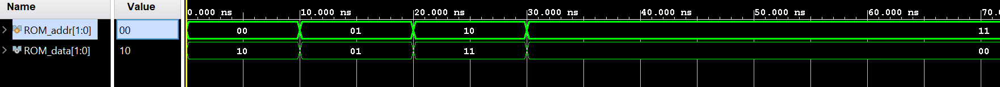</div>


### Part3-3-1

Design a 2-bit comparator that compares two 2-bit numbers and asserts
outputs indicating whether the decimal equivalent of word A is less than,
greater than, or equal to that of word B. You will model ROM and use $readmemb task. 

Create and add the Verilog module with two inputs (a, b) and three outputs (lt, gt, and eq) using ROM and $readmemb system task.

**lab3_3_1.v**
```verilog
module lab3_3_1(
    input [1:0] a, // 2-bit input a
    input [1:0] b, // 2-bit input b
    output reg Lt, // a < b
    output reg Eq, // a == b
    output reg Gt  // a > b
);

    reg [2:0] ROM[15:0]; // Define a ROM with enough space
    wire [3:0] addr; // Combined address from A and B

    assign addr = {a, b}; // Combine A and B to form ROM address

   initial begin
        $readmemb("ROM_data.txt", ROM); // Load ROM content from file
    end

    always @(*) begin
        case (ROM[addr])
            3'b001: begin // a == b
                Lt = 0;
                Eq = 1;
                Gt = 0;
            end
            3'b010: begin // a < b
                Lt = 1;
                Eq = 0;
                Gt = 0;
            end
            3'b100: begin // a > b
                Lt = 0;
                Eq = 0;
                Gt = 1;
            end
            default: begin // Default case for safety
                Lt = 0;
                Eq = 0;
                Gt = 0;
            end
        endcase
    end

endmodule

```


Create and add a text file that describes design output.

<div align=center></div>


a and b are concatenated to form a 4-bit address (addr), which is used to access a specific location in the ROM like below:

**ROM_data.txt**
```
001
100
100
100
010
001
100
100
010
010
001
100
010
010
010
001

```

Create the logic in a document and save as .**txt** file. Then click on **Add Sources** under the Flow
Navigator. Select the **Add or create design sources** and click **next**. Click the **green plus** button
and add file. Add the .txt file and click **finish**.

And we can run Simulation to check the code by clicking the Run Simulation under the SIMULATION and choose the first Run Behavioral Simulation.

**ROM_comparator_tb.v**
```verilog
// Testbench for ROM-based 2-bit comparator
module ROM_comparator_tb;

    // Input signals for the comparator are declared as regs so they can be driven by the testbench.
    reg [1:0] a;          // First 2-bit input for the comparator
    reg [1:0] b;          // Second 2-bit input for the comparator

    // Output signals from the comparator are declared as wires since they are driven by the ROM_comparator module.
    wire Lt; // Output indicating whether a < b
    wire Eq; // Output indicating whether a == b
    wire Gt; // Output indicating whether a > b

    // Instantiate the Device Under Test (DUT) with named port mapping
    lab3_3_2 DUT(
        .a(a), 
        .b(b),
        .Lt(Lt),
        .Eq(Eq),
        .Gt(Gt)
    );

    // Test sequence
    integer i; // Variable for loop iteration
    initial begin
        // Print header for readability in simulation output
        $display("Comparing all possible combinations of 'a' and 'b':");
        $display("A B | Lt Eq Gt");
        $display("-------------");

        // Loop through all possible combinations of 'a' and 'b'
        for (i = 0; i < 16; i = i + 1) begin
            {a, b} = i;  // Assign combination of 'a' and 'b' based on loop iteration
            #10;         // Wait 10 time units to observe the outputs
        end

        // End simulation after all cases are tested
        $finish;
    end

    // Optional: Monitor changes in variables
    // This helps in observing the behavior of the DUT for different input combinations
    initial begin
        $monitor("At time %t, A = %b, B = %b | Lt = %b, Eq = %b, Gt = %b",
                 $time, a, b, Lt, Eq, Gt);
    end

endmodule

```

The simulation result is shown below:

<div align=center>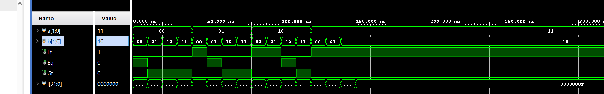</div>

If we want to implement it on the board, we need to change the code and add one another IP like belo：

<div align=center></div>

Double click on and have a setting like below:

<div align=center></div>

<div align=center>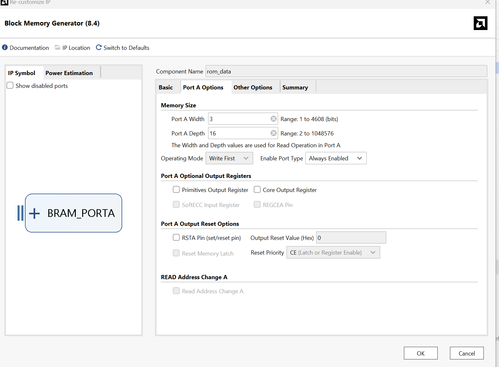</div>

<div align=center></div>

<div align=center></div>

And then we can find the IP instantiation template like below:

<div align=center>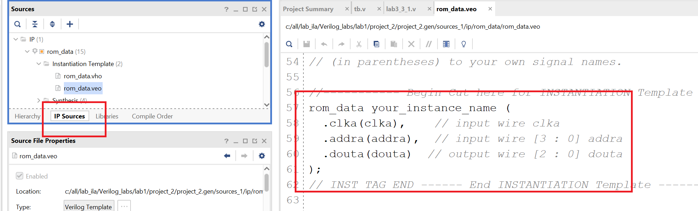</div>


**lab3_3_1_board.v**
```verilog
// This module simulates a comparison between two 2-bit numbers using a ROM
module lab3_3_1(
    input clk,           // Clock input for synchronous operations
    input [1:0] a,       // First 2-bit input for comparison
    input [1:0] b,       // Second 2-bit input for comparison
    output reg Lt,       // Output flag, set if 'a' is less than 'b'
    output reg Eq,       // Output flag, set if 'a' equals 'b'
    output reg Gt        // Output flag, set if 'a' is greater than 'b'
);

    // Combined address for ROM: concatenates inputs 'a' and 'b'
    wire [3:0] addr_reg; // Combines 'a' and 'b' to form the ROM address

    // Output from ROM, stores comparison result based on 'a' and 'b'
    wire [2:0] douta;    // Data output from ROM based on address 'addr_reg'

    // Instance of ROM block
    rom_data rom (
      .clka(clk),        // Provides the system clock to the ROM
      .addra(addr_reg),  // Supplies the address to ROM
      .douta(douta)      // Retrieves the comparison result from ROM
    );

    // Assign block to combine 'a' and 'b' into a single address
    // This part was initially inside an always block, but for a combinational approach, we use 'assign'
    assign addr_reg = {a, b}; // Combines 'a' and 'b' to form the address without waiting for the clock edge

    // Combinational logic to set comparison flags based on ROM's output
    // This block decides which of the flags (Lt, Eq, Gt) should be set based on the value of 'douta' from the ROM
    always @(*) begin // Triggered on any change of 'douta'
        case (douta)
            3'b001: begin // ROM output for 'a == b'
                Lt <= 0;
                Eq <= 1;
                Gt <= 0;
            end
            3'b010: begin // ROM output for 'a < b'
                Lt <= 1;
                Eq <= 0;
                Gt <= 0;
            end
            3'b100: begin // ROM output for 'a > b'
                Lt <= 0;
                Eq <= 0;
                Gt <= 1;
            end
            default: begin // Safety default case to handle unexpected ROM outputs
                Lt <= 0;
                Eq <= 0;
                Gt <= 0;
            end
        endcase
    end
    
endmodule

```

**ROM_data.coe**
```
memory_initialization_radix=2;  
memory_initialization_vector=
001,
100,
100,
100,
010,
001,
100,
100,
010,
010,
001,
100,
010,
010,
010,
001;

```


**tb.v**
```verilog

// Testbench for lab3_3_1: Compares two 2-bit numbers and sets output flags
module lab3_3_1_tb;

    // Define testbench-specific signals
    reg clk;             // Clock signal used for synchronizing the DUT
    reg [1:0] a, b;      // 2-bit inputs to be compared by the DUT
    wire Lt, Eq, Gt;     // Outputs from the DUT representing comparison results

    // Instantiate the Device Under Test (DUT)
    lab3_3_1 DUT(
        .clk(clk),       // Connect the testbench clock to the DUT clock
        .a(a),           // Connect 'a' input of the testbench to the DUT
        .b(b),           // Connect 'b' input of the testbench to the DUT
        .Lt(Lt),         // Connect 'Lt' output of the DUT to the testbench
        .Eq(Eq),         // Connect 'Eq' output of the DUT to the testbench
        .Gt(Gt)          // Connect 'Gt' output of the DUT to the testbench
    );

    // Clock generation process
    initial begin
        clk = 1;                     // Initialize the clock signal
        forever #5 clk = ~clk;       // Toggle the clock every 5 time units to generate a periodic signal
    end

    // Test sequence process
    initial begin
        // Delay to ensure the DUT is properly initialized before starting the tests
        #5; // Initial delay to synchronize with clock

        // Loop through all possible combinations of 'a' and 'b'
        for (i = 0; i < 16; i = i + 1) begin
            {a, b} = i;  // Assign new values to 'a' and 'b'
            #10;         // Wait for one clock cycle between assignments to allow DUT to process
        end
    end

    // Monitoring process: Prints the values of inputs and outputs at every simulation step
    initial begin
        $monitor("Time: %t | a: %b, b: %b | Lt: %b, Eq: %b, Gt: %b",
                 $time, a, b, Lt, Eq, Gt); // Print the time and current signal values
    end

endmodule

```

We can also run simulation and see the result like below:

<div align=center></div>

Then we can click on the Run synthesis under the SYNTHESIS and Run implementation under the IMPLEMENTATION. And we should add the appropriate board related master XDC file to the project and edit it to include the related pins like below:

<div align=center>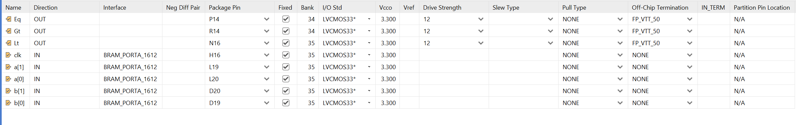</div>

Generate the bitstream and program device like [Lab1](https://uri-nextlab.github.io/ParallelProgammingLabs/Verilog_Labs/Lab1_Modeling_Concepts.html).

Then you can press the button of the board and you can see the LED is on like below:

<div align=center>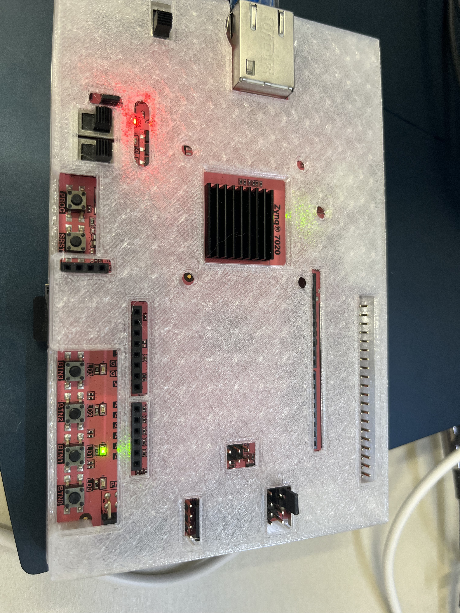</div>

<div align=center>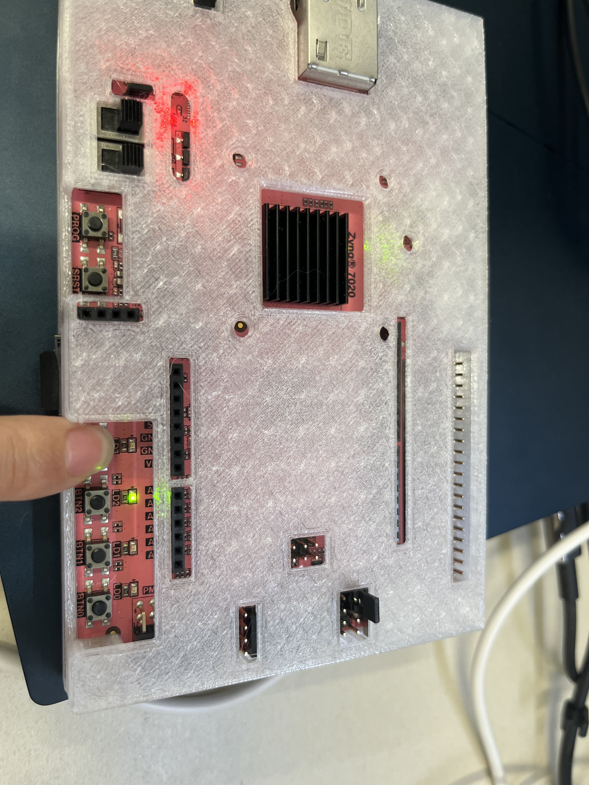</div>

<div align=center></div>

### Part3-3-2

Implement 2-bit by 2-bit multiplier using a ROM. Output the product in
binary on four LEDs.

Create and add the Verilog module with two 2-bit inputs (a, b), a 4-bit product output using ROM
and $readmemb system task.

**lab3_3_2.v**
```verilog
module lab3_3_2(
    input [1:0] a,
    input [1:0] b,
    output [3:0] product
);

    // Calculate address for ROM based on inputs 'a' and 'b'
    wire [3:0] address;
    assign address = {a, b};

    // 4-bit register to hold the product from ROM
//    reg [3:0] product_reg;
//    assign product = product_reg; // Assign the registered value to the output

    // ROM for storing pre-computed products, 16x4 bits
    reg [3:0] ROM[15:0];

    // Initialize ROM with pre-computed products using $readmemb system task
    initial begin
        $readmemb("ROM_data.txt", ROM);
    end
    assign product = ROM[address];
    // Retrieve product from ROM based on the current address
  
endmodule

```


**ROM_data.txt**
```
0000 
0000 
0000
0000 
0000 
0001 
0010 
0011
0000 
0010 
0100 
0110 
0000 
0011 
0110 
1001

```
**tb_2.v**
```verilog
// Testbench for 2-bit multiplier using ROM
module tb_2;

    // Define testbench-specific signals
    reg [1:0] a, b;      // Inputs to the multiplier
    wire [3:0] product;  // Output from the multiplier (4-bit product)

    // Instantiate the Device Under Test (DUT)
    lab3_3_2 DUT(
        .a(a),           // Map testbench input 'a' to DUT input 'a'
        .b(b),           // Map testbench input 'b' to DUT input 'b'
        .product(product) // Map DUT output 'product' to testbench wire 'product'
    );

    // Test sequence for checking all possible combinations of inputs
    initial begin
        // Initialize inputs to zero
        a = 2'b00; b = 2'b00;
        #10; // Wait for 10 time units between input changes for the DUT to process

        // Iterate through all possible combinations of 'a' and 'b'
        // The following code blocks manually set every possible combination of inputs
        a = 2'b00; b = 2'b01; #10;
        a = 2'b00; b = 2'b10; #10;
        a = 2'b00; b = 2'b11; #10;

        a = 2'b01; b = 2'b00; #10;
        a = 2'b01; b = 2'b01; #10;
        a = 2'b01; b = 2'b10; #10;
        a = 2'b01; b = 2'b11; #10;

        a = 2'b10; b = 2'b00; #10;
        a = 2'b10; b = 2'b01; #10;
        a = 2'b10; b = 2'b10; #10;
        a = 2'b10; b = 2'b11; #10;

        a = 2'b11; b = 2'b00; #10;
        a = 2'b11; b = 2'b01; #10;
        a = 2'b11; b = 2'b10; #10;
        a = 2'b11; b = 2'b11; #10;

        // Note: The $finish command can be uncommented to end the simulation after the last test case.
        // $finish;
    end

    // Monitoring process for changes in important signals
    // This prints the values of 'a', 'b', and 'product' at every time step where they change
    initial begin
        $monitor("Time = %t: a = %b, b = %b, Product = %b", $time, a, b, product);
    end

    // Additional: Reading and displaying ROM data for debugging purposes
    // This block is not directly related to testing the DUT but can be useful for verifying ROM contents
    reg [3:0] RAM [0:15]; // Temporary storage to display ROM contents
    initial $readmemb("ROM_data.txt", RAM); // Read contents of the ROM data file into RAM
    integer i;
    initial begin
        $display("ROM data:"); // Display header for ROM data section
        for (i = 0; i < 16; i = i + 1) begin
            $display("%d: %h", i, RAM[i]); // Display each line of ROM data with its index
        end
    end

endmodule

```

We can also run simulation and see the result like below:

<div align=center>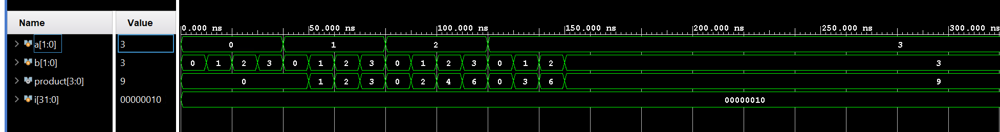</div>

Add the appropriate board related master XDC file to the project and edit it to include the related
pins, assigning a to btn3-btn2, b to btn1-btn0, and product to LED3-LED0, you can refer to the ```Part-3-3-1```

## Conclusion

In this lab, you learned how to model multiple output circuits such as decoders, encoders, and ROM. You also learned how to use a system task $readmemb to initialize ROM memory. There are more system tasks that the language supports and you will learn some of them in the next lab. 

