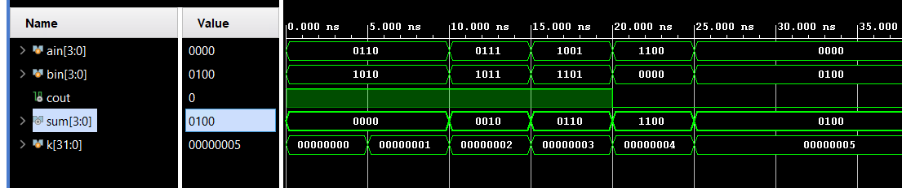
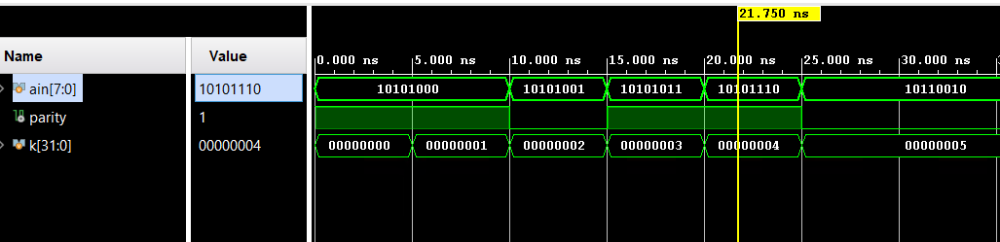
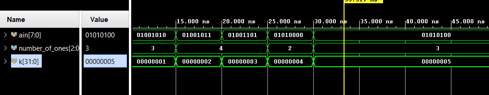

# Lab4_Tasks, Functions, and Testbench 

## Introduction

Verilog lets you define sub-programs using tasks and functions. They are used to improve the readability
and to exploit re-usability code. Functions are equivalent to combinatorial logic and cannot be used to
replace code that contains event or delay control operators (as used in a sequential logic). Tasks are
more general than functions, and may contain timing controls. Testbench is a program or model written in
any language for the purposes of exercising and verifying the functional correctness of a hardware model
during the simulation. Verilog is primarily a means for hardware modeling (simulation), the language
contains various resources for formatting, reading, storing, allocating dynamically, comparing, and writing
simulation data, including input stimulus and output results. 

In this lab, you will learn how to write tasks, functions, and testbenches. You will learn about the
components of a testbench, and language constructs available to verify the correctness of the underlying
hardware model.

## Tasks

A task is like a procedure which provides the ability to execute common pieces of code from several
different places in a model. A task can contain timing controls, and it can call other tasks and functions
(described in next part). A task is defined, within a module definition, as: 

```verilog
task task_id;
 [declarations]
 procedure statements
endtask
```

A task can have zero, one, or more arguments. Values are passed to and from a task through
arguments. The arguments can be input, output, or inout. Here is an example of a task definition and
usage. 

```verilog
module HAS_TASK;
 parameter MAXBITS = 8;
 task REVERSE_BITS; // task definition starts here
 input [MAXBITS – 1 : 0] DIN;
 output [MAXBITS – 1 : 0] DOUT;
 integer k;
 begin
 for (k=0; k < MAXBITS; k = k +1)
 DOUT[MAXBITS-k] = DIN[k];
 end
 endtask // task definition ends here
 reg [MAXBITS – 1] REG_X, NEW_REG;
 always @ (REG_X)
 REVERSE_BITS(REG_X,NEX_REG); // task being called
endmodule 

```

Verilog HDL also provides few system tasks. The system task name is preceded with a $. For example, 

```$display``` –Print the specified information to standard output with an end-of-line character.

e.g. **$display**(“At Simulation time %t, the x_var is %d”); will print x_var value in
decimal format and time in current time format.

```$write``` –Similar to the display task except it does not print an end-of-line character.

```$monitor``` –Monitors the argument continuously. Whenever there is a change of value in an argument
list, the entire argument list is displayed. 

```verilog
initial
 $monitor(“At %t, D= %d, CLK = %d”, $time, D, CLK, “and Q is %b”, Q); 
```
Note that the argument list values are printed in ```$display``` task whenever it is called, whereas in the
```$monitor``` task it gets printed whenever value of one of the arguments change. 

The system tasks are not synthesizable, i.e. they cannot be realized in real hardware.


### Part4-1-1

Write a task called add_two_values which will take two 4-bit parameters,
add them, and output a 4-bit sum and a carry. Write a module, called
add_two_values_task, that calls the task with the operands received via
input ports and outputs the result. Simulate the design with the provided
testbench, add_two_values_tb.v, and verify the functionality. 

Create and add the Verilog module, named add_two_values_task, which defines a task called
add_two_values. The task will take two 4-bit parameters, add them, and output a 4-bit sum and a
carry. The module will call the task with the operands received via input ports and outputs the
result.

**lab4_1_1.v**
```verilog
// Module for adding two 4-bit binary values using a task
module add_two_values_task(
    input [3:0] a,    // 4-bit input operand 'a'
    input [3:0] b,    // 4-bit input operand 'b'
    output [3:0] sum, // 4-bit output for the sum of 'a' and 'b'
    output carry      // Output for the carry out of the addition
);

    // Internal registers to hold the sum and carry produced by the task
    // These are necessary since tasks cannot directly assign to output ports
    reg [3:0] internal_sum;
    reg internal_carry;

    // Continuous assignments to link internal task outputs to module outputs
    assign sum = internal_sum;
    assign carry = internal_carry;

    // Task for performing addition of two 4-bit numbers
    // It takes two 4-bit inputs and returns a 4-bit sum and a carry out
    task add_two_values;
        input [3:0] in_a, in_b; // Input operands for the addition
        output [3:0] out_sum;   // Output sum from the addition
        output out_carry;       // Output carry from the addition
        begin
            // Perform the addition using Verilog's built-in addition operator
            // The curly braces '{}' are used for concatenation, combining carry and sum into one 5-bit result
            {out_carry, out_sum} = in_a + in_b; 
        end
    endtask

    // Always block to execute the task with current inputs whenever they change
    // This block is sensitive to any change in inputs 'a' and 'b'
    always @ (*) begin
        // Call the addition task with module inputs and assign results to internal registers
        add_two_values(a, b, internal_sum, internal_carry); 
    end

endmodule


```


Simulate the design with the provided testbench, add_two_values_task_tb.v, and verify that the
design works. Look for the messages displayed by the $display task in the simulator console
window. 

**tb.v**
```verilog
// Testbench for the add_two_values_task module
module tb();
    reg [3:0] ain, bin; // Declare 4-bit input registers for the module under test
    wire cout;          // Declare a single bit output wire for the carry output
    wire [3:0] sum;     // Declare a 4-bit output wire for the sum output
    integer k;          // Declare an integer for the loop index in the test sequence

    // Instantiate the Device Under Test (DUT) with named port mappings
    add_two_values_task DUT (.a(ain), .b(bin), .carry(cout), .sum(sum));

    // Initial block for the simulation
    initial begin
      // Set initial values for inputs
      ain = 4'h6; bin = 4'ha; // Initialize 'ain' and 'bin' with hexadecimal values
      // Display initial values and the outputs from DUT at the beginning of simulation
      $display("ain=%b, bin=%b, cout=%b, sum=%b at time=%t", ain, bin, cout, sum, $time);
      
      // Loop to change inputs and observe the output changes
      for (k = 0; k < 5; k = k + 1) begin
          #5 ain = ain + k; bin = bin + k; // Increment 'ain' and 'bin' by 'k' after every 5 time units
          // Display updated values and the outputs after each change
          $display("ain=%b, bin=%b, cout=%b, sum=%b at time=%t", ain, bin, cout, sum, $time);
      end
      // Print simulation completion message
      $display("Simulation Done");
    end
endmodule


```

We can run Simulation to check the code by clicking the Run Simulation under the SIMULATION and choose the first Run Behavioral Simulation.

<div align=center></div>


### Part4-1-2

Write a task called calc_even_parity which will take an 8-bit number, and
compute and return parity. Write a module, called calc_even_parity_task,
which calls the task with the operand received via the input port and
outputs the result. Use the provided testbench, calc_even_parity_task_tb.v,
that displays the result using $display system task. Simulate the design
and verify the functionality. 


**lab4_1_2.v**
```verilog
// Module for calculating the even parity of an 8-bit input
module calc_even_parity_task (
    input [7:0] data,   // 8-bit input data for which to calculate parity
    output parity       // Output parity bit, high if number of '1's in 'data' is even
);
    // Internal register to hold the calculated parity
    reg internal_parity;
     
    // Continuous assignment to link the internal parity to the module's output
    assign parity = internal_parity;
     
    // Task to calculate even parity for an 8-bit input
    task calc_even_parity;
        input [7:0] data;    // 8-bit input data for the task
        output parity;       // Output parity bit for the task

        reg [7:0] temp;      // Temporary register for processing
        integer i;           // Loop counter

        begin
            temp = data;     // Copy input data to temporary register
            parity = 1'b0;   // Initialize parity to 0 (even)

            // Loop through each bit of the input data
            for (i = 0; i < 8; i = i + 1) begin
                // XOR the current parity with each bit of the input data
                // If there are an even number of '1's, parity will end up being '0'.
                // If there are an odd number of '1's, parity will end up being '1'.
                parity = parity ^ temp[i];
            end
        end
    endtask

    // Always block to calculate the parity whenever the input 'data' changes
    always @ (data) begin
        // Call the even parity calculation task with the input data
        calc_even_parity(data, internal_parity);
    end
   
endmodule


```


**tb.v**
```verilog
// Define testbench module
module tb();
    reg [7:0] ain;     // 8-bit input register for the module under test
    wire parity;       // Single bit output wire for the module under test
    integer k;         // Loop variable for test iteration

    // Instantiate the Device Under Test (DUT) with named port mappings
    calc_even_parity_task DUT (.data(ain), .parity(parity));

    // Initial block for simulation
    initial begin
      // Set initial value for input
      ain = 8'ha8; // Initialize 'ain' with a hexadecimal value
      // Display the initial input and resulting parity
      $display("ain=%h, parity=%b, at time=%t", ain, parity, $time);

      // Loop to modify input and observe changes in parity
      for (k = 0; k < 5; k = k + 1) begin
          #5 ain = ain + k; // Increment input 'ain' by 'k' every 5 time units
          // Display the updated input and resulting parity after each increment
          $display("ain=%h, parity=%b, at time=%t", ain, parity, $time);
      end
      // Indicate completion of the simulation
      $display("Simulation Done");
    end
endmodule

```

We can run Simulation to check the code by clicking the Run Simulation under the SIMULATION and choose the first Run Behavioral Simulation.

<div align=center></div>


## Functions
Functions are declared within a parent module with the keywords function and endfunction. Functions
are used if all of the following conditions are true:

* There are no delay, timing, or event control constructs that are present

* It returns a single value

* There is at least one input argument

* There are no output or inout argument

* There are no non-blocking assignments

In short, functions may implement only combinatorial behavior, i.e. they compute a value on the basis of
the present value of the input arguments and return a single value. They are used in the right hand side
of an assignment statement. Here is an example of a function definition and call. 

```verilog
module HAS_FUNCTION(X_IN, REV_X);
 parameter MAXBITS = 8;
 output reg [MAXBITS – 1 : 0] REV_X;
 input [MAXBITS – 1 : 0] X_IN;
 function [MAXBITS – 1 : 0] REVERSE_BITS; // function definition starts here
 input [MAXBITS – 1 : 0] DIN;
 integer k;
 begin
 for (k=0; k < MAXBITS; k = k +1)
 REVERSE_BITS[MAXBITS-k] = DIN[k];
 end
 endfunction // function definition ends here
always @ (X_IN)
 REV_X = REVERSE_BITS(X_IN); // function being called
endmodule 

```

### Part4-2-1
Write a function called add_two_values which will take two 4-bit
parameters, add them, and return a 5-bit sum. Write a module, called
add_two_values_function, with two 4-bit input ports and one 5-bit output
port and calls the function. Simulate the design with the provided
testbench, add_two_values_function_tb.v, and verify the functionality. 

Create and add a Verilog module, called add_two_values_function, which defines a function
called add_two_values that takes two 4-bit parameters, add them, and return a 5-bit sum. The
module will have two 4-bit input ports and one 5-bit output port. It will call the function.


**lab4_2_1.v**
```verilog
// Module for adding two 4-bit binary values using a Verilog function
module add_two_values_function (
    input [3:0] a,      // First 4-bit input operand
    input [3:0] b,      // Second 4-bit input operand
    output [4:0] sum    // 5-bit output for the sum (includes carry out)
);

// Function for adding two 4-bit values and returning a 5-bit result
// This function is a combinational logic block that computes the sum of two inputs
function [4:0] add_two_values;
    input [3:0] a, b; // Declare two 4-bit input parameters for the function
    begin
        // Perform addition and return the result
        // The function returns the sum of 'a' and 'b', where {carry, sum} is a 5-bit number
        // 'a' and 'b' are zero-extended to 5 bits before adding to ensure correct carry out
        add_two_values = a + b;
    end
endfunction

    // Continuous assignment statement to compute the sum
    // Uses the add_two_values function to calculate the sum of 'a' and 'b'
    // and assigns the result to the output 'sum'
    assign sum = add_two_values(a, b);
endmodule

```

**tb.v**
```verilog
// Testbench module to verify the add_two_values_function functionality
module tb();
    reg [3:0] ain, bin;  // Define 4-bit registers for inputs
    wire [4:0] sum;      // Define a 5-bit wire for the output, as the sum may overflow 4 bits
    integer k;           // Variable used for generating test cases in the for loop
    
    // Instantiate the Device Under Test (DUT) with named port mapping
    add_two_values_function DUT (.a(ain), .b(bin), .sum(sum));
     
    // Begin the simulation block
    initial begin
      // Initialize inputs
      ain = 4'h6;  // Set initial value of 'ain' to 6 (4'b0110)
      bin = 4'ha;  // Set initial value of 'bin' to 10 (4'b1010)
      
      // Display initial state of test variables and output
      $display("ain=%b, bin=%b, sum=%b at time=%t", ain, bin, sum, $time);
      
      // Generate additional test cases using a for loop
      for (k = 0; k < 5; k = k + 1) begin
          #5 ain = ain + k; bin = bin + k; // Increment 'ain' and 'bin' by 'k' every 5 time units
          
          // Display updated values after each increment
          $display("ain=%b, bin=%b, sum=%b at time=%t", ain, bin, sum, $time);
      end
      
      // Print a message once simulation is complete
      $display("Simulation Done");
    end
    
endmodule


```

We can run Simulation to check the code by clicking the Run Simulation under the SIMULATION and choose the first Run Behavioral Simulation.

<div align=center></div>

### Part4-2-2

Write a task called calc_ones which will take an 8-bit number, and calculate
and return number of ones. Write a module, called calc_ones_function,
with one 8-bit input port and one 3-bit output port and calls the function.
Simulate the design with the provided testbench, calc_ones_function_tb.v,
and verify the functionality.

**lab4_2_2.v**
```verilog
// Module for calculating the number of '1's in an 8-bit input using a Verilog function
module calc_ones_function(
    input [7:0] data,            // 8-bit input data to analyze
    output [2:0] number_of_ones  // Output representing the number of '1's in the input data
);

// Function to calculate the number of '1's in an 8-bit input
function [2:0] calc_ones;
    input [7:0] a;       // Local input variable for the function, holding the data to be analyzed
    integer i;          // Local variable for looping through the bits in 'a'
    begin
        calc_ones = 3'd0; // Initialize the count of '1's to 0
        for (i = 0; i < 8; i = i + 1) begin  // Loop through each bit of 'a'
            // If the current bit is '1', increment the count of '1's
            if (a[i] == 1'b1) begin
                calc_ones = calc_ones + 1'b1;
            end else begin
                // If the current bit is not '1', maintain the current count
                calc_ones = calc_ones;
            end
        end
    end
endfunction

// Continuous assignment to assign the result of the calc_ones function
// to the module output 'number_of_ones'
// This assignment triggers whenever the input 'data' changes
assign number_of_ones = calc_ones(data);

endmodule

```


**tb.v**
```verilog
// Testbench for the calc_ones_function module
module tb();
    reg [7:0] ain;                       // 8-bit input for testing
    wire [2:0] number_of_ones;           // 3-bit output representing the number of ones in 'ain'
    integer k;                           // Loop variable for generating different test vectors
    
    // Instantiate the Device Under Test (DUT)
    calc_ones_function DUT (.data(ain), .number_of_ones(number_of_ones));
     
    // Begin simulation
    initial begin
      ain = 8'h4a; // Initialize 'ain' with a hexadecimal value
      #5; // Wait 5 time units to ensure the DUT has processed the input
      // Display the initial number of ones in 'ain'
      $display("ain=%h, number_of_ones=%d at time=%t", ain, number_of_ones, $time);

      // Change 'ain' several times to test different scenarios
      for (k = 0; k < 5; k = k + 1) begin
          #5 ain = ain + k; // Increment 'ain' by 'k' after waiting 5 time units
          // Display the updated number of ones in 'ain' after each change
          $display("ain=%h, number_of_ones=%d at time=%t", ain, number_of_ones, $time);
      end
      // Indicate completion of the simulation
      $display("Simulation Done");
    end
    
endmodule


```

We can run Simulation to check the code by clicking the Run Simulation under the SIMULATION and choose the first Run Behavioral Simulation.

<div align=center></div>

## Testbench

The major components of a testbench are:

* `timescale declaration: Specify the time unit for all delays

* Module, which defines the testbench top-level structure: A testbench usually does not have ports

* Internal signals, which will drive the stimuli into the UUT and monitor the response from the UUT: Signal to drive and monitor

* UUT instantiation

* Stimuli generation: Write statements to create stimulus and procedural block

* Response monitoring and comparing: Self-testing statements that will report values, error, and warnings; $display, $write, $strobe, and/or $monitor system tasks 

Verilog supports two types of delay modeling: (i) inertial and (ii) transport. The inertial delay is the delay
that a gate or circuit may experience due to the physical nature of the gate or circuit. Depending on the
technology used, it can be in ps or ns. The inertial delay is also used to determine if the input has an
effect on the gate or circuit. If the input does not remain changed at least for the initial delay then the
input change is ignored. For example, inertial delay of 5 ns means whenever input changes it should
remain changed at least for 5 ns to have it considered as changed otherwise the change is ignored
(considered noise spike). The transport delay is the time-of-flight of a signal travelling a wire of a circuit.
Here are some examples of transport and inertial delays: 

```verilog
wire #2 a_long_wire; // transport delay of 2 units is modeled
xor #1 M1(sum, a, b); // inertial delay of 1 unit exerted by xor gate 
```

The ```initial``` statements are used in testbench to generate stimuli and control simulation execution.
Here is an example of it: 

```verilog
initial begin
 #100 $finish; // run simulation for 100 units
end
initial begin
 #10 a=0; b=0; // a, b zero after 10 units delay. Between 0 and 10, it is x
 #10 b=1; // At 20, make b=1
 #10 a=1; // at 30, make a=1
 #10 b=0; // at 40, make b=0
end 

```
Here is another example of the initial statement usage to generate a periodic signal called clock. It
will generate a clock signal of 50% duty cycle with a period of 20 units. 

```verilog
reg clock;
parameter half_cycle = 10;
initial
 begin
 clock = 0;
 forever
 begin
 #half_cycle clock = 1;
 #half_cycle clock = 0;
 end
 end 
```


### Part4-3-1
Develop a testbench to verify the 4-bit ripple carry adder functionality. Use
the ripple carry design (and its associated fulladder_dataflow module) you
developed in Part 3-1 of Lab 2. Modify the design to include 2 units of
inertial delay for every assignment statement in the design. Develop a
testbench such that it computes expected output, compares the result, and
displays the result as “Test Passed” or “Test Failed” 


**lab4_3_1.v**
```verilog
module lab4_3_1(
    input a,     // First input bit
    input b,     // Second input bit
    input cin,   // Input carry bit
    output sum,    // Sum output bit
    output cout  // Carry output bit
);

    // Implement the sum and carry using dataflow modeling expressions.
    // Sum (s) is the XOR of the three inputs.
    assign #2 {cout,sum} = a + b + cin;


```


**tb.v**
```verilog
module tb_ripple_carry_adder;

    // Testbench signals
    reg  a, b;
    reg cin;
    wire  sum;
    wire cout;
    reg [2:0] expected; // Expected result includes sum and carry out
    integer i, j;

    // Instantiate the Device Under Test (DUT)
    lab4_3_1 DUT (
        .a(a),
        .b(b),
        .cin(cin),
        .sum(sum),
        .cout(cout)
    );

    // Test sequence
    initial begin
        // Initialize inputs
        a = 0; b = 0; cin = 0;
        // Run through all possible input combinations
        for (i = 0; i < 2; i = i + 1) begin
            for (j = 0; j < 2; j = j + 1) begin
                a = i; b = j; cin = 0;
                #10; // Wait for ripple to propagate, adjust time as needed
                expected = i + j;
                // Check result
                if ({cout, sum} !== expected) begin
                    $display("Test Failed: a=%b, b=%b, cin=%b, sum=%b, cout=%b, Expected=%b",
                             a, b, cin, sum, cout, expected);
                end else begin
                    $display("Test Passed: a=%b, b=%b, cin=%b, sum=%b, cout=%b",
                             a, b, cin, sum, cout);
                end
                #10; // Additional delay for clarity in simulation
            end
        end
        $finish;
    end


    // Monitoring changes (optional for debug)
    initial begin
        $monitor("Time = %t: a = %b, b = %b, cin = %b, sum = %b, cout = %b",
                 $time, a, b, cin, sum, cout);
    end

endmodule

```

We can see the simulation result as below:

<div align=center></div>


### Part4-3-2

Develop a testbench that generates the waveform shown below.

<div align=center></div>

**lab4_3_2.v**
```verilog
module waveform_generator(
    output reg A,
    output reg G1,
    output reg G2
);

initial begin
    // Initialize signals
    A = 0; G1 = 0; G2 = 1;
    
    // A waveform
  
    #40 A = 1; // At 40ns
    
    // G1 waveform
    #20 G1 = 1; // At 60ns
    
    #20 G2 = 0; // At 80ns
    
    #20 A = 0; // At 100ns
    
    // G2 waveform
    #20 G1 = 0; // At 120ns
    #20 G2 = 1; // At 140ns
end
```

**tb.v**
```verilog
`timescale 1ns / 1ps

module waveform_generator_tb;

    // Instantiate the waveform generator outputs
    wire A, G1, G2;

    // Instantiate the waveform generator module
    waveform_generator uut (
        .A(A),
        .G1(G1),
        .G2(G2)
    );

    initial begin
        // Initialize simulation
        $dumpfile("waveform_generator_tb.vcd");
        $dumpvars(0, waveform_generator_tb);

        // Simulate for 150 ns
        #150;

        // End simulation
        $finish;
    end
endmodule

```

<div align=center></div>


## Conclusion

In this lab, you learned how to write functions, tasks, and testbenches. You also learned the differences
between functions and tasks, both in their definitions and in usage. You saw how function can be used in
a testbench to compute expected output. 