# Lab5_Modeling Latches and Flip-flops  

## Introduction
Sequential circuits are digital circuits in which the output depends not only on the present input (like
combinatorial circuits) but also on the past sequence of inputs. In effect, these circuits must be able to
remember something about the history of the inputs. Thus, the timing concept is introduced, and the
clock signal provides the timing essence to the sequential circuits. Latches and flip-flops are commonly
used memory devices in sequential circuits.
## Latches
Storage elements can be classified into latches and flip-flops. Latch is a device with precisely two stable
states: high-output and low-output. A latch has a feedback path so that the device can retain information. Therefore, latches are volatile memory devices that can store one bit of data for as long as the
device is powered. As the name suggests, latches are used to "latch onto" information and hold it in place.

An **SR latch** (Set/Reset) is an asynchronous device: it works independently of control signals and relies
only on the state of the S and R inputs. The symbol, the circuit using NOR gates, and the truth table are
shown below. 

<div align=center></div>

Though Xilinx FPGAs can implement such a latch using one LUT (Look-Up Table) circuit, the following
Verilog code shows how such a circuit can be modeled using Gate-level and dataflow modeling. 

```verilog
module SR_latch_gate (input R, input S, output Q, output Qbar);
nor (Q, R, Qbar);
nor (Qbar, S, Q);
endmodule

module SR_latch_dataflow (input R, input S, output Q, output Qbar);
assign #2 Q_i = Q;
assign #2 Qbar_i = Qbar;
assign #2 Q = ~ (R | Qbar);
assign #2 Qbar = ~ (S | Q);
endmodule 

```

### Part5-1-1
Design an SR latch by using the code shown above. Synthesize the design
and view the schematic of the synthesized design. Develop a testbench to
test (see waveform below) and validate the design. Simulate the design.
Assign S input to BTN0 and R input to BTN1. Assign Q to LED0 and Qbar to
LED1. Implement the design and verify the functionality of the hardware. 

<div align=center>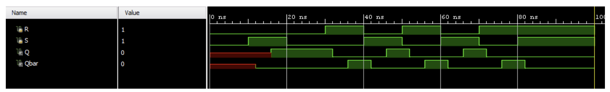</div>

* View the schematic of the synthesized design

<div align=center>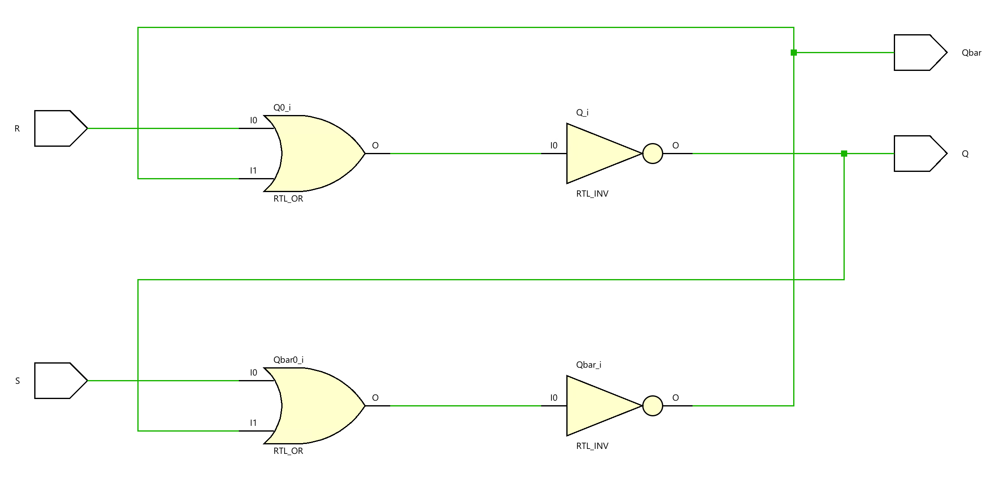</div>

* Develop a testbench to test (see waveform above), perform behavioral simulation for 100ns, and
validate the design. 

**tb.v**
```verilog
module rs_flipflop_tb;

// Inputs
reg R;
reg S;

// Outputs
wire Q;
wire Qbar;

// Instantiate the Unit Under Test (UUT)
SR_latch_dataflow uut (
    .R(R), 
    .S(S), 
    .Q(Q), 
    .Qbar(Qbar)
);

initial begin
    // Initialize Inputs
    R = 0;
    S = 0;
    
    // Apply test vectors
    #10; // Wait for 10ns
    S = 1; // Set
    #10; 
    S = 0; // Release Set
    #10;
    R = 1; // Reset
    #10;
    R = 0; // Release Reset
    S = 1; // Set again
    #10;
    R = 1;
    S = 0;
    #10;
    R = 0;
    S = 1;
    #10;
    R = 1;
    S = 0;
    #10;
    S = 1;
    #20;
    // Finish the simulation
    $finish;
end

initial begin
    // Monitor changes in signals
    $monitor("Time=%t | R=%b, S=%b | Q=%b, Qbar=%b", $time, R, S, Q, Qbar);
end

endmodule

```

We can run a Simulation to check the code by clicking the Run Simulation under the SIMULATION and choosing the first Run Behavioral Simulation.

<div align=center>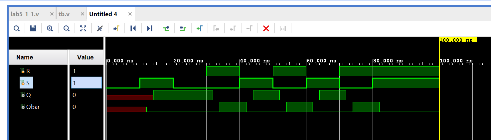</div>


### Part5-1-2

In some situations, it may be desirable to dictate when the latch can and cannot latch. The **gated SR latch** is a simple extension of the SR latch, which provides an *Enable* line that must be driven high
before data can be latched. Even though a control line is now required, the SR latch is not synchronous
because the inputs can change the output even in the middle of an enable pulse. When the *Enable* input
is low, the outputs from the AND gates must also be low. Thus, the *Q* and bar *Q* outputs remain
latched to the previous data. Only when the *Enable* input is high can the state of the latch change, as
shown in the truth table. When the enable line is asserted, a gated SR latch is identical in operation to an
SR latch. The *Enable* line is sometimes a clock signal but is usually a read or writes strobe. The symbol,
circuit, and truth table of the gates SR latch are shown below. 

<div align=center>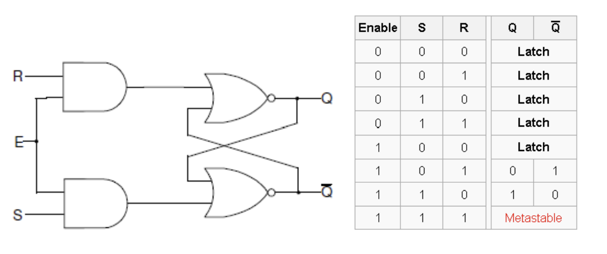</div>

Design a gated SR latch (shown in the figure above) using dataflow
modeling. Synthesize the design and view the schematic of the
synthesized design. Develop a testbench to test (generate input as shown
below) and validate the design. Simulate the design. Assign S input to
BTN0, R input to BTN1, and Enable input to BTN2. Assign Q to LED0 and
Qbar to LED1. Implement the design and verify the functionality of the
hardware. 


<div align=center>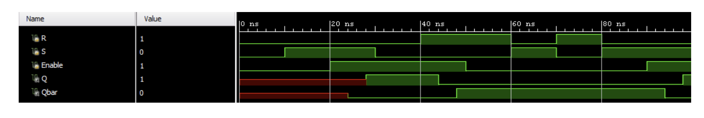</div>

**lab5_1_2.v**
```verilog
module gated_sr_latch_dataflow(
    input wire R, 
    input wire S, 
    input wire E, 
    output wire Q, 
    output wire Qbar
);

assign Q    = ~ ((R & E)|Qbar);
assign Qbar = ~ ((S & E)|Q);

endmodule


```
* View the schematic of the synthesized design

<div align=center>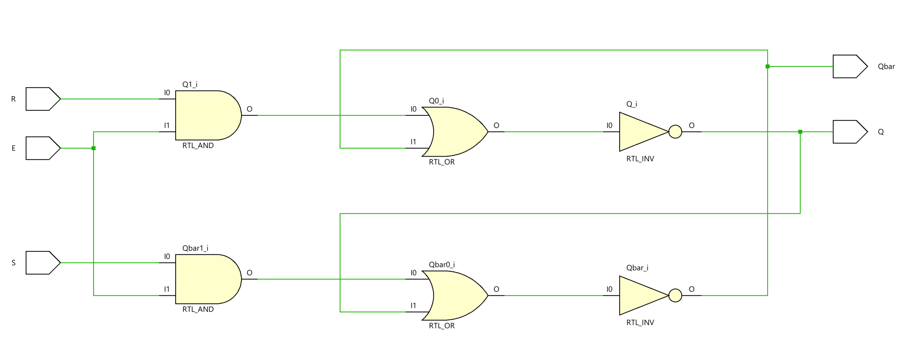</div>

* Develop a testbench to test (see waveform above), perform behavioral simulation for 100ns, and
validate the design. 

**tb.v**
```verilog
module tb;
    // Inputs
    reg R; // Reset input
    reg S; // Set input
    reg E; // Enable input
    // Outputs
    wire Q; // Output of the latch
    wire Qbar; // Complement of the output

    // Instantiate the Unit Under Test (UUT) with the gated SR latch model
    gated_sr_latch_dataflow uut (
        .R(R), 
        .S(S), 
        .E(E), 
        .Q(Q), 
        .Qbar(Qbar)
    );

    initial begin
        // Initialize Inputs to default state (inactive)
        R = 0;
        S = 0;
        E = 0;

        // Sequentially apply test vectors with timing delays to simulate latch behavior

        // Attempt to set the latch without enabling - should have no effect
        #10; S = 1; // Apply set input
        
        // Enable the latch, allowing the set action to take effect
        #10; E = 1; // Enable the latch
        
        // Reset the latch
        #10; S = 0; // Remove set input
        #10; R = 1; // Apply reset input
        
        // Reset the enable to check latch remains in the last state when disabled
        #10; E = 0; // Disable the latch
        
        // Toggle inputs to further test latch functionality
        #10; R = 0; S = 1; // Set attempt without enable
        #10; R = 1; S = 0; // Reset attempt without enable
        #10; R = 0; S = 1; // Another set attempt without enable
        
        // Note: $finish is commented out to allow the simulation to run indefinitely or be manually stopped.
        // $finish; // Uncomment to terminate simulation automatically
    end

    // Monitor changes on input and output signals and display them
    initial begin
        $monitor("Time=%t | R=%b, S=%b, E=%b| Q=%b, Qbar=%b", $time, R, S, E, Q, Qbar);
    end

endmodule

```

We can run a Simulation to check the code by clicking the Run Simulation under the SIMULATION and choosing the first Run Behavioral Simulation.

<div align=center>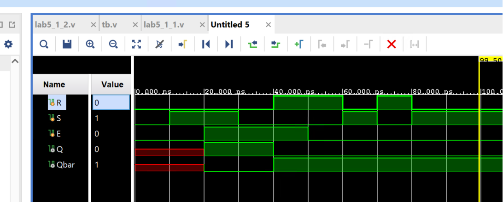</div>

* Add the appropriate board-related master XDC file to the project and edit it to include the related
pins, assigning S input to BTN0, R input to BTN1  E input to BTN2, Q to LED0, and Qbar to LED1. 

<div align=center>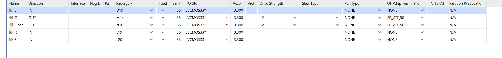</div>

For the constraints file, please add the code as below:
```verilog
# Map the reset input 'R' to pin L19 and set its I/O standard to 3.3V LVCMOS
set_property PACKAGE_PIN L19 [get_ports R]
set_property IOSTANDARD LVCMOS33 [get_ports R]

# Map the set input 'S' to pin L20 and set its I/O standard to 3.3V LVCMOS
set_property PACKAGE_PIN L20 [get_ports S]
set_property IOSTANDARD LVCMOS33 [get_ports S]

# Map the output 'Q' to pin M14 and set its I/O standard to 3.3V LVCMOS
set_property PACKAGE_PIN M14 [get_ports Q]
set_property IOSTANDARD LVCMOS33 [get_ports Q]

# Map the complementary output 'Qbar' to pin N16 and set its I/O standard
set_property PACKAGE_PIN N16 [get_ports Qbar]
set_property IOSTANDARD LVCMOS33 [get_ports Qbar]

# Map the enable input 'E' to pin D19 and set its I/O standard to 3.3V LVCMOS
set_property PACKAGE_PIN D19 [get_ports E]
set_property IOSTANDARD LVCMOS33 [get_ports E]

# Allow combinational loops for 'Q' and 'Qbar' outputs, acknowledging potential design risks
set_property ALLOW_COMBINATORIAL_LOOPS TRUE [get_nets Q_OBUF]
set_property ALLOW_COMBINATORIAL_LOOPS TRUE [get_nets Qbar_OBUF]
```


Generate the bitstream and program device like [Lab1](https://uri-nextlab.github.io/ParallelProgammingLabs/Verilog_Labs/Lab1_Modeling_Concepts.html).

Then you can press the button on the board, and you can see the LED is on like below:

<div align=center>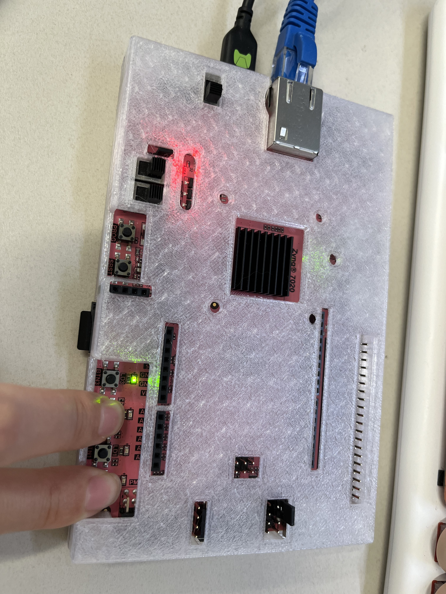</div>

<div align=center>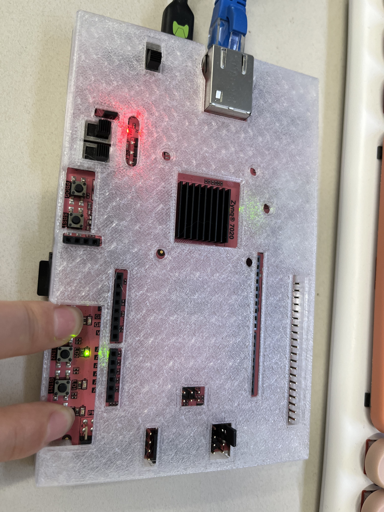</div>

### Part5-1-3

The **D latch** (D for "data") or **transparent latch** is a simple extension of the gated SR latch that removes
the possibility of invalid input states (metastability). Since the gated SR latch allows us to latch the output
without using the *S* or *R* inputs, we can remove one of the inputs by driving both the Set and Reset inputs
with a complementary driver, i.e. we remove one input and automatically make it the inverse of the
remaining input. The D latch outputs the *D* input whenever the Enable line is high. Otherwise, the output is
whatever the *D* input was when the Enable input was last high. This is why it is also known as a
transparent latch - when Enable is asserted, it is said to be "transparent" - its signals propagate
directly through it as if it isn't there. 

<div align=center>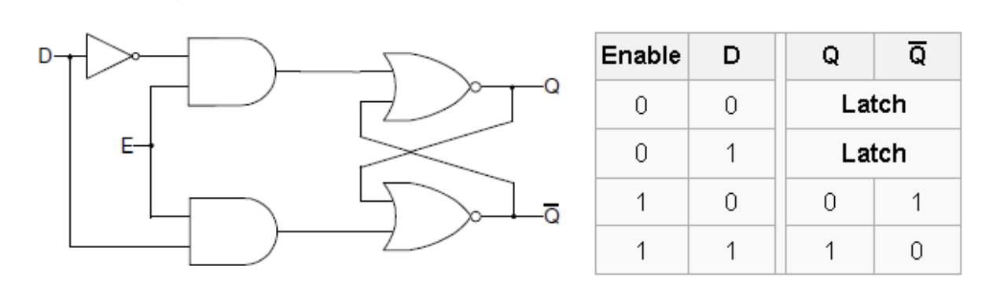</div>

D-latches can be modeled using behavioral modeling, as shown below. 

```verilog
module D_latch_behavior (input D, input Enable, output reg Q, output reg Qbar);
always @ (D or Enable)
 if(Enable)
 begin
 Q <= D;
 Qbar <= ~D;
 end
endmodule 

```

* View the schematic of the synthesized design

<div align=center>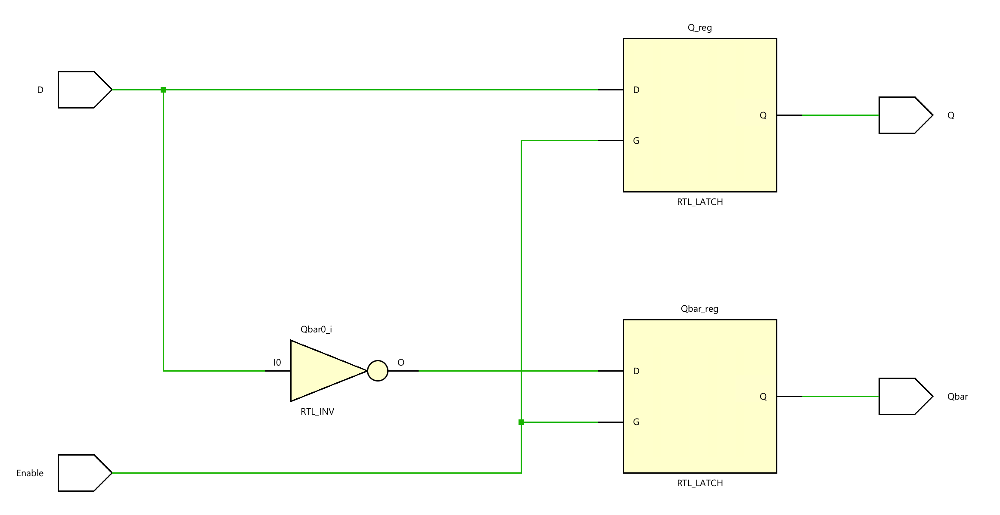</div>

Note that since we do not say what to do when Enable is low, the circuit “remembers” the previous state.
While Enable is high and since the always block is also sensitive to D, Q and Qbar will be updated whenever D changes, giving it a “transparent” behavior. Also note that the non-blocking assignment
operator (<=) is used instead of the blocking (=) operator, which had been used in dataflow modeling. The
distinction between the blocking and non-blocking assignment is covered in Lab 7 (Testbenches for
Sequential Circuits). 

Design a D latch (shown in the figure above) using dataflow modeling.
Synthesize the design and view the schematic of the synthesized design.
Develop a testbench to test (generate input as shown below) and validate
the design. Simulate the design. Assign D input to BTN0 and Enable input
to BTN1. Assign Q to LED0 and Qbar to LED1. Implement the design and
verify the functionality of the hardware.

**lab5_1_3.v**
```verilog
module D_latch_dataflow(
    input wire D, // Data input for the D Latch
    input wire E, // Enable input for the D Latch
    output wire Q, // Output of the D Latch
    output wire Qbar // Complement (inverse) of the output Q
    );
    
    // The Q output assignment. The latch is transparent when E is high, and D is passed through to Q.
    // When E is low, the latch holds its value because of the feedback through Qbar.
    // The logic ensures that Q is the inverse of the input when E is high, considering the current state of Qbar for holding the value.
    assign Q = ~((~D & E) | Qbar);

    // The Qbar output assignment is similar to Q but uses the complement of D.
    // This ensures that Qbar holds the opposite value of Q, creating the necessary feedback loop for the latch functionality.
    // The feedback through Q helps maintain the current state when E is low.
    assign Qbar = ~((D & E) | Q);
       
endmodule

```

* View the schematic of the synthesized design

<div align=center></div>

* Develop a testbench to test (see waveform above), perform behavioral simulation for 100ns, and
validate the design. 

**tb.v**
```verilog
module tb;

    // Inputs for the D Latch
    reg D; // Data input
    reg E; // Enable input
    
    // Outputs from the D Latch
    wire Q; // Output of the latch
    wire Qbar; // Inverted output of the latch

    // Instantiate the Unit Under Test (UUT) with the D Latch model
    D_latch_dataflow uut (
        .D(D), 
        .E(E), 
        .Q(Q), 
        .Qbar(Qbar)
    );

    initial begin
        // Initialize Inputs to default state
        D = 0; // Data input set to 0
        E = 0; // Enable input set to 0
        
        // Sequentially apply test vectors to simulate the D Latch behavior
        #10; // Wait for 10ns
        D = 1; // Change data input to 1
        #10; 
        E = 1; // Enable the latch
        #10;
        D = 0; // Change data input to 0
        #10;
        D = 1; // Change data input back to 1

        #10; // Wait for 10ns, at 50ns from start
        D = 1; // Ensure data input remains at 1
        E = 0; // Disable the latch
        #10; // At 60ns from start
        D = 0; // Change data input to 0
        #10;
        D = 1; // Change data input to 1
        #10; // At 80ns from start
        D = 0; // Change data input to 0 again
        #10;
        E = 1; // Enable the latch
        #10;
        D = 1; // Change data input to 1
        #10;
        D = 0; // Finally, change data input back to 0
        
        // Note: $finish; is commented out to allow for manual termination of the simulation if needed.
        // $finish; // Uncomment to terminate the simulation automatically
    end

    // Monitor block to watch and display changes on the D Latch inputs and outputs
    initial begin
        $monitor("Time=%t | D=%b, E=%b| Q=%b, Qbar=%b", $time, D, E, Q, Qbar);
    end

endmodule

```

We can run a Simulation to check the code by clicking the Run Simulation under the SIMULATION and choosing the first Run Behavioral Simulation.

<div align=center>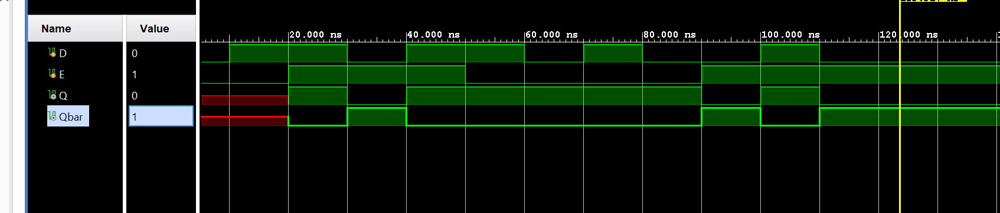</div>

* Add the appropriate board-related master XDC file to the project and edit it to include the related
pins, assigning S input to BTN0, R input to BTN1, Q to LED0, and Qbar to LED1. 


## Flip-flops
Flip-flops are clocked circuits whose output may change on an active edge of the clock signal based on
its input. Unlike latches, which are transparent and in which output can change when the gated signal is
asserted upon the input change, flip-flops normally would not change the output upon input change even
when the clock signal is asserted. Flip-flops are widely used in synchronous circuits.

The D flip-flop is a widely used type of flip-flop. It is also known as a *data* or *delay* flip-flop. The D flip-flop
captures the value of the D-input at a definite portion of the clock cycle (such as the rising edge of the
clock). That captured value becomes the Q output. At other times, the output Q does not change. The D
flip-flop can be viewed as a memory cell or a delay line. The active edge in a flip-flop could be rising or
falling. The following figure shows a rising (also called positive) edge-triggered D flip-flop and a falling
(negative edge) triggered D flip-flop. 

The positive edge triggered D flip-flop can be modeled using behavioral modeling as shown below. 

```verilog
module D_ff_behavior (input D, input Clk, output reg Q);
always @ (posedge Clk)
 if(Clk)
 begin
 Q <= D;
 end
endmodule 
```

Note that the ```always``` block is sensitive to the rising edge on the Clk signal. When a change (event) on the
sensitive signal occurs, the statements in the if block will be executed. The ```posedge``` sensitivity enables
the flip-flop behavior. For the falling edge sensitivity, use attribute ```negedge```. 


### Part5-2-1

Model a D flip-flop using behavioral modeling. Develop a testbench to
validate the model (see diagram below). Simulate the design. 

<div align=center>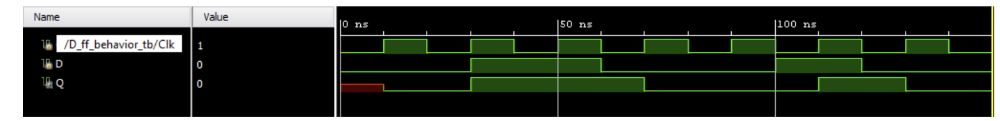</div>

**lab5_2_1.v**
```verilog

module D_ff(
            input d,
            input clk,
            output reg q);
       always @(posedge clk)
       begin       
            q <= d;     
       end
       
       
endmodule
```


* View the schematic of the synthesized design

<div align=center>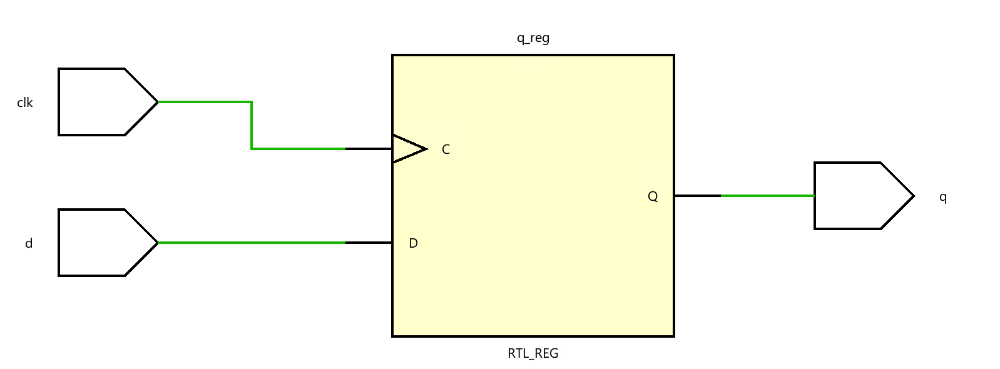</div>

* Develop a testbench to test (see waveform above), perform behavioral simulation for 100ns, and
validate the design. 

**tb.v**
```verilog
module D_ff_tb;

// Inputs
reg d;
reg clk;
// Outputs
wire q;

// Instantiate the Unit Under Test (UUT)
D_ff uut (   
    .clk(clk),
    .d(d), 
    .q(q)
);

initial begin
    // Initialize Inputs
  
    clk = 0;
    d = 0;

    #50;
    d = 1;
    #30;
     d = 0;
    #40;
     d = 1;
     #20;
     d <=0;
     
end

always #10 clk = ~ clk;


endmodule


```
We can run a Simulation to check the code by clicking the Run Simulation under the SIMULATION and choosing the first Run Behavioral Simulation.

<div align=center>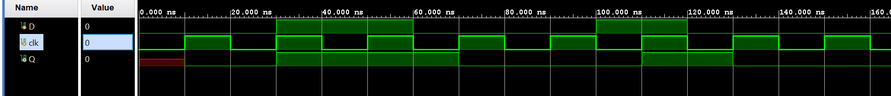</div>


### Part5-2-2
The following circuit and timing diagrams illustrate the differences between D-latch, rising edge triggered.
D flip-flop and falling edge triggered D flip-flops. 

<div align=center>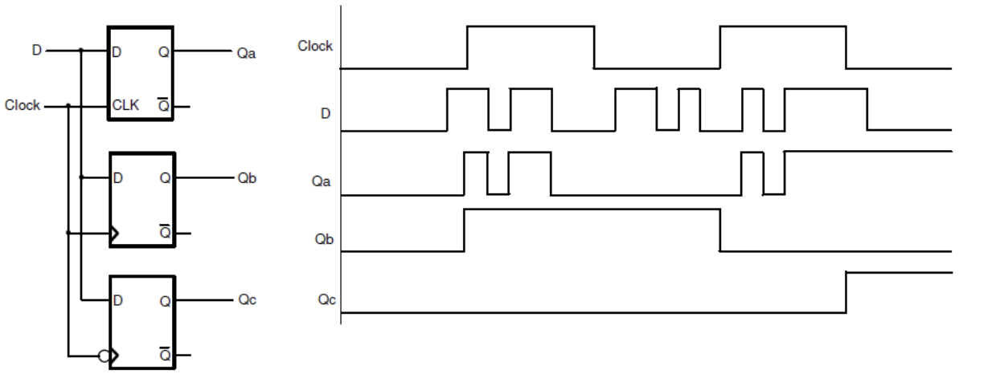</div>


**lab5_2_2.v**
```verilog
module compare_D_DFF(
    input wire clk, // Clock input
    input wire D,   // Data input
    output reg Qa,  // Output of D-latch
    output reg Qb,  // Output of rising edge triggered D flip-flop
    output reg Qc   // Output of falling edge triggered D flip-flop
);

// D-latch (level-sensitive)
always @(clk or D) begin
    if (clk) // Assuming a high level for latch enable
        Qa <= D;
end

// Rising edge triggered D flip-flop
always @(posedge clk) begin
    Qb <= D;
end

// Falling edge triggered D flip-flop
always @(negedge clk) begin
    Qc <= D;
end

endmodule

```

* View the schematic of the synthesized design

<div align=center>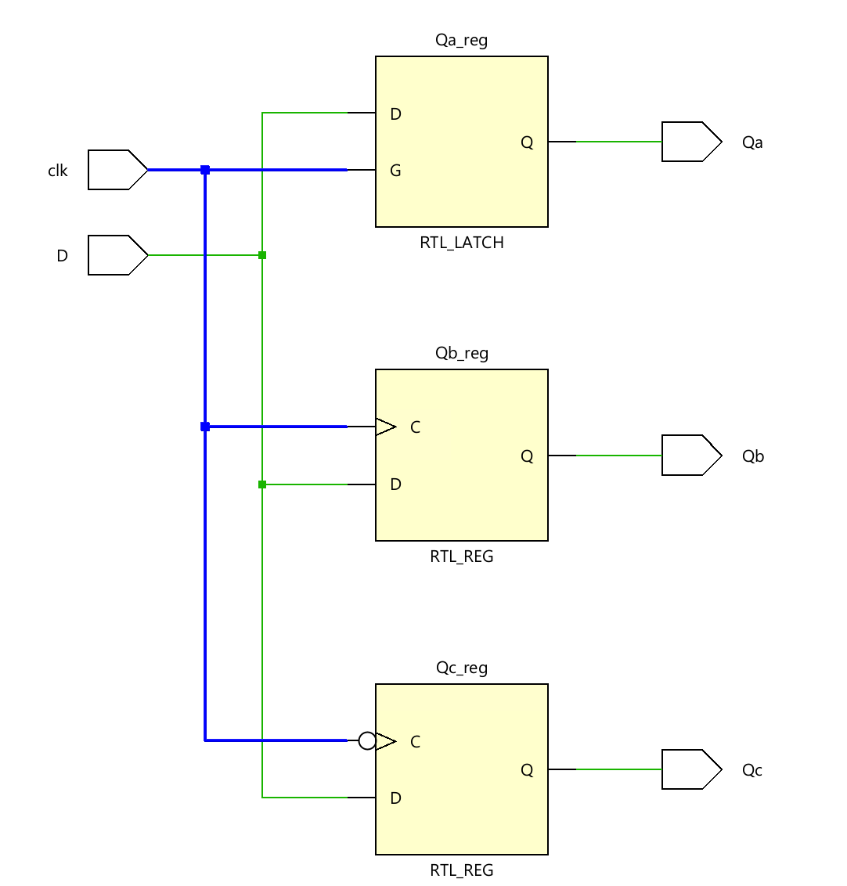</div>

* Develop a testbench to test (see waveform above), perform behavioral simulation for 100ns, and
validate the design. 

**tb.v**
```verilog
module tb;
// Inputs
reg D;
reg clk;
// Outputs
wire Qa;
wire Qb;
wire Qc;

// Instantiate the Unit Under Test (UUT)
compare_D_DFF uut (   
    .clk(clk),
    .D(D), 
    .Qa(Qa),
    .Qb(Qb),
    .Qc(Qc)
);

initial begin
    // Initialize Inputs
    D = 0;
    clk = 0;
    #28;
     D = 1;
    #5;
    D = 1;
    #1;
    D = 0;
    #3;
    D = 1;
    #2;
    D = 0;
    #2;
    D =1;
    #3;
    D =0;
    #12;
    D = 1;
    #10;
    D = 0;
    #2;
end

always #10 clk = ~ clk;


endmodule


```

We can run a Simulation to check the code by clicking the Run Simulation under the SIMULATION and choosing the first Run Behavioral Simulation.

<div align=center>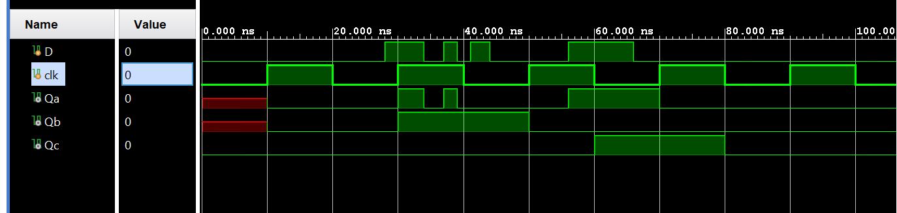</div>


### Part5-2-3
Often, it is necessary to have the synchronous element start with a defined output. In some circuits, it is also desired
and required to force the synchronous element to a known output, ignoring input at the D
input. The D flip-flop discussed above can be modified to have such functionality. Such a D flip-flop is
known as a D flip-flop with synchronous set and reset capabilities if the desired output is obtained on the
active edge of the clock; otherwise, it is viewed as having an asynchronous preset and clear. The models of
each kind are shown below. 

```verilog
module D_ff_with_synch_reset_behavior(input D, input Clk, input reset, output
reg Q);
 always @(posedge Clk)
 if (reset)
 begin
 Q <= 1'b0;
 end else
 begin
 Q <= D;
 end
endmodule

module D_ff_with_asynch_reset_behavior(input D, input Clk, input clear,
output reg Q);
 always @(posedge Clk or posedge clear)
 if (clear)
 begin
 Q <= 1'b0;
 end else
 begin
 Q <= D;
 end
endmodule
```

Model the D flip-flop with synchronous reset using behavioral modeling.
Develop a testbench to test (generate input as shown) and validate the
design. Simulate the design. Assign D input to BTN0, reset to BTN1, Clk to
SW15, and output Q to LED0. Verify the design in hardware.

<div align=center>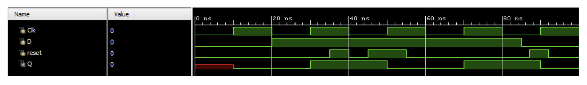</div>


**lab5_2_3.v**
```verilog
module Dff_sync_reset(
            input d,
            input clk,
            input rstn,
            output reg q);
       always @(posedge clk)
       begin  
            if(rstn)
                 q<= 0;
            else
                 q <= d;  
               
       end
             
endmodule
```

* view the schematic of the synthesized design

<div align=center>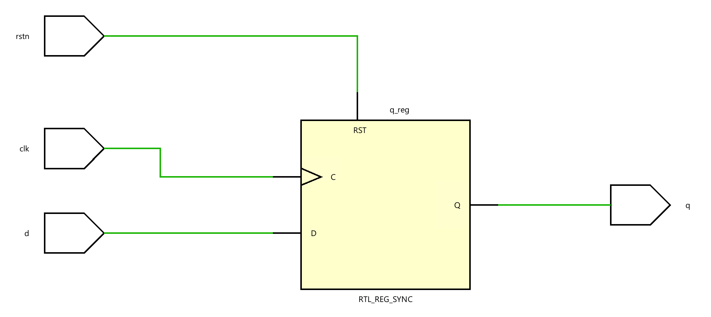</div>

* Develop a testbench to test (see waveform above), perform behavioral simulation for 100ns, and
validate the design. 

**tb.v**
```verilog
module tb;
reg D;
reg clk;
reg rstn;
// Outputs
wire q;

// Instantiate the Unit Under Test (UUT)
Dff_sync_reset uut (   
    .clk(clk),
    .d(D), 
    .rstn(rstn),
    .q(q)
);

initial begin
    // Initialize Inputs
    D <= 0;
    clk <= 0;
    rstn <= 0;
    
    #20;
    D <= 1;
    #5;
    rstn <= 1;
    #3;
    rstn <= 0;
    #3; 
    rstn <= 1;
   #17;
    rstn <= 0;
    #15;
    rstn <= 1;
    #8;
    rstn <= 0;
end

always #10 clk = ~ clk;


endmodule


```

We can run a Simulation to check the code by clicking the Run Simulation under the SIMULATION and choosing the first Run Behavioral Simulation.

<div align=center>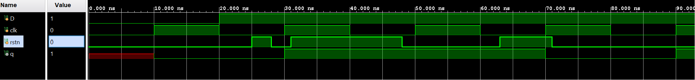</div>


### Part5-2-4

In FPGA, LUT and FF are located in different configurable logic blocks (CLB) and are connected using routing
resources. During implementation, the tools will use these resources depending on how the circuits
are modeled, the type and amount of resources required, and the speed at which the circuit will be
driven. Often, resources for exchanging information are placed close to each other; however, there
can be a situation when it may not be possible. When related flip-flops, between which the information
gets exchanged, are placed away from each other, the clocks arriving at the source and destination flip-flops may not be simultaneously, creating what is called clock-skew. The clock skew can alter the
behavior of the circuit. In some other cases, certain flip-flops may not need to update their output at
every asserted clock edge. Flip-flops in FPGA have an additional control
signal called Clock Enable (CE) to control the behavior. In ASIC technology, gated clocks are used to control the behavior. A
symbol of the flip-flop with CE is shown below. 


<div align=center>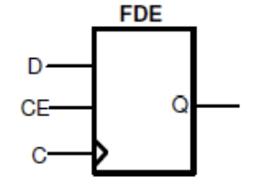</div>

```verilog
module D_ff_with_ce_behavior(input D, input Clk, input ce, output reg Q);
 always @(posedge Clk)
 if (ce)
 Q <= D;
endmodule
module D_ff_with_ce_and_synch_reset_behavior(input D, input Clk, input reset,
input ce, output reg Q);
 always @(posedge Clk)
 if (reset)
 begin
 Q <= 1'b0;
 end else if (ce)
 begin
 Q <= D;
 end
endmodule 
```

Model the D flip-flop with synchronous reset and clock enabled using
behavioral modeling. Develop a testbench to test (generate input as
shown) and validate the design. Simulate the design. 

**lab5_2_4.v**
```verilog
module d_ff_sync_reset_en(
    input wire clk,
    input wire rst,
    input wire en,
    input wire d,
    output reg q
);

// Behavioral modeling of the D flip-flop
always @(posedge clk) begin
    if (rst) begin
        q <= 0; // Reset the output when rst is high
    end else if (en) begin
        q <= d; // Capture the input when en is high
    end
    // No change to the output when en is low
end

endmodule
```

* view the schematic of the synthesized design

<div align=center>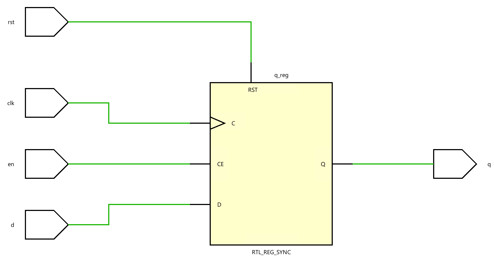</div>

* Develop a testbench to test (see waveform above), perform behavioral simulation for 100ns, and
validate the design. 

**tb.v**
```verilog
module tb;
// Inputs
reg D;
reg clk;
reg rst;
reg en;
// Outputs
wire q;

// Instantiate the Unit Under Test (UUT)
d_ff_sync_reset_en uut (   
    .clk(clk),
    .d(D), 
    .en(en),
    .rst(rst),
    .q(q)
);

initial begin
    // Initialize Inputs
    D <= 0;
    clk <= 0;
    rst <= 0;
    en <= 0;
    #20;
    D <= 1;
    #40;
     en <= 1;
    #15;
     en <= 0;
     #30;
     D <= 0;
     #20;
     rst <= 1;
     #20;
     rst <= 0;
end

always #10 clk = ~ clk;


endmodule

```

We can run a Simulation to check the code by clicking the Run Simulation under the SIMULATION and choosing the first Run Behavioral Simulation.

<div align=center>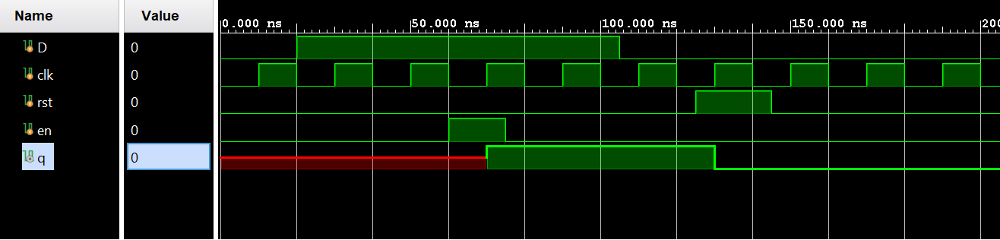</div>

### Part5-2-5

Another kind of flip-flop, called T or Toggle, is used to implement clock divider circuits in digital circuits.
It can be used to divide the input by 2. If more than one T flip-flop is cascaded, then the clock division can
be 2 powers of the number of flip-flops used. The T flip-flop has a T input (data), a clock input, and
optionally reset and enable control signals. 

```verilog
module clock_divider_behavior(input Clk, output reg Q);
 always @(negedge Clk)
 Q <= ~Q;
endmodule 
```

The T flip-flop can also have a control signal called CE (clock enable), which will allow clock division to
take place only when it is asserted. The following code models the functionality of the T flip-flop that is
sensitive to a falling edge of the clock and has active-low reset and active-high T control signals. 

```verilog
module T_ff_enable_behavior(input Clk, input reset_n, input T, output reg Q);
 always @(negedge Clk)
 if (!reset_n)
 Q <= 1'b0;
 else if (T)
 Q <= ~Q;
endmodule 

```

Model a T flip-flop with synchronous negative-logic reset and clock enable
using the above code. Assign T input to SW0, reset_n to SW1, Clk to
SW15, and output Q to LED0. Verify the design in hardware.


**lab5_2_5.v**
```verilog
module T_ff_enable_behavior(input Clk, input reset_n, input T, output reg Q);
 always @(negedge Clk)
    if (!reset_n)
    Q <= 1'b0;
    else if (T)
    Q <= ~Q;
endmodule 


```

* View the schematic of the synthesized design

<div align=center>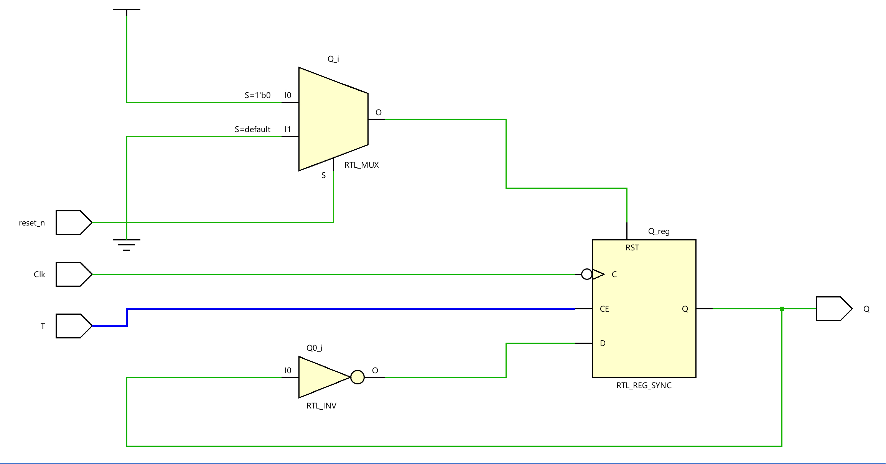</div>

* Develop a testbench to test (see waveform above), perform behavioral simulation for 100ns, and
validate the design. 

**tb.v**
```verilog
module tb;
// Inputs
reg en;
reg clk;
reg rstn;
// Outputs
wire q;

// Instantiate the Unit Under Test (UUT)
T_ff_enable_behavior uut (   
    .Clk(clk),
    .T(en), 
    .reset_n(rstn),
    .Q(q)
);

initial begin
    // Initialize Inputs
  
    clk <= 0;
    rstn <= 0;
    en <= 0;
    #20;
    rstn <= 1;
    #40;
     en <= 1;
    #15;
     #30;

     #20;
     rstn <= 1;
     #20;
     rstn <= 0;
end

always #10 clk = ~ clk;


endmodule
```


We can run a Simulation to check the code by clicking the Run Simulation under the SIMULATION and choosing the first Run Behavioral Simulation.

<div align=center>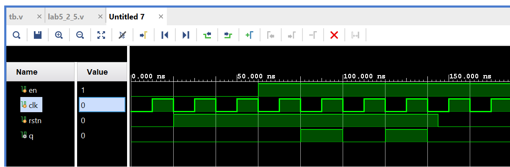</div>

## Conclusion

In this lab, you learned the functionality of various kinds of latches and flip-flops. You modeled and
verified the functionality of these components. Xilinx also provides some basic latches and flip-flops
library components which a designer can instantiate and use instead of writing a model. Writing a model
provides portability across vendors and technologies whereas instantiating library components enables a
quick use of a component without re-inventing the wheel. 
