# Lab6_Modeling Registers and Counters  

## Introduction

When several flip-flops are grouped together, with a common clock, to hold related information the resulting
circuit is called a register. Just like flip-flops, registers may also have other control signals. You will
understand the behavior of a register with additional control signals. Counters are widely used sequential
circuits. In this lab you will model several ways of modeling registers and counters.

## Registers

In a computer system, related information is often stored at the same time. A **register** stores bits of
information in such a way that systems can write to or read out all the bits simultaneously. Examples of
registers include data, address, control, and status. Simple registers will have separate data input and
output pins but clocked with the same clock source. A simple register model is shown below. 

```verilog
module Register (input [3:0] D, input Clk, output reg [3:0] Q);
 always @(posedge Clk)
 Q <= D;
endmodule 
```
Notice that this is similar to a simple D Flip-flop with multiple data port.

The simple register will work where the information needs to be registered every clock cycle. However,
there are situations where the register content should be updated only when certain condition occurs. For
example, a status register in a computer system gets updated only when certain instructions are
executed. In such case, a register clocking should be controlled using a control signal. Such registers will
have a clock enable pin. A model of such register is given below. 

```verilog

module Register_with_synch_load_behavior(input [3:0] D, input Clk, input
load, output reg [3:0] Q);
 always @(posedge Clk)
 if (load)
 Q <= D;
endmodule 
```

Another desired behavior of registers is to reset the content when certain condition occurs. A simple
model of a register with synchronous reset and load (reset has a higher priority over load) is shown below 

```verilog
module Register_with_synch_reset_load_behavior(input [3:0] D, input Clk,
input reset, input load, output reg [3:0] Q);
 always @(posedge Clk)
    if (reset)
    begin
    Q <= 4'b0;
    end else if (load)
    begin
    Q <= D;
    end
endmodule 
```

### Part6-1-1

Model a 4-bit register with synchronous reset and load using the model
provided above. Develop a testbench and simulate the design. Assign Clk,
D input, reset, load, and output Q. Verify the design in hardware. 

**lab6_1_1.v**
```verilog
module Register_with_synch_reset_load_behavior(
    input [3:0] D, input Clk,
    input reset, input load, output reg [3:0] Q);
     always @(posedge Clk)
     if (reset)
     begin
     Q <= 4'b0;
     end else if (load)
     begin
     Q <= D;
     end
endmodule 

```

* view the schematic of the synthesized design

<div align=center>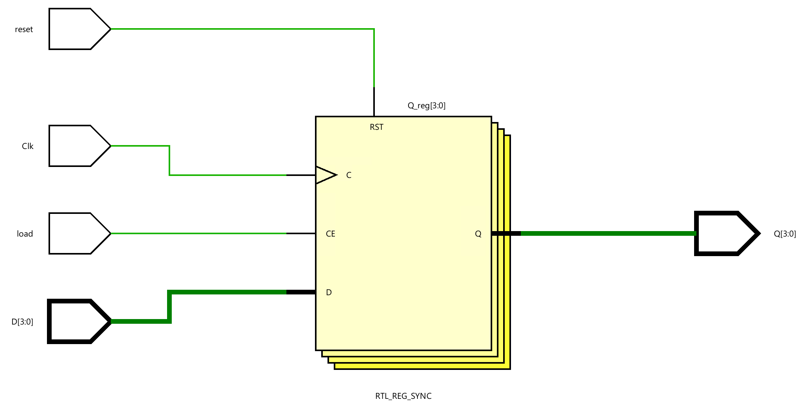</div>

* Develop a testbench to test (see waveform above), perform behavioral simulation for 100ns, and
validate the design. 

**tb.v**
```verilog
module tb();

reg clk;
reg [3:0] D;
reg reset;
reg load;
wire [3:0] Q;

Register_with_synch_reset_load_behavior test(
    .Clk(clk),
    .D(D),
    .reset(reset),
    .load(load),
    .Q(Q)
    );

initial begin
    clk <= 0;
    reset <= 0;
    load <= 0;
    D <= 4'd0;
    #10;
    D <= 4'b0101;
    #60;
    load <= 1;
    #40;
    D <= 4'b1001;
    load <= 0;
    #40;
    load <= 1;
    #30;
    load <= 0;
    #10;
    reset <= 1;
  
end

always #10 clk = ~clk;

endmodule

```

We can run Simulation to check the code by clicking the Run Simulation under the SIMULATION and choose the first Run Behavioral Simulation.

<div align=center>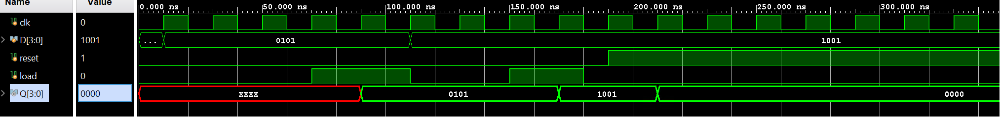</div>

### Part6-1-2

In some situations, it is necessary to set the register to a pre-defined value. For such a case, another
control signal, called set, is used. Typically, in such registers, reset will have a higher priority over set, and
set will have a higher priority over load control signal.

Model a 4-bit register with synchronous reset, set, and load signals.
Assign Clk, D input, reset, set, load, and output Q. Verify the design in
hardware. 


**lab6_1_2.v**
```verilog
module four_bit_register(
    input wire Clk,
    input wire [3:0] D,
    input wire reset,
    input wire set,
    input wire load,
    output reg [3:0] Q
);

// Synchronous reset, set, and load
always @(posedge Clk) begin
    if (reset) begin
        // Synchronous reset
        Q <= 4'b0000;
    end else if (set) begin
        // Synchronous set
        Q <= 4'b1111;
    end else if (load) begin
        // Load data into the register
        Q <= D;
    end
    // No 'else' statement needed, as we don't want to change the state in any other case
end

endmodule

```

* view the schematic of the synthesized design

<div align=center>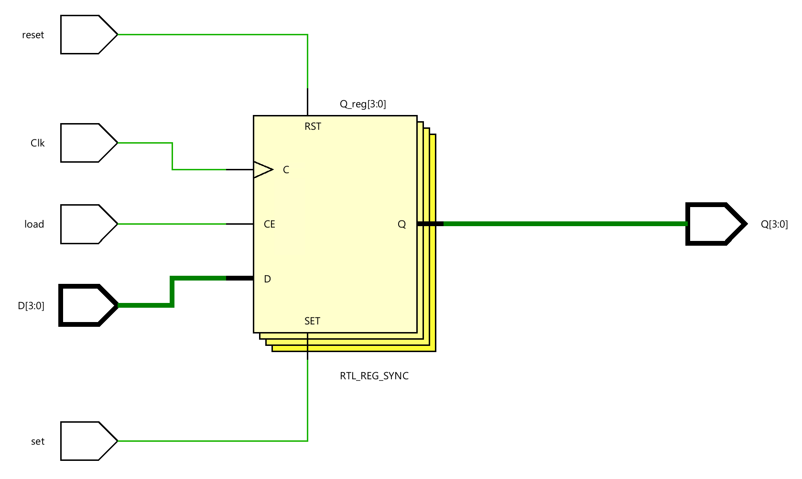</div>

* Develop a testbench to test (see waveform above), perform behavioral simulation for 100ns, and
validate the design. 

**tb.v**
```verilog

module tb_four_bit_register;

// Testbench signals
reg tb_Clk;
reg [3:0] tb_D;
reg tb_reset;
reg tb_set;
reg tb_load;
wire [3:0] tb_Q;

// Instantiate the 4-bit register
four_bit_register uut(
    .Clk(tb_Clk),
    .D(tb_D),
    .reset(tb_reset),
    .set(tb_set),
    .load(tb_load),
    .Q(tb_Q)
);

// Generate the clock signal
initial begin
    tb_Clk = 0;
    forever #10 tb_Clk = ~tb_Clk; // Toggle the clock every 10 time units
end

// Test sequence
initial begin
    // Initialize Inputs
    tb_D = 4'b1010;
    tb_reset = 0;
    tb_set = 0;
    tb_load = 0;

    // Apply test vectors
    #15; tb_reset = 1; // Reset the register
    #20; tb_reset = 0; tb_set = 1; // Set the register
    #20; tb_set = 0; tb_load = 1; // Load data into the register
    #20; tb_load = 0; // Hold the data
    #20; $finish; // End the simulation
end

// Monitoring changes
initial begin
    $monitor("Time=%t | Clk=%b, D=%b, Reset=%b, Set=%b, Load=%b | Q=%b",
             $time, tb_Clk, tb_D, tb_reset, tb_set, tb_load, tb_Q);
end

endmodule

```

We can run Simulation to check the code by clicking the Run Simulation under the SIMULATION and choose the first Run Behavioral Simulation.

<div align=center>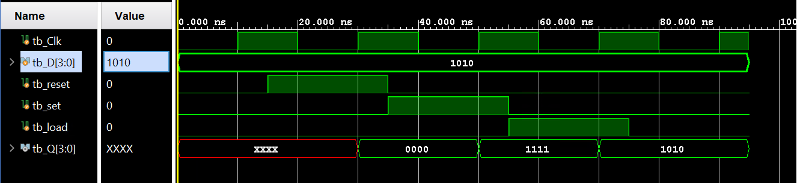</div>

### Part6-1-3

The above registers are categorized as parallel registers. There are another kind of registers called shift
registers. A shift register is a register in which binary data can be stored and then shifted left or right when
the control signal is asserted. Shift registers can further be sub-categorized into parallel load serial out,
serial load parallel out, or serial load serial out shift registers. They may or may not have reset signals. 

In Xilinx FPGA, LUT can be used as a serial shift register with one bit input and one bit output using one
LUT as SRL32 providing efficient design (instead of cascading up to 32 flip-flops) provided the code is
written properly. It may or may not have enable signal. When the enable signal is asserted, the internal
content gets shifted by one bit position and a new bit value is shifted in. Here is a model for a simple onebit serial shift in and shift out register without enable signal. It is modeled to shift for 32 clock cycles
before the shifted bit brought out. This model can be used to implement a delay line. 

```verilog
module simple_one_bit_serial_shift_register_behavior(input Clk, input
ShiftIn, output ShiftOut);
 reg [31:0] shift_reg;
 always @(posedge Clk)
    shift_reg <= {shift_reg[30:0], ShiftIn};

 assign ShiftOut = shift_reg[31];
endmodule 
```

The above model can be modified if we want to implement a delay line less than 32 clocks. Here is the
model for the delay line of 3 clocks. 

```verilog
module delay_line3_behavior(input Clk, input ShiftIn, output ShiftOut);
 reg [2:0] shift_reg;
 always @(posedge Clk)
 shift_reg <= {shift_reg[1:0], ShiftIn};
 assign ShiftOut = shift_reg[2];
endmodule 
```

Model a 1-bit delay line shift register using the above code. Develop a
testbench and simulate the design using the stimuli provided below.
Assign Clk, ShiftIn, and output ShiftOut. Verify the design in hardware. 


**lab6_1_3.v**
```verilog
module delay_line3_behavior(input Clk, input ShiftIn, output ShiftOut);
 reg [2:0] shift_reg;
 always @(posedge Clk)
 shift_reg <= {shift_reg[1:0], ShiftIn};
 assign ShiftOut = shift_reg[2];
endmodule 

```

* view the schematic of the synthesized design

<div align=center>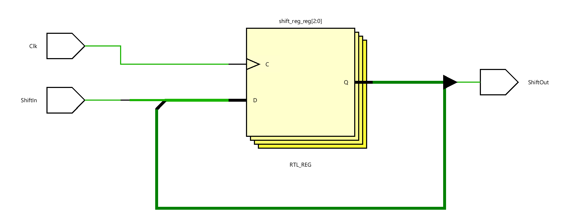</div>

* Develop a testbench to test (see waveform above), perform behavioral simulation for 100ns, and
validate the design. 

**tb.v**
```verilog
module tb();
// Testbench signals
reg tb_Clk;
reg ShiftIn;
wire  ShiftOut;

// Instantiate the 4-bit register
delay_line3_behavior uut(
    .Clk(tb_Clk),
    .ShiftIn(ShiftIn),
    .ShiftOut(ShiftOut)
);

// Generate the clock signal
initial begin
    tb_Clk = 0;
    forever #10 tb_Clk = ~tb_Clk; // Toggle the clock every 10 time units
end

// Test sequence
initial begin
    // Initialize Inputs
    ShiftIn = 0;

    // Apply test vectors
    #10; ShiftIn = 1; // Reset the register
    #40; ShiftIn = 0;
    #20; ShiftIn = 1;
    #40; ShiftIn = 0; // Hold the data
    #50; $finish; // End the simulation
end


endmodule
```
We can run Simulation to check the code by clicking the Run Simulation under the SIMULATION and choose the first Run Behavioral Simulation.

<div align=center>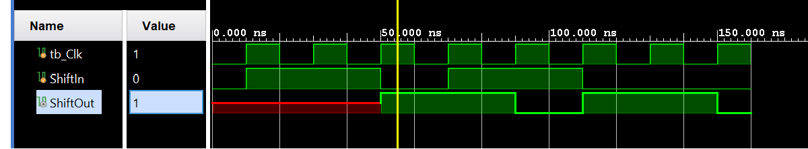</div>

### Part6-1-4
The following code models a four-bit parallel in shift left register with load and shift enable signal.
```verilog

module Parallel_in_serial_out_load_enable_behavior(input Clk, input ShiftIn,
input [3:0] ParallelIn, input load, input ShiftEn, output ShiftOut, output
[3:0] RegContent);
 reg [3:0] shift_reg;
always @(posedge Clk)
 if(load)
 shift_reg <= ParallelIn;
 else if (ShiftEn)
 shift_reg <= {shift_reg[2:0], ShiftIn};
 assign ShiftOut = shift_reg[3];
 assign RegContent = shift_reg;
endmodule 
```

Model a 4-bit parallel in left shift register using the above code. Develop a
testbench and simulate the design using the stimuli provided below. 

<div align=center>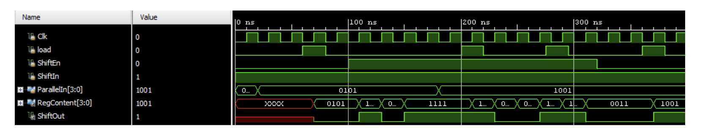</div>

**lab6_1_4.v**
```verilog
module Parallel_in_serial_out_load_enable_behavior(input Clk, input ShiftIn,
input [3:0] ParallelIn, input load, input ShiftEn, output ShiftOut, output
[3:0] RegContent);
 reg [3:0] shift_reg;
always @(posedge Clk)
 if(load)
 shift_reg <= ParallelIn;
 else if (ShiftEn)
 shift_reg <= {shift_reg[2:0], ShiftIn};
 assign ShiftOut = shift_reg[3];
 assign RegContent = shift_reg;
endmodule 
```

* view the schematic of the synthesized design

<div align=center>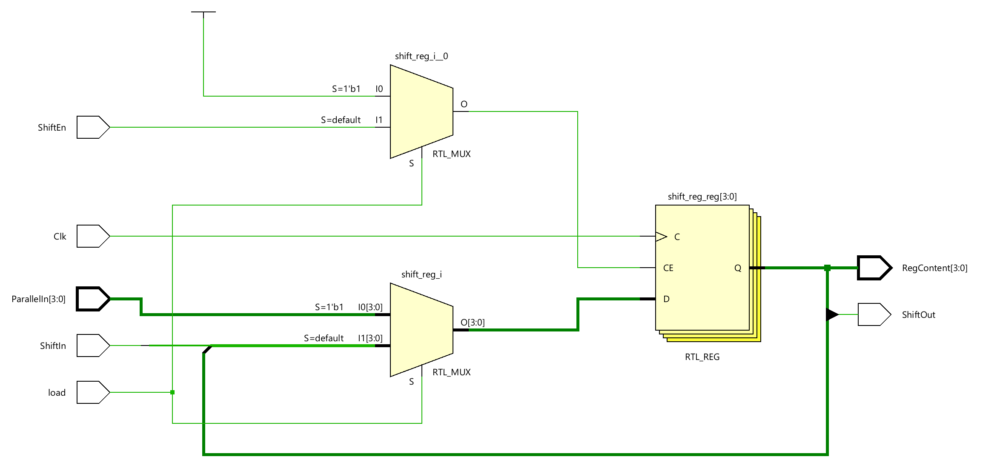</div>

* Develop a testbench to test (see waveform above), perform behavioral simulation for 100ns, and
validate the design. 

**tb.v**
```verilog
module tb;
// Testbench signals
reg tb_Clk;
reg ShiftIn;
reg load;
reg [3:0] ParallelIn;
reg ShiftEn;
wire  ShiftOut;
wire  [3:0] RegContent;
// Instantiate the 4-bit register
Parallel_in_serial_out_load_enable_behavior uut(
    .Clk(tb_Clk),
    .ShiftIn(ShiftIn),
    .ParallelIn(ParallelIn),
    .load(load),
    .ShiftEn(ShiftEn),
    .RegContent(RegContent),
    .ShiftOut(ShiftOut)
);

// Generate the clock signal
initial begin
    tb_Clk = 0;
    forever #10 tb_Clk = ~tb_Clk; // Toggle the clock every 10 time units
end

// Test sequence
initial begin
    // Initialize Inputs
    ShiftIn = 1;
    ParallelIn = 4'd0;
    load = 0;
    
    #20 ParallelIn = 4'b0101;
    // Apply test vectors
    #40; load = 1; // Reset the register
    #20; load = 0;
    #20; ShiftEn = 1;
  
    #80; ParallelIn = 4'b1001;
    #20; load =1;
    #20; load = 0;
    #50; $finish; // End the simulation
end


endmodule
```
We can run Simulation to check the code by clicking the Run Simulation under the SIMULATION and choose the first Run Behavioral Simulation.

<div align=center>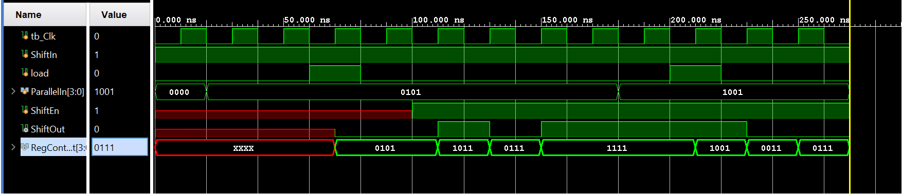</div>

### Part6_1_5
Write a model for a 4-bit serial in parallel out shift register. Develop a
testbench and simulate the design. Assign Clk, ShiftEn, ShiftIn, ParallelOut,
and ShiftOut. 

**lab6_1_5.v**
```verilog
module sipo_shift_register(
    input clk,
    input shiftEn,
    input shiftIn,
    output reg [3:0] parallelOut,
    output shiftOut
);
    
    // ShiftOut is the last bit of parallelOut
    assign shiftOut = parallelOut[0];
    
    always @(posedge clk) begin
        if (shiftEn) begin
            // Shift the register and insert the new bit
            parallelOut <= {shiftIn, parallelOut[3:1]};
        end
    end
endmodule

```

* view the schematic of the synthesized design

<div align=center>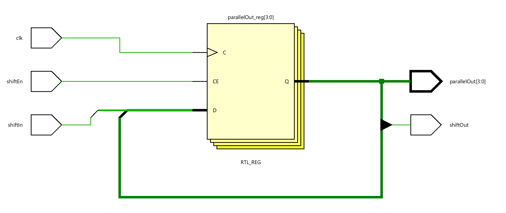</div>

* Develop a testbench to test (see waveform above), perform behavioral simulation for 100ns, and
validate the design. 

**tb.v**
```verilog
module tb;

// Testbench signals
reg tb_Clk;
reg shiftEn;
reg shiftIn;

wire shiftOut;
wire  [3:0] parallelOut;
// Instantiate the 4-bit register
sip_shift_register uut(
    .clk(tb_Clk),
    .shiftEn(shiftEn),
    .shiftIn(shiftIn),
    .parallelOut(parallelOut),
    .shiftOut(shiftOut)
);

// Generate the clock signal
initial begin
    tb_Clk = 0;
    forever #10 tb_Clk = ~tb_Clk; // Toggle the clock every 10 time units
end

// Test sequence
initial begin
    // Initialize Inputs
    shiftEn = 0;
    shiftIn = 1;
    
    #40; shiftEn = 1;
    #40; shiftEn = 0;
    #40; shiftEn = 1;
    #40; shiftEn = 0;
    #40; shiftEn =0;
    shiftIn = 0;
    #40;shiftEn = 1;
    #40; shiftEn = 0;
    #40; shiftEn = 1;
    #40; shiftEn = 0;
    #50; $finish; // End the simulation
end


endmodule

```
We can run Simulation to check the code by clicking the Run Simulation under the SIMULATION and choose the first Run Behavioral Simulation.

<div align=center>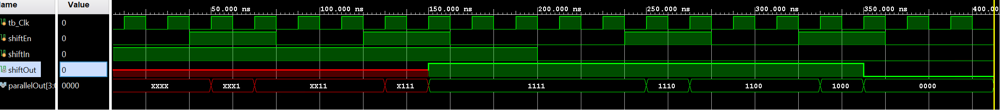</div>


## Counters
Counters can be asynchronous or synchronous. Asynchronous counters count the number of events
solely using an event signal. Synchronous counters, on the other hand, use a common clock signal so
that when several flip-flops must change state, the state changes occur simultaneously. 

A binary counter is a simple counter which counts values up when an enable signal is asserted and will
reset when the reset control signal is asserted. Of course, a clear signal will have a higher priority over 
the enable signal. The following diagram shows such a counter. Note that clear is an asynchronous
negative logic signal whereas Enable is synchronous positive logic signal. 

<div align=center>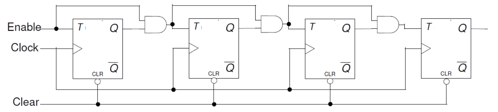</div>


### Part6-2-1

Design a 8-bit counter using T flip-flops, extending the above structure to
8-bits. Your design needs to be hierarchical, using a T flip-flop in
behavioral modeling, and rest either in dataflow or gate-level modeling.
Develop a testbench and validate the design. Assign Clock input, Clear_n,
Enable, and Q. Implement the design and verify the functionality in
hardware.


**lab6_2_1.v**
```verilog
module t_flip_flop(
    input clk,
    input T,
    input clrn,
    output reg Q
);
    always @(posedge clk or negedge  clrn) begin
        if (!clrn) Q <= 0;
        else if (T) Q <= ~Q;
    end
endmodule


module t_counter_8bit(
    input clk,
    input enable,
    input clrn,
    output [7:0] Q
);
    wire [7:0] T; // Toggle signal for each flip-flop

    // Generate toggle signals based on enable and previous Q outputs
    // Here, we assume a simple enable logic for demonstration
    assign T[0] = enable; // LSB toggles on every clock when enabled
    genvar i;
    generate
        for (i = 1; i < 8; i = i + 1) begin : gen_toggle
            assign T[i] = enable & Q[i-1:0]; // Next bit toggles when all lower bits are high
        end
    endgenerate

    // Instantiate 8 T flip-flops
    genvar j;
    generate
        for (j = 0; j < 8; j = j + 1) begin : gen_tff
            t_flip_flop tff(
                .clk(clk),
                .T(T[j]),
                .clrn(clrn),
                .Q(Q[j])
            );
        end
    endgenerate
endmodule
```

* view the schematic of the synthesized design

<div align=center>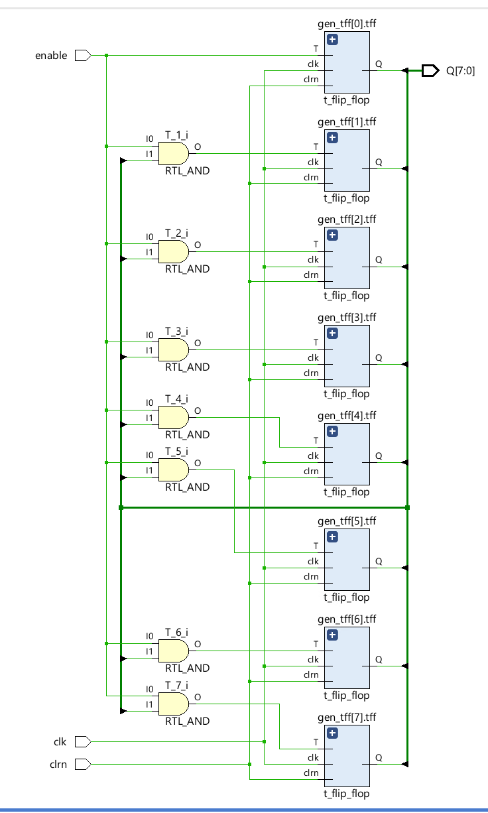</div>

* Develop a testbench to test (see waveform above), perform behavioral simulation for 100ns, and
validate the design. 

**tb.v**
```verilog
module tb_t_counter_8bit;
    reg clk = 0;
    reg enable = 1;
    reg clrn = 0;
    wire [7:0] Q;

    t_counter_8bit counter(
        .clk(clk),
        .enable(enable),
        .clrn(clrn),
        .Q(Q)
    );

    // Clock generation
    always #5 clk = ~clk;

    initial begin
        // Test clear functionality
        enable =0;
   
        #20
        enable =1;
        #20 clrn = 1;
        // Observe counting
        #60;

        // Test pause functionality
        enable = 0;
        #50;

        // Resume counting
        enable = 1;
        #100;

        $finish;
    end

endmodule

```
We can run Simulation to check the code by clicking the Run Simulation under the SIMULATION and choose the first Run Behavioral Simulation.

<div align=center>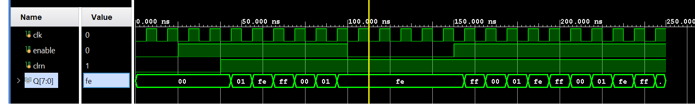</div>

### Part6-2-2
Counters can also be implemented using D flip-flops since a T flip-flop can be constructed using a
D flip-flop as shown below。

<div align=center>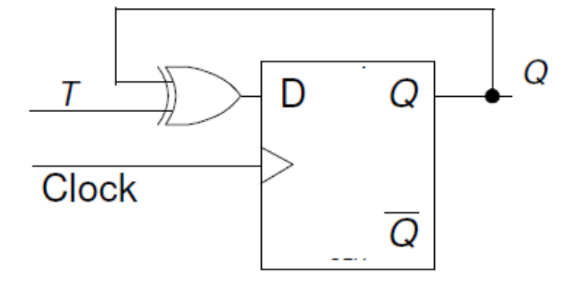</div>

Modify the 8-bit counter using D flip-flops. The design should be
hierarchical, defining D flip-flop in behavioral modeling, creating T flip-flop
from the D flip-flop, implementing additional functionality using dataflow
modeling. Assign Clock input, Clear_n, Enable, and Q. Implement the
design and verify the functionality in hardware.

**lab6_2_2.v**
```verilog
//D Flip-Flop Module (Behavioral Modeling)
module d_flip_flop(
    input clk,
    input D,
    input clr,
    output reg Q
);
    always @(posedge clk or posedge clr) begin
        if (clr) Q <= 0;
        else Q <= D;
    end
endmodule

//T Flip-Flop Using D Flip-Flop

module t_flip_flop_from_d(
    input clk,
    input T,
    input clr,
    output Q
);
    wire D;

    assign D = Q ^ T; // Toggling logic

    d_flip_flop dff(
        .clk(clk),
        .D(D),
        .clr(clr),
        .Q(Q)
    );
endmodule

//8-bit Counter Using T Flip-Flops Created from D Flip-Flops

module counter_8bit_from_t(
    input clk,
    input enable,
    input clr,
    output [7:0] Q
);
    wire [7:0] T; // Generate toggle signals

    assign T[0] = enable; // LSB toggles when enabled
    genvar i;
    generate
        for (i = 1; i < 8; i = i + 1) begin : gen_T_signals
            assign T[i] = enable & &Q[i-1:0]; // Conditional toggle logic for hierarchical counter
        end
    endgenerate

    // Instantiate T flip-flops
    genvar j;
    generate
        for (j = 0; j < 8; j = j + 1) begin : gen_tff
            t_flip_flop_from_d tff(
                .clk(clk),
                .T(T[j]),
                .clr(clr),
                .Q(Q[j])
            );
        end
    endgenerate
endmodule


```

* view the schematic of the synthesized design

<div align=center></div>


### Part6-2-3

Other types of binary counters include (i) up, (ii) down, and (iii) up-down. Each one of them may have
count enable and reset as control signals. There may be situation where you may want to start the count
up/down from some non-zero value and stop when some other desired value is reached. Here is an
example of a 4-bit counter which starts with a value 10 and counts down to 0. When the count value 0 is
reached, it will re-initialize the count to 10. At any time, if the enable signal is negated, the counter
pauses counting until the signal is asserted back. It assumes that load signal is asserted to load the predefined value before counting has begun. 

```verilog
reg [3:0] count;
 wire cnt_done;
 assign cnt_done = ~| count;
 assign Q = count;
 always @(posedge Clock)
 if (Clear)
 count <= 0;
 else if (Enable)
 if (Load | cnt_done)
 count <= 4'b1010; // decimal 10
 else
 count <= count - 1; 

```

Model a 4-bit down-counter with synchronous load, enable, and clear as
given in the code above. Develop a testbench (similar to the waveform
shown below) and verify the design works. Assign Clock input, Clear,
Enable, Load, and Q. Implement the design and verify the functionality in
hardware. 

<div align=center>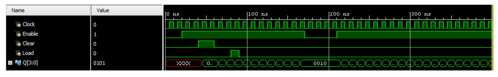</div>

**lab6_2_3.v**
```verilog
// Define a 4-bit down-counter module with Clock, Enable, Clear, and Load signals
module down_counter_4_bit (
    input clk, // Clock input for synchronous operation
    input enable, // Enable signal to allow the counter to count
    input clear, // Clear signal to reset the counter to 0
    input load, // Load signal to preload the counter with a specific value (in this case, decimal 10)
    output [3:0] Q // 4-bit output to represent the current count value
);
    reg [3:0] count; // Internal 4-bit register to hold the current count
    wire cnt_done; // Signal to indicate when the counter has reached 0

    // Determine if the counter has reached 0 using a NOR reduction operator
    // This will be true when all bits of 'count' are 0
    assign cnt_done = ~| count;

    // Output the current value of the count register
    assign Q = count;

    // Synchronous logic block, sensitive to the positive edge of the clock
    always @(posedge clk) begin
        if (clear) begin
            count <= 0; // If clear is asserted, reset count to 0
        end else if (enable) begin // Proceed if the counter is enabled
            if (load | cnt_done) begin
                count <= 4'b1010; // If load is asserted or count has reached 0, preload count with 10 (4'b1010)
            end else begin
                count <= count - 1; // If not loading and not done, decrement the count by 1
            end
        end
    end
endmodule

```

* view the schematic of the synthesized design

<div align=center>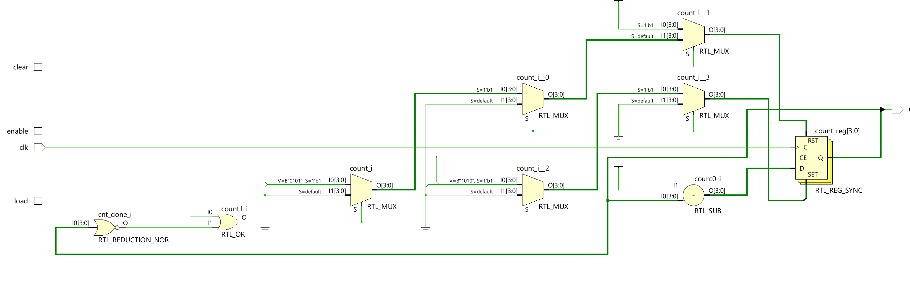</div>

* Develop a testbench to test (see waveform above), perform behavioral simulation for 100ns, and
validate the design. 

**tb.v**
```verilog
module tb_t_counter_4bit;
    reg clk;
    reg enable;
    reg clear;
    reg load ;
    wire [3:0] Q;

    down_counter_4_bit counter(
        .clk(clk),
        .enable(enable),
        .clear(clear),
        .load(load),
        .Q(Q)
    );

    // Clock generation
    always #5 clk = ~clk;

    initial begin
        // Test clear functionality
        clk = 0;
        enable =0;
        clear = 0;
        load = 0;
        #20
        enable =1;
        
        #20 clear = 1;
        #20 clear =0;
        // Observe counting
        #20 load = 1;

        #10 load =0;

        #50;

        // Resume counting
        enable = 0;
        
        #40 enable = 1;
        #100;

        $finish;
    end

endmodule
```
We can run Simulation to check the code by clicking the Run Simulation under the SIMULATION and choose the first Run Behavioral Simulation.

<div align=center>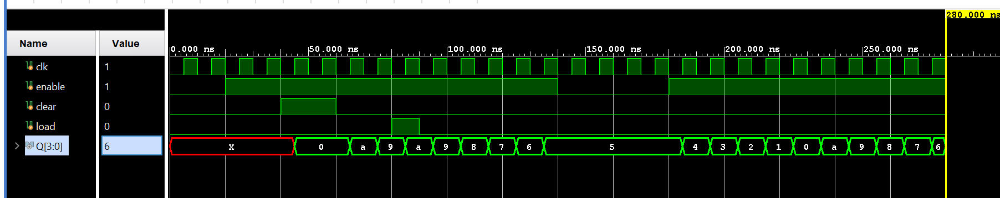</div>
