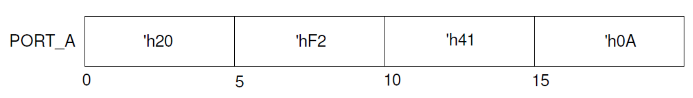
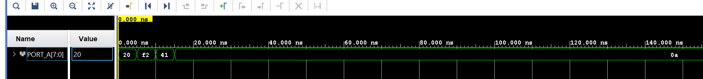
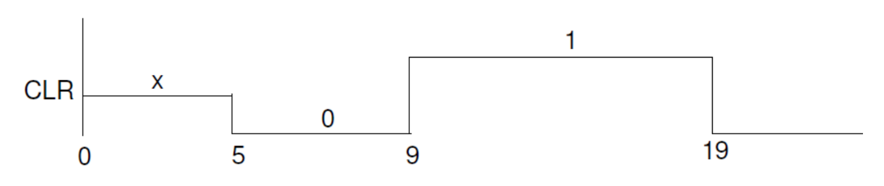
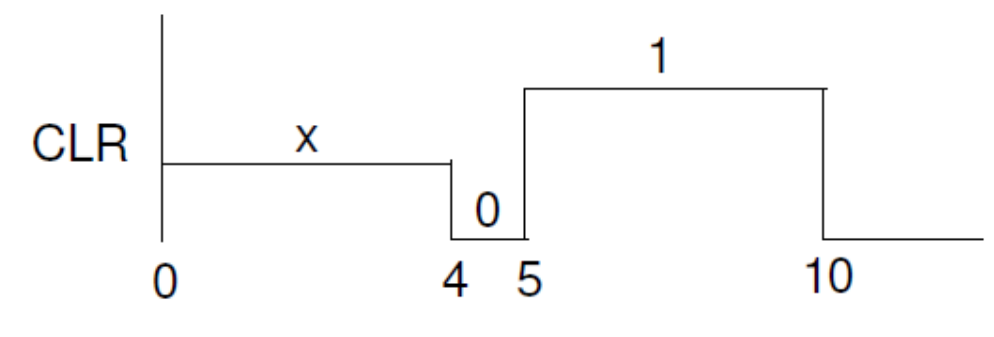
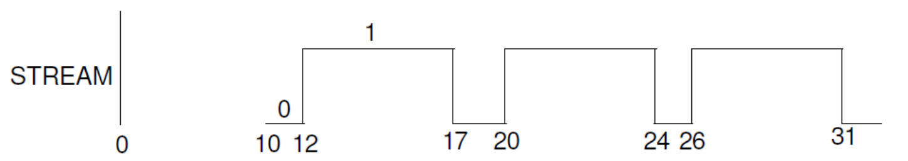
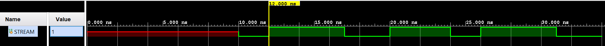
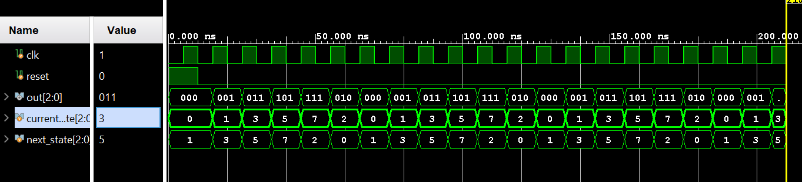
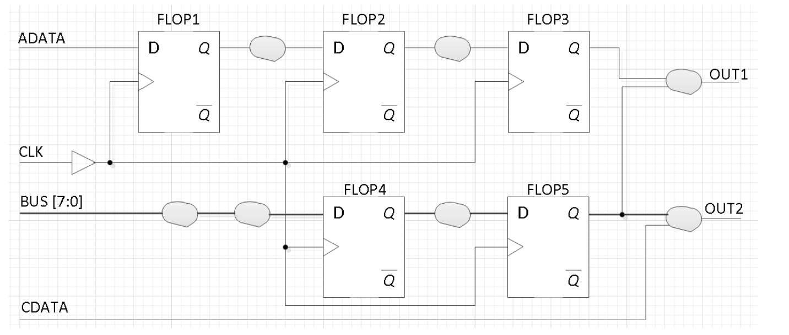

# Lab7_Behavioral Modeling and Timing Constraints   

## Introduction

Behavioral modeling was introduced in Lab 1 as one of three widely used modeling styles. Additional
capabilities with respect to testbenches were further introduced in Lab 4. However, there more constructs
available in this modeling style which are particularly useful for complex sequential digital circuits design.
Sequential circuits require clocking, and with clocking there is always a frequency or speed involved at
which the circuit can be run. The expected speed can be communicated to the tools through specific
timing constraints via the XDC file. In this lab you will learn more language constructs and timing
constraints concepts.

## Behavioral Modeling 
As mentioned in previous labs, the primary mechanisms through which the behavior of a design can be
modeled are: ```initial``` and ```always``` statements. .The ```initial``` statement is mainly used in testbenches
to generate inputs at a desired time, whereas the ```always``` statement is mainly used to describe the
functionality of the circuit. Both the ```initial``` and ```always``` statements may have simple or block of
(having enclosed between begin … end) procedural statement(s). 

A procedural statement is one of

* procedural_assignment (blocking or non-blocking)

* conditional_statement

* case_statement

* loop_statement

* wait_statement

* event_trigger

* sequential_block

* task (user or system) 

When multiple procedural statements are enclosed between begin … end, they execute sequentially.
Since an ```always``` statement executes continuously, they are typically controlled using either delay control
or event control mechanisms. Here is an example of a delay controlled procedural statement: 

```verilog
always
 #5 CLK = ~CLK;
```

In the above example, the statement will execute after every 5 units of time specified in the Verilog code,
inverting the signal value every time it executes, thus generating a clock of 10 units period. The``` #5 CLK= ~CLK``` statement is considered a delay control, meaning the time delay between the statement encountered and actually executed is 5 time units. When the delay appears on the left side (as in above case), it is also considered as an inter-statement delay where the statement is blocked for that much time then gets evaluated and the result is assigned to the target. Below is the example that illustrates the effect of the inter-statement delay: 

```verilog
initial
begin
 #5 SIG1 = 3;
 #4 SIG1 = 7;
 #2 SIG1 = 4;
end  
```
The SIG1 signal will get the value of 3 at 5, value of 7 at 9, and value of 4 at 11 time units. 

```verilog
wire test;
always @(test)
begin
 #5 CLK = ~CLK;
end 
```
The above ```always``` statement will execute only when there is a change in value (an event) on a wire test.
The change in value can be 0 -> 1, 1 -> 0, 0 -> x, x->1, x -> 0, 1 -> z, z -> 0, 0 -> z, z -> 1 or 1->x. When
the event occurs, the logical value of CLK will be flipped after 5 time units. 

```verilog
wire test;
always @(posedge test)
begin
 #5 CLK = ~CLK;
end
```

The above ```always``` statement will execute only when there is a rising edge change (0 -> 1, 0 -> x, 0 -> z,
z->1, x->1) in value on a wire test. When the event occurs, the logical value of CLK will be flipped after 5
time units. Such events are called edge-triggered events. In contrast to edge-triggered events, there can
be another type of event called a level-sensitive event control. 

```verilog
wait (SUM > 22)
 SUM = 0;
wait (DATA_READY)
 DATA = BUS; 
```
In the above examples, SUM is assigned 0 only when SUM is greater than 22, and DATA is assigned
whatever the value is on BUS when DATA_READY is asserted. 

Until now, we have been dealing with the inter-statement delay which helps to model an inertial delay in
the behavior of the code. There is another kind of delay, called an intra-statement, which is used to
model the transport delay using the assignment statement. Here is an example of it: 

```verilog
DONE = #5 1’b1: 
```

In this statement, the intra-statement delay value is mentioned on the right side of the assignment
operator. The right hand side expression is evaluated when encountered, but the result of the expression
is only assigned after the stated delay. 

### Part7-1-1
Write a testbench using inter-statement delays to produce the following
waveform for the port named PORT_A.

<div align=center></div>

**lab7_1_1.v**
```verilog
module tb_port_a;

    // Port A is an 8-bit register for this example
    reg [7:0] PORT_A;

    initial begin
        // Initial block to simulate waveform for PORT_A
        PORT_A = 8'h20; // At time = 0ns, PORT_A = 'h20
        #5 PORT_A = 8'hF2; // At time = 5ns, PORT_A = 'hF2
        #5 PORT_A = 8'h41; // At time = 10ns, PORT_A = 'h41
        #5 PORT_A = 8'h0A; // At time = 15ns, PORT_A = 'h0A
        #5; // Wait for 5 ns to observe the last value in the simulation
    end

    // Monitor changes to PORT_A and display time and value
    initial begin
        $monitor("Time: %0t ns, PORT_A: %h", $time, PORT_A);
    end

endmodule
```

We can run Simulation to check the code by clicking the Run Simulation under the SIMULATION and choose the first Run Behavioral Simulation.

<div align=center></div>


### Part7-1-2
The “=” assignment operator in procedural assignment statements are used as a blocking procedural
assignment. As the name indicates, the subsequent statement is blocked until the current assignment is
done. Here is an example that explains the concept: 

```verilog

always @(A or B or CIN)
begin
 reg T1, T2, T3;
 T1 = A & B; 
 T2 = B & CIN;
 T3 = A & CIN;
end 

```
<div align=center></div>

Another kind of assignment operator, where the assignment operator “<=” used is called non-blocking.
The statement that uses the non-blocking operator does not block the execution; however the assignment
is scheduled to occur in the future. When the non-blocking assignment is executed, the right-hand side
expression is evaluated at that time and its value is scheduled to be assigned to the left-hand side target
and the execution continues with the next statement. The non-blocking statements are widely used for
content transfer across multiple registers (often in parallel) when a desired clock event occurs

```verilog
always @(posedge CLK)
begin
 T1 <= #5 A & B;
 T2 <= #8 B & CIN;
 T3 <= #2 A & CIN;
end

```
In this example, when the positive edge event on the CLK occurs, A, B, and CIN values are noted
(captured), and then T1 gets an updated value after a 5 time units delay, T2 gets updated after a 8 time
units delay, and T3 gets updated after a 2 time units delay all after the same rising edge of the CLK
signal. Here is another example that generates the output shown in the waveform diagram. 

```verilog
initial
begin
 CLR <= #5 1;
 CLR <= #4 0;
 CLR <= #10 0;
end 

```

<div align=center></div>

Write a testbench using intra-statement delays to produce the following
waveform.

<div align=center></div>

**lab7_1_2.v**
```verilog
module stream_waveform_tb;

// Signal declaration
reg STREAM;

// Testbench initial block
initial begin
    // Initial signal value

    STREAM = #10 0;
    // First toggle
    STREAM = #2 1;
    // First toggle back to 0
    STREAM =#5 0;
    // Second toggle to 1
    STREAM =#3 1;
    // Second toggle back to 0
    STREAM =#4 0;
    // Third toggle to 1
    STREAM =#2 1;
    // Third toggle back to 0
    STREAM =#5 0;
    STREAM =#3 1;
    // End of simulation
    $finish;
end

endmodule


```

We can run Simulation to check the code by clicking the Run Simulation under the SIMULATION and choose the first Run Behavioral Simulation.

<div align=center></div>

### Part7-1-3

So far we have seen constructs which allow generation of stimulus unconditionally. However, many times
we like to have different stimulus generation upon certain conditions. Verilog HDL provides control
altering statements such as **if**, **if … else**, and **if … else** if. The general syntax of an **if**
statement is:

```verilog
if (condition-1)
 procedural_statement
[ else if (condition-2)
 procedural_statement ]
[ else
 procedural_statement ]
```
If the procedural_statement above consists of more than one statement then they are enclosed between
a ```begin…end``` block. 

It is possible to have nested **if** statements. In such case, the **else** part is associated to the closest **if**
part. For example, below, the else part is associated to the **if** (RESET) condition, 

```verilog
if (CLK)
 if (RESET)
 Q <= 0;
 else
 Q <= D;
```

The ```if``` statement is commonly used to create a priority structure, giving higher priority to the condition
listed first. 

Write a behavioral model to design a 1-bit 4-to-1 mux using the if-else-if
statement. Develop a testbench to verify the design.

**lab7_1_3.v**
```verilog
module mux4to1 (
    input wire [3:0] in,  // 4 1-bit inputs
    input wire [1:0] sel, // 2-bit select input
    output reg out       // 1-bit output
);

    // Behavioral modeling using if-else-if
    always @ (in or sel) begin
        if (sel == 2'b00) begin
            out = in[0]; // Select input 0
        end
        else if (sel == 2'b01) begin
            out = in[1]; // Select input 1
        end
        else if (sel == 2'b10) begin
            out = in[2]; // Select input 2
        end
        else if (sel == 2'b11) begin
            out = in[3]; // Select input 3
        end
    end
endmodule


```

**tb.v**
```verilog
module tb_mux4to1;
    // Testbench signals
    reg [3:0] in;
    reg [1:0] sel;
    wire out;

    // Instantiate the 4-to-1 Mux
    mux4to1 uut (
        .in(in),
        .sel(sel),
        .out(out)
    );

    // Test sequences
    initial begin
        // Test Case 1
        in = 4'b1010; sel = 2'b00; #10;
        // Test Case 2
        in = 4'b1010; sel = 2'b01; #10;
        // Test Case 3
        in = 4'b1010; sel = 2'b10; #10;
        // Test Case 4
        in = 4'b1010; sel = 2'b11; #10;
        
        // Complete the simulation
        $finish;
    end

    // Monitor changes
    initial begin
        $monitor("Time=%t | in=%b, sel=%b, out=%b", $time, in, sel, out);
    end
endmodule

```
We can run Simulation to check the code by clicking the Run Simulation under the SIMULATION and choose the first Run Behavioral Simulation.

<div align=center></div>


### Part7-1-4
Another widely used statement is a ```case``` statement. The ```case``` statement is generally used when we
want to create a parallel structure (unlike priority). The ```case``` statements are commonly used in creating
the finite state machine. The syntax of the ```case``` statement is: 
```verilog
case [ case_expression]
 case_item_expr [, case_item_expression] : procedural_statement
 …
 …
 [ default: procedural_statement ]
endcase 
```

The case_expression is evaluated first (whenever there is an event on it), and the value is matched with
the case_item_expr in the order they are listed. When the match occurs, the corresponding
procedural_statement is executed. The procedural_statement, if it consists of multiple statements, is
enclosed in a begin … end block. The ```default``` case covers all values that are not covered by any of the
case_item_expr. In the case_expression, the x and z (if present) is compared literally in case_item_expr.
That is they are not considered don’t case. If you want to consider them as don’t care than you can use
casex or casez statement instead of case. In the **casez** statement, the value **z** that appears in the
case_expression and case_item_expr is considered as don’t care. In the **casex** statement, both the
values x and z are considered as don’t care 

Design a gray code generator using the case statement. 

**lab7_1_4.v**
```verilog
module gray_code_generator (
    input wire [3:0] binary, // 4-bit binary input
    output reg [3:0] gray    // 4-bit Gray code output
);

    // Convert binary to Gray code using a case statement
    always @(binary) begin
        case (binary)
            4'b0000: gray = 4'b0000;
            4'b0001: gray = 4'b0001;
            4'b0010: gray = 4'b0011;
            4'b0011: gray = 4'b0010;
            4'b0100: gray = 4'b0110;
            4'b0101: gray = 4'b0111;
            4'b0110: gray = 4'b0101;
            4'b0111: gray = 4'b0100;
            4'b1000: gray = 4'b1100;
            4'b1001: gray = 4'b1101;
            4'b1010: gray = 4'b1111;
            4'b1011: gray = 4'b1110;
            4'b1100: gray = 4'b1010;
            4'b1101: gray = 4'b1011;
            4'b1110: gray = 4'b1001;
            4'b1111: gray = 4'b1000;
            default: gray = 4'b0000; // Default case
        endcase
    end
endmodule

```

### Part7-1-5
Verilog HDL also supports various loop statements to do the same function a number of times. The
supported loop statements are: 

```
forever loop
repeat loop
while loop
for loop 
```

The ```forever``` loop statement is used when the procedural statement(s) need to be executed
continuously. Some kind of timing control must be used within the procedural statement if a periodic
output is desired. For example, to generate a clock of 20 units period, the following code can be used. 

```verilog
initial
begin
 CLK = 0;
 forever
 #10 CLK = ~CLK;
 end 

```

The ```repeat``` loop statement is used when the procedural statement(s) need to be executed for a
specified number of times. Note: if the loop count expression is an x or a z, then the loop count is treated
as a 0.

```verilog
repeat (COUNT)
 SUM = SUM +5;

```

The ```while``` loop statement’s procedural statement(s) are executed until certain conditions become false. 


```verilog

while (COUNT < COUNT_LIMIT)
 SUM = SUM +5; 

```
The ```for``` loop statement is used when the procedural statement(s) need to be executed for a specified
number of times. Unlike the ```repeat``` statement, an index variable is used which can be initialized to any
desired value, it can be further updated by whatever value is required, and a condition can be given to
terminate the loop statement. The loop index variable is normally defined as an integer type. Here is an
example of the loop statement. 

```verilog
integer K;
for (K=0; K < COUNT_LIMIT; K = K+1)
 SUM = SUM + K; 
```

Write a model of a counter which counts in the sequence mentioned below.
The counter should use behavioral modeling and a case statement.
Develop a testbench to test it. The testbench should display the counter
output in the simulator console output. Simulate using the clock period of
10 units for 200 ns. 000, 001, 011, 101, 111, 010, (repeat 000).

```verilog
set_property CLOCK_DEDICATED_ROUTE FALSE [get_nets { clk }]; 
```
**lab7_1_5.v**
```verilog
module sequence_counter(
    input clk,
    input reset,
    output reg [2:0] out
);

  localparam   S0    = 3'b000,    // State definitions for readability.
               S1    = 3'b001,
               S2    = 3'b011,
               S3    = 3'b101,
               S4    = 3'b111,
               S5    = 3'b010;
    // Current and next state variables
    reg [2:0]  current_state, next_state;

    // State transition logic
    always @(posedge clk or posedge reset) begin
        if (reset) current_state <= S0;
        else current_state <= next_state;
    end

    // Next state logic based on the case statement
    always @(*) begin
        case (current_state)
            S0: next_state = S1;
            S1: next_state = S2;
            S2: next_state = S3;
            S3: next_state = S4;
            S4: next_state = S5;
            S5: next_state = S0;
            default: next_state = S0;
        endcase
    end

    // Output logic
    always @(current_state) begin
        out = current_state;
    end
endmodule

```

**tb.v**
```verilog
module tb_sequence_counter;

    // Testbench signals
    reg clk = 0;
    reg reset = 1;
    wire [2:0] out;

    // Instantiate the counter
    sequence_counter uut (
        .clk(clk),
        .reset(reset),
        .out(out)
    );

    // Clock generation
    always #5 clk = ~clk; // 10 units clock period

    // Test sequence
    initial begin
        // Initialize
        $display("Time\tOutput");
        $monitor("%g\t%b", $time, out);

        // Reset
        #10 reset = 0; // Release reset after 10 ns
        #200 $finish; // Simulate for 200 ns
    end
endmodule


```

We can run Simulation to check the code by clicking the Run Simulation under the SIMULATION and choose the first Run Behavioral Simulation.

<div align=center></div>


## Timing Constraints 
In combinatorial logic design, delays through the circuits will depend on the number of logic levels, the
fan-out (number of gate inputs a net drives) on each net, and the capacitive loading on the output nets.
When such circuits are placed between flip-flops or registers, they affect the clock speeds at which
sequential designs can be operated. The synthesis and implementation tools will pack the design in LUT,
flip-flops, and registers, as well as place them appropriately if the expected performance is communicated
to them via timing constraints. Timing constraints can be categorized into global timing or path specific
constraints. The path specific constraints have higher priority over global timing constraints, and the
components which are used in those specific paths are placed and routed first.

The global timing constraints cover most of the design with very few lines of instructions. In any pure
combinatorial design, the path-to-path constraint is used to describe the delay the circuit can tolerate. In
sequential circuits, period, input delay, and output delay constraints are used. All four kinds of the timing
constraints are shown in the figure below. 

<div align=center></div>

In the above figure, the paths which are covered between ADATA input and D port of FLOP1, BUS input
and D port of FLOP4 can be constrained by a constraint called SET_INPUT_DELAY command. The
set_input_delay command indicates how much time is spent between the Q output of a FF in the
upstream device, the routing delay in the upstream device as well as the board delay. The tools will
subtract that delay from the clock period of the clock signal listed in the command and will use the
resulting delay to place and route the path between the input and the D input of FF. It will also consider
delay experienced by the clock arriving to the clock port of the destination FF (e.g. FLOP1 in the above
diagram). The max and min qualifiers are used for the setup and hold checks. 


The paths between the port Q of FLOP3 and output OUT1, Q port of FLOP5 and OUT1, Q port of FLOP5
and OUT2 can be constrained by SET_OUTPUT_DELAY command. Again, the delay mentioned
indicates how much delay is spent in the board delay, routing delay and the setup delay of the FF in the
downstream device.

The paths between CDATA and OUT2 can be constrained by the SET_MAX_DELAY constraint. 

The paths between Q port of FLOP1 and D port of FLOP2, Q port of FLOP2 and D port of FLOP3, Q port
of FLOP4 and D port of FLOP5 can be constrained by the period constraint. The period constraint is
created using the create_clock command. The create_clock command may refer ot a pin of the FPGA
design or may not refer any pins. When the clock pin is not referred, a virtual clock will be created. When
the pin is referred, the period parameter indicates rising to rising edge delay and waveform option
indicates when the rising edge occurs and the second number indicates when the falling edge occurs.
The waveform option can be used to create clocks of non-50% duty cycle and/or phase delayed clock
signal. 

```verilog
create_clock –name CLK –period 10.0 –waveform (0 5.0) [get_ports CLK]
set_input_delay –clock CLK –max 3.0 [all_inputs]
set_input_delay –clock CLK –min 1.0 [all_inputs]
set_output_delay –clock CLK 2.0 [all_outputs]
set_max_delay 5.0 –from [get_ports CDATA] –to [get_ports OUT2] 
```

Note that the clock period is defined at 10 ns. This is applied throughout the example for consistency.
Further details on the syntax of each constraint type can be found in UG903, the Vivado Using
Constraints Guide. 

## Conclusion 

In this lab you learned about various constructs available in behavioral modeling. You also learned about
blocking and non-blocking operators as well as concepts and the need of timing constraints. Providing
the timing constraints to the implementation tools the generated output can be made to meet the design’s
timing specifications. 
