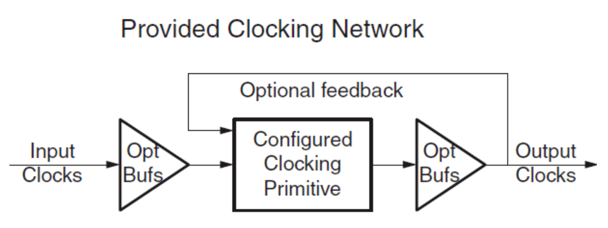
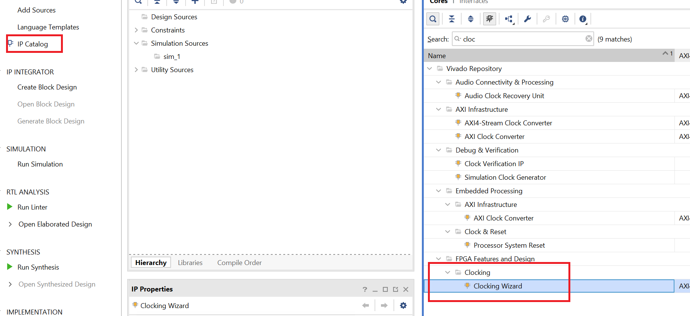
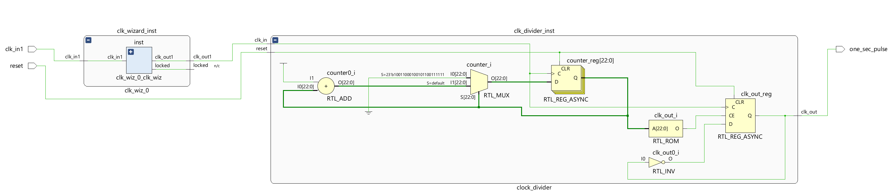
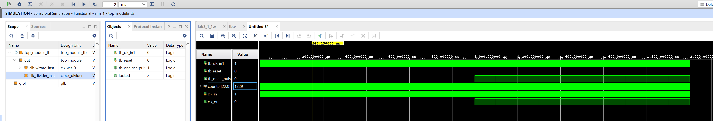
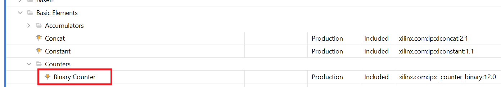
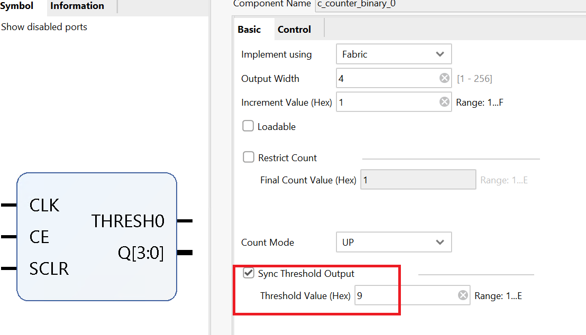
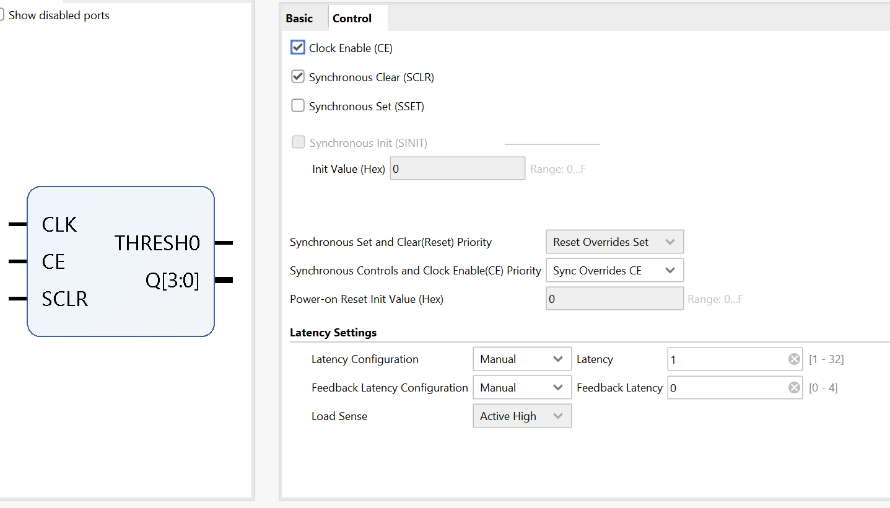
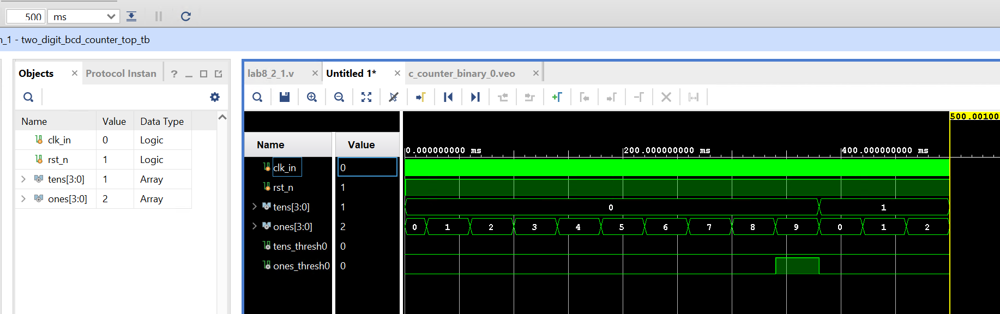

# Lab8_Architectural Wizard and IP Catalog    

## Introduction

Today’s Xilinx FPGAs contain many more resources than basic LUT, CLB, IOB, and routing. The FPGAs
are now being used to implement much more complex digital circuits compared to glue logic when they
were invented. Some complex architectural resources, such as clocking, must be configured and
instantiated instead of inferred. There are also commonly used complex circuits, such as the ReedSolomon decoder are provided by tools so that a designer does not have to “reinvent the wheel.” This lab
introduces the Architectural Wizard and the IP generator tools available through the IP Catalog


## Architectural Wizard 

Some specialized and advanced architectural resources can efficiently be utilized when configured and
instantiated properly instead of inferring them. Depending on the FPGA family being used, the number
and types of such resources vary. In the Artix-7 family, clocking, SelectIO, soft error mitigation, and
XADC resources are supported by the architectural wizard. These resources are accessed under the
FPGA Features and Design folder of the IP Catalog tool. 

The wizard makes it easy to create HDL source code wrappers for clock circuits customized to your
clocking requirements. The wizard guides you in setting the appropriate attributes for your clocking
primitive, and also allows you to override any wizard-calculated parameter. In addition to providing an
HDL wrapper for implementing the desired clocking circuit, the Clocking Wizard also delivers a timing
parameter summary generated by the Xilinx timing tools for the circuit. The main features of the wizard
include:

• Accepts up to two input clocks and up to seven output clocks per clock network

• Automatically chooses correct clocking primitive for a selected device

• Automatically configures clocking primitive based on user-selected clocking features

• Automatically implements overall configuration that supports phase shift and duty cycle
requirements

• Optionally buffers clock signals

The functionality of the generated core can be viewed as: 

<div align=center></div>

Suppose we want to generate a 5MHz clock which is in phase with 100 MHz input clock. Follow the steps
below to achieve that: 

Double-click on the Clocking Wizard entry. When the wizard opens, you will notice that there are five
tabs.

<div align=center></div>

The first tab, titled Clocking Options, has parameters related to input clock and clocking features, the
input frequency value and range. Since the actual clock source is 100 MHz, we will keep the value to
default.

The second tab, titled Output Clocks, has parameters which are related to the output clocks and desired
frequencies. Change the Requested Output Frequency to 1.000 MHz and notice that it shows the
frequency in red indicating something is wrong. Move the mouse over the same and you will see a popup indicating that the actual frequency range for this device is 4.687 MHz to 800 Mhz. Change it to 5.000
MHz for now. We will unclick the **RESET** from the output clock and create an asynchronous reset.

The third tab, titled MMCM Settings, shows the calculated settings. You can check the box and override
the values as long as you know what they will do and how they will affect the design. We like to see when
the clock is stable.

The fourth tab, titled Port Renaming, allows you to change the port names. We will use the default
names.

The fifth and last tab, titled Summary, shows you the summary.

Click **OK** and then click **Generate** to generate the files used for synthesis, implementation, and
simulation. 

The files, including the instantiation file, are accessible through the IP Sources tab. Here is an example
of the .veo file content. 

```verilog
  clk_wiz_0 instance_name
   (
    // Clock out ports
    .clk_out1(clk_out1),     // output clk_out1
    // Status and control signals
    .locked(locked),       // output locked
   // Clock in ports
    .clk_in1(clk_in1)      // input clk_in1
);
```

### Part8-1-1
Design a one-millisecond pulse generator. Use the clocking wizard to generate
5 MHz clock, dividing it further by a clock divider (written in behavioral
modeling) to generate one second period signal. The steps on using the
Clocking Wizard described above (and the resultant instantiation template)
can be used for this exercise.


**lan8_1_1.v**
```verilog
module top_module(
    input wire clk_in1, // Primary clock input (e.g., 100 MHz source clock)
    input wire reset,   // Global reset
    output wire one_sec_pulse // One-second pulse output
);

// Signals
wire clk_5MHz; // 5 MHz clock generated by the clock wizard
wire locked;   // Indicates when the clock wizard has locked to the input clock

// Instance of the clock wizard
clk_wiz_0 clk_wizard_inst(
    .clk_out1(clk_5MHz), // 5 MHz clock output
    .locked(locked),     // Lock status
    .clk_in1(clk_in1)    // Input clock (e.g., 100 MHz)
);

// Instance of the clock divider
clock_divider clk_divider_inst(
    .clk_in(clk_5MHz), // 5 MHz clock input from the clock wizard
    .reset(reset),     // Global reset
    .clk_out(one_sec_pulse) // Output clock with a one-second period
);

endmodule

module clock_divider(
    input clk_in,  // 5 MHz clock input
    input reset,   // Active high reset
    output reg clk_out = 0  // Output clock with a one-second period
);

// Counter variable
reg [22:0] counter = 0; // 23-bit counter to count up to 5,000,000

always @(posedge clk_in or posedge reset) begin
    if (reset) begin
        counter <= 0;
        clk_out <= 0;
    end
    else begin
        if(counter == 5_000 - 1) begin
            counter <= 0;
            clk_out <= ~clk_out; // Toggle the output clock every one second
        end
        else begin
            counter <= counter + 1;
        end
    end
end

endmodule

```
* view the schematic of the synthesized design

<div align=center></div>

* Develop a testbench to test (see waveform above), perform behavioral simulation for 100ns, and
validate the design. 

**tb.v**
```verilog
module top_module_tb();

// Testbench Signals
reg tb_clk_in1;
reg tb_reset;
wire tb_one_sec_pulse;
wire locked ;
// Initialize the clock
initial begin
    tb_clk_in1 = 1; // Initialize the clock to low
    forever #5 tb_clk_in1 = ~tb_clk_in1; // Toggle clock every 5ns (100MHz)
    
end


// Initialize the reset
initial begin
    tb_reset = 0; // Assert reset initially
    #10; // Hold reset for 100ns
    tb_reset = 0; // Deassert reset
   
end

// Instantiate the Unit Under Test (UUT)
top_module uut(
    .clk_in1(tb_clk_in1),
    .reset(tb_reset),
    .one_sec_pulse(tb_one_sec_pulse)
);


// Monitor changes and results
initial begin
    $monitor("Time=%t | Reset=%b | One Second Pulse=%b", $time, tb_reset, tb_one_sec_pulse);
end
endmodule

```

And we can run Simulation to check the code by clicking the Run Simulation under the SIMULATION and choose the first Run Behavioral Simulation. We need to change the simulation time to 2ms.

<div align=center></div>


## IP Catalog

The IP Catalog of the Vivado tool allows you to configure and generate various functional cores. In IP
Catalog, the cores are grouped according to functionality which varies from simple basic cores such as an
adder to quite complex cores such as the MicroBlaze processor. It also covers cores of various
application areas ranging from Automotive to Video and Image Processing.

The process of configuring and generating the cores is similar to the Architectural Wizard. The cores will
use various resources including LUT, CLB, DSP48, BRAM etc. as needed. Let us look at how to
configure and generate a counter core. 

The Binary Counter core generation can be started by double-clicking the Binary Counter entry under the
Counters sub-folder located under the Basic Elements branch of the IP catalog. 

<div align=center></div>

When invoked, you will see two tabs configuration. The configuration parameters of the core on the first
tab, titled Basic, include: 

* Implement Using: Fabric or DSP48

* Output Width

* Increment Value

* Loadable, Restrict Count, Count Mode (Up, Down, UPDPWN), Threshold

The second tab, titled Control, include
Synchronous Clear, Clock Enable and various other settings.

The designer can select the desired functionality and click on OK to generate the IP. 

### Part8-2-1

Use the IP Catalog to generate a simple 4-bit counter core which counts up
from 0 to 9. (Hint: Use Threshold output when configuring the counter core). 
Instantiate it two times to create a two digit BCD counter which counts up
every one second. Use Architectural Wizard to generate a 5 MHz clock and
then use behavioral modeling to generate 1000 Hz precise signal to drive the
counters.

<div align=center></div>

<div align=center></div>

**lab8_2_1.v**
```verilog
module two_digit_bcd_counter_top(
    input clk_in,         // 5 MHz input clock
    input rst_n,          // Active-low reset
    output [3:0] tens,    // BCD output for tens
    output [3:0] ones     // BCD output for ones
);
    wire clk_1Hz;    // 1 Hz clock from clock wizard
    wire locked;     // Locked output from clock wizard
    wire tens_thresh0; // Threshold signal for tens counter
    wire ones_thresh0; // Threshold signal for ones counter

    // Instantiate the clock wizard
    clock_divider_1hz clk_gen (
        .clk_1Hz(clk_1Hz),   // 1 Hz clock output
        .reset(locked),      // Lock status
        .clk(clk_in)      // 5 MHz clock input
    );
    reg enable_tens;
    // Instantiate the tens counter
    c_counter_binary_0 tens_counter (
      .CLK(clk_1Hz),  
      .CE(ones_thresh0), 
      .SCLR(0),           // input wire CLK
      .THRESH0(tens_thresh0),  // output wire THRESH0
      .Q(tens)              // output wire [3 : 0] Q
    );
    // Instantiate the ones counter
    c_counter_binary_0 ones_counter (
        .CLK(clk_1Hz),  
        .CE(1'b1), 
        .SCLR(ones_thresh0),             // Use the 1 Hz clock
        .THRESH0(ones_thresh0),   // Output threshold (reaches 9)
        .Q(ones)                  // BCD ones output
    );

endmodule

// Clock divider: 5 MHz to 1 Hz
module clock_divider_1hz(
    input clk,      // 5 MHz input clock
    input reset,         // Asynchronous reset
    output reg clk_1Hz = 0 // 1000Hz output clock, because 1 Hz is slowly
);

wire clk_5MHz; // 5 MHz clock generated by the clock wizard

clk_wiz_0 clk_wizard_inst(
    .clk_out1(clk_5MHz), // 5 MHz clock output
    .locked(locked),     // Lock status
    .clk_in1(clk)    // Input clock (e.g., 100 MHz)
    );


    reg [22:0] counter = 0; // 23-bit counter for 5,000 counts

    always @(posedge clk_5MHz or posedge reset) begin
        if (reset) begin
            counter <= 0;
            clk_1Hz <= 0;
        end else begin
            if (counter == 5_000 -1) begin // Adjust count based on your simulation step 5_000 -1
                counter <= 0;
                clk_1Hz <= ~clk_1Hz;
            end else begin
                counter <= counter + 1;
            end
        end
    end

endmodule


```

**tb.v**
```verilog

module two_digit_bcd_counter_top_tb;

    reg clk_in;         // 5 MHz input clock
    reg rst_n;          // Active-low reset
    wire [3:0] tens;    // BCD output for tens
    wire [3:0] ones;    // BCD output for ones

    // Instantiate the Unit Under Test (UUT)
    two_digit_bcd_counter_top uut (
        .clk_in(clk_in),
        .rst_n(rst_n),
        .tens(tens),
        .ones(ones)
    );

    // Clock generation
    initial begin
        clk_in = 0;
        forever #100 clk_in = ~clk_in; // 5 MHz clock
    end

    // Test scenario
    initial begin
        // Initialize Inputs
        rst_n = 0; // Reset the counter
        #200; // Hold reset for 200 ns
        rst_n = 1; // Release reset

    end

    // Monitoring changes
    initial begin
        $monitor("Time=%t, Tens=%d, Ones=%d", $time, tens, ones);
    end

endmodule
```

And we can run Simulation to check the code by clicking the Run Simulation under the SIMULATION and choose the first Run Behavioral Simulation. We need to change the simulation time to 500ms.

<div align=center></div>

## Conclusion 

In this lab, you learned about the architectural wizard and the IP Catalog of the Vivado tool. You used the
architectural wizard to generate a 5 MHz clock and the IP Catalog to generate a counter. The IP catalog
is a powerful tool providing various functional blocks enabling higher productivity. 
