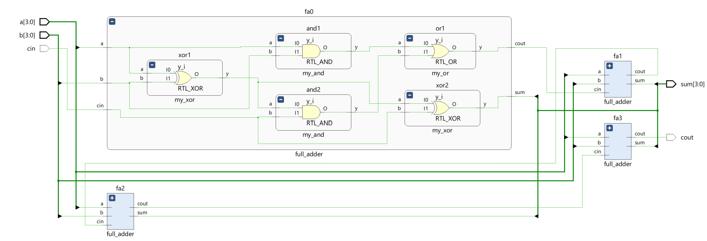
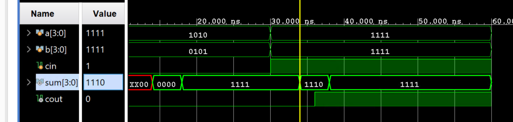
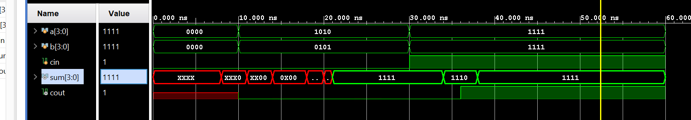
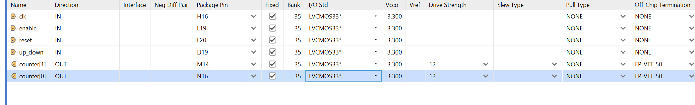
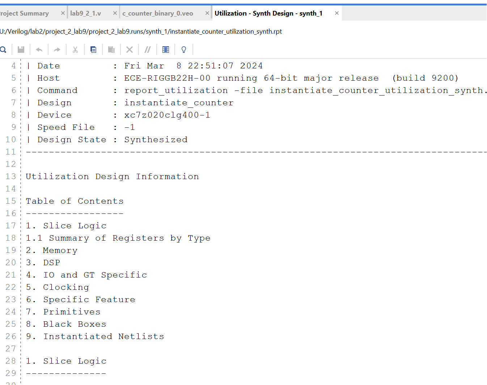
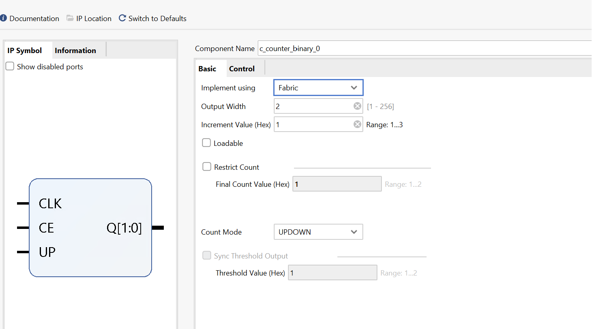
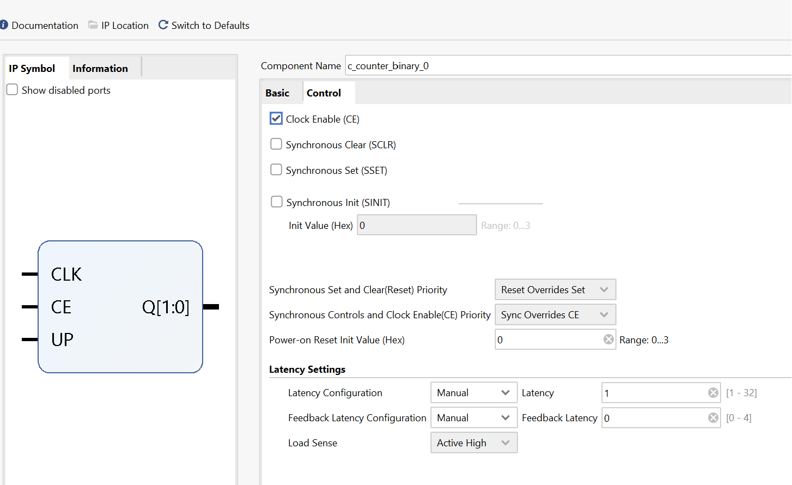
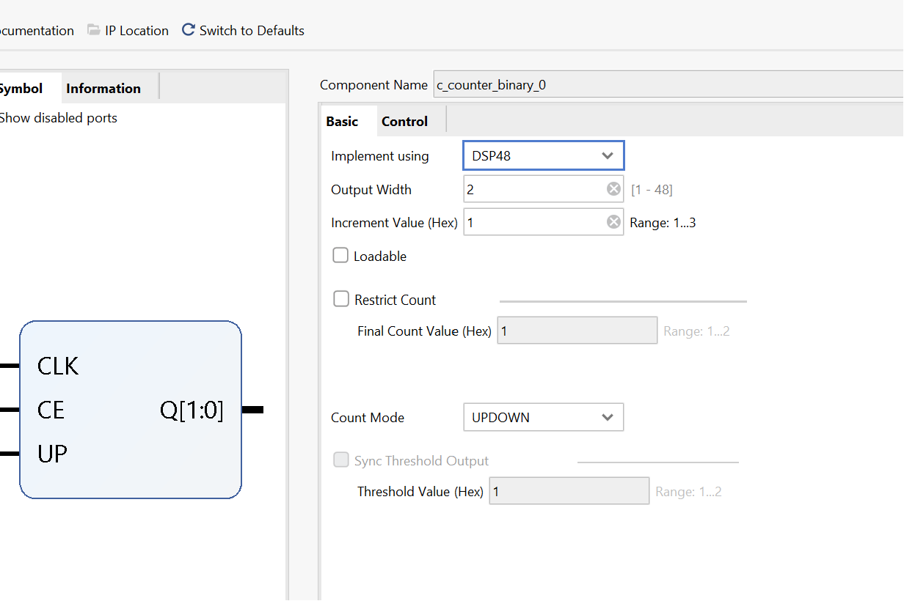
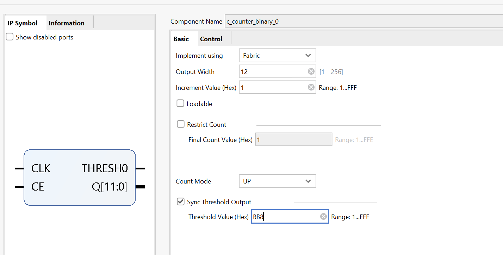
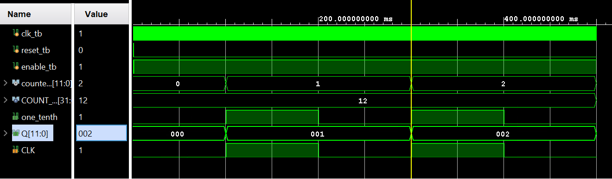

# Lab9_Counters, Timers and Real-Time Clock    

## Introduction

In the previous lab, you learned how the Architectural Wizard can be used to generate a desired clock
frequency and how the IP Catalog can be used to generate various cores including counters. These two
functional circuits are fundamental circuits used in creating timers and real-time clocks. In this lab, you will
generate several kinds of counters, timers, and real-time clocks.

## Parameter and defparam Statements 
The Verilog HDL language supports model parameterization, i.e. write a model in HDL and reuse the
same model number of times by passing different parameter values (typically widths and delays). Use
the ```parameter``` construct to define a parameterize-able model. There are two ways to change the values:
(i) during the instantiation of the module (shown in the example below), and (ii) using a ```defparam```
statement. Here is an example of defining a width as a parameter with a default value of 4.

**parameter** ```WIDTH = 4```; 

The parameter (WIDTH) must be defined before it can be used in the model. Here is an example, in
Verilog-2001 standard, of a dataflow model of ```reduction-or``` functionality. 

```verilog
module reduction_or #(parameter WIDTH = 4)(input ain[WIDTH-1:0], output
result);
assign result = |ain;
endmodule
module test_reduction_or_tb;
reg [3:0] ain1;
reg [6:0] ain2;
reg [9:0] ain3;
wire result1, result2, result3;
reduction_or U1 (ain1, result1); // use default value of 4
reduction_or #(7) U2 (ain2, result2); // use value of 7
reduction_or #(10) U3 (in3, result3); // use value of 10
endmodule 

```
Note that the parameter WIDTH is defined before it is used. In case of multiple parameter definitions, the
values listed during instantiation maps to the order in which the parameters are defined. In Verilog-2001
standard, all parameters values must be defined, even when some of the values are default values, in
case of multiple parameters. 

For example,

```verilog
module FA;
parameter AND_DELAY=2, XOR_DELAY=3;
… //gate-level model which uses AND_DELAY and XOR_DEALY in the gate instantiations
endmodule
module FA2BIT( ports listing);
FA #(4,5) f1(ports connections); // AND_DELAY will be 4 and XOR_DELAY will be 5
FA #(1,2) f2(ports conenctions); // AND_DELAY will be 1 and XOR_DELAY will be 2
endmodule 
```

The ```defparam``` statement can also be used to change the parameters value from a higher level module
by referencing the module instantiation. For example, 

```verilog
module TOP;
 defparam fa2.f1.AND_DELAY=4, fa2.f1.XOR_DELAY=5, fa2.f2.AND_DELAY=1,
fa2.f2.XOR_DELAY=2;
 FA2BIT fa2(ports connections);
endmodule 
```

The parameter definition can be in the same file where it is used or in a separate file (like a header file in
C programming language) and the header file could be included in the model using the `include
directive. For example, 

Let us define the following parameter in a file called header.v

```parameter WIDTH = 4;```

Then to use it in a file where reduction_or and test_reduction_or_tb modules are defined, use the
following line at the beginning of the file. 

```verlog
`include header.v // you can add a full path to the file if it is located
in some other directory path 
```

### Part9-1-1

Design a carry-look-ahead adder similar to that you designed in Part 4-1 of
Lab 2 but using gate-level modeling. Define 2 units delay for each kind of
gate that you use in the full-adder circuit using the parameter statements.
When creating hierarchical models, use 1 unit delay for inverters, 3 units
delay for and and or gates, and 4 units delay for xor gates. Use the module
instance parameter value assignment statement method. Develop a
testbench to verify the functionality and to see the delays propagated
through the hierarchy. 

**lab9_1_1.v**
```verilog
module my_inv(input wire a, output wire y);
    assign #1 y = ~a;  // 1 unit delay for inverters
endmodule

module my_and(input wire a, input wire b, output wire y);
    assign #3 y = a & b;  // 3 units delay for AND gates
endmodule

module my_or(input wire a, input wire b, output wire y);
    assign #3 y = a | b;  // 3 units delay for OR gates
endmodule

module my_xor(input wire a, input wire b, output wire y);
    assign #4 y = a ^ b;  // 4 units delay for XOR gates
endmodule

module full_adder(
    input wire a,
    input wire b,
    input wire cin,
    output wire sum,
    output wire cout
);
    wire p, g, h;

    my_xor xor1(a, b, p);  // Propagate
    my_xor xor2(p, cin, sum); // Sum
    my_and and1(a, b, g);  // Generate
    my_and and2(p, cin, h); // Half-generate
    my_or or1(g, h, cout); // Carry out
endmodule

module carry_look_ahead_adder(
    input wire [3:0] a,
    input wire [3:0] b,
    input wire cin,
    output wire [3:0] sum,
    output wire cout
);
    // Wire declarations for carries
    wire [3:0] c;

    // Assign first carry input
    assign c[0] = cin;

    // Instantiate the full adders
    full_adder fa0(a[0], b[0], c[0], sum[0], c[1]);
    full_adder fa1(a[1], b[1], c[1], sum[1], c[2]);
    full_adder fa2(a[2], b[2], c[2], sum[2], c[3]);
    full_adder fa3(a[3], b[3], c[3], sum[3], cout);
endmodule

```

* view the schematic of the synthesized design

<div align=center></div>

* Develop a testbench to test (see waveform above), perform behavioral simulation for 100ns, and
validate the design. 

**tb.v**
```verilog
module tb_carry_look_ahead_adder;
    reg [3:0] a, b;
    reg cin;
    wire [3:0] sum;
    wire cout;

    carry_look_ahead_adder cla_adder(a, b, cin, sum, cout);

    initial begin
        // Initialize inputs
        a = 0; b = 0; cin = 0;
        #10 a = 4'b1010; b = 4'b0101; cin = 0;
        #20 a = 4'b1111; b = 4'b1111; cin = 1;
        #30 $finish;
    end

    initial begin
        $monitor("Time=%t: a=%b, b=%b, cin=%b, sum=%b, cout=%b", $time, a, b, cin, sum, cout);
    end
endmodule
```

We can run Simulation to check the code by clicking the Run Simulation under the SIMULATION and choose the first Run Behavioral Simulation.

<div align=center></div>

### Part9-1-2

Modify the carry-look-ahead adder of 1-1 using the defparam statements,
changing the values of the delays from the testbench. Perform the
behavioral modeling simulation and observe the delays propagated
through the hierarchy.

**lab9_1_2.v**
```verilog
module my_inv_2(input a, output y);
    parameter delay = 1;
    assign #delay y = ~a;
endmodule

module my_and_2(input a, input b, output y);
    parameter delay = 3;
    assign #delay y = a & b;
endmodule

module my_or_2(input a, input b, output y);
    parameter delay = 3;
    assign #delay y = a | b;
endmodule

module my_xor_2(input a, input b, output y);
    parameter delay = 4;
    assign #delay y = a ^ b;
endmodule

module full_adder2(
    input wire a,
    input wire b,
    input wire cin,
    output wire sum,
    output wire cout
);
    wire p, g, h;

    my_xor_2 xor1(a, b, p);  // Propagate
    my_xor_2 xor2(p, cin, sum); // Sum
    my_and_2 and1(a, b, g);  // Generate
    my_and_2 and2(p, cin, h); // Half-generate
    my_or_2 or1(g, h, cout); // Carry out
endmodule

module carry_look_ahead_adder2(
    input wire [3:0] a,
    input wire [3:0] b,
    input wire cin,
    output wire [3:0] sum,
    output wire cout
);
    // Wire declarations for carries
    wire [3:0] c;

    // Assign first carry input
    assign c[0] = cin;

    // Instantiate the full adders
    full_adder2 fa2_0(a[0], b[0], c[0], sum[0], c[1]);
    full_adder2 fa2_1(a[1], b[1], c[1], sum[1], c[2]);
    full_adder2 fa2_2(a[2], b[2], c[2], sum[2], c[3]);
    full_adder2 fa2_3(a[3], b[3], c[3], sum[3], cout);
endmodule
```

* view the schematic of the synthesized design

<div align=center></div>

* Develop a testbench to test (see waveform above), perform behavioral simulation for 100ns, and
validate the design. 

**tb.v**
```verilog
module tb_carry_look_ahead_adder;
    reg [3:0] a, b;
    reg cin;
    wire [3:0] sum;
    wire cout;

    carry_look_ahead_adder2 cla_adder(.a(a), .b(b), .cin(cin), .sum(sum), .cout(cout));

   
        // Change gate delays
        defparam cla_adder.fa2_0.and1.delay = 5;
        defparam cla_adder.fa2_0.or1.delay = 2;
        defparam cla_adder.fa2_1.xor1.delay = 6;
        defparam cla_adder.fa2_2.xor2.delay = 7;

    initial begin // Initialize inputs
        a = 0; b = 0; cin = 0;
        #10 a = 4'b1010; b = 4'b0101; cin = 0;
        #20 a = 4'b1111; b = 4'b1111; cin = 1;
        #30 $finish;
    end

    initial begin
        $monitor("Time=%t: a=%b, b=%b, cin=%b, sum=%b, cout=%b", $time, a, b, cin, sum, cout);
    end
endmodule
```

We can run Simulation to check the code by clicking the Run Simulation under the SIMULATION and choose the first Run Behavioral Simulation.

<div align=center></div>


## Counters and Used Resources 

Counters are fundamental circuits used in measuring events. They may be classified as simple freerunning binary up counting, up/down counting, modulo-k counting, Johnson counting, gray-code counting,
and special sequence counting. In a given design or set of designs, designer use counters of different
widths a number of times. The parameter and defparam statements covered in Part 1 are used to obtain
different widths.

Counters normally use adder and subtractor circuits which can be implemented in the Xilinx FPGA either
using LUTs and/or FFs, or DSP48 slices. You can control the type of resources to be used by using the
synthesis attribute, called USE_DSP48 with a value of “yes” or “no”, in the Verilog code. USE_DSP48
instructs the synthesis tool how to deal with synthesis arithmetic structures. By default, mults, mult-add,
mult-sub, mult-accumulate type structures go into DSP48 blocks. Adders, subtractors, and accumulators
can also go into these blocks but by default, are implemented with the fabric instead of with DSP48
blocks. The USE_DSP48 attribute overrides the default behavior and force these structures into DSP48
blocks. The attribute can be placed in the RTL on signals and modules. 

For example, 

```verilog
(* use_dsp48 = "yes" *) // will force the use of DSP48 even on adders
module updown_ctr_behavior(
 input clk,
...
endmodule
(* use_dsp48 = "no" *) // will force not to use the DSP48 even on mults
module matrixmul_behavior(
 input clk,
...
endmodule 

```

### Part9-2-1

Design an 2-Bit up/down counter using behavioral modeling. Your model
should define COUNT_SIZE as a parameter and use it in the model. The
counter will use the on-board 100 MHz clock source. Define the synthesis attribute to not
to use the DSP48 slices. Go through the design flow, generate the bitstream and fill out the following information after reviewing the Project Summary tab.


**lab9_2_1.v**
```verilog
(* use_dsp48 = "no" *) 
module up_down_counter #(
    parameter COUNT_SIZE = 2  // Size of the counter
)(
    input clk,              // Clock input
    input reset,            // Asynchronous reset input
    input enable,           // Enable counting
    input up_down,          // Direction of count: 1 for up, 0 for down
    output reg [COUNT_SIZE-1:0] counter // Counter output
);

    // Counter Logic
    always @(posedge clk or posedge reset) begin
        if (reset) begin
            counter <= 0; // Reset counter to 0
        end else if (enable) begin
            if (up_down) begin
                counter <= counter + 1; // Count up
            end else begin
                counter <= counter - 1; // Count down
            end
        end
    end

endmodule

```

Add the appropriate board related master XDC file to the project and edit it to include the related pins like below:

<div align=center></div>

And then generate the bitstream and fill out the following information after reviewing the Project Summary tab.

1. Number of BUFG/BUFGCTRL _______________

2. Number of Slice LUTs used: _______________

3. Number of FF used: _______________

4. Number of DSP48E1 slices used: _______________

5. Number of IOs used: _______________ 


Click the ```Reports``` and click on the first ```Utilization - Synth Design``` and see the utilization.

<div align=center></div>

### Part9-2-2

Use the 2-Bit up/down counter design from 2-1. Set the synthesis attribute
to force the use of the DSP48 slices. Go through the design flow, generate the bitstream and fill out the following information after reviewing the Project Summary tab.


**lab9_2_1.v**
```verilog
(* use_dsp48 = "yes" *) 
module up_down_counter #(
    parameter COUNT_SIZE = 2  // Size of the counter
)(
    input clk,              // Clock input
    input reset,            // Asynchronous reset input
    input enable,           // Enable counting
    input up_down,          // Direction of count: 1 for up, 0 for down
    output reg [COUNT_SIZE-1:0] counter // Counter output
);

    // Counter Logic
    always @(posedge clk or posedge reset) begin
        if (reset) begin
            counter <= 0; // Reset counter to 0
        end else if (enable) begin
            if (up_down) begin
                counter <= counter + 1; // Count up
            end else begin
                counter <= counter - 1; // Count down
            end
        end
    end

endmodule

```

Add the appropriate board related master XDC file to the project and edit it to include the related pins like below:

<div align=center></div>

And then generate the bitstream and fill out the following information after reviewing the Project Summary tab.

1. Number of BUFG/BUFGCTRL _______________

2. Number of Slice LUTs used: _______________

3. Number of FF used: _______________

4. Number of DSP48E1 slices used: _______________

5. Number of IOs used: _______________ 

Click the ```Reports``` and click on the first ```Utilization - Synth Design``` and see the utilization.

<div align=center></div>

### Part9-2-3

Design an 2-Bit up/down counter using the 2-Bit core generated using the
IP Catalog. When generating the core, set the setting to use the fabric
resource. Go through the design flow, generate the bitstream and fill out the following information after reviewing the Project Summary tab.

<div align=center></div>

<div align=center></div>

**lab9_2_1.v**
```verilog
module instantiate_counter(
            input clk,
            input ce,
            input up,
            output [1:0] q
);

c_counter_binary_0 your_instance_name (
  .CLK(clk),  // input wire CLK
  .CE(ce),    // input wire CE
  .UP(up),    // input wire UP
  .Q(q)      // output wire [1 : 0] Q
);


```

Add the appropriate board related master XDC file to the project and edit it to include the related pins like below:

<div align=center></div>

And then generate the bitstream and fill out the following information after reviewing the Project Summary tab.

1. Number of BUFG/BUFGCTRL _______________

2. Number of Slice LUTs used: _______________

3. Number of FF used: _______________

4. Number of DSP48E1 slices used: _______________

5. Number of IOs used: _______________ 

Click the ```Reports``` and click on the first ```Utilization - Synth Design``` and see the utilization.

<div align=center></div>

### Part9-2-4

Use the 2-Bit up/down counter design from 2-1. Set the synthesis attribute
to force the use of the DSP48 slices. Go through the design flow, generate the bitstream and fill out the following information after reviewing the Project Summary tab.

Double click on the ```c_counter_binary_0``` and have a change like below:

<div align=center></div>

Add the appropriate board related master XDC file to the project and edit it to include the related pins like below:

<div align=center></div>

And then generate the bitstream and fill out the following information after reviewing the Project Summary tab.

1. Number of BUFG/BUFGCTRL _______________

2. Number of Slice LUTs used: _______________

3. Number of FF used: _______________

4. Number of DSP48E1 slices used: _______________

5. Number of IOs used: _______________ 

Click the ```Reports``` and click on the first ```Utilization - Synth Design``` and see the utilization.

<div align=center></div>

## Timers and Real-Time Clock 

Timers and real-time clock are natural applications of counters. The timers include a stop-watch timer and
a lapse timer. The real-time clocks are used in a day to day life for keeping track of the time of the day. 

### Part9-3-1

Design a stop-watch timer using the IP Catalog to generate an appropriate
sized (precision) counter core with the desired input control signals to
measure a time up to five minutes at a resolution of one-tenth of a second. 


1. Resolution: One-tenth of a second means the stopwatch should be capable of incrementing every 0.1 seconds (100 milliseconds).

2. Maximum time: Five minutes is the total duration we need to measure. Since there are 300 seconds in five minutes, and we're measuring tenths of seconds, the maximum count we need is 3000 (300 seconds * 10 tenths/second).

3. Counter size: We need enough bits to count up to 3000. We calculate the minimum number of bits required using the formula: bits = ceil(log2(max_count)). In this case, ceil(log2(3000)), which is approximately 12 bits.

4. Generate Counter IP:

* Open your FPGA design tool and go to the IP Catalog.

* Find a counter IP core, which might be named "Binary Counter" or "C_Counter_Binary."" And have a setting like below:

<div align=center></div>

* Clock Division:

You also need to generate a clock with a period of 100 ms (0.1 seconds). We can Useusee Use a  wizard to generate a 5 MHz clock from the onboard 100 MHz clock source, dividing it further by a clock divider to generate a periodic 100 ms signal.  

* Connect this slower clock to the counter's clock input.

**lab9_3_1.v**
```verilog
module up_five_minutes #(
    parameter COUNT_SIZE = 12  // Defines the size of the counter, set for a 12-bit counter
)(
    input clk,              // Clock input, expected to be a higher frequency like 100 MHz
    input reset,            // Asynchronous reset input to reset the counter
    input enable,           // Enable signal for the counter, when high, the counter counts
    output wire [COUNT_SIZE-1:0] counter, // The 12-bit counter output
    output wire THRESH0     // Threshold output, goes high when counter reaches set value
);

// Intermediate signal declaration for the one-tenth second pulse
wire one_tenth;

// Instantiation of module generating one-tenth second clock pulses
top_module one_tenth_clk(
    .clk_in1(clk),
    .reset(reset),
    .one_tenth(one_tenth)   // Generates one-tenth second pulse from the main clock
);
    
// Counter module instantiation to count up to five minutes
c_counter_binary_0 counter_FIVE(
    .CLK(one_tenth),        // Connects the one-tenth second pulse as clock input
    .CE(enable),            // Connect enable signal to Counter Enable input
    .THRESH0(THRESH0),      // Output goes high when the counter reaches a threshold
    .Q(counter)            // The actual count value
);

endmodule

// Top module to divide down the clock to one-tenth of a second pulses
module top_module(
    input wire clk_in1,    // The primary high-frequency clock input, e.g., 100 MHz
    input wire reset,      // Global reset signal
    output wire one_tenth  // Generated clock pulse every one-tenth of a second
);

// Signal declarations
wire clk_5MHz;            // Intermediate clock signal, 5 MHz obtained from clock wizard
wire locked_q;            // Lock indicator from the clock wizard

// Clock wizard instantiation to reduce 100 MHz clock to 5 MHz
clk_wiz_0 clk_wizard_inst(
    .clk_out1(clk_5MHz),  // 5 MHz output clock
    .locked(locked_q),    // Indicates when the clock is stabilized
    .clk_in1(clk_in1)     // Input clock from the main system clock (e.g., 100 MHz)
);

// Clock divider instantiation to generate one-tenth of a second pulse
clock_divider clk_divider_inst(
    .clk_in(clk_5MHz),    // Input clock from the clock wizard (5 MHz)
    .reset(reset),        // Reset signal to reinitialize the divider
    .clk_out(one_tenth)   // Output clock with a period of one-tenth of a second
);

endmodule

// Clock divider module, used to create slower clock signals
module clock_divider(
    input clk_in,         // Input clock, here it is 5 MHz from clock wizard
    input reset,          // Active high reset to reset the counter
    output reg clk_out = 0 // Output clock, initially set to 0, toggles every one-tenth second
);

// Counter for clock division, big enough to count up to the 5 MHz
reg [22:0] counter = 0;   // Counter to reach one-tenth second at 5 MHz input

// Clock division logic
always @(posedge clk_in or posedge reset) begin
    if (reset) begin       // Reset logic
        counter <= 0;
        clk_out <= 0;
    end else begin
        if(counter == 5_000_00 - 1) begin // Count up to one-tenth second (5,000,000 cycles at 5 MHz)
            counter <= 0;
            clk_out <= ~clk_out; // Toggle clock output every one-tenth second
        end else begin
            counter <= counter + 1; // Normal counting
        end
    end
end

endmodule

```

**tb.v**
```verilog
module tb_up_five_minutes();

parameter COUNT_SIZE = 12; // Define counter size parameter for easy modification

// Testbench signals
reg clk_tb;          // Clock signal for testbench
reg reset_tb;        // Reset signal for testbench
reg enable_tb;       // Enable signal for testbench
wire [COUNT_SIZE-1:0] counter_tb; // Counter output from UUT
wire THRESH0;        // Threshold signal indicating when count reaches specific value

// Instance of the up_five_minutes module
up_five_minutes #(
    .COUNT_SIZE(COUNT_SIZE)
) uut (
    .clk(clk_tb),
    .reset(reset_tb),
    .enable(enable_tb),
    .counter(counter_tb),
    .THRESH0(THRESH0)
);

// Clock generation block
initial begin
    clk_tb = 0;
    forever #5 clk_tb = ~clk_tb; // Generate a 100MHz clock assuming time unit is 1ns
end

// Test sequence block
initial begin
    // Initialize inputs
    reset_tb = 1;     // Assert reset initially
    enable_tb = 0;    // Disable the counter initially
    #100;  // Wait 100ns for global reset conditions to settle

    reset_tb = 0;     // Release reset to allow the counter to operate
    #100;  // Wait another 100ns before enabling the counter

    // Enable the counter and let it run
    enable_tb = 1;    // Enable counting
    #1_000_000; // Let's run for 1ms simulation time which should be sufficient to see some counting

    // End the simulation phase
    enable_tb = 0;    // Disable the counter to stop counting
    #100; // Observe for a little while longer before finishing the simulation

    // $finish; // Uncomment to end the simulation explicitly
end

// Monitoring block
initial begin
    $monitor("Time=%t: reset=%b, enable=%b, counter=%d", $time, reset_tb, enable_tb, counter_tb);
    // This line continuously displays the time, reset status, enable status, and counter value
end

endmodule

```
And we can run Simulation to check the code by clicking the Run Simulation under the SIMULATION and choose the first Run Behavioral Simulation. We need to change the simulation time to 500ms.

<div align=center></div>

## Conclusion

In this lab, you learned how to parameterize models so they can be used in subsequent designs. You
also designed and compared the resources usage of counters modeled behaviorally and using the IP
Catalog. You also designed clocking applications using the counters. 
